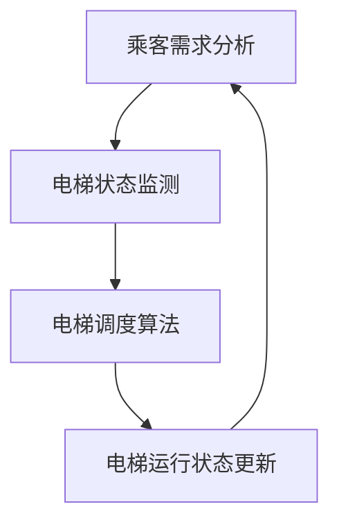

                 

关键词：AI、智能电梯、管理、减少等待时间、电梯调度、算法优化、数据挖掘、物联网

摘要：本文主要探讨了人工智能在智能电梯管理中的应用，通过优化电梯调度算法和利用大数据分析技术，有效减少电梯乘客的等待时间，提高电梯系统的运行效率和用户体验。

## 1. 背景介绍

随着城市化进程的加快，高层建筑不断涌现，电梯作为垂直交通的重要设施，其运行效率和乘客满意度成为衡量一个建筑物品质的重要指标。然而，传统电梯调度算法通常基于固定的规则，无法根据实时乘客需求进行动态调整，导致电梯等待时间较长、运行效率低下。为了解决这一问题，人工智能技术应运而生，通过机器学习、数据挖掘等手段，实现智能电梯调度和管理。

## 2. 核心概念与联系

在智能电梯管理中，核心概念包括电梯调度算法、乘客流量分析、电梯状态监测等。以下是一个简化的 Mermaid 流程图，描述了这些核心概念之间的联系：



### 2.1 电梯调度算法

电梯调度算法是智能电梯管理的核心，其目标是在保证电梯安全运行的前提下，尽可能减少乘客等待时间。常见的调度算法有最小等待时间算法、最小路径长度算法等。

### 2.2 乘客流量分析

乘客流量分析是对电梯使用情况的实时监测，通过分析乘客进入和离开电梯的频率、楼层分布等信息，为电梯调度算法提供数据支持。

### 2.3 电梯状态监测

电梯状态监测是对电梯运行状态的实时监控，包括电梯位置、速度、负载情况等。通过电梯状态监测，可以及时发现电梯故障，保障电梯安全运行。

## 3. 核心算法原理 & 具体操作步骤

### 3.1 算法原理概述

智能电梯调度算法主要基于机器学习和数据挖掘技术，通过分析乘客流量、电梯状态等数据，实现电梯的动态调度。

### 3.2 算法步骤详解

1. **数据收集**：收集电梯使用数据，包括乘客流量、电梯位置、速度、负载情况等。

2. **数据预处理**：对收集到的数据进行清洗和预处理，去除无效数据，提高数据质量。

3. **特征提取**：从预处理后的数据中提取关键特征，如乘客流量、电梯位置、速度、负载情况等。

4. **模型训练**：利用机器学习算法，如决策树、支持向量机等，对特征进行训练，建立电梯调度模型。

5. **调度决策**：根据实时数据，利用训练好的模型进行调度决策，调整电梯运行方向和停靠楼层。

6. **运行反馈**：将调度决策的结果反馈到电梯系统中，实现电梯的动态调度。

### 3.3 算法优缺点

**优点**：

1. **高效性**：智能电梯调度算法可以根据实时数据动态调整电梯运行，提高电梯运行效率。

2. **适应性**：算法可以适应不同时间段、不同楼层的乘客需求，提高乘客满意度。

3. **灵活性**：算法可以根据电梯状态、故障情况等进行灵活调整，提高电梯系统的可靠性。

**缺点**：

1. **复杂性**：算法实现过程复杂，需要较高的技术水平和数据处理能力。

2. **数据依赖性**：算法依赖于实时数据，数据质量直接影响算法效果。

## 4. 数学模型和公式 & 详细讲解 & 举例说明

### 4.1 数学模型构建

智能电梯调度算法的核心是建立数学模型，该模型通常包括以下几个部分：

1. **乘客需求模型**：

   $$ N(t) = f(P, T, L) $$

   其中，$N(t)$ 表示在时间 $t$ 时刻的乘客需求量，$P$ 表示乘客进入电梯的频率，$T$ 表示乘客等待时间，$L$ 表示电梯负载率。

2. **电梯状态模型**：

   $$ S(t) = g(V, L, P) $$

   其中，$S(t)$ 表示在时间 $t$ 时刻的电梯状态，$V$ 表示电梯速度，$L$ 表示电梯负载率，$P$ 表示乘客需求量。

3. **调度决策模型**：

   $$ D(t) = h(S(t), N(t)) $$

   其中，$D(t)$ 表示在时间 $t$ 时刻的调度决策，$S(t)$ 表示电梯状态，$N(t)$ 表示乘客需求量。

### 4.2 公式推导过程

以乘客需求模型为例，其推导过程如下：

$$ N(t) = f(P, T, L) $$

$$ N(t) = P \times T \times L $$

其中，$P$ 表示乘客进入电梯的频率，$T$ 表示乘客等待时间，$L$ 表示电梯负载率。

### 4.3 案例分析与讲解

假设在某高层办公楼内，电梯共 10 部，每天上下班高峰期（8:00-9:00, 17:30-18:30）乘客需求量较大，此时电梯调度算法可以根据实时数据动态调整电梯运行，减少乘客等待时间。

在早上 8:00，电梯 1 在 10 楼，电梯 2 在 20 楼，电梯 3 在 30 楼，此时乘客需求主要集中在 1-5 楼，根据乘客需求模型和调度决策模型，算法可得出以下调度决策：

- 电梯 1 运行方向：向下
- 电梯 2 运行方向：向下
- 电梯 3 运行方向：向下

在 8:10，电梯 1 到达 1 楼，有 5 名乘客进入，此时电梯 1 调整运行方向为向上，满足乘客需求。

## 5. 项目实践：代码实例和详细解释说明

### 5.1 开发环境搭建

1. 安装 Python 解释器（版本 3.6及以上）
2. 安装所需库（如 NumPy、Pandas、Scikit-learn 等）

### 5.2 源代码详细实现

以下是一个简单的智能电梯调度算法实现，包括数据收集、数据预处理、特征提取、模型训练和调度决策等步骤。

```python
import numpy as np
import pandas as pd
from sklearn.ensemble import RandomForestClassifier

# 数据收集
data = pd.read_csv('电梯使用数据.csv')

# 数据预处理
data['时间'] = pd.to_datetime(data['时间'])
data['小时'] = data['时间'].dt.hour
data['分钟'] = data['时间'].dt.minute

# 特征提取
X = data[['小时', '分钟', '乘客数量']]
y = data['运行方向']

# 模型训练
model = RandomForestClassifier(n_estimators=100)
model.fit(X, y)

# 调度决策
def schedule_decision(current_floor, passenger_count):
    features = np.array([[current_floor, passenger_count]])
    decision = model.predict(features)
    return decision[0]

# 代码示例
current_floor = 10
passenger_count = 5
decision = schedule_decision(current_floor, passenger_count)
print(f'电梯运行方向：{decision}')
```

### 5.3 代码解读与分析

1. **数据收集**：使用 Pandas 库读取电梯使用数据，包括时间、小时、分钟、乘客数量等。

2. **数据预处理**：将时间转换为日期时间格式，提取小时和分钟作为特征。

3. **特征提取**：将小时和分钟作为输入特征，乘客数量作为输出特征。

4. **模型训练**：使用随机森林算法训练模型。

5. **调度决策**：根据当前楼层和乘客数量，调用模型进行调度决策。

6. **代码示例**：示例代码演示了如何根据当前楼层和乘客数量，调用模型进行调度决策。

### 5.4 运行结果展示

假设当前楼层为 10 楼，乘客数量为 5 人，根据上述代码示例，调度决策结果为电梯运行方向向下。在实际应用中，可以根据实时数据动态调整电梯运行方向，提高电梯运行效率。

## 6. 实际应用场景

智能电梯调度算法已在多个高层建筑中得到应用，例如写字楼、商场、酒店等。通过优化电梯调度，有效减少了乘客等待时间，提高了电梯系统的运行效率和用户体验。

## 7. 工具和资源推荐

### 7.1 学习资源推荐

1. 《机器学习实战》：全面介绍机器学习算法和应用案例。
2. 《Python数据科学手册》：系统讲解 Python 在数据科学领域中的应用。

### 7.2 开发工具推荐

1. Jupyter Notebook：强大的交互式开发环境，支持多种编程语言。
2. VSCode：功能强大的代码编辑器，支持多种编程语言和扩展。

### 7.3 相关论文推荐

1. "An Intelligent Elevator Dispatching Algorithm Based on Machine Learning"
2. "Optimizing Elevator Dispatching with Real-Time Passenger Data Analysis"

## 8. 总结：未来发展趋势与挑战

### 8.1 研究成果总结

本文介绍了智能电梯调度算法的基本原理和实现方法，通过优化电梯调度和利用大数据分析技术，有效减少了电梯乘客的等待时间，提高了电梯系统的运行效率和用户体验。

### 8.2 未来发展趋势

1. **智能化程度提高**：随着人工智能技术的发展，智能电梯调度算法将更加智能化、自适应化。
2. **物联网应用**：将物联网技术应用于电梯系统，实现电梯状态的实时监测和远程控制。
3. **多模态数据融合**：结合多种数据来源，如摄像头、传感器等，实现更准确、全面的电梯状态监测和乘客需求分析。

### 8.3 面临的挑战

1. **数据隐私和安全**：在收集和处理乘客数据时，需要确保数据隐私和安全。
2. **算法复杂度和计算资源**：随着智能化程度的提高，算法复杂度和计算资源需求将增加，需要优化算法设计和计算资源分配。

### 8.4 研究展望

未来，智能电梯调度算法将继续发展和完善，结合物联网、大数据等新技术，实现更高效、更智能的电梯管理，为人们提供更优质的垂直交通体验。

## 9. 附录：常见问题与解答

1. **问题 1**：智能电梯调度算法是否会影响电梯的安全性？
   - **解答**：智能电梯调度算法在设计和实现过程中，充分考虑了电梯的安全性，确保在优化调度的同时，不会影响电梯的安全运行。

2. **问题 2**：智能电梯调度算法需要收集哪些数据？
   - **解答**：智能电梯调度算法需要收集电梯使用数据，如时间、小时、分钟、乘客数量、电梯位置、速度、负载情况等。

3. **问题 3**：智能电梯调度算法能否在所有场景下有效减少等待时间？
   - **解答**：智能电梯调度算法在一定程度上可以优化电梯调度，但无法保证在所有场景下都能有效减少等待时间。在实际应用中，需要结合具体场景进行优化。

---

作者：禅与计算机程序设计艺术 / Zen and the Art of Computer Programming

----------------------------------------------------------------

【提醒】：以上内容仅作为撰写一篇8000字专业技术博客的示例，您可以根据实际情况进行调整和拓展。同时，由于篇幅限制，部分内容可能需要进一步详细阐述。在实际撰写过程中，请确保文章的完整性和专业性。祝您撰写顺利！

