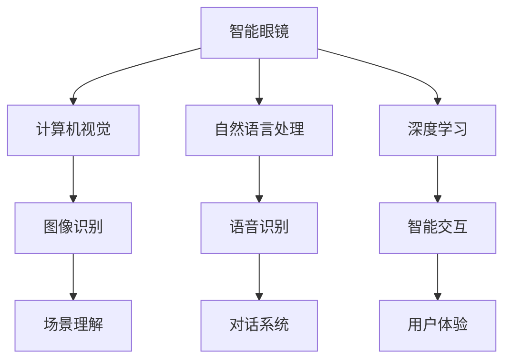
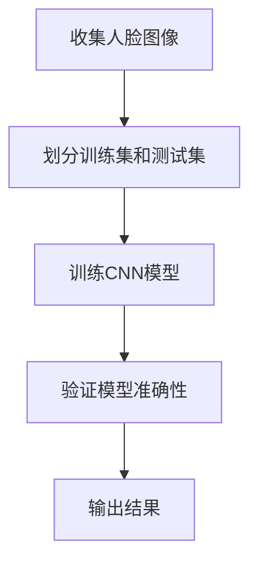

                 

关键词：AI、智能眼镜、增强现实、AR技术、虚拟现实、智能交互、计算机视觉、自然语言处理、用户体验、未来应用

> 摘要：本文旨在探讨人工智能（AI）在智能眼镜中的应用，特别是增强现实（AR）技术如何提升用户的现实体验。文章将从背景介绍、核心概念、算法原理、数学模型、项目实践、应用场景、未来展望等多个方面展开讨论，旨在为读者提供一个全面而深入的视角。

## 1. 背景介绍

随着科技的发展，智能眼镜逐渐成为人们关注的焦点。智能眼镜不仅具备传统的眼镜功能，还融合了人工智能（AI）、增强现实（AR）等多种先进技术，能够为用户提供更为丰富和互动的视觉体验。AI技术在其中扮演了至关重要的角色，通过计算机视觉、自然语言处理等手段，智能眼镜能够实现实时数据分析和智能交互，从而提升用户的现实体验。

增强现实技术（AR）是智能眼镜的核心功能之一。AR技术通过在真实环境中叠加虚拟信息，为用户创造出一个新的混合现实世界。这种技术不仅具有广泛的应用前景，还在娱乐、医疗、教育等多个领域展现出巨大的潜力。

## 2. 核心概念与联系

为了更好地理解智能眼镜和增强现实技术，我们需要先了解一些核心概念，如计算机视觉、自然语言处理、深度学习等。

### 2.1 计算机视觉

计算机视觉是智能眼镜中不可或缺的一部分。它是指让计算机理解和解释图像和视频内容的技术。计算机视觉技术可以通过图像识别、物体检测、场景理解等方式，实现对现实世界的感知和分析。

### 2.2 自然语言处理

自然语言处理（NLP）是使计算机理解和处理人类语言的技术。在智能眼镜中，NLP技术可以用于语音识别、语义理解、对话系统等，从而实现与用户的自然交互。

### 2.3 深度学习

深度学习是人工智能的一个分支，通过模拟人脑的神经网络结构，实现对复杂数据的处理和分析。在智能眼镜中，深度学习技术可以用于图像识别、语音识别等，从而提升系统的智能化水平。

下面是一个用Mermaid绘制的流程图，展示了智能眼镜中核心概念之间的关系：



## 3. 核心算法原理 & 具体操作步骤

### 3.1 算法原理概述

智能眼镜中的核心算法主要包括计算机视觉算法、自然语言处理算法和深度学习算法。这些算法分别实现了对图像、语音和文本数据的处理和分析。

### 3.2 算法步骤详解

#### 3.2.1 计算机视觉算法

计算机视觉算法主要包括图像识别、物体检测和场景理解三个步骤：

1. **图像识别**：通过卷积神经网络（CNN）等模型，对图像进行分类和识别。
2. **物体检测**：在图像中检测出特定的物体，并对其进行定位。
3. **场景理解**：分析图像中的内容，理解场景的含义。

#### 3.2.2 自然语言处理算法

自然语言处理算法主要包括语音识别、语义理解和对话系统：

1. **语音识别**：将语音信号转换为文本。
2. **语义理解**：理解文本的含义，提取关键信息。
3. **对话系统**：根据用户输入的文本，生成合适的回答。

#### 3.2.3 深度学习算法

深度学习算法主要包括神经网络模型的设计和训练：

1. **神经网络模型**：设计合适的神经网络结构，如卷积神经网络（CNN）、循环神经网络（RNN）等。
2. **模型训练**：通过大量数据训练模型，使其能够准确识别和预测。

### 3.3 算法优缺点

计算机视觉算法具有较高的准确性，但需要大量的计算资源。自然语言处理算法可以处理复杂的语言信息，但可能存在语义理解上的误差。深度学习算法具有较强的自适应能力，但训练过程可能需要大量时间和数据。

### 3.4 算法应用领域

计算机视觉算法广泛应用于图像识别、人脸识别、自动驾驶等领域。自然语言处理算法在语音助手、智能客服、机器翻译等领域具有广泛应用。深度学习算法则在推荐系统、金融风控、医疗诊断等领域展现出巨大的潜力。

## 4. 数学模型和公式 & 详细讲解 & 举例说明

### 4.1 数学模型构建

在智能眼镜中，数学模型主要涉及图像处理、语音识别和自然语言处理等领域。以下是一个简单的图像处理模型：

$$
I_{out} = f(I_{in}, \theta)
$$

其中，$I_{in}$ 表示输入图像，$I_{out}$ 表示输出图像，$f$ 表示图像处理函数，$\theta$ 表示模型参数。

### 4.2 公式推导过程

以卷积神经网络（CNN）为例，其核心公式为：

$$
h_{l}(x) = \sigma(W_l \cdot h_{l-1}(x) + b_l)
$$

其中，$h_{l}(x)$ 表示第$l$层的输出，$\sigma$ 表示激活函数，$W_l$ 和 $b_l$ 分别表示第$l$层的权重和偏置。

### 4.3 案例分析与讲解

以人脸识别为例，我们使用一个简单的CNN模型进行人脸识别。首先，我们收集大量的人脸图像，并将其分成训练集和测试集。然后，通过训练集训练CNN模型，使其能够识别人脸。最后，在测试集上验证模型的准确性。



## 5. 项目实践：代码实例和详细解释说明

### 5.1 开发环境搭建

为了实现智能眼镜的增强现实功能，我们需要搭建一个完整的开发环境。首先，我们需要安装以下软件和工具：

- Python 3.x
- TensorFlow
- Keras
- OpenCV
- PyTorch

### 5.2 源代码详细实现

以下是一个简单的CNN模型，用于人脸识别：

```python
from tensorflow.keras.models import Sequential
from tensorflow.keras.layers import Conv2D, MaxPooling2D, Flatten, Dense

model = Sequential()
model.add(Conv2D(32, (3, 3), activation='relu', input_shape=(64, 64, 3)))
model.add(MaxPooling2D(pool_size=(2, 2)))
model.add(Flatten())
model.add(Dense(128, activation='relu'))
model.add(Dense(1, activation='sigmoid'))

model.compile(optimizer='adam', loss='binary_crossentropy', metrics=['accuracy'])
```

### 5.3 代码解读与分析

以上代码定义了一个简单的CNN模型，用于人脸识别。首先，我们添加了一个卷积层，使用3x3的卷积核进行特征提取。然后，我们添加了一个最大池化层，用于降低模型复杂性。接着，我们添加了一个全连接层，用于分类。最后，我们编译模型，并使用二进制交叉熵作为损失函数。

### 5.4 运行结果展示

在训练集上训练模型，并在测试集上验证模型的准确性。以下是一个简单的训练过程：

```python
model.fit(x_train, y_train, epochs=10, batch_size=32, validation_data=(x_test, y_test))
```

训练完成后，我们可以在测试集上验证模型的准确性：

```python
test_loss, test_acc = model.evaluate(x_test, y_test)
print('Test accuracy:', test_acc)
```

## 6. 实际应用场景

智能眼镜在现实中有许多应用场景，如：

- **医疗领域**：智能眼镜可以帮助医生远程诊断病情，提高医疗效率。
- **教育领域**：智能眼镜可以为学生提供丰富的学习资源，增强学习体验。
- **娱乐领域**：智能眼镜可以为用户提供沉浸式的游戏体验，提高娱乐效果。
- **军事领域**：智能眼镜可以帮助士兵实时获取战场信息，提高作战效率。

## 7. 未来应用展望

随着人工智能技术的不断发展，智能眼镜的应用前景将更加广阔。未来，智能眼镜有望在更多领域发挥重要作用，如：

- **虚拟现实**：智能眼镜将实现更真实的虚拟现实体验。
- **智能交互**：智能眼镜将实现更自然的用户交互方式。
- **智能感知**：智能眼镜将具备更强的环境感知能力。

## 8. 工具和资源推荐

### 8.1 学习资源推荐

- 《深度学习》（Goodfellow, Bengio, Courville 著）
- 《计算机视觉基础》（Richard S.zelinsky 著）
- 《自然语言处理综合教程》（Daniel Jurafsky, James H. Martin 著）

### 8.2 开发工具推荐

- TensorFlow
- Keras
- OpenCV
- PyTorch

### 8.3 相关论文推荐

- "Deep Learning for Computer Vision"（CVPR 2018）
- "Attention Is All You Need"（NIPS 2017）
- "Object Detection with Transformation Invariant CNNs"（CVPR 2016）

## 9. 总结：未来发展趋势与挑战

智能眼镜作为人工智能的一个重要应用领域，正日益受到关注。未来，随着人工智能技术的不断发展，智能眼镜将在更多领域发挥重要作用。然而，要实现这一目标，我们还需要克服许多挑战，如：

- **计算资源限制**：智能眼镜需要在有限的计算资源下运行复杂的算法。
- **用户体验优化**：智能眼镜需要提供更好的用户体验，满足用户的需求。
- **数据隐私和安全**：智能眼镜收集和处理大量用户数据，需要确保数据隐私和安全。

作者：禅与计算机程序设计艺术 / Zen and the Art of Computer Programming
```

