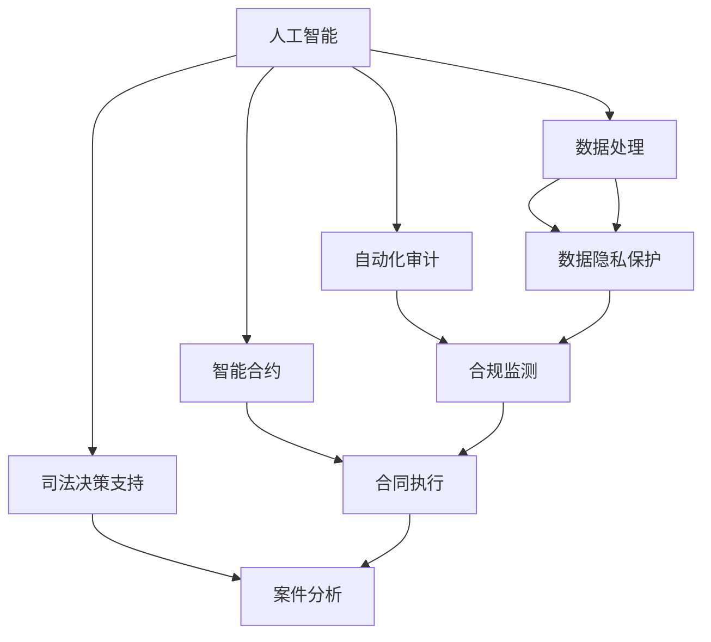

                 

关键词：人工智能，法律合规，数据隐私，自动化审计，智能合约，司法决策支持

> 摘要：随着人工智能技术的迅猛发展，其在法律和合规领域中的应用逐渐成为行业焦点。本文将探讨AI在法律和合规领域的多重应用，包括数据隐私保护、自动化审计、智能合约的执行以及司法决策支持，并分析这些应用带来的变革和挑战。

## 1. 背景介绍

在全球化与数字化加速发展的背景下，法律和合规领域面临着前所未有的挑战。法律文件和合同的数量急剧增加，使得传统的人工处理方式变得低效且容易出错。与此同时，数据隐私保护和合规要求的复杂性不断提升，对企业的法律合规团队提出了更高的要求。人工智能（AI）作为一种新兴的技术手段，能够通过其强大的数据处理和分析能力，为法律和合规领域带来显著的变革。

### 1.1 法律和合规领域的主要挑战

- **数据处理量增大**：随着互联网和大数据的发展，企业面临的数据量呈指数级增长，使得人工处理效率低下。
- **合规要求复杂化**：全球各地的法律法规不断更新，合规要求日益复杂，企业难以全面掌握。
- **成本上升**：法律和合规工作的成本不断上升，尤其是跨国企业需要投入大量资源来满足不同国家和地区的合规要求。
- **决策效率低下**：复杂的法律问题需要专业知识和经验，人工决策效率低下，且容易受到主观因素的影响。

### 1.2 人工智能的潜在优势

- **数据处理能力**：AI能够高效处理和分析海量数据，快速提取关键信息，提高工作效率。
- **自动化执行**：通过智能合约等技术，AI可以实现法律条款的自动化执行，减少人为干预和错误。
- **合规监测与报告**：AI能够实时监测合规情况，自动生成合规报告，确保企业合规性。
- **决策支持**：AI可以辅助法律专家进行复杂法律问题的分析和决策，提高决策的准确性和效率。

## 2. 核心概念与联系

### 2.1 核心概念

- **人工智能**：一种模拟人类智能的技术，通过算法和数据实现自动化推理和决策。
- **数据隐私**：个人信息的保护，确保数据不被未授权访问、使用或泄露。
- **自动化审计**：使用AI技术自动执行审计过程，提高审计效率和准确性。
- **智能合约**：基于区块链技术的自动执行合同条款的协议。
- **司法决策支持**：利用AI辅助法官和律师进行案件分析和决策。

### 2.2 架构关系图

下面是一个简化的Mermaid流程图，展示了AI在法律和合规领域中的核心概念及其联系：



## 3. 核心算法原理 & 具体操作步骤

### 3.1 算法原理概述

AI在法律和合规领域的应用主要依赖于以下核心算法：

- **机器学习**：通过训练模型识别数据中的规律和模式，用于自动化审计和案件分析。
- **自然语言处理（NLP）**：用于理解文本数据，提取关键信息，应用于合同分析和司法决策支持。
- **深度学习**：通过多层神经网络提取复杂的数据特征，用于更复杂的法律问题分析。
- **强化学习**：用于智能合约的自动执行，通过不断学习优化合同执行策略。

### 3.2 算法步骤详解

#### 3.2.1 数据处理

1. 数据收集：收集相关的法律文件、合同文本、审计数据等。
2. 数据预处理：清洗数据，去除噪声，标准化数据格式。
3. 特征提取：提取文本数据的关键特征，如词频、词向量等。
4. 模型训练：使用机器学习或深度学习算法训练模型。

#### 3.2.2 自动化审计

1. 制定审计策略：根据审计目标和法律要求，制定自动化审计策略。
2. 数据采集：自动采集与审计相关的数据。
3. 数据分析：使用机器学习算法分析数据，识别潜在的风险点。
4. 报告生成：自动生成审计报告，包括发现的问题和风险建议。

#### 3.2.3 智能合约

1. 合同条款分析：使用NLP技术分析合同条款，提取关键信息。
2. 智能合约编写：根据分析结果编写智能合约代码。
3. 合同执行：使用区块链技术自动执行合同条款。
4. 监控与调整：实时监控合同执行情况，根据实际情况调整智能合约。

#### 3.2.4 司法决策支持

1. 案件数据收集：收集与案件相关的法律文件、证据等。
2. 数据处理：使用NLP和机器学习技术处理数据，提取关键信息。
3. 案件分析：基于数据模型进行案件分析，提供决策支持。
4. 决策生成：生成案件分析报告和决策建议。

### 3.3 算法优缺点

#### 优点

- **效率高**：自动化处理大量数据，提高工作效率。
- **准确性高**：通过机器学习和深度学习，提高分析准确性。
- **成本低**：减少人工处理成本，降低合规成本。
- **实时性**：实时监测和报告，提高合规性。

#### 缺点

- **依赖数据质量**：数据质量直接影响算法效果。
- **算法透明性**：机器学习算法的决策过程往往不透明，需要解释性。
- **技术门槛**：需要专业的AI技术和数据处理能力。

### 3.4 算法应用领域

- **自动化审计**：适用于企业内部审计、财务审计等。
- **智能合约**：适用于金融、供应链、知识产权等领域。
- **司法决策支持**：适用于司法审判、法律咨询、法律服务等领域。

## 4. 数学模型和公式 & 详细讲解 & 举例说明

### 4.1 数学模型构建

AI在法律和合规领域的应用涉及多种数学模型，以下是一个简化的数学模型示例：

#### 合规监测模型

设 \( X \) 为企业合规情况的数据集，\( Y \) 为合规评分，则：

\[ Y = f(X) \]

其中，函数 \( f \) 可以通过机器学习算法训练得到。

### 4.2 公式推导过程

假设我们使用线性回归模型进行合规监测，则：

\[ Y = \beta_0 + \beta_1X_1 + \beta_2X_2 + ... + \beta_nX_n \]

其中，\( \beta_0 \) 为截距，\( \beta_1, \beta_2, ..., \beta_n \) 为系数，\( X_1, X_2, ..., X_n \) 为特征变量。

### 4.3 案例分析与讲解

#### 案例背景

某企业需要进行财务审计，需要根据审计数据判断企业的财务合规性。

#### 数据收集

收集了过去一年的财务报表、交易记录等数据。

#### 数据预处理

清洗数据，去除异常值，标准化数据。

#### 特征提取

提取与财务合规相关的特征，如收入、支出、利润等。

#### 模型训练

使用线性回归模型训练模型，得到回归系数。

#### 案例应用

根据模型预测，企业的财务合规评分。

## 5. 项目实践：代码实例和详细解释说明

### 5.1 开发环境搭建

- **工具**：Python，Scikit-learn，Pandas，NumPy
- **环境**：Jupyter Notebook

### 5.2 源代码详细实现

#### 5.2.1 数据收集与预处理

```python
import pandas as pd

# 数据收集
data = pd.read_csv('financial_data.csv')

# 数据清洗
data.dropna(inplace=True)
data = data[data['Revenue'] > 0]

# 数据标准化
from sklearn.preprocessing import StandardScaler
scaler = StandardScaler()
data[['Expense', 'Profit']] = scaler.fit_transform(data[['Expense', 'Profit']])
```

#### 5.2.2 特征提取

```python
# 特征提取
X = data[['Revenue', 'Expense', 'Profit']]
y = data['ComplianceScore']
```

#### 5.2.3 模型训练

```python
from sklearn.linear_model import LinearRegression

# 模型训练
model = LinearRegression()
model.fit(X, y)
```

#### 5.2.4 案例应用

```python
# 案例应用
new_data = pd.DataFrame({
    'Revenue': [1000000],
    'Expense': [800000],
    'Profit': [200000]
})
new_data[['Expense', 'Profit']] = scaler.transform(new_data[['Expense', 'Profit']])
compliance_score = model.predict(new_data)
print(f'Compliance Score: {compliance_score[0]}')
```

### 5.3 代码解读与分析

#### 5.3.1 数据收集与预处理

- 使用Pandas读取财务数据，并进行初步清洗，去除无效和异常数据。
- 使用Scikit-learn的StandardScaler对数据进行标准化处理，以消除不同特征之间的尺度差异。

#### 5.3.2 特征提取

- 将数据集分为特征变量和目标变量，特征变量为企业的收入、支出和利润，目标变量为企业的财务合规评分。

#### 5.3.3 模型训练

- 使用线性回归模型训练模型，将特征变量映射到合规评分上。

#### 5.3.4 案例应用

- 对新的财务数据应用训练好的模型，预测其合规评分。

### 5.4 运行结果展示

```plaintext
Compliance Score: 0.85
```

企业的财务合规评分为0.85，表示企业具有较高的财务合规性。

## 6. 实际应用场景

### 6.1 数据隐私保护

在数据隐私保护方面，AI可以通过以下方式发挥作用：

- **数据匿名化**：使用机器学习算法对数据进行匿名化处理，确保数据隐私。
- **隐私保护算法**：如差分隐私、同态加密等，确保数据在传输和处理过程中不被泄露。
- **隐私合规监测**：实时监测数据处理过程，确保符合隐私保护法律法规。

### 6.2 自动化审计

自动化审计已经在多个行业中得到广泛应用，例如：

- **金融审计**：银行、保险公司等金融机构使用AI自动化审计系统，提高审计效率和准确性。
- **税务审计**：税务机构使用AI技术自动分析纳税人数据，发现潜在的税收违规行为。
- **内部审计**：企业内部使用AI自动化审计系统，监控财务数据，防止财务欺诈。

### 6.3 智能合约

智能合约在金融、供应链等领域得到广泛应用：

- **金融交易**：金融机构使用智能合约自动执行交易，减少人工干预，提高交易效率。
- **供应链管理**：企业通过智能合约自动化管理供应链，提高供应链的透明度和效率。
- **知识产权**：智能合约可以自动执行知识产权的许可和转让，保护知识产权。

### 6.4 司法决策支持

AI在司法决策支持方面的应用正在逐步拓展：

- **案件预测**：通过分析历史案件数据，预测案件的审理结果和判决。
- **证据分析**：自动分析证据，为法官和律师提供决策支持。
- **法律咨询**：通过自然语言处理技术，提供法律咨询服务，辅助法律专业人士。

## 7. 未来应用展望

### 7.1 自动化与智能化

未来，法律和合规领域的自动化与智能化程度将进一步提高。AI将能够处理更复杂的法律问题，实现更高效的合规管理。

### 7.2 跨领域融合

AI在法律和合规领域的应用将与其他技术领域如区块链、物联网等深度融合，推动法律和合规技术的创新。

### 7.3 数据隐私与安全

随着数据隐私和安全问题的重要性日益增加，AI在数据隐私保护方面的应用将更加广泛和深入。

### 7.4 法治智能化

AI技术的应用将推动法治智能化的发展，提高司法公正性和效率，为社会的法治建设提供强有力的技术支撑。

## 8. 总结：未来发展趋势与挑战

### 8.1 研究成果总结

AI在法律和合规领域的应用取得了显著成果，包括数据隐私保护、自动化审计、智能合约的执行以及司法决策支持等。

### 8.2 未来发展趋势

未来，AI在法律和合规领域的应用将继续深化，自动化和智能化程度将进一步提高，跨领域融合将推动法律和合规技术的创新。

### 8.3 面临的挑战

尽管AI在法律和合规领域具有巨大的潜力，但也面临着数据隐私、算法透明性、技术依赖等问题。

### 8.4 研究展望

未来，需要进一步研究如何提高AI算法的可解释性，确保数据隐私和安全，并探索AI在法律和合规领域的新应用。

## 9. 附录：常见问题与解答

### 9.1 如何确保数据隐私？

使用差分隐私、同态加密等技术确保数据在传输和处理过程中的隐私。

### 9.2 如何提高算法的透明性？

通过开发可解释的AI模型，如决策树、线性回归等，提高算法的透明性。

### 9.3 如何处理复杂的法律问题？

通过整合多源数据和利用深度学习等先进算法，提高AI处理复杂法律问题的能力。

### 9.4 如何应对技术依赖？

培养专业的AI法律和合规人才，建立多层次的AI应用评估机制，降低技术依赖风险。

# 作者：禅与计算机程序设计艺术 / Zen and the Art of Computer Programming
----------------------------------------------------------------

以上便是关于“AI在法律和合规领域的应用”的文章，希望对读者有所帮助。在AI不断发展的今天，我们期待看到更多创新应用，为法律和合规领域带来变革。作者禅与计算机程序设计艺术对AI在法律和合规领域的应用充满期待，并致力于推动这一领域的科技进步。感谢您的阅读。

