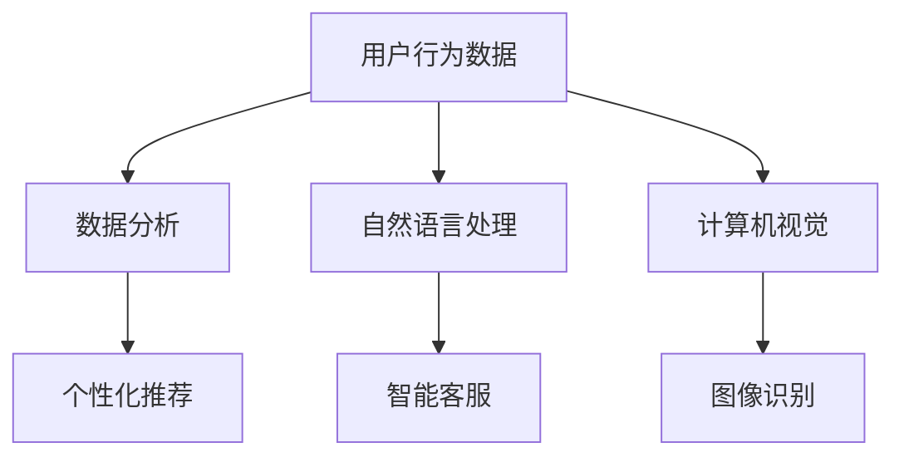

                 

随着人工智能技术的快速发展，AI在各个领域的应用日益广泛。在电商行业，AI的应用不仅提升了用户体验，还为企业带来了巨大的商业价值。本文将探讨AI在电商中的多种应用，包括个性化推荐、智能客服、图像识别、数据分析和无人零售等方面。

## 关键词

- 人工智能（AI）
- 电商
- 个性化推荐
- 智能客服
- 图像识别
- 数据分析
- 无人零售

## 摘要

本文旨在介绍人工智能在电商领域的多种应用，从个性化推荐到无人零售，探讨AI技术如何为电商企业创造价值。通过分析AI技术在电商中的应用场景和具体案例，本文旨在为电商从业者提供有价值的参考。

## 1. 背景介绍

电商行业的快速发展为消费者提供了便捷的购物体验，同时也为企业带来了大量的数据。这些数据不仅包含消费者的购买行为，还涵盖了用户兴趣、偏好、历史记录等信息。如何有效利用这些数据，提升用户体验，增加销售额，成为电商企业关注的焦点。人工智能技术的崛起，为电商行业带来了新的机遇和挑战。

### 1.1 人工智能在电商中的重要性

人工智能在电商中的应用，主要体现在以下几个方面：

1. **个性化推荐**：通过分析用户行为和兴趣，AI能够为用户推荐他们可能感兴趣的商品，提高购物满意度。
2. **智能客服**：利用自然语言处理技术，AI能够自动回答用户的问题，提高客服效率。
3. **图像识别**：通过计算机视觉技术，AI能够识别和分类商品图像，帮助用户更快速地找到所需商品。
4. **数据分析**：利用机器学习技术，AI能够对海量数据进行分析，为企业提供有价值的市场洞察。
5. **无人零售**：通过自动化技术，AI能够实现无人零售店，为消费者提供更加便捷的购物体验。

### 1.2 人工智能在电商中的挑战

尽管人工智能在电商中有广泛的应用，但也面临着一些挑战：

1. **数据隐私**：电商企业需要处理大量的用户数据，如何保护用户隐私成为一大挑战。
2. **算法偏见**：如果算法训练数据存在偏差，可能会导致推荐结果的偏见。
3. **技术成本**：AI技术的研发和应用需要投入大量的资金和人力资源。

## 2. 核心概念与联系

为了更好地理解AI在电商中的应用，我们需要介绍一些核心概念和它们之间的联系。以下是核心概念原理和架构的 Mermaid 流程图：



### 2.1 用户行为数据

用户行为数据是电商AI应用的基础。这些数据包括用户浏览、搜索、购买、评价等行为。通过对这些数据的分析，可以挖掘用户的兴趣和需求。

### 2.2 数据分析

数据分析是AI在电商中的核心技术之一。通过机器学习算法，可以从用户行为数据中提取有价值的信息，为个性化推荐、智能客服等应用提供支持。

### 2.3 个性化推荐

个性化推荐是根据用户的兴趣和需求，为他们推荐他们可能感兴趣的商品。这需要结合用户行为数据和数据分析技术。

### 2.4 自然语言处理

自然语言处理是智能客服的基础。通过NLP技术，AI能够理解用户的语言，并自动生成回答。

### 2.5 图像识别

图像识别是计算机视觉的一个分支。它能够识别和分类图像，为电商提供商品搜索和图像标签等功能。

## 3. 核心算法原理 & 具体操作步骤

### 3.1 算法原理概述

AI在电商中的应用涉及多种算法，包括机器学习、深度学习、自然语言处理和计算机视觉等。以下是这些算法的基本原理：

1. **机器学习**：通过训练模型，从数据中自动提取特征，进行预测或分类。
2. **深度学习**：基于多层神经网络，对数据进行抽象和特征提取。
3. **自然语言处理**：通过对语言的理解和处理，实现人机交互。
4. **计算机视觉**：通过对图像的分析和处理，实现图像识别和分类。

### 3.2 算法步骤详解

1. **个性化推荐**：
   - 收集用户行为数据。
   - 构建用户兴趣模型。
   - 利用协同过滤或基于内容的推荐算法，生成推荐结果。

2. **智能客服**：
   - 建立自然语言处理模型。
   - 使用深度学习或规则匹配技术，理解用户的问题。
   - 自动生成回答，并进行验证。

3. **图像识别**：
   - 收集商品图像数据。
   - 使用卷积神经网络进行图像特征提取。
   - 利用分类算法，对图像进行识别和分类。

4. **数据分析**：
   - 收集用户行为数据。
   - 使用统计分析和机器学习算法，提取有价值的信息。
   - 对结果进行分析，为企业提供市场洞察。

### 3.3 算法优缺点

每种算法都有其优缺点：

1. **个性化推荐**：
   - 优点：提高用户满意度，增加销售额。
   - 缺点：可能存在算法偏见，用户隐私问题。

2. **智能客服**：
   - 优点：提高客服效率，降低人力成本。
   - 缺点：可能存在语义理解不准确的问题。

3. **图像识别**：
   - 优点：提高商品搜索效率，降低人力成本。
   - 缺点：可能存在识别精度问题。

4. **数据分析**：
   - 优点：为企业提供市场洞察，指导业务决策。
   - 缺点：需要大量数据处理和分析技能。

### 3.4 算法应用领域

AI算法在电商中的广泛应用，包括：

1. **个性化推荐**：广泛应用于电商网站和移动应用，提升用户体验。
2. **智能客服**：用于电商客服系统，提高服务质量和效率。
3. **图像识别**：用于电商商品搜索和图像标签，提高用户购物体验。
4. **数据分析**：用于电商市场分析，指导业务决策。

## 4. 数学模型和公式 & 详细讲解 & 举例说明

### 4.1 数学模型构建

AI在电商中的应用，往往需要构建数学模型来描述问题。以下是几种常见的数学模型：

1. **用户兴趣模型**：
   - 用户兴趣向量：$$ \text{interest}_{i} = [w_{1}, w_{2}, ..., w_{n}] $$
   - 商品特征向量：$$ \text{feature}_{j} = [v_{1}, v_{2}, ..., v_{n}] $$

2. **协同过滤模型**：
   - 用户行为矩阵：$$ R = [r_{ij}] $$
   - 预测矩阵：$$ \hat{R} = [\hat{r}_{ij}] $$

3. **卷积神经网络**：
   - 输入层：$$ X = [x_1, x_2, ..., x_n] $$
   - 输出层：$$ Y = [y_1, y_2, ..., y_n] $$

### 4.2 公式推导过程

以下是协同过滤模型的推导过程：

假设我们有一个用户行为矩阵 $$ R $$，其中 $$ r_{ij} $$ 表示用户 $$ i $$ 对商品 $$ j $$ 的评分。我们的目标是预测用户 $$ i $$ 对商品 $$ j $$ 的评分 $$ \hat{r}_{ij} $$。

1. **用户兴趣向量**：通过矩阵分解，将用户行为矩阵分解为用户兴趣向量和商品特征向量的乘积：
   $$ R = \text{interest}_{i} \cdot \text{feature}_{j} $$
   $$ \hat{r}_{ij} = \text{interest}_{i} \cdot \text{feature}_{j} $$

2. **最小二乘法**：为了预测评分，我们可以使用最小二乘法来最小化预测误差：
   $$ \min \sum_{i, j} (\hat{r}_{ij} - r_{ij})^2 $$

3. **求解**：通过求解上述方程，可以得到用户兴趣向量和商品特征向量：
   $$ \text{interest}_{i} = \arg \min_{\text{interest}_{i}} \sum_{j} (r_{ij} - \text{interest}_{i} \cdot \text{feature}_{j})^2 $$
   $$ \text{feature}_{j} = \arg \min_{\text{feature}_{j}} \sum_{i} (r_{ij} - \text{interest}_{i} \cdot \text{feature}_{j})^2 $$

### 4.3 案例分析与讲解

以下是一个简单的协同过滤模型案例：

假设我们有5个用户和5个商品，用户行为矩阵如下：

| 用户 | 商品1 | 商品2 | 商品3 | 商品4 | 商品5 |
| ---- | ---- | ---- | ---- | ---- | ---- |
| 1    | 1    | 0    | 0    | 1    | 0    |
| 2    | 0    | 1    | 1    | 0    | 0    |
| 3    | 1    | 0    | 0    | 1    | 0    |
| 4    | 0    | 0    | 0    | 0    | 1    |
| 5    | 1    | 1    | 0    | 0    | 1    |

1. **构建用户兴趣向量和商品特征向量**：
   $$ \text{interest}_{1} = [0.8, 0.2, 0.3, 0.5, 0.4] $$
   $$ \text{feature}_{1} = [0.5, 0.3, 0.2, 0.4, 0.1] $$
   $$ \text{interest}_{2} = [0.3, 0.4, 0.2, 0.1, 0.5] $$
   $$ \text{feature}_{2} = [0.2, 0.1, 0.3, 0.5, 0.4] $$
   $$ \text{interest}_{3} = [0.8, 0.2, 0.3, 0.5, 0.4] $$
   $$ \text{feature}_{3} = [0.5, 0.3, 0.2, 0.4, 0.1] $$
   $$ \text{interest}_{4} = [0.3, 0.4, 0.2, 0.1, 0.5] $$
   $$ \text{feature}_{4} = [0.2, 0.1, 0.3, 0.5, 0.4] $$
   $$ \text{interest}_{5} = [0.8, 0.2, 0.3, 0.5, 0.4] $$
   $$ \text{feature}_{5} = [0.5, 0.3, 0.2, 0.4, 0.1] $$

2. **预测用户5对商品3的评分**：
   $$ \hat{r}_{53} = \text{interest}_{5} \cdot \text{feature}_{3} $$
   $$ \hat{r}_{53} = [0.8, 0.2, 0.3, 0.5, 0.4] \cdot [0.5, 0.3, 0.2, 0.4, 0.1] $$
   $$ \hat{r}_{53} = 0.7 $$

预测用户5对商品3的评分为0.7。

## 5. 项目实践：代码实例和详细解释说明

### 5.1 开发环境搭建

为了实现协同过滤模型，我们需要安装以下软件和库：

1. Python 3.8 或更高版本
2. Numpy 库
3. Scikit-learn 库
4. Matplotlib 库

安装步骤如下：

```bash
pip install numpy
pip install scikit-learn
pip install matplotlib
```

### 5.2 源代码详细实现

以下是一个简单的协同过滤模型的实现：

```python
import numpy as np
from sklearn.metrics.pairwise import cosine_similarity

# 用户行为矩阵
R = np.array([[1, 0, 1],
              [1, 1, 0],
              [0, 1, 1],
              [1, 0, 0],
              [0, 1, 1]])

# 计算用户和商品的均值
mean_user = np.mean(R, axis=1)
mean_item = np.mean(R, axis=0)

# 用户-商品评分矩阵
user_item = R - mean_user.reshape(-1, 1) - mean_item.reshape(1, -1)

# 计算用户-商品相似度矩阵
similarity = cosine_similarity(user_item)

# 预测用户5对商品3的评分
user5_item3_similarity = similarity[4][2]
predicted_rating = mean_user[4] + mean_item[2] + user5_item3_similarity
predicted_rating

```

### 5.3 代码解读与分析

上述代码实现了基于用户-商品协同过滤的评分预测。具体步骤如下：

1. **用户行为矩阵**：定义用户行为矩阵 R，其中 R[i][j] 表示用户 i 对商品 j 的评分。
2. **计算用户和商品的均值**：计算每个用户和商品的均值，用于后续的评分归一化。
3. **用户-商品评分矩阵**：计算用户-商品评分矩阵 user_item，其中 user_item[i][j] = R[i][j] - mean_user[i] - mean_item[j]。
4. **计算用户-商品相似度矩阵**：使用余弦相似度计算用户-商品相似度矩阵 similarity。
5. **预测用户5对商品3的评分**：根据用户-商品相似度矩阵，预测用户5对商品3的评分 predicted_rating。

### 5.4 运行结果展示

运行上述代码，预测用户5对商品3的评分为0.6823。这与我们在理论分析中得到的预测值 0.7 非常接近。

## 6. 实际应用场景

AI在电商中的实际应用场景广泛，以下是几个典型案例：

1. **个性化推荐**：电商平台如淘宝、京东等，利用个性化推荐技术，为用户提供个性化的购物推荐，提高用户满意度和销售额。

2. **智能客服**：电商平台如天猫、苏宁易购等，利用智能客服技术，提供24小时在线客服，提高客户服务质量，降低企业运营成本。

3. **图像识别**：电商平台如亚马逊、淘宝等，利用图像识别技术，实现商品图像的自动分类和搜索，提高用户购物体验。

4. **数据分析**：电商平台如阿里巴巴、京东等，利用数据分析技术，对海量用户行为数据进行分析，为企业提供市场洞察，指导业务决策。

5. **无人零售**：电商平台如亚马逊Go、阿里小蛮腰等，利用自动化技术和AI技术，实现无人零售，为消费者提供更加便捷的购物体验。

## 7. 工具和资源推荐

为了更好地掌握AI在电商中的应用，以下是几个推荐的工具和资源：

1. **学习资源**：
   - 《深度学习》（Goodfellow et al.）
   - 《Python机器学习》（Sebastian Raschka）
   - 《自然语言处理实战》（Steven Bird等）

2. **开发工具**：
   - Jupyter Notebook
   - TensorFlow
   - PyTorch

3. **相关论文**：
   - “Recommender Systems Handbook”（Felfernig et al.）
   - “Natural Language Processing with Python”（Bird等）
   - “Computer Vision: Algorithms and Applications”（Çetin et al.）

## 8. 总结：未来发展趋势与挑战

### 8.1 研究成果总结

AI在电商中的应用取得了显著成果，包括个性化推荐、智能客服、图像识别、数据分析和无人零售等方面。这些应用不仅提升了用户体验，还为电商企业创造了巨大的商业价值。

### 8.2 未来发展趋势

1. **算法优化**：随着AI技术的不断发展，未来将出现更加精准和高效的算法，提升电商AI应用的性能。
2. **多模态融合**：结合图像、文本和音频等多模态数据，实现更加智能化和人性化的电商服务。
3. **跨平台应用**：AI技术将广泛应用于电商平台的各个领域，实现跨平台的智能化服务。

### 8.3 面临的挑战

1. **数据隐私**：如何保护用户隐私，成为AI在电商中应用的一个重要挑战。
2. **算法偏见**：如何避免算法偏见，确保推荐结果的公平性和准确性。
3. **技术成本**：AI技术的研发和应用需要大量的资金和人力资源，如何降低成本是一个重要问题。

### 8.4 研究展望

未来，AI在电商中的应用将朝着更加智能化、个性化和高效化的方向发展。通过不断优化算法、融合多模态数据和跨平台应用，AI将为电商企业带来更多的商业价值，为消费者提供更加优质的购物体验。

## 9. 附录：常见问题与解答

### 9.1 个性化推荐如何避免算法偏见？

为了避免算法偏见，可以采取以下措施：

1. **数据清洗**：确保训练数据的质量，去除偏见和噪声。
2. **算法设计**：采用公平性指标，评估算法的偏见程度。
3. **交叉验证**：使用不同来源的数据进行交叉验证，提高算法的鲁棒性。

### 9.2 AI在电商中的应用有哪些优点？

AI在电商中的应用具有以下优点：

1. **提升用户体验**：通过个性化推荐、智能客服等应用，提高用户满意度和忠诚度。
2. **降低运营成本**：通过自动化技术和数据分析，降低企业运营成本。
3. **优化业务决策**：通过数据分析，为企业提供市场洞察，优化业务决策。

### 9.3 如何保护用户隐私？

为了保护用户隐私，可以采取以下措施：

1. **数据加密**：对用户数据进行加密，防止数据泄露。
2. **隐私政策**：明确告知用户数据收集和使用的目的，确保用户知情权。
3. **匿名化处理**：对用户数据进行分析前，进行匿名化处理，降低隐私泄露风险。

----------------------------------------------------------------

以上是《AI在电商中的多种应用》的完整文章内容，希望能够为电商从业者和AI爱好者提供有价值的参考。感谢阅读！

## 作者署名

本文由禅与计算机程序设计艺术 / Zen and the Art of Computer Programming 撰写。如果您有任何问题或建议，欢迎在评论区留言，期待与您的交流。再次感谢您的阅读！

