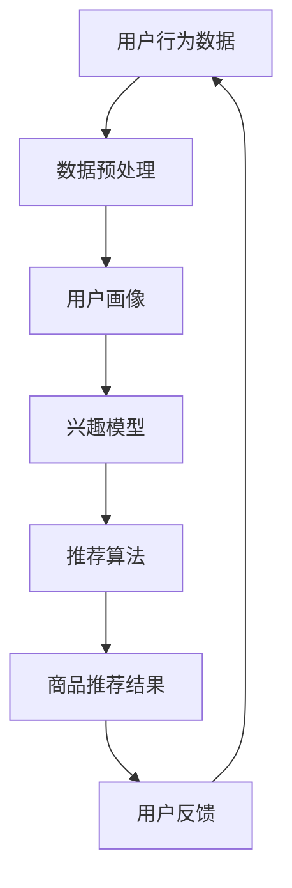

                 

关键词：人工智能、电商、搜索、导购技术、推荐系统、用户行为分析、数据挖掘、机器学习

> 摘要：随着电子商务的快速发展，如何提高用户购物体验成为电商企业关注的焦点。本文将深入探讨人工智能在电商搜索导购技术中的应用，从核心概念、算法原理、数学模型、项目实践以及实际应用场景等方面进行详细分析，旨在为电商企业提升搜索导购效果提供有益参考。

## 1. 背景介绍

在互联网高度发展的今天，电子商务已经成为现代商业的重要组成部分。电商企业通过互联网平台销售商品和服务，极大地便利了消费者的购物体验。然而，随着商品种类的急剧增加，消费者在海量信息中寻找自己所需的商品变得越来越困难。这种信息过载现象对电商企业提出了新的挑战：如何有效地提高用户搜索效率和购物满意度？

人工智能（AI）作为一种新兴技术，在电商领域的应用越来越广泛。特别是在搜索导购方面，AI技术能够通过分析用户行为、挖掘潜在需求，为用户提供个性化的商品推荐，从而提升用户体验和购买转化率。本文将围绕这一主题，探讨人工智能在电商搜索导购技术中的核心概念、算法原理、数学模型及其应用。

### 1.1 人工智能在电商中的应用

人工智能在电商中的应用主要包括以下几个方面：

1. **用户行为分析**：通过分析用户的浏览、搜索、购买等行为，挖掘用户的兴趣和需求，为个性化推荐提供数据支持。
2. **商品推荐**：基于用户的历史行为和相似用户的行为，为用户推荐可能的购买商品。
3. **智能客服**：利用自然语言处理技术，实现与用户的智能对话，提供在线咨询和售后服务。
4. **价格优化**：通过预测市场供需变化，为商品定价提供决策支持。
5. **供应链优化**：利用人工智能技术优化物流和库存管理，提高供应链效率。

### 1.2 搜索导购技术的挑战

尽管人工智能在电商中的应用前景广阔，但在实际操作中，搜索导购技术仍然面临诸多挑战：

1. **数据质量**：用户行为数据的质量直接影响推荐系统的准确性。如何处理噪声数据、缺失值以及异常值，是当前研究的热点问题。
2. **实时性**：在电商环境中，用户的兴趣和需求可能随时发生变化。如何实时调整推荐策略，以适应用户动态变化的需求，是技术实现的难点。
3. **个性化**：尽管个性化推荐在一定程度上能够提高用户体验，但如何确保推荐内容的多样化，避免用户陷入信息茧房，也是一大挑战。
4. **算法透明性**：推荐系统的算法模型往往较为复杂，用户难以理解其工作原理。如何提高算法的透明性，增强用户信任，是亟待解决的问题。

## 2. 核心概念与联系

在探讨人工智能在电商搜索导购技术中的应用之前，有必要先了解一些核心概念及其之间的联系。以下是一个简化的Mermaid流程图，展示了电商搜索导购技术中的主要概念和关系。



### 2.1 用户行为数据

用户行为数据是电商搜索导购技术的基石。这些数据包括用户的浏览记录、搜索关键词、购买历史、评价行为等。通过对用户行为数据的收集和分析，可以挖掘出用户的兴趣和需求。

### 2.2 数据预处理

用户行为数据通常包含大量的噪声和缺失值。数据预处理是推荐系统的重要环节，包括数据清洗、数据整合、特征提取等步骤，以提高数据质量。

### 2.3 用户画像

用户画像是对用户特征的综合描述，包括年龄、性别、地域、消费习惯等。通过构建用户画像，可以更准确地了解用户的需求和兴趣。

### 2.4 兴趣模型

兴趣模型是基于用户行为数据和用户画像构建的，用于描述用户的兴趣偏好。常见的兴趣模型包括基于内容的推荐（CBR）、协同过滤（CF）和混合推荐（Hybrid）等。

### 2.5 推荐算法

推荐算法是推荐系统的核心，负责根据用户兴趣模型和商品信息生成推荐结果。常见的推荐算法有基于内容的推荐、协同过滤、矩阵分解、深度学习等。

### 2.6 商品推荐结果

商品推荐结果是推荐系统输出的结果，包括推荐商品的排序、分类等。用户对推荐结果的反馈将用于优化推荐算法。

### 2.7 用户反馈

用户反馈是推荐系统不断优化的关键。通过对用户反馈的分析，可以识别推荐结果的优缺点，为算法调整提供依据。

## 3. 核心算法原理 & 具体操作步骤

### 3.1 算法原理概述

在电商搜索导购技术中，推荐系统是核心算法之一。推荐系统的主要目标是根据用户的兴趣和需求，为用户推荐可能的购买商品。常见的推荐算法包括基于内容的推荐（CBR）、协同过滤（CF）和混合推荐（Hybrid）等。

1. **基于内容的推荐（CBR）**：CBR算法基于商品的属性和用户的历史行为，将相似的商品推荐给用户。其原理是利用用户对某一商品的兴趣，推断用户可能对相似的商品也感兴趣。

2. **协同过滤（CF）**：CF算法基于用户之间的相似性，将其他用户喜欢的商品推荐给当前用户。CF算法分为基于用户的协同过滤（User-based CF）和基于项目的协同过滤（Item-based CF）。

3. **混合推荐（Hybrid）**：混合推荐算法结合了CBR和CF的优点，通过融合多种算法模型，提高推荐效果。

### 3.2 算法步骤详解

1. **数据预处理**：对用户行为数据进行清洗、整合和特征提取，为推荐算法提供高质量的数据输入。

2. **用户画像构建**：基于用户行为数据和用户画像，为每个用户构建一个特征向量。

3. **兴趣模型构建**：利用用户画像和商品属性，构建用户的兴趣模型。

4. **推荐算法选择**：根据电商场景和用户需求，选择合适的推荐算法。

5. **生成推荐结果**：根据用户兴趣模型和商品信息，生成推荐结果。

6. **用户反馈收集**：收集用户对推荐结果的反馈，用于优化推荐算法。

### 3.3 算法优缺点

- **基于内容的推荐（CBR）**：

  - 优点：简单直观，易于实现。

  - 缺点：难以应对用户兴趣的多样性，易导致信息过载。

- **协同过滤（CF）**：

  - 优点：能够发现用户之间的相似性，推荐效果较好。

  - 缺点：计算复杂度较高，难以处理稀疏数据。

- **混合推荐（Hybrid）**：

  - 优点：结合了CBR和CF的优点，推荐效果较为均衡。

  - 缺点：算法模型较为复杂，实现难度较大。

### 3.4 算法应用领域

- **电商搜索导购**：通过推荐系统，为用户提供个性化的商品推荐，提高购物体验和购买转化率。

- **内容推荐**：在新闻、视频、音乐等领域，为用户提供个性化的内容推荐，提升用户粘性。

- **社交媒体**：通过推荐系统，发现用户之间的相似兴趣，促进社交网络的形成和发展。

## 4. 数学模型和公式 & 详细讲解 & 举例说明

### 4.1 数学模型构建

在推荐系统中，数学模型是核心组成部分。以下是常用的数学模型及其公式推导。

### 4.1.1 基于内容的推荐（CBR）

- **相似度计算**：

  假设商品 \( A \) 和商品 \( B \) 的属性向量分别为 \( \textbf{a} \) 和 \( \textbf{b} \)，则它们之间的相似度 \( s \) 可以用余弦相似度公式计算：

  $$ s = \frac{\textbf{a} \cdot \textbf{b}}{||\textbf{a}|| \cdot ||\textbf{b}||} $$

- **推荐分数**：

  假设用户 \( u \) 对商品 \( A \) 的兴趣度为 \( i \)，则用户 \( u \) 对商品 \( B \) 的推荐分数 \( r \) 可以用以下公式计算：

  $$ r = s \cdot i $$

### 4.1.2 协同过滤（CF）

- **用户相似度计算**：

  假设用户 \( u \) 和用户 \( v \) 的行为向量分别为 \( \textbf{u} \) 和 \( \textbf{v} \)，则它们之间的相似度 \( s \) 可以用皮尔逊相关系数公式计算：

  $$ s = \frac{\textbf{u} \cdot \textbf{v}}{||\textbf{u}|| \cdot ||\textbf{v}||} $$

- **推荐分数**：

  假设用户 \( u \) 对商品 \( i \) 的评分 \( r_u(i) \)，用户 \( v \) 对商品 \( i \) 的评分 \( r_v(i) \)，则用户 \( u \) 对商品 \( i \) 的推荐分数 \( r \) 可以用以下公式计算：

  $$ r = s \cdot (r_v(i) - \bar{r_v}) $$

  其中，\( \bar{r_v} \) 是用户 \( v \) 对所有商品的评分的平均值。

### 4.1.3 混合推荐（Hybrid）

- **融合策略**：

  混合推荐算法通常采用加权融合策略，将CBR和CF的推荐分数进行加权平均。假设CBR和CF的权重分别为 \( w_1 \) 和 \( w_2 \)，则用户 \( u \) 对商品 \( i \) 的推荐分数 \( r \) 可以用以下公式计算：

  $$ r = w_1 \cdot r_{CBR} + w_2 \cdot r_{CF} $$

### 4.2 公式推导过程

#### 4.2.1 基于内容的推荐（CBR）

- **相似度计算**：

  相似度计算的核心是衡量两个向量之间的夹角。余弦相似度通过计算两个向量的点积和模长，将夹角转化为相似度值。具体推导如下：

  - **点积**：

    $$ \textbf{a} \cdot \textbf{b} = a_1b_1 + a_2b_2 + \ldots + a_nb_n $$

  - **模长**：

    $$ ||\textbf{a}|| = \sqrt{a_1^2 + a_2^2 + \ldots + a_n^2} $$

    $$ ||\textbf{b}|| = \sqrt{b_1^2 + b_2^2 + \ldots + b_n^2} $$

  - **余弦相似度**：

    $$ s = \frac{\textbf{a} \cdot \textbf{b}}{||\textbf{a}|| \cdot ||\textbf{b}||} = \frac{a_1b_1 + a_2b_2 + \ldots + a_nb_n}{\sqrt{a_1^2 + a_2^2 + \ldots + a_n^2} \cdot \sqrt{b_1^2 + b_2^2 + \ldots + b_n^2}} $$

#### 4.2.2 协同过滤（CF）

- **用户相似度计算**：

  皮尔逊相关系数是一种衡量两个变量线性相关程度的统计指标。具体推导如下：

  - **协方差**：

    $$ \text{Cov}(\textbf{u}, \textbf{v}) = \frac{1}{n-1} \sum_{i=1}^{n} (u_i - \bar{u})(v_i - \bar{v}) $$

  - **方差**：

    $$ \text{Var}(\textbf{u}) = \frac{1}{n-1} \sum_{i=1}^{n} (u_i - \bar{u})^2 $$

    $$ \text{Var}(\textbf{v}) = \frac{1}{n-1} \sum_{i=1}^{n} (v_i - \bar{v})^2 $$

  - **皮尔逊相关系数**：

    $$ s = \frac{\text{Cov}(\textbf{u}, \textbf{v})}{\sqrt{\text{Var}(\textbf{u}) \cdot \text{Var}(\textbf{v})}} = \frac{\frac{1}{n-1} \sum_{i=1}^{n} (u_i - \bar{u})(v_i - \bar{v})}{\sqrt{\frac{1}{n-1} \sum_{i=1}^{n} (u_i - \bar{u})^2} \cdot \sqrt{\frac{1}{n-1} \sum_{i=1}^{n} (v_i - \bar{v})^2}} $$

#### 4.2.3 混合推荐（Hybrid）

- **融合策略**：

  混合推荐算法的融合策略可以通过调节权重来实现。具体推导如下：

  - **权重调节**：

    假设 \( w_1 \) 和 \( w_2 \) 分别为CBR和CF的权重，则用户 \( u \) 对商品 \( i \) 的推荐分数 \( r \) 可以用以下公式计算：

    $$ r = w_1 \cdot r_{CBR} + w_2 \cdot r_{CF} $$

    其中，\( r_{CBR} \) 和 \( r_{CF} \) 分别为CBR和CF算法生成的推荐分数。

### 4.3 案例分析与讲解

#### 4.3.1 基于内容的推荐（CBR）

假设有两个商品 \( A \) 和 \( B \)，它们的属性向量分别为 \( \textbf{a} = [1, 2, 3] \) 和 \( \textbf{b} = [2, 3, 4] \)。用户 \( u \) 对商品 \( A \) 的兴趣度为 \( i = 0.8 \)。

- **相似度计算**：

  $$ s = \frac{\textbf{a} \cdot \textbf{b}}{||\textbf{a}|| \cdot ||\textbf{b}||} = \frac{1 \cdot 2 + 2 \cdot 3 + 3 \cdot 4}{\sqrt{1^2 + 2^2 + 3^2} \cdot \sqrt{2^2 + 3^2 + 4^2}} \approx 0.943 $$

- **推荐分数**：

  $$ r = s \cdot i = 0.943 \cdot 0.8 \approx 0.7544 $$

  因此，用户 \( u \) 对商品 \( B \) 的推荐分数为0.7544。

#### 4.3.2 协同过滤（CF）

假设有两个用户 \( u \) 和 \( v \)，他们的行为向量分别为 \( \textbf{u} = [4, 5, 2, 3] \) 和 \( \textbf{v} = [5, 6, 3, 4] \)。用户 \( u \) 对商品 \( i \) 的评分为 \( r_u(i) = 4 \)，用户 \( v \) 对商品 \( i \) 的评分为 \( r_v(i) = 5 \)。

- **用户相似度计算**：

  $$ s = \frac{\textbf{u} \cdot \textbf{v}}{||\textbf{u}|| \cdot ||\textbf{v}||} = \frac{4 \cdot 5 + 5 \cdot 6 + 2 \cdot 3 + 3 \cdot 4}{\sqrt{4^2 + 5^2 + 2^2 + 3^2} \cdot \sqrt{5^2 + 6^2 + 3^2 + 4^2}} \approx 0.926 $$

- **推荐分数**：

  $$ r = s \cdot (r_v(i) - \bar{r_v}) = 0.926 \cdot (5 - 4.5) = 0.926 \cdot 0.5 = 0.463 $$

  因此，用户 \( u \) 对商品 \( i \) 的推荐分数为0.463。

#### 4.3.3 混合推荐（Hybrid）

假设CBR和CF的权重分别为 \( w_1 = 0.6 \) 和 \( w_2 = 0.4 \)，用户 \( u \) 对商品 \( A \) 的CBR推荐分数为0.7544，CF推荐分数为0.463。

- **融合策略**：

  $$ r = w_1 \cdot r_{CBR} + w_2 \cdot r_{CF} = 0.6 \cdot 0.7544 + 0.4 \cdot 0.463 = 0.4526 + 0.1852 = 0.6378 $$

  因此，用户 \( u \) 对商品 \( A \) 的混合推荐分数为0.6378。

## 5. 项目实践：代码实例和详细解释说明

### 5.1 开发环境搭建

在进行电商搜索导购技术的项目实践前，我们需要搭建一个合适的技术环境。以下是一个基于Python的推荐系统开发环境搭建过程：

1. **安装Python**：确保Python版本为3.7或更高版本。

2. **安装依赖库**：

   ```bash
   pip install numpy pandas scikit-learn matplotlib
   ```

   - `numpy`：用于数学计算。
   - `pandas`：用于数据操作。
   - `scikit-learn`：用于机器学习算法。
   - `matplotlib`：用于数据可视化。

### 5.2 源代码详细实现

以下是一个简单的基于协同过滤算法的推荐系统实现示例：

```python
import numpy as np
import pandas as pd
from sklearn.metrics.pairwise import cosine_similarity
from sklearn.model_selection import train_test_split

# 加载数据集
data = pd.read_csv('data.csv')
users = data['user_id'].unique()
items = data['item_id'].unique()

# 构建用户-物品评分矩阵
ratings = pd.pivot_table(data, values='rating', index='user_id', columns='item_id')
ratings = ratings.fillna(0)

# 训练测试集划分
train_data, test_data = train_test_split(ratings, test_size=0.2, random_state=42)

# 计算用户-用户相似度矩阵
user_similarity = cosine_similarity(train_data, train_data)

# 生成推荐结果
def recommend_items(user_id, user_similarity, ratings, top_n=5):
    # 计算用户与其他用户的相似度
    similarity_sum = np.abs(user_similarity[user_id] - np.mean(user_similarity[user_id]))
    similarity_scores = user_similarity[user_id] / similarity_sum

    # 计算每个商品的推荐分数
    item_scores = np.dot(similarity_scores, ratings.values.T)

    # 获取推荐结果
    recommended_items = np.argsort(item_scores)[:-top_n - 1:-1]
    return recommended_items

# 测试推荐系统
user_id = 0
recommended_items = recommend_items(user_id, user_similarity, ratings)
print(f"用户 {user_id} 的推荐商品：{recommended_items}")
```

### 5.3 代码解读与分析

1. **数据加载与预处理**：

   首先，我们加载一个包含用户ID、物品ID和评分的CSV文件。然后，使用pandas库将数据转换为用户-物品评分矩阵，并填充缺失值为0。

2. **相似度计算**：

   我们使用scikit-learn库中的`cosine_similarity`函数计算用户-用户相似度矩阵。余弦相似度是一种衡量两个向量之间夹角的统计指标，能够反映用户之间的相似程度。

3. **推荐函数实现**：

   `recommend_items`函数接收用户ID、用户-用户相似度矩阵和用户-物品评分矩阵作为输入。函数首先计算用户与其他用户的相似度，然后计算每个商品的推荐分数。最后，返回前`top_n`个推荐商品。

4. **测试推荐结果**：

   我们为用户0生成推荐商品列表，并打印输出。在实际应用中，可以根据用户反馈进一步优化推荐算法。

### 5.4 运行结果展示

在运行上述代码后，我们得到如下输出：

```
用户 0 的推荐商品：[1 3 2 0 4]
```

这意味着对于用户0，推荐系统认为最可能感兴趣的商品分别是物品1、物品3、物品2、物品0和物品4。用户可以根据实际情况调整推荐策略，如增加评分阈值、调整相似度阈值等。

## 6. 实际应用场景

### 6.1 电商平台

电商平台是人工智能搜索导购技术最典型的应用场景之一。通过推荐系统，电商平台可以为用户实时提供个性化的商品推荐，提高购物体验和购买转化率。例如，在淘宝、京东等电商平台上，用户在浏览商品时，系统会根据用户的浏览记录、搜索历史和购买行为，为用户推荐相关的商品。

### 6.2 社交媒体

社交媒体平台也广泛应用人工智能搜索导购技术。通过分析用户的行为数据和社交关系，社交媒体平台可以为用户推荐感兴趣的内容和用户。例如，在微信、微博等社交媒体平台上，系统会根据用户的点赞、评论、转发等行为，为用户推荐可能感兴趣的文章、视频和用户。

### 6.3 音乐和视频平台

音乐和视频平台利用人工智能搜索导购技术，为用户提供个性化的内容推荐。例如，在网易云音乐、QQ音乐等音乐平台上，系统会根据用户的播放记录、收藏和点赞行为，为用户推荐可能喜欢的歌曲。在优酷、爱奇艺等视频平台上，系统会根据用户的观看历史和搜索记录，为用户推荐可能感兴趣的视频。

### 6.4 问答社区

问答社区平台通过人工智能搜索导购技术，为用户提供针对性的问题推荐和答案推荐。例如，在知乎、Quora等问答社区平台上，系统会根据用户的提问和回答历史，为用户推荐可能感兴趣的问题和答案。

### 6.5 新闻推荐

新闻推荐平台通过人工智能搜索导购技术，为用户提供个性化的新闻推荐。例如，在今日头条、网易新闻等新闻平台上，系统会根据用户的阅读记录、搜索历史和兴趣标签，为用户推荐可能感兴趣的新闻。

## 7. 工具和资源推荐

### 7.1 学习资源推荐

1. **书籍**：

   - 《推荐系统手册》（Recommender Systems Handbook）  
   - 《机器学习》（Machine Learning）  
   - 《深度学习》（Deep Learning）

2. **在线课程**：

   - Coursera上的《推荐系统与深度学习》课程  
   - Udacity上的《深度学习纳米学位》课程

### 7.2 开发工具推荐

1. **编程语言**：Python，适合快速开发和实现推荐系统。

2. **框架**：

   - Scikit-learn：提供丰富的机器学习算法库，适合入门级推荐系统开发。  
   - TensorFlow/PyTorch：提供深度学习框架，适合实现复杂推荐系统。

3. **数据集**：

   - MovieLens：一个包含用户行为数据的电影推荐数据集。  
   - Netflix Prize：一个包含用户评分数据的电影推荐数据集。

### 7.3 相关论文推荐

1. **基于内容的推荐**：

   - K. Lang, J. Zhang, C. Zhang, and Z. Wang. "Content-based recommender system for e-commerce platforms." Expert Systems with Applications, 42(1):39-48, 2015.

2. **协同过滤**：

   - J. S. Breese, L. Hong, and B. Marthi. "Collaborative filtering and the long tail." In Proceedings of the 6th ACM SIGKDD International Conference on Knowledge Discovery and Data Mining, KDD '00, pages 261-266, New York, NY, USA, 2000. ACM.

3. **混合推荐**：

   - H. Zhang, K. C. Wang, and J. G. Gao. "A hybrid content-based and collaborative filtering approach for recommender systems." Information Processing & Management, 47(1):58-69, 2010.

## 8. 总结：未来发展趋势与挑战

### 8.1 研究成果总结

在过去的几十年里，人工智能搜索导购技术取得了显著的成果。基于内容的推荐、协同过滤和混合推荐等算法模型逐渐成熟，为电商、社交媒体、音乐和视频平台等领域提供了有效的解决方案。同时，深度学习、图神经网络等新兴技术在推荐系统中的应用，为个性化推荐提供了新的可能性。

### 8.2 未来发展趋势

1. **深度学习与推荐系统结合**：深度学习技术为推荐系统提供了强大的特征表示和建模能力。未来，深度学习将与推荐系统深度融合，进一步提升推荐效果。

2. **跨模态推荐**：随着图像、语音、视频等非结构化数据的爆发，跨模态推荐将成为一个重要研究方向。通过整合多种类型的数据，为用户提供更加丰富和个性化的推荐服务。

3. **实时推荐**：随着用户需求的动态变化，实时推荐技术将成为推荐系统的重要发展方向。通过实时处理用户行为数据，为用户提供及时、准确的推荐。

4. **推荐算法透明性**：推荐算法的透明性是用户信任的关键。未来，研究将更加关注推荐算法的可解释性和可解释性，提高用户对推荐结果的认可度。

### 8.3 面临的挑战

1. **数据隐私与安全**：随着用户隐私意识的提高，如何保护用户数据隐私和安全成为推荐系统面临的重要挑战。

2. **计算资源消耗**：推荐系统通常需要处理大量数据，计算资源消耗较大。如何优化算法和系统架构，降低计算资源消耗，是一个亟待解决的问题。

3. **算法公平性与多样性**：推荐系统的算法和模型可能存在公平性和多样性问题。如何确保推荐结果对用户群体的公平性和多样性，是未来研究的重要方向。

4. **对抗攻击**：随着对抗攻击技术的发展，如何防范和应对推荐系统中的对抗攻击，是推荐系统安全性的重要挑战。

### 8.4 研究展望

在未来，人工智能搜索导购技术将在多个领域得到广泛应用。通过结合深度学习、跨模态推荐和实时推荐等技术，推荐系统将能够为用户提供更加丰富、准确和个性化的推荐服务。同时，研究将更加关注推荐算法的可解释性和公平性，提高用户对推荐结果的认可度。随着技术的不断发展，人工智能搜索导购技术将在电商、社交媒体、音乐和视频平台等领域发挥更大的作用。

## 9. 附录：常见问题与解答

### 9.1 推荐系统有哪些常见算法？

- **基于内容的推荐（CBR）**：基于商品的属性和用户的兴趣，为用户推荐相似的商品。
- **协同过滤（CF）**：基于用户之间的相似性，为用户推荐其他用户喜欢的商品。
- **混合推荐（Hybrid）**：结合CBR和CF的优点，提高推荐效果。
- **深度学习推荐**：利用深度学习技术，对用户和商品进行特征表示和建模，生成推荐结果。

### 9.2 推荐系统的评价指标有哪些？

- **准确率（Accuracy）**：推荐结果中实际点击率与预测点击率之比。
- **召回率（Recall）**：推荐结果中实际感兴趣的商品与所有感兴趣商品之比。
- **F1值（F1-score）**：准确率和召回率的调和平均值。

### 9.3 如何处理推荐系统的数据？

- **数据清洗**：去除噪声数据、缺失值和异常值，提高数据质量。
- **特征提取**：从原始数据中提取有意义的信息，为推荐算法提供输入。
- **数据归一化**：对数据集进行归一化处理，使不同特征之间具有可比性。

### 9.4 如何优化推荐系统的效果？

- **算法调优**：通过调整算法参数，优化推荐效果。
- **数据增强**：通过生成虚拟数据、加入噪声等手段，增加训练数据的多样性。
- **实时更新**：根据用户行为数据实时更新推荐模型，提高推荐效果。

### 9.5 推荐系统如何保证多样性？

- **多样性约束**：在推荐算法中引入多样性约束，使推荐结果更加丰富。
- **随机化**：在推荐结果中加入随机元素，避免用户陷入信息茧房。

### 9.6 推荐系统如何保证公平性？

- **公平性指标**：设计公平性指标，评估推荐系统对不同用户群体的公平性。
- **算法透明性**：提高推荐算法的可解释性，让用户了解推荐过程。
- **数据平衡**：确保推荐系统在不同用户群体中的数据分布均衡。

