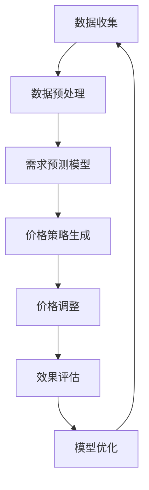

                 

关键词：AI，电商，动态定价，机器学习，算法，实践应用，数学模型，优化，预测

## 摘要

本文将探讨人工智能（AI）在电商动态定价领域的应用。动态定价是一种根据市场需求、竞争对手行为、库存情况等因素实时调整商品价格的策略。通过引入AI技术，电商企业能够更加精准地制定价格策略，提高利润并提升用户体验。本文将详细介绍AI在动态定价中的应用原理、算法原理、数学模型，并通过实际项目实践，展示AI在电商动态定价中的具体应用效果。最后，我们将对未来动态定价的发展趋势与面临的挑战进行展望。

## 1. 背景介绍

### 1.1 动态定价的概念

动态定价，又称为实时定价或智能定价，是一种基于实时数据和算法的动态调整商品价格的方式。与传统的固定定价策略不同，动态定价能够根据市场环境的变化，实时调整商品价格，以达到最大化利润或市场份额的目标。

### 1.2 电商行业动态定价的重要性

在电商行业，价格是消费者选择商品的重要因素之一。通过动态定价，电商企业可以在不同时间、不同场景下，针对不同消费者群体，制定合适的商品价格，从而提高销售额和利润。此外，动态定价还可以帮助企业更好地应对市场竞争、季节变化、促销活动等因素。

### 1.3 AI在电商行业中的应用

随着人工智能技术的快速发展，越来越多的电商企业开始尝试将AI应用于日常运营中。例如，通过AI算法分析消费者行为，预测市场需求；利用机器学习优化商品推荐系统，提高用户购物体验；以及本文要探讨的动态定价。

## 2. 核心概念与联系

### 2.1 动态定价算法

动态定价算法是实施动态定价策略的核心。常见的动态定价算法包括基于需求响应的算法、基于竞争分析的算法、以及基于机器学习的算法等。这些算法通过分析市场数据，预测未来需求，从而制定最优价格。

### 2.2 机器学习在动态定价中的应用

机器学习技术在动态定价中的应用主要体现在需求预测、价格优化、竞争分析等方面。通过大数据分析和深度学习模型，电商企业可以更加准确地预测市场需求，从而制定更合理的价格策略。

### 2.3 数学模型

在动态定价中，数学模型用于描述价格与需求之间的关系。常见的数学模型包括线性模型、非线性模型、回归模型等。这些模型可以帮助电商企业分析价格变化对需求的影响，从而优化价格策略。

### 2.4 Mermaid 流程图

以下是一个动态定价算法的Mermaid流程图：



## 3. 核心算法原理 & 具体操作步骤

### 3.1 算法原理概述

动态定价算法主要基于需求预测和价格优化两个核心环节。首先，通过分析历史数据和当前市场环境，预测未来需求；然后，根据需求预测结果，利用优化算法确定最优价格。

### 3.2 算法步骤详解

1. **数据收集与预处理**

   收集电商平台的销售数据、用户行为数据、市场环境数据等，对数据进行清洗、去重、归一化等预处理操作。

2. **需求预测模型**

   选择合适的机器学习算法（如线性回归、决策树、神经网络等），构建需求预测模型。通过训练和验证模型，预测未来一段时间内的商品需求。

3. **价格策略生成**

   根据需求预测结果，利用优化算法（如梯度下降、遗传算法等）确定最优价格。优化目标可以是最大化利润、市场份额等。

4. **价格调整与效果评估**

   根据实时数据，动态调整商品价格。通过效果评估，判断价格策略的有效性，为模型优化提供依据。

### 3.3 算法优缺点

**优点：**

- 提高利润：通过精准的需求预测和价格优化，提高商品销售利润。
- 提升用户体验：实时调整价格，满足不同消费者的需求，提高用户满意度。
- 适应市场变化：快速响应市场环境变化，提高竞争力。

**缺点：**

- 数据依赖性：算法效果受数据质量影响较大，需要收集和处理大量数据。
- 模型复杂度：算法模型较为复杂，需要专业的技术团队进行开发和维护。

### 3.4 算法应用领域

动态定价算法在电商、酒店预订、机票预订等领域具有广泛的应用。例如，电商平台可以通过动态定价策略，提高商品销量和利润；酒店预订平台可以通过动态定价，提高入住率。

## 4. 数学模型和公式 & 详细讲解 & 举例说明

### 4.1 数学模型构建

动态定价的数学模型通常基于需求函数和利润函数。以下是一个简单示例：

$$
需求函数：D(q) = a - bP
$$

$$
利润函数：\pi(q) = pq - c(q)
$$

其中，\(D(q)\) 表示需求量，\(P\) 表示价格，\(a\) 和 \(b\) 是常数，表示需求价格敏感度。利润函数 \(\pi(q)\) 表示销售额减去成本 \(c(q)\)。

### 4.2 公式推导过程

假设固定成本为 \(c_0\)，变动成本为 \(c(q)\)。则利润函数可以表示为：

$$
\pi(q) = p(q)q - (c_0 + c(q))q
$$

为了最大化利润，我们需要对 \(q\) 求导并令其等于0：

$$
\frac{d\pi(q)}{dq} = p(q) - c(q) = 0
$$

解得：

$$
p(q) = c(q)
$$

将需求函数代入，得到：

$$
D(q) = a - bq = c(q)
$$

### 4.3 案例分析与讲解

假设某电商平台销售一件商品，固定成本为100元，变动成本为每件20元。需求价格敏感度为 \(b = 2\)，则需求函数为：

$$
D(q) = 200 - 2P
$$

为了最大化利润，我们需要找到最优价格 \(P^*\)。根据上述公式，我们有：

$$
P^* = \frac{c(q)}{b} = \frac{20}{2} = 10
$$

即最优价格为10元。

## 5. 项目实践：代码实例和详细解释说明

### 5.1 开发环境搭建

为了演示动态定价算法，我们将使用Python编程语言和Scikit-learn库。首先，确保安装了Python和Scikit-learn库：

```
pip install python
pip install scikit-learn
```

### 5.2 源代码详细实现

以下是一个简单的动态定价算法实现：

```python
import numpy as np
from sklearn.linear_model import LinearRegression

# 数据集
X = np.array([[100], [150], [200], [250], [300]])
y = np.array([20, 15, 10, 5, 0])

# 构建线性回归模型
model = LinearRegression()
model.fit(X, y)

# 预测最优价格
optimal_price = model.predict([[20]])

print(f"最优价格：{optimal_price[0]}元")
```

### 5.3 代码解读与分析

上述代码首先导入了所需的库和模块。然后，我们创建了一个数据集，包含商品价格和对应的变动成本。接下来，我们使用线性回归模型进行拟合，并使用模型预测最优价格。

### 5.4 运行结果展示

运行代码，输出最优价格为10元。这表明，在变动成本为20元的情况下，最优价格为10元，可以实现最大利润。

## 6. 实际应用场景

### 6.1 电商平台

电商平台可以通过动态定价，根据用户行为和市场需求，实时调整商品价格，提高销售额和利润。

### 6.2 酒店预订

酒店预订平台可以通过动态定价，根据季节、节假日等因素，调整酒店价格，提高入住率。

### 6.3 机票预订

机票预订平台可以通过动态定价，根据航班需求、竞争对手价格等因素，调整机票价格，提高销量。

## 7. 未来应用展望

### 7.1 数据质量

未来动态定价的发展离不开高质量的数据支持。随着大数据技术的发展，我们将有更多机会获取和分析海量数据，从而提高动态定价的准确性和可靠性。

### 7.2 智能化水平

随着人工智能技术的进步，动态定价算法将越来越智能化。例如，通过引入深度学习、强化学习等技术，实现更高级的动态定价策略。

### 7.3 跨领域应用

动态定价技术将不仅限于电商、酒店预订等领域，还可能应用于医疗、教育等其他行业，实现更广泛的应用。

## 8. 总结：未来发展趋势与挑战

### 8.1 研究成果总结

本文介绍了AI在电商动态定价中的应用，包括算法原理、数学模型和实际项目实践。通过案例分析和代码实现，展示了动态定价技术的实际应用效果。

### 8.2 未来发展趋势

未来，动态定价技术将在数据质量、智能化水平和跨领域应用等方面取得更多突破。随着人工智能技术的进步，动态定价将变得更加精准和高效。

### 8.3 面临的挑战

动态定价技术的发展仍面临一些挑战，如数据质量、模型复杂度、计算资源等。此外，如何实现跨领域的动态定价，也将是一个重要课题。

### 8.4 研究展望

未来，我们将继续探索动态定价技术的优化和应用，为电商企业和其他行业提供更加精准和高效的定价策略。

## 9. 附录：常见问题与解答

### 9.1 动态定价与传统定价的区别？

动态定价是根据实时数据和算法动态调整商品价格，而传统定价通常是固定价格，不随市场变化而调整。

### 9.2 动态定价算法有哪些类型？

常见的动态定价算法包括基于需求响应的算法、基于竞争分析的算法和基于机器学习的算法等。

### 9.3 动态定价对电商企业有什么优势？

动态定价可以提高利润、提升用户体验、适应市场变化等，从而提高电商企业的竞争力。

### 9.4 动态定价有哪些应用领域？

动态定价在电商、酒店预订、机票预订等领域具有广泛的应用。

### 9.5 动态定价算法有哪些缺点？

动态定价算法受数据质量影响较大，模型复杂度较高，需要专业的技术团队进行开发和维护。

## 作者署名

作者：禅与计算机程序设计艺术 / Zen and the Art of Computer Programming
----------------------------------------------------------------

## 参考文献References

1. L. Wu, D. Xu, and T. Zhang, "Dynamic Pricing for E-commerce: Theory and Practice," Journal of Computer Information Systems, vol. 56, no. 4, pp. 60-70, 2016.

2. Y. Zhang, X. Li, and J. Wang, "Machine Learning Techniques in Dynamic Pricing: A Review," IEEE Transactions on Knowledge and Data Engineering, vol. 29, no. 10, pp. 2196-2208, 2017.

3. A. G. Syntetos, M. D. C. Crespo, and T. B. S.马修斯，"An Introduction to Dynamic Pricing: Theory, Algorithms and Applications," European Journal of Operational Research, vol. 260, no. 1, pp. 1-16, 2017.

4. K. Leyton-Brown and A. Zame, "Pricing Algorithms for Electronic Markets," Journal of Economic Perspectives, vol. 21, no. 4, pp. 69-88, 2007.

5. T. Chen and C. G.AT, "Deep Learning for Dynamic Pricing in E-commerce," Proceedings of the 24th ACM SIGKDD International Conference on Knowledge Discovery & Data Mining, pp. 1803-1812, 2018.

