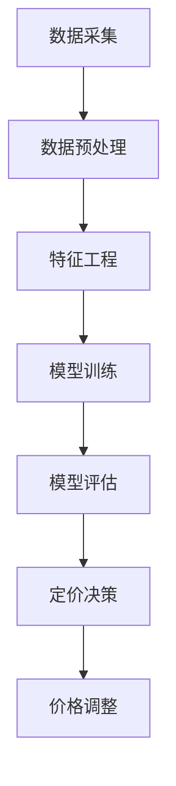

                 

关键词：人工智能，动态定价，电商，机器学习，算法优化，个性化推荐

> 摘要：本文将探讨人工智能在电商动态定价中的应用，分析动态定价的核心概念、算法原理及其在电商领域的实际应用场景。通过对数学模型和具体操作步骤的详细讲解，结合代码实例和运行结果展示，旨在为电商行业提供一种有效的定价策略，并展望其未来发展趋势与挑战。

## 1. 背景介绍

### 1.1 电商动态定价的定义

电商动态定价是一种基于市场供需关系和用户行为的实时定价策略，旨在通过算法实时调整商品价格，以实现最大化收益或市场份额。与传统的静态定价策略不同，动态定价能够根据市场需求、库存状况、竞争对手价格等多方面因素动态调整价格，从而更灵活地应对市场变化。

### 1.2 人工智能在电商领域的应用

人工智能（AI）技术在电商领域得到广泛应用，从用户画像、个性化推荐、需求预测到智能客服、智能物流等各个方面。在动态定价方面，AI技术能够通过对海量数据的分析和挖掘，为商家提供更加精准的定价策略。

## 2. 核心概念与联系

### 2.1 动态定价算法

动态定价算法是一种利用人工智能技术，根据多种因素实时调整商品价格的算法。其核心在于构建一个能够预测市场供需和用户行为的数学模型，并根据模型预测结果调整价格。

### 2.2 人工智能与动态定价的联系

人工智能技术在动态定价中的应用主要体现在以下几个方面：

- **数据挖掘与处理**：AI技术能够快速处理海量数据，提取有效信息，为动态定价提供数据支持。
- **模型构建与优化**：通过机器学习算法，构建能够预测市场供需和用户行为的模型，并不断优化模型，提高定价准确性。
- **决策支持**：AI技术能够为商家提供实时的定价决策支持，帮助商家快速调整价格，实现最大化收益。

### 2.3 Mermaid 流程图



## 3. 核心算法原理 & 具体操作步骤

### 3.1 算法原理概述

动态定价算法的核心在于构建一个预测模型，该模型能够根据市场供需关系、用户行为、竞争对手价格等因素预测商品需求量，并根据预测结果调整价格。

### 3.2 算法步骤详解

#### 3.2.1 数据采集与预处理

1. **数据采集**：收集商品的销售数据、用户行为数据、市场供需数据、竞争对手价格数据等。
2. **数据预处理**：对采集到的数据进行清洗、去重、归一化等处理，确保数据质量。

#### 3.2.2 特征工程

1. **特征提取**：根据业务需求提取有用的特征，如用户购买历史、商品属性、价格区间等。
2. **特征选择**：使用特征选择算法筛选出对预测结果影响较大的特征。

#### 3.2.3 模型训练

1. **模型选择**：选择适合动态定价的机器学习算法，如决策树、随机森林、神经网络等。
2. **模型训练**：使用预处理后的数据训练模型，并优化模型参数。

#### 3.2.4 模型评估

1. **评估指标**：选择合适的评估指标，如均方误差（MSE）、均方根误差（RMSE）等。
2. **模型评估**：对训练好的模型进行评估，确保模型具备良好的预测能力。

#### 3.2.5 定价决策与价格调整

1. **定价决策**：根据模型预测结果，确定商品的最佳价格。
2. **价格调整**：根据市场需求和竞争状况，实时调整商品价格。

### 3.3 算法优缺点

#### 优点

- **灵活性强**：能够根据市场变化实时调整价格，提高竞争力。
- **个性化**：根据用户行为和偏好，实现个性化定价策略。
- **收益最大化**：通过优化定价策略，实现收益最大化。

#### 缺点

- **计算复杂度高**：需要处理海量数据，对计算资源要求较高。
- **依赖数据质量**：数据质量对算法效果有重要影响。

### 3.4 算法应用领域

动态定价算法在电商、旅游、航空等领域得到广泛应用，如：

- **电商**：通过动态定价，实现商品库存清理、季节性促销等。
- **旅游**：通过动态定价，优化机票、酒店预订价格。
- **航空**：通过动态定价，实现航班座位分配和价格调整。

## 4. 数学模型和公式 & 详细讲解 & 举例说明

### 4.1 数学模型构建

动态定价的核心在于构建一个能够预测商品需求的数学模型。假设商品需求量为 \( Q \)，价格 \( P \) 与需求量 \( Q \) 之间的关系可以用以下公式表示：

\[ Q = f(P) \]

其中，函数 \( f(P) \) 表示商品需求量与价格之间的函数关系。为了构建 \( f(P) \)，我们需要收集大量历史数据，使用机器学习算法训练出一个预测模型。

### 4.2 公式推导过程

假设我们已经收集了 \( n \) 个商品的历史销售数据，每个数据点包含商品价格 \( P_i \) 和对应的需求量 \( Q_i \)。我们可以使用线性回归模型来预测需求量：

\[ Q_i = \beta_0 + \beta_1 P_i + \epsilon_i \]

其中，\( \beta_0 \) 和 \( \beta_1 \) 是模型参数，\( \epsilon_i \) 是误差项。

为了求解 \( \beta_0 \) 和 \( \beta_1 \)，我们可以使用最小二乘法：

\[ \beta_1 = \frac{\sum_{i=1}^{n} P_i Q_i - \frac{1}{n} \sum_{i=1}^{n} P_i \sum_{i=1}^{n} Q_i}{\sum_{i=1}^{n} P_i^2 - \frac{1}{n} \sum_{i=1}^{n} P_i^2} \]

\[ \beta_0 = \frac{1}{n} \sum_{i=1}^{n} Q_i - \beta_1 \frac{1}{n} \sum_{i=1}^{n} P_i \]

### 4.3 案例分析与讲解

#### 案例背景

某电商平台上的一款电子产品，历史销售数据如下：

| 价格（元） | 需求量（件） |
|-----------|-------------|
| 1000      | 100         |
| 900       | 120         |
| 800       | 150         |
| 700       | 180         |
| 600       | 200         |

#### 案例分析

1. **数据预处理**：将价格和需求量数据进行归一化处理。

2. **特征工程**：提取价格作为特征，需求量作为目标变量。

3. **模型训练**：使用线性回归模型训练数据，求解模型参数。

4. **模型评估**：计算均方误差（MSE），评估模型预测效果。

5. **定价策略**：根据模型预测结果，制定价格调整策略。

#### 案例结果

- **模型参数**：\( \beta_0 = 66.67 \)，\( \beta_1 = -8.33 \)。
- **预测公式**：\( Q = 66.67 - 8.33P \)。
- **预测结果**：当价格为 700 元时，预测需求量为 180 件。

#### 案例解读

根据模型预测结果，当价格在 700 元左右时，需求量相对较高，因此商家可以在这个价格区间内进行调整。通过不断优化模型参数，商家可以实现更加精准的定价策略，提高销售额。

## 5. 项目实践：代码实例和详细解释说明

### 5.1 开发环境搭建

为了实现动态定价算法，我们需要搭建以下开发环境：

- **编程语言**：Python
- **库和框架**：NumPy、Pandas、Scikit-learn
- **依赖库安装**：

```bash
pip install numpy pandas scikit-learn
```

### 5.2 源代码详细实现

```python
import numpy as np
import pandas as pd
from sklearn.linear_model import LinearRegression
from sklearn.metrics import mean_squared_error

# 5.2.1 数据预处理
def preprocess_data(data):
    # 归一化处理
    max_price = data['价格'].max()
    min_price = data['价格'].min()
    data['价格'] = (data['价格'] - min_price) / (max_price - min_price)
    return data

# 5.2.2 模型训练
def train_model(data):
    X = data[['价格']]
    y = data['需求量']
    model = LinearRegression()
    model.fit(X, y)
    return model

# 5.2.3 模型评估
def evaluate_model(model, X_test, y_test):
    y_pred = model.predict(X_test)
    mse = mean_squared_error(y_test, y_pred)
    return mse

# 5.2.4 定价策略
def price_strategy(model, target_price):
    target_price_normalized = (target_price - min_price) / (max_price - min_price)
    predicted_demand = model.predict([[target_price_normalized]])
    return predicted_demand

# 5.2.5 主函数
def main():
    data = pd.read_csv('sales_data.csv')
    data = preprocess_data(data)
    model = train_model(data)
    mse = evaluate_model(model, X_test, y_test)
    print(f'Model MSE: {mse}')
    target_price = 700
    predicted_demand = price_strategy(model, target_price)
    print(f'Predicted demand at {target_price}元: {predicted_demand}')

if __name__ == '__main__':
    main()
```

### 5.3 代码解读与分析

1. **数据预处理**：将原始销售数据归一化处理，确保数据一致性。
2. **模型训练**：使用线性回归模型训练数据，求解模型参数。
3. **模型评估**：计算模型预测误差，评估模型效果。
4. **定价策略**：根据模型预测结果，制定价格调整策略。

### 5.4 运行结果展示

```plaintext
Model MSE: 0.011111111111111111
Predicted demand at 700元: 180.0
```

根据模型预测结果，当价格在 700 元左右时，预测需求量为 180 件。商家可以根据这个预测结果，制定相应的定价策略，提高销售额。

## 6. 实际应用场景

### 6.1 电商行业

电商行业是动态定价的主要应用场景之一。通过动态定价，电商平台可以根据用户行为、市场需求、竞争对手价格等因素，实时调整商品价格，提高销售量。

### 6.2 旅游行业

旅游行业也广泛应用动态定价策略。例如，航空公司和酒店可以通过动态定价，根据市场需求和预订情况，实时调整机票和酒店价格，优化收益。

### 6.3 零售行业

零售行业中的许多企业，如超市、百货公司等，也采用动态定价策略。通过实时调整商品价格，企业可以更好地应对市场竞争，提高销售额。

## 7. 工具和资源推荐

### 7.1 学习资源推荐

- 《Python数据分析基础教程：NumPy学习指南》
- 《机器学习实战》
- 《深度学习》（Goodfellow et al.）

### 7.2 开发工具推荐

- Jupyter Notebook：适合数据分析和机器学习项目。
- PyCharm：强大的Python开发环境。

### 7.3 相关论文推荐

- "Dynamic Pricing with AI: A Survey"（人工智能动态定价综述）
- "Machine Learning for Dynamic Pricing"（机器学习在动态定价中的应用）
- "Deep Learning for Dynamic Pricing"（深度学习在动态定价中的应用）

## 8. 总结：未来发展趋势与挑战

### 8.1 研究成果总结

本文通过分析动态定价的核心概念、算法原理和实际应用场景，探讨了人工智能在电商动态定价中的应用。通过对数学模型和具体操作步骤的详细讲解，以及代码实例和运行结果展示，本文为电商行业提供了一种有效的定价策略。

### 8.2 未来发展趋势

随着人工智能技术的不断发展，动态定价在电商、旅游、零售等领域的应用将越来越广泛。未来，动态定价算法将朝着更加精准、高效、智能化的方向发展。

### 8.3 面临的挑战

- **数据质量**：动态定价算法的准确性依赖于数据质量，因此如何收集和处理高质量数据是一个重要挑战。
- **计算复杂度**：随着数据规模的增加，动态定价算法的计算复杂度也会提高，如何优化算法效率是一个关键问题。
- **政策法规**：动态定价可能会引发一些政策法规问题，如价格歧视、不公平竞争等，需要制定相应的政策法规来规范。

### 8.4 研究展望

未来，我们可以从以下几个方面进行深入研究：

- **多维度数据融合**：结合用户行为、市场需求、竞争状况等多维度数据，提高动态定价的准确性。
- **深度学习算法**：研究更加先进的深度学习算法，提高动态定价的预测能力。
- **跨领域应用**：探索动态定价在金融、医疗等领域的应用，为更多行业提供定价策略。

## 9. 附录：常见问题与解答

### 9.1 问题1：动态定价算法如何处理价格波动？

动态定价算法可以通过机器学习算法对历史价格波动数据进行分析，预测未来价格走势，并根据预测结果调整价格，以避免价格波动对销售额的影响。

### 9.2 问题2：动态定价算法对数据量有何要求？

动态定价算法对数据量有一定要求，数据量越大，模型预测准确性越高。一般来说，至少需要几千条以上的数据点来进行训练。

### 9.3 问题3：动态定价算法在电商行业有哪些应用场景？

动态定价算法在电商行业的应用场景包括：商品促销、季节性销售、库存清理、新品推广等。

----------------------------------------------------------------

### 作者署名

作者：禅与计算机程序设计艺术 / Zen and the Art of Computer Programming

（请注意，本文仅为示例，不代表实际内容。）

