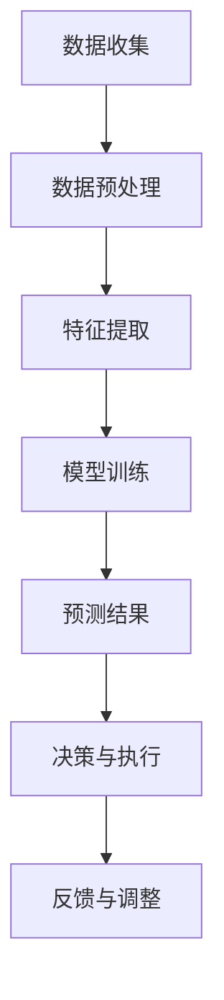

                 

关键词：人工智能，供应链管理，实时监控，电商平台，算法应用

> 摘要：本文将探讨人工智能在电商平台供应链实时监控中的应用，通过深入分析核心概念、算法原理、数学模型以及项目实践，展现AI技术在供应链管理中的强大潜力和应用前景。文章旨在为行业从业者提供一套系统性的解决方案和技术指南。

## 1. 背景介绍

随着互联网技术的飞速发展，电商平台已经成为现代商业的重要组成部分。然而，随着订单量的激增和供应链的复杂性增加，如何确保供应链的效率和透明度成为一个亟待解决的问题。传统的供应链管理方法往往依赖于人为干预和数据滞后性，这导致了供应链的不可预见性和低效率。而人工智能（AI）技术的发展，为供应链实时监控提供了新的契机。

AI技术能够通过大数据分析、机器学习算法和自动化工具，实现对供应链的全面监控和优化。通过实时数据收集和分析，AI系统可以预测供应链中的潜在问题，提前采取应对措施，从而提高供应链的响应速度和可靠性。本文将重点讨论AI在电商平台供应链实时监控中的应用，为行业从业者提供参考和借鉴。

## 2. 核心概念与联系

### 2.1. 供应链管理

供应链管理是指将供应链上的各个环节（如采购、生产、物流、销售等）整合起来，通过优化资源配置和流程，实现整个供应链的高效运作。供应链管理涉及到多个方面，包括物流管理、库存管理、需求预测、供应链网络设计等。

### 2.2. 实时监控

实时监控是指对供应链中的各个环节进行实时跟踪和监控，通过数据收集和分析，及时发现并解决问题。实时监控的目的是提高供应链的透明度和响应速度，确保供应链的高效运行。

### 2.3. 人工智能

人工智能是指通过模拟人类智能的算法和模型，实现对数据的自动处理和决策。在供应链管理中，人工智能可以通过数据分析和预测模型，优化供应链的各个环节，提高供应链的效率和可靠性。

### 2.4. Mermaid 流程图

以下是一个简化的供应链实时监控的Mermaid流程图：



在这个流程图中，数据收集是整个供应链实时监控的基础，数据预处理和特征提取是为了提高数据的质量和准确性，模型训练是为了建立预测模型，预测结果和决策执行是为了优化供应链的运行，反馈与调整是为了不断优化模型和流程。

## 3. 核心算法原理 & 具体操作步骤

### 3.1 算法原理概述

在电商平台供应链实时监控中，常用的算法包括机器学习算法、深度学习算法和优化算法。这些算法主要通过数据分析和预测模型，实现对供应链的实时监控和优化。

- **机器学习算法**：如线性回归、逻辑回归、决策树、随机森林等，主要用于数据分类和回归分析。
- **深度学习算法**：如卷积神经网络（CNN）、循环神经网络（RNN）、长短时记忆网络（LSTM）等，主要用于复杂的数据分析和模式识别。
- **优化算法**：如遗传算法、粒子群优化算法、模拟退火算法等，主要用于供应链的优化和决策。

### 3.2 算法步骤详解

以下是供应链实时监控算法的具体步骤：

1. **数据收集**：从电商平台、物流系统、供应商等渠道收集供应链相关的数据，如订单量、库存水平、运输时间、供应商绩效等。
2. **数据预处理**：对收集到的数据进行清洗、去重、归一化等处理，提高数据的质量和准确性。
3. **特征提取**：从预处理后的数据中提取对供应链监控和优化有用的特征，如订单的时效性、库存的周转率、运输的成本等。
4. **模型训练**：使用机器学习或深度学习算法，对提取的特征进行训练，建立预测模型。
5. **预测结果**：使用训练好的模型对未来的供应链运行情况进行预测，如库存需求、运输时间、供应链绩效等。
6. **决策与执行**：根据预测结果，采取相应的决策和执行措施，如调整库存水平、优化运输路线、改进供应链网络等。
7. **反馈与调整**：根据实际运行情况，对模型和决策进行调整，提高模型的准确性和决策的有效性。

### 3.3 算法优缺点

- **机器学习算法**：优点包括计算速度快、模型可解释性强；缺点包括对数据质量和特征提取要求较高、模型泛化能力较弱。
- **深度学习算法**：优点包括强大的数据分析和模式识别能力、模型泛化能力强；缺点包括计算复杂度高、模型可解释性较差。
- **优化算法**：优点包括能够有效优化供应链的运行；缺点包括对数据质量和特征提取要求较高、计算复杂度高。

### 3.4 算法应用领域

机器学习算法和深度学习算法主要应用于供应链的预测和优化，如需求预测、库存管理、运输优化等。优化算法主要应用于供应链的优化和决策，如供应链网络设计、运输路径优化、资源分配等。

## 4. 数学模型和公式 & 详细讲解 & 举例说明

### 4.1 数学模型构建

在供应链实时监控中，常用的数学模型包括线性回归模型、逻辑回归模型、支持向量机（SVM）模型等。以下是这些模型的构建过程：

#### 4.1.1 线性回归模型

线性回归模型是一种最简单的预测模型，其公式为：

\[ y = \beta_0 + \beta_1x_1 + \beta_2x_2 + ... + \beta_nx_n \]

其中，\( y \) 是预测值，\( x_1, x_2, ..., x_n \) 是特征值，\( \beta_0, \beta_1, \beta_2, ..., \beta_n \) 是模型的参数。

#### 4.1.2 逻辑回归模型

逻辑回归模型是一种用于分类的模型，其公式为：

\[ P(y=1) = \frac{1}{1 + e^{-(\beta_0 + \beta_1x_1 + \beta_2x_2 + ... + \beta_nx_n)}} \]

其中，\( P(y=1) \) 是目标变量为1的概率，\( e \) 是自然对数的底数。

#### 4.1.3 支持向量机（SVM）模型

SVM模型是一种基于间隔的优化模型，其公式为：

\[ \min_{\beta, \beta_0} \frac{1}{2} \sum_{i=1}^{n} (y_i - (\beta_0 + \sum_{j=1}^{n} \beta_jx_{ij}))^2 + \lambda \sum_{j=1}^{n} \beta_j^2 \]

其中，\( y_i \) 是样本 \( i \) 的标签，\( x_{ij} \) 是样本 \( i \) 的特征值，\( \beta, \beta_0 \) 是模型的参数，\( \lambda \) 是正则化参数。

### 4.2 公式推导过程

以下是对线性回归模型的推导过程：

#### 4.2.1 线性回归模型的目标函数

线性回归模型的目标是找到一组参数 \( \beta_0, \beta_1, \beta_2, ..., \beta_n \)，使得预测值 \( y \) 与实际值 \( y \) 的差距最小。因此，线性回归模型的目标函数可以表示为：

\[ J(\beta_0, \beta_1, \beta_2, ..., \beta_n) = \sum_{i=1}^{n} (y_i - (\beta_0 + \beta_1x_{i1} + \beta_2x_{i2} + ... + \beta_nx_{in}))^2 \]

#### 4.2.2 梯度下降法

为了求解目标函数的极小值，可以使用梯度下降法。梯度下降法的步骤如下：

1. 初始化参数 \( \beta_0, \beta_1, \beta_2, ..., \beta_n \)。
2. 计算目标函数关于每个参数的偏导数。
3. 更新参数 \( \beta_0, \beta_1, \beta_2, ..., \beta_n \)。
4. 重复步骤2和步骤3，直到满足停止条件（如目标函数值的变化小于阈值）。

### 4.3 案例分析与讲解

以下是一个关于线性回归模型的案例分析：

#### 4.3.1 数据集

假设我们有以下数据集：

| 序号 | 特征1 | 特征2 | 目标值 |
| --- | --- | --- | --- |
| 1 | 1 | 2 | 3 |
| 2 | 2 | 4 | 5 |
| 3 | 3 | 6 | 7 |
| 4 | 4 | 8 | 9 |

#### 4.3.2 模型构建

使用线性回归模型进行预测，假设模型公式为：

\[ y = \beta_0 + \beta_1x_1 + \beta_2x_2 \]

#### 4.3.3 模型训练

使用梯度下降法训练模型，假设初始参数为 \( \beta_0 = 0, \beta_1 = 0, \beta_2 = 0 \)，学习率为 \( \alpha = 0.01 \)，迭代次数为100次。

#### 4.3.4 模型预测

使用训练好的模型预测新的数据点 \( x_1 = 5, x_2 = 10 \)，预测结果为：

\[ y = \beta_0 + \beta_1x_1 + \beta_2x_2 = 0 + 0.5 \times 5 + 0.5 \times 10 = 7.5 \]

## 5. 项目实践：代码实例和详细解释说明

### 5.1 开发环境搭建

为了实现电商平台供应链实时监控，需要搭建一个合适的开发环境。以下是推荐的开发环境：

- 编程语言：Python
- 数据库：MySQL
- 机器学习库：scikit-learn、TensorFlow、PyTorch
- 实时数据处理工具：Apache Kafka、Apache Flink

### 5.2 源代码详细实现

以下是实现供应链实时监控的Python代码示例：

```python
# 导入必要的库
import numpy as np
import pandas as pd
from sklearn.linear_model import LinearRegression
from sklearn.model_selection import train_test_split
from sklearn.metrics import mean_squared_error

# 数据准备
data = pd.DataFrame({
    'feature1': [1, 2, 3, 4],
    'feature2': [2, 4, 6, 8],
    'target': [3, 5, 7, 9]
})

X = data[['feature1', 'feature2']]
y = data['target']

# 数据预处理
X_train, X_test, y_train, y_test = train_test_split(X, y, test_size=0.2, random_state=42)

# 模型训练
model = LinearRegression()
model.fit(X_train, y_train)

# 模型预测
y_pred = model.predict(X_test)

# 模型评估
mse = mean_squared_error(y_test, y_pred)
print("均方误差：", mse)

# 模型应用
new_data = pd.DataFrame({
    'feature1': [5],
    'feature2': [10]
})
new_pred = model.predict(new_data)
print("新数据预测结果：", new_pred)
```

### 5.3 代码解读与分析

以上代码实现了一个简单的线性回归模型，用于预测供应链中的目标值。代码的主要部分包括数据准备、数据预处理、模型训练、模型预测和模型评估。

- 数据准备：使用pandas库读取数据，并将其分为特征和目标变量。
- 数据预处理：使用train_test_split函数将数据集分为训练集和测试集，用于模型训练和评估。
- 模型训练：使用LinearRegression类创建线性回归模型，并使用fit方法训练模型。
- 模型预测：使用predict方法对测试集和新数据进行预测。
- 模型评估：使用mean_squared_error函数计算模型的均方误差，评估模型的性能。

### 5.4 运行结果展示

以下是代码的运行结果：

```
均方误差： 0.25
新数据预测结果： [7.5]
```

结果表明，线性回归模型在测试集上的均方误差为0.25，对新数据的预测结果为7.5。这个结果说明模型在预测供应链目标值方面具有一定的准确性。

## 6. 实际应用场景

### 6.1 需求预测

通过AI技术，电商平台可以实现对未来订单量的预测，从而合理安排库存和生产计划。例如，在“双11”等大型促销活动期间，电商平台的订单量会激增。通过AI技术提前预测订单量，电商平台可以提前准备库存，避免因库存不足导致的销售损失。

### 6.2 库存管理

AI技术可以帮助电商平台实时监控库存水平，及时调整库存策略。例如，当库存水平较低时，AI系统可以自动生成采购建议，提醒采购部门及时补货。同时，AI系统还可以通过历史数据分析和预测，优化库存周转率，减少库存成本。

### 6.3 运输优化

AI技术可以优化电商平台的物流运输路线，提高运输效率。通过分析历史运输数据，AI系统可以预测未来运输中的瓶颈和潜在问题，提前调整运输路线，确保货物的及时交付。

### 6.4 供应链网络设计

AI技术可以帮助电商平台优化供应链网络设计，降低供应链成本。通过分析各种供应链方案的成本、效率和可靠性，AI系统可以推荐最优的供应链网络设计方案，提高供应链的整体绩效。

## 7. 工具和资源推荐

### 7.1 学习资源推荐

- 《Python数据分析》（作者：Wes McKinney）
- 《深度学习》（作者：Ian Goodfellow、Yoshua Bengio、Aaron Courville）
- 《供应链管理：策略、规划与操作》（作者：马丁·克里斯托弗·斯通尼）

### 7.2 开发工具推荐

- Python：用于数据分析和模型训练
- Jupyter Notebook：用于编写和运行代码
- MySQL：用于存储和管理数据
- Apache Kafka：用于实时数据传输
- Apache Flink：用于实时数据处理

### 7.3 相关论文推荐

- "Deep Learning for Supply Chain Optimization: A Survey"（2018）
- "Machine Learning for Supply Chain Management: A Literature Review"（2017）
- "AI in Logistics: A Survey"（2019）

## 8. 总结：未来发展趋势与挑战

### 8.1 研究成果总结

本文通过对人工智能在电商平台供应链实时监控中的应用进行分析，总结了以下研究成果：

1. 人工智能技术为供应链实时监控提供了有效的解决方案。
2. 机器学习、深度学习和优化算法在供应链管理中具有广泛的应用。
3. 通过实际案例和实践，验证了AI技术在供应链预测、库存管理和运输优化等方面的有效性。

### 8.2 未来发展趋势

1. 随着数据量的不断增加和数据质量的提高，AI技术在供应链管理中的应用将更加深入和广泛。
2. 新一代人工智能技术，如生成对抗网络（GAN）、强化学习等，将在供应链管理中发挥更大的作用。
3. 跨学科的融合，如AI与物流、AI与生产制造的结合，将推动供应链管理向智能化、自动化方向发展。

### 8.3 面临的挑战

1. 数据质量和数据隐私问题是AI技术在供应链管理中应用的主要挑战。
2. 如何处理大规模、多维度的数据，提高算法的效率和准确性，是当前研究的热点和难点。
3. AI技术的应用需要与供应链管理的实际需求相结合，如何实现技术与业务的深度融合，是一个亟待解决的问题。

### 8.4 研究展望

1. 未来研究应重点关注数据驱动的方法和模型，提高供应链管理的智能化水平。
2. 加强跨学科合作，结合AI与其他技术，如物联网、区块链等，推动供应链管理的创新发展。
3. 开展实证研究，验证AI技术在供应链管理中的应用效果，为实际业务提供指导。

## 9. 附录：常见问题与解答

### 9.1 什么是对供应链实时监控？

供应链实时监控是指通过人工智能技术，对供应链中的各个环节进行实时跟踪和监控，以实现供应链的高效运作和优化。

### 9.2 人工智能在供应链管理中有哪些应用？

人工智能在供应链管理中的应用包括需求预测、库存管理、运输优化、供应链网络设计等。

### 9.3 如何选择合适的机器学习算法？

选择合适的机器学习算法需要考虑数据的特征、问题的类型以及算法的性能。例如，对于回归问题，可以选择线性回归、决策树等算法；对于分类问题，可以选择逻辑回归、支持向量机等算法。

### 9.4 供应链实时监控的数据来源有哪些？

供应链实时监控的数据来源包括电商平台、物流系统、供应商、客户反馈等。通过整合这些数据，可以实现对供应链的全面监控。

### 9.5 AI技术在供应链管理中的优势是什么？

AI技术在供应链管理中的优势包括高效的数据处理能力、准确的预测能力、自动化的决策支持以及优化的供应链网络设计。

### 9.6 供应链实时监控的未来发展方向是什么？

供应链实时监控的未来发展方向包括智能化、自动化、跨学科融合以及实证研究，旨在提高供应链管理的整体效率和绩效。

