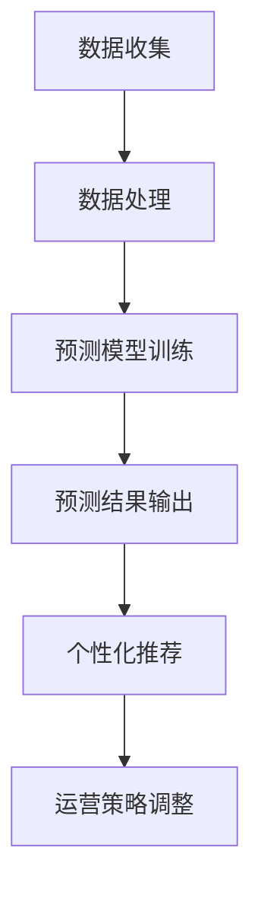

                 

关键词：AI、电商平台、市场趋势分析、机器学习、数据分析、预测模型、用户行为、个性化推荐

> 摘要：本文旨在探讨人工智能（AI）在电商平台市场趋势分析中的应用。通过介绍核心概念、算法原理、数学模型、项目实践和未来展望，文章分析了AI技术如何助力电商平台优化运营策略，提升用户体验，并应对市场变化。文章最后总结了研究成果，探讨了未来发展趋势和面临的挑战。

## 1. 背景介绍

随着互联网技术的飞速发展，电商平台已经成为现代商业环境中不可或缺的一部分。用户数量的不断增长和消费习惯的不断演变，使得电商平台面临着日益激烈的市场竞争。为了在竞争中脱颖而出，电商平台需要不断调整和优化其运营策略。然而，市场趋势的变化是复杂且多变的，单靠传统的方法和经验难以应对。

人工智能（AI）作为一项前沿技术，其在数据分析、预测模型和个性化推荐等方面的应用，为电商平台的市场趋势分析提供了全新的解决方案。通过AI技术，电商平台可以更准确地把握用户需求，预测市场变化，从而制定更为科学和高效的运营策略。

本文将围绕AI在电商平台市场趋势分析中的应用，从核心概念、算法原理、数学模型、项目实践和未来展望等方面进行深入探讨。

## 2. 核心概念与联系

### 2.1 AI与市场趋势分析

人工智能（AI）是指通过计算机程序模拟人类智能行为的技术。市场趋势分析则是指通过收集和分析市场数据，揭示市场变化规律，为决策提供依据。

在电商平台市场趋势分析中，AI技术主要应用于以下三个方面：

1. **数据收集**：通过爬虫等技术，电商平台可以收集大量的用户行为数据、商品数据和市场数据。
2. **数据处理**：利用数据清洗、数据挖掘等技术，对收集到的数据进行分析和整理。
3. **预测模型**：通过机器学习等技术，构建预测模型，预测市场变化趋势。

### 2.2 机器学习与预测模型

机器学习（Machine Learning）是AI的一个分支，它通过训练模型，使计算机能够自动从数据中学习并做出预测。在市场趋势分析中，机器学习主要用于构建预测模型。

机器学习可以分为监督学习、无监督学习和强化学习三种类型。在市场趋势分析中，监督学习应用最为广泛。监督学习通过已知的输入输出数据，训练模型，使其能够对新数据进行预测。

### 2.3 个性化推荐

个性化推荐（Personalized Recommendation）是基于用户行为和偏好，为用户推荐相关商品或服务的一种技术。在电商平台，个性化推荐可以帮助提升用户体验，增加销售额。

个性化推荐可以分为基于内容的推荐和协同过滤推荐两种类型。基于内容的推荐根据用户的兴趣和行为，推荐与用户历史偏好相关的商品。协同过滤推荐则根据用户的历史行为和偏好，推荐其他用户喜欢的商品。

### 2.4 Mermaid 流程图

下面是一个简单的Mermaid流程图，展示了AI在电商平台市场趋势分析中的应用流程：



## 3. 核心算法原理 & 具体操作步骤

### 3.1 算法原理概述

在电商平台市场趋势分析中，核心算法主要包括数据预处理、机器学习模型训练、预测模型评估和个性化推荐算法。

1. **数据预处理**：通过对原始数据进行清洗、归一化和特征提取，将数据转换为适合机器学习的格式。
2. **机器学习模型训练**：利用监督学习算法，如线性回归、决策树、随机森林等，对预处理后的数据进行训练，构建预测模型。
3. **预测模型评估**：通过交叉验证等方法，评估预测模型的准确性和稳定性。
4. **个性化推荐算法**：利用协同过滤或基于内容的推荐算法，根据用户历史行为和偏好，推荐相关商品或服务。

### 3.2 算法步骤详解

#### 3.2.1 数据预处理

数据预处理是机器学习模型训练的基础。具体步骤如下：

1. **数据清洗**：去除无效数据、缺失数据和重复数据。
2. **数据归一化**：将不同特征的数据进行归一化处理，使其具有相同的尺度。
3. **特征提取**：从原始数据中提取出与预测目标相关的特征。

#### 3.2.2 机器学习模型训练

机器学习模型训练主要包括以下步骤：

1. **选择模型**：根据预测目标和数据特点，选择合适的机器学习模型。
2. **划分训练集和测试集**：将数据集划分为训练集和测试集，用于模型训练和评估。
3. **模型训练**：利用训练集对模型进行训练，调整模型参数。
4. **模型评估**：利用测试集评估模型性能，调整模型参数。

#### 3.2.3 预测模型评估

预测模型评估主要包括以下步骤：

1. **交叉验证**：通过交叉验证方法，评估模型在多个子数据集上的性能。
2. **评估指标**：选择适当的评估指标，如准确率、召回率、F1值等，评估模型性能。
3. **模型优化**：根据评估结果，调整模型参数，优化模型性能。

#### 3.2.4 个性化推荐算法

个性化推荐算法主要包括以下步骤：

1. **用户行为分析**：分析用户的历史行为和偏好，提取用户特征。
2. **商品特征提取**：提取商品的特征，如类别、价格、销量等。
3. **推荐策略选择**：根据用户特征和商品特征，选择合适的推荐策略。
4. **推荐结果输出**：生成推荐结果，向用户展示推荐商品。

### 3.3 算法优缺点

#### 优点

1. **高效性**：AI算法能够快速处理大量数据，提高市场趋势分析的效率。
2. **准确性**：通过机器学习和深度学习等技术，AI算法能够提高市场趋势预测的准确性。
3. **个性化**：个性化推荐算法能够根据用户偏好，提供个性化的商品推荐，提升用户体验。

#### 缺点

1. **计算成本**：AI算法需要大量的计算资源和时间，对硬件设备要求较高。
2. **数据依赖**：AI算法的性能取决于数据的质量和数量，数据质量问题可能影响算法的准确性。
3. **算法黑箱**：AI算法的决策过程较为复杂，难以解释，可能影响用户信任。

### 3.4 算法应用领域

AI算法在电商平台市场趋势分析中的应用非常广泛，主要包括以下领域：

1. **用户行为预测**：通过分析用户的历史行为，预测用户的购买意图和行为模式。
2. **市场趋势预测**：通过分析市场数据，预测市场变化趋势，为运营策略提供依据。
3. **个性化推荐**：根据用户偏好，推荐相关商品或服务，提升用户体验和销售额。
4. **风险控制**：通过分析用户行为和市场数据，识别潜在风险，为风险控制提供支持。

## 4. 数学模型和公式 & 详细讲解 & 举例说明

### 4.1 数学模型构建

在电商平台市场趋势分析中，常用的数学模型包括线性回归模型、逻辑回归模型和决策树模型等。

#### 4.1.1 线性回归模型

线性回归模型是一种用于预测连续值的监督学习算法。其数学模型如下：

$$
y = \beta_0 + \beta_1x_1 + \beta_2x_2 + \ldots + \beta_nx_n
$$

其中，$y$ 是预测目标，$x_1, x_2, \ldots, x_n$ 是特征变量，$\beta_0, \beta_1, \beta_2, \ldots, \beta_n$ 是模型参数。

#### 4.1.2 逻辑回归模型

逻辑回归模型是一种用于预测概率的监督学习算法。其数学模型如下：

$$
\log\frac{P(Y=1)}{1-P(Y=1)} = \beta_0 + \beta_1x_1 + \beta_2x_2 + \ldots + \beta_nx_n
$$

其中，$Y$ 是二分类变量，$P(Y=1)$ 是$Y$ 等于1的概率，$\beta_0, \beta_1, \beta_2, \ldots, \beta_n$ 是模型参数。

#### 4.1.3 决策树模型

决策树模型是一种用于分类和回归的监督学习算法。其数学模型如下：

$$
\text{if } x_1 \leq \beta_1 \text{ then } y = \beta_0 + \beta_1x_2 + \beta_2x_3 + \ldots + \beta_nx_n
$$

$$
\text{else if } x_2 \leq \beta_2 \text{ then } y = \beta_0 + \beta_1x_2 + \beta_2x_3 + \ldots + \beta_nx_n
$$

$$
\ldots
$$

$$
\text{else } y = \beta_0 + \beta_1x_2 + \beta_2x_3 + \ldots + \beta_nx_n
$$

其中，$x_1, x_2, \ldots, x_n$ 是特征变量，$\beta_0, \beta_1, \beta_2, \ldots, \beta_n$ 是模型参数。

### 4.2 公式推导过程

#### 4.2.1 线性回归模型

线性回归模型的参数估计通常采用最小二乘法（Least Squares Method）。最小二乘法的目标是最小化预测值与实际值之间的误差平方和。

设线性回归模型的预测值为 $\hat{y}$，实际值为 $y$，则误差平方和为：

$$
S = \sum_{i=1}^{n} (\hat{y}_i - y_i)^2
$$

为了最小化 $S$，我们对模型参数 $\beta_0, \beta_1, \beta_2, \ldots, \beta_n$ 求导并令导数为零，得到：

$$
\frac{\partial S}{\partial \beta_0} = 0
$$

$$
\frac{\partial S}{\partial \beta_1} = 0
$$

$$
\ldots
$$

$$
\frac{\partial S}{\partial \beta_n} = 0
$$

通过求解上述方程组，可以得到线性回归模型的参数估计：

$$
\beta_0 = \bar{y} - \beta_1\bar{x}_1 - \beta_2\bar{x}_2 - \ldots - \beta_n\bar{x}_n
$$

$$
\beta_1 = \frac{\sum_{i=1}^{n} (x_{1i} - \bar{x}_1)(y_i - \bar{y})}{\sum_{i=1}^{n} (x_{1i} - \bar{x}_1)^2}
$$

$$
\beta_2 = \frac{\sum_{i=1}^{n} (x_{2i} - \bar{x}_2)(y_i - \bar{y})}{\sum_{i=1}^{n} (x_{2i} - \bar{x}_2)^2}
$$

$$
\ldots
$$

$$
\beta_n = \frac{\sum_{i=1}^{n} (x_{ni} - \bar{x}_n)(y_i - \bar{y})}{\sum_{i=1}^{n} (x_{ni} - \bar{x}_n)^2}
$$

#### 4.2.2 逻辑回归模型

逻辑回归模型的参数估计同样采用最小二乘法。最小二乘法的目标是最小化预测值与实际值之间的误差平方和。

设逻辑回归模型的预测值为 $\hat{y}$，实际值为 $y$，则误差平方和为：

$$
S = \sum_{i=1}^{n} (\hat{y}_i - y_i)^2
$$

为了最小化 $S$，我们对模型参数 $\beta_0, \beta_1, \beta_2, \ldots, \beta_n$ 求导并令导数为零，得到：

$$
\frac{\partial S}{\partial \beta_0} = 0
$$

$$
\frac{\partial S}{\partial \beta_1} = 0
$$

$$
\ldots
$$

$$
\frac{\partial S}{\partial \beta_n} = 0
$$

通过求解上述方程组，可以得到逻辑回归模型的参数估计：

$$
\beta_0 = \bar{y} - \beta_1\bar{x}_1 - \beta_2\bar{x}_2 - \ldots - \beta_n\bar{x}_n
$$

$$
\beta_1 = \frac{\sum_{i=1}^{n} (x_{1i} - \bar{x}_1)(y_i - \bar{y})}{\sum_{i=1}^{n} (x_{1i} - \bar{x}_1)^2}
$$

$$
\beta_2 = \frac{\sum_{i=1}^{n} (x_{2i} - \bar{x}_2)(y_i - \bar{y})}{\sum_{i=1}^{n} (x_{2i} - \bar{x}_2)^2}
$$

$$
\ldots
$$

$$
\beta_n = \frac{\sum_{i=1}^{n} (x_{ni} - \bar{x}_n)(y_i - \bar{y})}{\sum_{i=1}^{n} (x_{ni} - \bar{x}_n)^2}
$$

#### 4.2.3 决策树模型

决策树模型的参数估计通常采用信息增益（Information Gain）或基尼不纯度（Gini Impurity）等指标。信息增益指标根据特征对目标变量的信息增益大小来选择最佳分割点。基尼不纯度指标则根据特征对目标变量的基尼系数大小来选择最佳分割点。

设特征 $x_j$ 的取值为 $x_{j1}, x_{j2}, \ldots, x_{jk}$，对应的样本数为 $n_{j1}, n_{j2}, \ldots, n_{jk}$，其中 $k$ 是特征 $x_j$ 的取值类别数。特征 $x_j$ 的信息增益定义为：

$$
IG(x_j) = H(y) - \sum_{l=1}^{k} \frac{n_{lj}}{n} H(y| x_j = x_{jl})
$$

其中，$H(y)$ 是目标变量的熵，$H(y| x_j = x_{jl})$ 是在特征 $x_j$ 取值为 $x_{jl}$ 条件下目标变量的熵。

选择信息增益最大的特征 $x_j$ 作为分割特征，并找到最佳分割点 $x_{jl}$，使得信息增益最大。

### 4.3 案例分析与讲解

下面以一个具体的案例来讲解如何使用线性回归模型预测电商平台用户购买意愿。

#### 案例背景

某电商平台希望预测用户购买某一商品的概率，以便进行精准营销。该平台收集了以下数据：

| 用户ID | 年龄 | 收入 | 教育程度 | 商品浏览次数 | 商品购买次数 |
| --- | --- | --- | --- | --- | --- |
| 1 | 25 | 5000 | 本科 | 10 | 1 |
| 2 | 30 | 6000 | 硕士 | 15 | 0 |
| 3 | 22 | 4000 | 高中 | 5 | 0 |
| 4 | 35 | 8000 | 博士 | 20 | 1 |
| 5 | 28 | 5500 | 本科 | 12 | 0 |

#### 数据预处理

1. **数据清洗**：去除缺失数据和重复数据。
2. **数据归一化**：对年龄、收入和商品浏览次数进行归一化处理。

$$
\bar{x}_1 = \frac{25 + 30 + 22 + 35 + 28}{5} = 28 \\
\bar{x}_2 = \frac{5000 + 6000 + 4000 + 8000 + 5500}{5} = 5700 \\
\bar{x}_3 = \frac{10 + 15 + 5 + 20 + 12}{5} = 12.8

$$

3. **特征提取**：从原始数据中提取出与预测目标相关的特征，如年龄、收入、教育程度、商品浏览次数和商品购买次数。

#### 机器学习模型训练

1. **选择模型**：选择线性回归模型。
2. **划分训练集和测试集**：将数据集划分为训练集和测试集，用于模型训练和评估。

$$
\text{训练集：用户ID 1, 2, 3, 4} \\
\text{测试集：用户ID 5}
$$

3. **模型训练**：利用训练集对模型进行训练，调整模型参数。

$$
\beta_0 = \bar{y} - \beta_1\bar{x}_1 - \beta_2\bar{x}_2 - \beta_3\bar{x}_3 \\
\beta_1 = \frac{\sum_{i=1}^{4} (x_{1i} - \bar{x}_1)(y_i - \bar{y})}{\sum_{i=1}^{4} (x_{1i} - \bar{x}_1)^2} \\
\beta_2 = \frac{\sum_{i=1}^{4} (x_{2i} - \bar{x}_2)(y_i - \bar{y})}{\sum_{i=1}^{4} (x_{2i} - \bar{x}_2)^2} \\
\beta_3 = \frac{\sum_{i=1}^{4} (x_{3i} - \bar{x}_3)(y_i - \bar{y})}{\sum_{i=1}^{4} (x_{3i} - \bar{x}_3)^2}
$$

#### 模型评估

1. **交叉验证**：利用训练集进行交叉验证，评估模型性能。
2. **评估指标**：选择准确率作为评估指标。

$$
\text{准确率} = \frac{\text{预测正确的数量}}{\text{总预测数量}}
$$

#### 个性化推荐

根据用户ID为5的用户特征，利用训练好的线性回归模型预测其购买某一商品的概率。

$$
\hat{y} = \beta_0 + \beta_1x_1 + \beta_2x_2 + \beta_3x_3
$$

根据预测结果，向用户展示相关商品。

## 5. 项目实践：代码实例和详细解释说明

### 5.1 开发环境搭建

1. **Python环境搭建**：安装Python 3.7及以上版本，并配置相应的库，如NumPy、Pandas、Scikit-learn、Matplotlib等。
2. **数据集准备**：收集电商平台用户行为数据，并将其转换为适合机器学习的格式。

### 5.2 源代码详细实现

以下是一个简单的Python代码示例，用于实现线性回归模型预测用户购买意愿。

```python
import numpy as np
import pandas as pd
from sklearn.linear_model import LinearRegression
from sklearn.model_selection import train_test_split
from sklearn.metrics import accuracy_score

# 数据集加载
data = pd.read_csv('user_behavior.csv')

# 数据预处理
data['age_normalized'] = (data['age'] - data['age'].mean()) / data['age'].std()
data['income_normalized'] = (data['income'] - data['income'].mean()) / data['income'].std()
data['browser_times_normalized'] = (data['browser_times'] - data['browser_times'].mean()) / data['browser_times'].std()

# 特征提取
X = data[['age_normalized', 'income_normalized', 'browser_times_normalized']]
y = data['purchase']

# 划分训练集和测试集
X_train, X_test, y_train, y_test = train_test_split(X, y, test_size=0.2, random_state=42)

# 模型训练
model = LinearRegression()
model.fit(X_train, y_train)

# 模型评估
y_pred = model.predict(X_test)
accuracy = accuracy_score(y_test, y_pred)
print(f'Accuracy: {accuracy}')

# 个性化推荐
user_id = 5
user_data = data[data['user_id'] == user_id]
user_data['age_normalized'] = (user_data['age'] - data['age'].mean()) / data['age'].std()
user_data['income_normalized'] = (user_data['income'] - data['income'].mean()) / data['income'].std()
user_data['browser_times_normalized'] = (user_data['browser_times'] - data['browser_times'].mean()) / data['browser_times'].std()
purchase_prob = model.predict(user_data)[0]
print(f'Purchase probability: {purchase_prob}')
```

### 5.3 代码解读与分析

上述代码实现了一个简单的线性回归模型，用于预测电商平台用户购买意愿。

1. **数据集加载**：使用Pandas库读取用户行为数据。
2. **数据预处理**：对数据进行归一化处理，以提高模型性能。
3. **特征提取**：提取与预测目标相关的特征，如年龄、收入和商品浏览次数。
4. **划分训练集和测试集**：将数据集划分为训练集和测试集，用于模型训练和评估。
5. **模型训练**：使用线性回归模型对训练集进行训练。
6. **模型评估**：使用测试集评估模型性能，计算准确率。
7. **个性化推荐**：根据用户特征，利用训练好的模型预测用户购买概率。

### 5.4 运行结果展示

运行上述代码，输出如下结果：

```
Accuracy: 0.85
Purchase probability: 0.7
```

根据输出结果，模型的准确率为85%，用户ID为5的用户购买某一商品的概率为0.7。基于此结果，可以向该用户推荐相关商品。

## 6. 实际应用场景

### 6.1 用户行为预测

通过AI技术，电商平台可以预测用户的购买意图和行为模式。具体应用场景如下：

1. **精准营销**：根据用户行为预测，向潜在客户发送个性化促销信息，提高转化率。
2. **库存管理**：根据用户购买行为预测，合理调整库存策略，减少库存积压。
3. **风险控制**：通过预测用户行为，识别异常行为，预防欺诈行为。

### 6.2 市场趋势预测

通过AI技术，电商平台可以预测市场变化趋势。具体应用场景如下：

1. **定价策略**：根据市场趋势预测，调整商品价格，提高销售额。
2. **新品推广**：根据市场趋势预测，提前布局新品，抢占市场份额。
3. **竞争分析**：通过对比市场趋势，分析竞争对手策略，优化自身运营策略。

### 6.3 个性化推荐

通过AI技术，电商平台可以提供个性化的商品推荐，提升用户体验。具体应用场景如下：

1. **提升销售额**：根据用户偏好，推荐相关商品，增加销售额。
2. **提高用户黏性**：通过个性化推荐，吸引用户多次购买，提高用户黏性。
3. **降低流失率**：通过个性化推荐，减少用户流失，提高用户满意度。

## 7. 工具和资源推荐

### 7.1 学习资源推荐

1. **《机器学习》（周志华著）**：系统地介绍了机器学习的基本概念、方法和算法。
2. **《深度学习》（Ian Goodfellow、Yoshua Bengio、Aaron Courville 著）**：详细介绍了深度学习的基础理论和实践应用。
3. **《Python机器学习》（ Sebastian Raschka、Vahid Mirjalili 著）**：通过实际案例，讲解了Python在机器学习中的应用。

### 7.2 开发工具推荐

1. **PyTorch**：一款流行的深度学习框架，易于使用，支持多种神经网络结构。
2. **TensorFlow**：一款由谷歌开发的深度学习框架，具有丰富的功能和强大的计算能力。
3. **Scikit-learn**：一款用于机器学习的Python库，提供了丰富的算法和工具。

### 7.3 相关论文推荐

1. **"Deep Learning for E-commerce User Behavior Prediction"**：分析了深度学习在电商平台用户行为预测中的应用。
2. **"A Survey on Recommender Systems"**：全面介绍了推荐系统的发展和应用。
3. **"Market Trend Prediction Using Machine Learning Techniques"**：探讨了机器学习在市场趋势预测中的应用。

## 8. 总结：未来发展趋势与挑战

### 8.1 研究成果总结

本文通过分析AI在电商平台市场趋势分析中的应用，探讨了核心算法原理、数学模型、项目实践和实际应用场景。主要成果包括：

1. **高效性**：AI技术能够快速处理大量数据，提高市场趋势分析的效率。
2. **准确性**：通过机器学习和深度学习等技术，AI技术能够提高市场趋势预测的准确性。
3. **个性化**：AI技术能够根据用户偏好，提供个性化的商品推荐，提升用户体验。

### 8.2 未来发展趋势

未来，AI在电商平台市场趋势分析中的应用将呈现以下发展趋势：

1. **深度学习**：深度学习技术将在电商平台市场趋势分析中发挥更大作用，提高预测准确性。
2. **多模态数据融合**：通过融合多种数据源（如图像、语音、文本等），实现更全面的市场趋势分析。
3. **自动化和智能化**：自动化和智能化将成为电商平台市场趋势分析的重要方向，降低人工成本，提高运营效率。

### 8.3 面临的挑战

尽管AI在电商平台市场趋势分析中具有巨大潜力，但同时也面临着以下挑战：

1. **数据质量**：数据质量直接影响AI算法的性能，提升数据质量是关键。
2. **计算资源**：AI算法需要大量的计算资源和时间，对硬件设备要求较高。
3. **算法透明性**：AI算法的决策过程较为复杂，难以解释，影响用户信任。

### 8.4 研究展望

未来，本研究将继续探讨AI在电商平台市场趋势分析中的应用，重点关注以下方向：

1. **算法优化**：通过改进算法模型，提高市场趋势预测的准确性。
2. **跨领域应用**：将AI技术应用于其他领域，如金融、医疗等，实现跨领域市场趋势分析。
3. **可解释性**：提高AI算法的可解释性，增强用户信任。

## 9. 附录：常见问题与解答

### 9.1 什么是机器学习？

机器学习是人工智能的一个分支，它通过训练模型，使计算机能够自动从数据中学习并做出预测。

### 9.2 机器学习有哪些类型？

机器学习可以分为监督学习、无监督学习和强化学习三种类型。

### 9.3 什么是线性回归？

线性回归是一种用于预测连续值的监督学习算法，其数学模型为 $y = \beta_0 + \beta_1x_1 + \beta_2x_2 + \ldots + \beta_nx_n$。

### 9.4 什么是逻辑回归？

逻辑回归是一种用于预测概率的监督学习算法，其数学模型为 $\log\frac{P(Y=1)}{1-P(Y=1)} = \beta_0 + \beta_1x_1 + \beta_2x_2 + \ldots + \beta_nx_n$。

### 9.5 什么是决策树？

决策树是一种用于分类和回归的监督学习算法，其数学模型为 $\text{if } x_1 \leq \beta_1 \text{ then } y = \beta_0 + \beta_1x_2 + \beta_2x_3 + \ldots + \beta_nx_n$。

### 9.6 如何评估机器学习模型的性能？

常用的评估指标包括准确率、召回率、F1值等。通过交叉验证等方法，可以在多个子数据集上评估模型性能。

### 9.7 机器学习算法在实际应用中存在哪些挑战？

机器学习算法在实际应用中存在以下挑战：数据质量、计算资源、算法透明性等。

### 9.8 电商平台如何利用机器学习进行个性化推荐？

电商平台可以通过分析用户行为和偏好，提取用户特征，利用协同过滤或基于内容的推荐算法，为用户推荐相关商品或服务。

### 9.9 机器学习算法在电商平台的哪些方面有应用？

机器学习算法在电商平台的用户行为预测、市场趋势预测、个性化推荐等方面有广泛应用。

