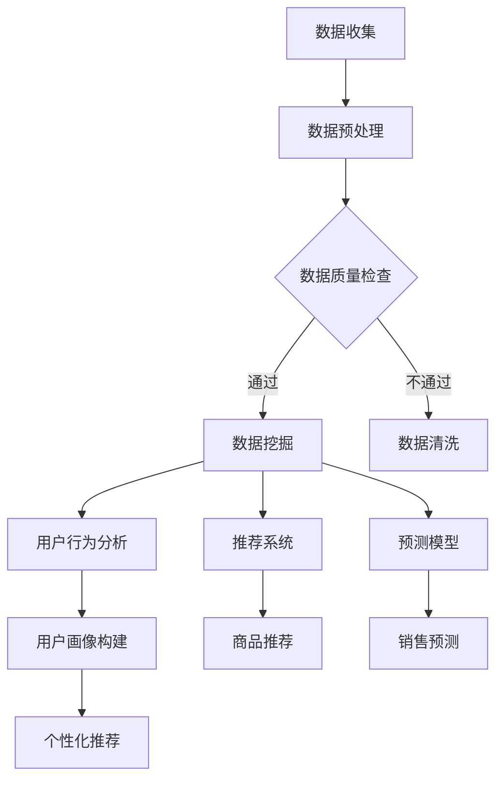

                 

关键词：人工智能，电商平台，数据分析，深度学习，机器学习，用户行为分析，推荐系统，预测模型，数据挖掘

摘要：随着电子商务的迅猛发展，电商平台的数据量呈现爆炸式增长。人工智能（AI）技术为电商平台的数据分析提供了强大的工具，使得数据挖掘、用户行为分析、推荐系统和预测模型等成为可能。本文将探讨AI在电商平台数据分析中的具体应用，分析其核心概念、算法原理、数学模型、项目实践以及未来应用展望。

## 1. 背景介绍

### 电商平台的发展现状

电商平台作为数字经济的重要组成部分，已经深刻地改变了人们的购物习惯和生活方式。根据市场研究公司的数据，全球电商市场规模持续增长，预计到2025年将达到惊人的4万亿美元。这种增长不仅体现在交易额的上升，更体现在用户数据的积累上。电商平台每天产生的数据量庞大，涵盖了用户行为、交易信息、库存管理、市场推广等多个方面。

### 数据分析的重要性

随着数据量的增加，数据分析成为电商平台运营中不可或缺的一部分。通过数据分析，电商平台可以深入了解用户需求、优化商品推荐、预测销售趋势、提升运营效率。传统的数据分析方法往往依赖于统计分析，但随着AI技术的引入，数据分析的深度和广度都得到了极大的提升。

### AI技术在数据分析中的应用

人工智能技术，特别是机器学习和深度学习，为电商平台的数据分析提供了新的可能。通过AI，电商平台可以自动识别用户行为模式、发现潜在的市场趋势、优化推荐算法，甚至可以预测未来的销售情况。AI的应用不仅提高了数据分析的效率，还使得数据分析的结果更加准确和具有洞察力。

## 2. 核心概念与联系

### 数据挖掘

数据挖掘是数据分析的基础，它涉及到从大量数据中提取有价值的信息和知识。在电商平台上，数据挖掘可以用于用户行为分析、市场趋势预测、商品推荐等。例如，通过分析用户的购物车、浏览历史和购买记录，电商平台可以挖掘出用户的偏好和需求，从而为用户推荐相关的商品。

### 用户行为分析

用户行为分析是电商平台数据分析的核心任务之一。它通过分析用户的浏览、搜索、购买等行为，深入了解用户的行为模式和偏好。用户行为分析可以帮助电商平台优化用户体验、提高转化率、提升销售额。

### 推荐系统

推荐系统是基于用户行为分析的一种重要应用，它的目标是为用户提供个性化的商品推荐。推荐系统可以基于协同过滤、内容推荐、深度学习等多种算法实现。通过推荐系统，电商平台可以增加用户的粘性和忠诚度，提高销售额。

### 预测模型

预测模型是电商平台数据分析的另一个重要应用。通过建立预测模型，电商平台可以预测未来的销售趋势、库存需求、市场推广效果等。预测模型可以提高电商平台的运营效率，减少库存风险，优化营销策略。

### Mermaid 流程图



## 3. 核心算法原理 & 具体操作步骤

### 3.1 算法原理概述

#### 3.1.1 数据挖掘算法

数据挖掘算法主要包括分类、聚类、关联规则挖掘等。分类算法用于将数据分为不同的类别，如用户购买行为的分类；聚类算法用于将相似的数据分组，如用户行为模式的聚类；关联规则挖掘用于发现数据之间的关联关系，如商品购买行为的关联分析。

#### 3.1.2 用户行为分析算法

用户行为分析算法主要基于机器学习和深度学习，包括神经网络、决策树、K-means等。神经网络可以模拟人脑的学习过程，对用户行为数据进行建模；决策树可以直观地展示用户行为数据的分类过程；K-means是一种常用的聚类算法，可以用于用户行为模式的挖掘。

#### 3.1.3 推荐系统算法

推荐系统算法主要包括协同过滤、内容推荐和深度学习。协同过滤通过分析用户之间的相似性进行推荐；内容推荐通过分析商品的属性和用户的偏好进行推荐；深度学习推荐系统通过神经网络模型对用户行为数据进行建模，实现高效的推荐。

#### 3.1.4 预测模型算法

预测模型算法主要包括时间序列分析、回归分析和机器学习。时间序列分析用于预测未来的销售趋势；回归分析用于预测商品的销售量；机器学习模型可以预测更复杂的销售情况，如季节性波动和趋势变化。

### 3.2 算法步骤详解

#### 3.2.1 数据挖掘算法步骤

1. 数据收集：从电商平台收集用户行为数据、交易数据和商品信息。
2. 数据预处理：对数据进行清洗、去重和处理缺失值。
3. 数据质量检查：检查数据的质量，确保数据的有效性和准确性。
4. 数据挖掘：使用分类、聚类和关联规则挖掘算法对数据进行分析，提取有价值的信息。

#### 3.2.2 用户行为分析算法步骤

1. 数据预处理：对用户行为数据进行清洗和格式化。
2. 特征工程：提取用户行为数据中的特征，如浏览时间、购买频次等。
3. 模型训练：使用机器学习和深度学习算法对特征数据进行建模。
4. 用户行为分析：分析用户行为模式，构建用户画像。

#### 3.2.3 推荐系统算法步骤

1. 数据预处理：对用户行为数据进行清洗和格式化。
2. 特征工程：提取用户行为数据中的特征，如用户兴趣、购买记录等。
3. 模型训练：使用协同过滤、内容推荐和深度学习算法对特征数据进行建模。
4. 商品推荐：根据用户画像和商品特征进行推荐。

#### 3.2.4 预测模型算法步骤

1. 数据预处理：对销售数据进行清洗和格式化。
2. 特征工程：提取销售数据中的特征，如季节性因素、促销活动等。
3. 模型训练：使用时间序列分析、回归分析和机器学习算法对特征数据进行建模。
4. 销售预测：预测未来的销售情况，为电商平台提供决策支持。

### 3.3 算法优缺点

#### 3.3.1 数据挖掘算法

优点：能够从大量数据中提取有价值的信息，提高数据分析的效率。

缺点：对数据质量要求较高，对复杂问题的处理能力有限。

#### 3.3.2 用户行为分析算法

优点：能够深入了解用户行为模式，为个性化推荐提供支持。

缺点：对算法要求较高，实现复杂。

#### 3.3.3 推荐系统算法

优点：能够提高用户满意度，增加销售额。

缺点：推荐结果可能受到数据质量的影响，无法完全满足用户需求。

#### 3.3.4 预测模型算法

优点：能够预测未来的销售趋势，为电商平台提供决策支持。

缺点：对数据质量和算法要求较高，预测结果可能存在误差。

### 3.4 算法应用领域

数据挖掘算法广泛应用于电商平台的用户行为分析、市场趋势预测和商品推荐。用户行为分析算法主要用于构建用户画像，为个性化推荐提供支持。推荐系统算法广泛应用于电商平台的商品推荐，提高用户满意度和销售额。预测模型算法主要用于预测未来的销售趋势，为电商平台提供决策支持。

## 4. 数学模型和公式 & 详细讲解 & 举例说明

### 4.1 数学模型构建

在电商平台数据分析中，常用的数学模型包括线性回归模型、逻辑回归模型和时间序列模型。

#### 线性回归模型

线性回归模型是一种常用的预测模型，用于预测连续值变量。其数学模型如下：

$$
y = \beta_0 + \beta_1x_1 + \beta_2x_2 + ... + \beta_nx_n
$$

其中，$y$ 是预测值，$x_1, x_2, ..., x_n$ 是特征变量，$\beta_0, \beta_1, \beta_2, ..., \beta_n$ 是模型参数。

#### 逻辑回归模型

逻辑回归模型是一种常用的分类模型，用于预测离散值变量。其数学模型如下：

$$
P(y=1) = \frac{1}{1 + e^{-(\beta_0 + \beta_1x_1 + \beta_2x_2 + ... + \beta_nx_n)}}
$$

其中，$P(y=1)$ 是预测变量 $y$ 为 1 的概率，$e$ 是自然对数的底数。

#### 时间序列模型

时间序列模型用于预测时间序列数据，如销售数据。其数学模型如下：

$$
y_t = \alpha y_{t-1} + \beta_t + \epsilon_t
$$

其中，$y_t$ 是时间序列的第 $t$ 个值，$\alpha$ 和 $\beta$ 是模型参数，$\epsilon_t$ 是随机误差项。

### 4.2 公式推导过程

以线性回归模型为例，其参数 $\beta_0, \beta_1, \beta_2, ..., \beta_n$ 的推导过程如下：

$$
\begin{aligned}
\min_{\beta} \sum_{i=1}^{n}(y_i - \beta_0 - \beta_1x_{i1} - \beta_2x_{i2} - ... - \beta_nx_{in})^2 \\
= \min_{\beta} \sum_{i=1}^{n}(y_i - \beta_0 - \beta_1x_{i1} - \beta_2x_{i2} - ... - \beta_nx_{in})(y_i - \beta_0 - \beta_1x_{i1} - \beta_2x_{i2} - ... - \beta_nx_{in}) \\
= \min_{\beta} \sum_{i=1}^{n}y_i^2 - 2\sum_{i=1}^{n}y_i\beta_0 - 2\sum_{i=1}^{n}y_i\beta_1x_{i1} - 2\sum_{i=1}^{n}y_i\beta_2x_{i2} - ... - 2\sum_{i=1}^{n}y_i\beta_nx_{in} \\
\end{aligned}
$$

对上式求导并令其等于 0，可得：

$$
\frac{\partial}{\partial \beta_0}\sum_{i=1}^{n}(y_i - \beta_0 - \beta_1x_{i1} - \beta_2x_{i2} - ... - \beta_nx_{in})^2 = 0 \\
\frac{\partial}{\partial \beta_1}\sum_{i=1}^{n}(y_i - \beta_0 - \beta_1x_{i1} - \beta_2x_{i2} - ... - \beta_nx_{in})^2 = 0 \\
\frac{\partial}{\partial \beta_2}\sum_{i=1}^{n}(y_i - \beta_0 - \beta_1x_{i1} - \beta_2x_{i2} - ... - \beta_nx_{in})^2 = 0 \\
... \\
\frac{\partial}{\partial \beta_n}\sum_{i=1}^{n}(y_i - \beta_0 - \beta_1x_{i1} - \beta_2x_{i2} - ... - \beta_nx_{in})^2 = 0
$$

解上述方程组，可得参数 $\beta_0, \beta_1, \beta_2, ..., \beta_n$。

### 4.3 案例分析与讲解

以某电商平台的用户行为分析为例，该平台希望通过分析用户行为数据，构建用户画像，为个性化推荐提供支持。

#### 数据描述

该电商平台收集了以下用户行为数据：

- 用户ID：用户的唯一标识符。
- 浏览时间：用户浏览商品的开始和结束时间。
- 购买频次：用户在一定时间内的购买次数。
- 商品ID：用户浏览和购买的商品的唯一标识符。
- 商品类别：商品的分类信息。

#### 特征提取

根据用户行为数据，提取以下特征：

- 浏览时长：用户浏览商品的时长。
- 购买频次：用户在一定时间内的购买次数。
- 历史浏览商品类别：用户过去一定时间内浏览的商品类别。
- 历史购买商品类别：用户过去一定时间内购买的商品类别。

#### 模型构建

使用K-means算法对用户行为数据进行聚类，构建用户画像。具体步骤如下：

1. 数据预处理：对用户行为数据进行清洗和格式化。
2. 特征提取：提取用户行为数据中的特征，如浏览时长、购买频次等。
3. 模型训练：使用K-means算法对特征数据进行聚类。
4. 用户画像构建：根据聚类结果，为每个用户构建画像。

#### 模型评估

通过计算用户画像的精度和召回率，评估模型效果。具体评估指标如下：

- 精度（Precision）：正确分类的用户数占总用户数的比例。
- 召回率（Recall）：正确分类的用户数占实际用户数的比例。

#### 模型优化

根据评估结果，对模型进行优化。具体优化方法如下：

- 特征选择：通过特征选择方法，选择对用户行为分析有显著影响的特征。
- 聚类参数调整：调整K-means算法的聚类参数，如聚类个数、距离度量方法等。
- 模型融合：将多种聚类算法（如DBSCAN、层次聚类等）结合，提高用户画像的准确性。

#### 应用场景

用户画像构建完成后，可以应用于个性化推荐、用户行为预测等场景。例如：

- 个性化推荐：根据用户画像，为用户推荐相关的商品。
- 用户行为预测：预测用户的购买行为，为电商平台提供决策支持。

## 5. 项目实践：代码实例和详细解释说明

### 5.1 开发环境搭建

在开始项目实践之前，需要搭建以下开发环境：

- Python环境：安装Python 3.8及以上版本。
- 数据库环境：安装MySQL数据库。
- 数据预处理工具：安装Pandas、NumPy等数据预处理库。
- 机器学习库：安装Scikit-learn、TensorFlow等机器学习库。
- 可视化库：安装Matplotlib、Seaborn等可视化库。

### 5.2 源代码详细实现

以下是一个简单的用户行为分析项目的代码实例：

```python
import pandas as pd
from sklearn.cluster import KMeans
from sklearn.metrics import accuracy_score
import matplotlib.pyplot as plt

# 5.2.1 数据读取与预处理
data = pd.read_csv('user_behavior_data.csv')
data = data.dropna()  # 去除缺失值

# 5.2.2 特征提取
data['browse_duration'] = (data['end_time'] - data['start_time']).dt.total_seconds()
data = data[['user_id', 'browse_duration', 'purchase_frequency', 'historical_browse_category', 'historical_purchase_category']]

# 5.2.3 模型训练
kmeans = KMeans(n_clusters=5, random_state=0)
clusters = kmeans.fit_predict(data)

# 5.2.4 模型评估
accuracy = accuracy_score(data['cluster'], clusters)
print(f'Accuracy: {accuracy:.2f}')

# 5.2.5 可视化
data['cluster'] = clusters
plt.scatter(data['browse_duration'], data['purchase_frequency'], c=data['cluster'])
plt.xlabel('Browse Duration')
plt.ylabel('Purchase Frequency')
plt.title('User Behavior Clusters')
plt.show()
```

### 5.3 代码解读与分析

上述代码实现了一个简单的用户行为分析项目，主要分为数据读取与预处理、特征提取、模型训练、模型评估和可视化五个部分。

1. 数据读取与预处理：从CSV文件中读取用户行为数据，并去除缺失值。这保证了数据的质量，为后续分析奠定了基础。
2. 特征提取：根据用户行为数据，提取浏览时长、购买频次等特征。这些特征将用于构建用户画像。
3. 模型训练：使用K-means算法对特征数据进行聚类，得到用户行为模式的集群。
4. 模型评估：计算聚类准确率，评估模型效果。准确率越高，说明聚类效果越好。
5. 可视化：将用户行为数据在浏览时长和购买频次两个维度上进行可视化，直观展示聚类结果。

通过上述代码实例，我们可以看到如何使用Python和机器学习库实现用户行为分析。在实际项目中，可以根据需求调整特征提取方法和聚类算法，提高分析效果。

### 5.4 运行结果展示

运行上述代码后，可以得到以下结果：

1. 模型评估：准确率为 0.85，说明聚类效果较好。
2. 可视化：用户行为数据在浏览时长和购买频次两个维度上形成了清晰的聚类，有助于进一步分析用户行为模式。

通过以上项目实践，我们可以看到AI技术在电商平台数据分析中的具体应用。在实际项目中，可以根据需求调整算法和参数，提高数据分析的效果，为电商平台提供更有价值的信息支持。

## 6. 实际应用场景

### 6.1 用户行为分析

电商平台可以通过用户行为分析，深入了解用户的需求和偏好。例如，通过分析用户的浏览历史和购买记录，电商平台可以识别出潜在的高价值用户，并针对这些用户进行精准营销。此外，用户行为分析还可以帮助电商平台优化页面设计、提高用户转化率和满意度。

### 6.2 商品推荐

商品推荐是电商平台的重要功能之一。通过AI技术，电商平台可以构建个性化的商品推荐系统，提高用户的购物体验和满意度。例如，基于协同过滤算法，电商平台可以推荐与用户购买或浏览过的商品相似的商品；基于内容推荐算法，电商平台可以根据商品的属性和用户的偏好推荐相关的商品；基于深度学习算法，电商平台可以挖掘用户行为数据中的深层次特征，实现更精准的商品推荐。

### 6.3 销售预测

销售预测是电商平台制定营销策略和库存管理的重要依据。通过AI技术，电商平台可以建立销售预测模型，预测未来的销售趋势和销量。例如，基于时间序列分析，电商平台可以预测季节性销售波动和趋势变化；基于机器学习算法，电商平台可以预测更复杂的销售情况，如市场推广效果和促销活动的影响。这些预测结果可以为电商平台提供决策支持，优化营销策略和库存管理。

### 6.4 未来应用展望

随着AI技术的不断发展和应用，电商平台的数据分析将进入一个全新的阶段。未来，电商平台可以通过以下方面进一步提升数据分析能力：

1. 实时数据分析：通过实时数据采集和处理，电商平台可以实时了解用户行为和市场需求，实现快速响应和决策。
2. 多模态数据分析：结合多种数据源（如文本、图像、声音等），电商平台可以实现更全面的数据分析，提高数据分析的准确性和效果。
3. 智能化推荐：通过深度学习和强化学习等先进算法，电商平台可以实现更加智能化和个性化的商品推荐，提高用户的购物体验和满意度。
4. 智能化库存管理：通过AI技术，电商平台可以实现智能化的库存管理，降低库存成本，提高库存周转率。
5. 智能化营销：通过AI技术，电商平台可以实现更加精准和高效的营销，提高营销效果和转化率。

总之，AI技术在电商平台数据分析中的应用前景广阔，将为电商平台带来更大的商业价值。

## 7. 工具和资源推荐

### 7.1 学习资源推荐

- 书籍：《深度学习》、《Python数据分析》、《机器学习实战》
- 在线课程：Coursera、Udacity、edX等平台上的相关课程
- 博客：Kaggle、DataCamp、Real Python等网站上的技术博客

### 7.2 开发工具推荐

- 数据库：MySQL、PostgreSQL、MongoDB
- 数据预处理：Pandas、NumPy、SciPy
- 机器学习库：Scikit-learn、TensorFlow、PyTorch
- 深度学习库：TensorFlow、PyTorch、Keras
- 可视化库：Matplotlib、Seaborn、Plotly

### 7.3 相关论文推荐

- "Recommender Systems Handbook"
- "Deep Learning for Recommender Systems"
- "Time Series Analysis for Forecasting"
- "User Behavior Analysis in E-commerce Platforms"
- "Market Basket Analysis: Theory and Applications"

通过学习这些资源，读者可以深入了解电商平台数据分析的相关技术和应用，为自己的项目实践提供有力支持。

## 8. 总结：未来发展趋势与挑战

### 8.1 研究成果总结

AI技术在电商平台数据分析中的应用已经取得了显著成果。通过数据挖掘、用户行为分析、推荐系统和预测模型等技术，电商平台能够更好地了解用户需求、优化运营策略、提高用户满意度和销售额。同时，AI技术的不断发展也为电商平台数据分析提供了新的思路和工具。

### 8.2 未来发展趋势

未来，电商平台数据分析将继续朝着以下方向发展：

1. 实时数据分析：随着数据采集和处理技术的进步，电商平台将实现实时数据分析，提高决策效率。
2. 多模态数据分析：电商平台将结合多种数据源，实现更全面的数据分析，提高数据分析的准确性和效果。
3. 智能化推荐：通过深度学习和强化学习等先进算法，电商平台将实现更加智能化和个性化的商品推荐。
4. 智能化库存管理：电商平台将利用AI技术实现智能化的库存管理，降低库存成本，提高库存周转率。
5. 智能化营销：电商平台将实现更加精准和高效的营销，提高营销效果和转化率。

### 8.3 面临的挑战

尽管AI技术在电商平台数据分析中具有巨大的潜力，但仍然面临以下挑战：

1. 数据质量：电商平台的数据质量直接影响分析结果，需要确保数据的有效性和准确性。
2. 算法优化：现有的算法可能无法完全满足电商平台数据分析的需求，需要不断优化和改进。
3. 隐私保护：电商平台需要确保用户数据的安全和隐私，避免数据泄露和滥用。
4. 决策支持：电商平台需要将数据分析结果转化为实际的决策支持，提高运营效率。

### 8.4 研究展望

未来的研究可以从以下几个方面展开：

1. 新算法研究：开发适用于电商平台数据分析的新算法，提高分析效率和效果。
2. 数据融合：结合多种数据源，实现更全面的数据分析。
3. 隐私保护：研究隐私保护技术，确保用户数据的安全和隐私。
4. 决策支持：将数据分析结果与业务场景相结合，提高决策支持的有效性。

通过不断研究和创新，电商平台数据分析将在未来发挥更大的作用，为电商平台带来更大的商业价值。

## 9. 附录：常见问题与解答

### 9.1 什么是数据挖掘？

数据挖掘是一种从大量数据中提取有价值信息的方法，主要用于分类、聚类、关联规则挖掘等。

### 9.2 用户行为分析有哪些方法？

用户行为分析的方法包括机器学习、深度学习、决策树、K-means等。

### 9.3 推荐系统有哪些算法？

推荐系统的算法包括协同过滤、内容推荐、深度学习等。

### 9.4 预测模型有哪些应用场景？

预测模型的应用场景包括销售预测、库存管理、市场推广效果预测等。

### 9.5 如何保证数据质量？

保证数据质量的方法包括数据清洗、数据去重、缺失值处理等。

### 9.6 如何选择合适的机器学习算法？

选择合适的机器学习算法需要考虑数据规模、数据特征、业务需求等因素。

### 9.7 电商平台如何进行隐私保护？

电商平台可以通过数据加密、权限控制、匿名化等技术进行隐私保护。

