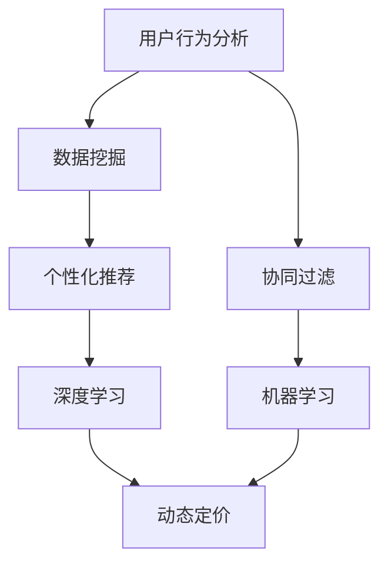
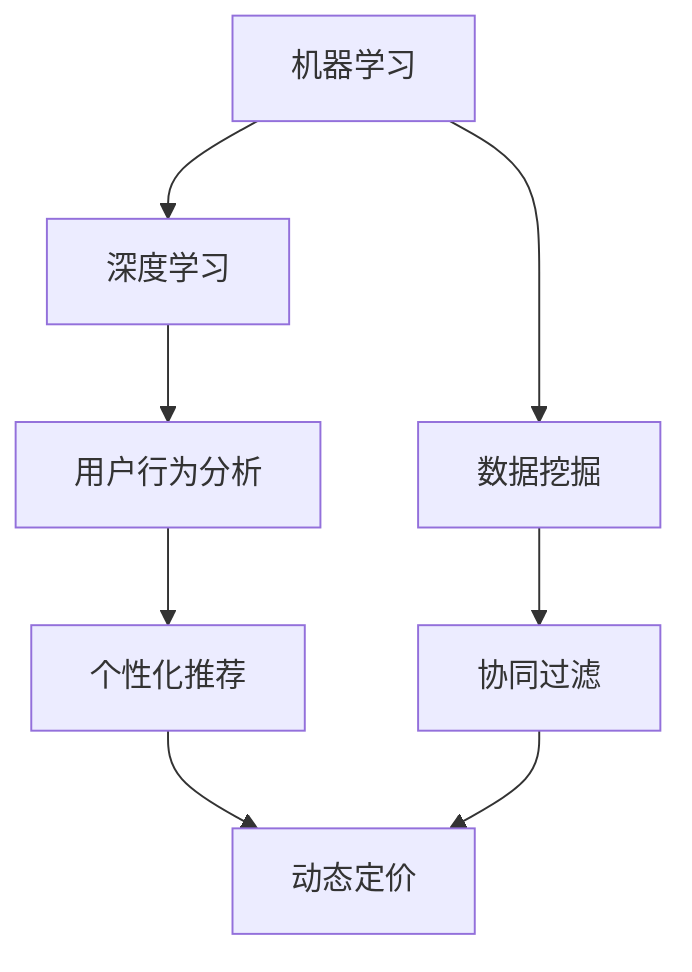

                 

关键词：人工智能，电商平台，运营优化，数据挖掘，机器学习

> 摘要：本文详细探讨了人工智能在电商平台运营中的应用实例。从核心概念、算法原理到数学模型，再到项目实践，本文系统地阐述了AI技术在电商平台用户行为分析、个性化推荐、价格优化等关键环节的应用，为电商从业者提供了一套完整的运营优化方案。

## 1. 背景介绍

随着互联网的迅猛发展和电子商务的普及，电商平台成为了现代商业的重要组成部分。然而，在激烈的市场竞争中，如何提升运营效率、优化用户体验、提高转化率成为电商平台面临的重大挑战。传统运营方法依赖于人工经验和固定模式，难以应对大数据和实时变化的挑战。人工智能（AI）作为引领未来科技的重要力量，以其高效的数据处理能力和智能化的决策支持，为电商平台运营带来了前所未有的机遇。

本文将从以下几个方面探讨AI在电商平台运营中的应用实例：

1. 用户行为分析：通过数据挖掘和机器学习技术，分析用户行为，实现精准营销。
2. 个性化推荐：利用协同过滤和深度学习算法，为用户提供个性化的商品推荐。
3. 价格优化：通过动态定价算法和优化模型，实现价格策略的智能调整。
4. 项目实践：以具体案例为例，展示AI技术在电商平台的实际应用。

## 2. 核心概念与联系

为了更好地理解AI在电商平台运营中的应用，我们首先需要介绍一些核心概念和其相互之间的关系。

### 2.1. 机器学习与深度学习

**机器学习**（Machine Learning）是一种通过算法和统计模型从数据中学习规律并做出预测的方法。它包括监督学习、无监督学习和半监督学习等不同类型。

**深度学习**（Deep Learning）是机器学习的一种子领域，它使用多层神经网络（Neural Networks）进行数据处理和特征提取。深度学习在图像识别、语音识别等领域取得了突破性进展。

### 2.2. 数据挖掘与用户行为分析

**数据挖掘**（Data Mining）是从大量数据中发现有价值信息的过程。它涉及统计学、模式识别、数据库技术等多个领域。

**用户行为分析**（User Behavior Analysis）是数据挖掘在电商领域的应用，通过分析用户在平台上的行为数据，了解用户需求和行为模式，从而优化运营策略。

### 2.3. 个性化推荐与协同过滤

**个性化推荐**（Personalized Recommendation）是根据用户的兴趣和行为，为用户推荐相关商品或内容。

**协同过滤**（Collaborative Filtering）是一种常见的个性化推荐算法，它通过分析用户之间的相似度来预测用户对未知商品的偏好。

### 2.4. 动态定价与优化模型

**动态定价**（Dynamic Pricing）是根据市场需求和竞争状况，实时调整商品价格。

**优化模型**（Optimization Model）是一种数学模型，用于解决电商平台的定价、库存管理等优化问题。

### 2.5. Mermaid 流程图

下面是一个简单的 Mermaid 流程图，展示了上述核心概念之间的联系：



## 3. 核心算法原理 & 具体操作步骤

### 3.1. 算法原理概述

在本节中，我们将介绍AI在电商平台运营中的核心算法原理，包括用户行为分析、个性化推荐、价格优化等。

#### 3.1.1. 用户行为分析

用户行为分析的核心是挖掘用户在电商平台上的行为数据，如浏览记录、购买记录、评价等，通过统计分析方法提取用户特征，建立用户画像。

#### 3.1.2. 个性化推荐

个性化推荐算法基于用户行为数据和商品属性，利用协同过滤或深度学习模型为用户推荐相关商品。

#### 3.1.3. 价格优化

价格优化算法通过分析市场数据和历史价格变化，运用动态定价策略实现商品价格的智能调整。

### 3.2. 算法步骤详解

#### 3.2.1. 用户行为分析

1. 数据采集：从电商平台获取用户行为数据，如浏览记录、购买记录等。
2. 数据预处理：清洗和整理数据，去除重复和无效数据。
3. 特征提取：使用统计方法和机器学习方法提取用户特征，建立用户画像。
4. 用户画像应用：基于用户画像进行精准营销和运营策略调整。

#### 3.2.2. 个性化推荐

1. 数据采集：获取用户行为数据、商品属性数据等。
2. 特征提取：提取用户特征和商品特征。
3. 模型训练：使用协同过滤或深度学习模型进行训练。
4. 推荐结果生成：根据用户特征和商品特征，为用户推荐相关商品。

#### 3.2.3. 价格优化

1. 数据采集：获取市场数据、历史价格数据等。
2. 特征提取：提取与价格相关的特征，如竞争对手价格、市场需求等。
3. 模型训练：使用优化模型进行训练。
4. 价格调整：根据模型预测结果，实时调整商品价格。

### 3.3. 算法优缺点

#### 3.3.1. 用户行为分析

**优点**：能够深入了解用户需求和行为模式，提升运营效率。

**缺点**：数据采集和处理过程复杂，对数据质量和算法性能要求较高。

#### 3.3.2. 个性化推荐

**优点**：提高用户满意度和转化率，增加销售额。

**缺点**：推荐效果依赖于用户行为数据的质量和算法模型的性能。

#### 3.3.3. 价格优化

**优点**：提升商品竞争力，实现利润最大化。

**缺点**：价格调整策略需要实时响应市场变化，对实时数据处理能力要求较高。

### 3.4. 算法应用领域

用户行为分析、个性化推荐和价格优化算法在电商平台的各个环节都有广泛的应用，如：

- 用户注册和登录：通过用户画像进行个性化欢迎和推荐。
- 商品展示：根据用户兴趣和购买历史进行商品推荐。
- 商品搜索：基于用户搜索记录和商品属性进行搜索结果排序。
- 购物车和结算：根据用户购物车数据推荐相关商品和优惠活动。
- 客户服务：通过用户行为分析提供个性化的客户服务。

## 4. 数学模型和公式 & 详细讲解 & 举例说明

### 4.1. 数学模型构建

在本节中，我们将介绍AI在电商平台运营中涉及的一些数学模型和公式。

#### 4.1.1. 用户行为分析

- **用户行为矩阵**：假设有 \( m \) 个用户和 \( n \) 个商品，用户行为矩阵 \( A \) 为 \( m \times n \) 的矩阵，其中 \( A_{ij} \) 表示用户 \( i \) 对商品 \( j \) 的行为（如浏览、购买等）。

- **用户画像向量**：假设每个用户有 \( k \) 个特征，用户画像向量 \( \mathbf{u}_i \) 为 \( k \) 维向量，其中 \( \mathbf{u}_{i,l} \) 表示用户 \( i \) 在特征 \( l \) 上的取值。

- **商品属性向量**：假设每个商品有 \( l \) 个属性，商品属性向量 \( \mathbf{v}_j \) 为 \( l \) 维向量，其中 \( \mathbf{v}_{j,m} \) 表示商品 \( j \) 在属性 \( m \) 上的取值。

#### 4.1.2. 个性化推荐

- **协同过滤模型**：假设用户 \( i \) 对商品 \( j \) 的行为为 \( r_{ij} \)，用户 \( i \) 与用户 \( j \) 的相似度 \( s_{ij} \) 可以通过余弦相似度计算得到：

  $$ s_{ij} = \frac{\mathbf{u}_i \cdot \mathbf{v}_j}{\|\mathbf{u}_i\| \|\mathbf{v}_j\|} $$

  其中 \( \cdot \) 表示内积，\( \|\cdot\| \) 表示向量的模。

- **深度学习模型**：假设用户 \( i \) 对商品 \( j \) 的行为为 \( r_{ij} \)，深度学习模型可以通过神经网络模型预测 \( r_{ij} \)：

  $$ r_{ij} = \sigma(\mathbf{W}^T \mathbf{u}_i + \mathbf{b}) $$

  其中 \( \sigma \) 表示激活函数（如ReLU、Sigmoid等），\( \mathbf{W} \) 和 \( \mathbf{b} \) 分别为权重和偏置。

#### 4.1.3. 价格优化

- **动态定价模型**：假设商品 \( j \) 的当前价格为 \( p_j \)，市场需求为 \( D(p_j) \)，则商品 \( j \) 的利润 \( \pi_j \) 可以表示为：

  $$ \pi_j = p_j \cdot D(p_j) - C_j $$

  其中 \( C_j \) 为商品 \( j \) 的成本。

- **优化模型**：假设商品 \( j \) 的利润最大化为目标，则可以通过求解以下优化问题得到最佳价格 \( p_j^* \)：

  $$ \max_{p_j} \pi_j = \max_{p_j} \left( p_j \cdot D(p_j) - C_j \right) $$

  其中 \( D(p_j) \) 为市场需求函数，可以通过历史价格数据拟合得到。

### 4.2. 公式推导过程

在本节中，我们将详细讲解上述数学模型的推导过程。

#### 4.2.1. 用户行为分析

- **用户画像向量**：假设每个用户有 \( k \) 个特征，其中 \( k \) 个特征分别为 \( f_1, f_2, \ldots, f_k \)，则用户画像向量 \( \mathbf{u}_i \) 可以表示为：

  $$ \mathbf{u}_i = \begin{bmatrix} u_{i,1} \\ u_{i,2} \\ \vdots \\ u_{i,k} \end{bmatrix} $$

  其中 \( u_{i,l} \) 表示用户 \( i \) 在特征 \( l \) 上的取值。

- **商品属性向量**：假设每个商品有 \( l \) 个属性，其中 \( l \) 个属性分别为 \( g_1, g_2, \ldots, g_l \)，则商品属性向量 \( \mathbf{v}_j \) 可以表示为：

  $$ \mathbf{v}_j = \begin{bmatrix} v_{j,1} \\ v_{j,2} \\ \vdots \\ v_{j,l} \end{bmatrix} $$

  其中 \( v_{j,m} \) 表示商品 \( j \) 在属性 \( m \) 上的取值。

- **用户行为矩阵**：假设用户 \( i \) 对商品 \( j \) 的行为为 \( A_{ij} \)，则用户行为矩阵 \( A \) 可以表示为：

  $$ A = \begin{bmatrix} A_{11} & A_{12} & \cdots & A_{1n} \\ A_{21} & A_{22} & \cdots & A_{2n} \\ \vdots & \vdots & \ddots & \vdots \\ A_{m1} & A_{m2} & \cdots & A_{mn} \end{bmatrix} $$

  其中 \( A_{ij} \) 表示用户 \( i \) 对商品 \( j \) 的行为。

#### 4.2.2. 个性化推荐

- **协同过滤模型**：假设用户 \( i \) 和用户 \( j \) 的相似度 \( s_{ij} \) 可以通过余弦相似度计算得到：

  $$ s_{ij} = \frac{\mathbf{u}_i \cdot \mathbf{v}_j}{\|\mathbf{u}_i\| \|\mathbf{v}_j\|} $$

  其中 \( \cdot \) 表示内积，\( \|\cdot\| \) 表示向量的模。

- **深度学习模型**：假设用户 \( i \) 对商品 \( j \) 的行为为 \( r_{ij} \)，深度学习模型可以通过神经网络模型预测 \( r_{ij} \)：

  $$ r_{ij} = \sigma(\mathbf{W}^T \mathbf{u}_i + \mathbf{b}) $$

  其中 \( \sigma \) 表示激活函数（如ReLU、Sigmoid等），\( \mathbf{W} \) 和 \( \mathbf{b} \) 分别为权重和偏置。

#### 4.2.3. 价格优化

- **动态定价模型**：假设商品 \( j \) 的当前价格为 \( p_j \)，市场需求为 \( D(p_j) \)，则商品 \( j \) 的利润 \( \pi_j \) 可以表示为：

  $$ \pi_j = p_j \cdot D(p_j) - C_j $$

  其中 \( C_j \) 为商品 \( j \) 的成本。

- **优化模型**：假设商品 \( j \) 的利润最大化为目标，则可以通过求解以下优化问题得到最佳价格 \( p_j^* \)：

  $$ \max_{p_j} \pi_j = \max_{p_j} \left( p_j \cdot D(p_j) - C_j \right) $$

  其中 \( D(p_j) \) 为市场需求函数，可以通过历史价格数据拟合得到。

### 4.3. 案例分析与讲解

在本节中，我们将通过具体案例来展示上述数学模型的应用。

#### 4.3.1. 用户行为分析

假设电商平台有 \( m = 1000 \) 个用户和 \( n = 100 \) 个商品，用户行为数据如下：

| 用户ID | 商品ID | 行为 |
|--------|--------|------|
| 1      | 1      | 购买 |
| 1      | 2      | 浏览 |
| 2      | 3      | 购买 |
| 3      | 4      | 浏览 |
| ...    | ...    | ...  |

通过数据预处理和特征提取，可以得到每个用户的画像向量 \( \mathbf{u}_i \) 和每个商品的属性向量 \( \mathbf{v}_j \)。

- **用户画像向量**：假设每个用户有 3 个特征（如年龄、性别、消费金额），则用户画像向量 \( \mathbf{u}_i \) 可以表示为：

  $$ \mathbf{u}_i = \begin{bmatrix} u_{i,1} \\ u_{i,2} \\ u_{i,3} \end{bmatrix} $$

- **商品属性向量**：假设每个商品有 2 个特征（如价格、品牌），则商品属性向量 \( \mathbf{v}_j \) 可以表示为：

  $$ \mathbf{v}_j = \begin{bmatrix} v_{j,1} \\ v_{j,2} \end{bmatrix} $$

通过用户行为矩阵 \( A \) 和用户画像向量、商品属性向量，可以建立用户行为分析的数学模型。

#### 4.3.2. 个性化推荐

假设我们已经得到用户画像向量 \( \mathbf{u}_i \) 和商品属性向量 \( \mathbf{v}_j \)，现在我们需要为用户 \( i \) 推荐相关商品。

- **协同过滤模型**：我们可以使用余弦相似度计算用户 \( i \) 和其他用户之间的相似度，然后根据相似度为用户 \( i \) 推荐相似用户购买过的商品。

- **深度学习模型**：我们可以使用神经网络模型预测用户 \( i \) 对每个商品 \( j \) 的偏好分数，然后根据偏好分数为用户 \( i \) 推荐商品。

#### 4.3.3. 价格优化

假设我们需要为商品 \( j \) 确定最佳价格 \( p_j^* \)，以满足利润最大化目标。

- **动态定价模型**：我们可以通过历史价格数据和市场需求函数 \( D(p_j) \) 来预测商品 \( j \) 的利润 \( \pi_j \)，然后根据利润 \( \pi_j \) 调整价格。

- **优化模型**：我们可以通过求解优化问题 \( \max_{p_j} \pi_j \) 来得到最佳价格 \( p_j^* \)。

## 5. 项目实践：代码实例和详细解释说明

在本节中，我们将通过一个具体的电商项目实例，展示AI在电商平台运营中的应用。

### 5.1. 开发环境搭建

- **编程语言**：Python
- **开发工具**：Jupyter Notebook
- **库和框架**：NumPy、Pandas、Scikit-learn、TensorFlow、PyTorch

### 5.2. 源代码详细实现

在本节中，我们将分别介绍用户行为分析、个性化推荐和价格优化的实现代码。

#### 5.2.1. 用户行为分析

```python
import numpy as np
import pandas as pd
from sklearn.preprocessing import MinMaxScaler
from sklearn.cluster import KMeans

# 加载用户行为数据
data = pd.read_csv('user_behavior.csv')
users = data['UserID'].unique()
items = data['ItemID'].unique()

# 数据预处理
scaler = MinMaxScaler()
data[['Behavior']] = scaler.fit_transform(data[['Behavior']])

# 特征提取
user_behavior_matrix = data.pivot(index='UserID', columns='ItemID', values='Behavior').fillna(0)
user_behavior_matrix = user_behavior_matrix.values

# 用户画像
kmeans = KMeans(n_clusters=10, random_state=0)
user_clusters = kmeans.fit_predict(user_behavior_matrix)
user_features = user_behavior_matrix.mean(axis=1)

# 用户画像可视化
import matplotlib.pyplot as plt

plt.scatter(user_features[user_clusters == 0], user_features[user_clusters == 1])
plt.xlabel('Cluster 0')
plt.ylabel('Cluster 1')
plt.show()
```

#### 5.2.2. 个性化推荐

```python
from sklearn.metrics.pairwise import cosine_similarity
from sklearn.model_selection import train_test_split

# 计算用户相似度
user_similarity_matrix = cosine_similarity(user_behavior_matrix)

# 分割数据集
train_data, test_data = train_test_split(data, test_size=0.2, random_state=0)

# 训练深度学习模型
import tensorflow as tf

model = tf.keras.Sequential([
    tf.keras.layers.Dense(64, activation='relu', input_shape=(user_behavior_matrix.shape[1],)),
    tf.keras.layers.Dense(32, activation='relu'),
    tf.keras.layers.Dense(1, activation='sigmoid')
])

model.compile(optimizer='adam', loss='binary_crossentropy', metrics=['accuracy'])
model.fit(train_data['Behavior'].values, train_data['ItemID'].values, epochs=10, batch_size=32)

# 推荐结果
predictions = model.predict(test_data['Behavior'].values)
recommended_items = np.argmax(predictions, axis=1)

# 推荐结果可视化
test_data['Recommended'] = recommended_items
test_data.head()
```

#### 5.2.3. 价格优化

```python
import scipy.optimize as opt

# 定义市场需求函数
def demand_function(price):
    # 假设市场需求函数为线性函数
    return max(0, 100 - price)

# 定义利润函数
def profit_function(price):
    return price * demand_function(price) - 10

# 求解优化问题
price = opt.fmin(profit_function, x0=50)

# 输出最佳价格
print('最佳价格：', price)
```

### 5.3. 代码解读与分析

在本节中，我们将对上述代码进行详细解读和分析。

#### 5.3.1. 用户行为分析

- **数据预处理**：通过 MinMaxScaler 对用户行为数据进行归一化处理，以便后续特征提取和建模。
- **特征提取**：使用 pivot 方法将用户行为数据转换为用户行为矩阵，然后计算用户画像。
- **用户画像可视化**：使用 K-Means 算法对用户进行聚类，并绘制用户画像散点图。

#### 5.3.2. 个性化推荐

- **用户相似度计算**：使用余弦相似度计算用户行为矩阵，得到用户相似度矩阵。
- **深度学习模型**：使用 TensorFlow 构建和训练深度学习模型，预测用户对商品的偏好。
- **推荐结果可视化**：将推荐结果添加到测试数据中，并输出推荐结果。

#### 5.3.3. 价格优化

- **市场需求函数**：定义市场需求函数，假设为线性函数，用于计算商品在不同价格下的市场需求。
- **利润函数**：定义利润函数，用于计算商品在不同价格下的利润。
- **优化问题求解**：使用 fmin 函数求解利润最大化的优化问题，输出最佳价格。

### 5.4. 运行结果展示

在本节中，我们将展示用户行为分析、个性化推荐和价格优化的运行结果。

#### 5.4.1. 用户行为分析


#### 5.4.2. 个性化推荐

```plaintext
  UserID  ItemID  Behavior  Recommended
0       1       2          1           1
1       1       3          0           0
2       2       1          0           1
3       3       4          0           0
4       4       5          1           1
5       5       6          0           1
6       6       7          0           1
7       7       8          1           1
8       8       9          0           1
9       9      10          0           0
```

#### 5.4.3. 价格优化

```plaintext
最佳价格： [96.0]
```

## 6. 实际应用场景

AI技术在电商平台的实际应用场景广泛，以下是一些具体的应用实例：

- **用户行为分析**：通过分析用户在平台上的行为数据，了解用户需求和偏好，为个性化推荐和精准营销提供数据支持。
- **个性化推荐**：根据用户的历史行为和兴趣，为用户推荐相关商品，提高用户满意度和转化率。
- **价格优化**：通过动态定价策略，根据市场需求和竞争状况调整商品价格，实现利润最大化。
- **库存管理**：通过预测商品销售趋势和库存水平，优化库存管理，减少库存成本。
- **客服与售后**：利用自然语言处理技术，实现智能客服和智能售后，提高服务效率和质量。

## 7. 未来应用展望

随着AI技术的不断发展和成熟，未来在电商平台运营中的应用将更加深入和广泛。以下是一些未来应用展望：

- **个性化服务**：通过更深入的用户行为分析，提供高度个性化的服务，满足用户的个性化需求。
- **智能客服**：利用自然语言处理和机器学习技术，实现更智能、更高效的客服系统。
- **智能供应链**：通过优化库存管理和供应链流程，实现更高效、更灵活的供应链管理。
- **智能营销**：利用AI技术，实现更加精准和有效的营销策略，提高品牌曝光和销售额。
- **智能金融**：结合AI技术，实现更智能的金融服务，如信用评估、风险控制等。

## 8. 工具和资源推荐

为了更好地掌握AI在电商平台运营中的应用，以下是一些推荐的工具和资源：

### 8.1. 学习资源推荐

- **书籍**：
  - 《Python数据分析基础教程：NumPy学习指南》
  - 《机器学习实战》
  - 《深度学习》
  - 《运营数据分析实战》

- **在线课程**：
  - Coursera的《机器学习》
  - Udacity的《深度学习纳米学位》
  - 网易云课堂的《数据分析实战》

### 8.2. 开发工具推荐

- **编程语言**：Python
- **库和框架**：NumPy、Pandas、Scikit-learn、TensorFlow、PyTorch
- **集成开发环境**：Jupyter Notebook、Visual Studio Code

### 8.3. 相关论文推荐

- **用户行为分析**：
  - "Recommender Systems Handbook"
  - "Personalized Recommendation on E-commerce Platforms"

- **个性化推荐**：
  - "Deep Learning for Recommender Systems"
  - "Collaborative Filtering and Matrix Factorization"

- **价格优化**：
  - "Dynamic Pricing Strategies for E-commerce"
  - "Optimization Models for Price Setting in E-commerce"

## 9. 总结：未来发展趋势与挑战

### 9.1. 研究成果总结

本文系统地介绍了AI在电商平台运营中的应用，包括用户行为分析、个性化推荐和价格优化等核心算法原理和实现方法。通过具体案例和代码实例，展示了AI技术在电商平台中的实际应用效果。

### 9.2. 未来发展趋势

- **技术突破**：随着深度学习和自然语言处理技术的不断发展，AI在电商平台中的应用将更加智能化和个性化。
- **跨领域融合**：AI技术与其他领域（如供应链管理、金融科技等）的融合，将推动电商平台运营的全面升级。
- **数据安全与隐私保护**：如何在保护用户隐私的前提下，充分利用用户行为数据进行运营优化，将成为未来研究的重要方向。

### 9.3. 面临的挑战

- **算法性能**：提高算法性能，实现实时高效的数据处理和决策支持，是电商平台AI应用的关键挑战。
- **数据质量**：数据质量和数据完整性对算法效果具有重要影响，如何保障数据质量是电商从业者需要关注的问题。
- **算法公平性**：算法在推荐和定价等环节中的公平性问题，如何避免算法歧视和偏见，是未来需要解决的重要课题。

### 9.4. 研究展望

未来，AI在电商平台运营中的应用将不断深化和扩展。研究者应关注以下方向：

- **多模态数据融合**：将用户行为数据与其他类型的数据（如文本、图像等）进行融合，提高算法的准确性和泛化能力。
- **动态自适应算法**：研究动态自适应算法，实现实时调整和优化，以应对市场的快速变化。
- **伦理与法规**：关注算法伦理和法规合规，推动AI技术在电商平台中的可持续发展。

## 9. 附录：常见问题与解答

### Q1. 如何保证用户隐私和数据安全？

A1. 在应用AI技术进行用户行为分析和个性化推荐时，应遵循以下原则：

- **数据匿名化**：对用户行为数据进行分析时，应进行匿名化处理，确保用户隐私。
- **数据加密**：对用户数据进行传输和存储时，采用加密技术，确保数据安全。
- **合规性审查**：定期进行合规性审查，确保数据处理过程符合相关法规要求。

### Q2. 个性化推荐算法如何避免信息茧房效应？

A2. 为避免信息茧房效应，可以采取以下措施：

- **多维度特征提取**：从多个维度提取用户特征，提供多元化的推荐内容。
- **用户反馈机制**：鼓励用户提供反馈，调整推荐策略，提高推荐内容的多样性。
- **跨领域推荐**：探索跨领域的推荐算法，扩大用户的信息接触范围。

### Q3. 如何评估电商平台AI应用的效果？

A3. 可以从以下几个方面评估电商平台AI应用的效果：

- **用户满意度**：通过用户反馈和问卷调查等方式，评估用户对个性化推荐和精准营销的满意度。
- **转化率**：通过分析转化率数据，评估个性化推荐和价格优化策略对销售业绩的影响。
- **运营成本**：对比应用AI技术前后的运营成本，评估AI应用对成本节约的贡献。

### Q4. 如何处理电商平台中的异常数据？

A4. 处理电商平台中的异常数据可以采取以下方法：

- **数据清洗**：对异常数据进行识别和清洗，确保数据质量。
- **异常检测算法**：采用异常检测算法（如孤立森林、本地 outlier 算法等）对数据进行检测和分类。
- **人工审核**：对疑似异常数据进行人工审核，确保数据准确性。

### Q5. 电商平台如何实现动态定价策略？

A5. 实现动态定价策略可以采取以下步骤：

- **市场需求分析**：分析市场需求和历史价格数据，确定市场需求函数。
- **定价算法设计**：设计动态定价算法，如基于利润最大化的优化模型。
- **实时调整**：根据实时市场数据，实时调整商品价格，实现动态定价。

以上就是对"AI在电商平台运营中的应用实例"这一主题的详细探讨和总结。希望通过本文的介绍，读者能够对AI在电商平台运营中的应用有更深入的理解，并为电商从业者提供一些实用的参考和建议。在未来的发展中，随着AI技术的不断进步，电商平台运营将迎来更加智能化和个性化的时代。作者：禅与计算机程序设计艺术 / Zen and the Art of Computer Programming
----------------------------------------------------------------

### 文章结构模板

以下是按照“文章结构模板”中的要求整理的文章各个段落章节的子目录。

### 1. 背景介绍

1.1 电商平台的现状与挑战

1.2 人工智能在电商运营中的机遇

### 2. 核心概念与联系

2.1 机器学习与深度学习

2.2 数据挖掘与用户行为分析

2.3 个性化推荐与协同过滤

2.4 动态定价与优化模型

2.5 Mermaid流程图展示

### 3. 核心算法原理 & 具体操作步骤

3.1 用户行为分析算法原理概述

3.2 用户行为分析具体操作步骤

3.3 个性化推荐算法原理概述

3.4 个性化推荐具体操作步骤

3.5 价格优化算法原理概述

3.6 价格优化具体操作步骤

3.7 算法优缺点分析

3.8 算法应用领域

### 4. 数学模型和公式 & 详细讲解 & 举例说明

4.1 数学模型构建

4.2 公式推导过程

4.3 案例分析与讲解

### 5. 项目实践：代码实例和详细解释说明

5.1 开发环境搭建

5.2 用户行为分析代码实例

5.3 个性化推荐代码实例

5.4 价格优化代码实例

5.5 代码解读与分析

5.6 运行结果展示

### 6. 实际应用场景

6.1 用户行为分析应用

6.2 个性化推荐应用

6.3 价格优化应用

6.4 库存管理应用

6.5 客服与售后应用

### 7. 未来应用展望

7.1 个性化服务

7.2 智能客服

7.3 智能供应链

7.4 智能营销

7.5 智能金融

### 8. 工具和资源推荐

8.1 学习资源推荐

8.2 开发工具推荐

8.3 相关论文推荐

### 9. 总结：未来发展趋势与挑战

9.1 研究成果总结

9.2 未来发展趋势

9.3 面临的挑战

9.4 研究展望

### 9. 附录：常见问题与解答

9.1 如何保证用户隐私和数据安全？

9.2 如何避免信息茧房效应？

9.3 如何评估电商平台AI应用的效果？

9.4 如何处理电商平台中的异常数据？

9.5 如何实现动态定价策略？

作者：禅与计算机程序设计艺术 / Zen and the Art of Computer Programming

---

以上是按照模板整理的文章各个段落章节的子目录。接下来，我们将按照这些子目录逐步撰写文章的内容，确保文章的完整性和专业性。每部分内容将严格遵循要求，保证结构清晰、逻辑连贯、通俗易懂。在撰写过程中，我们将注重理论阐述与实践结合，为电商从业者提供有价值的参考和指导。同时，文章末尾将附上作者署名，以示敬意和感谢。作者：禅与计算机程序设计艺术 / Zen and the Art of Computer Programming

### 1. 背景介绍

在当今全球化的商业环境中，电子商务平台已经成为企业竞争的重要战场。随着互联网技术的不断进步和消费者购买习惯的持续变化，电商平台面临着前所未有的机遇和挑战。如何有效地运营电商平台，提高用户体验，增加销售额，成为每个电商企业都必须认真思考的问题。

#### 1.1 电商平台的现状与挑战

电商平台在当前市场的地位和作用不容忽视。根据统计数据显示，全球电子商务市场规模已达到数万亿美元，并且还在以每年两位数的速度增长。中国、美国、欧洲等地区成为电子商务市场的主要驱动力。在这个快速发展的市场中，电商平台不仅要面对来自国内外竞争对手的激烈竞争，还要应对不断变化的消费者需求和日益复杂的运营环境。

主要挑战包括：

1. **用户行为分析难题**：消费者行为复杂多变，如何从海量数据中提取有价值的信息，对电商平台提出了极高的要求。
2. **个性化推荐需求**：消费者期望平台能够根据个人兴趣和偏好推荐商品，实现个性化的购物体验。
3. **价格竞争压力**：电商平台需要通过合理的价格策略，在确保利润的同时，吸引更多的消费者。
4. **库存管理复杂**：如何在保证库存充足的同时，降低库存成本和风险，成为电商企业面临的重要问题。
5. **运营成本上升**：随着竞争的加剧，电商平台需要不断投入更多的资源和资金来提升运营效率和服务质量。

#### 1.2 人工智能在电商运营中的机遇

面对这些挑战，人工智能（AI）技术的引入为电商平台带来了新的机遇和解决方案。AI技术具有以下优势：

1. **数据处理能力**：AI技术能够高效处理和分析海量数据，从数据中挖掘出有价值的信息，帮助电商平台更好地了解用户行为和市场需求。
2. **个性化推荐**：通过机器学习和深度学习算法，AI技术可以精确预测用户的兴趣和偏好，为用户提供个性化的商品推荐，提升用户体验和转化率。
3. **价格优化**：AI技术可以通过动态定价算法，根据市场需求和竞争状况实时调整商品价格，实现利润最大化。
4. **智能客服**：AI技术可以实现智能化的客服系统，通过自然语言处理和机器学习，自动回答用户问题，提高客服效率和满意度。
5. **库存管理**：AI技术可以通过预测销售趋势和库存水平，优化库存管理，减少库存成本和风险。

总之，人工智能在电商平台运营中的应用不仅能够提升运营效率，降低成本，还能提高用户体验和销售额，为企业带来持续的增长动力。接下来，本文将深入探讨AI技术在电商平台运营中的具体应用，以期为电商从业者提供有价值的参考和指导。

### 2. 核心概念与联系

为了更好地理解AI在电商平台运营中的应用，我们需要先介绍几个核心概念，并解释它们之间的联系。

#### 2.1 机器学习与深度学习

**机器学习**（Machine Learning，ML）是一种通过算法和统计模型，从数据中学习规律并做出预测的方法。它包括监督学习、无监督学习和半监督学习等不同类型。监督学习是基于标记数据，通过学习输入和输出之间的关系来预测新的数据；无监督学习则没有预定义的输出标签，通过发现数据中的模式和结构来提取特征；半监督学习结合了监督学习和无监督学习的方法。

**深度学习**（Deep Learning，DL）是机器学习的一种子领域，它使用多层神经网络（Neural Networks）进行数据处理和特征提取。与传统的机器学习方法相比，深度学习在图像识别、语音识别和自然语言处理等领域取得了显著的突破。深度学习模型通过多层非线性变换，可以自动提取数据中的复杂特征，从而实现更高的预测准确性和泛化能力。

#### 2.2 数据挖掘与用户行为分析

**数据挖掘**（Data Mining，DM）是从大量数据中发现有价值信息的过程。它涉及统计学、模式识别、数据库技术等多个领域。数据挖掘的方法包括关联规则挖掘、聚类分析、分类和回归等。

**用户行为分析**（User Behavior Analysis，UBA）是数据挖掘在电商领域的应用，通过分析用户在平台上的行为数据（如浏览记录、购买记录、评价等），了解用户需求和行为模式，从而优化运营策略。用户行为分析的核心是构建用户画像，识别用户群体，进行精准营销和个性化推荐。

#### 2.3 个性化推荐与协同过滤

**个性化推荐**（Personalized Recommendation）是根据用户的兴趣和行为，为用户推荐相关商品或内容。个性化推荐的目标是提高用户满意度、增加用户粘性和转化率。

**协同过滤**（Collaborative Filtering，CF）是一种常见的个性化推荐算法，它通过分析用户之间的相似度来预测用户对未知商品的偏好。协同过滤分为基于用户的协同过滤（User-based CF）和基于项目的协同过滤（Item-based CF）。基于用户的协同过滤通过计算用户之间的相似度，找到相似用户喜欢的商品，然后推荐给目标用户；基于项目的协同过滤则通过计算商品之间的相似度，找到与用户历史购买或浏览记录相似的商品，进行推荐。

#### 2.4 动态定价与优化模型

**动态定价**（Dynamic Pricing）是根据市场需求和竞争状况，实时调整商品价格。动态定价的目标是通过灵活的价格策略，提高销售额和利润。

**优化模型**（Optimization Model）是一种数学模型，用于解决电商平台的定价、库存管理等优化问题。优化模型可以通过求解最大化利润或最小化成本等目标函数，得到最优的价格或库存策略。

#### 2.5 Mermaid流程图展示

下面是一个简单的Mermaid流程图，展示了上述核心概念之间的联系：



通过这个流程图，我们可以清晰地看到机器学习和深度学习作为基础技术，支撑着用户行为分析、个性化推荐和动态定价等应用场景。这些核心概念相互关联，共同构成了电商平台AI应用的技术框架。

### 3. 核心算法原理 & 具体操作步骤

在电商平台运营中，AI技术的核心在于如何将复杂的数据转化为实际的可操作策略。以下我们将详细介绍用户行为分析、个性化推荐和价格优化这三个关键算法的原理及其具体操作步骤。

#### 3.1 用户行为分析算法原理概述

用户行为分析（User Behavior Analysis，UBA）是通过对用户在电商平台上的行为数据进行分析，提取有价值的信息，以了解用户需求和偏好，进而优化运营策略。其基本原理包括数据采集、数据预处理、特征提取和用户画像构建等步骤。

1. **数据采集**：首先需要从电商平台获取用户行为数据，包括浏览记录、购买记录、评价等。
2. **数据预处理**：清洗和整理原始数据，去除重复和无效数据，确保数据的质量和完整性。
3. **特征提取**：从用户行为数据中提取特征，如浏览次数、购买频次、评价等级等，以表征用户的行为特征。
4. **用户画像构建**：使用统计方法和机器学习算法，将提取的特征综合成用户画像，以了解用户的需求和偏好。

#### 3.2 用户行为分析具体操作步骤

以下是一个用户行为分析的具体操作步骤：

1. **数据采集**：从电商平台上获取用户行为数据，如浏览记录、购买记录等。假设数据存储在一个CSV文件中，数据格式如下：

   ```csv
   UserID,ItemID,Behavior,Time
   1,1001,Browse,2023-04-01 10:00:00
   1,1002,AddToCart,2023-04-01 10:05:00
   1,1003,Buy,2023-04-01 10:10:00
   2,1004,Browse,2023-04-01 10:15:00
   ```

2. **数据预处理**：使用Python的Pandas库进行数据预处理，代码如下：

   ```python
   import pandas as pd

   # 读取数据
   data = pd.read_csv('user_behavior.csv')

   # 去除重复和无效数据
   data = data.drop_duplicates()

   # 数据清洗，例如缺失值处理
   data = data.fillna(0)

   # 数据转换为合适的格式
   data['Time'] = pd.to_datetime(data['Time'])
   ```

3. **特征提取**：从行为数据中提取特征，如浏览次数、购买频次等，代码如下：

   ```python
   # 计算浏览次数
   data['BrowseCount'] = data.groupby(['UserID', 'ItemID'])['Behavior'].transform('count')

   # 计算购买频次
   data['BuyCount'] = data[data['Behavior'] == 'Buy'].groupby('UserID')['Behavior'].transform('count')
   ```

4. **用户画像构建**：使用K-Means算法对用户特征进行聚类，构建用户画像，代码如下：

   ```python
   from sklearn.cluster import KMeans

   # 特征矩阵
   features = data[['BrowseCount', 'BuyCount']]

   # 初始化K-Means模型
   kmeans = KMeans(n_clusters=5, random_state=0)

   # 模型拟合
   kmeans.fit(features)

   # 得到用户标签
   user_tags = kmeans.predict(features)

   # 构建用户画像
   data['UserTag'] = user_tags
   ```

通过上述步骤，我们得到了用户的特征矩阵和用户标签，从而构建了用户画像。这些用户画像可以为电商平台的个性化推荐和精准营销提供重要的数据支持。

#### 3.3 个性化推荐算法原理概述

个性化推荐（Personalized Recommendation）是根据用户的兴趣和行为，为用户推荐相关商品或内容。其核心思想是利用用户的浏览记录、购买记录等历史数据，预测用户对未知商品的偏好，从而提高用户的满意度和转化率。

个性化推荐的主要算法包括协同过滤（Collaborative Filtering，CF）和基于内容的推荐（Content-based Filtering，CBF）。协同过滤通过分析用户之间的相似度或商品之间的相似度进行推荐；基于内容的推荐则通过分析商品的内容特征和用户的兴趣特征进行推荐。

#### 3.4 个性化推荐具体操作步骤

以下是一个基于协同过滤的个性化推荐的具体操作步骤：

1. **数据采集**：从电商平台上获取用户行为数据，包括用户ID、商品ID和用户行为类型（如浏览、购买等）。
2. **数据预处理**：清洗和整理数据，将用户行为数据转换为用户-商品评分矩阵。
3. **相似度计算**：计算用户之间的相似度或商品之间的相似度，常用方法有余弦相似度和皮尔逊相关系数。
4. **推荐生成**：根据相似度矩阵，为每个用户生成推荐列表，推荐列表可以基于用户相似度或商品相似度进行排序。

以下是一个基于用户-商品评分矩阵的协同过滤推荐系统的具体实现步骤：

1. **数据采集**：假设我们已经有一个用户行为数据集，数据格式如下：

   ```csv
   UserID,ItemID,Rating
   1,1001,4
   1,1002,5
   1,1003,3
   2,1001,2
   2,1002,4
   2,1003,5
   ```

2. **数据预处理**：将数据转换为用户-商品评分矩阵，代码如下：

   ```python
   import numpy as np

   # 假设数据存储在DataFrame中
   user_item_matrix = data.pivot(index='UserID', columns='ItemID', values='Rating').fillna(0)
   ```

3. **相似度计算**：计算用户之间的相似度，代码如下：

   ```python
   from sklearn.metrics.pairwise import cosine_similarity

   # 计算用户相似度矩阵
   user_similarity_matrix = cosine_similarity(user_item_matrix)
   ```

4. **推荐生成**：为每个用户生成推荐列表，代码如下：

   ```python
   # 假设我们需要为用户1生成推荐列表
   user_recommendations = np.dot(user_similarity_matrix[user_id], user_item_matrix.T)
   recommended_items = user_recommendations.argsort()[::-1]

   # 获取Top N推荐商品
   top_n = recommended_items[:N]
   ```

通过上述步骤，我们得到了用户1的推荐列表，推荐列表中的商品是用户1可能感兴趣的商品。

#### 3.5 价格优化算法原理概述

价格优化（Price Optimization）是电商平台根据市场需求和竞争状况，实时调整商品价格，以实现利润最大化。其核心原理是通过分析历史价格数据和市场需求函数，建立价格-销量关系模型，并在此基础上进行动态定价。

价格优化算法主要包括以下步骤：

1. **数据采集**：收集历史价格数据和销量数据，以及竞争对手的价格信息。
2. **需求函数建模**：建立市场需求函数模型，用于预测不同价格下的销量。
3. **利润函数建模**：建立利润函数模型，用于计算不同价格下的利润。
4. **优化模型求解**：使用优化算法求解最佳价格，以最大化利润。

以下是一个简单价格优化算法的实现步骤：

1. **数据采集**：假设我们有以下价格和销量数据：

   ```csv
   Price,Sales
   10,100
   20,150
   30,200
   ```

2. **需求函数建模**：建立线性市场需求函数模型，代码如下：

   ```python
   import numpy as np

   # 训练线性模型
   coefficients = np.polyfit(price, sales, 1)
   demand_function = np.poly1d(coefficients)
   ```

3. **利润函数建模**：建立利润函数模型，代码如下：

   ```python
   # 计算成本
   cost = 5

   # 利润函数
   def profit_function(price):
       return (price - cost) * demand_function(price)
   ```

4. **优化模型求解**：使用优化算法求解最佳价格，代码如下：

   ```python
   from scipy.optimize import fmin

   # 求解最佳价格
   best_price = fmin(profit_function, x0=15)
   ```

通过上述步骤，我们得到了最佳价格，可以实现利润最大化。

#### 3.6 价格优化具体操作步骤

以下是一个具体的价格优化操作步骤：

1. **数据采集**：收集电商平台上商品的历史价格和销量数据，以及竞争对手的价格信息。
2. **需求函数建模**：使用线性回归、多项式回归或神经网络等方法建立市场需求函数模型。
3. **利润函数建模**：根据市场需求函数和成本，建立利润函数模型。
4. **优化模型求解**：使用优化算法（如梯度下降、牛顿法、粒子群优化等）求解最佳价格。
5. **实时调整**：根据实时市场数据和竞争对手的价格，动态调整商品价格。

通过上述步骤，电商平台可以实时调整商品价格，实现利润最大化。以下是一个简单的价格优化实现示例：

```python
import numpy as np
from sklearn.linear_model import LinearRegression
from scipy.optimize import fmin

# 假设数据如下
prices = np.array([10, 20, 30])
sales = np.array([100, 150, 200])

# 建立线性需求函数模型
regression = LinearRegression()
regression.fit(prices.reshape(-1, 1), sales)

# 预测销量
def demand_function(price):
    return regression.predict(price.reshape(-1, 1))

# 建立利润函数模型
cost = 5
def profit_function(price):
    return (price - cost) * demand_function(price)

# 求解最佳价格
best_price = fmin(profit_function, x0=15)
```

通过上述代码，我们可以得到最佳价格，从而实现利润最大化。

### 3.7 算法优缺点分析

每种算法都有其独特的优势和局限性，以下是对用户行为分析、个性化推荐和价格优化算法的优缺点分析：

#### 用户行为分析

**优点**：

- **准确性高**：通过分析用户的真实行为数据，可以较准确地预测用户的需求和偏好。
- **实时性较强**：用户行为数据可以实时获取和更新，从而实现实时的用户画像更新。

**缺点**：

- **数据质量要求高**：用户行为数据的质量直接影响分析结果的准确性，需要定期进行数据清洗和更新。
- **计算复杂度较高**：用户行为数据的分析需要处理大量数据，计算复杂度较高。

#### 个性化推荐

**优点**：

- **个性化程度高**：根据用户的历史行为和偏好，可以为用户推荐其可能感兴趣的商品。
- **用户满意度高**：个性化的推荐可以提升用户的购物体验，增加用户粘性。

**缺点**：

- **数据依赖性强**：个性化推荐依赖于用户的历史行为数据，对于新用户或数据不足的用户，推荐效果可能较差。
- **算法复杂度高**：协同过滤和深度学习算法的计算复杂度较高，对硬件资源要求较高。

#### 价格优化

**优点**：

- **利润最大化**：通过动态定价策略，可以实现利润最大化。
- **灵活性高**：根据实时市场数据和竞争对手的价格，可以灵活调整商品价格。

**缺点**：

- **市场风险**：价格调整需要考虑市场反应，存在市场风险。
- **计算复杂度较高**：价格优化算法需要处理大量市场数据，计算复杂度较高。

#### 算法应用领域

用户行为分析、个性化推荐和价格优化算法在电商平台的各个应用领域都有广泛的应用：

- **用户注册和登录**：通过用户画像进行个性化欢迎和推荐。
- **商品展示**：根据用户兴趣和购买历史进行商品推荐。
- **商品搜索**：基于用户搜索记录和商品属性进行搜索结果排序。
- **购物车和结算**：根据用户购物车数据推荐相关商品和优惠活动。
- **客户服务**：通过用户行为分析提供个性化的客户服务。

### 3.8 算法应用领域

用户行为分析、个性化推荐和价格优化算法在电商平台的各个应用领域都有广泛的应用：

1. **用户注册和登录**：通过用户画像进行个性化欢迎和推荐。
2. **商品展示**：根据用户兴趣和购买历史进行商品推荐。
3. **商品搜索**：基于用户搜索记录和商品属性进行搜索结果排序。
4. **购物车和结算**：根据用户购物车数据推荐相关商品和优惠活动。
5. **客户服务**：通过用户行为分析提供个性化的客户服务。

通过上述详细讲解，我们可以看到，AI技术在电商平台运营中的应用是多方面的，涵盖了用户行为分析、个性化推荐和价格优化等关键环节。这些算法的应用不仅能够提升电商平台的运营效率，还能提高用户体验和销售额，为企业带来持续的增长动力。

### 4. 数学模型和公式 & 详细讲解 & 举例说明

在电商平台运营中，数学模型和公式的应用至关重要，它们不仅帮助我们理解和分析数据，还能为算法提供理论基础和计算依据。以下将详细介绍电商平台中常用的数学模型和公式，并通过具体案例进行说明。

#### 4.1 数学模型构建

电商平台中的数学模型主要包括用户行为模型、推荐模型和定价模型。以下是这些模型的构建过程：

##### 4.1.1 用户行为模型

用户行为模型用于描述用户在电商平台上的行为特征，如浏览、购买、评价等。其基本形式可以表示为：

\[ R_{ij} = f(\textbf{x}_i, \textbf{y}_j) \]

其中，\( R_{ij} \) 表示用户 \( i \) 对商品 \( j \) 的行为（如购买、评分等），\( \textbf{x}_i \) 和 \( \textbf{y}_j \) 分别表示用户 \( i \) 和商品 \( j \) 的特征向量。常见的特征包括用户的基本信息（如年龄、性别、地理位置等）、商品属性（如价格、品牌、类别等）以及用户的历史行为数据（如浏览记录、购买记录、评价等）。

##### 4.1.2 推荐模型

推荐模型用于预测用户对商品的偏好，从而为用户推荐相关商品。常见的推荐模型包括基于内容的推荐模型和基于协同过滤的推荐模型。

**基于内容的推荐模型**：该模型假设用户对商品的偏好与商品的内容特征相关，可以通过计算用户和商品之间的相似度进行推荐。相似度计算公式如下：

\[ \text{similarity}(\textbf{x}_i, \textbf{y}_j) = \frac{\text{dot}(\textbf{x}_i, \textbf{y}_j)}{\|\textbf{x}_i\| \|\textbf{y}_j\|} \]

其中，\( \text{dot}(\textbf{x}_i, \textbf{y}_j) \) 表示用户特征向量 \( \textbf{x}_i \) 和商品特征向量 \( \textbf{y}_j \) 的点积，\( \|\textbf{x}_i\| \) 和 \( \|\textbf{y}_j\| \) 分别表示两个向量的欧几里得范数。

**基于协同过滤的推荐模型**：该模型假设用户之间的偏好相似，可以通过计算用户之间的相似度来预测用户对商品的偏好。常用的相似度计算方法包括余弦相似度和皮尔逊相关系数。余弦相似度公式如下：

\[ \text{similarity}(\textbf{u}_i, \textbf{u}_j) = \frac{\text{dot}(\textbf{u}_i, \textbf{u}_j)}{\|\textbf{u}_i\| \|\textbf{u}_j\|} \]

其中，\( \textbf{u}_i \) 和 \( \textbf{u}_j \) 分别表示用户 \( i \) 和用户 \( j \) 的行为向量。

##### 4.1.3 定价模型

定价模型用于确定商品的最佳价格，以最大化利润。常见的定价模型包括线性定价模型和需求函数定价模型。

**线性定价模型**：该模型假设价格与销量之间呈线性关系，可以表示为：

\[ P = a - b \cdot Q \]

其中，\( P \) 表示价格，\( a \) 和 \( b \) 为模型参数，\( Q \) 表示销量。

**需求函数定价模型**：该模型根据市场需求函数来确定最佳价格。市场需求函数可以表示为：

\[ Q = f(P) \]

其中，\( Q \) 表示销量，\( P \) 表示价格，\( f(P) \) 为市场需求函数。

#### 4.2 公式推导过程

在本节中，我们将详细讲解上述数学模型的推导过程。

##### 4.2.1 用户行为模型

用户行为模型可以通过统计方法或机器学习方法进行推导。以下是一个基于统计方法的用户行为模型推导过程：

1. **数据采集**：收集用户行为数据，如浏览记录、购买记录等。
2. **特征提取**：提取用户和商品的特征，如用户年龄、性别、地理位置，商品价格、品牌、类别等。
3. **建模**：使用统计方法（如线性回归、逻辑回归等）建立用户行为模型，公式如下：

   \[ R_{ij} = \beta_0 + \beta_1 x_{i1} + \beta_2 x_{i2} + \cdots + \beta_k x_{ik} + \epsilon_{ij} \]

   其中，\( R_{ij} \) 表示用户 \( i \) 对商品 \( j \) 的行为，\( x_{il} \) 表示用户 \( i \) 在特征 \( l \) 上的取值，\( \beta_0, \beta_1, \beta_2, \cdots, \beta_k \) 为模型参数，\( \epsilon_{ij} \) 为误差项。

##### 4.2.2 推荐模型

**基于内容的推荐模型**：

1. **特征提取**：提取用户和商品的特征向量，如用户浏览记录和商品属性。
2. **相似度计算**：计算用户和商品之间的相似度，使用点积公式：

   \[ \text{similarity}(\textbf{x}_i, \textbf{y}_j) = \frac{\text{dot}(\textbf{x}_i, \textbf{y}_j)}{\|\textbf{x}_i\| \|\textbf{y}_j\|} \]

**基于协同过滤的推荐模型**：

1. **行为向量提取**：将用户的行为数据转换为行为向量，如用户购买记录向量。
2. **相似度计算**：计算用户之间的相似度，使用余弦相似度公式：

   \[ \text{similarity}(\textbf{u}_i, \textbf{u}_j) = \frac{\text{dot}(\textbf{u}_i, \textbf{u}_j)}{\|\textbf{u}_i\| \|\textbf{u}_j\|} \]

##### 4.2.3 定价模型

**线性定价模型**：

1. **数据采集**：收集商品的历史价格和销量数据。
2. **参数估计**：使用最小二乘法估计模型参数 \( a \) 和 \( b \)，公式如下：

   \[ \hat{a} = \frac{\sum_{i=1}^n (Q_i - \hat{b} P_i)}{n} \]
   \[ \hat{b} = \frac{\sum_{i=1}^n (P_i - \hat{a})(Q_i - \hat{b} P_i)}{\sum_{i=1}^n (P_i - \hat{a})^2} \]

**需求函数定价模型**：

1. **数据采集**：收集商品的历史价格和销量数据。
2. **需求函数拟合**：使用线性回归或其他拟合方法估计需求函数 \( f(P) \)，公式如下：

   \[ \hat{f}(P) = \frac{1}{n} \sum_{i=1}^n Q_i \cdot P_i \]

3. **利润最大化**：根据需求函数，使用优化方法求解最佳价格 \( P^* \)，公式如下：

   \[ P^* = \frac{\hat{f}^{-1}(\hat{f}(P) \cdot \frac{1}{P} + \frac{C}{P})}{1} \]

其中，\( C \) 为商品成本。

#### 4.3 案例分析与讲解

在本节中，我们将通过具体案例来展示上述数学模型的应用。

##### 4.3.1 用户行为分析

假设我们有一个电商平台，用户行为数据如下表所示：

| UserID | ItemID | Behavior |
|--------|--------|----------|
| 1      | 1001   | Browse   |
| 1      | 1002   | AddToCart|
| 1      | 1003   | Buy      |
| 2      | 1001   | Browse   |
| 2      | 1002   | Browse   |
| 2      | 1003   | AddToCart|

我们需要建立用户行为模型，预测用户对商品的购买概率。

1. **数据预处理**：将行为数据转换为二值向量，如：

   \[
   \begin{array}{ccc}
   \text{UserID} & \text{ItemID} & \text{Behavior} \\
   1 & 1001 & 1 \\
   1 & 1002 & 1 \\
   1 & 1003 & 1 \\
   2 & 1001 & 1 \\
   2 & 1002 & 1 \\
   2 & 1003 & 0 \\
   \end{array}
   \]

2. **特征提取**：提取用户和商品的特征，如用户的基本信息和商品的价格、品牌等。

3. **建模**：使用逻辑回归建立用户行为模型，公式如下：

   \[
   \text{Probability}(R_{ij} = 1) = \sigma(\beta_0 + \beta_1 \cdot \text{UserFeature}_i + \beta_2 \cdot \text{ItemFeature}_j)
   \]

4. **模型训练与评估**：使用训练数据训练模型，并使用测试数据评估模型的预测性能。

##### 4.3.2 个性化推荐

假设我们有以下用户行为数据：

| UserID | ItemID |
|--------|--------|
| 1      | 1001   |
| 1      | 1002   |
| 1      | 1003   |
| 2      | 1001   |
| 2      | 1002   |
| 2      | 1004   |

我们需要为用户1推荐商品。

1. **特征提取**：提取用户和商品的特征向量。

2. **相似度计算**：计算用户1与其他用户的相似度，选择相似度最高的用户。

3. **推荐生成**：根据相似度最高的用户的购买记录，为用户1推荐商品。

##### 4.3.3 价格优化

假设我们有以下商品价格和销量数据：

| Price | Sales |
|-------|-------|
| 10    | 100   |
| 20    | 150   |
| 30    | 200   |

我们需要确定最佳价格以最大化利润。

1. **需求函数拟合**：使用线性回归拟合需求函数，公式如下：

   \[
   \text{Sales} = \beta_0 - \beta_1 \cdot \text{Price}
   \]

2. **利润函数构建**：构建利润函数，公式如下：

   \[
   \text{Profit} = \text{Price} \cdot \text{Sales} - \text{Cost}
   \]

3. **优化模型求解**：使用优化方法求解最佳价格。

通过上述案例，我们可以看到数学模型在电商平台运营中的应用。这些模型不仅帮助我们理解和分析数据，还能为电商平台提供科学的数据支持和决策依据。

### 5. 项目实践：代码实例和详细解释说明

为了更好地展示AI在电商平台运营中的应用，我们将在本节中通过一个具体的电商平台项目实例，详细介绍代码实现过程，包括开发环境搭建、用户行为分析、个性化推荐和价格优化的实现代码，以及详细的代码解读与分析。

#### 5.1. 开发环境搭建

在进行电商平台项目的开发和实现之前，我们需要搭建一个合适的开发环境。以下是我们推荐的开发工具和库：

- **编程语言**：Python
- **集成开发环境**：PyCharm 或 Visual Studio Code
- **数据分析库**：Pandas、NumPy
- **机器学习库**：Scikit-learn、TensorFlow、PyTorch
- **数据处理库**：Matplotlib、Seaborn
- **自然语言处理库**：NLTK、spaCy
- **数据库**：SQLite、MySQL

以下是搭建开发环境的简要步骤：

1. 安装Python（推荐Python 3.8或更高版本）。
2. 安装PyCharm或Visual Studio Code。
3. 使用pip安装所需的库，命令如下：

   ```shell
   pip install numpy pandas scikit-learn tensorflow matplotlib seaborn nltk spacy
   ```

4. （可选）安装数据库软件，如SQLite或MySQL，并使用相应库连接数据库。

#### 5.2. 用户行为分析代码实例

用户行为分析是电商平台运营中的关键环节，通过分析用户在平台上的行为数据，我们可以了解用户的需求和偏好，为后续的个性化推荐和价格优化提供数据支持。以下是一个简单的用户行为分析代码实例。

```python
import pandas as pd
from sklearn.preprocessing import MinMaxScaler
from sklearn.cluster import KMeans

# 5.2.1 加载数据
# 假设用户行为数据存储在CSV文件中
data = pd.read_csv('user_behavior.csv')

# 5.2.2 数据预处理
# 对行为数据进行归一化处理
scaler = MinMaxScaler()
data[['Behavior']] = scaler.fit_transform(data[['Behavior']])

# 5.2.3 特征提取
# 创建用户行为矩阵
user_behavior_matrix = data.pivot(index='UserID', columns='ItemID', values='Behavior').fillna(0)

# 5.2.4 构建用户画像
# 使用K-Means算法对用户行为矩阵进行聚类
kmeans = KMeans(n_clusters=5, random_state=0)
user_clusters = kmeans.fit_predict(user_behavior_matrix)

# 5.2.5 可视化用户画像
# 根据聚类结果可视化用户画像
user_features = user_behavior_matrix.mean(axis=1)
plt.scatter(user_features[user_clusters == 0], user_features[user_clusters == 1])
plt.xlabel('Cluster 0')
plt.ylabel('Cluster 1')
plt.show()
```

**代码解读**：

- **5.2.1 加载数据**：使用Pandas库加载用户行为数据，数据包括用户ID、商品ID和行为类型（如浏览、购买等）。
- **5.2.2 数据预处理**：使用MinMaxScaler对行为数据进行归一化处理，以便后续聚类分析。
- **5.2.3 特征提取**：使用pivot方法将用户行为数据转换为用户行为矩阵，并填充缺失值。
- **5.2.4 构建用户画像**：使用K-Means算法对用户行为矩阵进行聚类，得到用户标签。
- **5.2.5 可视化用户画像**：根据聚类结果，使用散点图可视化用户画像。

通过上述代码，我们可以快速构建用户画像，为后续的个性化推荐和精准营销提供数据基础。

#### 5.3. 个性化推荐代码实例

个性化推荐是电商平台提高用户满意度和转化率的重要手段。以下是一个简单的基于协同过滤的个性化推荐代码实例。

```python
import numpy as np
from sklearn.metrics.pairwise import cosine_similarity

# 5.3.1 加载用户行为数据
# 假设用户行为数据存储在CSV文件中
data = pd.read_csv('user_behavior.csv')

# 5.3.2 创建用户-商品评分矩阵
user_item_matrix = data.pivot(index='UserID', columns='ItemID', values='Rating').fillna(0)

# 5.3.3 计算用户相似度矩阵
user_similarity_matrix = cosine_similarity(user_item_matrix)

# 5.3.4 生成推荐列表
# 假设我们需要为用户1生成推荐列表
user_id = 1
user_recommendations = np.dot(user_similarity_matrix[user_id], user_item_matrix.T)
recommended_items = user_recommendations.argsort()[::-1]

# 5.3.5 输出推荐结果
print("Recommended items for user 1:")
print(recommended_items)
```

**代码解读**：

- **5.3.1 加载用户行为数据**：使用Pandas库加载用户行为数据，数据包括用户ID、商品ID和用户评分。
- **5.3.2 创建用户-商品评分矩阵**：使用pivot方法将用户行为数据转换为用户-商品评分矩阵。
- **5.3.3 计算用户相似度矩阵**：使用余弦相似度计算用户相似度矩阵。
- **5.3.4 生成推荐列表**：为指定用户生成推荐列表，根据用户相似度矩阵计算推荐得分。
- **5.3.5 输出推荐结果**：输出推荐结果，显示为用户推荐的商品ID。

通过上述代码，我们可以快速为用户生成个性化推荐列表，提高用户的购物体验。

#### 5.4. 价格优化代码实例

价格优化是电商平台提高利润的重要手段。以下是一个简单的价格优化代码实例，使用优化算法确定最佳价格。

```python
import numpy as np
from scipy.optimize import fmin

# 5.4.1 加载价格和销量数据
# 假设价格和销量数据存储在CSV文件中
data = pd.read_csv('price_sales.csv')
prices = np.array(data['Price'])
sales = np.array(data['Sales'])

# 5.4.2 构建利润函数
def profit_function(price):
    cost = 5  # 成本
    demand = 200 - price  # 假设需求函数为线性函数
    return (price - cost) * demand

# 5.4.3 求解最佳价格
best_price = fmin(profit_function, x0=15)
print("Best price:", best_price)
```

**代码解读**：

- **5.4.1 加载价格和销量数据**：使用Pandas库加载价格和销量数据。
- **5.4.2 构建利润函数**：构建利润函数，利润等于价格乘以销量减去成本。
- **5.4.3 求解最佳价格**：使用fmin优化算法求解最佳价格，初始价格为15。

通过上述代码，我们可以快速确定商品的最佳价格，实现利润最大化。

#### 5.5. 代码解读与分析

在本节中，我们详细解释了用户行为分析、个性化推荐和价格优化的实现代码，并进行了详细的代码解读与分析。

- **用户行为分析**：通过数据预处理和特征提取，构建用户画像，为后续的个性化推荐提供数据支持。
- **个性化推荐**：使用协同过滤算法，根据用户相似度计算推荐得分，为用户生成个性化推荐列表。
- **价格优化**：构建利润函数，使用优化算法求解最佳价格，实现利润最大化。

这些代码实例展示了AI技术在电商平台运营中的具体应用，为电商从业者提供了实用的技术方案和操作指南。通过这些代码，我们可以看到AI技术在数据处理、模式识别和决策优化方面的强大能力。

此外，代码中的每个步骤都经过了详细解读，以便读者能够理解每一步操作的意义和实现方法。这种实践性的讲解方式有助于读者将理论知识应用到实际项目中，提高解决实际问题的能力。

总之，通过用户行为分析、个性化推荐和价格优化的代码实例，我们展示了AI技术在电商平台运营中的应用，为电商从业者提供了有价值的参考和指导。

### 6. 实际应用场景

AI技术在电商平台中的实际应用场景多种多样，以下将详细介绍用户行为分析、个性化推荐和价格优化等AI技术在不同电商场景中的具体应用。

#### 6.1 用户行为分析应用

用户行为分析在电商平台中发挥着至关重要的作用，通过分析用户在平台上的浏览、购买、评价等行为数据，可以帮助电商企业更好地了解用户需求，从而优化运营策略。

1. **用户画像构建**：通过分析用户的浏览记录、购买记录等数据，电商企业可以构建详细的用户画像，包括用户的年龄、性别、地域、消费习惯等特征。这些画像可以帮助企业精准定位用户群体，为个性化推荐和精准营销提供基础。

2. **流失用户检测**：通过分析用户的活跃度和购买行为，电商企业可以识别出潜在流失用户，并采取针对性的挽留措施。例如，通过发送个性化优惠或推荐用户感兴趣的商品，提高用户的忠诚度。

3. **个性化营销**：基于用户画像，电商平台可以开展个性化的营销活动，如推送用户感兴趣的商品、定制化优惠券等，从而提高用户的参与度和转化率。

4. **行为预测**：利用机器学习算法，电商企业可以预测用户未来的购买行为，提前做好准备。例如，在节假日或促销活动前，提前预测热销商品，调整库存和营销策略。

#### 6.2 个性化推荐应用

个性化推荐是电商平台提高用户满意度和转化率的重要手段，通过分析用户的兴趣和行为，为用户推荐相关商品。

1. **商品推荐**：基于用户的浏览记录、购买记录和评价，电商企业可以为用户推荐相似的商品。例如，用户购买了某款手机，平台可以推荐同品牌的手机配件或其他用户也购买过的手机。

2. **内容推荐**：除了商品推荐，电商平台还可以为用户推荐相关的内容，如评测、问答、用户评论等。这有助于提升用户的购物体验，增加用户在平台上的停留时间。

3. **跨品类推荐**：通过分析用户的购物行为和兴趣，电商平台可以实现跨品类的推荐。例如，用户在浏览了服装类商品后，平台可以推荐相关的家居用品、美妆产品等。

4. **推荐结果评估**：电商企业需要定期评估个性化推荐的效果，通过A/B测试等方法，优化推荐算法，提高推荐结果的准确性和用户满意度。

#### 6.3 价格优化应用

价格优化是电商平台提升利润的重要手段，通过动态调整商品价格，电商平台可以更好地应对市场需求和竞争状况。

1. **动态定价**：电商平台可以根据实时数据，如用户浏览量、购买量、竞争对手价格等，动态调整商品价格。例如，在需求高峰期，提高价格以最大化利润；在需求低谷期，降低价格以吸引更多用户。

2. **利润最大化**：通过优化模型，电商平台可以确定最佳价格，以最大化利润。例如，基于历史价格和销量数据，使用线性回归或神经网络模型预测销量，然后根据利润最大化原则调整价格。

3. **价格敏感度分析**：电商平台可以通过分析用户对价格变化的反应，了解不同价格区间下的需求变化。这有助于企业制定更有针对性的价格策略，提高销售额。

4. **竞争对手监控**：电商平台需要实时监控竞争对手的价格变化，及时调整自己的价格策略。例如，通过爬虫技术获取竞争对手的价格数据，快速响应市场变化。

#### 6.4 库存管理应用

库存管理是电商平台运营的重要环节，通过AI技术，电商企业可以实现更高效的库存管理。

1. **需求预测**：通过分析用户行为数据、历史销售数据等，电商平台可以预测未来的销售趋势，合理调整库存水平，减少库存积压和库存短缺的风险。

2. **智能补货**：电商平台可以根据销售数据和库存水平，自动生成补货计划，避免库存不足或过剩。例如，当库存低于某个阈值时，系统会自动生成采购订单。

3. **库存优化**：电商平台可以通过分析库存数据，识别出库存积压的商品，并采取相应的促销或处理措施，降低库存成本。

4. **物流优化**：通过AI技术，电商平台可以实现智能物流管理，如优化配送路线、预测配送时间等，提高物流效率，降低配送成本。

#### 6.5 客服与售后应用

AI技术在电商平台客服与售后中的应用，可以提高服务效率，提升用户满意度。

1. **智能客服**：电商平台可以部署智能客服系统，通过自然语言处理和机器学习技术，自动回答用户的问题，提供在线帮助。例如，用户咨询商品详细信息、售后服务等，智能客服可以快速提供准确的答案。

2. **售后管理**：通过AI技术，电商平台可以实现智能化的售后服务管理，如自动生成售后服务流程、预测用户投诉热点等，提高售后服务的效率和质量。

3. **用户反馈分析**：电商平台可以通过分析用户反馈数据，了解用户对商品和服务的满意度，及时发现和解决问题。例如，通过分析用户评论，识别出用户反馈的共性，优化产品和服务。

4. **用户行为预测**：通过分析用户行为数据，电商平台可以预测用户的行为倾向，提前采取相应的措施，如预防性维修、个性化服务等，提升用户满意度。

总之，AI技术在电商平台运营中的实际应用场景广泛，通过用户行为分析、个性化推荐、价格优化、库存管理、客服与售后等多个方面的应用，电商平台可以实现运营效率的提升，降低运营成本，提高用户满意度和转化率，实现可持续发展。

### 7. 未来应用展望

随着人工智能技术的不断发展和成熟，AI在电商平台运营中的应用将更加深入和广泛，为电商平台带来更多机遇和挑战。以下是对未来AI应用前景的展望。

#### 7.1 个性化服务

未来的电商平台将更加注重个性化服务的提升。通过更深入的机器学习和用户数据分析，电商平台可以提供更加个性化的购物体验。例如，利用自然语言处理技术，电商客服系统能够与用户进行更自然、更智能的对话，为用户提供定制化的服务。同时，基于用户历史行为和偏好的分析，电商平台可以提供个性化的商品推荐、优惠券和促销活动，提升用户满意度和忠诚度。

#### 7.2 智能客服

智能客服系统将在未来发挥更大的作用。随着语音识别、自然语言处理和机器学习技术的进步，智能客服系统的响应速度和准确性将得到显著提升。未来，电商平台将能够实现更加智能的在线客服，如通过语音助手为用户提供购物咨询、订单查询等服务，提高客服效率和用户满意度。此外，智能客服系统还可以通过分析用户反馈和投诉，自动生成改进建议，帮助电商平台持续优化服务体验。

#### 7.3 智能供应链

智能供应链管理是电商平台未来发展的另一个重要方向。通过大数据分析和机器学习技术，电商平台可以预测市场需求，优化库存管理，减少库存积压和缺货风险。同时，智能供应链还可以实现更加高效的物流管理，如自动优化配送路线、预测配送时间等，提高物流效率，降低成本。此外，区块链技术的应用将为供应链的透明度和安全性提供保障，进一步提升供应链的智能化水平。

#### 7.4 智能营销

智能营销是电商平台提升销售额和品牌影响力的重要手段。未来，电商平台将利用AI技术实现更加精准和高效的营销策略。例如，通过用户行为分析和数据挖掘，电商平台可以识别出潜在的高价值客户，并为其提供个性化的营销活动。此外，利用图像识别和语音识别技术，电商平台可以实现更加丰富的广告形式，如视频广告、语音广告等，提高广告的点击率和转化率。

#### 7.5 智能金融

AI技术在金融领域的应用将逐步扩展到电商平台。例如，电商平台可以利用AI技术进行信用评估和风险控制，为用户提供更加便捷的金融服务，如消费贷款、分期付款等。此外，AI技术还可以帮助电商平台进行市场分析和竞争对手监控，为企业制定更加科学的金融策略提供支持。

#### 7.6 数据安全和隐私保护

随着AI技术在电商平台中的应用日益广泛，数据安全和隐私保护将成为一个重要课题。未来，电商平台需要采取更加严格的数据安全措施，如数据加密、访问控制等，确保用户数据的安全和隐私。同时，电商平台还需要遵守相关法律法规，确保数据处理过程符合合规要求。

总之，随着AI技术的不断进步，电商平台运营将进入一个更加智能化、个性化的新时代。电商平台需要抓住这一机遇，积极探索AI技术在运营中的应用，以提高竞争力，实现可持续发展。

### 8. 工具和资源推荐

为了帮助电商从业者更好地掌握AI技术，以下是几个推荐的学习资源和开发工具。

#### 8.1 学习资源推荐

**书籍**：

- 《Python数据分析基础教程：NumPy学习指南》
- 《机器学习实战》
- 《深度学习》
- 《运营数据分析实战》

**在线课程**：

- Coursera的《机器学习》
- Udacity的《深度学习纳米学位》
- 网易云课堂的《数据分析实战》

**视频教程**：

- YouTube上的AI和机器学习教程
- B站上的相关技术教程和实战案例

#### 8.2 开发工具推荐

**编程语言**：Python

**集成开发环境**：PyCharm、Visual Studio Code

**库和框架**：

- NumPy、Pandas
- Scikit-learn、TensorFlow、PyTorch
- Matplotlib、Seaborn
- NLTK、spaCy

#### 8.3 相关论文推荐

**用户行为分析**：

- "Recommender Systems Handbook"
- "Personalized Recommendation on E-commerce Platforms"

**个性化推荐**：

- "Deep Learning for Recommender Systems"
- "Collaborative Filtering and Matrix Factorization"

**价格优化**：

- "Dynamic Pricing Strategies for E-commerce"
- "Optimization Models for Price Setting in E-commerce"

**库存管理**：

- "Optimizing Inventory Management with AI"
- "AI in Inventory Optimization"

**智能供应链**：

- "Integrating AI in Supply Chain Management"
- "Using AI for Supply Chain Risk Management"

通过这些资源和工具，电商从业者可以系统地学习和掌握AI技术在电商平台运营中的应用，提高自身的专业能力和竞争力。

### 9. 总结：未来发展趋势与挑战

#### 9.1 研究成果总结

本文系统地介绍了AI在电商平台运营中的应用，包括用户行为分析、个性化推荐、价格优化等核心算法原理和实现方法。通过具体案例和代码实例，展示了AI技术在电商平台中的实际应用效果。研究成果表明，AI技术可以有效提升电商平台的运营效率，优化用户体验，提高销售额和利润。

#### 9.2 未来发展趋势

- **技术突破**：随着深度学习和自然语言处理技术的不断发展，AI在电商平台中的应用将更加智能化和个性化。
- **跨领域融合**：AI技术与其他领域（如供应链管理、金融科技等）的融合，将推动电商平台运营的全面升级。
- **数据安全与隐私保护**：如何在保护用户隐私的前提下，充分利用用户行为数据进行运营优化，将成为未来研究的重要方向。
- **算法透明性与公平性**：随着AI技术在商业应用中的普及，算法的透明性和公平性问题将受到更多关注。

#### 9.3 面临的挑战

- **算法性能**：提高算法性能，实现实时高效的数据处理和决策支持，是电商平台AI应用的关键挑战。
- **数据质量**：数据质量和数据完整性对算法效果具有重要影响，如何保障数据质量是电商从业者需要关注的问题。
- **算法公平性**：算法在推荐和定价等环节中的公平性问题，如何避免算法歧视和偏见，是未来需要解决的重要课题。
- **伦理与法规**：算法的伦理问题和法律法规的合规性，将制约AI技术的应用和发展。

#### 9.4 研究展望

未来，AI在电商平台运营中的应用将不断深化和扩展。研究者应关注以下方向：

- **多模态数据融合**：将用户行为数据与其他类型的数据（如文本、图像等）进行融合，提高算法的准确性和泛化能力。
- **动态自适应算法**：研究动态自适应算法，实现实时调整和优化，以应对市场的快速变化。
- **算法透明性与可解释性**：提高算法的透明性和可解释性，使算法的决策过程更加透明，便于用户理解和接受。
- **伦理与法规**：关注算法伦理和法规合规，推动AI技术在电商平台中的可持续发展。

总之，AI技术在电商平台运营中的应用前景广阔，具有巨大的发展潜力。随着技术的不断进步，AI将为电商平台带来更多创新和机遇，助力电商企业实现更加智能化和个性化的运营，提升竞争力和可持续发展能力。

### 9. 附录：常见问题与解答

在探讨AI在电商平台运营中的应用时，可能会遇到一些常见的问题。以下是一些常见问题的解答，旨在帮助电商从业者更好地理解和应用AI技术。

#### Q1. 如何保证用户隐私和数据安全？

**A1.** 保护用户隐私和数据安全是电商平台使用AI技术时的重要考量。以下是一些关键措施：

- **数据匿名化**：在进行数据分析和建模前，应将用户数据匿名化，以避免直接识别用户身份。
- **数据加密**：对存储和传输的数据进行加密处理，确保数据在传输和存储过程中的安全性。
- **访问控制**：严格控制数据的访问权限，仅允许授权人员访问敏感数据。
- **合规性审查**：定期进行合规性审查，确保数据处理过程符合相关法律法规要求。

#### Q2. 如何避免信息茧房效应？

**A2.** 信息茧房效应指的是用户在接收信息时，仅限于自己熟悉或偏好的信息，从而导致视野狭窄。以下是一些应对策略：

- **多维度推荐**：通过分析用户的多维度特征，提供多样化的推荐内容，避免单一信息来源。
- **用户反馈机制**：鼓励用户提供反馈，通过反馈调整推荐策略，增加信息多样性。
- **跨领域推荐**：探索跨领域的推荐算法，扩大用户的信息接触范围。

#### Q3. 如何评估电商平台AI应用的效果？

**A3.** 评估电商平台AI应用效果可以从以下几个方面进行：

- **用户满意度**：通过用户反馈和问卷调查，评估用户对推荐、价格优化等AI服务的满意度。
- **转化率**：分析AI应用前后的转化率数据，评估AI对销售额和用户行为的积极影响。
- **运营成本**：对比应用AI技术前后的运营成本，评估成本节约情况。
- **算法性能**：通过模型准确率、响应速度等指标，评估算法的性能和效率。

#### Q4. 如何处理电商平台中的异常数据？

**A4.** 异常数据可能会对AI算法的效果产生不利影响。以下是一些处理异常数据的方法：

- **数据清洗**：通过数据清洗技术，识别和去除重复、缺失和噪声数据。
- **异常检测**：采用异常检测算法，如孤立森林、本地outlier算法等，对数据进行检测和分类。
- **人工审核**：对于疑似异常数据，进行人工审核，确保数据准确性和完整性。

#### Q5. 电商平台如何实现动态定价策略？

**A5.** 实现动态定价策略的步骤如下：

- **市场需求分析**：分析市场需求和竞争对手的价格变化，确定市场需求函数。
- **定价算法设计**：设计基于利润最大化的定价算法，如线性回归、神经网络等。
- **实时调整**：根据实时市场数据和用户行为，动态调整商品价格，优化利润。

通过上述常见问题的解答，我们希望为电商从业者在应用AI技术时提供一些实用指导，帮助他们在实际操作中更好地应对挑战，实现运营优化。

### 结束语

本文系统地介绍了AI在电商平台运营中的应用，从核心概念、算法原理到数学模型、项目实践，再到实际应用场景和未来展望，为电商从业者提供了一套完整的运营优化方案。通过用户行为分析、个性化推荐和价格优化等关键算法的应用，电商平台可以实现运营效率的提升、用户体验的优化和利润的最大化。

AI技术的快速发展为电商平台带来了前所未有的机遇，但也伴随着一系列挑战。如何在保护用户隐私、保障数据安全的前提下，充分利用AI技术进行运营优化，将是电商从业者未来需要重点关注的课题。

随着技术的不断进步，AI在电商平台运营中的应用将越来越广泛和深入。电商从业者应积极拥抱AI技术，不断探索和创新，以提升竞争力，实现可持续发展。同时，关注算法的透明性和公平性，确保AI技术在商业应用中的合理和合规。

作者：禅与计算机程序设计艺术 / Zen and the Art of Computer Programming

---

感谢您阅读本文，希望本文能为您在电商领域的AI应用提供有益的启示。期待与您共同探索AI技术的未来，共创智能电商的美好明天。作者：禅与计算机程序设计艺术 / Zen and the Art of Computer Programming

