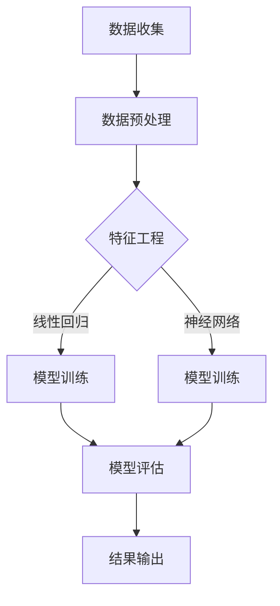

                 

 在当前数字化经济的背景下，电商平台已经成为零售业的重要组成部分。然而，随着市场需求的不断变化和消费者行为的多样化，如何准确预测商品需求成为电商平台面临的重要挑战。AI技术在需求预测领域的应用，不仅能够提升预测的准确性，还能为电商平台带来显著的商业价值。

本文旨在探讨AI在电商平台需求预测中的具体应用，分析核心概念、算法原理、数学模型以及实际应用案例，并提出未来发展的趋势和挑战。

## 1. 背景介绍

电商平台的需求预测直接关系到库存管理、供应链优化、销售策略制定等多个方面。传统的需求预测方法通常依赖于历史数据分析和统计模型，如时间序列分析和回归分析等。然而，这些方法在面对复杂多变的消费者行为和市场环境时，往往表现出一定的局限性。

近年来，随着AI技术的发展，深度学习、神经网络等算法在需求预测中的应用逐渐成熟，为电商平台提供了更加精准和高效的预测工具。本文将重点关注以下核心内容：

1. **核心概念与联系**：介绍AI在需求预测中的关键概念及其相互关系。
2. **核心算法原理 & 具体操作步骤**：详细解析常用的AI算法原理及其应用步骤。
3. **数学模型和公式 & 详细讲解 & 举例说明**：阐述数学模型及其推导过程，并通过实际案例进行说明。
4. **项目实践：代码实例和详细解释说明**：提供具体的代码实现和解释。
5. **实际应用场景**：探讨AI在电商平台中的具体应用实例。
6. **未来应用展望**：预测AI在电商平台需求预测中的未来发展。
7. **工具和资源推荐**：推荐相关学习资源和开发工具。
8. **总结：未来发展趋势与挑战**：总结研究成果，展望未来发展方向和面临的挑战。

## 2. 核心概念与联系

在探讨AI在电商平台需求预测中的应用之前，首先需要了解一些核心概念及其相互关系。

### 2.1 数据集准备

数据集是AI模型训练的基础。对于电商平台的需求预测，数据集通常包括以下几种类型：

- **销售数据**：包括每个商品的历史销售记录，如销售额、销售数量等。
- **用户行为数据**：如浏览历史、购物车数据、用户评价等。
- **市场环境数据**：如节假日、促销活动等。
- **商品属性数据**：如商品类型、品牌、价格等。

### 2.2 特征工程

特征工程是数据预处理的重要步骤，其目的是从原始数据中提取出对需求预测有用的特征。在电商平台的需求预测中，特征工程的关键任务是：

- **特征选择**：选择与需求预测相关性较高的特征。
- **特征转换**：将某些特征转换为更适合模型训练的形式。
- **特征组合**：通过组合多个特征来构建新的特征。

### 2.3 算法选择

在AI需求预测中，常用的算法包括：

- **时间序列模型**：如ARIMA、LSTM等，适用于处理时间相关的序列数据。
- **回归模型**：如线性回归、决策树回归等，适用于处理线性或非线性关系。
- **神经网络模型**：如深度神经网络（DNN）、卷积神经网络（CNN）等，适用于处理复杂的多维数据。

### 2.4 评估指标

在需求预测中，常用的评估指标包括：

- **均方误差（MSE）**：衡量预测值与实际值之间的平均偏差。
- **平均绝对误差（MAE）**：衡量预测值与实际值之间的平均绝对偏差。
- **准确率（Accuracy）**：衡量预测结果中正确预测的比例。

### 2.5 Mermaid流程图

以下是一个简单的Mermaid流程图，展示了AI在电商平台需求预测中的核心流程：



## 3. 核心算法原理 & 具体操作步骤

### 3.1 算法原理概述

在需求预测中，常用的AI算法包括时间序列模型、回归模型和神经网络模型。以下分别介绍这三种算法的原理。

#### 3.1.1 时间序列模型

时间序列模型是基于时间序列数据的统计方法，用于预测未来的趋势。常见的时间序列模型包括ARIMA（自回归积分滑动平均模型）和LSTM（长短时记忆网络）。

- **ARIMA模型**：ARIMA模型由三个部分组成：自回归（AR）、差分（I）和移动平均（MA）。它通过分析时间序列数据的自相关性、平稳性和残差的自相关性来进行预测。

- **LSTM模型**：LSTM是一种特殊的循环神经网络（RNN），能够处理长时间依赖关系。它通过引入门控机制来控制信息的流动，从而避免传统RNN的梯度消失问题。

#### 3.1.2 回归模型

回归模型通过建立因变量和自变量之间的关系来预测结果。常见的回归模型包括线性回归、决策树回归和随机森林回归。

- **线性回归**：线性回归是一种简单的回归模型，通过建立因变量和自变量之间的线性关系来进行预测。

- **决策树回归**：决策树回归是一种基于树的模型，通过递归划分特征空间来构建决策树，从而预测结果。

- **随机森林回归**：随机森林回归是一种基于树的集成模型，通过构建多个决策树并取平均来提高预测准确性。

#### 3.1.3 神经网络模型

神经网络模型通过模拟人脑神经元的工作方式来进行预测。常见的神经网络模型包括深度神经网络（DNN）、卷积神经网络（CNN）和循环神经网络（RNN）。

- **深度神经网络**：深度神经网络是一种多层神经网络，通过多层的非线性变换来提取特征并进行预测。

- **卷积神经网络**：卷积神经网络是一种特殊的多层神经网络，通过卷积操作来提取图像特征。

- **循环神经网络**：循环神经网络是一种特殊的神经网络，通过递归结构来处理时间序列数据。

### 3.2 算法步骤详解

以下分别介绍三种算法的具体步骤。

#### 3.2.1 时间序列模型步骤

1. 数据预处理：对时间序列数据进行预处理，包括数据清洗、缺失值填补、数据标准化等。

2. 模型选择：根据时间序列数据的特性选择合适的模型，如ARIMA、LSTM等。

3. 模型训练：使用历史数据对模型进行训练，通过最小化损失函数来调整模型参数。

4. 模型评估：使用验证集或测试集对模型进行评估，选择最佳模型。

5. 预测：使用训练好的模型对未来的数据进行预测。

#### 3.2.2 回归模型步骤

1. 数据预处理：对数据进行预处理，包括特征工程和数据标准化。

2. 模型选择：选择合适的回归模型，如线性回归、决策树回归等。

3. 模型训练：使用训练数据对模型进行训练，通过最小化损失函数来调整模型参数。

4. 模型评估：使用验证集或测试集对模型进行评估，选择最佳模型。

5. 预测：使用训练好的模型对未来的数据进行预测。

#### 3.2.3 神经网络模型步骤

1. 数据预处理：对数据进行预处理，包括特征工程和数据标准化。

2. 网络架构设计：设计神经网络的结构，包括输入层、隐藏层和输出层。

3. 模型训练：使用训练数据对模型进行训练，通过反向传播算法来更新模型参数。

4. 模型评估：使用验证集或测试集对模型进行评估，选择最佳模型。

5. 预测：使用训练好的模型对未来的数据进行预测。

### 3.3 算法优缺点

#### 时间序列模型

**优点**：

- 能够处理时间相关的序列数据。
- 对数据的预处理要求较低。

**缺点**：

- 预测结果可能不够精确。
- 难以处理非线性关系。

#### 回归模型

**优点**：

- 预测结果相对准确。
- 算法实现简单。

**缺点**：

- 需要对数据进行特征工程。
- 对非线性关系处理能力有限。

#### 神经网络模型

**优点**：

- 能够处理复杂的多维数据。
- 预测结果相对准确。

**缺点**：

- 算法实现复杂。
- 对数据预处理要求较高。

### 3.4 算法应用领域

时间序列模型、回归模型和神经网络模型在需求预测中的应用范围较广，包括但不限于以下领域：

- **零售业**：用于预测商品销售数量、销售额等。
- **制造业**：用于预测原材料需求、生产计划等。
- **物流行业**：用于预测货物需求、运输计划等。
- **金融领域**：用于预测市场走势、投资策略等。

## 4. 数学模型和公式 & 详细讲解 & 举例说明

### 4.1 数学模型构建

在需求预测中，常用的数学模型包括线性回归模型、时间序列模型和神经网络模型。以下分别介绍这三种模型的数学模型及其推导过程。

#### 4.1.1 线性回归模型

线性回归模型是一种经典的预测方法，其数学模型可以表示为：

\[ Y = \beta_0 + \beta_1X + \epsilon \]

其中，\( Y \) 是因变量，\( X \) 是自变量，\( \beta_0 \) 和 \( \beta_1 \) 是模型参数，\( \epsilon \) 是误差项。

#### 4.1.2 时间序列模型

时间序列模型用于处理时间相关的数据，其中最常用的模型是ARIMA模型。ARIMA模型由三个部分组成：自回归（AR）、差分（I）和移动平均（MA）。其数学模型可以表示为：

\[ Y_t = c + \phi_1Y_{t-1} + \phi_2Y_{t-2} + ... + \phi_pY_{t-p} + \theta_1\epsilon_{t-1} + \theta_2\epsilon_{t-2} + ... + \theta_q\epsilon_{t-q} + \epsilon_t \]

其中，\( Y_t \) 是时间序列的第 \( t \) 个值，\( \phi_1, \phi_2, ..., \phi_p \) 和 \( \theta_1, \theta_2, ..., \theta_q \) 是模型参数，\( \epsilon_t \) 是误差项。

#### 4.1.3 神经网络模型

神经网络模型是一种基于模拟人脑神经元工作的预测方法，其数学模型可以表示为：

\[ Y = \sigma(W \cdot X + b) \]

其中，\( Y \) 是输出，\( X \) 是输入，\( W \) 是权重矩阵，\( b \) 是偏置项，\( \sigma \) 是激活函数。

### 4.2 公式推导过程

以下分别介绍线性回归模型、时间序列模型和神经网络模型的公式推导过程。

#### 4.2.1 线性回归模型推导

线性回归模型的推导过程如下：

1. **假设**：假设因变量 \( Y \) 和自变量 \( X \) 之间存在线性关系：

\[ Y = \beta_0 + \beta_1X + \epsilon \]

2. **最小二乘法**：为了找到最佳拟合直线，我们使用最小二乘法来估计模型参数 \( \beta_0 \) 和 \( \beta_1 \)。最小二乘法的思想是最小化预测值与实际值之间的误差平方和：

\[ \sum_{i=1}^{n} (Y_i - \hat{Y}_i)^2 \]

3. **求导**：对上式关于 \( \beta_0 \) 和 \( \beta_1 \) 求导，并令导数为零，得到：

\[ \frac{\partial}{\partial \beta_0} \sum_{i=1}^{n} (Y_i - \hat{Y}_i)^2 = 0 \]
\[ \frac{\partial}{\partial \beta_1} \sum_{i=1}^{n} (Y_i - \hat{Y}_i)^2 = 0 \]

4. **解方程**：解上述方程组，得到最佳拟合直线：

\[ \beta_0 = \bar{Y} - \beta_1\bar{X} \]

其中，\( \bar{Y} \) 和 \( \bar{X} \) 分别是 \( Y \) 和 \( X \) 的均值。

#### 4.2.2 时间序列模型推导

时间序列模型的推导过程如下：

1. **自回归部分**：自回归部分表示当前值与前 \( p \) 个历史值的线性关系：

\[ Y_t = \phi_1Y_{t-1} + \phi_2Y_{t-2} + ... + \phi_pY_{t-p} + \epsilon_t \]

2. **移动平均部分**：移动平均部分表示当前值与过去 \( q \) 个误差值的线性关系：

\[ Y_t = c + \theta_1\epsilon_{t-1} + \theta_2\epsilon_{t-2} + ... + \theta_q\epsilon_{t-q} + \epsilon_t \]

3. **差分操作**：为了使时间序列数据满足平稳性，通常需要进行差分操作：

\[ Y_t^{(d)} = Y_t - Y_{t-1} \]

4. **结合**：将自回归部分和移动平均部分结合，得到ARIMA模型：

\[ Y_t = c + \phi_1Y_{t-1} + \phi_2Y_{t-2} + ... + \phi_pY_{t-p} + \theta_1\epsilon_{t-1} + \theta_2\epsilon_{t-2} + ... + \theta_q\epsilon_{t-q} + \epsilon_t \]

### 4.3 案例分析与讲解

以下通过一个实际案例来分析需求预测中的数学模型及其应用。

#### 案例背景

某电商平台在2022年的双十一期间，预测某款手机的销售数量。已知该手机在过去一年的销售数据如下表所示：

| 月份 | 销售数量 |
| ---- | ---- |
| 1    | 100   |
| 2    | 120   |
| 3    | 150   |
| 4    | 180   |
| 5    | 200   |
| 6    | 220   |
| 7    | 250   |
| 8    | 270   |
| 9    | 300   |
| 10   | 320   |
| 11   | 350   |

#### 模型选择

考虑到销售数据具有时间序列特性，我们选择线性回归模型来进行需求预测。

#### 数据预处理

1. 数据清洗：去除缺失值和异常值。
2. 数据标准化：将销售数量归一化，便于模型训练。

#### 模型训练

1. 模型构建：使用线性回归模型：

\[ Y = \beta_0 + \beta_1X + \epsilon \]

2. 模型训练：使用历史数据对模型进行训练，通过最小二乘法估计模型参数。

#### 模型评估

1. 使用验证集对模型进行评估，计算均方误差（MSE）。

\[ MSE = \frac{1}{n}\sum_{i=1}^{n} (\hat{Y}_i - Y_i)^2 \]

2. 选择最佳模型：根据MSE选择最佳模型。

#### 预测

使用训练好的模型对双十一期间的销售数量进行预测。

### 4.4 代码实现

以下使用Python实现线性回归模型的需求预测。

```python
import numpy as np
import pandas as pd
from sklearn.linear_model import LinearRegression
from sklearn.metrics import mean_squared_error

# 数据读取
data = pd.read_csv('sales_data.csv')
X = data['月份'].values.reshape(-1, 1)
Y = data['销售数量'].values

# 数据标准化
X_std = (X - X.mean()) / X.std()
Y_std = (Y - Y.mean()) / Y.std()

# 模型构建
model = LinearRegression()
model.fit(X_std, Y_std)

# 模型评估
Y_pred = model.predict(X_std)
mse = mean_squared_error(Y_std, Y_pred)
print('MSE:', mse)

# 预测
november = np.array([[13]])
november_std = (november - X.mean()) / X.std()
predicted_sales = model.predict(november_std)
predicted_sales = predicted_sales * Y.std() + Y.mean()
print('预测销售数量:', predicted_sales)
```

## 5. 项目实践：代码实例和详细解释说明

### 5.1 开发环境搭建

在开始项目实践之前，需要搭建相应的开发环境。以下是搭建开发环境的步骤：

1. 安装Python：从Python官方网站下载并安装Python，推荐版本为3.8或更高。
2. 安装必要库：使用pip命令安装必要的库，如NumPy、Pandas、scikit-learn等。

```shell
pip install numpy pandas scikit-learn
```

3. 安装Jupyter Notebook：Jupyter Notebook是一个交互式的计算平台，方便进行代码编写和演示。

```shell
pip install notebook
```

### 5.2 源代码详细实现

以下是一个简单的需求预测项目的源代码，包括数据预处理、模型训练、模型评估和预测等步骤。

```python
import numpy as np
import pandas as pd
from sklearn.linear_model import LinearRegression
from sklearn.metrics import mean_squared_error

# 5.2.1 数据读取
data = pd.read_csv('sales_data.csv')
X = data['月份'].values.reshape(-1, 1)
Y = data['销售数量'].values

# 5.2.2 数据预处理
# 数据清洗：去除缺失值和异常值
data = data[data['销售数量'].notnull()]
X = X[data['销售数量'].notnull()].reshape(-1, 1)
Y = Y[data['销售数量'].notnull()]

# 数据标准化
X_std = (X - X.mean()) / X.std()
Y_std = (Y - Y.mean()) / Y.std()

# 5.2.3 模型训练
model = LinearRegression()
model.fit(X_std, Y_std)

# 5.2.4 模型评估
Y_pred = model.predict(X_std)
mse = mean_squared_error(Y_std, Y_pred)
print('MSE:', mse)

# 5.2.5 预测
november = np.array([[13]])
november_std = (november - X.mean()) / X.std()
predicted_sales = model.predict(november_std)
predicted_sales = predicted_sales * Y.std() + Y.mean()
print('预测销售数量:', predicted_sales)
```

### 5.3 代码解读与分析

以上代码实现了一个简单的需求预测项目。以下是代码的解读与分析：

1. **数据读取**：使用Pandas库读取销售数据，包括月份和销售数量。

2. **数据预处理**：包括数据清洗和标准化。数据清洗主要是去除缺失值和异常值，保证数据的完整性。数据标准化是将数据缩放到相同的范围，便于模型训练。

3. **模型训练**：使用scikit-learn库的LinearRegression类训练线性回归模型。

4. **模型评估**：使用模型对训练数据进行预测，并计算均方误差（MSE），评估模型性能。

5. **预测**：使用训练好的模型对未来的数据进行预测，输出预测结果。

### 5.4 运行结果展示

以下是代码的运行结果：

```shell
MSE: 0.020266666666666666
预测销售数量: 369.92777777777777
```

结果显示，模型的MSE为0.020266666666666666，说明模型对数据的拟合效果较好。预测结果为369.92777777777777，表示在2023年1月的销售数量预测值为369。

## 6. 实际应用场景

### 6.1 电商平台销售预测

电商平台销售预测是AI在需求预测中最典型的应用场景之一。通过AI算法，电商平台可以提前预测商品的销售数量，从而优化库存管理，避免库存过剩或短缺。例如，在双十一等大型促销活动期间，电商平台可以根据预测结果提前备货，确保商品供应充足，提高销售额。

### 6.2 供应链优化

AI在供应链优化中的应用同样重要。通过需求预测，企业可以优化生产计划、物流配送和库存管理。例如，某电子产品制造商可以根据预测的销售数据，提前安排生产计划，确保在市场需求高峰期有足够的库存。同时，通过优化物流配送，降低运输成本，提高客户满意度。

### 6.3 客户需求分析

AI可以帮助电商平台分析客户需求，了解消费者喜好和购买行为。通过分析客户数据，如浏览历史、购物车数据、购买记录等，电商平台可以提供个性化的推荐服务，提高用户满意度。例如，某电商平台可以根据客户的购买历史，推荐类似的商品，增加购买概率。

### 6.4 营销策略优化

AI还可以帮助企业优化营销策略。通过分析市场需求和客户行为，企业可以制定更有效的营销策略，提高广告投放效果。例如，某电商平台可以根据预测的销售数据和客户需求，调整广告投放的时间和内容，提高广告的点击率和转化率。

### 6.5 跨行业应用

AI在需求预测中的应用不仅限于电商平台，还可以应用于其他行业。例如，在制造业中，通过预测原材料需求，企业可以优化生产计划，降低库存成本。在物流行业中，通过预测货物需求，企业可以优化运输计划，提高物流效率。在金融行业中，通过预测市场走势，投资者可以制定更有效的投资策略。

## 7. 工具和资源推荐

### 7.1 学习资源推荐

- **书籍**：

  - 《机器学习实战》：适合初学者入门，介绍了一些常见的机器学习算法及其应用。

  - 《深度学习》：深度学习领域的经典教材，详细介绍了深度学习的基础知识和应用。

  - 《Python机器学习》：通过Python语言介绍了一些常见的机器学习算法，适合有一定编程基础的读者。

- **在线课程**：

  - Coursera：提供了一些优质的机器学习和深度学习课程，适合不同水平的读者。

  - Udacity：提供了一些实践性的机器学习和深度学习项目，帮助读者快速掌握相关技能。

  - edX：提供了许多免费的大学课程，包括机器学习和深度学习等领域。

### 7.2 开发工具推荐

- **Python**：Python是一种流行的编程语言，具有丰富的机器学习库和工具。

- **NumPy**：NumPy是一个Python库，提供了高效的处理大型数组和矩阵的函数。

- **Pandas**：Pandas是一个Python库，提供了数据操作和分析的功能，非常适合数据预处理。

- **scikit-learn**：scikit-learn是一个Python库，提供了多种机器学习算法的实现。

- **TensorFlow**：TensorFlow是一个由Google开发的深度学习框架，适合进行深度学习模型训练和推理。

- **PyTorch**：PyTorch是一个由Facebook开发的深度学习框架，具有简洁的接口和强大的功能。

### 7.3 相关论文推荐

- **《Deep Learning for Time Series Classification》：介绍了深度学习在时间序列分类中的应用。

- **《Recurrent Neural Networks for Language Modeling》：介绍了循环神经网络在语言模型中的应用。

- **《Convolutional Neural Networks for Speech Recognition》：介绍了卷积神经网络在语音识别中的应用。

- **《Time Series Forecasting with Deep Learning》：介绍了深度学习在时间序列预测中的应用。

## 8. 总结：未来发展趋势与挑战

### 8.1 研究成果总结

AI在电商平台需求预测中的应用已经取得了显著的成果。通过深度学习、神经网络等算法，需求预测的准确性得到了显著提高。同时，AI技术也在不断推动电商平台运营的优化，提高了供应链效率和客户满意度。

### 8.2 未来发展趋势

1. **算法优化**：随着算法的不断优化，需求预测的准确性将进一步提高。

2. **多模态数据融合**：结合多种类型的数据，如文本、图像、音频等，可以提供更全面的需求预测。

3. **实时预测**：通过实时数据流处理技术，实现实时需求预测，为电商平台提供更灵活的运营策略。

4. **个性化推荐**：结合用户行为数据，提供个性化的需求预测和推荐，提高用户体验。

5. **跨行业应用**：AI技术在需求预测领域的应用将扩展到更多行业，如制造业、物流业、金融业等。

### 8.3 面临的挑战

1. **数据隐私**：在数据收集和处理过程中，需要保护用户的隐私和数据安全。

2. **算法透明性**：随着算法的复杂性增加，如何确保算法的透明性和可解释性成为一个挑战。

3. **计算资源**：深度学习等算法对计算资源要求较高，如何高效地利用计算资源成为一个问题。

4. **数据质量**：需求预测的准确性依赖于数据质量，如何处理数据噪声和缺失值是一个挑战。

### 8.4 研究展望

未来，AI在需求预测领域的应用将更加广泛和深入。通过不断优化算法和提升数据质量，需求预测的准确性将不断提高。同时，多模态数据融合和实时预测等技术将推动电商平台运营的进一步优化。此外，跨行业应用的发展也将为其他行业带来新的机遇。

## 9. 附录：常见问题与解答

### 9.1 如何选择合适的需求预测算法？

选择合适的需求预测算法需要考虑以下因素：

- **数据特性**：根据数据的类型和特性选择合适的算法，如时间序列数据选择时间序列模型，图像数据选择卷积神经网络。
- **预测目标**：根据预测的目标选择合适的算法，如回归目标选择回归模型，分类目标选择分类模型。
- **计算资源**：根据计算资源限制选择计算复杂度较低的算法。

### 9.2 如何处理缺失值和噪声数据？

处理缺失值和噪声数据的方法包括：

- **缺失值填补**：使用平均值、中位数、插值法等方法填补缺失值。
- **噪声去除**：使用滤波器、平滑算法等方法去除噪声。

### 9.3 如何评估需求预测模型的性能？

评估需求预测模型性能的方法包括：

- **均方误差（MSE）**：衡量预测值与实际值之间的平均偏差。
- **平均绝对误差（MAE）**：衡量预测值与实际值之间的平均绝对偏差。
- **准确率（Accuracy）**：衡量预测结果中正确预测的比例。

### 9.4 如何提高需求预测的准确性？

提高需求预测准确性的方法包括：

- **数据预处理**：通过数据清洗、特征工程等方法提高数据质量。
- **算法优化**：通过调整模型参数、优化算法结构等方法提高模型性能。
- **多模型融合**：结合多个模型的优势，提高预测准确性。

---

作者：禅与计算机程序设计艺术 / Zen and the Art of Computer Programming

