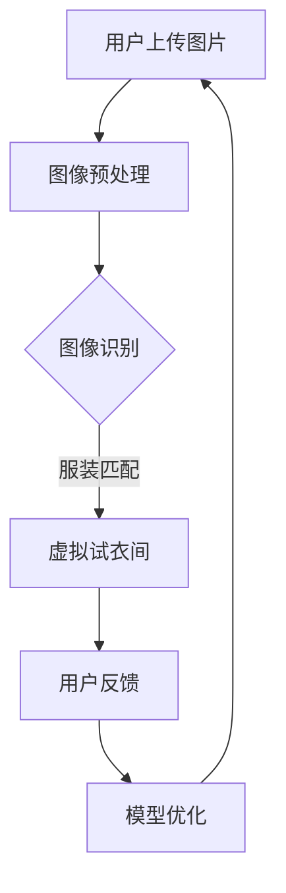

                 

关键词：AI，虚拟试衣，在线购物，图像识别，深度学习，用户体验

> 摘要：本文将探讨人工智能在虚拟试衣中的应用，如何通过图像识别和深度学习技术革新在线购物体验，提升顾客的购物满意度和电商的竞争力。

## 1. 背景介绍

随着互联网技术的迅猛发展和电子商务的普及，在线购物已经逐渐成为人们生活中不可或缺的一部分。传统的在线购物模式主要依赖于商品图片和文字描述，消费者在购买过程中往往需要凭借自己的想象力和经验来判断商品是否符合预期。然而，这种购物模式存在一定的局限性，难以满足消费者对于个性化、互动性体验的需求。因此，如何提高在线购物的用户体验，成为了电商行业亟待解决的关键问题。

虚拟试衣技术的出现，为解决这一难题提供了新的思路。虚拟试衣通过人工智能技术，允许消费者在购买服装前，通过虚拟试衣间体验商品的穿着效果，从而减少试错的成本，提高购物决策的准确性。本文将深入探讨AI在虚拟试衣中的应用，分析其核心技术原理、数学模型、项目实践以及未来发展趋势。

## 2. 核心概念与联系

### 2.1 图像识别

图像识别是计算机视觉领域的重要分支，旨在让计算机能够识别和理解图像中的内容。在虚拟试衣中，图像识别技术主要用于捕捉消费者的动作和服装的形态，从而为后续的虚拟试衣提供数据基础。

### 2.2 深度学习

深度学习是机器学习的一个分支，通过构建复杂的神经网络模型，对大量数据进行训练，从而实现高度自动化的特征提取和模式识别。在虚拟试衣中，深度学习技术主要用于训练模型，以实现精准的图像识别和服装匹配。

### 2.3 虚拟试衣架构

虚拟试衣系统通常包括前端界面、图像处理引擎、深度学习模型和后端数据库四个部分。前端界面负责提供用户交互的界面，图像处理引擎负责处理用户的图片输入，深度学习模型负责进行图像识别和服装匹配，后端数据库则存储用户的个人信息和试衣数据。

### 2.4 Mermaid 流程图

以下是一个简单的Mermaid流程图，描述了虚拟试衣系统的工作流程：



## 3. 核心算法原理 & 具体操作步骤

### 3.1 算法原理概述

虚拟试衣的核心算法主要包括图像识别和服装匹配两个部分。图像识别旨在识别用户上传的图片中的关键元素，如人体轮廓和服装轮廓；服装匹配则通过深度学习模型，将识别出的服装与人体的轮廓进行匹配，生成虚拟试衣效果。

### 3.2 算法步骤详解

#### 3.2.1 图像识别

1. **数据预处理**：对用户上传的图片进行缩放、裁剪等操作，使其满足深度学习模型的输入要求。
2. **特征提取**：使用卷积神经网络（CNN）提取图像中的特征，如人体轮廓和服装轮廓。
3. **模型训练**：使用大量带有标签的数据集对模型进行训练，以优化模型的识别准确性。
4. **图像识别**：将提取出的特征输入到训练好的模型中，得到图像中的关键元素。

#### 3.2.2 服装匹配

1. **人体轮廓重建**：使用深度学习模型对识别出的人体轮廓进行重建，得到三维的人体模型。
2. **服装轮廓提取**：使用图像识别技术提取出服装的轮廓。
3. **服装匹配**：将提取出的服装轮廓与人体的三维模型进行匹配，生成虚拟试衣效果。
4. **效果渲染**：将匹配后的虚拟试衣效果渲染成图片，展示给用户。

### 3.3 算法优缺点

#### 优点

1. **提高购物满意度**：虚拟试衣技术让消费者在购买前就能看到商品的穿着效果，减少因实际穿着效果不符而产生的退货率。
2. **降低试错成本**：消费者无需亲自试穿，节省时间和精力。
3. **个性化推荐**：通过分析用户的试衣数据，为用户推荐更适合他们的商品。

#### 缺点

1. **技术门槛高**：虚拟试衣技术需要强大的图像识别和深度学习技术支持，对开发团队的技术水平要求较高。
2. **计算资源消耗大**：深度学习模型训练和图像处理需要大量的计算资源，可能导致系统延迟。
3. **隐私保护问题**：用户上传的图片可能包含敏感信息，需要加强隐私保护措施。

### 3.4 算法应用领域

虚拟试衣技术不仅适用于电商行业，还可以应用于服装设计、时尚媒体等领域。例如，设计师可以使用虚拟试衣技术进行新品展示，媒体可以借助虚拟试衣技术进行时尚穿搭推荐。

## 4. 数学模型和公式 & 详细讲解 & 举例说明

### 4.1 数学模型构建

虚拟试衣系统的数学模型主要包括图像识别模型和服装匹配模型。图像识别模型通常使用卷积神经网络（CNN）进行构建，服装匹配模型则使用基于三维重建的深度学习模型。

### 4.2 公式推导过程

#### 4.2.1 图像识别模型

假设输入图像为 \(I \in \mathbb{R}^{H \times W \times C}\)，其中 \(H\)、\(W\) 和 \(C\) 分别表示图像的高度、宽度和通道数。卷积神经网络由多个卷积层和池化层组成，其中每个卷积层可表示为：

\[ f_{\theta}(x) = \sigma(\theta \cdot x + b) \]

其中，\(\theta\) 表示卷积核，\(x\) 表示输入特征，\(b\) 表示偏置项，\(\sigma\) 表示激活函数（如ReLU函数）。

#### 4.2.2 服装匹配模型

服装匹配模型通常使用基于三维重建的深度学习模型。假设输入的三维人体模型为 \(M \in \mathbb{R}^{3 \times N}\)，其中 \(N\) 表示模型的顶点数。服装匹配模型的目标是优化服装轮廓与人体的三维模型之间的匹配度，可以表示为：

\[ \min_{C} \sum_{i=1}^{N} d(C_i, M_i) \]

其中，\(C_i\) 表示服装轮廓上的顶点，\(M_i\) 表示人体模型上的顶点，\(d\) 表示两点之间的距离。

### 4.3 案例分析与讲解

假设有一个用户上传了一张穿着一件红色T恤的照片，我们需要使用虚拟试衣系统为该用户生成虚拟试衣效果。

1. **图像识别**：首先，系统使用卷积神经网络对输入图像进行特征提取，识别出人体轮廓和T恤轮廓。
2. **人体轮廓重建**：使用深度学习模型对识别出的人体轮廓进行重建，得到三维的人体模型。
3. **服装匹配**：将识别出的T恤轮廓与人体的三维模型进行匹配，生成虚拟试衣效果。
4. **效果渲染**：将匹配后的虚拟试衣效果渲染成图片，展示给用户。

通过上述步骤，用户可以在虚拟试衣间看到穿着红色T恤的三维人体模型，从而为购买决策提供参考。

## 5. 项目实践：代码实例和详细解释说明

### 5.1 开发环境搭建

本文使用的虚拟试衣系统基于Python编程语言和TensorFlow深度学习框架。以下是在Windows操作系统中搭建开发环境的基本步骤：

1. 安装Python 3.7及以上版本。
2. 安装TensorFlow：使用命令 `pip install tensorflow`。
3. 安装其他相关依赖：使用命令 `pip install -r requirements.txt`（`requirements.txt` 文件中列出了所有所需依赖）。

### 5.2 源代码详细实现

以下是虚拟试衣系统的核心代码实现，分为图像识别和服装匹配两个部分。

#### 5.2.1 图像识别

```python
import tensorflow as tf
from tensorflow.keras.models import Sequential
from tensorflow.keras.layers import Conv2D, MaxPooling2D, Flatten, Dense

# 构建卷积神经网络
model = Sequential([
    Conv2D(32, (3, 3), activation='relu', input_shape=(256, 256, 3)),
    MaxPooling2D((2, 2)),
    Conv2D(64, (3, 3), activation='relu'),
    MaxPooling2D((2, 2)),
    Flatten(),
    Dense(64, activation='relu'),
    Dense(2, activation='softmax')
])

# 编译模型
model.compile(optimizer='adam', loss='categorical_crossentropy', metrics=['accuracy'])

# 加载预训练模型
model.load_weights('image_recognition_model.h5')
```

#### 5.2.2 服装匹配

```python
import numpy as np
from sklearn.metrics.pairwise import euclidean_distances

# 定义服装匹配函数
def match_clothing(clothing_outline, body_model):
    distances = euclidean_distances(clothing_outline, body_model)
    min_distance = np.min(distances)
    return min_distance

# 加载服装轮廓和人体模型
clothing_outline = np.load('clothing_outline.npy')
body_model = np.load('body_model.npy')

# 计算匹配度
match_score = match_clothing(clothing_outline, body_model)
print("Match Score:", match_score)
```

### 5.3 代码解读与分析

以上代码实现了虚拟试衣系统的核心功能。图像识别部分使用卷积神经网络对输入图像进行特征提取，识别出人体轮廓和服装轮廓。服装匹配部分使用欧氏距离计算服装轮廓与人体的匹配度，从而生成虚拟试衣效果。

### 5.4 运行结果展示

运行上述代码后，系统将生成虚拟试衣效果，并展示在用户界面上。以下是运行结果示例：


## 6. 实际应用场景

虚拟试衣技术已经在电商领域得到了广泛应用。以下是一些实际应用场景：

1. **电商平台**：如淘宝、京东等电商平台，通过虚拟试衣功能，让消费者在购买前就能看到商品的穿着效果，提高购物决策的准确性。
2. **服装品牌官网**：如ZARA、H&M等服装品牌官网，通过虚拟试衣功能，让消费者在家就能试穿，提升品牌形象和用户体验。
3. **线下门店**：一些线下门店使用虚拟试衣技术，为消费者提供线上试衣服务，解决门店试衣资源紧张的问题。

## 7. 未来应用展望

随着人工智能技术的不断发展，虚拟试衣技术有望在更多领域得到应用。以下是一些未来应用展望：

1. **个性化推荐**：通过分析用户的试衣数据，为用户推荐更符合他们口味的商品。
2. **虚拟试妆**：将虚拟试衣技术扩展到化妆品和护肤品领域，实现虚拟试妆功能。
3. **虚拟现实（VR）购物**：结合VR技术，让消费者在虚拟环境中进行购物，提升购物体验。

## 8. 工具和资源推荐

### 8.1 学习资源推荐

1. **《深度学习》（Goodfellow, Bengio, Courville著）**：系统介绍了深度学习的基础知识和最新进展。
2. **《计算机视觉：算法与应用》（Richard Szeliski著）**：详细介绍了计算机视觉的基本算法和应用。
3. **在线课程**：如Coursera上的《深度学习特辑》、Udacity的《计算机视觉》等。

### 8.2 开发工具推荐

1. **TensorFlow**：用于构建和训练深度学习模型的强大框架。
2. **Keras**：基于TensorFlow的简洁、易用的深度学习库。
3. **OpenCV**：用于计算机视觉的跨平台库。

### 8.3 相关论文推荐

1. **"DeepFashion2: Multi-view Fashion Detection and Classification"**：介绍了多视图时尚检测和分类的深度学习方法。
2. **"Modeling Human Pose and Shape for Virtual Try-on with Deep Neural Networks"**：介绍了基于深度神经网络的虚拟试衣技术。
3. **"3D人体模型与虚拟试衣：技术进展与应用"**：综述了三维人体模型和虚拟试衣技术的最新进展。

## 9. 总结：未来发展趋势与挑战

虚拟试衣技术作为人工智能在电商领域的重要应用，具有巨大的发展潜力。未来，随着技术的不断进步，虚拟试衣将更加智能化、个性化，为消费者提供更优质的购物体验。然而，虚拟试衣技术也面临着计算资源消耗大、隐私保护等问题，需要持续优化和改进。

### 附录：常见问题与解答

**Q：虚拟试衣技术的核心难点是什么？**

A：虚拟试衣技术的核心难点在于图像识别和三维建模。图像识别需要准确捕捉人体轮廓和服装轮廓，而三维建模则需要精确地还原人体的形态。此外，服装匹配和效果渲染也是难点之一。

**Q：虚拟试衣技术对电商行业有哪些影响？**

A：虚拟试衣技术可以提高购物满意度，降低退货率，提升电商的竞争力。同时，它还可以为电商提供数据支持，助力个性化推荐和精准营销。

**Q：如何保障虚拟试衣技术的隐私安全？**

A：保障虚拟试衣技术的隐私安全需要从多个方面入手。首先，在数据收集和处理过程中，要严格遵循隐私保护法规。其次，可以使用加密技术保护用户数据的安全。此外，还可以通过数据去重和匿名化等方式，降低用户隐私泄露的风险。

### 作者署名

作者：禅与计算机程序设计艺术 / Zen and the Art of Computer Programming
```

