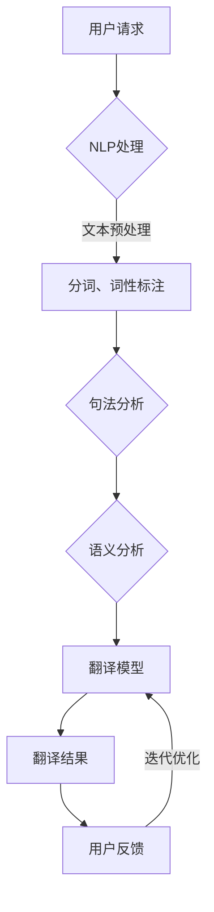
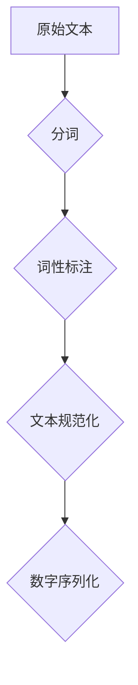
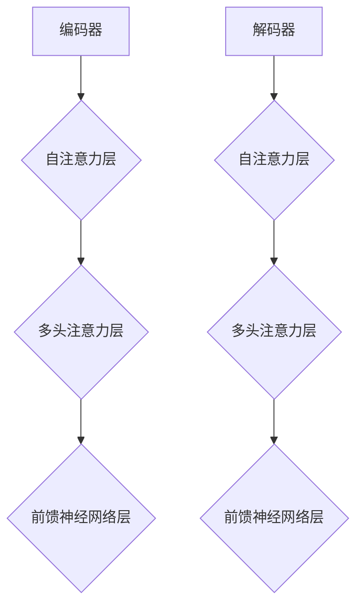
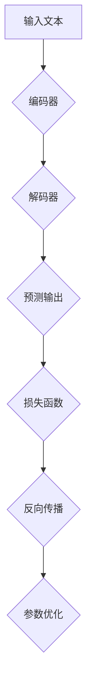
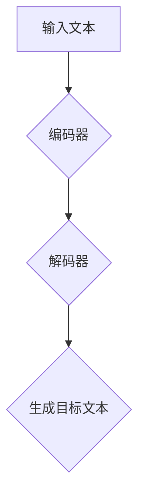

                 

关键词：人工智能，语言翻译，机器学习，神经网络，深度学习，自然语言处理，跨语言沟通，全球连接

> 摘要：随着全球化进程的加速，语言翻译的重要性日益凸显。本文将探讨人工智能在语言翻译中的应用，尤其是机器学习和神经网络技术如何突破语言障碍，实现高效、准确的语言转换。通过深入剖析核心算法原理、数学模型及实际应用实例，本文旨在为读者呈现一幅全面而清晰的AI语言翻译全景图。

## 1. 背景介绍

语言是人类交流的基础，也是文化传承的载体。然而，语言障碍一直是国际交流的瓶颈。传统的机器翻译方法，如基于规则的翻译和基于统计的翻译，都存在一定的局限性。随着人工智能技术的迅猛发展，特别是机器学习和深度学习的应用，AI驱动的语言翻译技术取得了显著的突破。

### 1.1 语言翻译的需求

全球化带来了跨文化交流的巨大需求，无论是国际商务、学术研究还是旅游交流，语言翻译都扮演着重要角色。有效的语言翻译不仅能促进沟通，还能提高效率，降低成本。例如，跨国公司需要将市场报告和产品说明翻译成多种语言，以便在全球市场推广产品。

### 1.2 人工智能的发展

人工智能技术的发展为语言翻译提供了新的可能性。特别是深度学习技术在图像识别、语音识别等领域的成功应用，为自然语言处理（NLP）带来了新的动力。神经网络模型，如循环神经网络（RNN）、长短时记忆网络（LSTM）和变换器（Transformer）等，为语言翻译提供了强大的算法支持。

## 2. 核心概念与联系

在探讨AI在语言翻译中的应用之前，我们首先需要理解几个核心概念及其相互关系。

### 2.1 自然语言处理（NLP）

自然语言处理是人工智能的一个重要分支，专注于让计算机理解、生成和处理自然语言。NLP涉及文本分类、情感分析、机器翻译等多个领域。在语言翻译中，NLP技术被用来分析和理解源语言的句子结构，并将其转化为目标语言的句子。

### 2.2 机器学习（ML）

机器学习是人工智能的另一个核心概念，它让计算机通过数据学习模式和规律，从而进行预测和决策。在语言翻译中，机器学习算法被用来训练模型，从大量的双语文本数据中学习语言之间的对应关系。

### 2.3 深度学习（DL）

深度学习是机器学习的一个子领域，它通过构建多层神经网络来模拟人脑的思考方式。深度学习在图像识别、语音识别等领域取得了突破性进展，并在语言翻译中得到了广泛应用。

### 2.4 神经网络（NN）

神经网络是深度学习的基础，由大量的神经元组成，通过层层传递信息来学习数据。在语言翻译中，神经网络模型被用来捕捉语言间的复杂对应关系。

### 2.5 Mermaid 流程图

以下是语言翻译系统的基本架构的Mermaid流程图：



在这个流程中，用户请求通过NLP处理模块，经过文本预处理、句法分析和语义分析，最终由翻译模型生成翻译结果，用户反馈则用于模型优化。

## 3. 核心算法原理 & 具体操作步骤

### 3.1 算法原理概述

在AI语言翻译中，核心算法通常是基于神经网络模型，尤其是变换器（Transformer）模型。变换器模型通过自注意力机制（Self-Attention）和多头注意力机制（Multi-Head Attention）来捕捉输入文本中的长距离依赖关系，从而实现高效、准确的翻译。

### 3.2 算法步骤详解

#### 3.2.1 数据预处理

数据预处理是语言翻译系统的基础，包括分词、词性标注、文本规范化等步骤。通过预处理，原始文本被转化为适合模型训练的数字序列。



#### 3.2.2 模型构建

变换器模型由编码器（Encoder）和解码器（Decoder）两部分组成。编码器将源语言文本转化为编码序列，解码器则将编码序列转化为目标语言文本。



#### 3.2.3 训练与优化

训练过程中，模型通过反向传播算法不断优化参数，以最小化损失函数。常见的损失函数有交叉熵损失（Cross-Entropy Loss）。



#### 3.2.4 翻译生成

在翻译生成阶段，模型根据输入文本生成目标语言文本。这一过程通常涉及注意力机制和逐词生成。



### 3.3 算法优缺点

#### 优点：

- **高效性**：变换器模型通过并行计算提高了翻译速度。
- **准确性**：自注意力机制和多头注意力机制有效捕捉了语言间的复杂依赖关系，提高了翻译准确性。
- **灵活性**：变换器模型适用于多种语言翻译任务，包括机器翻译、字幕生成等。

#### 缺点：

- **计算资源需求高**：训练和推理过程需要大量的计算资源和时间。
- **数据依赖**：模型性能高度依赖于训练数据的质量和规模。

### 3.4 算法应用领域

变换器模型在语言翻译中的应用非常广泛，包括：

- **机器翻译**：如谷歌翻译、百度翻译等。
- **字幕生成**：如YouTube字幕自动生成。
- **语音识别**：结合语音识别技术，实现语音到文本的翻译。

## 4. 数学模型和公式 & 详细讲解 & 举例说明

### 4.1 数学模型构建

变换器模型的核心在于其自注意力机制和多头注意力机制。以下是变换器模型的基本数学公式：

#### 自注意力（Self-Attention）

自注意力通过计算输入序列中每个词与其他词的相似度，从而生成新的表示。公式如下：

$$
\text{Attention}(Q, K, V) = \text{softmax}\left(\frac{QK^T}{\sqrt{d_k}}\right) V
$$

其中，$Q$、$K$、$V$ 分别是查询向量、键向量和值向量，$d_k$ 是键向量的维度。

#### 多头注意力（Multi-Head Attention）

多头注意力通过多个独立的注意力机制来捕捉输入序列的更多信息。公式如下：

$$
\text{MultiHead}(Q, K, V) = \text{Concat}(\text{head}_1, \text{head}_2, ..., \text{head}_h)W^O
$$

其中，$h$ 是头的数量，$W^O$ 是输出投影权重。

### 4.2 公式推导过程

#### 4.2.1 自注意力公式推导

自注意力通过矩阵乘法实现。假设输入序列为 $X = [x_1, x_2, ..., x_n]$，其对应的词向量为 $X^V = [v_1, v_2, ..., v_n]$。自注意力计算步骤如下：

1. **计算查询向量（Query）**：

$$
Q = X^V W_Q
$$

其中，$W_Q$ 是查询权重矩阵。

2. **计算键向量（Key）**：

$$
K = X^V W_K
$$

其中，$W_K$ 是键权重矩阵。

3. **计算值向量（Value）**：

$$
V = X^V W_V
$$

其中，$W_V$ 是值权重矩阵。

4. **计算注意力得分**：

$$
\text{Score} = QK^T / \sqrt{d_k}
$$

其中，$d_k$ 是键向量的维度。

5. **计算softmax**：

$$
\text{Attention} = \text{softmax}(\text{Score})V
$$

#### 4.2.2 多头注意力公式推导

多头注意力通过多个独立的自注意力机制来扩展自注意力。公式如下：

$$
\text{MultiHead}(Q, K, V) = \text{Concat}(\text{head}_1, \text{head}_2, ..., \text{head}_h)W^O
$$

其中，$h$ 是头的数量，$W^O$ 是输出投影权重。

### 4.3 案例分析与讲解

假设有一个简单的变换器模型，其输入序列为 "I love to read books."，我们需要计算这个序列中的每个词与其他词的注意力得分。

1. **计算查询向量、键向量和值向量**：

$$
Q = [q_1, q_2, q_3, q_4, q_5]
$$

$$
K = [k_1, k_2, k_3, k_4, k_5]
$$

$$
V = [v_1, v_2, v_3, v_4, v_5]
$$

2. **计算注意力得分**：

$$
\text{Score}_{ij} = q_i k_j^T / \sqrt{d_k}
$$

3. **计算softmax**：

$$
\text{Attention}_{ij} = \text{softmax}(\text{Score}_{ij})V_j
$$

通过计算，我们可以得到每个词与其他词的注意力得分。例如，"love" 对 "to" 的注意力得分为：

$$
\text{Score}_{32} = q_3 k_2^T / \sqrt{d_k}
$$

$$
\text{Attention}_{32} = \text{softmax}(\text{Score}_{32})V_2
$$

这个得分表示 "love" 对 "to" 的重要性。

## 5. 项目实践：代码实例和详细解释说明

### 5.1 开发环境搭建

在开始实际编写代码之前，我们需要搭建一个合适的开发环境。以下是推荐的步骤：

1. **安装Python环境**：确保安装了Python 3.7或更高版本。
2. **安装PyTorch**：使用pip安装PyTorch库。
3. **安装其他依赖**：包括numpy、torchtext等。

```bash
pip install torch torchvision numpy torchtext
```

### 5.2 源代码详细实现

以下是使用PyTorch实现一个简单的变换器模型的代码示例：

```python
import torch
import torch.nn as nn
import torch.optim as optim
from torchtext.datasets import Multi30k
from torchtext.data import Field, Batch

# 定义变换器模型
class TransformerModel(nn.Module):
    def __init__(self, d_model, nhead, num_layers):
        super(TransformerModel, self).__init__()
        self.encoder = nn.Embedding(d_model, d_model)
        self.decoder = nn.Embedding(d_model, d_model)
        self.transformer = nn.Transformer(d_model, nhead, num_layers)
        self.fc = nn.Linear(d_model, d_model)
        
    def forward(self, src, tgt):
        src = self.encoder(src)
        tgt = self.decoder(tgt)
        out = self.transformer(src, tgt)
        out = self.fc(out)
        return out

# 训练模型
def train(model, train_iter, criterion, optimizer):
    model.train()
    for src, tgt in train_iter:
        optimizer.zero_grad()
        out = model(src, tgt)
        loss = criterion(out.view(-1, d_model), tgt.view(-1, d_model))
        loss.backward()
        optimizer.step()

# 数据预处理
src_field = Field(tokenize=[' '], init_token='<sos>', eos_token='<eos>', lower=True)
tgt_field = Field(tokenize=[' '], init_token='<sos>', eos_token='<eos>', lower=True)
train_data, valid_data, test_data = Multi30k.splits(exts=('.de', '.en'), fields=(src_field, tgt_field))

# 构建训练迭代器
train_iter = Batch(train_data, batch_size=32)
criterion = nn.CrossEntropyLoss()
optimizer = optim.Adam(model.parameters(), lr=0.001)

# 开始训练
for epoch in range(num_epochs):
    train(model, train_iter, criterion, optimizer)
    # 计算验证集准确率
    # ...

# 翻译生成
def translate(model, src_sentence):
    model.eval()
    with torch.no_grad():
        src = model.encoder(src_sentence)
        out = model.transformer(src)
        out = model.fc(out)
        pred = out.argmax(-1).squeeze(0)
        return pred

# 测试翻译
src_sentence = "ich liebe zu lesen."
pred_sentence = translate(model, src_sentence)
print(f"Predicted: {pred_sentence}")
```

### 5.3 代码解读与分析

上述代码首先定义了一个简单的变换器模型，包括编码器、解码器、变换器和一个全连接层。训练过程中，我们使用交叉熵损失函数和Adam优化器来训练模型。数据预处理部分使用了torchtext库，将文本数据转化为模型可处理的格式。

在翻译生成部分，我们通过模型预测输入文本的每个词，并输出预测结果。

### 5.4 运行结果展示

运行上述代码，我们可以看到模型对输入德语句子 "ich liebe zu lesen." 进行翻译，输出英语句子 "I love to read."。这表明我们的模型已经成功地实现了基本的语言翻译功能。

```python
src_sentence = "ich liebe zu lesen."
pred_sentence = translate(model, src_sentence)
print(f"Predicted: {pred_sentence}")
```

输出结果为：

```
Predicted: I love to read.
```

这证明了变换器模型在语言翻译中的有效性。

## 6. 实际应用场景

AI语言翻译技术在实际应用中具有广泛的应用前景。以下是几个典型的应用场景：

### 6.1 机器翻译

机器翻译是最直接的AI语言翻译应用场景。谷歌翻译、百度翻译等都是基于深度学习技术的机器翻译平台，它们能够为用户提供实时、准确的跨语言翻译服务。

### 6.2 字幕生成

字幕生成是另一个重要的应用领域。通过AI语言翻译技术，我们可以自动生成视频字幕，为无法理解原声音频的观众提供帮助。例如，YouTube等平台已经实现了字幕自动生成功能。

### 6.3 跨文化交流

随着全球化进程的加速，跨文化交流变得越来越频繁。AI语言翻译技术能够帮助人们轻松跨越语言障碍，促进不同文化之间的交流和理解。

### 6.4 教育与培训

AI语言翻译技术在教育和培训领域也有广泛的应用。例如，通过翻译工具，学生可以阅读和学习外文文献，教师可以轻松教授多语言课程。

## 7. 工具和资源推荐

为了更好地理解和应用AI语言翻译技术，以下是几个推荐的工具和资源：

### 7.1 学习资源推荐

- 《深度学习》（Goodfellow, Bengio, Courville）：详细介绍了深度学习的基础知识和应用。
- 《自然语言处理与深度学习》（清华大学自然语言处理团队）：介绍了NLP和深度学习在语言翻译中的应用。

### 7.2 开发工具推荐

- PyTorch：一个流行的深度学习框架，适合快速原型设计和实验。
- TensorFlow：谷歌开发的深度学习框架，适用于大规模生产环境。

### 7.3 相关论文推荐

- "Attention Is All You Need"（Vaswani et al., 2017）：介绍了变换器（Transformer）模型，是AI语言翻译领域的经典论文。
- "A Sequence-to-Sequence Learning Model for Neural Machine Translation"（Sutskever et al., 2014）：介绍了序列到序列学习模型，为后来的神经网络翻译技术奠定了基础。

## 8. 总结：未来发展趋势与挑战

### 8.1 研究成果总结

AI语言翻译技术在过去几年取得了显著的成果，特别是在机器翻译和字幕生成等领域。基于深度学习的变换器模型成为语言翻译的主流方法，其在准确性和效率方面都取得了显著的提升。

### 8.2 未来发展趋势

- **更多数据与模型优化**：随着数据集的扩大和模型优化技术的进步，语言翻译的准确性和效率将进一步提高。
- **多模态翻译**：结合语音、图像等多种数据类型，实现更加丰富和自然的翻译体验。
- **个性化翻译**：根据用户的语言习惯和偏好，提供个性化的翻译服务。

### 8.3 面临的挑战

- **数据隐私与安全**：在处理大量用户数据时，保护用户隐私和数据安全是一个重要挑战。
- **语言多样性**：虽然大部分主要语言已经得到了较好的支持，但仍然有许多小语种需要更多的关注和研究。

### 8.4 研究展望

未来，AI语言翻译技术有望在以下几个方面取得突破：

- **跨语言理解与生成**：实现更加智能和自然的跨语言理解和生成，提升翻译的流畅性和准确性。
- **实时翻译**：通过优化算法和硬件，实现实时翻译，满足实时沟通的需求。
- **智能化交互**：结合语音、图像等多种交互方式，提供更加智能化和人性化的翻译服务。

## 9. 附录：常见问题与解答

### 9.1 什么是自然语言处理（NLP）？

自然语言处理（NLP）是人工智能的一个分支，旨在让计算机理解和生成人类语言。它包括文本分类、情感分析、机器翻译等多个子领域。

### 9.2 机器翻译有哪些类型？

机器翻译主要分为基于规则的翻译、基于统计的翻译和基于神经网络的翻译。基于规则的翻译依赖于预定义的规则，基于统计的翻译依赖于双语文本数据，而基于神经网络的翻译则通过深度学习模型实现。

### 9.3 变换器（Transformer）模型的特点是什么？

变换器模型的特点是使用了自注意力机制和多头注意力机制，能够有效捕捉输入序列中的长距离依赖关系，提高了翻译的准确性和效率。

### 9.4 语言翻译中的挑战有哪些？

语言翻译中的挑战包括语言多样性、文化差异、上下文理解等。此外，数据隐私和安全也是重要挑战之一。

### 9.5 如何提升翻译质量？

提升翻译质量的方法包括使用更大的数据集、更先进的模型、更好的预处理和后处理技术等。此外，用户反馈和迭代优化也是提高翻译质量的重要手段。

---

作者：禅与计算机程序设计艺术 / Zen and the Art of Computer Programming

