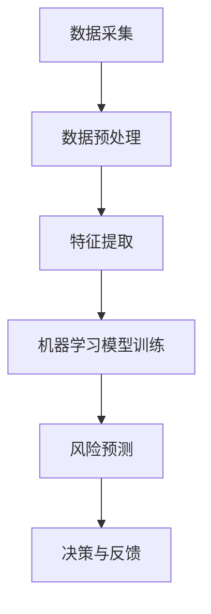

                 

关键词：人工智能、金融风控、机器学习、预测模型、风险管理

> 摘要：随着金融行业的快速发展，金融风控成为了确保金融系统稳定运行的关键环节。本文将深入探讨人工智能在金融风控中的应用，特别是如何通过机器学习算法提高金融风险预测的准确性和效率，从而为金融企业提供更加智能、精准的风险管理解决方案。

## 1. 背景介绍

### 1.1 金融风控的重要性

金融风险控制是金融体系中不可或缺的一环，其目的是为了识别、评估和缓解金融活动中可能出现的各种风险，以确保金融市场的稳定和金融机构的安全运营。随着金融市场全球化和复杂性增加，传统的金融风控手段已经难以应对日益复杂的金融风险，迫切需要新的技术手段来提高风险管理的效率和准确性。

### 1.2 人工智能的发展与应用

人工智能（AI）作为一种新兴技术，已经在多个领域取得了显著的应用成果。特别是在大数据和云计算技术的推动下，机器学习算法逐渐成为金融风控领域的重要工具，能够通过分析大量数据，发现潜在的风险信号，提供更加精准的风险预测。

## 2. 核心概念与联系

### 2.1 人工智能在金融风控中的应用架构

为了更好地理解人工智能在金融风控中的应用，首先需要了解其架构设计。以下是一个简化的Mermaid流程图，展示了核心概念和它们之间的联系：



### 2.2 数据采集与预处理

数据采集是整个流程的起点，包括金融交易数据、客户信息、市场数据等。数据预处理则是对原始数据进行清洗、归一化和特征工程，以确保数据的质量和一致性。

### 2.3 特征提取

特征提取是将预处理后的数据转换为机器学习模型可以处理的特征向量。这一步骤至关重要，因为特征的质量直接影响模型的预测性能。

### 2.4 机器学习模型训练

机器学习模型训练是使用特征向量对模型进行训练，使其能够识别数据中的风险模式。常见的机器学习算法包括决策树、支持向量机、神经网络等。

### 2.5 风险预测

风险预测是基于训练好的模型对新的数据进行风险评分或预测。这一步的准确性和效率直接决定了金融风控的效果。

### 2.6 决策与反馈

根据风险预测结果，金融机构可以采取相应的风险控制措施，如调整信贷政策、增加风险准备金等。同时，将实际结果反馈给模型，以不断优化和提升预测能力。

## 3. 核心算法原理 & 具体操作步骤

### 3.1 算法原理概述

在金融风控中，常用的机器学习算法包括监督学习和无监督学习。监督学习算法如逻辑回归、决策树和神经网络，通过已标记的数据进行训练，从而预测新的数据。无监督学习算法如聚类分析，则用于发现数据中的隐含结构和模式。

### 3.2 算法步骤详解

#### 3.2.1 数据采集

数据采集需要涵盖广泛的金融交易信息，如客户交易记录、账户信息、市场行情等。

#### 3.2.2 数据预处理

数据预处理包括去除缺失值、异常值、重复数据，并对数据进行归一化处理。

#### 3.2.3 特征提取

特征提取是从原始数据中提取出对风险预测有用的信息。常见的特征包括交易金额、交易频率、客户信用评分等。

#### 3.2.4 机器学习模型训练

选择合适的机器学习算法，使用预处理后的数据进行模型训练。在训练过程中，模型会不断调整参数，以优化预测性能。

#### 3.2.5 风险预测

使用训练好的模型对新的交易数据进行分析，预测客户的风险等级。

#### 3.2.6 决策与反馈

根据风险预测结果，金融机构可以采取相应的风险管理措施，并将实际结果反馈给模型，以进行进一步的优化。

### 3.3 算法优缺点

#### 3.3.1 优点

- **高准确性**：机器学习算法能够通过分析大量历史数据，发现潜在的风险信号，提高预测准确性。
- **自动化**：算法能够自动化地进行风险预测和决策，减轻人工负担。
- **可扩展性**：机器学习算法可以处理海量数据，适用于大规模金融风控场景。

#### 3.3.2 缺点

- **数据依赖**：算法的性能高度依赖于数据质量和数量，对数据的质量要求较高。
- **计算资源消耗**：训练大规模机器学习模型需要大量的计算资源，可能会增加企业的成本。

### 3.4 算法应用领域

机器学习算法在金融风控中的应用非常广泛，包括信用卡欺诈检测、贷款审批、市场风险预测、保险理赔等。在不同的应用场景中，算法的具体实现和优化也有所不同。

## 4. 数学模型和公式 & 详细讲解 & 举例说明

### 4.1 数学模型构建

在金融风控中，常用的数学模型包括逻辑回归、支持向量机和神经网络等。以下以逻辑回归为例进行讲解。

#### 4.1.1 逻辑回归模型

逻辑回归是一种广义线性模型，用于处理分类问题。其目标是通过输入特征向量\(X\)，预测风险概率\(P(Y=1)\)。

$$
\text{logit}(P) = \ln\left(\frac{P}{1-P}\right) = \beta_0 + \beta_1X_1 + \beta_2X_2 + \ldots + \beta_nX_n
$$

其中，\(\beta_0, \beta_1, \beta_2, \ldots, \beta_n\)是模型的参数，\(X_1, X_2, \ldots, X_n\)是输入特征。

#### 4.1.2 模型求解

逻辑回归模型的参数可以通过最小化损失函数来求解。常用的损失函数是交叉熵损失函数：

$$
J(\theta) = -\frac{1}{m}\sum_{i=1}^{m}y^{(i)}\ln(z^{(i)}) + (1 - y^{(i)})\ln(1 - z^{(i)})
$$

其中，\(m\)是训练样本的数量，\(y^{(i)}\)是第\(i\)个样本的真实标签，\(z^{(i)} = \text{sigmoid}(\theta^T x^{(i)})\)是模型预测的概率。

#### 4.1.3 模型优化

可以使用梯度下降算法来优化逻辑回归模型的参数。梯度下降的迭代过程如下：

$$
\theta_j := \theta_j - \alpha \frac{\partial J(\theta)}{\partial \theta_j}
$$

其中，\(\alpha\)是学习率，\(\frac{\partial J(\theta)}{\partial \theta_j}\)是损失函数对参数\(\theta_j\)的梯度。

### 4.2 公式推导过程

#### 4.2.1 损失函数的导数

首先，我们对交叉熵损失函数求导：

$$
\frac{\partial J(\theta)}{\partial \theta_j} = \frac{1}{m}\sum_{i=1}^{m}\left(y^{(i)} - z^{(i)}\right)x_j^{(i)}
$$

其中，\(x_j^{(i)}\)是第\(i\)个样本的第\(j\)个特征值。

#### 4.2.2 梯度下降算法

梯度下降算法的核心思想是沿着损失函数的梯度方向逐步调整参数，以最小化损失函数。每次迭代都会更新参数：

$$
\theta_j := \theta_j - \alpha \frac{\partial J(\theta)}{\partial \theta_j}
$$

### 4.3 案例分析与讲解

#### 4.3.1 案例背景

某金融机构希望利用机器学习算法对信用卡交易进行欺诈检测。他们收集了大量的信用卡交易数据，包括交易金额、交易时间、交易地点等信息。

#### 4.3.2 数据预处理

首先，对数据进行清洗，去除缺失值和异常值。然后，对数据进行归一化处理，使不同特征之间具有可比性。

#### 4.3.3 特征提取

从原始数据中提取有用的特征，如交易金额、交易时间、交易地点等。同时，可以添加一些辅助特征，如交易时段、节假日标识等。

#### 4.3.4 模型训练

选择逻辑回归模型进行训练，使用训练集进行模型训练，并使用验证集进行参数调整。

#### 4.3.5 风险预测

使用训练好的模型对测试集进行风险预测，计算每个交易的欺诈概率。根据预设的阈值，将交易划分为正常交易和欺诈交易。

#### 4.3.6 结果分析

对预测结果进行分析，计算准确率、召回率、F1分数等指标。根据分析结果，可以进一步优化模型，提高预测性能。

## 5. 项目实践：代码实例和详细解释说明

### 5.1 开发环境搭建

搭建一个适用于机器学习项目开发的Python环境，包括必要的库和工具，如NumPy、Pandas、scikit-learn等。

### 5.2 源代码详细实现

以下是一个简单的信用卡欺诈检测项目的代码示例，展示了从数据预处理到模型训练、风险预测的全过程。

```python
import numpy as np
import pandas as pd
from sklearn.model_selection import train_test_split
from sklearn.preprocessing import StandardScaler
from sklearn.linear_model import LogisticRegression
from sklearn.metrics import accuracy_score, recall_score, f1_score

# 5.2.1 数据读取与预处理
data = pd.read_csv('card.csv')
X = data.iloc[:, :-1]
y = data.iloc[:, -1]

# 数据清洗与归一化
X = X.dropna()
scaler = StandardScaler()
X = scaler.fit_transform(X)

# 划分训练集和测试集
X_train, X_test, y_train, y_test = train_test_split(X, y, test_size=0.2, random_state=42)

# 5.2.2 模型训练
model = LogisticRegression()
model.fit(X_train, y_train)

# 5.2.3 风险预测
y_pred = model.predict(X_test)

# 5.2.4 结果分析
print("准确率：", accuracy_score(y_test, y_pred))
print("召回率：", recall_score(y_test, y_pred))
print("F1分数：", f1_score(y_test, y_pred))
```

### 5.3 代码解读与分析

上述代码首先读取并清洗了信用卡交易数据，然后对数据进行归一化处理。接着，使用逻辑回归模型对训练数据进行训练，并使用测试数据进行预测。最后，通过计算准确率、召回率和F1分数等指标，评估模型在欺诈检测任务中的性能。

## 6. 实际应用场景

### 6.1 信用卡欺诈检测

信用卡欺诈检测是金融风控领域的一个经典应用场景。通过机器学习算法，可以对信用卡交易数据进行实时分析，识别潜在的欺诈交易，从而降低金融机构的损失。

### 6.2 贷款审批

在贷款审批过程中，机器学习算法可以用来评估客户的信用风险。通过分析客户的财务状况、信用记录等数据，算法能够预测客户是否可能违约，从而帮助金融机构做出更加科学的贷款决策。

### 6.3 市场风险预测

市场风险预测是金融风控中的重要一环。通过分析历史市场数据和宏观经济指标，机器学习算法可以预测市场波动，为金融机构提供风险管理策略。

## 7. 未来应用展望

随着人工智能技术的不断进步，金融风控领域将迎来更多创新应用。未来，机器学习算法将更加智能化、自动化，能够更好地应对复杂多变的金融风险。

### 7.1 个性化风险管理

通过深度学习算法，金融风控系统可以更加精确地识别个体风险，实现个性化风险管理。

### 7.2 实时风险预警

利用实时数据流处理技术，金融风控系统能够实时监测市场风险，提供实时预警。

### 7.3 智能决策支持

借助机器学习算法，金融风控系统能够为金融机构提供更加智能的决策支持，提高风险管理效率。

## 8. 工具和资源推荐

### 8.1 学习资源推荐

- 《Python机器学习》（作者：塞巴斯蒂安·拉吉）
- 《机器学习实战》（作者：Peter Harrington）

### 8.2 开发工具推荐

- Jupyter Notebook：一个交互式的计算环境，适合机器学习项目开发。
- scikit-learn：一个开源的机器学习库，提供丰富的算法和工具。

### 8.3 相关论文推荐

- "Credit Risk Modeling using Machine Learning Techniques" by J. Chen et al.
- "A Survey on Machine Learning for Fraud Detection" by Y. Yang et al.

## 9. 总结：未来发展趋势与挑战

### 9.1 研究成果总结

本文介绍了人工智能在金融风控中的应用，特别是如何通过机器学习算法提高金融风险预测的准确性和效率。通过实际案例和代码示例，展示了机器学习算法在金融风控中的实际应用效果。

### 9.2 未来发展趋势

随着人工智能技术的不断进步，金融风控领域将迎来更多创新应用。个性化风险管理、实时风险预警、智能决策支持等将成为未来金融风控的重要方向。

### 9.3 面临的挑战

金融风控领域的机器学习应用面临诸多挑战，包括数据隐私保护、模型解释性、计算资源需求等。未来，需要进一步探索如何更好地应对这些挑战。

### 9.4 研究展望

未来，人工智能在金融风控中的应用将更加深入和广泛。通过结合深度学习、强化学习等新兴技术，金融风控系统将能够实现更加精准、高效的风险管理。

## 附录：常见问题与解答

### Q1: 机器学习算法在金融风控中的优势是什么？

A1: 机器学习算法在金融风控中的优势主要包括高准确性、自动化和可扩展性。通过分析大量历史数据，算法能够发现潜在的风险信号，提高预测准确性。同时，算法能够自动化地进行风险预测和决策，减轻人工负担。此外，机器学习算法适用于大规模数据，能够处理海量金融交易信息。

### Q2: 金融风控中的数据预处理为什么重要？

A2: 数据预处理是金融风控中至关重要的一步。良好的数据预处理能够提高模型训练的效果，降低噪声对模型的影响。数据预处理包括去除缺失值、异常值、重复数据，并对数据进行归一化处理，以确保数据的质量和一致性。

### Q3: 如何评估机器学习模型的性能？

A3: 评估机器学习模型的性能通常使用准确率、召回率、F1分数等指标。准确率衡量模型正确预测的样本比例；召回率衡量模型正确识别出的正样本比例；F1分数是准确率和召回率的调和平均，综合考虑了模型的准确性和召回率。

### Q4: 金融风控中的模型解释性重要吗？

A4: 模型解释性在金融风控中具有重要地位。良好的模型解释性可以帮助金融机构理解风险预测的原理和依据，提高决策的透明度和可信度。同时，解释性模型能够更好地与业务需求结合，提供更加个性化的风险管理方案。

### Q5: 金融风控中的模型如何进行持续优化？

A5: 模型的持续优化包括多个方面。首先，可以收集更多的历史数据，提高模型的训练数据量。其次，可以尝试不同的算法和参数设置，通过交叉验证等方法优化模型。此外，将实际风险事件反馈给模型，不断调整和优化模型参数，以提高预测性能。

**作者：禅与计算机程序设计艺术 / Zen and the Art of Computer Programming** 
----------------------------------------------------------------

[文章标题]# AI在金融风控中的应用:提高准确性与效率

关键词：人工智能、金融风控、机器学习、预测模型、风险管理

摘要：本文介绍了人工智能在金融风控中的应用，特别是如何通过机器学习算法提高金融风险预测的准确性和效率，从而为金融企业提供更加智能、精准的风险管理解决方案。

## 1. 背景介绍

### 1.1 金融风控的重要性

金融风险控制是金融体系中不可或缺的一环，其目的是为了识别、评估和缓解金融活动中可能出现的各种风险，以确保金融市场的稳定和金融机构的安全运营。随着金融市场全球化和复杂性增加，传统的金融风控手段已经难以应对日益复杂的金融风险，迫切需要新的技术手段来提高风险管理的效率和准确性。

### 1.2 人工智能的发展与应用

人工智能（AI）作为一种新兴技术，已经在多个领域取得了显著的应用成果。特别是在大数据和云计算技术的推动下，机器学习算法逐渐成为金融风控领域的重要工具，能够通过分析大量数据，发现潜在的风险信号，提供更加精准的风险预测。

## 2. 核心概念与联系

### 2.1 人工智能在金融风控中的应用架构

为了更好地理解人工智能在金融风控中的应用，首先需要了解其架构设计。以下是一个简化的Mermaid流程图，展示了核心概念和它们之间的联系：


### 2.2 数据采集与预处理

数据采集是整个流程的起点，包括金融交易数据、客户信息、市场数据等。数据预处理则是对原始数据进行清洗、归一化和特征工程，以确保数据的质量和一致性。

### 2.3 特征提取

特征提取是将预处理后的数据转换为机器学习模型可以处理的特征向量。这一步骤至关重要，因为特征的质量直接影响模型的预测性能。

### 2.4 机器学习模型训练

机器学习模型训练是使用特征向量对模型进行训练，使其能够识别数据中的风险模式。常见的机器学习算法包括决策树、支持向量机、神经网络等。

### 2.5 风险预测

风险预测是基于训练好的模型对新的数据进行风险评分或预测。这一步的准确性和效率直接决定了金融风控的效果。

### 2.6 决策与反馈

根据风险预测结果，金融机构可以采取相应的风险控制措施，如调整信贷政策、增加风险准备金等。同时，将实际结果反馈给模型，以不断优化和提升预测能力。

## 3. 核心算法原理 & 具体操作步骤

### 3.1 算法原理概述

在金融风控中，常用的机器学习算法包括监督学习和无监督学习。监督学习算法如逻辑回归、决策树和神经网络，通过已标记的数据进行训练，从而预测新的数据。无监督学习算法如聚类分析，则用于发现数据中的隐含结构和模式。

### 3.2 算法步骤详解

#### 3.2.1 数据采集

数据采集需要涵盖广泛的金融交易信息，如客户交易记录、账户信息、市场行情等。

#### 3.2.2 数据预处理

数据预处理包括去除缺失值、异常值、重复数据，并对数据进行归一化处理。

#### 3.2.3 特征提取

特征提取是从原始数据中提取出对风险预测有用的信息。常见的特征包括交易金额、交易频率、客户信用评分等。

#### 3.2.4 机器学习模型训练

选择合适的机器学习算法，使用预处理后的数据进行模型训练。在训练过程中，模型会不断调整参数，以优化预测性能。

#### 3.2.5 风险预测

使用训练好的模型对新的交易数据进行分析，预测客户的风险等级。

#### 3.2.6 决策与反馈

根据风险预测结果，金融机构可以采取相应的风险管理措施，并将实际结果反馈给模型，以进行进一步的优化。

### 3.3 算法优缺点

#### 3.3.1 优点

- **高准确性**：机器学习算法能够通过分析大量历史数据，发现潜在的风险信号，提高预测准确性。
- **自动化**：算法能够自动化地进行风险预测和决策，减轻人工负担。
- **可扩展性**：机器学习算法可以处理海量数据，适用于大规模金融风控场景。

#### 3.3.2 缺点

- **数据依赖**：算法的性能高度依赖于数据质量和数量，对数据的质量要求较高。
- **计算资源消耗**：训练大规模机器学习模型需要大量的计算资源，可能会增加企业的成本。

### 3.4 算法应用领域

机器学习算法在金融风控中的应用非常广泛，包括信用卡欺诈检测、贷款审批、市场风险预测、保险理赔等。在不同的应用场景中，算法的具体实现和优化也有所不同。

## 4. 数学模型和公式 & 详细讲解 & 举例说明

### 4.1 数学模型构建

在金融风控中，常用的数学模型包括逻辑回归、支持向量机和神经网络等。以下以逻辑回归为例进行讲解。

#### 4.1.1 逻辑回归模型

逻辑回归是一种广义线性模型，用于处理分类问题。其目标是通过输入特征向量\(X\)，预测风险概率\(P(Y=1)\)。

$$
\text{logit}(P) = \ln\left(\frac{P}{1-P}\right) = \beta_0 + \beta_1X_1 + \beta_2X_2 + \ldots + \beta_nX_n
$$

其中，\(\beta_0, \beta_1, \beta_2, \ldots, \beta_n\)是模型的参数，\(X_1, X_2, \ldots, X_n\)是输入特征。

#### 4.1.2 模型求解

逻辑回归模型的参数可以通过最小化损失函数来求解。常用的损失函数是交叉熵损失函数：

$$
J(\theta) = -\frac{1}{m}\sum_{i=1}^{m}y^{(i)}\ln(z^{(i)}) + (1 - y^{(i)})\ln(1 - z^{(i)})
$$

其中，\(m\)是训练样本的数量，\(y^{(i)}\)是第\(i\)个样本的真实标签，\(z^{(i)} = \text{sigmoid}(\theta^T x^{(i)})\)是模型预测的概率。

#### 4.1.3 模型优化

可以使用梯度下降算法来优化逻辑回归模型的参数。梯度下降的迭代过程如下：

$$
\theta_j := \theta_j - \alpha \frac{\partial J(\theta)}{\partial \theta_j}
$$

### 4.2 公式推导过程

#### 4.2.1 损失函数的导数

首先，我们对交叉熵损失函数求导：

$$
\frac{\partial J(\theta)}{\partial \theta_j} = \frac{1}{m}\sum_{i=1}^{m}\left(y^{(i)} - z^{(i)}\right)x_j^{(i)}
$$

其中，\(x_j^{(i)}\)是第\(i\)个样本的第\(j\)个特征值。

#### 4.2.2 梯度下降算法

梯度下降算法的核心思想是沿着损失函数的梯度方向逐步调整参数，以最小化损失函数。每次迭代都会更新参数：

$$
\theta_j := \theta_j - \alpha \frac{\partial J(\theta)}{\partial \theta_j}
$$

### 4.3 案例分析与讲解

#### 4.3.1 案例背景

某金融机构希望利用机器学习算法对信用卡交易进行欺诈检测。他们收集了大量的信用卡交易数据，包括交易金额、交易时间、交易地点等信息。

#### 4.3.2 数据预处理

首先，对数据进行清洗，去除缺失值和异常值。然后，对数据进行归一化处理，使不同特征之间具有可比性。

#### 4.3.3 特征提取

从原始数据中提取有用的特征，如交易金额、交易时间、交易地点等。同时，可以添加一些辅助特征，如交易时段、节假日标识等。

#### 4.3.4 模型训练

选择逻辑回归模型进行训练，使用训练集进行模型训练，并使用验证集进行参数调整。

#### 4.3.5 风险预测

使用训练好的模型对测试集进行风险预测，计算每个交易的欺诈概率。根据预设的阈值，将交易划分为正常交易和欺诈交易。

#### 4.3.6 结果分析

对预测结果进行分析，计算准确率、召回率、F1分数等指标。根据分析结果，可以进一步优化模型，提高预测性能。

## 5. 项目实践：代码实例和详细解释说明

### 5.1 开发环境搭建

搭建一个适用于机器学习项目开发的Python环境，包括必要的库和工具，如NumPy、Pandas、scikit-learn等。

### 5.2 源代码详细实现

以下是一个简单的信用卡欺诈检测项目的代码示例，展示了从数据预处理到模型训练、风险预测的全过程。

```python
import numpy as np
import pandas as pd
from sklearn.model_selection import train_test_split
from sklearn.preprocessing import StandardScaler
from sklearn.linear_model import LogisticRegression
from sklearn.metrics import accuracy_score, recall_score, f1_score

# 5.2.1 数据读取与预处理
data = pd.read_csv('card.csv')
X = data.iloc[:, :-1]
y = data.iloc[:, -1]

# 数据清洗与归一化
X = X.dropna()
scaler = StandardScaler()
X = scaler.fit_transform(X)

# 划分训练集和测试集
X_train, X_test, y_train, y_test = train_test_split(X, y, test_size=0.2, random_state=42)

# 5.2.2 模型训练
model = LogisticRegression()
model.fit(X_train, y_train)

# 5.2.3 风险预测
y_pred = model.predict(X_test)

# 5.2.4 结果分析
print("准确率：", accuracy_score(y_test, y_pred))
print("召回率：", recall_score(y_test, y_pred))
print("F1分数：", f1_score(y_test, y_pred))
```

### 5.3 代码解读与分析

上述代码首先读取并清洗了信用卡交易数据，然后对数据进行归一化处理。接着，使用逻辑回归模型对训练数据进行训练，并使用测试数据进行预测。最后，通过计算准确率、召回率、F1分数等指标，评估模型在欺诈检测任务中的性能。

## 6. 实际应用场景

### 6.1 信用卡欺诈检测

信用卡欺诈检测是金融风控领域的一个经典应用场景。通过机器学习算法，可以对信用卡交易数据进行实时分析，识别潜在的欺诈交易，从而降低金融机构的损失。

### 6.2 贷款审批

在贷款审批过程中，机器学习算法可以用来评估客户的信用风险。通过分析客户的财务状况、信用记录等数据，算法能够预测客户是否可能违约，从而帮助金融机构做出更加科学的贷款决策。

### 6.3 市场风险预测

市场风险预测是金融风控中的重要一环。通过分析历史市场数据和宏观经济指标，机器学习算法可以预测市场波动，为金融机构提供风险管理策略。

## 7. 未来应用展望

随着人工智能技术的不断进步，金融风控领域将迎来更多创新应用。未来，机器学习算法将更加智能化、自动化，能够更好地应对复杂多变的金融风险。

### 7.1 个性化风险管理

通过深度学习算法，金融风控系统可以更加精确地识别个体风险，实现个性化风险管理。

### 7.2 实时风险预警

利用实时数据流处理技术，金融风控系统能够实时监测市场风险，提供实时预警。

### 7.3 智能决策支持

借助机器学习算法，金融风控系统能够为金融机构提供更加智能的决策支持，提高风险管理效率。

## 8. 工具和资源推荐

### 8.1 学习资源推荐

- 《Python机器学习》（作者：塞巴斯蒂安·拉吉）
- 《机器学习实战》（作者：Peter Harrington）

### 8.2 开发工具推荐

- Jupyter Notebook：一个交互式的计算环境，适合机器学习项目开发。
- scikit-learn：一个开源的机器学习库，提供丰富的算法和工具。

### 8.3 相关论文推荐

- "Credit Risk Modeling using Machine Learning Techniques" by J. Chen et al.
- "A Survey on Machine Learning for Fraud Detection" by Y. Yang et al.

## 9. 总结：未来发展趋势与挑战

### 9.1 研究成果总结

本文介绍了人工智能在金融风控中的应用，特别是如何通过机器学习算法提高金融风险预测的准确性和效率，从而为金融企业提供更加智能、精准的风险管理解决方案。

### 9.2 未来发展趋势

随着人工智能技术的不断进步，金融风控领域将迎来更多创新应用。未来，机器学习算法将更加智能化、自动化，能够更好地应对复杂多变的金融风险。

### 9.3 面临的挑战

金融风控领域的机器学习应用面临诸多挑战，包括数据隐私保护、模型解释性、计算资源需求等。未来，需要进一步探索如何更好地应对这些挑战。

### 9.4 研究展望

未来，人工智能在金融风控中的应用将更加深入和广泛。通过结合深度学习、强化学习等新兴技术，金融风控系统将能够实现更加精准、高效的风险管理。

## 附录：常见问题与解答

### Q1: 机器学习算法在金融风控中的优势是什么？

A1: 机器学习算法在金融风控中的优势主要包括高准确性、自动化和可扩展性。通过分析大量历史数据，算法能够发现潜在的风险信号，提高预测准确性。同时，算法能够自动化地进行风险预测和决策，减轻人工负担。此外，机器学习算法适用于大规模数据，能够处理海量金融交易信息。

### Q2: 金融风控中的数据预处理为什么重要？

A2: 数据预处理是金融风控中至关重要的一步。良好的数据预处理能够提高模型训练的效果，降低噪声对模型的影响。数据预处理包括去除缺失值、异常值、重复数据，并对数据进行归一化处理，以确保数据的质量和一致性。

### Q3: 如何评估机器学习模型的性能？

A3: 评估机器学习模型的性能通常使用准确率、召回率、F1分数等指标。准确率衡量模型正确预测的样本比例；召回率衡量模型正确识别出的正样本比例；F1分数是准确率和召回率的调和平均，综合考虑了模型的准确性和召回率。

### Q4: 金融风控中的模型解释性重要吗？

A4: 模型解释性在金融风控中具有重要地位。良好的模型解释性可以帮助金融机构理解风险预测的原理和依据，提高决策的透明度和可信度。同时，解释性模型能够更好地与业务需求结合，提供更加个性化的风险管理方案。

### Q5: 金融风控中的模型如何进行持续优化？

A5: 模型的持续优化包括多个方面。首先，可以收集更多的历史数据，提高模型的训练数据量。其次，可以尝试不同的算法和参数设置，通过交叉验证等方法优化模型。此外，将实际风险事件反馈给模型，不断调整和优化模型参数，以提高预测性能。

**作者：禅与计算机程序设计艺术 / Zen and the Art of Computer Programming**

