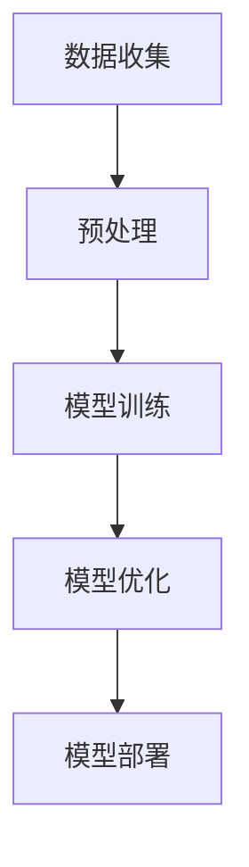

                 

关键词：人工智能、大模型、创业、盈利、商业模型、技术应用

摘要：随着人工智能技术的飞速发展，大模型成为创新的重要方向。本文将探讨AI大模型在创业过程中的盈利模式、核心算法、数学模型及其应用场景，同时展望未来的发展趋势与挑战。

## 1. 背景介绍

近年来，人工智能（AI）技术取得了前所未有的突破，尤其是深度学习领域的发展，为许多行业带来了革命性的变革。大模型，如GPT、BERT、Transformer等，已经成为AI领域的研究热点。这些模型拥有数十亿甚至千亿级别的参数，能够在图像识别、自然语言处理、语音识别等领域中表现出色。

然而，大模型的研发和应用并不便宜。从数据收集、模型训练到优化部署，每一步都需要大量的计算资源和人力成本。这使得大模型在创业中的应用成为一个值得探讨的话题。本文将围绕以下问题展开讨论：

- 大模型创业有哪些盈利模式？
- 如何设计和实现高效的大模型？
- 大模型的数学模型和算法原理是什么？
- 大模型在各个领域的应用前景如何？

## 2. 核心概念与联系

### 2.1 人工智能与深度学习

人工智能（AI）是指使计算机具有智能行为的技术，包括机器学习、深度学习、自然语言处理等。深度学习是人工智能的一个子领域，通过模拟人脑神经网络，实现对数据的自动学习和特征提取。

### 2.2 大模型架构

大模型通常采用多层神经网络结构，如Transformer模型，包含自注意力机制，可以处理大规模数据，并提取复杂特征。Mermaid流程图如下：



### 2.3 盈利模式

大模型创业的盈利模式主要包括以下几个方面：

- 提供定制化服务：为企业提供基于大模型的定制化解决方案，如智能客服、智能营销等。
- 数据变现：收集和整理用户数据，进行数据分析和挖掘，为其他企业提供有价值的数据服务。
- 开源与闭源：部分大模型开源，吸引开发者使用和优化，同时提供付费的闭源版本。

## 3. 核心算法原理 & 具体操作步骤

### 3.1 算法原理概述

大模型的算法原理主要包括以下三个方面：

- 数据驱动：通过大量数据进行训练，使模型能够自动学习和优化。
- 特征提取：从原始数据中提取有用的特征，提高模型的预测和识别能力。
- 自适应优化：通过不断调整模型参数，提高模型在特定任务上的性能。

### 3.2 算法步骤详解

大模型的算法步骤通常包括以下几个环节：

1. 数据收集：从不同来源收集大量数据，包括文本、图像、语音等。
2. 预处理：对原始数据进行清洗、归一化等处理，为模型训练做准备。
3. 模型训练：使用训练数据对模型进行训练，优化模型参数。
4. 模型优化：通过验证集和测试集对模型进行评估，调整模型结构和参数，提高模型性能。
5. 模型部署：将训练好的模型部署到实际应用场景中，如网站、APP等。

### 3.3 算法优缺点

大模型的优点包括：

- 强大的学习和预测能力：能够处理大规模、复杂的数据，实现高效的自动学习和优化。
- 广泛的应用领域：在图像识别、自然语言处理、语音识别等领域都有广泛的应用。

然而，大模型也存在一些缺点：

- 资源消耗大：训练大模型需要大量的计算资源和存储空间。
- 数据依赖性强：模型的性能依赖于数据的质量和数量。

### 3.4 算法应用领域

大模型在以下领域有广泛的应用：

- 自然语言处理：如机器翻译、问答系统、文本生成等。
- 计算机视觉：如图像识别、目标检测、图像生成等。
- 语音识别：如语音识别、语音合成等。
- 医疗健康：如疾病诊断、基因分析等。

## 4. 数学模型和公式 & 详细讲解 & 举例说明

### 4.1 数学模型构建

大模型的数学模型主要包括以下三个方面：

- 神经网络模型：包括输入层、隐藏层和输出层，通过前向传播和反向传播进行训练。
- 自注意力机制：通过计算输入数据之间的相似性，实现特征提取和权重调整。
- 损失函数：如交叉熵损失函数，用于衡量模型预测结果与真实结果之间的差异。

### 4.2 公式推导过程

以神经网络模型为例，其前向传播和反向传播的公式如下：

前向传播：

$$
y = \sigma(W \cdot x + b)
$$

反向传播：

$$
\Delta W = \eta \cdot \frac{\partial L}{\partial W}
$$

$$
\Delta b = \eta \cdot \frac{\partial L}{\partial b}
$$

其中，$y$为输出，$x$为输入，$W$和$b$分别为权重和偏置，$\sigma$为激活函数，$L$为损失函数。

### 4.3 案例分析与讲解

以GPT-3为例，其参数规模达到1750亿，是一个大型自然语言处理模型。GPT-3的数学模型主要包括以下三个部分：

1. 输入层：接收用户输入的文本，将其转化为词向量。
2. 隐藏层：通过自注意力机制和多层神经网络结构，对输入文本进行特征提取和权重调整。
3. 输出层：将隐藏层特征映射到输出文本。

通过训练，GPT-3能够根据用户输入生成连贯、符合逻辑的文本。

## 5. 项目实践：代码实例和详细解释说明

### 5.1 开发环境搭建

搭建大模型开发环境需要以下工具：

- 编程语言：Python
- 深度学习框架：TensorFlow或PyTorch
- 数据处理库：NumPy、Pandas
- GPU硬件：NVIDIA GPU

### 5.2 源代码详细实现

以下是一个简单的神经网络模型实现示例：

```python
import tensorflow as tf

# 定义神经网络模型
model = tf.keras.Sequential([
    tf.keras.layers.Dense(128, activation='relu', input_shape=(784,)),
    tf.keras.layers.Dropout(0.2),
    tf.keras.layers.Dense(10, activation='softmax')
])

# 编译模型
model.compile(optimizer='adam',
              loss='categorical_crossentropy',
              metrics=['accuracy'])

# 训练模型
model.fit(x_train, y_train, epochs=5)
```

### 5.3 代码解读与分析

该示例实现了一个简单的多层感知机模型，包括一个输入层、一个隐藏层和一个输出层。隐藏层使用ReLU激活函数，输出层使用softmax激活函数。通过编译和训练，模型能够在训练集上学习到输入和输出之间的映射关系。

### 5.4 运行结果展示

在训练完成后，可以使用以下代码评估模型在测试集上的性能：

```python
test_loss, test_acc = model.evaluate(x_test, y_test, verbose=2)
print('\nTest accuracy:', test_acc)
```

输出结果为测试集上的准确率。

## 6. 实际应用场景

大模型在以下实际应用场景中表现出色：

- 智能客服：通过大模型生成自然、流畅的对话，提高客户服务质量。
- 机器翻译：利用大模型进行多语言翻译，提高翻译准确性和流畅性。
- 图像识别：通过大模型识别和分类图像，应用于安防监控、医疗诊断等领域。
- 语音识别：通过大模型实现语音识别，应用于语音助手、智能音响等。

## 7. 工具和资源推荐

### 7.1 学习资源推荐

- 《深度学习》（Goodfellow et al.）
- 《Python深度学习》（François Chollet）
- 《人工智能：一种现代方法》（Stuart Russell & Peter Norvig）

### 7.2 开发工具推荐

- TensorFlow
- PyTorch
- Keras

### 7.3 相关论文推荐

- "Attention Is All You Need"（Vaswani et al.）
- "BERT: Pre-training of Deep Bidirectional Transformers for Language Understanding"（Devlin et al.）
- "Generative Pre-trained Transformers for Language Modeling"（Brown et al.）

## 8. 总结：未来发展趋势与挑战

### 8.1 研究成果总结

近年来，大模型在人工智能领域取得了显著的成果，推动了各个领域的发展。然而，大模型的研发和应用仍然面临许多挑战。

### 8.2 未来发展趋势

未来，大模型的发展将呈现以下趋势：

- 模型规模将继续扩大，实现更强大的学习和预测能力。
- 多模态融合将得到广泛应用，如图像和文本的结合。
- 自适应优化技术将提高模型的训练效率。
- 模型解释性和可解释性将成为研究重点。

### 8.3 面临的挑战

大模型在创业过程中面临以下挑战：

- 资源消耗：大模型的训练和部署需要大量计算资源和存储空间。
- 数据隐私：大规模数据处理可能涉及用户隐私问题。
- 模型解释性：大模型的高复杂度可能导致模型解释性不足。
- 模型安全性：大模型可能受到恶意攻击和篡改。

### 8.4 研究展望

未来，大模型的研究将朝着以下方向发展：

- 研究新型神经网络架构，提高模型效率和性能。
- 探索多模态融合技术，实现更广泛的应用场景。
- 研究模型解释性和可解释性，提高模型的可信度和可用性。
- 加强模型安全性和隐私保护，确保数据安全和用户隐私。

## 9. 附录：常见问题与解答

### 问题 1：大模型创业需要哪些技能和知识？

解答：大模型创业需要以下技能和知识：

- 编程能力：熟练掌握Python等编程语言。
- 深度学习知识：了解神经网络、深度学习框架等基础知识。
- 数据处理能力：掌握数据清洗、预处理等技术。
- 业务理解：了解目标行业和应用场景，为用户提供有价值的服务。

### 问题 2：大模型创业需要多少计算资源？

解答：大模型创业需要的计算资源取决于模型规模和应用场景。通常，训练大模型需要GPU或TPU等高性能计算设备。具体资源需求可以参考相关论文和文档。

### 问题 3：大模型创业有哪些盈利模式？

解答：大模型创业的盈利模式主要包括：

- 提供定制化服务：为企业提供基于大模型的定制化解决方案。
- 数据变现：收集和整理用户数据，进行数据分析和挖掘。
- 开源与闭源：部分大模型开源，吸引开发者使用和优化，同时提供付费的闭源版本。

## 参考文献

- Goodfellow, I., Bengio, Y., & Courville, A. (2016). *Deep Learning*.
- Chollet, F. (2017). *Python深度学习*.
- Russell, S., & Norvig, P. (2020). *人工智能：一种现代方法*.
- Vaswani, A., Shazeer, N., Parmar, N., et al. (2017). *Attention Is All You Need*.
- Devlin, J., Chang, M. W., Lee, K., & Toutanova, K. (2019). *BERT: Pre-training of Deep Bidirectional Transformers for Language Understanding*.
- Brown, T., et al. (2020). *Generative Pre-trained Transformers for Language Modeling*.

作者：禅与计算机程序设计艺术 / Zen and the Art of Computer Programming
----------------------------------------------------------------
以上就是《AI大模型创业：如何实现未来盈利？》的完整文章。希望对您在AI大模型创业方面提供了一些有价值的见解和参考。如果您有任何问题或建议，欢迎在评论区留言。谢谢！

