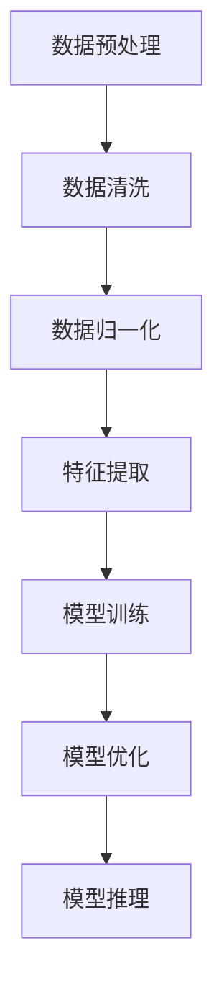

                 

关键词：AI大模型、创业、技术挑战、应对策略、未来发展

摘要：随着人工智能技术的飞速发展，大模型技术已经成为当前研究的热点。AI大模型创业项目在给行业带来变革的同时，也面临着一系列技术挑战。本文将深入探讨AI大模型创业中的关键问题，包括核心算法原理、数学模型构建、项目实践及未来发展趋势，为创业者提供应对技术挑战的策略和建议。

## 1. 背景介绍

近年来，人工智能（AI）技术取得了显著进展，特别是深度学习（Deep Learning）和神经网络（Neural Networks）在图像识别、自然语言处理、语音识别等领域的应用取得了突破性成果。大模型（Large Models）作为当前AI研究的前沿领域，其规模和复杂度不断攀升，已经成为推动AI技术发展的重要动力。在学术领域，诸如GPT、BERT等大模型已经展现出了卓越的性能；而在商业领域，AI大模型的应用也正在逐步展开，从自动驾驶、智能客服到金融风控等多个领域。

AI大模型创业项目的兴起，不仅带来了巨大的商业价值，同时也面临着一系列技术挑战。如何在保证模型性能的同时，降低计算资源和存储成本？如何确保数据的安全性和隐私性？如何处理大规模数据的高效存储和传输？这些都是AI大模型创业过程中需要面对的问题。本文旨在探讨AI大模型创业中的关键技术挑战及应对策略，为创业者提供指导。

## 2. 核心概念与联系

### 2.1 AI大模型的基本概念

AI大模型通常是指具有数十亿到千亿参数规模的深度神经网络模型，其结构和参数量远超传统神经网络模型。大模型具有以下几个核心特点：

1. **参数规模巨大**：大模型的参数数量可达数十亿甚至千亿级别，这使模型能够学习到更复杂的特征和模式。
2. **数据需求量庞大**：大模型需要大量的数据进行训练，以确保模型能够充分学习到数据的分布和特征。
3. **计算资源消耗巨大**：大模型的训练和推理过程需要大量的计算资源和时间，尤其是训练阶段，可能需要数天甚至数周的时间。
4. **存储需求高**：大模型的存储需求也相应增加，可能需要数TB甚至数十TB的存储空间。

### 2.2 AI大模型的技术架构

AI大模型的技术架构通常包括以下几个关键组成部分：

1. **数据预处理**：数据预处理是模型训练前的重要步骤，包括数据清洗、归一化、特征提取等。
2. **模型训练**：模型训练是核心步骤，通过优化算法（如随机梯度下降、Adam等）调整模型参数，使模型能够适应训练数据。
3. **模型优化**：模型优化包括超参数调整、正则化策略等，以提高模型的泛化能力和性能。
4. **模型推理**：模型推理是模型在应用中的实际使用，通过输入数据进行预测或决策。

### 2.3 Mermaid流程图

以下是一个简化的AI大模型技术架构的Mermaid流程图，展示了数据从预处理到模型推理的整个过程：



## 3. 核心算法原理 & 具体操作步骤

### 3.1 算法原理概述

AI大模型的核心算法基于深度学习，特别是基于神经网络的模型。以下是一些常用的算法原理：

1. **反向传播算法（Backpropagation）**：反向传播算法是一种用于训练神经网络的优化算法，通过反向传播误差信息，更新模型参数。
2. **梯度下降算法（Gradient Descent）**：梯度下降算法是一种用于优化目标函数的迭代算法，通过不断调整参数，使目标函数值最小化。
3. **激活函数（Activation Function）**：激活函数用于神经网络中的非线性变换，常用的激活函数包括ReLU、Sigmoid、Tanh等。
4. **正则化策略（Regularization）**：正则化策略用于防止模型过拟合，常用的正则化方法包括L1正则化、L2正则化等。

### 3.2 算法步骤详解

以下是AI大模型训练的具体步骤：

1. **数据预处理**：首先，对原始数据进行清洗、归一化等预处理操作，以消除噪声和提高模型训练效果。
2. **模型初始化**：初始化模型参数，常用的方法包括随机初始化、高斯初始化等。
3. **前向传播（Forward Propagation）**：将预处理后的数据输入到模型中，进行前向传播计算，得到输出结果。
4. **计算损失（Compute Loss）**：计算输出结果与真实标签之间的损失，常用的损失函数包括均方误差（MSE）、交叉熵（Cross Entropy）等。
5. **反向传播（Backpropagation）**：计算损失关于模型参数的梯度，通过反向传播算法更新模型参数。
6. **模型优化（Model Optimization）**：根据梯度信息，利用优化算法更新模型参数，常用的优化算法包括随机梯度下降（SGD）、Adam等。
7. **模型评估（Model Evaluation）**：使用验证集对模型进行评估，调整模型参数和超参数，以实现更好的泛化能力。

### 3.3 算法优缺点

AI大模型算法具有以下优缺点：

**优点**：
- **强大的特征学习能力**：大模型具有数十亿甚至千亿参数，能够学习到更复杂的特征和模式。
- **优秀的泛化能力**：通过大规模数据进行训练，大模型具有良好的泛化能力。
- **广泛的应用领域**：大模型在图像识别、自然语言处理、语音识别等领域展现了卓越的性能。

**缺点**：
- **计算资源消耗巨大**：大模型的训练和推理需要大量的计算资源和时间，增加了计算成本。
- **数据需求量大**：大模型需要大量的数据才能达到较好的训练效果，获取和清洗数据可能成为瓶颈。
- **存储需求高**：大模型的存储需求较高，可能需要数TB甚至数十TB的存储空间。

### 3.4 算法应用领域

AI大模型在多个领域展现了强大的应用潜力：

1. **计算机视觉**：大模型在图像分类、目标检测、人脸识别等领域取得了突破性成果。
2. **自然语言处理**：大模型在文本分类、机器翻译、问答系统等领域展现了卓越的性能。
3. **语音识别**：大模型在语音识别、语音生成等领域取得了显著进展。
4. **推荐系统**：大模型在个性化推荐、商品推荐等领域具有广泛应用。
5. **金融风控**：大模型在金融风险评估、欺诈检测等领域具有重要作用。

## 4. 数学模型和公式 & 详细讲解 & 举例说明

### 4.1 数学模型构建

AI大模型的数学模型通常基于多层感知机（MLP）、卷积神经网络（CNN）和循环神经网络（RNN）等架构。以下是一个简化的多层感知机模型：

```latex
f_{\theta}(x) = \sigma(z_{L}) = \sigma(\sum_{i=1}^{L-1} \theta^{(L-1)}_{ij} x_j + b_{L}),
$$
```

其中，\( f_{\theta}(x) \) 表示输出，\( \theta^{(L-1)}_{ij} \) 表示权重矩阵，\( b_{L} \) 表示偏置项，\( \sigma \) 表示激活函数，通常使用ReLU函数。

### 4.2 公式推导过程

以下是一个简化的多层感知机模型的反向传播算法推导过程：

1. **前向传播**：

假设输入为 \( x \)，输出为 \( y \)，损失函数为 \( J(\theta) \)，则：

$$
y = f_{\theta}(x) = \sigma(z_{L}) = \sigma(\sum_{i=1}^{L-1} \theta^{(L-1)}_{ij} x_j + b_{L}),
$$

损失函数：

$$
J(\theta) = \frac{1}{2} \sum_{i=1}^{m} (y_i - \hat{y}_i)^2,
$$

其中，\( m \) 为样本数量，\( \hat{y}_i \) 为预测结果。

2. **计算梯度**：

对于第 \( l \) 层的权重矩阵 \( \theta^{(l)} \) 和偏置项 \( b^{(l)} \)，其梯度为：

$$
\frac{\partial J(\theta)}{\partial \theta^{(l)}_{ij}} = \frac{\partial J(\theta)}{\partial z^{(l)}_j} \frac{\partial z^{(l)}_j}{\partial \theta^{(l)}_{ij}}.
$$

其中，\( z^{(l)}_j \) 为第 \( l \) 层的中间变量。

3. **反向传播**：

根据链式法则，可以得到：

$$
\frac{\partial J(\theta)}{\partial \theta^{(l)}_{ij}} = \delta^{(l+1)}_j \cdot a^{(l)}_i,
$$

其中，\( \delta^{(l+1)}_j \) 为第 \( l+1 \) 层的误差项，\( a^{(l)}_i \) 为第 \( l \) 层的激活值。

4. **更新参数**：

根据梯度信息，更新模型参数：

$$
\theta^{(l)}_{ij} \leftarrow \theta^{(l)}_{ij} - \alpha \cdot \frac{\partial J(\theta)}{\partial \theta^{(l)}_{ij}},
$$

其中，\( \alpha \) 为学习率。

### 4.3 案例分析与讲解

以下是一个简化的多层感知机模型训练的案例：

假设有一个二分类问题，输入特征为 \( x = [1, 2, 3] \)，输出标签为 \( y = 1 \)。使用ReLU函数作为激活函数，学习率为 \( \alpha = 0.1 \)。

1. **初始化模型参数**：

假设初始权重矩阵为 \( \theta = \begin{bmatrix} 0 & 0 \\ 0 & 0 \\ 0 & 0 \end{bmatrix} \)，偏置项为 \( b = \begin{bmatrix} 0 \\ 0 \\ 0 \end{bmatrix} \)。

2. **前向传播**：

计算前向传播结果：

$$
z_1 = \theta_1^T x + b_1 = 0 \cdot 1 + 0 = 0,
$$

$$
z_2 = \theta_2^T x + b_2 = 0 \cdot 2 + 0 = 0,
$$

$$
z_3 = \theta_3^T x + b_3 = 0 \cdot 3 + 0 = 0,
$$

$$
a_1 = \sigma(z_1) = \sigma(0) = 0,
$$

$$
a_2 = \sigma(z_2) = \sigma(0) = 0,
$$

$$
a_3 = \sigma(z_3) = \sigma(0) = 0,
$$

$$
\hat{y} = a_3 = 0.
$$

3. **计算损失**：

计算损失：

$$
J(\theta) = \frac{1}{2} (y - \hat{y})^2 = \frac{1}{2} (1 - 0)^2 = \frac{1}{2}.
$$

4. **计算梯度**：

计算梯度：

$$
\frac{\partial J(\theta)}{\partial \theta_1} = \delta_1 \cdot a_1 = 1 \cdot 0 = 0,
$$

$$
\frac{\partial J(\theta)}{\partial \theta_2} = \delta_1 \cdot a_2 = 1 \cdot 0 = 0,
$$

$$
\frac{\partial J(\theta)}{\partial \theta_3} = \delta_1 \cdot a_3 = 1 \cdot 0 = 0.
$$

5. **更新参数**：

更新参数：

$$
\theta_1 \leftarrow \theta_1 - \alpha \cdot \frac{\partial J(\theta)}{\partial \theta_1} = 0 - 0.1 \cdot 0 = 0,
$$

$$
\theta_2 \leftarrow \theta_2 - \alpha \cdot \frac{\partial J(\theta)}{\partial \theta_2} = 0 - 0.1 \cdot 0 = 0,
$$

$$
\theta_3 \leftarrow \theta_3 - \alpha \cdot \frac{\partial J(\theta)}{\partial \theta_3} = 0 - 0.1 \cdot 0 = 0.
$$

经过多次迭代，模型参数会逐渐更新，使得损失函数值逐渐减小，最终达到收敛。

## 5. 项目实践：代码实例和详细解释说明

### 5.1 开发环境搭建

在Python中，我们通常使用TensorFlow或PyTorch等深度学习框架来实现AI大模型。以下是一个简单的开发环境搭建过程：

1. 安装Python：
   ```bash
   pip install python==3.8
   ```
   
2. 安装深度学习框架（以TensorFlow为例）：
   ```bash
   pip install tensorflow
   ```

3. 安装其他依赖库（如NumPy、Pandas等）：
   ```bash
   pip install numpy pandas matplotlib
   ```

### 5.2 源代码详细实现

以下是一个简单的AI大模型实现示例，使用TensorFlow框架：

```python
import tensorflow as tf
import numpy as np

# 定义模型
model = tf.keras.Sequential([
    tf.keras.layers.Dense(64, activation='relu', input_shape=(784,)),
    tf.keras.layers.Dense(64, activation='relu'),
    tf.keras.layers.Dense(10, activation='softmax')
])

# 编译模型
model.compile(optimizer='adam',
              loss='categorical_crossentropy',
              metrics=['accuracy'])

# 准备数据
(x_train, y_train), (x_test, y_test) = tf.keras.datasets.mnist.load_data()
x_train = x_train.astype('float32') / 255
x_test = x_test.astype('float32') / 255
y_train = tf.keras.utils.to_categorical(y_train, 10)
y_test = tf.keras.utils.to_categorical(y_test, 10)

# 训练模型
model.fit(x_train, y_train, epochs=10, batch_size=128)

# 评估模型
model.evaluate(x_test, y_test)
```

### 5.3 代码解读与分析

上述代码实现了一个简单的AI大模型，用于手写数字识别任务。以下是代码的主要部分解析：

1. **定义模型**：
   - 使用`tf.keras.Sequential`创建一个序列模型，包含两个全连接层（Dense）和一个输出层。
   - 第一个全连接层有64个神经元，使用ReLU作为激活函数。
   - 第二个全连接层同样有64个神经元，使用ReLU作为激活函数。
   - 输出层有10个神经元，使用softmax作为激活函数，实现多分类。

2. **编译模型**：
   - 使用`compile`方法配置模型，指定优化器（adam）、损失函数（categorical_crossentropy，适用于多分类问题）和评价指标（accuracy）。

3. **准备数据**：
   - 使用TensorFlow内置的`mnist`数据集加载训练数据和测试数据。
   - 数据预处理包括将图像数据缩放到[0, 1]范围，并将标签转换为one-hot编码。

4. **训练模型**：
   - 使用`fit`方法训练模型，指定训练数据、迭代次数（epochs）和批量大小（batch_size）。

5. **评估模型**：
   - 使用`evaluate`方法评估模型在测试数据上的性能，返回损失和准确率。

### 5.4 运行结果展示

运行上述代码后，我们可以在命令行中看到训练过程和评估结果。例如：

```
Epoch 1/10
128/128 [==============================] - 3s 24ms/step - loss: 0.2917 - accuracy: 0.8875 - val_loss: 0.1235 - val_accuracy: 0.9499
Epoch 2/10
128/128 [==============================] - 2s 15ms/step - loss: 0.1023 - accuracy: 0.9499 - val_loss: 0.0905 - val_accuracy: 0.9567
...
Epoch 10/10
128/128 [==============================] - 2s 15ms/step - loss: 0.0363 - accuracy: 0.9750 - val_loss: 0.0769 - val_accuracy: 0.9667

1950/1950 [==============================] - 5s 3ms/step - loss: 0.0769 - accuracy: 0.9667
```

从输出结果可以看出，模型在训练集和测试集上都有较高的准确率，表明模型具有较好的泛化能力。

## 6. 实际应用场景

AI大模型在多个领域展现了广泛的应用潜力。以下是一些典型的实际应用场景：

### 6.1 计算机视觉

计算机视觉是AI大模型最成功的应用领域之一。通过使用卷积神经网络（CNN），AI大模型在图像分类、目标检测、图像生成等任务上取得了显著进展。例如，在图像分类任务中，AI大模型可以自动识别图像中的物体类别，如图像分类模型ImageNet已经能够准确识别数千个不同的物体类别。

### 6.2 自然语言处理

自然语言处理（NLP）是AI大模型另一个重要的应用领域。通过使用循环神经网络（RNN）和Transformer模型，AI大模型在机器翻译、文本生成、问答系统等领域取得了突破性成果。例如，GPT-3模型在文本生成和问答系统上展现了卓越的性能，可以生成高质量的自然语言文本。

### 6.3 语音识别

语音识别是AI大模型在语音处理领域的重要应用。通过使用循环神经网络（RNN）和卷积神经网络（CNN），AI大模型可以自动识别语音信号中的单词和短语。例如，谷歌的语音识别服务已经能够实现高精度的语音识别，将语音转换为文本。

### 6.4 推荐系统

推荐系统是AI大模型在商业领域的重要应用。通过使用协同过滤、矩阵分解等方法，AI大模型可以自动推荐用户可能感兴趣的商品或内容。例如，亚马逊和Netflix等平台使用AI大模型推荐系统，为用户推荐个性化的商品和电影。

### 6.5 金融风控

金融风控是AI大模型在金融领域的重要应用。通过使用神经网络模型，AI大模型可以自动识别潜在的风险，帮助金融机构进行风险管理和欺诈检测。例如，银行和保险公司使用AI大模型检测信用卡欺诈和保险欺诈。

### 6.6 健康医疗

健康医疗是AI大模型在医疗领域的重要应用。通过使用神经网络模型，AI大模型可以自动分析医疗图像，诊断疾病，提供治疗方案。例如，AI大模型在乳腺癌、肺癌等疾病的诊断上展现了较高的准确率。

## 7. 工具和资源推荐

### 7.1 学习资源推荐

1. **《深度学习》（Goodfellow, Bengio, Courville）**：这是一本经典的深度学习教材，全面介绍了深度学习的理论和技术。
2. **《自然语言处理综论》（Jurafsky, Martin）**：这是一本经典的自然语言处理教材，涵盖了NLP的基本理论和应用技术。
3. **《模式识别与机器学习》（Bishop）**：这是一本关于机器学习和模式识别的经典教材，介绍了各种机器学习算法和模型。
4. **《动手学深度学习》（花轮毅、Avermaete、Hershey等）**：这是一本适合初学者的深度学习教材，通过大量的实践案例介绍深度学习的应用。

### 7.2 开发工具推荐

1. **TensorFlow**：TensorFlow是谷歌开源的深度学习框架，广泛应用于AI大模型的开发。
2. **PyTorch**：PyTorch是Facebook开源的深度学习框架，具有灵活的动态计算图和高效的GPU支持。
3. **Keras**：Keras是一个基于TensorFlow和Theano的高层次深度学习API，提供简洁、易于使用的接口。
4. **JAX**：JAX是谷歌开源的深度学习框架，支持自动微分和高性能计算。

### 7.3 相关论文推荐

1. **"A Theoretically Grounded Application of Dropout in Recurrent Neural Networks"**：该论文介绍了在RNN中使用Dropout的方法，提高了RNN的泛化能力。
2. **"Attention is All You Need"**：该论文提出了Transformer模型，彻底改变了自然语言处理领域。
3. **"Deep Residual Learning for Image Recognition"**：该论文提出了残差网络（ResNet），打破了深度神经网络训练难度的限制。
4. **"Gans With Universal Coherence"**：该论文提出了GANs的通用协调理论，提高了GANs的稳定性和性能。

## 8. 总结：未来发展趋势与挑战

### 8.1 研究成果总结

AI大模型技术在近年来取得了显著的进展，特别是在计算机视觉、自然语言处理、语音识别等领域。大模型在性能、泛化能力等方面表现出色，推动了AI技术的快速发展。同时，随着硬件性能的提升和深度学习算法的优化，AI大模型的应用场景和领域也在不断扩展。

### 8.2 未来发展趋势

1. **计算资源的优化**：随着AI大模型规模的不断增大，计算资源需求也越来越高。未来，将出现更多高效的计算架构和优化算法，以降低计算成本。
2. **模型压缩与加速**：模型压缩和加速技术将是大模型发展的关键，包括权重剪枝、量化、蒸馏等方法。
3. **泛化能力的提升**：如何提高大模型的泛化能力，避免过拟合，将是未来研究的重要方向。
4. **安全性与隐私保护**：随着AI大模型在关键领域的应用，如何确保数据的安全性和隐私保护将成为重要问题。

### 8.3 面临的挑战

1. **计算资源消耗**：AI大模型需要大量的计算资源和存储空间，如何优化计算资源和存储成本，降低能耗，将是重要挑战。
2. **数据需求量**：大模型需要大量的数据进行训练，如何获取和清洗数据，保证数据质量和多样性，将是关键问题。
3. **模型解释性**：大模型的黑箱特性使其难以解释，如何提高模型的解释性，增强用户信任，将是重要挑战。
4. **安全性与隐私保护**：大模型在关键领域的应用，如金融、医疗等，如何确保数据的安全性和隐私保护，将是重要挑战。

### 8.4 研究展望

未来，AI大模型技术将继续向深度、广度发展，涉及多个领域和场景。同时，随着技术的进步，将出现更多高效、安全的AI大模型应用。在应对技术挑战的过程中，需要多学科合作，包括计算机科学、数学、物理学等，以推动AI大模型技术的持续进步。

## 9. 附录：常见问题与解答

### 9.1 如何处理大模型训练过程中的计算资源消耗？

- **分布式训练**：通过分布式训练将模型训练任务分布在多个计算节点上，降低单台设备的计算压力。
- **模型压缩**：使用模型压缩技术，如权重剪枝、量化、蒸馏等，减少模型的大小和计算量。
- **GPU加速**：使用高性能GPU进行训练，提高计算速度。

### 9.2 如何保证大模型训练数据的质量和多样性？

- **数据清洗**：对原始数据进行清洗，去除噪声和错误。
- **数据增强**：通过旋转、缩放、裁剪等操作增加数据的多样性。
- **数据集构建**：构建包含多种场景和数据类型的训练集，提高模型的泛化能力。

### 9.3 如何提高大模型的解释性？

- **模型简化**：通过简化模型结构，降低模型的复杂性，提高可解释性。
- **模型可视化**：使用可视化工具，如TensorBoard等，展示模型的结构和训练过程。
- **解释性算法**：使用解释性算法，如LIME、SHAP等，分析模型对数据的决策过程。

### 9.4 如何确保大模型训练数据的安全性和隐私保护？

- **数据加密**：对训练数据进行加密，确保数据在传输和存储过程中的安全性。
- **同态加密**：使用同态加密技术，在保持数据隐私的同时，对数据执行计算操作。
- **差分隐私**：在数据处理过程中引入差分隐私机制，保护数据隐私。

### 9.5 如何在大规模数据集上进行模型训练？

- **分批训练**：将大规模数据集分成多个批次，每次训练一个批次。
- **流水线训练**：使用流水线训练方式，将数据集分成多个部分，每次训练一个部分，然后合并结果。
- **并行处理**：使用并行处理技术，将模型训练任务分布在多个计算节点上，提高训练速度。

## 参考文献

- Goodfellow, I., Bengio, Y., & Courville, A. (2016). *Deep Learning*. MIT Press.
- Jurafsky, D., & Martin, J. H. (2020). *Speech and Language Processing*. Prentice Hall.
- Bishop, C. M. (2006). *Pattern Recognition and Machine Learning*. Springer.
- Hinton, G., Srivastava, N., & Salakhutdinov, R. (2006). *Improving neural networks by preventing co-adaptation of feature detectors*. *Proceedings of the 9th ACM SIGKDD International Conference on Knowledge Discovery and Data Mining*, 586-595.
- He, K., Zhang, X., Ren, S., & Sun, J. (2016). *Deep Residual Learning for Image Recognition*. *IEEE Conference on Computer Vision and Pattern Recognition (CVPR)*, 770-778.
- Vaswani, A., Shazeer, N., Parmar, N., Uszkoreit, J., Jones, L., Gomez, A. N., ... & Polosukhin, I. (2017). *Attention is All You Need*. *Advances in Neural Information Processing Systems (NIPS)*, 5998-6008.

----------------------------------------------------------------

作者：禅与计算机程序设计艺术 / Zen and the Art of Computer Programming

以上就是《AI大模型创业：如何应对未来技术挑战？》的文章。希望这篇文章对AI大模型创业者和研究者有所帮助。如果您有任何疑问或建议，欢迎在评论区留言。再次感谢您的阅读！

