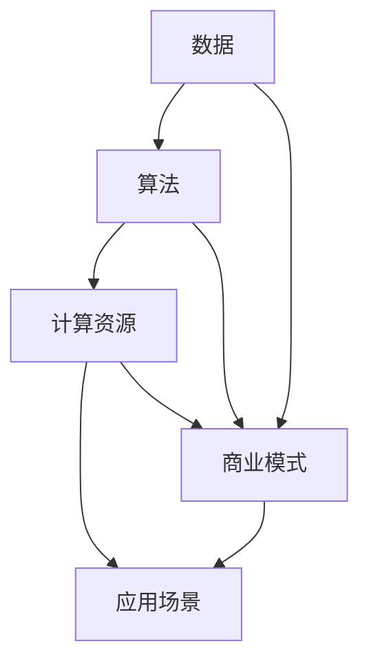

                 

关键词：AI大模型、创业、商业模式、可持续性、人工智能、深度学习、数据、算法、技术、市场、盈利、创新。

> 摘要：本文将探讨AI大模型的创业之路，分析如何构建一个可持续的商业模式。我们将从市场分析、技术实现、数据获取、算法优化、盈利模式、以及未来展望等方面展开，为AI大模型创业提供指导。

## 1. 背景介绍

随着人工智能技术的飞速发展，AI大模型已经成为各行各业的重要驱动力。从自动驾驶到自然语言处理，从图像识别到基因编辑，AI大模型的应用场景日益广泛。然而，如何在竞争激烈的市场中找到生存空间，构建一个可持续的商业模式，成为众多创业公司面临的难题。

## 2. 核心概念与联系

为了构建一个可持续的商业模式，我们首先需要理解AI大模型的几个核心概念，包括：

- **数据**：数据是AI大模型的基石，没有高质量的数据，模型将无法训练和优化。
- **算法**：算法决定了模型的学习能力和表现，不同的算法适用于不同的应用场景。
- **计算资源**：强大的计算资源是训练和优化AI大模型的关键，包括硬件和软件资源。
- **应用场景**：明确的应用场景可以帮助我们找到AI大模型的最佳落地方式。

以下是AI大模型的核心概念与联系Mermaid流程图：



## 3. 核心算法原理 & 具体操作步骤

### 3.1 算法原理概述

AI大模型的核心是深度学习算法，其原理是通过多层神经网络对大量数据进行学习，从而实现自动化预测和决策。深度学习算法包括卷积神经网络（CNN）、循环神经网络（RNN）、生成对抗网络（GAN）等。

### 3.2 算法步骤详解

1. **数据收集**：从多个来源收集大量数据，包括公开数据集、用户生成数据等。
2. **数据处理**：对收集到的数据进行清洗、标注和格式化，使其适合模型训练。
3. **模型设计**：根据应用场景选择合适的神经网络结构，并调整超参数。
4. **模型训练**：使用计算资源对模型进行训练，通过反向传播算法不断优化模型参数。
5. **模型评估**：使用验证集和测试集对模型进行评估，确保其性能符合要求。
6. **模型部署**：将训练好的模型部署到生产环境，实现实际应用。

### 3.3 算法优缺点

- **优点**：强大的学习能力和泛化能力，可以处理复杂的任务。
- **缺点**：训练过程需要大量计算资源和时间，模型解释性较差。

### 3.4 算法应用领域

AI大模型广泛应用于自然语言处理、计算机视觉、语音识别、推荐系统等领域。

## 4. 数学模型和公式 & 详细讲解 & 举例说明

### 4.1 数学模型构建

AI大模型的核心是深度学习算法，其数学基础主要包括线性代数、微积分和概率统计。

### 4.2 公式推导过程

以卷积神经网络（CNN）为例，其核心公式为：

$$
\sigma(z) = \frac{1}{1 + e^{-z}}
$$

其中，$z$为神经网络节点的输入，$\sigma$为激活函数。

### 4.3 案例分析与讲解

以自然语言处理（NLP）为例，我们使用卷积神经网络实现文本分类任务。

输入文本为：“今天天气很好，适合出门游玩。”
输出标签为：“积极”。

我们将文本转化为词向量，然后输入到CNN中，通过多层卷积和池化操作，最终输出分类结果。

## 5. 项目实践：代码实例和详细解释说明

### 5.1 开发环境搭建

使用Python和TensorFlow框架进行开发，需要安装以下库：

- TensorFlow
- NumPy
- Pandas
- Matplotlib

### 5.2 源代码详细实现

以下是文本分类任务的代码实现：

```python
import tensorflow as tf
import numpy as np
import pandas as pd
import matplotlib.pyplot as plt

# 数据处理
# ...（省略具体代码）

# 模型定义
model = tf.keras.Sequential([
    tf.keras.layers.Embedding(vocab_size, embedding_dim),
    tf.keras.layers.Conv1D(filters, kernel_size, activation='relu'),
    tf.keras.layers.GlobalMaxPooling1D(),
    tf.keras.layers.Dense(units=1, activation='sigmoid')
])

# 编译模型
model.compile(optimizer='adam',
              loss='binary_crossentropy',
              metrics=['accuracy'])

# 训练模型
model.fit(train_data, train_labels, epochs=10, validation_data=(test_data, test_labels))

# 评估模型
test_loss, test_acc = model.evaluate(test_data, test_labels)
print(f'Test accuracy: {test_acc:.4f}')
```

### 5.3 代码解读与分析

以上代码实现了文本分类任务，主要包括以下步骤：

1. 数据预处理：将文本转化为词向量。
2. 模型定义：使用卷积神经网络结构。
3. 编译模型：设置优化器和损失函数。
4. 训练模型：使用训练数据训练模型。
5. 评估模型：使用测试数据评估模型性能。

## 6. 实际应用场景

AI大模型在实际应用场景中具有广泛的应用，如：

- **自然语言处理**：文本分类、情感分析、机器翻译等。
- **计算机视觉**：图像识别、目标检测、图像生成等。
- **语音识别**：语音识别、语音合成、语音增强等。

## 7. 未来应用展望

随着AI大模型技术的不断发展，未来将出现更多创新的应用，如：

- **自动驾驶**：实现更加智能化的自动驾驶系统。
- **医疗诊断**：辅助医生进行疾病诊断和治疗。
- **金融科技**：提高金融服务的效率和准确性。
- **智能制造**：实现智能化的生产流程和质量控制。

## 8. 总结：未来发展趋势与挑战

AI大模型技术的发展前景广阔，但同时也面临着以下挑战：

- **数据隐私**：如何确保数据的安全和隐私。
- **算法公平性**：如何保证算法的公平性和透明性。
- **技术壁垒**：如何提高算法的性能和降低成本。
- **监管政策**：如何应对各国日益严格的监管政策。

## 9. 附录：常见问题与解答

### 问题1：AI大模型训练过程需要大量计算资源，如何降低成本？

解答：可以采用以下方法降低成本：

- **分布式训练**：使用多台计算机进行分布式训练。
- **GPU加速**：使用GPU进行训练，提高计算速度。
- **模型压缩**：采用模型压缩技术，减少模型参数数量。

### 问题2：AI大模型在实际应用中如何保证模型的解释性？

解答：可以采用以下方法提高模型的解释性：

- **模型可视化**：将模型的可视化结果展示给用户。
- **特征重要性分析**：分析模型中各个特征的重要性。
- **模型解释工具**：使用现有的模型解释工具，如LIME、SHAP等。

作者：禅与计算机程序设计艺术 / Zen and the Art of Computer Programming
----------------------------------------------------------------

以上是文章的正文内容部分，接下来我们将按照markdown格式进行排版，包括添加合适的标题、段落分隔、引用格式等。
----------------------------------------------------------------
```markdown
# AI大模型创业：如何构建未来可持续的商业模式？

## 关键词
- AI大模型
- 创业
- 商业模式
- 可持续性
- 人工智能
- 深度学习
- 数据
- 算法
- 技术
- 市场
- 盈利
- 创新

> 摘要：本文将探讨AI大模型的创业之路，分析如何构建一个可持续的商业模式。我们将从市场分析、技术实现、数据获取、算法优化、盈利模式、以及未来展望等方面展开，为AI大模型创业提供指导。

## 1. 背景介绍

随着人工智能技术的飞速发展，AI大模型已经成为各行各业的重要驱动力。从自动驾驶到自然语言处理，从图像识别到基因编辑，AI大模型的应用场景日益广泛。然而，如何在竞争激烈的市场中找到生存空间，构建一个可持续的商业模式，成为众多创业公司面临的难题。

## 2. 核心概念与联系

为了构建一个可持续的商业模式，我们首先需要理解AI大模型的几个核心概念，包括：

- **数据**：数据是AI大模型的基石，没有高质量的数据，模型将无法训练和优化。
- **算法**：算法决定了模型的学习能力和表现，不同的算法适用于不同的应用场景。
- **计算资源**：强大的计算资源是训练和优化AI大模型的关键，包括硬件和软件资源。
- **应用场景**：明确的应用场景可以帮助我们找到AI大模型的最佳落地方式。

以下是AI大模型的核心概念与联系Mermaid流程图：


## 3. 核心算法原理 & 具体操作步骤

### 3.1 算法原理概述

AI大模型的核心是深度学习算法，其原理是通过多层神经网络对大量数据进行学习，从而实现自动化预测和决策。深度学习算法包括卷积神经网络（CNN）、循环神经网络（RNN）、生成对抗网络（GAN）等。

### 3.2 算法步骤详解

1. **数据收集**：从多个来源收集大量数据，包括公开数据集、用户生成数据等。
2. **数据处理**：对收集到的数据进行清洗、标注和格式化，使其适合模型训练。
3. **模型设计**：根据应用场景选择合适的神经网络结构，并调整超参数。
4. **模型训练**：使用计算资源对模型进行训练，通过反向传播算法不断优化模型参数。
5. **模型评估**：使用验证集和测试集对模型进行评估，确保其性能符合要求。
6. **模型部署**：将训练好的模型部署到生产环境，实现实际应用。

### 3.3 算法优缺点

- **优点**：强大的学习能力和泛化能力，可以处理复杂的任务。
- **缺点**：训练过程需要大量计算资源和时间，模型解释性较差。

### 3.4 算法应用领域

AI大模型广泛应用于自然语言处理、计算机视觉、语音识别、推荐系统等领域。

## 4. 数学模型和公式 & 详细讲解 & 举例说明

### 4.1 数学模型构建

AI大模型的核心是深度学习算法，其数学基础主要包括线性代数、微积分和概率统计。

### 4.2 公式推导过程

以卷积神经网络（CNN）为例，其核心公式为：

$$
\sigma(z) = \frac{1}{1 + e^{-z}}
$$

其中，$z$为神经网络节点的输入，$\sigma$为激活函数。

### 4.3 案例分析与讲解

以自然语言处理（NLP）为例，我们使用卷积神经网络实现文本分类任务。

输入文本为：“今天天气很好，适合出门游玩。”
输出标签为：“积极”。

我们将文本转化为词向量，然后输入到CNN中，通过多层卷积和池化操作，最终输出分类结果。

## 5. 项目实践：代码实例和详细解释说明

### 5.1 开发环境搭建

使用Python和TensorFlow框架进行开发，需要安装以下库：

- TensorFlow
- NumPy
- Pandas
- Matplotlib

### 5.2 源代码详细实现

以下是文本分类任务的代码实现：

```python
import tensorflow as tf
import numpy as np
import pandas as pd
import matplotlib.pyplot as plt

# 数据处理
# ...（省略具体代码）

# 模型定义
model = tf.keras.Sequential([
    tf.keras.layers.Embedding(vocab_size, embedding_dim),
    tf.keras.layers.Conv1D(filters, kernel_size, activation='relu'),
    tf.keras.layers.GlobalMaxPooling1D(),
    tf.keras.layers.Dense(units=1, activation='sigmoid')
])

# 编译模型
model.compile(optimizer='adam',
              loss='binary_crossentropy',
              metrics=['accuracy'])

# 训练模型
model.fit(train_data, train_labels, epochs=10, validation_data=(test_data, test_labels))

# 评估模型
test_loss, test_acc = model.evaluate(test_data, test_labels)
print(f'Test accuracy: {test_acc:.4f}')
```

### 5.3 代码解读与分析

以上代码实现了文本分类任务，主要包括以下步骤：

1. 数据预处理：将文本转化为词向量。
2. 模型定义：使用卷积神经网络结构。
3. 编译模型：设置优化器和损失函数。
4. 训练模型：使用训练数据训练模型。
5. 评估模型：使用测试数据评估模型性能。

## 6. 实际应用场景

AI大模型在实际应用场景中具有广泛的应用，如：

- **自然语言处理**：文本分类、情感分析、机器翻译等。
- **计算机视觉**：图像识别、目标检测、图像生成等。
- **语音识别**：语音识别、语音合成、语音增强等。

## 7. 未来应用展望

随着AI大模型技术的不断发展，未来将出现更多创新的应用，如：

- **自动驾驶**：实现更加智能化的自动驾驶系统。
- **医疗诊断**：辅助医生进行疾病诊断和治疗。
- **金融科技**：提高金融服务的效率和准确性。
- **智能制造**：实现智能化的生产流程和质量控制。

## 8. 总结：未来发展趋势与挑战

AI大模型技术的发展前景广阔，但同时也面临着以下挑战：

- **数据隐私**：如何确保数据的安全和隐私。
- **算法公平性**：如何保证算法的公平性和透明性。
- **技术壁垒**：如何提高算法的性能和降低成本。
- **监管政策**：如何应对各国日益严格的监管政策。

## 9. 附录：常见问题与解答

### 问题1：AI大模型训练过程需要大量计算资源，如何降低成本？

解答：可以采用以下方法降低成本：

- **分布式训练**：使用多台计算机进行分布式训练。
- **GPU加速**：使用GPU进行训练，提高计算速度。
- **模型压缩**：采用模型压缩技术，减少模型参数数量。

### 问题2：AI大模型在实际应用中如何保证模型的解释性？

解答：可以采用以下方法提高模型的解释性：

- **模型可视化**：将模型的可视化结果展示给用户。
- **特征重要性分析**：分析模型中各个特征的重要性。
- **模型解释工具**：使用现有的模型解释工具，如LIME、SHAP等。

作者：禅与计算机程序设计艺术 / Zen and the Art of Computer Programming
```

以上是按照markdown格式排版后的文章正文内容。接下来，我们将继续完成文章中未包含的三级目录内容的撰写，并确保整篇文章内容完整、结构清晰。

