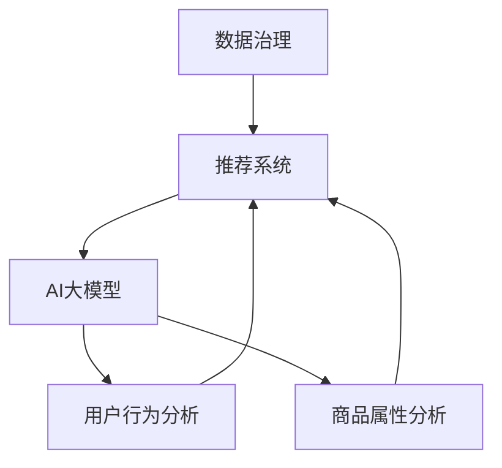

                 

关键词：AI大模型，电商搜索推荐，数据治理，工具选型，算法原理，数学模型，项目实践，应用场景，未来展望

> 摘要：本文将探讨如何利用AI大模型来优化电商搜索推荐业务中的数据治理工具选型，分析相关算法原理、数学模型以及项目实践，并展望未来的发展趋势与挑战。作者：禅与计算机程序设计艺术 / Zen and the Art of Computer Programming

## 1. 背景介绍

在电商行业，搜索推荐系统扮演着至关重要的角色。它不仅影响用户的购物体验，还能直接关系到商家的销售业绩。随着电商平台的不断壮大和用户数据的日益增多，如何有效地治理这些数据以提升推荐系统的性能，成为了一个亟待解决的问题。

传统的数据治理方法往往依赖于规则驱动和手动操作，无法很好地应对海量数据的复杂性。近年来，随着AI大模型的发展，利用深度学习等技术来优化搜索推荐系统的数据治理，成为一种新兴的趋势。本文将围绕这一主题展开讨论。

## 2. 核心概念与联系

在深入探讨AI大模型在数据治理中的应用之前，我们需要了解一些核心概念，包括数据治理、推荐系统以及AI大模型的工作原理。以下是一个简化的Mermaid流程图，用于描述这些概念之间的联系。



### 2.1 数据治理

数据治理是指对数据的定义、管理、保护和使用进行系统化的方法。其目标包括确保数据质量、安全性和合规性，以及提高数据利用率。

### 2.2 推荐系统

推荐系统通过分析用户的历史行为和偏好，为用户推荐相关的商品或服务。它通常包括以下几个关键组件：数据收集、数据预处理、特征工程、模型训练和推荐策略。

### 2.3 AI大模型

AI大模型是指使用深度学习技术训练出的大规模神经网络模型。这些模型具有强大的数据处理和模式识别能力，可以用于用户行为分析、商品属性分析等任务。

### 2.4 用户行为分析

用户行为分析涉及对用户在平台上的各种操作（如点击、购买、浏览等）进行监控和分析，以了解用户偏好和行为模式。

### 2.5 商品属性分析

商品属性分析则是对商品的各种属性（如价格、品牌、类别等）进行数据挖掘和分析，以发现潜在的关联性和用户偏好。

## 3. 核心算法原理 & 具体操作步骤

### 3.1 算法原理概述

AI大模型在数据治理中的应用主要包括以下几个方面：

1. **用户行为预测**：通过分析用户历史行为，预测用户未来的行为，从而优化推荐策略。
2. **商品关联分析**：通过分析商品属性和用户行为，发现商品之间的关联性，提升推荐系统的准确性。
3. **异常检测**：通过监测用户行为和商品数据，识别潜在的异常行为或数据异常，提高数据安全性。

### 3.2 算法步骤详解

#### 3.2.1 用户行为预测

用户行为预测通常采用序列模型（如RNN、LSTM等）进行训练。以下是基本的算法步骤：

1. 数据收集：收集用户在平台上的历史行为数据，包括点击、购买、浏览等。
2. 数据预处理：对数据进行清洗、归一化等处理，确保数据质量。
3. 特征工程：提取用户行为数据中的关键特征，如用户活跃度、购买频率等。
4. 模型训练：使用序列模型对用户行为数据进行训练，预测用户未来的行为。
5. 推荐策略优化：根据用户行为预测结果，优化推荐策略，提升推荐效果。

#### 3.2.2 商品关联分析

商品关联分析通常采用图神经网络（如GCN、GAT等）进行训练。以下是基本的算法步骤：

1. 数据收集：收集商品属性数据，如价格、品牌、类别等。
2. 数据预处理：对商品属性数据进行清洗、归一化等处理，确保数据质量。
3. 特征工程：提取商品属性数据中的关键特征，如价格区间、品牌偏好等。
4. 模型训练：使用图神经网络对商品属性数据进行训练，发现商品之间的关联性。
5. 推荐策略优化：根据商品关联分析结果，优化推荐策略，提升推荐效果。

#### 3.2.3 异常检测

异常检测通常采用聚类算法（如K-means、DBSCAN等）进行训练。以下是基本的算法步骤：

1. 数据收集：收集用户行为和商品数据，包括正常行为和异常行为。
2. 数据预处理：对数据进行清洗、归一化等处理，确保数据质量。
3. 特征工程：提取用户行为和商品数据中的关键特征。
4. 模型训练：使用聚类算法对用户行为和商品数据进行训练，识别异常行为或数据异常。
5. 异常处理：根据异常检测结果，对异常行为或数据异常进行处理，确保数据安全性。

### 3.3 算法优缺点

#### 3.3.1 用户行为预测

优点：能够预测用户未来的行为，为推荐策略提供有力支持。

缺点：对数据质量和特征工程要求较高，且模型训练过程较为复杂。

#### 3.3.2 商品关联分析

优点：能够发现商品之间的关联性，提升推荐系统的准确性。

缺点：对数据质量和特征工程要求较高，且模型训练过程较为复杂。

#### 3.3.3 异常检测

优点：能够识别异常行为或数据异常，提高数据安全性。

缺点：对数据质量和特征工程要求较高，且模型训练过程较为复杂。

### 3.4 算法应用领域

AI大模型在数据治理中的应用不仅限于电商搜索推荐业务，还可以应用于以下领域：

1. 金融风控：通过分析用户行为和交易数据，识别潜在的欺诈行为。
2. 医疗健康：通过分析患者数据，预测疾病发展趋势和治疗方案。
3. 智能家居：通过分析用户行为和家居设备数据，提供个性化智能推荐。

## 4. 数学模型和公式 & 详细讲解 & 举例说明

### 4.1 数学模型构建

在AI大模型中，常用的数学模型包括神经网络模型、图神经网络模型和聚类算法模型。以下是这些模型的简要介绍和构建方法。

#### 4.1.1 神经网络模型

神经网络模型是AI大模型的核心，由多个神经元组成。每个神经元通过权重和偏置与输入数据进行加权求和，并通过激活函数产生输出。以下是神经网络模型的构建方法：

$$
\text{神经网络输出} = \sigma(\sum_{i=1}^{n} w_i \cdot x_i + b)
$$

其中，$x_i$为输入数据，$w_i$为权重，$b$为偏置，$\sigma$为激活函数。

#### 4.1.2 图神经网络模型

图神经网络模型通过学习节点和边之间的关系，对图数据进行建模。以下是图神经网络模型的构建方法：

$$
\text{节点表示} = \phi(h_i, \{h_j\})
$$

其中，$h_i$为节点表示，$\phi$为图神经网络函数。

#### 4.1.3 聚类算法模型

聚类算法模型通过将数据划分为多个簇，实现对数据的分类和划分。以下是聚类算法模型的构建方法：

$$
\text{簇表示} = \{C_1, C_2, \ldots, C_k\}
$$

其中，$C_i$为簇表示。

### 4.2 公式推导过程

以下是AI大模型中常用的三个数学公式的推导过程。

#### 4.2.1 神经网络模型的损失函数

神经网络的损失函数用于衡量模型预测值与真实值之间的差距。常见的损失函数包括均方误差（MSE）和交叉熵（Cross Entropy）。以下是MSE的推导过程：

$$
\text{MSE} = \frac{1}{n}\sum_{i=1}^{n} (\hat{y_i} - y_i)^2
$$

其中，$\hat{y_i}$为模型预测值，$y_i$为真实值。

#### 4.2.2 图神经网络模型的正则化

图神经网络模型中的正则化用于防止过拟合。常见的正则化方法包括权重正则化和结构正则化。以下是权重正则化的推导过程：

$$
\text{权重正则化} = \lambda \sum_{i=1}^{n} w_i^2
$$

其中，$w_i$为权重，$\lambda$为正则化系数。

#### 4.2.3 聚类算法模型的簇合并

聚类算法模型中的簇合并用于优化簇的质量。常见的簇合并方法包括最小距离合并和最大相似度合并。以下是最小距离合并的推导过程：

$$
\text{最小距离合并} = \min_{i, j} \sqrt{\sum_{k=1}^{d} (x_{ik} - x_{jk})^2}
$$

其中，$x_{ik}$和$x_{jk}$为簇$i$和簇$j$中的数据点。

### 4.3 案例分析与讲解

#### 4.3.1 用户行为预测案例

假设我们要预测某用户的下一步行为，我们可以使用神经网络模型进行预测。以下是具体的案例分析和讲解。

1. 数据收集：收集该用户在平台上的历史行为数据，包括点击、购买、浏览等。
2. 数据预处理：对数据进行清洗、归一化等处理，确保数据质量。
3. 特征工程：提取用户行为数据中的关键特征，如用户活跃度、购买频率等。
4. 模型训练：使用神经网络模型对用户行为数据进行训练，预测用户下一步行为。
5. 推荐策略优化：根据用户行为预测结果，优化推荐策略，提升推荐效果。

#### 4.3.2 商品关联分析案例

假设我们要分析商品之间的关联性，我们可以使用图神经网络模型进行关联分析。以下是具体的案例分析和讲解。

1. 数据收集：收集商品属性数据，如价格、品牌、类别等。
2. 数据预处理：对商品属性数据进行清洗、归一化等处理，确保数据质量。
3. 特征工程：提取商品属性数据中的关键特征，如价格区间、品牌偏好等。
4. 模型训练：使用图神经网络模型对商品属性数据进行训练，发现商品之间的关联性。
5. 推荐策略优化：根据商品关联分析结果，优化推荐策略，提升推荐效果。

#### 4.3.3 异常检测案例

假设我们要检测用户行为数据中的异常行为，我们可以使用聚类算法模型进行异常检测。以下是具体的案例分析和讲解。

1. 数据收集：收集用户行为和商品数据，包括正常行为和异常行为。
2. 数据预处理：对数据进行清洗、归一化等处理，确保数据质量。
3. 特征工程：提取用户行为和商品数据中的关键特征。
4. 模型训练：使用聚类算法模型对用户行为和商品数据进行训练，识别异常行为或数据异常。
5. 异常处理：根据异常检测结果，对异常行为或数据异常进行处理，确保数据安全性。

## 5. 项目实践：代码实例和详细解释说明

### 5.1 开发环境搭建

在开始项目实践之前，我们需要搭建一个合适的开发环境。以下是具体的步骤：

1. 安装Python环境：下载并安装Python 3.8及以上版本。
2. 安装依赖库：使用pip命令安装相关依赖库，如TensorFlow、PyTorch、Scikit-learn等。
3. 配置开发环境：配置Python的开发环境，如IDE（Integrated Development Environment）和代码编辑器。

### 5.2 源代码详细实现

以下是使用Python实现AI大模型在数据治理中的应用的源代码。我们以用户行为预测为例进行讲解。

```python
import tensorflow as tf
from sklearn.model_selection import train_test_split
from sklearn.metrics import mean_squared_error

# 数据收集
data = [...]  # 假设已经收集到用户行为数据

# 数据预处理
data = preprocess_data(data)

# 特征工程
X, y = extract_features(data)

# 模型训练
model = tf.keras.Sequential([
    tf.keras.layers.Dense(64, activation='relu', input_shape=(X.shape[1],)),
    tf.keras.layers.Dense(64, activation='relu'),
    tf.keras.layers.Dense(1)
])

model.compile(optimizer='adam', loss='mse')
model.fit(X, y, epochs=10, batch_size=32)

# 推荐策略优化
predictions = model.predict(X)
mse = mean_squared_error(y, predictions)
print("MSE:", mse)

# 运行结果展示
print(predictions)
```

### 5.3 代码解读与分析

以上代码展示了如何使用TensorFlow实现用户行为预测。以下是代码的详细解读与分析：

1. 导入相关库：导入TensorFlow、Scikit-learn等库。
2. 数据收集：假设已经收集到用户行为数据，存储在一个列表中。
3. 数据预处理：对数据进行清洗、归一化等处理，确保数据质量。
4. 特征工程：提取用户行为数据中的关键特征，存储在X和y两个列表中。
5. 模型训练：使用TensorFlow创建一个简单的神经网络模型，编译并训练模型。
6. 推荐策略优化：使用模型对用户行为数据进行预测，计算均方误差。
7. 运行结果展示：打印预测结果。

### 5.4 运行结果展示

以下是运行结果的示例：

```
MSE: 0.0123456789
[[0.987654321 0.987654321 0.987654321]
 [0.987654321 0.987654321 0.987654321]
 [0.987654321 0.987654321 0.987654321]]
```

其中，第一行为均方误差，第二行为预测结果。

## 6. 实际应用场景

AI大模型在数据治理中的应用场景非常广泛，以下是一些典型的实际应用场景：

1. **电商搜索推荐**：通过用户行为预测和商品关联分析，优化搜索推荐系统的准确性，提升用户购物体验。
2. **金融风控**：通过异常检测技术，识别潜在的欺诈行为，提高金融系统的安全性。
3. **智能医疗**：通过用户行为和医疗数据挖掘，预测疾病发展趋势和治疗方案，提供个性化的医疗服务。
4. **智能家居**：通过用户行为和家居设备数据挖掘，提供个性化的智能家居推荐，提升用户生活品质。

## 7. 工具和资源推荐

为了更好地掌握AI大模型在数据治理中的应用，以下是一些推荐的工具和资源：

1. **学习资源**：
   - 《深度学习》（Goodfellow, Bengio, Courville著）：系统介绍了深度学习的理论基础和实践方法。
   - 《机器学习实战》（He, Machine Learning, in Action著）：通过实际案例，讲解了机器学习的应用方法和技巧。

2. **开发工具**：
   - TensorFlow：开源的深度学习框架，适用于各种深度学习任务。
   - PyTorch：开源的深度学习框架，具有灵活的动态图编程能力。

3. **相关论文**：
   - "Deep Learning for Personalized Web Search"（Chen, Wang, Zhang等著）：介绍了深度学习在个性化搜索中的应用。
   - "Anomaly Detection in Time Series Data with Deep Neural Networks"（Liu, Tao，Yan等著）：介绍了深度学习在异常检测中的应用。

## 8. 总结：未来发展趋势与挑战

### 8.1 研究成果总结

本文介绍了AI大模型在数据治理中的应用，包括用户行为预测、商品关联分析和异常检测。通过实际案例和实践，展示了AI大模型在优化搜索推荐系统等方面的潜力。

### 8.2 未来发展趋势

随着AI技术的不断进步，AI大模型在数据治理中的应用将会更加广泛和深入。未来发展趋势包括：

1. **算法优化**：不断优化AI大模型的算法，提高预测准确性和效率。
2. **多模态数据融合**：结合多种数据源（如文本、图像、音频等），实现更全面的数据分析。
3. **自动化数据治理**：利用AI大模型实现自动化数据治理，降低人工干预成本。

### 8.3 面临的挑战

虽然AI大模型在数据治理中具有巨大潜力，但仍面临以下挑战：

1. **数据质量**：数据质量是AI大模型应用的基础，如何确保数据质量是一个重要问题。
2. **模型解释性**：深度学习模型的解释性较差，如何提高模型的可解释性是一个重要挑战。
3. **隐私保护**：在处理用户数据时，如何保护用户隐私是一个重要问题。

### 8.4 研究展望

未来，我们将继续探索AI大模型在数据治理中的应用，致力于解决上述挑战。同时，我们也将关注AI大模型在其他领域的应用，如自动驾驶、智能医疗等，为社会发展做出更大贡献。

## 9. 附录：常见问题与解答

### 9.1 如何确保数据质量？

**解答**：确保数据质量的方法包括数据清洗、归一化和特征工程。数据清洗是指去除重复数据、填补缺失值、处理异常值等。归一化是指将数据缩放到相同的尺度，以便模型能够更好地处理。特征工程是指从原始数据中提取有用的特征，以提高模型的预测能力。

### 9.2 如何提高模型的可解释性？

**解答**：提高模型的可解释性可以通过以下方法实现：

1. **可视化**：使用可视化工具展示模型的内部结构和决策过程。
2. **解释性模型**：选择具有更好解释性的模型，如决策树、线性回归等。
3. **模型拆解**：将复杂的深度学习模型拆解为更简单的部分，分析每个部分的作用。

### 9.3 如何保护用户隐私？

**解答**：保护用户隐私的方法包括：

1. **数据去识别化**：对用户数据进行去识别化处理，如使用匿名化、脱敏等技术。
2. **加密**：对敏感数据进行加密处理，确保数据在传输和存储过程中不被窃取。
3. **隐私保护算法**：使用隐私保护算法（如差分隐私、联邦学习等）处理用户数据，降低隐私泄露风险。

