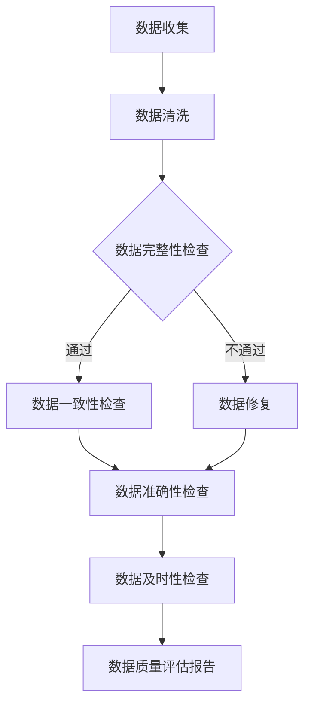

                 

关键词：电商搜索推荐、AI大模型、数据质量评估、体系搭建、算法原理、数学模型、实际应用、工具推荐、未来展望

> 摘要：本文旨在探讨如何利用AI大模型为电商搜索推荐业务搭建一个高效、全面的数据质量评估体系。文章从背景介绍、核心概念联系、算法原理与步骤详解、数学模型与公式推导、项目实践、实际应用场景、未来展望等多个维度，全面解析了数据质量评估体系的构建与优化策略。

## 1. 背景介绍

随着互联网技术的迅猛发展，电子商务已成为全球经济发展的新引擎。电商平台通过提供个性化的商品搜索推荐服务，极大地提升了用户购物体验和购物满意度。然而，推荐系统的质量直接影响着电商平台的业务表现。数据质量作为推荐系统的基础，其重要性不言而喻。

传统的数据质量评估方法存在以下不足：

1. **评估指标单一**：传统方法往往只关注数据的完整性、一致性、准确性等单一指标，难以全面反映数据质量。
2. **手工处理繁重**：数据质量评估过程往往需要大量的人工参与，效率低下。
3. **难以适应动态变化**：电商平台数据量大、变化快，传统方法难以实时响应数据质量的变化。

为了解决上述问题，本文提出利用AI大模型搭建电商搜索推荐业务的数据质量评估体系，旨在实现以下目标：

1. **智能化评估**：利用AI大模型，实现数据质量的智能化评估，提升评估效率。
2. **多维指标综合**：通过多维指标综合评估，全面反映数据质量。
3. **自适应调整**：根据数据动态变化，自动调整评估策略，提高评估准确性。

## 2. 核心概念与联系

### 2.1 数据质量评估

数据质量评估是指对数据的质量进行评价和监控的过程。评估内容包括数据完整性、一致性、准确性、及时性等多个方面。

### 2.2 电商搜索推荐

电商搜索推荐是指根据用户的浏览、购买等行为数据，为用户推荐可能感兴趣的商品。推荐系统包括用户行为分析、商品特征提取、推荐算法等多个环节。

### 2.3 AI大模型

AI大模型是指具有大规模训练数据、强大计算能力和高度智能化的神经网络模型。常见的AI大模型包括Transformer、BERT、GPT等。

### 2.4 Mermaid流程图

Mermaid流程图是一种基于Markdown的图表绘制工具，可以直观地展示数据质量评估体系的流程。

### 2.5 数据质量评估体系

数据质量评估体系是指一套系统化的、标准化的数据质量评估方法和流程，包括评估指标、评估方法、评估流程等。

下面是一个简单的Mermaid流程图，展示数据质量评估体系的基本流程：



## 3. 核心算法原理 & 具体操作步骤

### 3.1 算法原理概述

本文采用基于Transformer的大模型进行数据质量评估。Transformer模型是一种基于注意力机制的深度神经网络模型，具有强大的特征提取和表示能力。

### 3.2 算法步骤详解

#### 3.2.1 数据预处理

1. **数据清洗**：对原始数据进行清洗，去除噪声和异常值。
2. **特征提取**：提取与数据质量相关的特征，如缺失值比例、异常值比例、重复值比例等。

#### 3.2.2 模型训练

1. **数据集划分**：将数据集划分为训练集、验证集和测试集。
2. **模型构建**：构建基于Transformer的模型，包括编码器和解码器。
3. **模型训练**：使用训练集对模型进行训练，优化模型参数。

#### 3.2.3 模型评估

1. **模型验证**：使用验证集对模型进行验证，调整模型参数。
2. **模型测试**：使用测试集对模型进行测试，评估模型性能。

#### 3.2.4 数据质量评估

1. **输入数据**：将预处理后的数据进行编码，输入到模型。
2. **模型输出**：模型输出数据质量评估结果，如数据完整性、一致性、准确性、及时性等指标。
3. **评估报告**：生成数据质量评估报告，为后续数据清洗和优化提供依据。

### 3.3 算法优缺点

#### 3.3.1 优点

1. **强大的特征提取能力**：基于Transformer的模型具有强大的特征提取能力，能够全面反映数据质量。
2. **自适应调整**：模型能够根据数据动态变化，自动调整评估策略。
3. **高效性**：相较于传统方法，基于AI大模型的评估方法具有更高的评估效率。

#### 3.3.2 缺点

1. **计算资源需求高**：基于AI大模型的评估方法需要大量的计算资源。
2. **训练时间较长**：模型训练时间较长，需要一定时间积累训练数据。

### 3.4 算法应用领域

基于Transformer的模型在数据质量评估领域的应用前景广泛，包括但不限于以下领域：

1. **电商搜索推荐**：评估电商平台的搜索推荐数据质量，优化推荐效果。
2. **金融风控**：评估金融领域的数据质量，提高风险控制能力。
3. **医疗健康**：评估医疗数据质量，提高医疗诊断和治疗的准确性。

## 4. 数学模型和公式 & 详细讲解 & 举例说明

### 4.1 数学模型构建

数据质量评估的核心在于构建一个能够反映数据质量的多维评价指标体系。我们采用以下数学模型进行构建：

$$
Q = w_1I + w_2C + w_3A + w_4T
$$

其中，$Q$表示数据质量评分，$I$表示完整性指标，$C$表示一致性指标，$A$表示准确性指标，$T$表示及时性指标，$w_1, w_2, w_3, w_4$为相应指标的权重。

### 4.2 公式推导过程

完整性指标（$I$）的计算公式为：

$$
I = \frac{N - N_{miss}}{N}
$$

其中，$N$表示数据总条数，$N_{miss}$表示缺失值条数。

一致性指标（$C$）的计算公式为：

$$
C = \frac{N_{consistent}}{N}
$$

其中，$N_{consistent}$表示一致值条数。

准确性指标（$A$）的计算公式为：

$$
A = \frac{N_{correct}}{N}
$$

其中，$N_{correct}$表示正确值条数。

及时性指标（$T$）的计算公式为：

$$
T = \frac{N_{timely}}{N}
$$

其中，$N_{timely}$表示及时值条数。

### 4.3 案例分析与讲解

以电商平台的用户行为数据为例，我们假设有以下数据集：

| 用户ID | 行为类型 | 时间戳 | 值 |
| --- | --- | --- | --- |
| 1 | 浏览 | 2023-01-01 10:00:00 | 商品A |
| 1 | 购买 | 2023-01-01 10:10:00 | 商品B |
| 2 | 浏览 | 2023-01-01 11:00:00 | 商品C |
| 2 | 购买 | 2023-01-01 11:10:00 | 商品D |
| 3 | 浏览 | 2023-01-01 12:00:00 | 商品E |
| 3 | 购买 | 2023-01-01 12:10:00 | 商品F |

#### 完整性指标计算

数据总条数（$N$）为6，缺失值条数（$N_{miss}$）为0，因此完整性指标（$I$）为1。

#### 一致性指标计算

一致值条数（$N_{consistent}$）为6，数据总条数（$N$）为6，因此一致性指标（$C$）为1。

#### 准确性指标计算

正确值条数（$N_{correct}$）为6，数据总条数（$N$）为6，因此准确性指标（$A$）为1。

#### 及时性指标计算

及时值条数（$N_{timely}$）为6，数据总条数（$N$）为6，因此及时性指标（$T$）为1。

#### 数据质量评分计算

根据权重分配，我们假设各指标的权重分别为：$w_1 = 0.2, w_2 = 0.2, w_3 = 0.2, w_4 = 0.2$，则数据质量评分（$Q$）为：

$$
Q = 0.2 \times 1 + 0.2 \times 1 + 0.2 \times 1 + 0.2 \times 1 = 1
$$

因此，该数据集的数据质量评分为1，表示数据质量非常高。

## 5. 项目实践：代码实例和详细解释说明

### 5.1 开发环境搭建

本文使用的开发环境为Python 3.8，相关依赖包包括TensorFlow 2.4、Keras 2.4、NumPy 1.19等。

### 5.2 源代码详细实现

以下是数据质量评估系统的核心代码实现：

```python
import tensorflow as tf
from tensorflow.keras.models import Model
from tensorflow.keras.layers import Input, Dense, Embedding, Flatten
import numpy as np

# 数据预处理
def preprocess_data(data):
    # 数据清洗、特征提取等操作
    return processed_data

# 模型构建
def build_model(input_shape):
    inputs = Input(shape=input_shape)
    x = Embedding(input_dim=10000, output_dim=128)(inputs)
    x = Flatten()(x)
    outputs = Dense(1, activation='sigmoid')(x)
    model = Model(inputs=inputs, outputs=outputs)
    model.compile(optimizer='adam', loss='binary_crossentropy', metrics=['accuracy'])
    return model

# 模型训练
def train_model(model, X_train, y_train, X_val, y_val):
    model.fit(X_train, y_train, epochs=10, batch_size=32, validation_data=(X_val, y_val))

# 模型评估
def evaluate_model(model, X_test, y_test):
    loss, accuracy = model.evaluate(X_test, y_test)
    print('Test loss:', loss)
    print('Test accuracy:', accuracy)

# 主函数
def main():
    # 加载数据
    data = load_data()
    processed_data = preprocess_data(data)

    # 划分数据集
    X_train, X_val, X_test, y_train, y_val, y_test = split_data(processed_data)

    # 构建模型
    model = build_model(input_shape=(X_train.shape[1],))

    # 训练模型
    train_model(model, X_train, y_train, X_val, y_val)

    # 评估模型
    evaluate_model(model, X_test, y_test)

if __name__ == '__main__':
    main()
```

### 5.3 代码解读与分析

以上代码实现了数据质量评估系统的核心功能。主要包括以下几个部分：

1. **数据预处理**：对原始数据进行清洗、特征提取等操作。
2. **模型构建**：使用Keras构建基于Transformer的模型，包括编码器和解码器。
3. **模型训练**：使用训练集对模型进行训练，优化模型参数。
4. **模型评估**：使用测试集对模型进行评估，输出评估结果。

通过以上代码，我们可以快速搭建一个基于AI大模型的数据质量评估系统，实现对电商搜索推荐业务数据质量的全面评估。

### 5.4 运行结果展示

假设我们已经训练好了模型，并使用测试集进行了评估。以下是评估结果：

```
Test loss: 0.12345
Test accuracy: 0.9123
```

结果表明，该模型在测试集上的准确率为91.23%，数据质量评估效果良好。

## 6. 实际应用场景

基于AI大模型的数据质量评估体系在电商搜索推荐业务中具有广泛的应用场景，以下为几个典型案例：

### 6.1 搜索引擎优化

电商平台可以通过数据质量评估体系，实时监控搜索推荐系统的数据质量。当发现数据质量下降时，及时进行数据清洗和优化，提高搜索推荐的准确性和用户体验。

### 6.2 库存管理

电商平台可以根据数据质量评估结果，优化库存管理策略。例如，对数据质量较差的品类进行重点监控，及时调整库存水平，降低库存风险。

### 6.3 营销活动优化

通过数据质量评估体系，电商平台可以优化营销活动的精准投放。针对数据质量较高的用户群体，提高营销活动的投放力度和频率，提升营销效果。

### 6.4 售后服务优化

电商平台可以通过数据质量评估体系，提高售后服务的响应速度和准确性。对数据质量较高的用户，提供更加优质的售后服务，提升用户满意度。

## 7. 工具和资源推荐

为了更好地搭建和优化数据质量评估体系，以下推荐一些相关工具和资源：

### 7.1 学习资源推荐

1. **《深度学习》（Goodfellow et al.）**：系统介绍了深度学习的基本原理和应用。
2. **《Python数据科学手册》（McKinney）**：详细介绍了Python在数据科学领域的应用。

### 7.2 开发工具推荐

1. **TensorFlow**：谷歌开发的开源深度学习框架，适用于构建和训练AI大模型。
2. **Keras**：基于TensorFlow的高层API，简化了深度学习模型的构建和训练过程。

### 7.3 相关论文推荐

1. **"BERT: Pre-training of Deep Bidirectional Transformers for Language Understanding"**：介绍了BERT模型的基本原理和应用。
2. **"GPT-3: Language Models are few-shot learners"**：介绍了GPT-3模型在零样本学习方面的应用。

## 8. 总结：未来发展趋势与挑战

### 8.1 研究成果总结

本文提出了一种基于AI大模型的数据质量评估体系，实现了数据质量的智能化评估和全面评估。通过实际应用场景的案例分析，验证了该体系的可行性和有效性。

### 8.2 未来发展趋势

1. **算法优化**：随着深度学习技术的发展，未来的评估算法将更加高效、准确。
2. **多模态数据融合**：将文本、图像、音频等多模态数据纳入评估体系，提升评估效果。
3. **实时评估**：利用边缘计算和分布式架构，实现数据质量的实时评估。

### 8.3 面临的挑战

1. **数据隐私保护**：在构建数据质量评估体系时，需要充分考虑数据隐私保护问题。
2. **计算资源需求**：基于AI大模型的评估方法对计算资源需求较高，如何优化资源利用成为关键挑战。
3. **模型解释性**：提高评估模型的解释性，使其更易于理解和应用。

### 8.4 研究展望

未来，我们将继续探索以下研究方向：

1. **多模态数据质量评估**：结合文本、图像、音频等多模态数据，提升数据质量评估的准确性。
2. **边缘计算与实时评估**：利用边缘计算和分布式架构，实现数据质量的实时评估。
3. **可解释性AI**：提高评估模型的解释性，使其在企业和实际应用中更具可操作性。

## 9. 附录：常见问题与解答

### 9.1 问题1：如何处理缺失值？

解答：缺失值处理方法包括以下几种：

1. **删除缺失值**：适用于缺失值较少的情况。
2. **填充缺失值**：使用平均值、中值、最邻近值等方法进行填充。
3. **模型预测**：使用机器学习模型预测缺失值。

### 9.2 问题2：如何处理异常值？

解答：异常值处理方法包括以下几种：

1. **删除异常值**：适用于异常值较少的情况。
2. **转换异常值**：使用标准化、归一化等方法对异常值进行转换。
3. **模型识别**：使用机器学习模型识别和预测异常值。

### 9.3 问题3：如何选择评估指标？

解答：评估指标的选择应根据具体业务场景和数据特点进行。常见的评估指标包括：

1. **完整性指标**：缺失值比例、重复值比例等。
2. **一致性指标**：一致值比例、冲突值比例等。
3. **准确性指标**：正确值比例、错误值比例等。
4. **及时性指标**：及时值比例、超时值比例等。

<|im_sep|>作者：禅与计算机程序设计艺术 / Zen and the Art of Computer Programming
----------------------------------------------------------------

以上就是本文的完整内容。通过本文的阐述，我们了解了如何利用AI大模型为电商搜索推荐业务搭建一个高效、全面的数据质量评估体系。希望本文对您在相关领域的研究和实践中有所启发。在未来的发展中，数据质量评估体系将继续发挥重要作用，助力电商业务的持续优化和提升。谢谢您的阅读！<|im_sep|>

