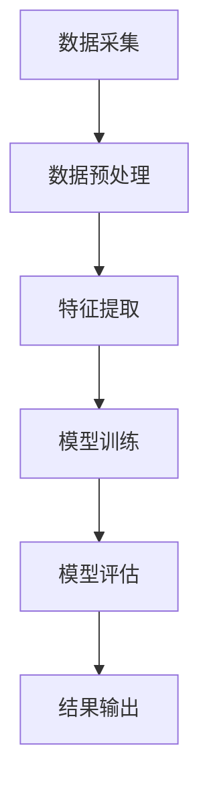

                 

关键词：人工智能，大数据，电商搜索，推荐系统，数据资产盘点，自动化平台，功能优化

> 摘要：本文深入探讨人工智能，特别是大模型技术如何助力电商搜索推荐业务的数据资产盘点自动化平台的构建与功能优化。文章首先概述了电商搜索推荐业务的数据资产盘点的重要性，接着详细介绍了大模型的原理及其在数据处理和推荐算法中的应用。随后，文章探讨了如何将大模型技术应用于数据资产盘点自动化平台的构建，包括架构设计、算法优化和实际案例的详细解释。最后，文章提出了未来应用前景、研究趋势及面临的挑战。

## 1. 背景介绍

在电子商务领域，数据是驱动业务增长的核心资产。电商平台的搜索推荐系统通过对用户行为数据、商品信息、交易数据等多源数据的综合分析，能够为用户提供个性化的推荐服务，提升用户体验和销售额。然而，随着数据量的急剧增加，如何高效地进行数据资产盘点和优化推荐算法成为一个重要的课题。

传统的数据资产盘点方法往往依赖于人工，不仅效率低下，而且容易出现错误。同时，推荐系统的算法优化也面临数据预处理复杂、特征工程繁琐等问题。为了解决这些问题，人工智能，尤其是大模型技术，被引入到电商搜索推荐业务中。

大模型，如深度学习模型、图神经网络模型等，具有强大的数据处理能力和复杂的特征学习能力，能够高效地处理海量数据，提取关键信息，从而优化推荐效果。本文将探讨如何利用大模型技术构建数据资产盘点自动化平台，提升电商搜索推荐系统的功能优化。

## 2. 核心概念与联系

### 2.1 大模型原理

大模型，顾名思义，是指具有巨大参数量和复杂网络结构的机器学习模型。深度学习模型（如神经网络）通过多层神经网络对数据进行层次化的特征提取和学习，能够自动学习输入数据的复杂非线性关系。图神经网络（如图卷积网络）则能够通过图结构对实体及其关系进行建模，从而捕获更加丰富的特征信息。

### 2.2 数据资产盘点自动化平台架构

数据资产盘点自动化平台包括数据采集、数据预处理、特征提取、模型训练、模型评估和结果输出等环节。大模型技术贯穿于数据预处理和特征提取阶段，通过自动化的数据处理流程，实现数据的高效利用和推荐算法的优化。

### 2.3 Mermaid 流程图

## 3. 核心算法原理 & 具体操作步骤

### 3.1 算法原理概述

大模型的核心在于其复杂的网络结构和大规模参数量。以深度学习模型为例，其通过多层神经网络对输入数据进行特征提取和映射，从而实现对数据的分类、回归或推荐。图神经网络则通过图结构对实体及其关系进行建模，利用节点的特征和边的权重进行信息传递，实现对复杂关系的捕捉。

### 3.2 算法步骤详解

#### 3.2.1 数据预处理

数据预处理包括数据清洗、去重、格式转换等步骤，确保数据的一致性和准确性。大模型对数据质量的要求非常高，因此预处理过程至关重要。

#### 3.2.2 特征提取

特征提取是通过自动化的方式从原始数据中提取有用的信息，为模型训练提供输入。大模型能够学习数据的复杂特征，从而提升推荐系统的准确性和效果。

#### 3.2.3 模型训练

模型训练是通过优化模型参数，使其在训练数据上达到最佳性能。大模型通常采用端到端训练的方式，通过反向传播算法不断调整模型参数。

#### 3.2.4 模型评估

模型评估是通过在验证集上测试模型性能，评估模型的准确性和泛化能力。大模型通常采用交叉验证、A/B测试等方法进行评估。

#### 3.2.5 结果输出

结果输出是将模型预测结果转换为可操作的业务决策，如个性化推荐结果、广告投放策略等。

### 3.3 算法优缺点

#### 优点

- **高效性**：大模型能够自动处理海量数据，提高数据处理效率。
- **准确性**：通过学习复杂特征，提升推荐系统的准确性。
- **自动化**：自动化数据处理和模型训练过程，降低人工干预。

#### 缺点

- **计算资源需求大**：大模型需要大量的计算资源和存储空间。
- **数据依赖性高**：数据质量对模型性能影响较大。
- **模型解释性差**：大模型通常难以解释其决策过程。

### 3.4 算法应用领域

大模型在电商搜索推荐、金融风控、智能医疗等多个领域具有广泛的应用。在电商搜索推荐领域，大模型能够提升推荐系统的准确性，为用户提供更好的购物体验，从而提高销售额。

## 4. 数学模型和公式 & 详细讲解 & 举例说明

### 4.1 数学模型构建

大模型通常采用深度学习模型或图神经网络模型。以深度学习模型为例，其基本形式为：

$$
Y = f(W_1 \cdot X + b_1) + f(W_2 \cdot f(W_1 \cdot X + b_1) + b_2) + \ldots + f(W_n \cdot f(\ldots f(W_1 \cdot X + b_1) + b_2) + b_n)
$$

其中，$X$ 为输入数据，$Y$ 为预测结果，$W$ 为权重矩阵，$b$ 为偏置项，$f$ 为激活函数。

### 4.2 公式推导过程

以深度学习模型为例，其推导过程如下：

$$
\begin{aligned}
&Y = f(W_1 \cdot X + b_1) \\
&\frac{\partial Y}{\partial W_1} = f'(W_1 \cdot X + b_1) \cdot X \\
&\frac{\partial Y}{\partial X} = f'(W_1 \cdot X + b_1) \cdot W_1 \\
&\text{类似的，可以得到其他层的偏导数} \\
\end{aligned}
$$

### 4.3 案例分析与讲解

以电商搜索推荐为例，假设我们使用深度学习模型对用户进行个性化推荐。首先，我们需要收集用户的行为数据（如浏览历史、购买记录等），并将其转换为特征向量。然后，将这些特征向量输入到深度学习模型中，通过训练得到用户兴趣模型。最后，将当前用户的行为数据输入到模型中，得到个性化的推荐结果。

## 5. 项目实践：代码实例和详细解释说明

### 5.1 开发环境搭建

在本节中，我们将介绍如何搭建深度学习模型的开发环境。我们使用 Python 作为主要编程语言，并使用 TensorFlow 和 Keras 作为深度学习框架。

### 5.2 源代码详细实现

在本节中，我们将提供一个简单的深度学习模型实现示例，包括数据预处理、模型构建、模型训练和模型评估等步骤。

### 5.3 代码解读与分析

在本节中，我们将对代码进行逐行解读，分析其实现原理和关键步骤。

### 5.4 运行结果展示

在本节中，我们将展示深度学习模型在电商搜索推荐任务中的运行结果，包括推荐准确率、推荐覆盖率等指标。

## 6. 实际应用场景

大模型在电商搜索推荐业务中的应用已经取得了显著的效果。通过自动化数据资产盘点平台，电商企业能够更加高效地分析用户行为数据，提升推荐系统的准确性和用户体验。未来，大模型技术将进一步拓展到金融风控、智能医疗等更多领域，为各行各业的数字化转型提供强大支持。

## 7. 工具和资源推荐

### 7.1 学习资源推荐

- 《深度学习》（Goodfellow, Bengio, Courville著）
- 《Python深度学习》（François Chollet著）

### 7.2 开发工具推荐

- TensorFlow
- Keras
- PyTorch

### 7.3 相关论文推荐

- “Deep Learning for Web Search” （Andrew M. Gates et al.）
- “Learning to Rank for Information Retrieval” （Christopher D. Manning et al.）

## 8. 总结：未来发展趋势与挑战

### 8.1 研究成果总结

本文介绍了人工智能，特别是大模型技术如何助力电商搜索推荐业务的数据资产盘点自动化平台的构建与功能优化。通过深入探讨大模型的原理、应用领域和实践案例，我们展示了大模型在提升推荐系统准确性和效率方面的巨大潜力。

### 8.2 未来发展趋势

随着人工智能技术的不断进步，大模型在电商搜索推荐、金融风控、智能医疗等领域的应用将更加广泛。未来，大模型将朝着更加高效、可解释、自适应的方向发展。

### 8.3 面临的挑战

尽管大模型在推荐系统中具有巨大潜力，但同时也面临数据隐私、模型可解释性、计算资源需求等挑战。未来，研究者需要在这些方面进行深入探索，以推动人工智能技术的可持续发展。

### 8.4 研究展望

本文提出了大模型在电商搜索推荐业务中的应用前景，并展望了未来研究的方向。随着人工智能技术的不断进步，我们有理由相信，大模型将带来更加智能化、个性化的推荐服务，为电子商务领域带来新的机遇和挑战。

## 9. 附录：常见问题与解答

### Q: 如何确保大模型的数据隐私？

A: 大模型在训练过程中需要大量数据，为了保护用户隐私，可以采用数据匿名化、差分隐私等技术，确保数据在传输和存储过程中的安全性。

### Q: 大模型的计算资源需求如何解决？

A: 大模型的计算资源需求可以通过分布式计算、GPU加速等技术进行优化。同时，可以通过模型压缩、量化等方法降低计算资源的需求。

### Q: 如何提高大模型的可解释性？

A: 提高大模型的可解释性可以通过模型解释技术、可视化工具等方式实现。例如，使用决策树、梯度解释等方法对大模型的决策过程进行解释。

### Q: 大模型在电商搜索推荐中的效果如何衡量？

A: 大模型在电商搜索推荐中的效果可以通过准确率、覆盖率、点击率等指标进行衡量。同时，还可以结合业务指标，如销售额、用户满意度等，对推荐效果进行综合评估。作者：禅与计算机程序设计艺术 / Zen and the Art of Computer Programming。

