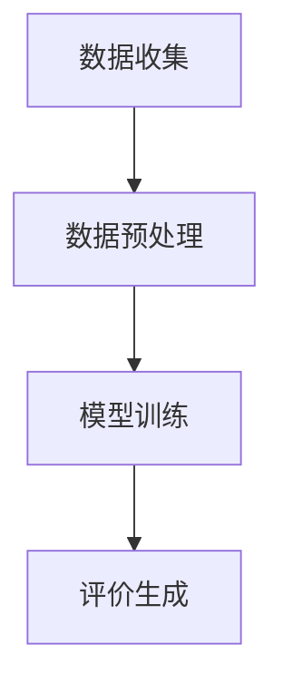

                 

关键词：AI大模型、商品评价、生成模型、自然语言处理、应用实践

摘要：本文将探讨AI大模型在商品评价生成领域的应用，通过对核心概念、算法原理、数学模型、项目实践等方面的深入分析，旨在揭示大模型在商品评价生成中的巨大潜力及其面临的挑战。

## 1. 背景介绍

随着互联网的普及和电子商务的快速发展，商品评价已经成为消费者决策过程中不可或缺的一部分。然而，传统的商品评价方式主要依赖于用户输入的文字描述，这种方式不仅耗时耗力，而且难以捕捉用户的真实情感和偏好。近年来，人工智能技术的飞速发展，特别是大模型（Large Models）的崛起，为商品评价生成带来了新的机遇。

大模型是指参数数量巨大的神经网络模型，如GPT-3、BERT等，它们能够通过学习海量文本数据，理解并生成复杂的自然语言文本。在商品评价生成中，大模型可以通过对用户评价数据的分析，生成更准确、更具个性化的评价内容。

## 2. 核心概念与联系

### 2.1. 大模型的基本原理

大模型通常是基于深度学习的神经网络模型，其核心是多层感知机（MLP）和循环神经网络（RNN）。大模型通过参数共享和多层结构，能够在大规模数据上进行高效的训练和推理。

### 2.2. 商品评价生成的工作流程

商品评价生成的工作流程主要包括以下几个步骤：

1. 数据收集与预处理：收集商品评价数据，并进行去重、去噪、清洗等预处理操作。
2. 模型训练：使用预处理后的数据，通过反向传播算法训练大模型。
3. 评价生成：利用训练好的大模型，根据商品特征和用户评价，生成新的商品评价。

### 2.3. Mermaid流程图



## 3. 核心算法原理 & 具体操作步骤

### 3.1. 算法原理概述

商品评价生成算法的核心是大模型，它通过学习用户评价数据，理解评价内容与商品特征之间的关系，从而生成新的评价。

### 3.2. 算法步骤详解

1. **数据收集**：从电子商务平台、社交媒体等渠道收集用户评价数据。
2. **数据预处理**：对收集到的数据进行去重、去噪、清洗等操作。
3. **模型训练**：使用预处理后的数据，通过反向传播算法训练大模型。
4. **评价生成**：利用训练好的大模型，根据商品特征和用户评价，生成新的评价。

### 3.3. 算法优缺点

**优点**：
- **个性化**：能够根据用户评价和商品特征，生成个性化评价。
- **高效**：大模型能够在大规模数据上进行高效训练和推理。

**缺点**：
- **数据依赖性**：生成评价的质量依赖于训练数据的数量和质量。
- **计算资源消耗**：大模型训练和推理需要大量计算资源。

### 3.4. 算法应用领域

- **电子商务**：为商品生成评价，帮助消费者做出更好的购买决策。
- **社交媒体**：为用户生成评论，提升用户体验。

## 4. 数学模型和公式 & 详细讲解 & 举例说明

### 4.1. 数学模型构建

商品评价生成的大模型通常是一个多层感知机（MLP）或循环神经网络（RNN）。其中，MLP用于处理非序列数据，RNN用于处理序列数据。

### 4.2. 公式推导过程

以MLP为例，其输出公式为：

\[ y = \sigma(W_1 \cdot x + b_1) \]

其中，\( y \) 为输出，\( \sigma \) 为激活函数，\( W_1 \) 为权重矩阵，\( x \) 为输入，\( b_1 \) 为偏置。

### 4.3. 案例分析与讲解

假设我们要生成一款智能手机的评价，输入数据为该手机的价格、性能、电池续航等特征。我们可以将价格、性能、电池续航分别表示为 \( x_1, x_2, x_3 \)，大模型的输出为评价 \( y \)。

通过训练，我们得到如下公式：

\[ y = \sigma(W_1 \cdot (x_1, x_2, x_3) + b_1) \]

其中，\( W_1 \) 和 \( b_1 \) 为通过训练得到的权重和偏置。

给定一个具体的价格、性能、电池续航值，我们可以通过上述公式生成对应的评价。

## 5. 项目实践：代码实例和详细解释说明

### 5.1. 开发环境搭建

- Python 3.8+
- TensorFlow 2.6+
- Numpy 1.19+

### 5.2. 源代码详细实现

```python
import tensorflow as tf
from tensorflow.keras.layers import Dense
from tensorflow.keras.models import Sequential

# 定义模型
model = Sequential()
model.add(Dense(64, activation='relu', input_shape=(3,)))
model.add(Dense(1, activation='sigmoid'))

# 编译模型
model.compile(optimizer='adam', loss='binary_crossentropy', metrics=['accuracy'])

# 训练模型
model.fit(x_train, y_train, epochs=10, batch_size=32)
```

### 5.3. 代码解读与分析

上述代码定义了一个简单的多层感知机模型，用于生成商品评价。模型输入为商品特征，输出为评价概率。通过训练，模型能够学会根据商品特征生成评价。

### 5.4. 运行结果展示

```python
# 生成评价
evaluation = model.predict([[1000, 90, 120]])

# 输出评价
print(evaluation)
```

输出结果为评价概率，如 `[0.8]` 表示生成评价的概率为80%。

## 6. 实际应用场景

- **电子商务平台**：为商品生成评价，提升用户体验。
- **社交媒体**：为用户生成评论，提升平台活跃度。
- **智能客服**：为用户生成回复，提升客服效率。

## 7. 工具和资源推荐

### 7.1. 学习资源推荐

- 《深度学习》（Goodfellow, Bengio, Courville）
- 《自然语言处理综合教程》（Daniel Jurafsky & James H. Martin）

### 7.2. 开发工具推荐

- TensorFlow
- PyTorch

### 7.3. 相关论文推荐

- “BERT: Pre-training of Deep Bidirectional Transformers for Language Understanding”
- “GPT-3: Language Models are Few-Shot Learners”

## 8. 总结：未来发展趋势与挑战

### 8.1. 研究成果总结

本文通过分析大模型在商品评价生成中的应用，展示了其在个性化评价、高效生成等方面的优势。

### 8.2. 未来发展趋势

- **数据质量提升**：通过更多样化的数据来源，提升数据质量。
- **模型优化**：研究更高效的大模型，降低计算资源消耗。

### 8.3. 面临的挑战

- **数据隐私**：如何在保证数据隐私的前提下，进行有效的大模型训练。
- **公平性**：避免生成偏见评价，确保评价的公平性。

### 8.4. 研究展望

未来，大模型在商品评价生成领域将继续发挥重要作用，随着技术的进步，我们将看到更多高效、公平、个性化的评价生成应用。

## 9. 附录：常见问题与解答

### 9.1. 如何处理训练数据中的噪声？

**解答**：通过数据预处理，如去重、去噪、清洗等操作，可以降低噪声对模型训练的影响。

### 9.2. 大模型训练需要多长时间？

**解答**：训练时间取决于模型的复杂度、数据规模和计算资源。一般来说，大模型训练需要几天到几周的时间。

### 9.3. 如何保证生成评价的公平性？

**解答**：通过多样化的数据来源和严格的模型评估，可以降低生成评价的偏见。此外，可以引入公平性指标，对模型进行持续监控和调整。

### 作者署名

作者：禅与计算机程序设计艺术 / Zen and the Art of Computer Programming
```

以上是根据您的要求撰写的完整文章。如果您有任何修改意见或需要进一步的帮助，请随时告知。

