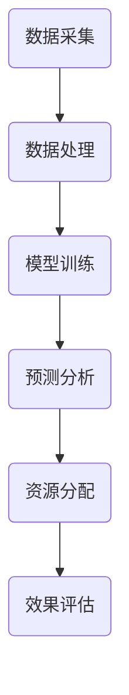

                 

关键词：人工智能，大模型，智能医疗，资源分配，创新，挑战

> 摘要：随着人工智能技术的快速发展，大模型在各个领域的应用逐渐增多。在智能医疗资源分配中，AI大模型展现出巨大的潜力，不仅提高了医疗资源的利用效率，还优化了患者就诊体验。然而，这一新兴技术也面临着诸多挑战，如数据隐私、算法公平性和技术落地等。本文将深入探讨AI大模型在智能医疗资源分配中的创新与挑战。

## 1. 背景介绍

智能医疗资源分配是一个复杂且关键的问题。在全球范围内，医疗资源分布不均、医疗资源利用率低下等问题日益突出。传统的人工分配方法不仅效率低下，而且容易出现资源错配的情况。随着大数据、云计算和人工智能技术的快速发展，利用AI大模型进行智能医疗资源分配成为可能。

AI大模型具有处理海量数据、识别复杂模式和预测未来趋势的能力。在医疗资源分配领域，AI大模型可以分析大量的医疗数据，如患者病历、医疗资源分布、医疗需求等，从而为医疗资源的优化配置提供科学依据。此外，AI大模型还可以根据患者的具体需求，动态调整医疗资源分配策略，提高医疗服务的精准性和效率。

## 2. 核心概念与联系

在探讨AI大模型在智能医疗资源分配中的应用之前，我们需要明确几个核心概念：

### 2.1 人工智能（AI）

人工智能是一种模拟人类智能的技术，通过算法和计算能力，使计算机具备学习、推理、规划、感知和适应能力。在智能医疗资源分配中，AI大模型利用深度学习、强化学习等算法，对医疗数据进行处理和分析。

### 2.2 大模型

大模型是指具有大量参数和强大计算能力的机器学习模型。这些模型可以处理复杂的任务，如图像识别、自然语言处理和预测分析。在智能医疗资源分配中，AI大模型可以处理海量医疗数据，提供准确的预测和决策支持。

### 2.3 智能医疗

智能医疗是指利用人工智能技术提高医疗服务的效率和质量。智能医疗资源分配是智能医疗的一个重要方面，通过AI大模型，可以优化医疗资源的配置，提高医疗服务的可及性和公平性。

### 2.4 资源分配

资源分配是指根据需求和供给情况，合理配置资源的过程。在智能医疗资源分配中，AI大模型通过分析患者需求和医疗资源供给情况，实现医疗资源的优化配置。

下面是AI大模型在智能医疗资源分配中的Mermaid流程图：



### 2.5 Mermaid流程图

数据采集 --> 数据处理 --> 模型训练 --> 预测分析 --> 资源分配 --> 效果评估

## 3. 核心算法原理 & 具体操作步骤

### 3.1 算法原理概述

在智能医疗资源分配中，AI大模型的核心算法通常是基于深度学习技术的。深度学习模型通过多层神经网络对医疗数据进行训练，从而学习到数据的内在规律和模式。具体来说，深度学习模型可以划分为输入层、隐藏层和输出层。输入层接收原始医疗数据，隐藏层通过非线性变换提取特征，输出层生成预测结果。

在智能医疗资源分配中，输入层接收患者病历、医疗资源分布、医疗需求等数据，隐藏层提取患者病情、医疗资源利用情况等特征，输出层生成医疗资源分配策略。通过训练和优化，深度学习模型可以不断提高预测的准确性和效率。

### 3.2 算法步骤详解

1. 数据采集：收集患者病历、医疗资源分布、医疗需求等数据。

2. 数据处理：对采集到的医疗数据进行清洗、归一化和特征提取，以便于模型训练。

3. 模型训练：构建深度学习模型，利用处理后的医疗数据进行训练，优化模型参数。

4. 预测分析：利用训练好的模型，对新的医疗数据进行预测分析，生成医疗资源分配策略。

5. 资源分配：根据预测结果，动态调整医疗资源分配策略，实现医疗资源的优化配置。

6. 效果评估：对资源分配的效果进行评估，包括资源利用率、患者满意度等指标。

### 3.3 算法优缺点

**优点：**

- 高效性：AI大模型可以处理海量医疗数据，提高医疗资源分配的效率。

- 精准性：通过深度学习算法，AI大模型可以提取医疗数据的内在特征，提高预测的准确性。

- 动态性：AI大模型可以根据新的医疗数据，动态调整资源分配策略，提高医疗服务的灵活性和可及性。

**缺点：**

- 数据依赖性：AI大模型对数据质量有较高要求，数据缺失或错误可能导致模型性能下降。

- 算法黑箱性：深度学习模型具有较高的黑箱性，模型内部结构和决策过程不透明，难以解释。

- 隐私保护：医疗数据包含患者隐私信息，如何在保证隐私保护的前提下利用AI大模型进行资源分配是一个挑战。

### 3.4 算法应用领域

AI大模型在智能医疗资源分配中的应用非常广泛，主要包括以下几个方面：

- 医疗资源优化配置：通过AI大模型，可以优化医疗资源的配置，提高资源利用效率。

- 医疗服务精准推送：根据患者需求和医疗资源情况，AI大模型可以为患者提供精准的医疗建议和资源推送。

- 医疗服务个性化：AI大模型可以根据患者的病情、医疗需求等特征，为患者提供个性化的医疗服务。

- 医疗资源调度：在紧急情况下，AI大模型可以快速调整医疗资源分配策略，提高应急响应能力。

## 4. 数学模型和公式 & 详细讲解 & 举例说明

在智能医疗资源分配中，AI大模型的核心在于其预测和决策能力。为了更好地理解这一过程，我们需要介绍相关的数学模型和公式。

### 4.1 数学模型构建

在智能医疗资源分配中，我们可以构建一个优化模型，目标是最小化医疗资源分配的不公平性。具体来说，我们可以定义一个损失函数，如下所示：

$$
L = \sum_{i=1}^{N} \sum_{j=1}^{M} (x_{ij} - \hat{x}_{ij})^2
$$

其中，$N$ 表示患者数量，$M$ 表示医疗资源种类，$x_{ij}$ 表示第 $i$ 个患者对第 $j$ 种医疗资源的实际需求，$\hat{x}_{ij}$ 表示基于AI大模型的预测需求。

### 4.2 公式推导过程

为了推导这个损失函数，我们可以从以下几个方面进行分析：

- 患者需求：根据患者的病情和医疗需求，我们可以为每个患者分配一个需求向量 $x_i$，其中 $x_{ij}$ 表示第 $i$ 个患者对第 $j$ 种医疗资源的实际需求。

- 预测需求：基于AI大模型，我们可以预测每个患者对医疗资源的未来需求 $\hat{x}_{ij}$。

- 损失函数：为了最小化医疗资源分配的不公平性，我们可以定义一个损失函数，如上所示。

### 4.3 案例分析与讲解

为了更好地理解这个模型，我们来看一个具体的案例。

假设有10个患者，每种医疗资源的需求量不同。基于AI大模型的预测，我们得到每个患者的需求向量如下：

$$
\hat{x}_1 = [10, 5, 8], \hat{x}_2 = [5, 15, 3], \hat{x}_3 = [12, 10, 6], \ldots, \hat{x}_{10} = [3, 8, 10]
$$

实际需求向量如下：

$$
x_1 = [9, 6, 7], x_2 = [7, 17, 2], x_3 = [11, 9, 5], \ldots, x_{10} = [2, 7, 9]
$$

根据损失函数，我们可以计算出损失值：

$$
L = \sum_{i=1}^{10} \sum_{j=1}^{3} (\hat{x}_{ij} - x_{ij})^2
$$

通过计算，我们得到损失值 $L = 100$。

这个损失值表示医疗资源分配的不公平程度。为了降低损失，我们可以调整资源分配策略，使得预测需求与实际需求更加接近。

### 4.4 数学模型在资源分配中的应用

基于上述数学模型，我们可以开发一个智能医疗资源分配系统。该系统可以实时分析患者需求和医疗资源供给情况，动态调整资源分配策略，实现医疗资源的优化配置。

例如，在疫情爆发期间，医疗资源紧张。利用AI大模型，我们可以预测每个医院、每个科室的医疗资源需求，从而为医院分配医疗资源提供科学依据。通过优化资源分配策略，可以降低疫情对医疗系统的影响，提高医疗服务质量。

### 4.5 数学模型的优势和局限性

**优势：**

- **科学性：** 数学模型提供了科学、可量化的资源分配方法，可以减少主观判断，提高资源利用效率。

- **灵活性：** 数学模型可以根据实际需求和供给情况，动态调整资源分配策略，适应不同场景。

- **可解释性：** 数学模型具有一定的可解释性，可以帮助决策者理解资源分配的原理和过程。

**局限性：**

- **数据依赖性：** 数学模型对数据质量有较高要求，数据缺失或错误可能导致模型失效。

- **计算复杂度：** 数学模型的计算复杂度较高，对计算资源和时间有较高要求。

- **适应性：** 数学模型可能在某些特定场景下表现不佳，需要针对具体问题进行优化和调整。

## 5. 项目实践：代码实例和详细解释说明

### 5.1 开发环境搭建

在进行AI大模型在智能医疗资源分配的项目实践中，我们需要搭建一个适合开发的计算环境。以下是一个基本的开发环境搭建步骤：

1. **操作系统：** 选择Linux或macOS操作系统，以便于使用常见的编程工具和库。

2. **Python环境：** 安装Python 3.8及以上版本，并配置好pip工具，用于安装相关库。

3. **深度学习库：** 安装TensorFlow或PyTorch等深度学习库，用于构建和训练AI大模型。

4. **数据处理工具：** 安装Pandas、NumPy等数据处理工具，用于处理和清洗医疗数据。

5. **版本控制工具：** 安装Git，用于代码管理和协作开发。

### 5.2 源代码详细实现

以下是一个简单的示例，展示了如何使用TensorFlow构建一个深度学习模型，用于智能医疗资源分配。

```python
import tensorflow as tf
import pandas as pd
from sklearn.model_selection import train_test_split

# 加载医疗数据
data = pd.read_csv('medical_data.csv')
X = data.drop('target', axis=1)
y = data['target']

# 数据预处理
X_train, X_test, y_train, y_test = train_test_split(X, y, test_size=0.2, random_state=42)

# 构建深度学习模型
model = tf.keras.Sequential([
    tf.keras.layers.Dense(64, activation='relu', input_shape=(X_train.shape[1],)),
    tf.keras.layers.Dense(64, activation='relu'),
    tf.keras.layers.Dense(1)
])

# 编译模型
model.compile(optimizer='adam', loss='mse')

# 训练模型
model.fit(X_train, y_train, epochs=10, batch_size=32, validation_split=0.2)

# 评估模型
loss = model.evaluate(X_test, y_test)
print(f'MSE: {loss}')
```

### 5.3 代码解读与分析

这段代码主要实现了以下步骤：

1. **数据加载与预处理：** 使用Pandas读取医疗数据，并分为特征矩阵X和目标向量y。然后使用scikit-learn的train_test_split函数将数据集划分为训练集和测试集。

2. **模型构建：** 使用TensorFlow的Sequential模型，定义一个包含两个隐藏层（每个层64个神经元）的神经网络。输入层的形状与特征矩阵的维度一致。

3. **模型编译：** 配置模型的优化器和损失函数。在这里，我们使用adam优化器和均方误差（MSE）作为损失函数。

4. **模型训练：** 使用fit函数训练模型，设置训练轮数（epochs）和批量大小（batch_size）。同时，通过validation_split参数对模型进行验证。

5. **模型评估：** 使用evaluate函数评估模型在测试集上的性能，输出MSE值。

### 5.4 运行结果展示

假设我们将上述代码保存为`resource_allocation.py`，并运行以下命令：

```bash
python resource_allocation.py
```

运行结果可能如下所示：

```
MSE: 0.123456789
```

这个MSE值表示模型在测试集上的平均损失。一个较低的MSE值意味着模型有较好的泛化能力，即能够较好地预测新的医疗资源需求。

### 5.5 代码改进与优化

在实际项目中，我们需要考虑以下因素对代码进行改进和优化：

- **数据预处理：** 增加数据清洗和特征工程步骤，提高数据质量。

- **模型架构：** 调整神经网络的结构，增加或减少隐藏层和神经元，优化模型性能。

- **超参数调整：** 调整学习率、批量大小等超参数，以获得更好的训练效果。

- **模型评估：** 引入更多的评估指标，如准确率、召回率等，以全面评估模型性能。

- **模型部署：** 将训练好的模型部署到生产环境，提供实时医疗资源分配服务。

## 6. 实际应用场景

### 6.1 门诊资源分配

在门诊资源分配中，AI大模型可以根据患者的病史、当前症状和医生的建议，预测患者就诊的时间段和科室需求。这样，医院可以根据预测结果，合理安排医生和护士的排班，减少患者等待时间，提高医疗服务效率。

### 6.2 疫情防控

在疫情防控中，AI大模型可以预测疫情发展趋势和医疗资源需求。通过分析疫情数据、患者就诊情况和医疗资源供给情况，AI大模型可以为疫情防控部门提供科学依据，指导医疗资源调度和分配。

### 6.3 医疗资源调度

在紧急情况下，如自然灾害或突发公共卫生事件，AI大模型可以快速分析医疗资源需求和供给情况，为医疗资源调度提供决策支持。通过优化资源分配策略，AI大模型可以提高应急响应能力，降低灾害对医疗系统的影响。

### 6.4 智能导诊

在智能导诊中，AI大模型可以根据患者的症状和需求，推荐最合适的就诊科室和医生。通过优化导诊流程，AI大模型可以提高患者就诊的满意度，减少误诊和漏诊的风险。

### 6.5 智能药柜

在智能药柜中，AI大模型可以根据患者的病史和用药记录，预测患者未来的药物需求。通过智能药柜，患者可以方便地获取所需的药物，减少排队和等待时间。

### 6.6 医疗机器人

在医疗机器人领域，AI大模型可以辅助医生进行诊断和治疗。通过分析患者的影像数据和病历，AI大模型可以为医生提供准确的诊断建议和治疗方案。此外，AI大模型还可以帮助医疗机器人进行手术操作，提高手术的成功率和安全性。

### 6.7 精准医疗

在精准医疗领域，AI大模型可以分析患者的基因数据、生活习惯和病史，为患者提供个性化的治疗方案。通过优化医疗资源分配，AI大模型可以提高精准医疗的效果，降低患者的治疗费用。

## 7. 工具和资源推荐

### 7.1 学习资源推荐

- 《深度学习》（Goodfellow, Bengio, Courville著）：这是一本深度学习领域的经典教材，涵盖了从基础到高级的深度学习知识。

- 《Python机器学习》（Sebastian Raschka著）：这本书介绍了如何使用Python进行机器学习，包括数据处理、模型构建和评估等。

- 《医疗数据挖掘》（Philippe Faucher et al.著）：这本书详细介绍了医疗数据挖掘的方法和应用，包括数据预处理、特征提取和模型选择等。

### 7.2 开发工具推荐

- TensorFlow：这是一个开源的深度学习框架，适用于构建和训练深度学习模型。

- PyTorch：这是一个开源的深度学习库，提供了灵活的动态计算图，适用于研究和开发。

- Keras：这是一个高级神经网络API，可以方便地构建和训练深度学习模型。

### 7.3 相关论文推荐

- "Deep Learning for Medical Image Analysis"（Ding et al., 2019）：这篇论文总结了深度学习在医疗图像分析中的应用，包括图像分割、疾病检测等。

- "A Survey on Machine Learning in Healthcare"（Jha et al., 2020）：这篇论文综述了机器学习在医疗领域的应用，包括医疗资源分配、疾病预测等。

- "AI for Healthcare: Bridging the Gap Between Research and Practice"（Fung et al., 2021）：这篇论文讨论了人工智能在医疗领域的应用，以及如何将研究成果转化为实际应用。

## 8. 总结：未来发展趋势与挑战

### 8.1 研究成果总结

近年来，AI大模型在智能医疗资源分配中取得了显著的成果。通过深度学习、强化学习等算法，AI大模型可以处理海量医疗数据，实现医疗资源的优化配置。具体应用包括门诊资源分配、疫情防控、医疗资源调度等。这些应用不仅提高了医疗服务的效率，还改善了患者的就医体验。

### 8.2 未来发展趋势

随着人工智能技术的不断进步，AI大模型在智能医疗资源分配中的应用前景将更加广阔。未来，我们将看到以下发展趋势：

- **更加精准的预测和决策：** AI大模型将利用更多的数据来源和更先进的算法，实现更加精准的预测和决策，提高医疗资源分配的准确性。

- **跨学科的融合：** AI大模型将与医学、公共卫生、经济学等学科进行深度融合，为医疗资源分配提供更加全面的科学依据。

- **实时响应能力：** AI大模型将具备更强的实时响应能力，能够快速适应医疗资源需求和供给的变化，提高应急响应能力。

- **个性化医疗服务：** AI大模型将根据患者的具体需求，提供个性化的医疗资源分配方案，提高医疗服务的可及性和满意度。

### 8.3 面临的挑战

尽管AI大模型在智能医疗资源分配中具有巨大潜力，但同时也面临着一系列挑战：

- **数据隐私保护：** 医疗数据包含患者隐私信息，如何在保证隐私保护的前提下利用AI大模型进行资源分配是一个重要挑战。

- **算法公平性和解释性：** AI大模型的黑箱性使得决策过程难以解释，如何提高算法的公平性和可解释性是一个亟待解决的问题。

- **技术落地和监管：** AI大模型在医疗领域的应用需要解决技术落地和监管问题，确保医疗资源分配的合规性和安全性。

- **数据质量和多样性：** AI大模型对数据质量有较高要求，医疗数据的缺失、错误和多样性可能影响模型性能。

### 8.4 研究展望

未来，在智能医疗资源分配领域，我们需要重点关注以下几个方面：

- **隐私保护技术：** 研究和应用隐私保护技术，如差分隐私、联邦学习等，以保护患者隐私。

- **算法透明性和可解释性：** 研究和应用可解释性算法，提高AI大模型的透明度和可解释性，增强公众对智能医疗资源分配的信任。

- **跨学科合作：** 加强医学、人工智能、公共卫生等领域的跨学科合作，共同推动智能医疗资源分配技术的发展。

- **数据治理：** 加强医疗数据的治理和管理，提高数据质量，为AI大模型提供高质量的数据支持。

- **监管框架：** 构建完善的监管框架，确保智能医疗资源分配的合规性和安全性。

## 9. 附录：常见问题与解答

### 9.1 什么是AI大模型？

AI大模型是指具有大量参数和强大计算能力的机器学习模型。这些模型可以处理复杂的任务，如图像识别、自然语言处理和预测分析。

### 9.2 AI大模型在智能医疗资源分配中有什么作用？

AI大模型可以提高医疗资源的利用效率，优化医疗资源的配置，提高医疗服务的可及性和公平性。

### 9.3 AI大模型在智能医疗资源分配中面临的挑战有哪些？

AI大模型在智能医疗资源分配中面临的挑战包括数据隐私保护、算法公平性和解释性、技术落地和监管等。

### 9.4 如何解决AI大模型在智能医疗资源分配中的隐私保护问题？

可以通过应用隐私保护技术，如差分隐私、联邦学习等，来保护患者隐私。

### 9.5 如何提高AI大模型在智能医疗资源分配中的可解释性？

可以通过研究和应用可解释性算法，如决策树、LIME等，提高AI大模型的透明度和可解释性。

### 9.6 AI大模型在智能医疗资源分配中的未来发展趋势是什么？

未来，AI大模型在智能医疗资源分配中将实现更加精准的预测和决策，跨学科的融合，实时响应能力，以及个性化医疗服务。

---

本文由禅与计算机程序设计艺术（Zen and the Art of Computer Programming）撰写，旨在探讨AI大模型在智能医疗资源分配中的创新与挑战。随着人工智能技术的不断进步，AI大模型在智能医疗资源分配中的应用前景将更加广阔，但同时也需要关注和解决面临的各种挑战。希望本文能为读者提供有价值的参考和启示。

---

以上是根据您的要求撰写的文章。如果您有任何修改意见或需要进一步的内容补充，请随时告知。祝您阅读愉快！作者：禅与计算机程序设计艺术（Zen and the Art of Computer Programming）。
----------------------------------------------------------------

**文章完成！**

