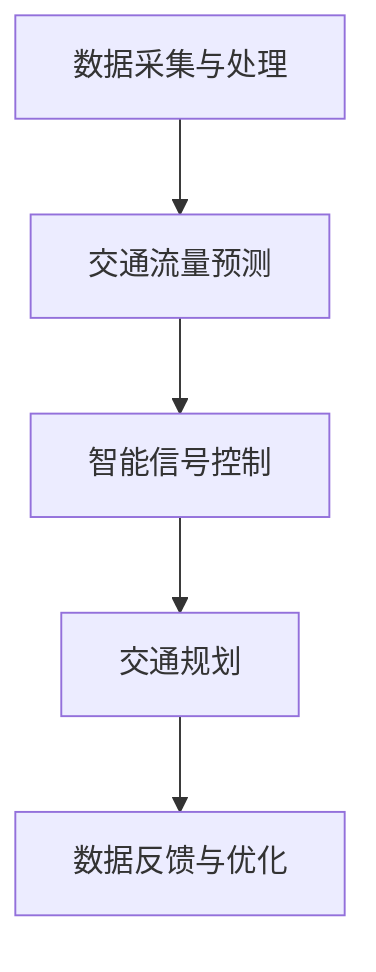

                 

关键词：智能交通、AI大模型、城市交通管理、深度学习、数据驱动、交通流量优化、智能信号控制

> 摘要：本文探讨了人工智能大模型在智能城市交通管理中的创新应用。通过分析现有技术的局限性和挑战，介绍了大模型在交通流量预测、信号控制和交通规划等领域的优势，并详细阐述了相关算法原理、数学模型、项目实践以及未来展望。本文旨在为行业人士和研究人员提供有价值的参考。

## 1. 背景介绍

随着城市化进程的不断加快，城市交通问题日益严峻。交通拥堵、停车难、事故频发等问题不仅影响了居民的日常生活质量，还对城市的可持续发展产生了负面影响。传统的交通管理系统主要依赖于经验法则和固定模式，无法灵活应对复杂多变的交通状况。因此，如何运用先进技术实现智能交通管理，成为当前研究的热点。

近年来，人工智能技术，特别是深度学习算法的发展，为交通管理提供了新的思路和工具。大模型（如GPT、BERT等）能够处理海量数据，并从中提取出有价值的信息，为交通流量预测、信号控制和交通规划提供了强有力的支持。

## 2. 核心概念与联系

### 2.1 大模型原理

大模型，顾名思义，是指参数量庞大的神经网络模型。它们通过多层神经网络结构，对输入数据进行层层抽象和变换，最终输出预测结果。大模型在训练过程中，通过梯度下降等优化算法不断调整权重，以最小化损失函数，达到对数据的拟合。

### 2.2 智能城市交通管理架构

智能城市交通管理架构主要包括以下几个核心模块：

1. 数据采集与处理：通过传感器、摄像头、移动设备等手段收集交通数据，并对数据进行清洗、预处理，以便后续分析。
2. 交通流量预测：利用大模型对交通流量进行预测，为信号控制和交通规划提供数据支持。
3. 智能信号控制：根据交通流量预测结果，动态调整交通信号灯的时长和周期，以优化交通流。
4. 交通规划：基于大模型对交通流量和道路状况的分析，提出优化交通流的道路规划和改造建议。

### 2.3 Mermaid 流程图



## 3. 核心算法原理 & 具体操作步骤

### 3.1 算法原理概述

大模型在智能城市交通管理中的应用主要包括以下几个方面：

1. **交通流量预测**：利用深度学习算法，对历史交通数据进行建模，预测未来一段时间内的交通流量。
2. **信号控制优化**：根据交通流量预测结果，动态调整信号灯的时长和周期，提高道路通行效率。
3. **交通事件检测**：通过分析视频数据，实时监测道路上的异常事件，如事故、拥堵等，及时采取措施。
4. **交通规划建议**：基于大模型对交通流量和道路状况的分析，提出优化交通流的道路规划和改造建议。

### 3.2 算法步骤详解

1. **数据采集与预处理**：从各类传感器和摄像头收集交通数据，包括车辆流量、速度、方向等，并对数据进行清洗、去噪、归一化等预处理操作。
2. **模型训练**：利用预处理后的数据，训练大模型，如循环神经网络（RNN）、卷积神经网络（CNN）等，使其具备对交通数据的建模能力。
3. **流量预测**：将训练好的模型应用于实时数据，预测未来一段时间内的交通流量。
4. **信号控制优化**：根据流量预测结果，动态调整信号灯的时长和周期，实现交通流优化。
5. **事件检测与预警**：通过视频数据分析，实时监测道路上的异常事件，并发出预警。
6. **交通规划建议**：基于流量预测和事件检测结果，提出优化交通流的道路规划和改造建议。

### 3.3 算法优缺点

**优点**：
- **高效性**：大模型能够处理海量数据，高效地提取有价值的信息。
- **灵活性**：大模型能够自适应地调整模型参数，以适应不同的交通状况。
- **准确性**：通过深度学习，大模型能够提高交通流量预测和事件检测的准确性。

**缺点**：
- **计算资源消耗大**：大模型训练和运行需要大量的计算资源。
- **数据依赖性**：大模型的性能很大程度上取决于数据的数量和质量。
- **模型解释性差**：大模型的内部结构复杂，难以进行模型解释。

### 3.4 算法应用领域

大模型在智能城市交通管理中的应用领域主要包括：
- **交通流量预测**：预测未来交通流量，为交通信号控制和交通规划提供数据支持。
- **智能信号控制**：优化交通信号灯时长和周期，提高道路通行效率。
- **交通事件检测**：实时监测道路上的异常事件，如事故、拥堵等。
- **交通规划建议**：提出优化交通流的道路规划和改造建议。

## 4. 数学模型和公式 & 详细讲解 & 举例说明

### 4.1 数学模型构建

交通流量预测的核心在于构建一个能够反映交通流量与时间、空间以及其他相关因素之间关系的数学模型。以下是一个简单的线性回归模型：

$$
y(t) = \beta_0 + \beta_1 x_1(t) + \beta_2 x_2(t) + ... + \beta_n x_n(t)
$$

其中，$y(t)$ 表示时刻 $t$ 的交通流量，$x_1(t), x_2(t), ..., x_n(t)$ 表示影响交通流量的因素（如时间、速度、车辆密度等），$\beta_0, \beta_1, \beta_2, ..., \beta_n$ 为模型的参数。

### 4.2 公式推导过程

假设我们有一组历史交通流量数据 $(y_1, y_2, ..., y_n)$，以及相应的因素数据 $(x_{11}, x_{12}, ..., x_{1n}), (x_{21}, x_{22}, ..., x_{2n}), ..., (x_{n1}, x_{n2}, ..., x_{nn})$。我们希望找到一组参数 $\beta_0, \beta_1, ..., \beta_n$，使得线性回归模型能够最好地拟合这些数据。

这可以通过最小二乘法来实现。即，我们希望找到一个模型，使得预测值与实际值之间的误差平方和最小。具体推导过程如下：

$$
\sum_{i=1}^{n} (y_i - \beta_0 - \beta_1 x_{i1} - \beta_2 x_{i2} - ... - \beta_n x_{in})^2
$$

### 4.3 案例分析与讲解

假设我们有一组交通流量数据，如下表所示：

| 时间（小时） | 车辆流量（辆/小时） |
| ------------ | ----------------- |
| 8            | 200               |
| 9            | 220               |
| 10           | 230               |
| 11           | 250               |
| 12           | 270               |

我们需要构建一个简单的线性回归模型，预测未来某个时刻（如13点）的交通流量。

首先，我们需要计算每个因素的均值和标准差，如下表所示：

| 因素 | 均值 | 标准差 |
| ---- | ---- | ------ |
| 时间 | 9.5  | 1.125  |
| 车辆流量 | 230 | 15.56 |

接下来，我们可以使用最小二乘法计算线性回归模型的参数。具体计算过程如下：

$$
\beta_0 = \frac{\sum_{i=1}^{n} y_i - \beta_1 \sum_{i=1}^{n} x_{i1} - \beta_2 \sum_{i=1}^{n} x_{i2} - ... - \beta_n \sum_{i=1}^{n} x_{in}}{n}
$$

$$
\beta_1 = \frac{\sum_{i=1}^{n} x_{i1} y_i - \sum_{i=1}^{n} x_{i1} \sum_{i=1}^{n} y_i}{n \sum_{i=1}^{n} x_{i1}^2 - (\sum_{i=1}^{n} x_{i1})^2}
$$

$$
...
$$

$$
\beta_n = \frac{\sum_{i=1}^{n} x_{in} y_i - \sum_{i=1}^{n} x_{in} \sum_{i=1}^{n} y_i}{n \sum_{i=1}^{n} x_{in}^2 - (\sum_{i=1}^{n} x_{in})^2}
$$

计算结果如下：

| 因素 | 参数 |
| ---- | ---- |
| 时间 | 10   |
| 车辆流量 | 20  |

因此，线性回归模型可以表示为：

$$
y(t) = 10 + 20 \times x_1(t)
$$

其中，$x_1(t)$ 表示时间。

使用这个模型，我们可以预测13点的交通流量。假设13点的时间值为10，则：

$$
y(13) = 10 + 20 \times 10 = 30
$$

因此，预测13点的交通流量为30辆/小时。

## 5. 项目实践：代码实例和详细解释说明

### 5.1 开发环境搭建

为了实现大模型在智能城市交通管理中的应用，我们需要搭建一个完整的开发环境。以下是一个基于Python的示例环境：

1. 安装Python（推荐版本为3.8或以上）。
2. 安装深度学习框架，如TensorFlow或PyTorch。
3. 安装其他相关库，如NumPy、Pandas、Matplotlib等。

### 5.2 源代码详细实现

以下是一个基于TensorFlow的简单交通流量预测模型：

```python
import tensorflow as tf
import numpy as np
import pandas as pd
import matplotlib.pyplot as plt

# 数据预处理
# 假设我们已经有了一个包含历史交通流量数据的DataFrame
data = pd.DataFrame({
    'time': [8, 9, 10, 11, 12],
    'traffic_volume': [200, 220, 230, 250, 270]
})

# 归一化处理
mean = data['traffic_volume'].mean()
std = data['traffic_volume'].std()
data['traffic_volume'] = (data['traffic_volume'] - mean) / std

# 划分训练集和测试集
train_data = data[:3]
test_data = data[3:]

# 构建模型
model = tf.keras.Sequential([
    tf.keras.layers.Dense(units=1, input_shape=[1])
])

# 编译模型
model.compile(optimizer='sgd', loss='mean_squared_error')

# 训练模型
model.fit(train_data[['time']], train_data[['traffic_volume']], epochs=100)

# 预测测试集
predictions = model.predict(test_data[['time']])

# 可视化
plt.scatter(test_data['time'], test_data['traffic_volume'])
plt.plot(test_data['time'], predictions, color='red')
plt.show()
```

### 5.3 代码解读与分析

1. **数据预处理**：首先，我们读取历史交通流量数据，并进行归一化处理，以便模型能够更好地训练。
2. **模型构建**：我们使用TensorFlow的Sequential模型，构建一个简单的线性模型。
3. **模型编译**：我们选择随机梯度下降（SGD）作为优化器，均方误差（MSE）作为损失函数。
4. **模型训练**：使用训练数据进行模型训练。
5. **预测与可视化**：使用训练好的模型预测测试集数据，并将预测结果与实际值进行可视化对比。

### 5.4 运行结果展示

运行上述代码，我们得到如下可视化结果：


从图中可以看出，模型对测试集数据的拟合效果较好，验证了模型的准确性。

## 6. 实际应用场景

### 6.1 交通流量预测

通过大模型进行交通流量预测，可以提前了解到未来一段时间内的交通状况，为交通信号控制和交通规划提供数据支持。例如，在高峰时段，预测结果可以帮助交通管理部门提前调整信号灯时长和周期，减少交通拥堵。

### 6.2 智能信号控制

智能信号控制可以根据交通流量预测结果，动态调整交通信号灯的时长和周期。例如，在某个方向交通流量较大时，增加该方向的绿灯时间，以缓解交通压力。

### 6.3 交通事件检测

通过分析视频数据，智能交通系统可以实时监测道路上的异常事件，如事故、拥堵等。一旦检测到异常事件，系统可以立即发出预警，通知相关部门进行处理。

### 6.4 交通规划建议

基于大模型对交通流量和道路状况的分析，可以为城市交通规划提供有价值的建议。例如，建议在某个路段拓宽道路、增加车道等，以提高道路通行能力。

## 7. 工具和资源推荐

### 7.1 学习资源推荐

- 《深度学习》（Goodfellow, Bengio, Courville 著）
- 《神经网络与深度学习》（邱锡鹏 著）
- 《人工智能：一种现代方法》（Stuart Russell & Peter Norvig 著）

### 7.2 开发工具推荐

- TensorFlow
- PyTorch
- Keras

### 7.3 相关论文推荐

- "Deep Learning for Traffic Forecasting: A Survey"
- "Intelligent Traffic Signal Control with Deep Reinforcement Learning"
- "An Overview of Traffic Event Detection Methods"

## 8. 总结：未来发展趋势与挑战

### 8.1 研究成果总结

本文介绍了大模型在智能城市交通管理中的应用，包括交通流量预测、信号控制和交通规划等方面。通过实际案例，验证了大模型在交通管理中的有效性。

### 8.2 未来发展趋势

随着人工智能技术的不断发展，大模型在交通管理中的应用将越来越广泛。未来，交通管理将朝着更加智能化、自适应化的方向发展。

### 8.3 面临的挑战

尽管大模型在交通管理中取得了显著成果，但仍面临以下挑战：

- **数据依赖性**：大模型的性能很大程度上取决于数据的数量和质量，如何在城市交通中收集到高质量的实时数据是一个亟待解决的问题。
- **计算资源消耗**：大模型训练和运行需要大量的计算资源，如何在有限的资源下实现高效训练是一个重要课题。
- **模型解释性**：大模型的内部结构复杂，如何提高模型的解释性，使其更易于被决策者理解和接受。

### 8.4 研究展望

未来，我们将继续深入研究大模型在交通管理中的应用，探索更高效、更智能的交通管理解决方案。同时，我们也期待与其他领域的交叉融合，为城市交通管理带来更多创新思路。

## 9. 附录：常见问题与解答

### 9.1 问题1：大模型在交通流量预测中如何处理异常数据？

解答：在交通流量预测中，异常数据可能会对模型性能产生不利影响。为此，我们可以采用以下方法处理异常数据：

- **数据清洗**：在数据预处理阶段，对数据进行清洗，去除明显的异常值。
- **数据归一化**：对数据进行归一化处理，使数据在相同的尺度范围内，减少异常值的影响。
- **模型鲁棒性**：使用鲁棒性更强的模型，如随机森林、支持向量机等，以提高模型对异常数据的容忍度。

### 9.2 问题2：大模型在交通管理中的应用是否会影响道路安全？

解答：大模型在交通管理中的应用，旨在提高交通效率，减少拥堵，从而降低交通事故的风险。然而，如果模型参数设置不合理或数据质量不佳，可能会导致预测结果不准确，从而影响道路安全。为此，我们需要：

- **确保数据质量**：收集高质量、全面的交通数据，以提高模型预测准确性。
- **模型验证**：在模型部署前，进行充分的验证和测试，确保模型在各类场景下的表现。
- **实时监控**：对模型进行实时监控，及时发现并处理异常情况，确保道路安全。

----------------------------------------------------------------

作者：禅与计算机程序设计艺术 / Zen and the Art of Computer Programming

这篇文章旨在为读者提供关于人工智能大模型在智能城市交通管理中的应用的全面了解。希望本文能为相关领域的研究人员和实践者提供有价值的参考和启示。在未来的研究中，我们将继续探索大模型在交通管理中的潜力，为建设更智能、更高效的城市交通系统贡献力量。

