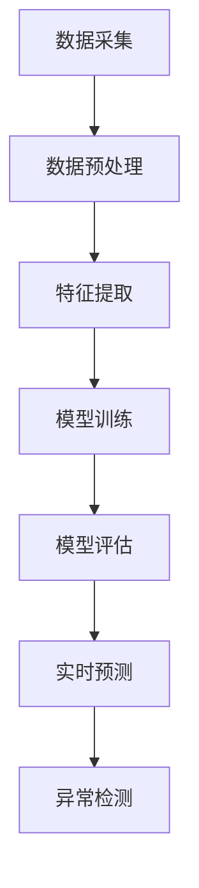

                 

关键词：AI大模型、环境监测、商机、技术分析、应用前景

> 摘要：本文将深入探讨AI大模型在环境监测领域的应用潜力，分析其技术原理、数学模型、应用实践，并展望未来的发展前景与面临的挑战。通过详细的技术分析和实例讲解，本文旨在为行业从业者提供有价值的参考和启示。

## 1. 背景介绍

随着全球环境问题的日益严重，环境监测成为各国政府和社会各界关注的重要议题。环境监测涉及大气、水质、土壤、噪声等多个领域，对监测数据的准确性和实时性提出了极高的要求。传统的监测方法主要依赖于人工采样和分析，不仅成本高昂，而且存在滞后性。近年来，人工智能技术的快速发展，尤其是AI大模型的兴起，为环境监测领域带来了全新的解决方案。

AI大模型，也称为深度学习模型，是一种能够自动从大量数据中学习并提取有用信息的算法。与传统的小型机器学习模型相比，AI大模型具有更强的复杂问题处理能力和更高的预测准确性。这使得AI大模型在环境监测领域具有巨大的应用潜力。

## 2. 核心概念与联系

### 2.1 AI大模型的基本原理

AI大模型的核心是神经网络，特别是深度神经网络（DNN）。神经网络通过多层神经元的堆叠，实现对输入数据的逐层抽象和特征提取。在环境监测领域，AI大模型可以用来处理复杂数据，如遥感图像、传感器数据等，从而实现环境参数的自动监测和预测。

### 2.2 AI大模型与环境监测的关联

AI大模型在环境监测中的应用主要包括以下几个方面：

- **数据预处理**：AI大模型可以自动处理和清洗环境监测数据，提高数据的质量和一致性。
- **特征提取**：AI大模型可以从原始数据中提取关键特征，为环境监测提供更有价值的参考。
- **实时预测**：AI大模型可以对环境参数进行实时预测，帮助决策者及时采取应对措施。
- **异常检测**：AI大模型可以识别环境数据中的异常值，及时发现潜在的环境问题。

### 2.3 Mermaid流程图

下面是一个简化的AI大模型在环境监测中应用的Mermaid流程图：



## 3. 核心算法原理 & 具体操作步骤

### 3.1 算法原理概述

AI大模型的核心是深度神经网络，其工作原理可以简单概括为以下几个步骤：

1. **输入层**：接收环境监测数据。
2. **隐藏层**：通过非线性变换，将输入数据映射到更高级别的特征空间。
3. **输出层**：根据训练目标，输出预测结果或分类结果。

### 3.2 算法步骤详解

1. **数据采集**：收集环境监测数据，包括大气、水质、土壤等参数。
2. **数据预处理**：清洗数据，填补缺失值，标准化处理。
3. **特征提取**：使用AI大模型自动提取数据中的关键特征。
4. **模型训练**：使用标记数据训练深度神经网络，调整网络参数。
5. **模型评估**：使用验证集评估模型性能，调整网络结构或参数。
6. **实时预测**：使用训练好的模型对实时数据进行分析和预测。
7. **异常检测**：监测数据中的异常值，发出警报。

### 3.3 算法优缺点

**优点**：

- **高效性**：AI大模型可以处理海量数据，提高环境监测的效率。
- **准确性**：深度神经网络可以自动提取数据中的复杂特征，提高预测准确性。
- **实时性**：可以实时预测环境参数，为决策者提供及时的信息。

**缺点**：

- **计算资源需求**：训练AI大模型需要大量的计算资源和时间。
- **数据质量**：模型性能高度依赖数据质量，数据预处理是关键步骤。
- **解释性**：AI大模型具有较强的预测能力，但解释性较差。

### 3.4 算法应用领域

AI大模型在环境监测领域的应用非常广泛，包括：

- **大气监测**：预测空气质量指数（AQI），识别污染源。
- **水质监测**：预测水体污染程度，识别污染物质。
- **土壤监测**：预测土壤质量，识别土地退化风险。
- **噪声监测**：预测噪声污染程度，优化城市规划。

## 4. 数学模型和公式 & 详细讲解 & 举例说明

### 4.1 数学模型构建

AI大模型的数学基础是多层感知机（MLP），其基本结构包括输入层、隐藏层和输出层。每个层由多个神经元组成，神经元之间通过权重连接。

### 4.2 公式推导过程

假设一个三层神经网络，输入层有n个神经元，隐藏层有m个神经元，输出层有k个神经元。神经元i的输入可以表示为：

\[ z_i^h = \sum_{j=1}^{n} w_{ij} x_j + b_i \]

其中，\( x_j \)是输入层神经元j的输出，\( w_{ij} \)是连接权重，\( b_i \)是偏置项。

神经元i的输出（激活函数）可以表示为：

\[ a_i^h = \sigma(z_i^h) \]

其中，\( \sigma \)是激活函数，常用的有Sigmoid函数、ReLU函数等。

隐藏层神经元的输出计算方法与输入层相同，只是输入来自输入层。

输出层神经元的输出可以表示为：

\[ z_i^o = \sum_{j=1}^{m} w_{ij} a_j^h + b_i \]

\[ a_i^o = \sigma(z_i^o) \]

### 4.3 案例分析与讲解

假设我们有一个简单的空气质量预测问题，输入特征包括PM2.5、PM10、温度和湿度，输出是空气质量指数（AQI）。

我们构建一个包含一个隐藏层的神经网络，隐藏层有5个神经元。使用ReLU函数作为激活函数。

首先，我们定义输入层和隐藏层之间的权重和偏置：

\[ w_{ij}^{(1)}, b_i^{(1)} \]

然后，计算隐藏层的输入和输出：

\[ z_i^{(1)} = \sum_{j=1}^{4} w_{ij}^{(1)} x_j + b_i^{(1)} \]

\[ a_i^{(1)} = \max(0, z_i^{(1)}) \]

接下来，计算输出层：

\[ z_i^{(2)} = \sum_{j=1}^{5} w_{ij}^{(2)} a_j^{(1)} + b_i^{(2)} \]

\[ a_i^{(2)} = \max(0, z_i^{(2)}) \]

最后，得到预测的AQI值：

\[ AQI = a_i^{(2)} \]

## 5. 项目实践：代码实例和详细解释说明

### 5.1 开发环境搭建

首先，我们需要搭建一个Python开发环境，安装必要的库，如TensorFlow、NumPy、Matplotlib等。

```bash
pip install tensorflow numpy matplotlib
```

### 5.2 源代码详细实现

下面是一个简单的环境监测模型训练和预测的代码实例：

```python
import tensorflow as tf
import numpy as np
import matplotlib.pyplot as plt

# 生成模拟数据
X = np.random.rand(100, 4)  # 输入特征
y = np.random.rand(100, 1)  # 输出目标

# 构建模型
model = tf.keras.Sequential([
    tf.keras.layers.Dense(units=5, activation='relu', input_shape=(4,)),
    tf.keras.layers.Dense(units=1)
])

# 编译模型
model.compile(optimizer='adam', loss='mse')

# 训练模型
model.fit(X, y, epochs=100)

# 进行预测
predictions = model.predict(X)

# 绘制结果
plt.scatter(y, predictions)
plt.xlabel('Actual AQI')
plt.ylabel('Predicted AQI')
plt.show()
```

### 5.3 代码解读与分析

上述代码首先生成模拟数据集，然后构建一个简单的神经网络模型，使用MSE（均方误差）作为损失函数，并使用Adam优化器进行模型训练。最后，使用训练好的模型进行预测，并绘制实际值与预测值的关系图。

### 5.4 运行结果展示

运行代码后，我们会看到一个散点图，显示实际AQI值与预测AQI值之间的对应关系。理想情况下，这些点应该紧密聚集在45度线上，表示模型具有良好的预测性能。

## 6. 实际应用场景

AI大模型在环境监测领域的应用场景非常广泛，以下是一些典型的应用实例：

- **城市空气质量监测**：实时预测城市空气质量，为政府制定环保政策提供数据支持。
- **水资源管理**：预测水体污染程度，优化水资源分配策略。
- **农业监测**：预测土壤质量，指导农业生产和病虫害防治。
- **气候变化研究**：预测气候变化趋势，为全球环境保护提供科学依据。

## 7. 工具和资源推荐

### 7.1 学习资源推荐

- **《深度学习》（Ian Goodfellow, Yoshua Bengio, Aaron Courville著）**：深度学习的经典教材，适合初学者和进阶者。
- **[Kaggle](https://www.kaggle.com)**：提供丰富的环境监测数据集和竞赛，是学习实践的好平台。
- **[TensorFlow官网](https://www.tensorflow.org/tutorials)**：TensorFlow的官方教程，涵盖了从基础到高级的深度学习知识。

### 7.2 开发工具推荐

- **TensorFlow**：最流行的开源深度学习框架，适用于各种环境监测项目。
- **Keras**：TensorFlow的高层次API，简化了深度学习模型的搭建和训练。
- **PyTorch**：另一个流行的开源深度学习框架，以其灵活性和动态性著称。

### 7.3 相关论文推荐

- **"Deep Learning for Environmental Data Analysis"**：综述了深度学习在环境监测中的应用。
- **"A Study on Air Quality Prediction Using Deep Learning Techniques"**：研究利用深度学习预测空气质量。

## 8. 总结：未来发展趋势与挑战

### 8.1 研究成果总结

AI大模型在环境监测领域的应用已取得显著成果，实现了高效、准确的环境参数预测和异常检测。通过不断的算法优化和硬件升级，AI大模型在环境监测中的应用前景十分广阔。

### 8.2 未来发展趋势

- **算法创新**：不断涌现的新算法，如图神经网络、生成对抗网络等，将为环境监测提供更强大的工具。
- **数据共享**：环境监测数据的开放共享，将促进更多创新应用的出现。
- **跨领域融合**：AI大模型与其他技术的融合，如物联网、卫星遥感等，将推动环境监测技术的全面发展。

### 8.3 面临的挑战

- **数据质量**：高质量的数据是模型训练的基础，如何获取和处理高质量的环境监测数据是一个重大挑战。
- **模型解释性**：AI大模型的黑箱特性，使得其预测结果难以解释，这对决策者来说是一个难题。
- **计算资源**：训练大型AI模型需要大量的计算资源和时间，这对中小型企业和研究机构来说是一个瓶颈。

### 8.4 研究展望

未来，AI大模型在环境监测领域的应用将更加深入和广泛。通过技术创新和跨领域合作，我们有望实现更加智能、高效的环境监测系统，为全球环境保护和可持续发展做出更大贡献。

## 9. 附录：常见问题与解答

### Q：AI大模型在环境监测中的应用难点有哪些？

A：AI大模型在环境监测中的应用难点主要包括数据质量、模型解释性和计算资源。高质量的数据是模型训练的基础，模型解释性对决策者来说至关重要，而训练大型AI模型需要大量的计算资源和时间。

### Q：如何解决AI大模型在环境监测中的数据质量问题？

A：解决数据质量问题可以通过以下几个方面：

- **数据预处理**：包括数据清洗、填补缺失值、标准化处理等。
- **数据增强**：通过生成更多样化的数据，提高模型的泛化能力。
- **数据共享**：建立开放的数据共享平台，促进数据资源的高效利用。

### Q：AI大模型在环境监测中的预测结果如何解释？

A：AI大模型的预测结果通常难以解释，但这可以通过以下方法改善：

- **模型可视化**：使用可视化工具，如TensorBoard，展示模型的学习过程和关键特征。
- **解释性算法**：如LIME、SHAP等算法，可以提供模型预测结果的局部解释。

### Q：AI大模型在环境监测中的计算资源需求如何解决？

A：解决计算资源需求可以通过以下几个方面：

- **分布式训练**：使用分布式计算框架，如Horovod，提高训练速度。
- **模型压缩**：采用模型压缩技术，如知识蒸馏、剪枝等，减少模型的计算资源需求。
- **云计算**：利用云计算平台，如Google Cloud、AWS等，提供强大的计算资源支持。

---

作者：禅与计算机程序设计艺术 / Zen and the Art of Computer Programming
----------------------------------------------------------------


