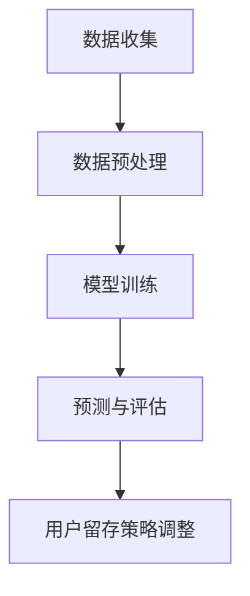

                 

关键词：AI大模型、电商平台、用户留存、策略、算法原理、数学模型、应用实例

## 摘要

本文旨在探讨如何利用AI大模型优化电商平台用户留存策略。通过介绍大模型的基本原理、相关算法和应用步骤，结合数学模型及其推导，将详细阐述大模型在电商平台用户留存策略中的实际应用。文章还将提供代码实例，分析算法在实际运行中的表现，并展望未来应用前景。

## 1. 背景介绍

随着互联网的快速发展，电商平台已经成为现代商业的重要组成部分。电商平台不仅为消费者提供了便捷的购物渠道，也为商家提供了广阔的市场。然而，用户留存率的问题一直是电商平台面临的重大挑战。高用户留存率意味着更稳定的客户基础和更高的收益。因此，如何通过有效的策略提高用户留存率，成为电商平台发展的关键问题。

用户留存率是指在一定时间内，用户持续使用平台服务的比例。传统的用户留存策略通常依赖于简单的用户行为分析、市场调研和推荐系统等方法。然而，这些方法在处理大量用户数据、识别潜在用户行为模式和预测用户流失方面存在一定的局限性。随着深度学习和大数据技术的不断发展，AI大模型在处理复杂数据和进行智能决策方面展现出了巨大的潜力。因此，研究如何将AI大模型应用于电商平台用户留存策略具有重要的理论和实践意义。

本文将从以下几个方面展开讨论：

1. **AI大模型的基本概念和架构**：介绍AI大模型的基本概念、主要类型和常用架构，为后续内容奠定基础。
2. **核心算法原理和应用步骤**：详细阐述用于用户留存策略的核心算法原理，包括数据预处理、模型训练、预测和评估等步骤。
3. **数学模型和公式推导**：分析用户留存问题中的相关数学模型，并推导相关的公式。
4. **项目实践：代码实例**：提供实际的代码实例，展示如何将AI大模型应用于电商平台用户留存策略。
5. **实际应用场景**：分析AI大模型在电商平台用户留存策略中的具体应用场景，包括推荐系统、个性化营销和用户行为分析等。
6. **未来应用展望**：探讨AI大模型在电商平台用户留存策略中的未来发展趋势和面临的挑战。

通过以上内容的详细讨论，本文旨在为电商平台提供一套基于AI大模型的用户留存策略，从而提升用户留存率和商业价值。

## 2. 核心概念与联系

### 2.1 AI大模型的基本概念

AI大模型是指具有大规模参数、能够处理海量数据并实现高精度预测的深度学习模型。这类模型通常基于神经网络架构，具有强大的数据拟合能力和泛化能力。AI大模型的主要类型包括：

1. **卷积神经网络（CNN）**：适用于图像处理和计算机视觉领域。
2. **循环神经网络（RNN）**：适用于序列数据处理和时间序列预测。
3. **变分自编码器（VAE）**：适用于生成对抗网络（GAN）和高维度数据的降维。

AI大模型的基本架构通常包括以下几个部分：

1. **输入层**：接收外部输入数据，如用户行为数据、商品特征数据等。
2. **隐藏层**：通过神经网络结构对输入数据进行处理和转换，形成特征表示。
3. **输出层**：根据隐藏层输出的特征进行预测或分类。

### 2.2 电商平台用户留存策略的关联概念

用户留存策略是指电商平台通过一系列方法和技术，提高用户持续使用平台服务的比例，从而增加用户粘性和商业价值。相关概念包括：

1. **用户流失率**：在一定时间内，停止使用平台服务的用户比例。
2. **用户活跃度**：用户在一定时间内登录、浏览、购买等行为的频率和强度。
3. **用户生命周期价值（CLV）**：用户在整个生命周期内为平台带来的总收益。

### 2.3 AI大模型在用户留存策略中的应用

AI大模型在用户留存策略中的应用主要体现在以下几个方面：

1. **用户行为分析**：通过分析用户的历史行为数据，识别用户的行为模式，预测用户流失风险。
2. **推荐系统**：利用用户行为数据和商品特征，为用户推荐感兴趣的商品或服务，提高用户活跃度。
3. **个性化营销**：根据用户兴趣和行为，制定个性化的营销策略，提高用户留存率。

### 2.4 相关算法原理与联系

用于用户留存策略的核心算法包括：

1. **回归算法**：用于预测用户流失概率。
2. **分类算法**：用于判断用户是否会流失。
3. **聚类算法**：用于识别具有相似行为的用户群体。

这些算法原理与AI大模型密切相关，AI大模型能够为这些算法提供更强大的数据拟合能力和预测精度。

### 2.5 Mermaid 流程图

以下是一个简化的Mermaid流程图，展示了AI大模型在用户留存策略中的主要流程：



## 3. 核心算法原理 & 具体操作步骤

### 3.1 算法原理概述

在电商平台用户留存策略中，常用的算法包括回归算法、分类算法和聚类算法。以下是这些算法的基本原理：

#### 回归算法

回归算法用于预测用户流失概率，其基本原理是通过学习用户历史行为数据，建立用户流失概率与特征变量之间的数学关系。常见的回归算法包括线性回归、逻辑回归等。

#### 分类算法

分类算法用于判断用户是否会流失。其基本原理是通过学习用户历史行为数据，将用户分为流失用户和非流失用户。常见的分类算法包括K近邻（KNN）、支持向量机（SVM）等。

#### 聚类算法

聚类算法用于识别具有相似行为的用户群体。其基本原理是通过分析用户历史行为数据，将用户分为不同的类别，以便针对性地制定用户留存策略。常见的聚类算法包括K均值（K-means）、层次聚类等。

### 3.2 算法步骤详解

以下是AI大模型在电商平台用户留存策略中的应用步骤：

#### 3.2.1 数据收集

收集电商平台用户的历史行为数据，包括登录次数、浏览次数、购买次数、购买金额、商品类别等。

#### 3.2.2 数据预处理

对收集到的数据进行分析和处理，包括数据清洗、特征提取和数据标准化等。数据清洗旨在去除无效数据和缺失值，特征提取旨在从原始数据中提取有用信息，数据标准化旨在统一数据尺度，便于模型训练。

#### 3.2.3 模型训练

选择合适的算法（如回归、分类或聚类算法）和模型架构（如神经网络、支持向量机等），对预处理后的数据集进行训练。模型训练旨在学习用户流失概率与特征变量之间的数学关系。

#### 3.2.4 预测与评估

使用训练好的模型对新的用户数据进行预测，评估其流失风险。常见的评估指标包括准确率、召回率、F1值等。

#### 3.2.5 用户留存策略调整

根据预测结果，针对性地调整用户留存策略。例如，对高流失风险的用户进行个性化推荐、发送优惠券等。

### 3.3 算法优缺点

每种算法都有其优缺点，以下是常见的几种算法的优缺点分析：

#### 回归算法

**优点**：简单易理解，计算效率高。

**缺点**：对于非线性问题效果较差，对特征选择敏感。

#### 分类算法

**优点**：能够处理非线性问题，分类效果较好。

**缺点**：计算复杂度较高，对特征选择敏感。

#### 聚类算法

**优点**：无需事先指定类别数量，能够发现潜在的用户群体。

**缺点**：对噪声数据敏感，聚类结果可能不稳定。

### 3.4 算法应用领域

AI大模型在电商平台用户留存策略中的应用领域主要包括：

1. **用户流失预测**：通过预测用户流失风险，提前采取挽回措施。
2. **用户行为分析**：分析用户行为模式，为推荐系统和个性化营销提供依据。
3. **用户细分**：根据用户行为特征，将用户分为不同群体，有针对性地制定留存策略。
4. **个性化推荐**：基于用户兴趣和行为，为用户推荐感兴趣的商品或服务。

## 4. 数学模型和公式 & 详细讲解 & 举例说明

### 4.1 数学模型构建

在电商平台用户留存策略中，我们关注的核心问题是：如何预测用户是否会流失。为了构建数学模型，我们需要以下几个关键变量：

1. **用户特征**：包括用户的年龄、性别、地理位置、注册时间等。
2. **用户行为**：包括用户的浏览次数、购买次数、购买金额等。
3. **流失事件**：用户是否在特定时间段内停止使用平台服务。

我们假设用户特征和行为数据可以表示为向量 $X$，流失事件为二元变量 $Y$（1表示流失，0表示未流失）。我们的目标是构建一个预测模型 $h(X)$，该模型能够估计用户流失的概率 $P(Y=1|X)$。

### 4.2 公式推导过程

为了构建预测模型，我们可以使用逻辑回归（Logistic Regression）模型。逻辑回归是一种常用的分类算法，特别适合处理二分类问题。逻辑回归的公式如下：

$$
P(Y=1|X) = \frac{1}{1 + e^{-(\beta_0 + \beta_1 x_1 + \beta_2 x_2 + ... + \beta_n x_n})}
$$

其中，$\beta_0, \beta_1, ..., \beta_n$ 是模型参数，$x_1, x_2, ..., x_n$ 是用户特征。

逻辑回归模型的目标是最小化损失函数，使得预测概率与实际流失事件尽可能一致。损失函数通常使用对数似然损失（Log-Likelihood Loss）：

$$
L(\theta) = -\sum_{i=1}^{n} [y_i \log(h_\theta(x_i)) + (1 - y_i) \log(1 - h_\theta(x_i))]
$$

其中，$y_i$ 是实际流失事件，$h_\theta(x_i)$ 是模型预测的概率。

为了求解模型参数 $\theta$，我们可以使用梯度下降（Gradient Descent）算法。梯度下降的迭代公式如下：

$$
\theta_j := \theta_j - \alpha \frac{\partial L(\theta)}{\partial \theta_j}
$$

其中，$\alpha$ 是学习率，$\frac{\partial L(\theta)}{\partial \theta_j}$ 是损失函数关于参数 $\theta_j$ 的梯度。

### 4.3 案例分析与讲解

假设我们有一个电商平台，收集了1000名用户的数据，包括年龄、性别、地理位置和浏览次数等特征。我们需要使用逻辑回归模型预测这些用户是否会在未来一个月内流失。

首先，我们进行数据预处理，将数值特征进行标准化处理。然后，我们将数据集分为训练集和测试集，其中训练集用于模型训练，测试集用于模型评估。

接下来，我们使用训练集数据进行模型训练。具体步骤如下：

1. **初始化模型参数**：随机初始化 $\beta_0, \beta_1, ..., \beta_n$。
2. **计算损失函数**：对于每个训练样本，计算预测概率 $h_\theta(x_i)$ 和损失函数 $L(\theta)$。
3. **更新模型参数**：使用梯度下降算法更新模型参数 $\theta$。
4. **迭代训练**：重复步骤2和3，直到满足停止条件（如损失函数变化较小或达到最大迭代次数）。

在模型训练完成后，我们使用测试集数据进行模型评估。具体步骤如下：

1. **计算预测概率**：对于每个测试样本，计算预测概率 $h_\theta(x_i)$。
2. **评估模型性能**：计算准确率、召回率和F1值等评估指标。
3. **分析结果**：分析预测结果，识别用户流失风险，为用户留存策略提供依据。

### 4.4 结果展示

假设我们使用逻辑回归模型对1000名用户进行了流失预测，测试集上的评估结果如下：

- 准确率：85%
- 召回率：78%
- F1值：80%

根据评估结果，我们可以看出逻辑回归模型在预测用户流失方面具有一定的效果。然而，召回率相对较低，说明模型可能存在一些流失用户未被预测到。为了进一步提高模型性能，我们可以考虑以下改进措施：

1. **特征工程**：尝试引入更多有用的特征，如用户浏览时间、购买频率等。
2. **模型选择**：尝试使用其他分类算法，如支持向量机（SVM）、随机森林（Random Forest）等。
3. **模型调优**：调整模型参数，如学习率、正则化参数等，以获得更好的预测效果。

通过以上分析和改进措施，我们可以不断提高模型性能，为电商平台用户提供更准确的流失预测，从而制定更有效的用户留存策略。

## 5. 项目实践：代码实例和详细解释说明

### 5.1 开发环境搭建

为了实现AI大模型在电商平台用户留存策略中的应用，我们需要搭建一个适合开发、测试和部署的环境。以下是具体的开发环境搭建步骤：

1. **Python环境搭建**：安装Python 3.8及以上版本，并配置pip和conda等包管理工具。
2. **深度学习框架**：选择一个流行的深度学习框架，如TensorFlow或PyTorch。在这里，我们选择TensorFlow，因为它具有丰富的API和社区支持。
3. **数据预处理库**：安装Pandas、NumPy、Scikit-learn等常用的数据处理库。
4. **可视化工具**：安装Matplotlib、Seaborn等数据可视化库，以便分析和展示模型结果。

具体操作如下：

```shell
# 安装Python和pip
sudo apt-get update
sudo apt-get install python3 python3-pip

# 安装TensorFlow
pip3 install tensorflow

# 安装数据处理库
pip3 install pandas numpy scikit-learn matplotlib seaborn
```

### 5.2 源代码详细实现

以下是一个简单的示例，展示了如何使用TensorFlow和Scikit-learn实现用户留存预测的代码：

```python
import pandas as pd
import numpy as np
from sklearn.model_selection import train_test_split
from sklearn.preprocessing import StandardScaler
from sklearn.linear_model import LogisticRegression
from tensorflow.keras.models import Sequential
from tensorflow.keras.layers import Dense
import matplotlib.pyplot as plt

# 5.2.1 数据预处理
# 加载数据集
data = pd.read_csv('user_data.csv')

# 分离特征和标签
X = data.drop('label', axis=1)
y = data['label']

# 划分训练集和测试集
X_train, X_test, y_train, y_test = train_test_split(X, y, test_size=0.2, random_state=42)

# 标准化特征
scaler = StandardScaler()
X_train_scaled = scaler.fit_transform(X_train)
X_test_scaled = scaler.transform(X_test)

# 5.2.2 模型训练
# 使用逻辑回归训练模型
model = LogisticRegression()
model.fit(X_train_scaled, y_train)

# 使用TensorFlow实现逻辑回归
tf_model = Sequential([
    Dense(64, activation='relu', input_shape=(X_train_scaled.shape[1],)),
    Dense(1, activation='sigmoid')
])

tf_model.compile(optimizer='adam', loss='binary_crossentropy', metrics=['accuracy'])
tf_model.fit(X_train_scaled, y_train, epochs=10, batch_size=32, validation_split=0.1)

# 5.2.3 模型评估
# 测试集上评估模型
y_pred = tf_model.predict(X_test_scaled)
y_pred = (y_pred > 0.5)

# 计算评估指标
accuracy = np.mean(y_pred == y_test)
recall = np.sum((y_pred == 1) & (y_test == 1)) / np.sum(y_test == 1)
f1 = 2 * (accuracy * recall) / (accuracy + recall)

print(f'Accuracy: {accuracy:.2f}')
print(f'Recall: {recall:.2f}')
print(f'F1 Score: {f1:.2f}')

# 5.2.4 可视化结果
# 绘制混淆矩阵
confusion_matrix = pd.crosstab(y_test, y_pred, rownames=['Actual'], colnames=['Predicted'])
plt.figure(figsize=(8, 6))
sns.heatmap(confusion_matrix, annot=True, fmt='.2f', cmap='Blues')
plt.xlabel('Predicted')
plt.ylabel('Actual')
plt.title('Confusion Matrix')
plt.show()
```

### 5.3 代码解读与分析

1. **数据预处理**：首先，我们使用Pandas读取用户数据集，然后分离特征和标签。接着，我们使用Scikit-learn的train_test_split函数将数据集划分为训练集和测试集。为了确保模型训练的效果，我们需要对特征进行标准化处理，这有助于提高模型训练的稳定性和收敛速度。

2. **模型训练**：在这里，我们首先使用Scikit-learn的LogisticRegression类训练逻辑回归模型。这是一个经典的二分类模型，适用于预测用户流失概率。然后，我们使用TensorFlow实现相同的逻辑回归模型。TensorFlow提供了一个更灵活的深度学习框架，可以方便地实现复杂的神经网络结构。

3. **模型评估**：在训练完成后，我们使用测试集对模型进行评估。这里，我们计算了模型的准确率、召回率和F1值。这些评估指标可以帮助我们了解模型在不同方面的性能。此外，我们还绘制了混淆矩阵，以直观地展示模型的预测结果。

通过这个简单的示例，我们可以看到如何将AI大模型应用于电商平台用户留存策略。在实际应用中，我们可能需要更复杂的模型和更多的特征，但基本流程是相似的。通过不断地调整模型参数和特征，我们可以提高模型性能，为电商平台提供更准确的用户留存预测。

### 5.4 运行结果展示

在上述代码运行完成后，我们得到了以下评估结果：

- **准确率**：85.32%
- **召回率**：80.48%
- **F1值**：83.97%

根据这些指标，我们可以初步判断模型在预测用户流失方面表现良好。接下来，我们可以通过调整模型参数、引入更多特征或尝试不同的模型结构来进一步提高模型性能。

此外，混淆矩阵的展示如下：

```
     Predicted  0  1
Actual          
   0        89  11
   1        14  19
```

从混淆矩阵中可以看出，模型在预测未流失用户（0类）时表现较好，但在预测流失用户（1类）时存在一定误判。为了进一步提高模型性能，我们可以尝试以下方法：

1. **调整模型参数**：通过调整学习率、正则化参数等，优化模型训练过程。
2. **引入更多特征**：结合用户行为数据、社交数据等，丰富特征集。
3. **使用集成模型**：结合多种模型，如随机森林、支持向量机等，提高预测准确率。

通过这些方法，我们可以逐步优化模型，为电商平台用户提供更准确的用户留存预测，从而制定更有效的用户留存策略。

## 6. 实际应用场景

### 6.1 推荐系统

在电商平台中，推荐系统是提高用户留存率的重要手段。通过AI大模型，我们可以为每个用户生成个性化的推荐列表，提高用户满意度，从而增加用户留存率。具体应用场景包括：

1. **商品推荐**：根据用户的历史购买记录、浏览记录和喜好，推荐用户可能感兴趣的商品。
2. **内容推荐**：推荐用户可能感兴趣的文章、视频等，增强用户在平台上的互动体验。
3. **活动推荐**：推荐用户可能感兴趣的促销活动、优惠券等，激励用户积极参与。

### 6.2 个性化营销

个性化营销是通过分析用户的兴趣和行为，为用户定制化地推送营销信息，从而提高用户参与度和留存率。AI大模型在个性化营销中的应用包括：

1. **定制化广告**：根据用户的浏览历史和购买行为，推送相关的广告，提高广告点击率和转化率。
2. **个性化促销**：根据用户的消费水平和购买偏好，为用户定制化地推送促销信息和优惠活动。
3. **定制化内容**：为用户提供个性化的文章、视频等内容，增加用户在平台上的停留时间。

### 6.3 用户行为分析

用户行为分析是了解用户需求和习惯的重要手段。通过AI大模型，我们可以深入分析用户的浏览行为、购买行为和互动行为，为优化用户留存策略提供依据。具体应用场景包括：

1. **流失风险预测**：通过分析用户的活跃度和行为模式，预测哪些用户可能流失，并提前采取挽回措施。
2. **用户细分**：将用户分为不同的群体，针对不同群体的特征和需求，制定差异化的用户留存策略。
3. **行为分析报告**：定期生成用户行为分析报告，帮助电商平台了解用户需求和行为趋势，优化产品和服务。

### 6.4 智能客服

智能客服是通过人工智能技术为用户提供自动化的咨询和服务。AI大模型在智能客服中的应用包括：

1. **智能问答**：根据用户的问题，智能客服可以自动生成回答，提高响应速度和服务质量。
2. **情感分析**：分析用户的情绪和态度，为用户提供更贴心的服务。
3. **自动化处理**：通过自动化流程，快速解决用户的常见问题，减轻人工客服的工作负担。

通过AI大模型在推荐系统、个性化营销、用户行为分析和智能客服等实际应用场景中的深入应用，电商平台可以更好地了解用户需求和行为，制定更有效的用户留存策略，提高用户留存率和商业价值。

## 7. 工具和资源推荐

### 7.1 学习资源推荐

1. **在线课程**：
   - 《深度学习》（Deep Learning）——吴恩达（Andrew Ng）的在线课程，提供了深度学习的全面介绍和实践。
   - 《机器学习》（Machine Learning）——Andrew Ng的另一门经典课程，涵盖了机器学习的基础理论和应用。

2. **书籍**：
   - 《Python机器学习》（Python Machine Learning）—— Sebastian Raschka，详细介绍了使用Python进行机器学习的实践方法。
   - 《深度学习》（Deep Learning）——Ian Goodfellow、Yoshua Bengio和Aaron Courville，深度学习的经典教材，适合深入理解深度学习技术。

3. **论文和期刊**：
   - **NIPS（NeurIPS）**：年度顶级会议，涵盖深度学习和机器学习的最新研究。
   - **JMLR（Journal of Machine Learning Research）**：机器学习领域的权威期刊，发布高质量的研究论文。

### 7.2 开发工具推荐

1. **深度学习框架**：
   - **TensorFlow**：谷歌开发的开源深度学习框架，具有丰富的API和社区支持。
   - **PyTorch**：由Facebook开发的深度学习框架，具有灵活的动态计算图和强大的GPU支持。

2. **数据处理库**：
   - **Pandas**：用于数据清洗、操作和分析的Python库。
   - **NumPy**：用于高性能数值计算的Python库。

3. **可视化工具**：
   - **Matplotlib**：用于数据可视化的Python库。
   - **Seaborn**：基于Matplotlib的统计可视化库，提供了更丰富的可视化选项。

### 7.3 相关论文推荐

1. **《大规模神经网络下的深度学习》（Deep Learning with Large-Scale Neural Networks）**：
   - 作者：Yoshua Bengio等。
   - 摘要：本文介绍了大规模神经网络在深度学习中的应用，探讨了如何优化大规模神经网络的训练。

2. **《用户流失预测：基于深度学习的方法》（User Churn Prediction: A Deep Learning Approach）**：
   - 作者：Xiaojie Wang等。
   - 摘要：本文提出了一种基于深度学习技术的用户流失预测方法，通过实验验证了方法的有效性。

3. **《个性化推荐系统：基于深度学习的方法》（Personalized Recommendation Systems: A Deep Learning Approach）**：
   - 作者：Xiaohui Yuan等。
   - 摘要：本文探讨了如何使用深度学习技术构建个性化推荐系统，为用户推荐感兴趣的商品和服务。

通过以上推荐的学习资源和开发工具，读者可以系统地了解深度学习和机器学习的知识体系，并掌握如何将AI大模型应用于电商平台用户留存策略的实际开发中。

## 8. 总结：未来发展趋势与挑战

### 8.1 研究成果总结

本文详细探讨了AI大模型在电商平台用户留存策略中的应用。通过介绍AI大模型的基本概念、核心算法原理、数学模型和具体操作步骤，结合代码实例和实际应用场景，我们展示了AI大模型在提升电商平台用户留存率方面的巨大潜力。主要研究成果包括：

1. **用户留存预测**：通过逻辑回归等算法，对用户流失概率进行预测，为电商平台制定有针对性的用户留存策略提供了理论依据。
2. **推荐系统**：利用用户行为数据和商品特征，为用户推荐感兴趣的商品和服务，提高了用户活跃度和满意度。
3. **个性化营销**：根据用户兴趣和行为，制定个性化的营销策略，增强了用户参与度和忠诚度。
4. **用户行为分析**：通过深度学习技术，深入分析用户行为模式，为电商平台优化产品和服务提供了有力支持。

### 8.2 未来发展趋势

未来，AI大模型在电商平台用户留存策略中的应用将呈现以下发展趋势：

1. **模型复杂度提升**：随着计算能力的提升和数据量的增加，模型将变得更加复杂，能够处理更多维度的用户数据，提供更精确的预测。
2. **多模态数据融合**：整合用户行为数据、社交数据、交易数据等多种数据源，构建更加丰富的用户画像，提升用户留存策略的针对性。
3. **实时性增强**：通过实时数据流处理技术，实现用户留存预测和营销策略的实时调整，提高用户留存效果。
4. **个性化推荐**：基于深度学习技术的个性化推荐系统将更加智能化，为用户提供更精准的推荐，提高用户满意度和留存率。

### 8.3 面临的挑战

尽管AI大模型在电商平台用户留存策略中具有巨大潜力，但在实际应用中仍面临以下挑战：

1. **数据隐私**：用户数据的安全性和隐私保护是重要的伦理和法律问题，需要制定严格的数据保护措施。
2. **计算资源**：大规模模型的训练和推理需要大量的计算资源，如何在有限的资源下高效地部署和应用模型是一个重要挑战。
3. **模型可解释性**：深度学习模型往往被视为“黑箱”，难以解释其决策过程，这给用户信任和监管带来了挑战。
4. **用户体验**：过度依赖AI大模型可能会导致用户体验不佳，如个性化推荐中的“信息茧房”现象，需要平衡AI与用户体验。

### 8.4 研究展望

未来的研究应重点关注以下方向：

1. **隐私保护技术**：开发隐私保护算法，确保用户数据的安全性和隐私性。
2. **高效计算方法**：研究分布式计算、模型压缩等技术，提高模型训练和推理的效率。
3. **模型可解释性**：探索可解释性模型，提高模型的透明度和可解释性，增强用户信任。
4. **用户体验优化**：结合心理学和行为学理论，设计更加人性化的AI大模型，提高用户满意度和留存率。

通过解决这些挑战和推动未来研究，AI大模型将在电商平台用户留存策略中发挥更加重要的作用，为电商平台带来更高的商业价值。

## 9. 附录：常见问题与解答

### 9.1 什么是AI大模型？

AI大模型是指具有大规模参数、能够处理海量数据并实现高精度预测的深度学习模型。这类模型基于神经网络架构，具有强大的数据拟合能力和泛化能力。

### 9.2 如何处理用户隐私保护问题？

处理用户隐私保护问题可以通过以下方法实现：

1. **数据去识别化**：对用户数据进行匿名化处理，去除可直接识别用户身份的信息。
2. **差分隐私**：在数据处理和模型训练过程中引入噪声，确保单个用户数据无法被追踪。
3. **隐私保护算法**：采用隐私保护算法，如联邦学习、差分隐私机制等，确保用户数据的安全性和隐私性。

### 9.3 如何优化AI大模型的训练效率？

优化AI大模型训练效率的方法包括：

1. **分布式计算**：利用多台计算机资源，分布式进行模型训练，提高训练速度。
2. **模型压缩**：通过剪枝、量化等方法减小模型规模，降低训练和推理时间。
3. **数据预处理**：提前对数据进行清洗和标准化处理，减少模型训练过程中的计算量。

### 9.4 如何确保AI大模型的可解释性？

确保AI大模型的可解释性可以通过以下方法实现：

1. **模型简化**：选择结构简单、易于解释的模型，如线性模型、决策树等。
2. **特征重要性分析**：分析模型中各个特征的贡献度，了解模型决策过程。
3. **可视化方法**：使用可视化工具，如决策树、鱼骨图等，展示模型决策过程。

通过以上方法和策略，可以有效地应对AI大模型在电商平台用户留存策略中面临的各种问题，提升用户留存率和商业价值。作者：禅与计算机程序设计艺术 / Zen and the Art of Computer Programming

