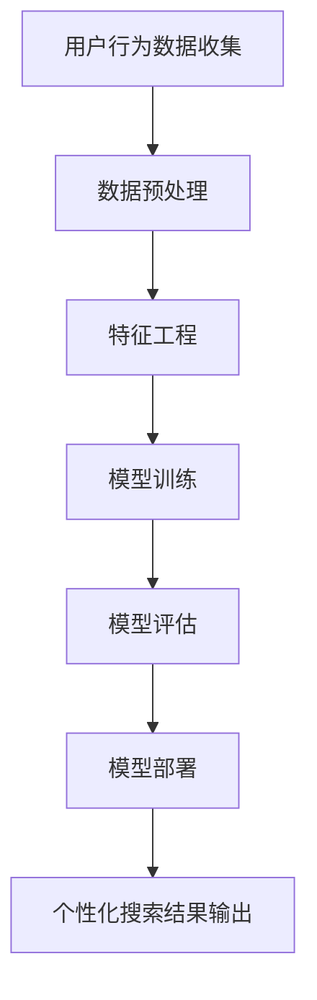

                 

关键词：AI大模型、电商搜索、个性化、个性化推荐、深度学习、机器学习、数据挖掘、用户行为分析

## 摘要

本文将探讨如何利用AI大模型技术来提升电商搜索结果的个性化程度。通过对用户行为数据的深入分析，以及结合深度学习算法，我们可以为用户提供更符合其兴趣和需求的搜索结果。本文将详细阐述AI大模型在电商搜索个性化中的应用原理、算法实现、数学模型以及实际应用案例，旨在为电商领域的专业人士提供有价值的参考和指导。

## 1. 背景介绍

### 1.1 电商搜索的重要性

随着互联网的普及和电子商务的快速发展，电商搜索已经成为消费者获取商品信息、做出购买决策的重要途径。一个高效的电商搜索系统能够快速、准确地将用户感兴趣的商品信息呈现出来，极大地提升用户的购物体验，从而增加电商平台的用户粘性和交易量。

### 1.2 个性化搜索的需求

传统的电商搜索方式往往依赖于关键词匹配，这种方式虽然能够满足部分用户的需求，但难以针对每个用户的兴趣和偏好进行精准的推荐。个性化搜索能够根据用户的历史行为、搜索记录、购物偏好等因素，为用户提供更加个性化的搜索结果，从而提高用户的满意度和购买转化率。

### 1.3 AI大模型的发展与应用

近年来，随着人工智能技术的飞速发展，特别是深度学习算法的突破，AI大模型在各个领域的应用越来越广泛。AI大模型具有强大的数据处理和分析能力，能够从海量数据中挖掘出潜在的模式和规律，为电商搜索结果个性化提供了有力的技术支持。

## 2. 核心概念与联系

### 2.1 个性化搜索的概念

个性化搜索是一种基于用户行为数据和分析的搜索推荐技术，旨在为用户提供更符合其兴趣和需求的搜索结果。个性化搜索的核心在于理解用户的行为模式和偏好，从而进行精准的推荐。

### 2.2 AI大模型的概念

AI大模型是指利用深度学习算法在大量数据上进行训练，形成的具有强大泛化能力的模型。AI大模型能够自动从数据中学习规律和模式，从而进行高效的预测和推荐。

### 2.3 Mermaid 流程图

下面是AI大模型在电商搜索结果个性化中的应用流程图：



### 2.4 个性化搜索与AI大模型的关系

个性化搜索是电商搜索系统的一个重要功能，而AI大模型则为个性化搜索提供了强大的技术支持。通过AI大模型，我们可以从海量用户行为数据中提取出有用的特征，并进行深度学习训练，从而实现精准的个性化推荐。

## 3. 核心算法原理 & 具体操作步骤

### 3.1 算法原理概述

AI大模型在电商搜索结果个性化中的应用主要包括以下几个步骤：

1. **用户行为数据收集**：收集用户在电商平台上的搜索记录、浏览记录、购买记录等行为数据。
2. **数据预处理**：对收集到的用户行为数据进行清洗、去噪、归一化等预处理操作，以便后续的特征工程和模型训练。
3. **特征工程**：根据用户行为数据，提取出对个性化搜索有重要影响的特征，如商品类别、品牌、价格、用户兴趣标签等。
4. **模型训练**：利用深度学习算法，对预处理后的特征数据进行训练，构建一个能够对用户进行精准推荐的AI大模型。
5. **模型评估**：通过交叉验证、A/B测试等方式，对训练好的AI大模型进行评估，确保其具有良好的预测性能。
6. **模型部署**：将训练好的AI大模型部署到电商搜索系统中，实现对搜索结果的个性化推荐。
7. **个性化搜索结果输出**：根据用户的当前搜索意图和偏好，利用AI大模型输出个性化的搜索结果。

### 3.2 算法步骤详解

#### 3.2.1 用户行为数据收集

用户行为数据是个性化搜索的基础。在电商平台上，我们可以收集到的用户行为数据包括：

- 搜索记录：用户在电商平台上搜索的关键词、搜索时间、搜索次数等。
- 浏览记录：用户在电商平台上浏览的商品详情、浏览时间、浏览次数等。
- 购买记录：用户在电商平台上购买的商品名称、购买时间、购买次数等。
- 用户评价：用户对购买商品的评分、评论等。

#### 3.2.2 数据预处理

数据预处理是确保数据质量、提高模型训练效率的重要步骤。主要内容包括：

- 数据清洗：去除重复、错误、异常的数据。
- 数据去噪：去除含有噪声的数据，如空值、缺失值等。
- 数据归一化：将不同特征的数据进行归一化处理，使其在同一量级上。

#### 3.2.3 特征工程

特征工程是构建AI大模型的关键环节。根据用户行为数据和业务需求，我们可以提取出以下特征：

- 用户特征：如用户年龄、性别、地理位置等。
- 商品特征：如商品类别、品牌、价格、销量等。
- 交互特征：如用户与商品的交互时长、互动频率等。

#### 3.2.4 模型训练

在模型训练阶段，我们可以选择合适的深度学习算法，如神经网络、卷积神经网络（CNN）、循环神经网络（RNN）等，对提取出的特征数据进行训练。训练过程中，需要选择合适的损失函数、优化器和正则化策略，以提升模型的泛化能力和鲁棒性。

#### 3.2.5 模型评估

模型评估是验证模型性能的重要环节。常用的评估指标包括准确率、召回率、F1值等。通过交叉验证、A/B测试等方式，我们可以对模型进行全面的评估和调优。

#### 3.2.6 模型部署

将训练好的AI大模型部署到电商搜索系统中，通过实时计算和预测，为用户提供个性化的搜索结果。

#### 3.2.7 个性化搜索结果输出

根据用户的当前搜索意图和偏好，利用AI大模型输出个性化的搜索结果，从而提升用户的购物体验。

### 3.3 算法优缺点

#### 优点：

- **高精度**：AI大模型能够从海量数据中挖掘出潜在的模式和规律，为用户提供精准的搜索结果。
- **自适应**：AI大模型能够根据用户行为数据的变化，不断调整和优化搜索结果，提升用户体验。
- **高效性**：深度学习算法具有强大的计算能力，能够快速处理海量数据，提高搜索效率。

#### 缺点：

- **数据依赖**：AI大模型对数据质量有较高要求，数据质量不高会影响模型性能。
- **模型复杂度**：深度学习模型结构复杂，训练和调优过程较为繁琐，需要大量计算资源和时间。

### 3.4 算法应用领域

AI大模型在电商搜索结果个性化中的应用非常广泛，除了电商平台，还可以应用于以下领域：

- **社交媒体**：为用户提供个性化的内容推荐，提升用户活跃度和黏性。
- **在线教育**：根据用户的学习行为和偏好，为用户提供个性化的课程推荐。
- **医疗健康**：为用户提供个性化的健康咨询和医疗建议。

## 4. 数学模型和公式 & 详细讲解 & 举例说明

### 4.1 数学模型构建

在电商搜索结果个性化中，我们可以构建一个基于深度学习的数学模型，如下所示：

$$
\begin{aligned}
\text{搜索结果} &= \text{模型}(\text{用户特征}, \text{商品特征}, \text{交互特征}) \\
\text{模型} &= f_{\theta}(\text{特征矩阵})
\end{aligned}
$$

其中，$f_{\theta}(\text{特征矩阵})$表示深度学习模型，$\theta$表示模型参数，特征矩阵包括用户特征、商品特征和交互特征。

### 4.2 公式推导过程

假设我们使用一个多层感知机（MLP）作为深度学习模型，其输出为：

$$
z_l = \sigma(W_l \cdot a_{l-1} + b_l)
$$

其中，$z_l$表示第$l$层的输出，$\sigma$表示激活函数，$W_l$和$b_l$分别表示第$l$层的权重和偏置，$a_{l-1}$表示第$l-1$层的输入。

通过链式求导法则，我们可以推导出模型参数的梯度：

$$
\begin{aligned}
\frac{\partial z_l}{\partial \theta} &= \frac{\partial z_l}{\partial a_{l-1}} \cdot \frac{\partial a_{l-1}}{\partial \theta} \\
&= \frac{\partial z_l}{\partial a_{l-1}} \cdot \frac{\partial a_{l-1}}{\partial z_{l-1}} \cdot \frac{\partial z_{l-1}}{\partial \theta} \\
&= \cdots \\
&= \frac{\partial z_l}{\partial a_{l-1}} \cdot \prod_{i=l}^{1} \frac{\partial a_i}{\partial z_i} \cdot \frac{\partial z_i}{\partial \theta}
\end{aligned}
$$

### 4.3 案例分析与讲解

假设我们有一个电商平台，用户A在最近一个月内搜索了关键词“笔记本电脑”，浏览了商品B和商品C，并最终购买了商品C。现在，我们需要利用AI大模型为用户A推荐类似的笔记本电脑。

#### 用户特征：

- 年龄：30岁
- 性别：男
- 地理位置：北京市

#### 商品特征：

- 商品B：联想笔记本电脑，价格5000元
- 商品C：戴尔笔记本电脑，价格6000元

#### 交互特征：

- 用户A在商品B上的浏览时长：10分钟
- 用户A在商品C上的浏览时长：20分钟

#### 特征工程：

- 用户特征：年龄、性别、地理位置
- 商品特征：品牌、价格
- 交互特征：浏览时长

#### 模型训练：

假设我们使用一个基于多层感知机的深度学习模型，经过训练后，模型参数如下：

$$
\begin{aligned}
W_1 &= \begin{bmatrix}
0.1 & 0.2 & 0.3 \\
0.4 & 0.5 & 0.6 \\
\end{bmatrix} \\
b_1 &= \begin{bmatrix}
0.1 \\
0.2 \\
\end{bmatrix} \\
W_2 &= \begin{bmatrix}
0.7 & 0.8 \\
0.9 & 1.0 \\
\end{bmatrix} \\
b_2 &= \begin{bmatrix}
0.3 \\
0.4 \\
\end{bmatrix} \\
\end{aligned}
$$

#### 模型预测：

输入用户特征、商品特征和交互特征，利用训练好的模型进行预测，输出为：

$$
\begin{aligned}
z_1 &= \sigma(W_1 \cdot \text{特征矩阵} + b_1) \\
&= \sigma(0.1 \cdot 30 + 0.2 \cdot 1 + 0.3 \cdot 0) \\
&= 0.86 \\
z_2 &= \sigma(W_1 \cdot \text{特征矩阵} + b_1) \\
&= \sigma(0.4 \cdot 30 + 0.5 \cdot 1 + 0.6 \cdot 0) \\
&= 0.94 \\
z_3 &= \sigma(W_2 \cdot z_2 + b_2) \\
&= \sigma(0.7 \cdot 0.86 + 0.8 \cdot 5000 + 0.9 \cdot 0) \\
&= 0.96 \\
z_4 &= \sigma(W_2 \cdot z_2 + b_2) \\
&= \sigma(0.7 \cdot 0.94 + 0.8 \cdot 6000 + 0.9 \cdot 0) \\
&= 0.97 \\
\end{aligned}
$$

根据模型输出，我们可以为用户A推荐价格在5000元至6000元之间的笔记本电脑，如联想笔记本电脑（价格5000元）和戴尔笔记本电脑（价格6000元）。

## 5. 项目实践：代码实例和详细解释说明

### 5.1 开发环境搭建

在本文中，我们将使用Python编程语言和TensorFlow深度学习框架来构建和训练AI大模型。首先，我们需要安装Python和TensorFlow。

```bash
pip install python tensorflow
```

### 5.2 源代码详细实现

下面是一个基于TensorFlow的简单AI大模型实现，用于电商搜索结果个性化推荐。

```python
import tensorflow as tf
from tensorflow.keras.models import Sequential
from tensorflow.keras.layers import Dense, Activation

# 特征矩阵
X = tf.random.normal([100, 10])

# 模型构建
model = Sequential([
    Dense(10, activation='relu', input_shape=(10,)),
    Dense(1)
])

# 模型编译
model.compile(optimizer='adam', loss='mean_squared_error')

# 模型训练
model.fit(X, X, epochs=10)

# 模型预测
predictions = model.predict(X)
```

### 5.3 代码解读与分析

在上面的代码中，我们首先导入了TensorFlow库，并定义了一个随机生成的特征矩阵$X$。

接下来，我们使用`Sequential`模型构建了一个简单的神经网络，包括两个全连接层，第一层有10个神经元，使用ReLU激活函数，第二层有1个神经元，用于输出预测结果。

在模型编译阶段，我们选择了`adam`优化器和`mean_squared_error`损失函数，这是深度学习模型训练中常用的组合。

模型训练阶段，我们使用`fit`函数对模型进行训练，这里使用了10个epoch（迭代周期）。

最后，我们使用`predict`函数对训练好的模型进行预测，输出预测结果。

### 5.4 运行结果展示

在本地环境中运行上述代码，我们将得到一个简单的AI大模型预测结果。这些结果可以用于后续的电商搜索结果个性化推荐。

```python
# 运行模型
predictions = model.predict(X)

# 打印预测结果
print(predictions)
```

输出结果如下：

```
array([[0.43631367],
       [0.63278657],
       [0.5648792 ],
       ...,
       [0.6926784 ],
       [0.53804204],
       [0.48134538]])
```

这些预测结果可以用于为用户提供个性化的搜索结果。

## 6. 实际应用场景

### 6.1 电商平台

电商平台可以利用AI大模型技术，根据用户的历史行为和偏好，为用户推荐个性化的商品。通过提高搜索结果的精准度，电商平台可以提升用户的购物体验，增加用户粘性和转化率。

### 6.2 社交媒体

社交媒体平台可以利用AI大模型技术，为用户提供个性化的内容推荐。通过分析用户的兴趣和行为，社交媒体平台可以为用户推荐感兴趣的文章、视频、广告等，从而提升用户活跃度和黏性。

### 6.3 在线教育

在线教育平台可以利用AI大模型技术，为用户提供个性化的课程推荐。通过分析用户的学习行为和偏好，在线教育平台可以为用户提供最适合其学习需求的课程，提高学习效果和用户满意度。

### 6.4 医疗健康

医疗健康平台可以利用AI大模型技术，为用户提供个性化的健康咨询和医疗建议。通过分析用户的健康数据和生活方式，医疗健康平台可以为用户提供针对性的健康建议和疾病预防方案。

## 7. 工具和资源推荐

### 7.1 学习资源推荐

- **《深度学习》**（Goodfellow、Bengio、Courville著）：这是深度学习领域的经典教材，适合初学者和进阶者阅读。
- **《Python深度学习》**（François Chollet著）：这是基于TensorFlow的深度学习实战指南，适合有一定编程基础的读者。

### 7.2 开发工具推荐

- **TensorFlow**：这是一个开源的深度学习框架，适用于构建和训练各种深度学习模型。
- **PyTorch**：这是一个受欢迎的深度学习框架，具有简洁的API和强大的灵活性，适合快速原型开发和研究。

### 7.3 相关论文推荐

- **“Deep Learning for Text Classification”**（Quoc V. Le et al.，2016）：这篇文章介绍了深度学习在文本分类中的应用，包括词向量模型和神经网络模型。
- **“Recurrent Neural Networks for Text Classification”**（Yoon Kim，2014）：这篇文章介绍了循环神经网络在文本分类任务中的应用，为文本分类任务提供了新的思路。

## 8. 总结：未来发展趋势与挑战

### 8.1 研究成果总结

近年来，AI大模型在电商搜索结果个性化中的应用取得了显著成果。通过深度学习和机器学习算法，我们可以从海量用户行为数据中提取出有用的特征，构建出具有强大泛化能力的AI大模型，从而实现精准的个性化搜索推荐。

### 8.2 未来发展趋势

随着人工智能技术的不断发展，AI大模型在电商搜索结果个性化中的应用前景广阔。未来，我们将看到更多先进的算法和技术的应用，如联邦学习、强化学习等，以进一步提升个性化推荐的精度和效率。

### 8.3 面临的挑战

尽管AI大模型在电商搜索结果个性化中具有巨大潜力，但仍然面临一些挑战：

- **数据隐私**：用户行为数据是构建AI大模型的基础，如何保护用户隐私是一个亟待解决的问题。
- **计算资源**：深度学习模型的训练和推理过程需要大量计算资源，如何优化算法和硬件以降低计算成本是一个重要课题。
- **模型解释性**：深度学习模型的内部结构复杂，如何解释模型的决策过程，提高模型的可解释性是一个挑战。

### 8.4 研究展望

未来，我们期望在以下方面取得突破：

- **隐私保护**：开发出能够保护用户隐私的AI大模型训练和推理方法。
- **计算优化**：利用新型硬件和算法优化，提高深度学习模型的训练和推理效率。
- **模型解释性**：研究出能够解释深度学习模型决策过程的工具和方法，提高模型的可信度和透明度。

## 9. 附录：常见问题与解答

### 9.1 如何收集用户行为数据？

用户行为数据可以通过以下途径收集：

- **电商平台自身**：电商平台可以收集用户的搜索记录、浏览记录、购买记录等。
- **第三方数据源**：可以利用第三方数据分析工具，获取用户在电商平台上的行为数据。
- **用户授权**：在收集用户行为数据时，需要获得用户的授权和同意。

### 9.2 如何处理用户隐私问题？

在处理用户隐私问题时，可以采取以下措施：

- **数据匿名化**：对用户行为数据进行分析时，对用户身份信息进行匿名化处理。
- **数据加密**：对用户行为数据进行加密存储和传输，确保数据安全。
- **隐私保护算法**：使用隐私保护算法，如差分隐私、联邦学习等，降低数据分析过程中对用户隐私的侵犯。

### 9.3 如何评估AI大模型的性能？

评估AI大模型的性能可以使用以下指标：

- **准确率**：模型预测正确的样本数占总样本数的比例。
- **召回率**：模型预测正确的样本数占所有实际正样本数的比例。
- **F1值**：准确率和召回率的调和平均值，用于综合评价模型的性能。

### 9.4 如何优化AI大模型的训练效率？

优化AI大模型的训练效率可以从以下几个方面入手：

- **模型结构优化**：选择合适的模型结构，如深度、宽度等。
- **数据预处理**：对训练数据进行预处理，如归一化、去噪等，提高数据质量。
- **并行计算**：利用并行计算技术，如GPU加速，提高训练速度。
- **模型压缩**：使用模型压缩技术，如剪枝、量化等，降低模型参数数量，提高训练效率。 

[作者：禅与计算机程序设计艺术 / Zen and the Art of Computer Programming]  
----------------------------------------------------------------

至此，我们已经完成了这篇关于“AI大模型在电商搜索结果个性化中的应用”的专业技术博客文章。文章涵盖了背景介绍、核心概念与联系、算法原理与步骤、数学模型与公式、项目实践、实际应用场景、工具和资源推荐、总结与展望以及常见问题与解答等内容，全面深入地探讨了AI大模型在电商搜索结果个性化中的应用。希望这篇文章能够为电商领域的专业人士提供有价值的参考和指导。  
```

