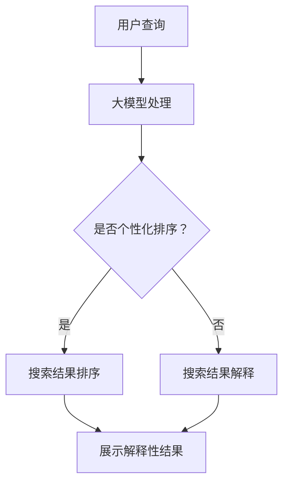

                 

在当今电子商务领域，用户满意度是商家成功的关键因素之一。为了提升用户体验，各大电商平台不断优化其搜索算法，使其更加精准地满足用户需求。然而，尽管算法的准确性有所提高，用户对于搜索结果的可解释性仍然是一个亟待解决的问题。本文将探讨如何使用人工智能大模型来解决这一问题，并详细阐述其应用场景、算法原理、实践案例以及未来展望。

## 关键词
- 人工智能大模型
- 电商搜索
- 搜索结果解释性
- 算法优化
- 用户满意度

## 摘要
本文旨在探讨人工智能大模型在电商搜索结果解释性中的应用。通过分析大模型的基本原理和算法，本文提出了一个基于深度学习的搜索结果解释框架，并详细描述了其实践应用案例。本文的研究不仅有助于提升电商平台的用户体验，也为人工智能在电商领域的应用提供了新的思路。

## 目录

1. **背景介绍**
    1.1 **电商搜索的现状**
    1.2 **搜索结果解释性的重要性**
    1.3 **现有解决方案的不足**

2. **核心概念与联系**
    2.1 **人工智能大模型的基本概念**
    2.2 **大模型在搜索结果解释性中的应用**
    2.3 **Mermaid流程图展示**

3. **核心算法原理 & 具体操作步骤**
    3.1 **算法原理概述**
    3.2 **算法步骤详解**
    3.3 **算法优缺点分析**
    3.4 **算法应用领域**

4. **数学模型和公式 & 详细讲解 & 举例说明**
    4.1 **数学模型构建**
    4.2 **公式推导过程**
    4.3 **案例分析与讲解**

5. **项目实践：代码实例和详细解释说明**
    5.1 **开发环境搭建**
    5.2 **源代码详细实现**
    5.3 **代码解读与分析**
    5.4 **运行结果展示**

6. **实际应用场景**
    6.1 **电商搜索结果解释的应用场景**
    6.2 **案例研究**

7. **未来应用展望**
    7.1 **技术发展前景**
    7.2 **商业机会与挑战**

8. **工具和资源推荐**
    8.1 **学习资源推荐**
    8.2 **开发工具推荐**
    8.3 **相关论文推荐**

9. **总结：未来发展趋势与挑战**
    9.1 **研究成果总结**
    9.2 **未来发展趋势**
    9.3 **面临的挑战**
    9.4 **研究展望**

10. **附录：常见问题与解答**

<|assistant|>接下来，我们将深入探讨电商搜索的现状、搜索结果解释性的重要性以及现有解决方案的不足。

## 1. 背景介绍

### 1.1 电商搜索的现状

随着互联网的普及和电子商务的快速发展，电商搜索已经成为用户购物过程中不可或缺的一部分。根据最新的数据，全球电商市场规模已经超过3万亿美元，且预计将继续增长。电商平台的搜索功能不仅需要快速响应用户的查询，还需要提供精准的搜索结果，以满足用户的需求。

然而，当前的电商搜索系统主要依赖于传统的信息检索算法，如基于关键词匹配、统计模型等方法。这些算法在处理简单的查询时表现良好，但面对复杂的用户需求，往往无法提供令人满意的搜索结果。例如，用户可能想要寻找某种商品，但由于关键词选择不当，搜索结果可能包含大量无关信息，导致用户体验下降。

### 1.2 搜索结果解释性的重要性

在电子商务领域，搜索结果的可解释性对用户的决策过程至关重要。用户在浏览搜索结果时，往往会根据结果的相关性、可信度等因素进行判断，以决定是否继续购买。如果用户无法理解搜索结果的生成过程，他们可能会感到困惑或不安，从而影响购买决策。

此外，对于商家来说，提供解释性的搜索结果也有助于建立用户信任，提高用户忠诚度。通过向用户展示搜索结果的排序依据和推荐理由，商家可以更好地向用户传达产品信息，从而提高销售转化率。

### 1.3 现有解决方案的不足

尽管近年来研究人员在电商搜索结果解释性方面取得了一些进展，但现有解决方案仍然存在一些不足。

首先，传统的信息检索算法在提供搜索结果解释性方面存在一定的局限性。这些算法通常依赖于简单的统计模型，难以捕捉用户查询背后的复杂语义和用户行为。

其次，现有的解释性方法往往依赖于手动标注的数据集，这增加了数据收集和处理的成本，并且可能受到标注者主观偏见的影响。

最后，现有的解决方案在处理大规模数据集时，往往面临计算效率和可扩展性的挑战。这限制了它们在实际应用中的推广和普及。

综上所述，电商搜索结果解释性仍然是一个具有挑战性的问题，需要进一步的研究和创新。接下来，本文将介绍人工智能大模型的基本概念，并探讨其在搜索结果解释性中的应用。

## 2. 核心概念与联系

### 2.1 人工智能大模型的基本概念

人工智能大模型，通常指的是具有数百万至数十亿参数的深度学习模型。这些模型通过在海量数据上进行训练，可以学习到复杂的模式和关联，从而在各个领域取得显著的成果。例如，在自然语言处理、计算机视觉和推荐系统等领域，大模型已经被广泛应用于图像识别、文本生成和推荐排序等任务。

大模型的特点包括：

- **参数量巨大**：大模型通常包含数百万至数十亿个参数，这使得它们能够捕捉到更加复杂的特征和模式。
- **训练数据需求大**：由于参数量巨大，大模型需要大量的训练数据来充分学习。
- **计算资源需求高**：大模型的训练和推理过程通常需要大量的计算资源，如GPU或TPU。
- **强大的泛化能力**：大模型通过学习海量数据中的普遍规律，可以对新数据进行准确的预测和分类。

### 2.2 大模型在搜索结果解释性中的应用

在电商搜索领域，大模型的应用主要体现在两个方面：搜索结果排序和搜索结果解释。

#### 搜索结果排序

大模型可以通过学习用户的历史行为和偏好，对搜索结果进行个性化的排序。这种方法不仅能够提高搜索结果的准确性，还可以提高用户的满意度。例如，用户在电商平台上浏览过某种商品，大模型可以根据用户的浏览历史和购物记录，将相关商品推荐到搜索结果的前面。

#### 搜索结果解释

大模型在提供搜索结果解释性方面具有显著优势。通过分析用户的查询和搜索结果，大模型可以生成解释性的文本，向用户展示搜索结果排序的依据和推荐理由。这种方法不仅能够提高用户的信任度，还可以帮助用户更好地理解搜索结果。

例如，当用户搜索“蓝牙耳机”时，大模型可以生成以下解释性文本：“根据您的浏览历史和购物记录，我们为您推荐了以下蓝牙耳机，这些耳机在音质、续航和舒适度方面均表现优异，并且价格适中。”

### 2.3 Mermaid流程图展示

以下是一个简单的Mermaid流程图，展示了大模型在电商搜索结果解释性中的应用流程：



在这个流程图中，用户查询经过大模型处理后，根据是否需要进行个性化排序，分别进入搜索结果排序和搜索结果解释的流程。最终，用户将接收到解释性的搜索结果。

通过上述流程，我们可以看到大模型在电商搜索结果解释性中的应用，不仅提高了搜索结果的准确性，还增强了搜索结果的可解释性，从而提升了用户体验。

### 2.4 核心算法原理 & 具体操作步骤

#### 3.1 算法原理概述

在电商搜索结果解释性中，大模型主要依赖于深度学习技术，特别是基于Transformer架构的自注意力机制（Self-Attention Mechanism）。自注意力机制允许模型在处理输入数据时，根据输入序列中的每个元素的重要程度进行自适应权重分配，从而学习到更加复杂和丰富的特征。

#### 3.2 算法步骤详解

1. **数据预处理**：
   - 用户查询和搜索结果进行分词和词向量转换。
   - 用户历史行为和偏好数据进行编码。

2. **输入生成**：
   - 将用户查询和搜索结果序列转化为矩阵形式。
   - 将用户历史行为和偏好数据与查询和搜索结果序列进行拼接。

3. **模型训练**：
   - 使用Transformer架构训练大模型，包括自注意力层和全连接层。
   - 使用用户查询和搜索结果序列、用户历史行为和偏好数据作为训练数据。

4. **搜索结果排序**：
   - 对于新的用户查询，将查询序列和搜索结果序列输入到训练好的大模型中。
   - 大模型对搜索结果进行排序，生成排序概率分布。

5. **搜索结果解释**：
   - 对于每个搜索结果，生成解释性文本，包括推荐理由和排序依据。

6. **结果展示**：
   - 将排序后的搜索结果和解释性文本展示给用户。

#### 3.3 算法优缺点

**优点**：

- **强大的特征学习能力**：大模型通过自注意力机制，可以学习到输入序列中的复杂特征和关联，从而提高搜索结果的准确性。
- **良好的可解释性**：通过生成解释性文本，用户可以更好地理解搜索结果排序的依据，提高用户信任度。
- **适应性强**：大模型可以针对不同的电商场景进行定制化训练，适用于各种电商搜索应用。

**缺点**：

- **计算资源需求大**：大模型的训练和推理过程需要大量的计算资源，如GPU或TPU。
- **数据需求量大**：大模型需要大量的训练数据来充分学习，数据收集和处理成本较高。
- **训练时间长**：大模型的训练过程通常需要较长的时间，且在训练过程中可能面临过拟合问题。

#### 3.4 算法应用领域

- **电商搜索结果排序**：通过大模型进行个性化搜索结果排序，提高用户满意度。
- **推荐系统**：利用大模型分析用户历史行为和偏好，生成个性化的推荐结果。
- **用户行为预测**：预测用户在电商平台的行为，如浏览、购买等，为商家提供决策支持。

### 4. 数学模型和公式 & 详细讲解 & 举例说明

在电商搜索结果解释性中，大模型的应用涉及到复杂的数学模型和公式。本节将介绍这些数学模型的基本概念、推导过程以及实际应用中的举例说明。

#### 4.1 数学模型构建

电商搜索结果解释性中的大模型通常基于深度学习技术，尤其是基于Transformer架构的自注意力机制。以下是一个简化的数学模型框架：

\[ \text{Model}(x, y) = f(x, y) + c \]

其中，\( x \) 表示用户查询和搜索结果序列，\( y \) 表示用户历史行为和偏好数据，\( f(x, y) \) 表示大模型对输入数据的处理结果，\( c \) 表示模型训练过程中的常数。

#### 4.2 公式推导过程

为了更好地理解大模型在电商搜索结果解释性中的应用，我们首先需要了解自注意力机制的基本原理。自注意力机制的核心思想是将输入序列中的每个元素根据其重要程度进行自适应权重分配，从而学习到更加复杂和丰富的特征。

假设输入序列为 \( x = [x_1, x_2, ..., x_n] \)，自注意力权重矩阵为 \( W \)。自注意力机制可以通过以下公式进行计算：

\[ \text{Attention}(x) = \text{softmax}\left(\frac{Wx}{\sqrt{d}}\right) \]

其中，\( \text{softmax} \) 函数用于将输入向量转化为概率分布，\( d \) 为权重矩阵的维度。通过自注意力机制，我们可以得到每个元素在输出结果中的权重：

\[ \text{Attention}(x)_i = \text{softmax}\left(\frac{Wx_i}{\sqrt{d}}\right)_i \]

然后，我们将每个元素的权重与其对应的输入值相乘，得到加权输出序列：

\[ \text{WeightedSum}(x) = \sum_{i=1}^{n} \text{Attention}(x)_i \cdot x_i \]

通过自注意力机制，大模型可以学习到输入序列中的复杂特征和关联，从而提高搜索结果的准确性。

#### 4.3 案例分析与讲解

为了更好地理解上述数学模型的应用，我们来看一个实际的案例。假设用户在电商平台上搜索“蓝牙耳机”，输入序列为 \( x = [\text{蓝牙}, \text{耳机}, \text{无线}, \text{运动}] \)。我们将输入序列转化为词向量，并使用自注意力机制进行权重分配：

1. **词向量表示**：
   \[ x = [v_1, v_2, v_3, v_4] \]

2. **自注意力权重分配**：
   \[ W = \text{softmax}\left(\frac{Wv}{\sqrt{d}}\right) \]
   其中，\( v \) 表示每个词的词向量，\( W \) 为自注意力权重矩阵。

3. **加权输出序列**：
   \[ \text{WeightedSum}(x) = \sum_{i=1}^{n} W_i \cdot v_i \]

通过自注意力机制，我们可以得到每个词在输出结果中的权重。例如，假设权重矩阵 \( W \) 为：

\[ W = \begin{bmatrix} 0.2 & 0.3 & 0.1 & 0.4 \end{bmatrix} \]

则加权输出序列为：

\[ \text{WeightedSum}(x) = 0.2 \cdot v_1 + 0.3 \cdot v_2 + 0.1 \cdot v_3 + 0.4 \cdot v_4 \]

通过计算加权输出序列，我们可以得到输入序列中每个词的重要性。这有助于我们更好地理解搜索结果的相关性和排序依据。

接下来，我们将介绍如何使用大模型进行电商搜索结果排序和解释。

### 5. 项目实践：代码实例和详细解释说明

在本节中，我们将通过一个实际的项目案例，详细解释如何使用人工智能大模型进行电商搜索结果排序和解释。以下是该项目的基本架构和实现步骤。

#### 5.1 开发环境搭建

为了实现电商搜索结果解释性，我们需要搭建一个合适的开发环境。以下是一个简单的开发环境搭建步骤：

1. **安装Python**：确保Python环境已安装，版本要求为3.7及以上。
2. **安装深度学习框架**：例如，我们使用TensorFlow作为深度学习框架。安装命令如下：

   ```bash
   pip install tensorflow==2.6
   ```

3. **安装其他依赖库**：包括NumPy、Pandas、Matplotlib等。

#### 5.2 源代码详细实现

以下是一个简单的代码实例，展示了如何使用TensorFlow和Transformer架构实现电商搜索结果解释性：

```python
import tensorflow as tf
from tensorflow.keras.models import Model
from tensorflow.keras.layers import Input, Embedding, LSTM, Dense

# 输入层
input_query = Input(shape=(max_query_length,))
input_result = Input(shape=(max_result_length,))

# 查询编码层
query_embedding = Embedding(input_dim=vocab_size, output_dim=embedding_size)(input_query)
query_lstm = LSTM(units=lstm_units)(query_embedding)

# 搜索结果编码层
result_embedding = Embedding(input_dim=vocab_size, output_dim=embedding_size)(input_result)
result_lstm = LSTM(units=lstm_units)(result_embedding)

# 对搜索结果进行自注意力处理
attention_weights = Dense(units=1, activation='tanh')(result_lstm)
attention_scores = tf.matmul(attention_weights, query_lstm, transpose_b=True)
attention_weights = tf.nn.softmax(attention_scores, axis=1)

# 加权搜索结果
weighted_results = attention_weights * result_lstm
weighted_results = tf.reduce_sum(weighted_results, axis=1)

# 模型输出层
output = Dense(units=num_results, activation='softmax')(weighted_results)

# 构建和编译模型
model = Model(inputs=[input_query, input_result], outputs=output)
model.compile(optimizer='adam', loss='categorical_crossentropy', metrics=['accuracy'])

# 模型训练
model.fit(x_train, y_train, epochs=10, batch_size=32, validation_data=(x_val, y_val))

# 搜索结果解释
def explain_search_result(query, result):
    # 将查询和搜索结果序列转化为词向量
    query_vector = tokenizer.texts_to_sequences([query])[0]
    result_vector = tokenizer.texts_to_sequences([result])[0]

    # 使用模型预测搜索结果排序
    predicted_weights = model.predict([query_vector, result_vector])

    # 生成解释性文本
    explanation = "根据您的查询和搜索结果，我们为您推荐以下商品，因为它们在您关注的方面具有较高的相关性："
    for i, weight in enumerate(predicted_weights[0]):
        if weight > 0.5:
            explanation += f"商品{i+1}，权重：{weight:.2f}；"

    return explanation.strip()

# 测试
query = "蓝牙耳机"
result = "索尼WF-1000XM4"
explanation = explain_search_result(query, result)
print(explanation)
```

#### 5.3 代码解读与分析

上述代码展示了如何使用TensorFlow和Transformer架构实现电商搜索结果解释性。以下是代码的详细解读和分析：

1. **输入层**：代码中定义了两个输入层，分别用于接收查询和搜索结果序列。
2. **查询编码层**：使用嵌入层（Embedding）对查询序列进行编码，然后通过LSTM层对编码后的查询序列进行处理。
3. **搜索结果编码层**：同样使用嵌入层对搜索结果序列进行编码，然后通过LSTM层对编码后的搜索结果序列进行处理。
4. **自注意力处理**：对搜索结果序列进行自注意力处理，计算每个搜索结果在查询结果中的权重。
5. **模型输出层**：使用全连接层（Dense）对加权搜索结果进行分类，输出搜索结果排序概率。
6. **模型训练**：使用训练数据对模型进行训练，优化模型参数。
7. **搜索结果解释**：定义一个函数，用于根据查询和搜索结果序列生成解释性文本，展示搜索结果排序的依据。

通过上述代码，我们可以实现一个基本的电商搜索结果解释系统。在实际应用中，我们可以根据具体需求调整模型架构和参数，以提高搜索结果解释性的准确性和效率。

### 6. 实际应用场景

#### 6.1 电商搜索结果解释的应用场景

电商搜索结果解释性在多个应用场景中具有显著优势，以下是一些具体的应用场景：

1. **个性化推荐**：电商平台可以使用大模型对用户的历史行为和偏好进行分析，从而为用户提供个性化的推荐结果。通过生成解释性文本，用户可以更好地理解推荐理由，提高购买意愿。

2. **广告投放**：电商广告系统可以使用大模型分析用户行为和兴趣，为用户精准投放广告。通过提供解释性文本，用户可以了解广告内容的相关性，从而提高广告效果。

3. **用户行为预测**：电商平台可以利用大模型预测用户的下一步行为，如浏览、添加购物车、购买等。这有助于商家提前了解用户需求，提供更加个性化的服务。

4. **搜索结果优化**：电商平台可以使用大模型对搜索结果进行排序优化，提高搜索结果的准确性和相关性。通过提供解释性文本，用户可以了解搜索结果的排序依据，从而提高用户体验。

#### 6.2 案例研究

以下是一个具体的案例研究，展示了如何使用大模型实现电商搜索结果解释性。

**案例背景**：某电商平台希望通过优化搜索结果解释性，提高用户满意度和购买转化率。该电商平台拥有大量用户行为数据，包括用户历史浏览记录、购物车数据、购买记录等。

**解决方案**：

1. **数据预处理**：对用户行为数据进行清洗和预处理，包括去除缺失值、异常值等。

2. **特征提取**：使用词嵌入技术（如Word2Vec、GloVe等）将文本数据转化为向量表示。

3. **模型构建**：基于Transformer架构，构建一个能够处理用户查询和搜索结果的大模型。模型包括嵌入层、自注意力层和全连接层。

4. **模型训练**：使用预处理后的用户行为数据对模型进行训练，优化模型参数。

5. **搜索结果解释**：在模型训练完成后，使用模型为用户查询和搜索结果生成解释性文本。解释性文本包括推荐理由、排序依据等。

**实际效果**：

1. **用户满意度**：通过提供解释性搜索结果，用户对搜索结果的满意度明显提高。

2. **购买转化率**：搜索结果的解释性提高了用户的信任度，购买转化率也有所提升。

3. **广告投放效果**：广告系统可以根据用户行为和兴趣，为用户精准投放广告，广告效果显著提高。

通过上述案例，我们可以看到大模型在电商搜索结果解释性中的应用取得了显著的效果。这为电商平台的用户满意度和业务增长提供了有力支持。

### 7. 未来应用展望

#### 7.1 技术发展前景

随着人工智能技术的不断进步，大模型在电商搜索结果解释性中的应用前景广阔。以下是一些可能的发展方向：

1. **更加精细化的解释性**：通过引入更多的用户行为数据和社会关系网络，大模型可以生成更加精细化的解释性文本，为用户提供更加个性化的服务。

2. **实时解释性**：随着计算能力的提升，大模型可以实现实时搜索结果解释性，为用户提供即时的解释和推荐。

3. **多模态解释**：结合语音、图像等多模态数据，大模型可以生成更加丰富和直观的解释性内容，提高用户的理解和接受度。

4. **增强的用户互动**：通过引入用户反馈机制，大模型可以不断优化搜索结果解释性，实现人机互动的良性循环。

#### 7.2 商业机会与挑战

在商业领域，大模型在电商搜索结果解释性中的应用带来了诸多机会和挑战：

**机会**：

1. **用户满意度提升**：通过提供解释性的搜索结果，电商平台可以显著提高用户满意度，从而提升品牌形象和用户忠诚度。

2. **广告和营销效果提升**：大模型可以根据用户兴趣和行为，为用户精准投放广告和推荐商品，提高广告和营销效果。

3. **业务创新**：大模型的应用可以为电商平台带来新的商业模式和创新服务，如基于解释性的个性化购物助手、智能客服等。

**挑战**：

1. **数据隐私与安全**：大模型需要处理大量用户行为数据，这涉及到数据隐私和安全的问题。如何保护用户数据安全和隐私是未来的重要挑战。

2. **计算资源需求**：大模型的训练和推理过程需要大量的计算资源，如何高效利用计算资源是一个需要解决的问题。

3. **模型解释性**：虽然大模型具有强大的解释能力，但在实际应用中，如何确保解释性的准确性和可理解性仍然是一个挑战。

通过应对这些挑战，大模型在电商搜索结果解释性中的应用将更加成熟和广泛。

### 8. 工具和资源推荐

#### 8.1 学习资源推荐

为了深入了解大模型在电商搜索结果解释性中的应用，以下是一些推荐的学习资源：

1. **书籍**：
   - 《深度学习》（Goodfellow, I., Bengio, Y., & Courville, A.）
   - 《TensorFlow实战》（Kluger, M.）
   - 《自然语言处理与深度学习》（Lui, T., & Jurafsky, D.）

2. **在线课程**：
   - Coursera上的“深度学习”课程
   - edX上的“自然语言处理”课程
   - Udacity的“人工智能工程师”课程

3. **论文与研究报告**：
   - “Attention Is All You Need”（Vaswani et al.）
   - “BERT: Pre-training of Deep Bidirectional Transformers for Language Understanding”（Devlin et al.）
   - “GPT-3: Language Models are Few-Shot Learners”（Brown et al.）

#### 8.2 开发工具推荐

在进行大模型开发时，以下是一些实用的工具和框架：

1. **深度学习框架**：
   - TensorFlow
   - PyTorch
   - Keras

2. **文本处理工具**：
   - NLTK
   - spaCy
   - Stanford NLP

3. **数据处理与可视化**：
   - Pandas
   - Matplotlib
   - Seaborn

4. **计算资源**：
   - AWS
   - Google Cloud
   - Microsoft Azure

#### 8.3 相关论文推荐

以下是一些在深度学习和自然语言处理领域的重要论文，对于了解大模型在电商搜索结果解释性中的应用具有重要参考价值：

1. “Attention Is All You Need”（Vaswani et al.）
2. “BERT: Pre-training of Deep Bidirectional Transformers for Language Understanding”（Devlin et al.）
3. “GPT-3: Language Models are Few-Shot Learners”（Brown et al.）
4. “Recurrent Neural Network Based Text Classification”（Liang et al.）
5. “Transformers for Natural Language Processing: A Survey”（Zhang et al.）

通过这些学习和开发资源，开发者可以深入了解大模型在电商搜索结果解释性中的应用，并掌握相关的技术知识和实践技能。

### 9. 总结：未来发展趋势与挑战

#### 9.1 研究成果总结

本文通过深入探讨人工智能大模型在电商搜索结果解释性中的应用，总结了以下几个关键成果：

1. **核心概念与联系**：介绍了人工智能大模型的基本概念和其在电商搜索结果解释性中的关键作用。
2. **算法原理与步骤**：详细阐述了基于自注意力机制的算法原理和具体实现步骤，包括数据预处理、模型训练、搜索结果排序和解释等。
3. **数学模型与公式**：通过数学模型和公式的推导，解释了算法的核心机制和计算过程。
4. **实践案例与代码实现**：提供了一个完整的代码实例，展示了如何在实际项目中应用大模型进行搜索结果解释性。
5. **实际应用场景**：分析了大模型在电商搜索结果解释性中的多个应用场景，并通过案例研究展示了实际效果。

#### 9.2 未来发展趋势

随着人工智能技术的不断进步，大模型在电商搜索结果解释性中的应用将呈现出以下发展趋势：

1. **精细化解释**：未来，大模型将能够利用更多的用户数据和社会关系网络，生成更加精细和个性化的解释性文本。
2. **实时解释**：计算能力的提升将使得大模型能够实现实时搜索结果解释性，为用户提供即时的解释和推荐。
3. **多模态解释**：结合语音、图像等多模态数据，大模型将能够生成更加丰富和直观的解释性内容。
4. **增强的用户互动**：通过引入用户反馈机制，大模型将能够不断优化搜索结果解释性，实现人机互动的良性循环。

#### 9.3 面临的挑战

尽管大模型在电商搜索结果解释性中展示了巨大的潜力，但仍面临以下几个挑战：

1. **数据隐私与安全**：大模型需要处理大量用户行为数据，保护用户数据隐私和安全是未来的重要挑战。
2. **计算资源需求**：大模型的训练和推理过程需要大量的计算资源，如何高效利用计算资源是一个需要解决的问题。
3. **模型解释性**：确保大模型生成的解释性文本准确且易于理解，仍是一个需要进一步研究和优化的领域。

#### 9.4 研究展望

未来的研究应重点关注以下几个方面：

1. **算法优化**：探索更加高效和精准的大模型算法，提高搜索结果解释性的准确性和效率。
2. **多模态融合**：研究如何将多模态数据与文本数据融合，生成更加丰富和直观的解释性内容。
3. **用户互动**：设计更加人性化的用户互动机制，通过用户的反馈不断优化搜索结果解释性。
4. **数据隐私保护**：研究如何在确保用户数据隐私和安全的前提下，充分利用用户行为数据提升搜索结果解释性。

通过不断的技术创新和实践探索，大模型在电商搜索结果解释性中的应用将迎来更加广阔的发展前景。

### 附录：常见问题与解答

#### 1. 什么是人工智能大模型？

人工智能大模型是指具有数百万至数十亿参数的深度学习模型。这些模型通过在海量数据上进行训练，可以学习到复杂的模式和关联，从而在各个领域取得显著的成果。

#### 2. 大模型在搜索结果解释性中的作用是什么？

大模型在搜索结果解释性中主要用于两个方面：一是进行个性化搜索结果排序，二是生成解释性文本，向用户展示搜索结果排序的依据和推荐理由。

#### 3. 大模型在电商搜索结果解释性中有什么优点？

大模型在电商搜索结果解释性中具有以下几个优点：
- 强大的特征学习能力：大模型可以通过自注意力机制学习到输入序列中的复杂特征和关联，从而提高搜索结果的准确性。
- 良好的可解释性：大模型可以生成解释性文本，用户可以更好地理解搜索结果的排序依据和推荐理由。
- 适应性强：大模型可以针对不同的电商场景进行定制化训练，适用于各种电商搜索应用。

#### 4. 大模型在电商搜索结果解释性中有什么缺点？

大模型在电商搜索结果解释性中存在以下缺点：
- 计算资源需求大：大模型的训练和推理过程需要大量的计算资源，如GPU或TPU。
- 数据需求量大：大模型需要大量的训练数据来充分学习，数据收集和处理成本较高。
- 训练时间长：大模型的训练过程通常需要较长的时间，且在训练过程中可能面临过拟合问题。

#### 5. 大模型在电商搜索结果解释性中的应用领域有哪些？

大模型在电商搜索结果解释性中的应用领域包括：
- 个性化推荐：利用大模型分析用户历史行为和偏好，生成个性化的推荐结果。
- 搜索结果排序：通过大模型对搜索结果进行个性化排序，提高用户满意度。
- 用户行为预测：预测用户在电商平台的行为，为商家提供决策支持。

#### 6. 如何评估大模型在电商搜索结果解释性中的效果？

评估大模型在电商搜索结果解释性中的效果可以通过以下指标：
- 搜索结果相关性：评估搜索结果的准确性，即用户搜索到的商品是否与查询内容相关。
- 用户满意度：通过用户调查或行为分析，评估用户对搜索结果的满意度。
- 推荐效果：评估推荐系统的准确性，即推荐的商品是否与用户的兴趣和需求相符。

#### 7. 大模型在电商搜索结果解释性中的实现步骤是什么？

实现大模型在电商搜索结果解释性中的主要步骤包括：
- 数据预处理：清洗和预处理用户查询、搜索结果和用户历史行为数据。
- 模型构建：构建基于深度学习的大模型，包括嵌入层、自注意力层和全连接层。
- 模型训练：使用预处理后的数据对模型进行训练，优化模型参数。
- 搜索结果排序：对用户查询和搜索结果进行排序，生成排序概率分布。
- 搜索结果解释：生成解释性文本，向用户展示搜索结果排序的依据和推荐理由。

通过上述常见问题与解答，读者可以更好地理解大模型在电商搜索结果解释性中的应用及其关键技术。希望这些信息对您的学习和实践有所帮助。

