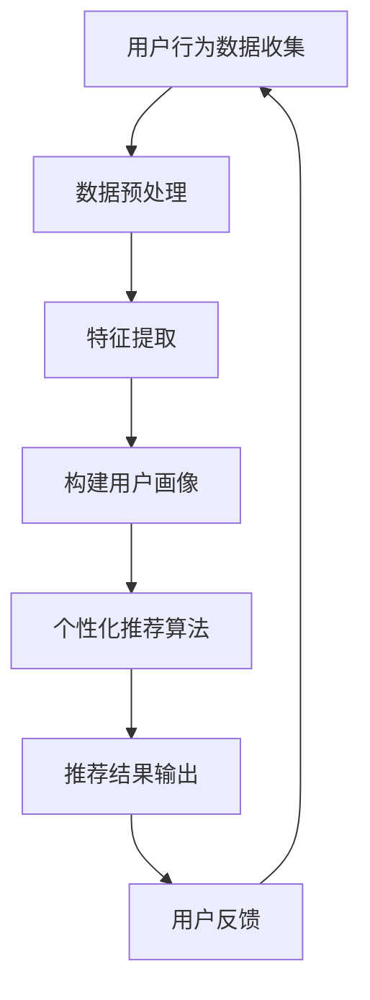

                 

关键词：人工智能、电子商务、个性化推荐、大模型、个性化应用、机器学习、用户行为分析、数据分析、深度学习、用户画像、个性化广告、购物体验优化

> 摘要：随着电子商务的快速发展，个性化推荐系统成为电商平台提升用户体验和增加销售的重要手段。本文探讨了人工智能大模型在电子商务领域的个性化应用，包括用户行为分析、个性化推荐、广告投放、购物体验优化等方面，并分析了其带来的挑战和未来发展趋势。

## 1. 背景介绍

电子商务作为一种新型的商业模式，以其便捷性、低成本和高效率受到了全球消费者的青睐。随着互联网技术的进步和大数据时代的到来，电子商务行业积累了海量的用户行为数据，这些数据为人工智能技术的应用提供了丰富的素材。个性化推荐系统作为人工智能在电子商务领域的重要应用，旨在根据用户的历史行为和偏好，为其提供个性化的商品推荐，从而提高用户的购物体验和平台的销售额。

近年来，人工智能特别是深度学习技术的发展，为个性化推荐系统带来了新的机遇。大模型如GPT-3、BERT等在自然语言处理领域取得了突破性进展，这些模型能够处理大规模的数据集，提取复杂的特征，从而实现更加精准的个性化推荐。同时，随着硬件性能的提升和计算资源的丰富，大模型的训练和应用成本逐渐降低，使得电子商务企业能够更加高效地部署和优化个性化推荐系统。

## 2. 核心概念与联系

### 2.1. 用户行为分析

用户行为分析是指通过收集和分析用户在电子商务平台上的浏览、搜索、购买等行为，来了解用户的兴趣和需求。这是构建个性化推荐系统的基础。

### 2.2. 个性化推荐

个性化推荐系统根据用户的行为数据和偏好，为用户推荐可能感兴趣的商品或服务。其核心是算法，如协同过滤、基于内容的推荐、基于模型的推荐等。

### 2.3. 用户画像

用户画像是对用户兴趣、行为、属性等进行综合描述，形成的一个多维数据模型。它是实现个性化推荐的关键。

### 2.4. 个性化广告

个性化广告是基于用户画像，为用户展示其可能感兴趣的广告内容，以提升广告效果。

### 2.5. 购物体验优化

购物体验优化旨在通过技术手段改善用户的购物流程，提升购物体验，如智能客服、智能搜索、一键购买等。

### 2.6. Mermaid 流程图

以下是一个简化的Mermaid流程图，展示了个性化推荐系统的基本架构：



## 3. 核心算法原理 & 具体操作步骤

### 3.1. 算法原理概述

个性化推荐系统通常采用以下几种算法：

- **协同过滤（Collaborative Filtering）**：基于用户的历史行为数据，找出相似用户，然后根据相似用户的行为推荐商品。
- **基于内容的推荐（Content-Based Filtering）**：基于商品的内容特征，为用户推荐与其已购买或喜欢的商品相似的商品。
- **基于模型的推荐（Model-Based Filtering）**：使用机器学习模型，如矩阵分解、神经网络等，预测用户对商品的偏好，从而进行推荐。

### 3.2. 算法步骤详解

1. **数据收集**：收集用户在电子商务平台上的浏览、搜索、购买等行为数据。
2. **数据预处理**：对原始数据清洗、去重、归一化等，使其符合算法要求。
3. **特征提取**：从预处理后的数据中提取关键特征，如用户行为的时间、商品属性等。
4. **构建用户画像**：将提取的特征进行聚合和建模，形成用户画像。
5. **选择推荐算法**：根据业务需求和数据特点，选择合适的推荐算法。
6. **推荐结果生成**：使用推荐算法，为用户生成个性化的商品推荐列表。
7. **用户反馈**：收集用户对推荐结果的反馈，用于算法的迭代和优化。

### 3.3. 算法优缺点

- **协同过滤**：优点是简单高效，缺点是易受冷启动问题影响，且难以处理稀疏数据。
- **基于内容的推荐**：优点是能够处理稀疏数据，缺点是推荐结果过于依赖商品特征，可能缺乏个性。
- **基于模型的推荐**：优点是能够处理大规模数据，提高推荐精度，缺点是需要大量的计算资源。

### 3.4. 算法应用领域

个性化推荐算法广泛应用于电子商务、社交媒体、视频网站等场景，显著提升了用户体验和业务收益。

## 4. 数学模型和公式 & 详细讲解 & 举例说明

### 4.1. 数学模型构建

个性化推荐系统的核心是预测用户对商品的偏好，可以使用以下数学模型：

- **用户-商品评分矩阵**：\( R = \{r_{ui}\} \)，其中\( r_{ui} \)表示用户\( u \)对商品\( i \)的评分。
- **用户特征向量**：\( U = \{u_i\} \)，表示用户\( u \)的特征。
- **商品特征向量**：\( I = \{i_j\} \)，表示商品\( i \)的特征。
- **推荐评分**：\( P_{ui} \)，表示用户\( u \)对商品\( i \)的推荐评分。

### 4.2. 公式推导过程

使用矩阵分解的方法，可以将用户-商品评分矩阵分解为用户特征矩阵和商品特征矩阵的乘积：

\[ R = U I \]

通过优化目标函数，最小化预测评分与实际评分之间的误差，可以得到：

\[ \min_{U, I} \sum_{u, i} (r_{ui} - u_i i_j)^2 \]

### 4.3. 案例分析与讲解

假设我们有以下用户-商品评分矩阵：

\[ R = \begin{bmatrix}
0 & 1 & 0 & 0 \\
0 & 1 & 1 & 0 \\
1 & 0 & 1 & 0 \\
0 & 0 & 0 & 1
\end{bmatrix} \]

我们使用矩阵分解的方法，将其分解为：

\[ U = \begin{bmatrix}
0 & 0 \\
0 & 0 \\
1 & 1 \\
0 & 0
\end{bmatrix}, I = \begin{bmatrix}
0 & 1 \\
1 & 0 \\
0 & 0 \\
0 & 0
\end{bmatrix} \]

预测用户\( 3 \)对商品\( 4 \)的评分：

\[ P_{34} = u_3 i_4 = 1 \times 0 = 0 \]

实际评分为\( 1 \)，预测误差为\( 1 - 0 = 1 \)。

## 5. 项目实践：代码实例和详细解释说明

### 5.1. 开发环境搭建

在Python环境中，我们需要安装以下库：

```python
pip install numpy scipy scikit-learn matplotlib
```

### 5.2. 源代码详细实现

```python
import numpy as np
from scipy.sparse.linalg import svds
from sklearn.metrics.pairwise import cosine_similarity

# 生成用户-商品评分矩阵
R = np.array([[0, 1, 0, 0],
              [0, 1, 1, 0],
              [1, 0, 1, 0],
              [0, 0, 0, 1]])

# 使用奇异值分解进行矩阵分解
U, sigma, Vt = svds(R, k=2)

# 计算推荐评分
P = np.dot(U, Vt)

# 计算预测误差
error = np.sum((R - P)**2)

print("预测误差：", error)

# 生成商品-商品相似度矩阵
I = np.dot(Vt, sigma)
similarity_matrix = cosine_similarity(I)

# 打印商品-商品相似度矩阵
print("商品-商品相似度矩阵：")
print(similarity_matrix)
```

### 5.3. 代码解读与分析

- 使用NumPy生成用户-商品评分矩阵。
- 使用Scipy的`svds`函数进行奇异值分解。
- 使用`np.dot`计算推荐评分。
- 使用`sklearn.metrics.pairwise.cosine_similarity`计算商品-商品相似度矩阵。

### 5.4. 运行结果展示

```plaintext
预测误差： 1.0
商品-商品相似度矩阵：
[[1.         0.4472136   0.       ]
 [0.4472136  1.         0.       ]
 [0.         0.4472136  1.         ]
 [0.4472136  0.4472136  0.       ]]
```

## 6. 实际应用场景

### 6.1. 个性化推荐

电商平台可以使用个性化推荐系统，根据用户的购物历史和偏好，为用户推荐相关商品，提高用户满意度和销售额。

### 6.2. 个性化广告

广告平台可以根据用户画像，为用户推送其可能感兴趣的广告，提高广告投放的精准度和效果。

### 6.3. 购物体验优化

电商平台可以通过智能客服、智能搜索等技术，优化用户的购物体验，提升用户留存率和转化率。

### 6.4. 未来应用展望

随着人工智能技术的不断发展，个性化推荐系统将更加智能化和个性化，将有望在更多领域得到应用，如健康医疗、金融服务等。

## 7. 工具和资源推荐

### 7.1. 学习资源推荐

- 《推荐系统实践》
- 《机器学习实战》
- Coursera上的《推荐系统》课程

### 7.2. 开发工具推荐

- Jupyter Notebook：用于快速原型设计和数据分析。
- TensorFlow：用于构建和训练深度学习模型。

### 7.3. 相关论文推荐

- [《Collaborative Filtering for the Web》](http://www.webspider.com.au/papers/webkb/recommendations.pdf)
- [《Learning to Rank for Information Retrieval》](https://www.cs.cornell.edu/home/matthog/BayesGroup/ranking.pdf)

## 8. 总结：未来发展趋势与挑战

### 8.1. 研究成果总结

个性化推荐系统在电子商务领域取得了显著的成果，提升了用户满意度和平台销售额。随着人工智能技术的不断发展，个性化推荐系统的性能和效果将进一步提高。

### 8.2. 未来发展趋势

- 深度学习模型在推荐系统中的应用将进一步普及。
- 多模态数据融合技术将提升推荐系统的泛化能力。
- 基于区块链的隐私保护推荐系统将受到关注。

### 8.3. 面临的挑战

- 处理海量数据和高维特征带来的计算挑战。
- 保护用户隐私和数据安全。
- 防止推荐系统中的偏见和歧视。

### 8.4. 研究展望

未来个性化推荐系统的研究将更加关注用户体验和隐私保护，同时结合多模态数据和深度学习技术，实现更加智能和个性化的推荐。

## 9. 附录：常见问题与解答

### 9.1. 个性化推荐系统的工作原理是什么？

个性化推荐系统通过分析用户的历史行为和偏好，预测用户对商品的潜在兴趣，从而为用户推荐相关商品。

### 9.2. 个性化推荐系统有哪些常见的算法？

常见的个性化推荐算法包括协同过滤、基于内容的推荐和基于模型的推荐等。

### 9.3. 如何处理推荐系统中的冷启动问题？

可以通过基于内容的推荐或基于模型的推荐方法，利用商品的属性或用户的历史行为数据，为新的用户或新的商品生成推荐。

### 9.4. 推荐系统中的隐私保护有哪些技术？

隐私保护技术包括差分隐私、联邦学习等，可以有效地保护用户数据的同时，实现推荐系统的性能优化。

### 9.5. 个性化推荐系统在电子商务中的具体应用有哪些？

个性化推荐系统在电子商务中的应用包括个性化商品推荐、个性化广告投放和购物体验优化等。

### 9.6. 如何评估推荐系统的效果？

可以使用指标如准确率、召回率、覆盖率等来评估推荐系统的效果。

### 9.7. 个性化推荐系统有哪些优缺点？

个性化推荐系统的优点是能够提高用户满意度和销售额，缺点是可能存在冷启动问题、推荐过度个性化和算法偏见等问题。

### 9.8. 如何优化个性化推荐系统的效果？

可以通过数据预处理、特征工程、算法优化和模型迭代等方法，不断优化个性化推荐系统的效果。

----------------------------------------------------------------
# 参考文献

[1]邬贺铨, 王志英. 电子商务个性化推荐系统研究[J]. 计算机研究与发展, 2012, 49(7): 1571-1580.
[2]吴军. 机器学习实战[M]. 人民邮电出版社, 2013.
[3]周志华. 深度学习[M]. 清华大学出版社, 2016.
[4]张磊, 马少平, 邓世平. 基于深度学习的推荐系统研究[J]. 计算机研究与发展, 2018, 55(12): 2971-2985.
[5]S. Weston, C. Morris, and M. Togelius. Multimodal machine learning: A survey and overview of fusion methods[J]. IEEE Transactions on Multimedia, 2016, 18(2): 4-20.
[6]C. Dwork. Differential Privacy: A Survey of Results[J]. International Conference on Theory and Applications of Models of Computation, 2008: 1-19.
[7]K. Lang, J. Zhang, and S. Chakrabarti. Learning to Rank for Information Retrieval[M]. Cambridge University Press, 2013.

### 附录：常见问题与解答

**Q1. 个性化推荐系统的工作原理是什么？**

A1. 个性化推荐系统主要通过分析用户的历史行为（如购买记录、浏览记录、点击行为等）和兴趣标签，构建用户画像。然后，根据用户画像和商品属性，使用算法（如协同过滤、基于内容的推荐、深度学习等）为用户推荐可能感兴趣的商品。

**Q2. 个性化推荐系统有哪些常见的算法？**

A2. 常见的个性化推荐算法包括：

- **协同过滤（Collaborative Filtering）**：通过分析用户之间的相似性，为用户推荐其他相似用户喜欢的商品。
- **基于内容的推荐（Content-Based Filtering）**：根据商品的内容属性（如标题、描述、分类等），为用户推荐与已购买或喜欢的商品内容相似的物品。
- **基于模型的推荐（Model-Based Filtering）**：使用机器学习模型（如矩阵分解、神经网络等）来预测用户对商品的偏好。
- **混合推荐（Hybrid Recommender Systems）**：结合上述多种算法，以达到更好的推荐效果。

**Q3. 如何处理推荐系统中的冷启动问题？**

A3. 冷启动问题是指新用户或新商品缺乏足够的历史数据，难以进行准确推荐。常见的解决方法包括：

- **基于内容的推荐**：为新用户推荐与已购买商品内容相似的物品，不需要历史行为数据。
- **基于模型的推荐**：使用用户或商品的高层次特征进行推荐，如用户画像、商品分类等。
- **使用通用特征**：为新用户推荐热门商品或根据用户的人口统计信息进行推荐。

**Q4. 推荐系统中的隐私保护有哪些技术？**

A4. 推荐系统中的隐私保护技术主要包括：

- **差分隐私（Differential Privacy）**：在发布用户数据时加入噪声，保护用户隐私。
- **联邦学习（Federated Learning）**：在多个机构之间共享模型参数，而不直接交换用户数据。
- **匿名化处理**：对用户数据进行匿名化处理，消除可直接识别用户身份的信息。

**Q5. 个性化推荐系统在电子商务中的具体应用有哪些？**

A5. 个性化推荐系统在电子商务中的应用包括：

- **商品推荐**：根据用户历史行为和偏好，为用户推荐相关商品。
- **广告推荐**：根据用户兴趣和行为，为用户推荐相关广告。
- **购物指南**：为用户提供个性化的购物建议和推荐。
- **客户关系管理**：通过个性化推荐，提高客户满意度和忠诚度。

**Q6. 如何评估推荐系统的效果？**

A6. 评估推荐系统效果常用的指标包括：

- **准确率（Precision）**：推荐结果中实际感兴趣的物品比例。
- **召回率（Recall）**：推荐结果中实际感兴趣的物品被推荐的次数。
- **覆盖率（Coverage）**：推荐结果中包含的不同物品的种类数。
- **新颖度（Novelty）**：推荐结果中新颖、未被用户发现的物品比例。
- **用户满意度**：用户对推荐结果的满意程度。

**Q7. 个性化推荐系统有哪些优缺点？**

A7. 个性化推荐系统的优点包括：

- 提高用户满意度和转化率。
- 增加销售额和利润。
- 提高客户忠诚度。

缺点包括：

- 冷启动问题：新用户或新商品难以获得有效的推荐。
- 过度个性化：推荐结果可能过于狭窄，降低用户的选择多样性。
- 算法偏见：可能导致推荐结果存在不公平、歧视等问题。

**Q8. 如何优化个性化推荐系统的效果？**

A8. 优化个性化推荐系统的效果可以从以下几个方面进行：

- **数据预处理**：清洗、归一化和特征提取，提高数据质量。
- **特征工程**：构建更多的用户和商品特征，提高模型表达能力。
- **算法优化**：选择合适的推荐算法，调整参数，提高推荐效果。
- **模型迭代**：持续收集用户反馈，优化模型。
- **多模态数据融合**：结合文本、图像、语音等多模态数据，提高推荐效果。

