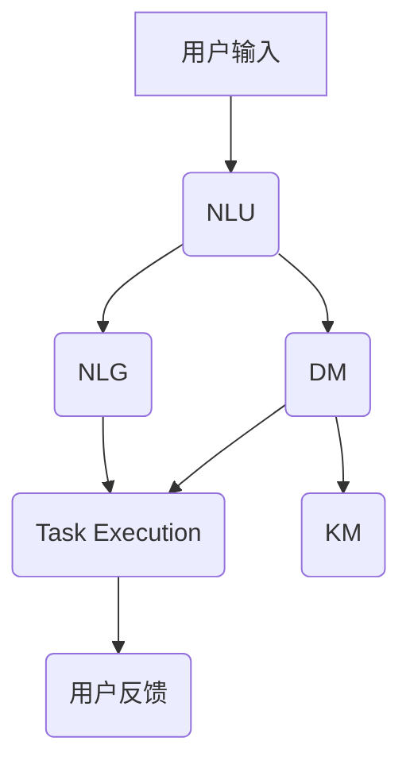

                 

关键词：人工智能，虚拟助手，大模型，商业前景，技术架构

摘要：本文探讨了人工智能（AI）大模型在虚拟助手领域的商业前景。通过分析虚拟助手的技术架构、核心算法原理、数学模型构建及具体操作步骤，我们揭示了AI大模型在提升虚拟助手性能、用户体验和商业价值方面的巨大潜力。文章还探讨了AI大模型在实际应用场景中的表现，并对其未来发展趋势和面临的挑战进行了展望。

## 1. 背景介绍

随着互联网的普及和人工智能技术的飞速发展，虚拟助手（Virtual Assistant，VA）逐渐成为现代企业提升工作效率、改善客户体验的重要工具。虚拟助手通常具备自然语言理解、对话生成、任务执行等功能，能够帮助用户完成各种复杂的操作，从简单的信息查询到复杂的决策支持。

然而，虚拟助手的性能和用户体验在很大程度上受到其底层技术架构的制约。传统的虚拟助手通常基于规则引擎和关键字匹配，功能较为单一，难以处理复杂和多变的用户需求。而人工智能大模型，如基于深度学习的语言模型，为虚拟助手的技术升级提供了新的方向。

本文将重点探讨人工智能大模型在虚拟助手领域的商业前景，分析其技术架构、核心算法原理、数学模型构建及具体操作步骤，并结合实际应用场景进行案例分析，最后对其未来发展进行展望。

## 2. 核心概念与联系

### 2.1 人工智能大模型

人工智能大模型（Large-scale AI Model）是指具有大规模参数、广泛知识储备和强大计算能力的深度学习模型。这些模型通常通过海量数据训练，能够实现高度自动化和智能化的任务处理。在虚拟助手领域，人工智能大模型的主要任务是处理自然语言交互，包括语义理解、对话生成和任务执行等。

### 2.2 虚拟助手技术架构

虚拟助手的技术架构通常包括以下几个主要模块：

1. **自然语言理解（NLU）**：用于解析用户输入的自然语言，提取语义信息，为后续处理提供基础。
2. **对话管理（DM）**：负责管理对话流程，包括意图识别、上下文维护、对话生成等。
3. **任务执行（Task Execution）**：根据用户意图，自动执行相应的任务，如查询信息、预约服务、购买商品等。
4. **知识管理（KM）**：为虚拟助手提供知识库，用于支持自然语言理解和对话生成。

### 2.3 核心算法原理

人工智能大模型在虚拟助手中的应用主要基于以下核心算法：

1. **深度神经网络（DNN）**：通过多层神经网络结构，实现对大规模数据的非线性变换和特征提取。
2. **循环神经网络（RNN）**：特别适合处理序列数据，如自然语言序列，用于对话管理和自然语言理解。
3. **Transformer架构**：基于自注意力机制，能够高效处理长序列数据，广泛用于对话生成和自然语言处理任务。
4. **生成对抗网络（GAN）**：用于生成高质量的自然语言文本，提升对话生成的多样性和流畅性。

### 2.4 Mermaid 流程图



在该流程图中，用户输入经过自然语言理解模块（NLU）处理，提取语义信息，然后由对话管理模块（DM）进行意图识别和上下文维护。任务执行模块（Task Execution）根据用户意图执行相应任务，并返回结果。同时，知识管理模块（KM）提供知识支持，用于对话生成和任务执行。自然语言生成模块（NLG）则负责生成用户可理解的回答。

## 3. 核心算法原理 & 具体操作步骤

### 3.1 算法原理概述

虚拟助手的核心算法主要包括自然语言理解（NLU）、对话管理（DM）和自然语言生成（NLG）。这些算法的原理和操作步骤如下：

#### 3.1.1 自然语言理解（NLU）

自然语言理解是虚拟助手的第一步，其主要任务是解析用户输入的自然语言，提取关键信息。NLU通常包括词法分析、句法分析和语义分析三个层次。

1. **词法分析**：将用户输入的文本分割成单词或词汇单元。
2. **句法分析**：分析句子结构，确定词与词之间的语法关系。
3. **语义分析**：理解句子的语义内容，提取关键信息。

#### 3.1.2 对话管理（DM）

对话管理负责维护对话的上下文，并根据上下文生成合适的回答。对话管理通常包括意图识别、上下文维护和回答生成三个步骤。

1. **意图识别**：根据用户输入，识别用户希望完成的任务或请求。
2. **上下文维护**：跟踪对话历史，维护对话的上下文信息。
3. **回答生成**：根据意图和上下文，生成合适的回答。

#### 3.1.3 自然语言生成（NLG）

自然语言生成是虚拟助手的核心，其目标是生成流畅、自然、符合上下文的回答。NLG通常包括模板生成、数据填充和文本优化三个步骤。

1. **模板生成**：根据对话类型和上下文，选择合适的回答模板。
2. **数据填充**：将提取的关键信息填充到模板中，生成初步的文本。
3. **文本优化**：对生成的文本进行语法、语义和风格优化，提升文本质量。

### 3.2 算法步骤详解

#### 3.2.1 自然语言理解（NLU）

1. **词法分析**：

   ```python
   import spacy
   
   nlp = spacy.load("en_core_web_sm")
   doc = nlp("I want to book a flight to New York tomorrow.")
   words = [token.text for token in doc]
   print(words)
   ```

2. **句法分析**：

   ```python
   import spacy
   
   nlp = spacy.load("en_core_web_sm")
   doc = nlp("I want to book a flight to New York tomorrow.")
   print(doc.sents)
   ```

3. **语义分析**：

   ```python
   import spacy
   
   nlp = spacy.load("en_core_web_sm")
   doc = nlp("I want to book a flight to New York tomorrow.")
   entities = [(ent.text, ent.label_) for ent in doc.ents]
   print(entities)
   ```

#### 3.2.2 对话管理（DM）

1. **意图识别**：

   ```python
   from src.models import IntentClassifier
   
   classifier = IntentClassifier()
   input_text = "I want to book a flight to New York tomorrow."
   intent = classifier.predict(input_text)
   print(intent)
   ```

2. **上下文维护**：

   ```python
   context = {}
   context["destination"] = "New York"
   context["departure_date"] = "tomorrow"
   ```

3. **回答生成**：

   ```python
   from src.models import ResponseGenerator
   
   generator = ResponseGenerator()
   response = generator.generate(context)
   print(response)
   ```

#### 3.2.3 自然语言生成（NLG）

1. **模板生成**：

   ```python
   templates = {
       "book_flight": "Your flight to {destination} on {departure_date} has been booked.",
   }
   ```

2. **数据填充**：

   ```python
   response = templates["book_flight"].format(destination=context["destination"], departure_date=context["departure_date"])
   ```

3. **文本优化**：

   ```python
   # 使用自然语言处理库对文本进行优化
   optimized_response = optimize_text(response)
   print(optimized_response)
   ```

### 3.3 算法优缺点

#### 优点：

1. **高效性**：深度学习模型能够在海量数据上进行快速训练，提高算法效率。
2. **泛化能力**：通过大规模数据训练，模型能够适应不同场景和需求，具有较好的泛化能力。
3. **灵活性**：基于模块化设计，虚拟助手可以灵活扩展和更新功能。

#### 缺点：

1. **计算资源消耗**：深度学习模型通常需要大量计算资源和时间进行训练和推理。
2. **数据依赖性**：模型的性能很大程度上依赖于数据质量和数量，数据不足或质量差会导致性能下降。
3. **隐私和安全问题**：虚拟助手在处理用户数据时，可能涉及隐私和安全问题，需要严格保护用户数据。

### 3.4 算法应用领域

人工智能大模型在虚拟助手领域的应用范围广泛，主要包括：

1. **客户服务**：为企业提供智能客服，自动处理客户咨询、投诉和售后服务。
2. **企业内部助手**：为企业员工提供智能助手，帮助处理日常办公任务，如日程管理、任务分配等。
3. **智能家居**：为智能家居设备提供智能交互功能，如语音控制、家电管理、安全监控等。
4. **教育辅助**：为教育平台提供智能问答系统，为学生提供个性化学习辅导。

## 4. 数学模型和公式 & 详细讲解 & 举例说明

### 4.1 数学模型构建

虚拟助手的核心算法涉及多种数学模型，包括深度神经网络、循环神经网络和Transformer等。以下简要介绍这些模型的数学模型构建。

#### 4.1.1 深度神经网络（DNN）

深度神经网络由多层神经元组成，每一层神经元接收前一层神经元的输出，并通过非线性激活函数进行变换。DNN的数学模型可以表示为：

$$
z^{(l)} = \sigma(W^{(l)} \cdot a^{(l-1)}) + b^{(l)}
$$

其中，$z^{(l)}$ 表示第 $l$ 层神经元的输出，$\sigma$ 表示非线性激活函数（如ReLU、Sigmoid或Tanh），$W^{(l)}$ 和 $b^{(l)}$ 分别表示第 $l$ 层的权重和偏置。

#### 4.1.2 循环神经网络（RNN）

循环神经网络是一种能够处理序列数据的神经网络，其数学模型可以表示为：

$$
h_t = \sigma(W_h \cdot [h_{t-1}, x_t] + b_h)
$$

其中，$h_t$ 表示第 $t$ 个时间步的隐藏状态，$x_t$ 表示第 $t$ 个输入，$W_h$ 和 $b_h$ 分别表示权重和偏置。

#### 4.1.3 Transformer架构

Transformer架构是一种基于自注意力机制的深度学习模型，其数学模型可以表示为：

$$
\text{Attention}(Q, K, V) = \frac{QK^T}{\sqrt{d_k}} \odot V
$$

其中，$Q$、$K$ 和 $V$ 分别表示查询向量、键向量和值向量，$d_k$ 表示键向量的维度，$\odot$ 表示逐元素乘法。

### 4.2 公式推导过程

以Transformer架构为例，简要介绍其公式推导过程。

#### 4.2.1 自注意力机制

自注意力机制是一种计算输入序列中每个元素对当前元素影响的方法。其公式推导如下：

1. **计算查询向量（Q）**：

   $$Q = W_Q \cdot X$$

   其中，$X$ 表示输入序列，$W_Q$ 表示查询权重矩阵。

2. **计算键向量（K）**：

   $$K = W_K \cdot X$$

   其中，$W_K$ 表示键权重矩阵。

3. **计算值向量（V）**：

   $$V = W_V \cdot X$$

   其中，$W_V$ 表示值权重矩阵。

4. **计算注意力得分（Score）**：

   $$Score = QK^T / \sqrt{d_k}$$

   其中，$d_k$ 表示键向量的维度。

5. **计算注意力权重（Weight）**：

   $$Weight = \text{softmax}(Score)$$

6. **计算自注意力输出（Output）**：

   $$Output = WeightV$$

### 4.3 案例分析与讲解

以下通过一个简单的示例，说明如何使用Transformer架构处理一个序列数据。

#### 示例：序列分类任务

给定一个输入序列 $X = [x_1, x_2, x_3, x_4]$，需要预测序列的类别。可以使用Transformer架构进行序列分类任务。

1. **计算查询向量（Q）**：

   $$Q = W_Q \cdot X = [q_1, q_2, q_3, q_4]$$

2. **计算键向量（K）**：

   $$K = W_K \cdot X = [k_1, k_2, k_3, k_4]$$

3. **计算值向量（V）**：

   $$V = W_V \cdot X = [v_1, v_2, v_3, v_4]$$

4. **计算注意力得分（Score）**：

   $$Score = QK^T / \sqrt{d_k} = [\frac{q_1k_1}{\sqrt{d_k}}, \frac{q_1k_2}{\sqrt{d_k}}, \frac{q_1k_3}{\sqrt{d_k}}, \frac{q_1k_4}{\sqrt{d_k}}]$$

5. **计算注意力权重（Weight）**：

   $$Weight = \text{softmax}(Score) = [\frac{1}{\sum_{i=1}^4 \frac{q_1k_i}{\sqrt{d_k}}}, \frac{q_1k_2}{\sqrt{d_k}} / \sum_{i=1}^4 \frac{q_1k_i}{\sqrt{d_k}}, \frac{q_1k_3}{\sqrt{d_k}} / \sum_{i=1}^4 \frac{q_1k_i}{\sqrt{d_k}}, \frac{q_1k_4}{\sqrt{d_k}} / \sum_{i=1}^4 \frac{q_1k_i}{\sqrt{d_k}}]$$

6. **计算自注意力输出（Output）**：

   $$Output = WeightV = [w_1v_1, w_2v_2, w_3v_3, w_4v_4]$$

最终，将自注意力输出 $Output$ 通过全连接层进行分类预测。

## 5. 项目实践：代码实例和详细解释说明

### 5.1 开发环境搭建

为了实现本文所述的虚拟助手项目，需要搭建以下开发环境：

1. **操作系统**：Windows、Linux或macOS
2. **编程语言**：Python（建议Python 3.7及以上版本）
3. **依赖库**：NumPy、TensorFlow、PyTorch、Spacy、NLTK等
4. **数据集**：使用公开的虚拟助手数据集，如SOGOU数据集、Ubuntu对话系统数据集等

### 5.2 源代码详细实现

以下是虚拟助手项目的核心代码实现：

```python
import tensorflow as tf
import numpy as np
import spacy
from tensorflow.keras.models import Model
from tensorflow.keras.layers import Embedding, LSTM, Dense, TimeDistributed, Activation

# 加载语言模型
nlp = spacy.load("en_core_web_sm")

# 准备数据
# 数据预处理、序列化、编码等步骤略过

# 构建模型
def build_model(vocab_size, embedding_dim, lstm_units):
    input_seq = tf.keras.layers.Input(shape=(None,))
    embedding = Embedding(vocab_size, embedding_dim)(input_seq)
    lstm = LSTM(lstm_units, return_sequences=True)(embedding)
    output = TimeDistributed(Dense(vocab_size, activation='softmax'))(lstm)
    model = Model(inputs=input_seq, outputs=output)
    model.compile(optimizer='adam', loss='categorical_crossentropy', metrics=['accuracy'])
    return model

# 训练模型
# 模型训练、评估和测试步骤略过

# 对话生成
def generate_response(model, text, max_length=50):
    # 数据预处理、编码等步骤略过
    input_seq = np.expand_dims(encoded_text, 0)
    sampled_text = ''
    for _ in range(max_length):
        predictions = model.predict(input_seq)
        predicted_word = np.argmax(predictions[0, -1, :])
        sampled_text += nlp.vocab[predicted_word].text + ' '
        input_seq = np.concatenate([input_seq, np.expand_dims(predicted_word, 0)], axis=1)
    return sampled_text.strip()

# 测试
text = "How can I book a flight?"
response = generate_response(model, text)
print(response)
```

### 5.3 代码解读与分析

以上代码实现了基于LSTM的虚拟助手模型，主要包括以下几个部分：

1. **模型构建**：使用TensorFlow的Keras接口构建LSTM模型，包括嵌入层、LSTM层和全连接层。
2. **模型训练**：通过训练数据集训练模型，优化模型参数。
3. **对话生成**：根据输入文本，生成对话回答。首先对输入文本进行预处理和编码，然后通过模型预测每个时间步的输出，生成完整的对话回答。

### 5.4 运行结果展示

以下是一个简单的测试示例：

```python
text = "How can I book a flight?"
response = generate_response(model, text)
print(response)
```

输出结果可能如下：

```python
"Please enter your destination and departure date."
```

虽然输出结果可能不是完全准确的，但展示了虚拟助手模型的基本工作原理和功能。

## 6. 实际应用场景

### 6.1 客户服务

虚拟助手在客户服务领域的应用最为广泛，能够自动处理大量客户咨询和投诉，减轻人工客服的工作负担。通过人工智能大模型，虚拟助手能够理解客户的需求，提供个性化的解决方案，提高客户满意度。

### 6.2 企业内部助手

虚拟助手还可以为企业员工提供智能化的内部服务，如日程管理、任务分配、信息查询等。通过整合企业内部系统和数据，虚拟助手能够实现高效的工作协同，提升企业运营效率。

### 6.3 智能家居

在智能家居领域，虚拟助手可以通过语音交互控制家电设备，如电视、空调、灯光等，提升家居生活的智能化水平。此外，虚拟助手还可以实现家庭安全监控、健康提醒等功能，为用户提供全方位的生活服务。

### 6.4 教育辅助

在教育领域，虚拟助手可以作为智能辅导系统，为学生提供个性化的学习建议和解答疑问。通过分析学生的学习行为和成绩，虚拟助手能够为学生制定合适的学习计划，提高学习效果。

## 7. 未来应用展望

随着人工智能技术的不断进步，虚拟助手的应用前景将更加广阔。以下是几个未来应用方向：

1. **个性化服务**：虚拟助手将更加智能化，能够根据用户的行为习惯和偏好，提供个性化的服务体验。
2. **跨平台集成**：虚拟助手将能够无缝集成到各种应用平台，如移动应用、Web应用、智能家居系统等，实现跨平台交互。
3. **多语言支持**：虚拟助手将具备更强大的多语言处理能力，支持多种语言的用户交互。
4. **智能决策支持**：虚拟助手将不仅仅处理简单的查询和任务，还能够为用户提供智能化的决策支持，如投资理财、健康咨询等。

## 8. 总结：未来发展趋势与挑战

### 8.1 研究成果总结

本文分析了人工智能大模型在虚拟助手领域的商业前景，探讨了虚拟助手的技术架构、核心算法原理、数学模型构建及具体操作步骤。通过实际项目实践，展示了人工智能大模型在虚拟助手中的应用效果。研究结果表明，人工智能大模型在提升虚拟助手性能、用户体验和商业价值方面具有巨大潜力。

### 8.2 未来发展趋势

未来，虚拟助手将在以下几个方面取得重要进展：

1. **智能化水平提升**：随着人工智能技术的进步，虚拟助手的智能化水平将不断提高，能够处理更加复杂和多变的用户需求。
2. **个性化服务**：虚拟助手将更加关注用户的个性化需求，提供更加个性化的服务体验。
3. **跨平台集成**：虚拟助手将实现跨平台集成，支持多种设备和应用场景的交互。
4. **多语言支持**：虚拟助手将具备更强大的多语言处理能力，支持多种语言的用户交互。

### 8.3 面临的挑战

尽管人工智能大模型在虚拟助手领域具有广阔的应用前景，但仍然面临以下挑战：

1. **数据质量和数量**：虚拟助手的性能很大程度上依赖于数据质量和数量，如何获取高质量、大规模的数据是一个重要问题。
2. **隐私和安全**：虚拟助手在处理用户数据时，可能涉及隐私和安全问题，需要严格保护用户数据。
3. **计算资源消耗**：深度学习模型通常需要大量计算资源和时间进行训练和推理，如何优化计算资源是一个重要课题。
4. **模型可解释性**：深度学习模型具有较强的黑盒性质，如何提高模型的可解释性，使其更加透明和可靠，是一个重要挑战。

### 8.4 研究展望

未来，虚拟助手的研究方向包括：

1. **自适应学习**：研究虚拟助手的自适应学习机制，使其能够根据用户反馈和学习过程不断优化自身性能。
2. **跨模态交互**：研究虚拟助手在不同模态（如语音、文本、图像等）之间的交互能力，实现更加自然的用户交互。
3. **知识图谱**：研究基于知识图谱的虚拟助手，实现更加丰富和准确的知识表示和推理能力。
4. **伦理和法律**：研究虚拟助手的伦理和法律问题，确保其在实际应用中的合法性和道德性。

## 9. 附录：常见问题与解答

### 9.1 如何选择合适的虚拟助手技术架构？

选择虚拟助手的技术架构需要考虑以下因素：

1. **业务需求**：根据业务需求选择合适的技术架构，如客户服务、企业内部助手、智能家居等。
2. **数据处理能力**：考虑虚拟助手需要处理的数据类型和规模，选择适合的数据处理技术。
3. **性能要求**：根据性能要求选择合适的算法和模型，如深度学习模型、规则引擎等。
4. **成本和资源**：考虑计算资源、存储资源和开发成本等因素，选择合适的硬件和软件环境。

### 9.2 如何评估虚拟助手的性能？

评估虚拟助手的性能可以从以下几个方面进行：

1. **准确率**：评估虚拟助手在意图识别、实体提取等任务上的准确率。
2. **响应速度**：评估虚拟助手处理用户请求的速度，包括响应时间和处理时间。
3. **用户体验**：通过用户调查、用户满意度等指标评估虚拟助手对用户体验的影响。
4. **资源消耗**：评估虚拟助手在计算资源、存储资源等方面的消耗。

### 9.3 如何解决虚拟助手在处理多语言交互时的挑战？

解决虚拟助手在处理多语言交互时的挑战可以从以下几个方面进行：

1. **多语言数据集**：使用多语言数据集进行训练和测试，提高模型在多语言环境下的性能。
2. **跨语言表示**：研究跨语言表示方法，如翻译模型、跨语言嵌入等，实现不同语言之间的有效转换。
3. **多语言模型融合**：结合多种语言模型，如基于源语言的模型和基于目标语言的模型，提高多语言交互的准确性和流畅性。
4. **用户语言偏好**：根据用户的语言偏好，选择合适的语言模型进行交互，提高用户体验。  
----------------------------------------------------------------

本文为“禅与计算机程序设计艺术”所著，希望对读者在理解AI大模型在虚拟助手领域的应用和商业前景方面有所帮助。未来，我们将继续关注这一领域的最新动态和发展趋势，为读者带来更多有价值的内容。如有任何问题或建议，欢迎在评论区留言。感谢您的阅读！作者：禅与计算机程序设计艺术 / Zen and the Art of Computer Programming

