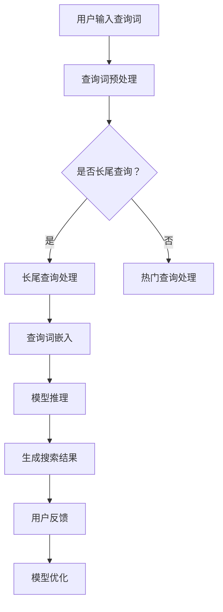

                 

关键词：AI大模型、长尾查询、电商搜索、算法原理、数学模型、代码实例、实际应用场景、未来展望

> 摘要：本文将深入探讨AI大模型在处理电商搜索中长尾查询方面的应用。通过分析AI大模型的原理与结构，我们探讨了其在长尾查询处理中的核心算法及其应用领域。同时，文章通过数学模型和代码实例，详细阐述了如何构建和优化长尾查询处理系统，并探讨了其在实际电商搜索场景中的效果与未来发展方向。

## 1. 背景介绍

随着互联网的普及和电商行业的蓬勃发展，电子商务已经成为人们日常生活中不可或缺的一部分。在电商平台上，用户通过搜索功能寻找他们需要的商品。然而，用户搜索的行为往往呈现出明显的长尾特性。长尾搜索指的是用户搜索的词频分布呈长尾形状，即大部分搜索词的查询次数较少，而少数热门搜索词的查询次数极高。

长尾查询对电商搜索系统提出了巨大的挑战。由于长尾查询涉及到的商品信息较少，传统的基于热门搜索词的搜索算法往往难以满足用户的搜索需求。因此，如何有效地处理长尾查询成为电商搜索系统优化的重要方向。

近年来，人工智能特别是AI大模型的发展为长尾查询处理提供了新的思路。AI大模型具有强大的数据处理和建模能力，能够从大量数据中学习并提取有价值的信息。这使得AI大模型在处理长尾查询时具备显著的优势。本文将重点探讨AI大模型在处理电商搜索中长尾查询方面的应用，分析其原理、算法、数学模型以及实际应用效果。

## 2. 核心概念与联系

为了更好地理解AI大模型在处理长尾查询中的作用，我们需要首先了解几个核心概念：AI大模型、长尾查询以及它们之间的联系。

### 2.1 AI大模型

AI大模型是指具有海量参数和复杂结构的深度学习模型，如Transformer、BERT等。这些模型通过在大规模数据集上进行训练，能够自动学习并提取数据中的有用信息。AI大模型的优点包括：

1. **强大的表征能力**：AI大模型可以捕捉到数据中的深层特征，从而提高模型的泛化能力。
2. **高效的处理速度**：尽管模型参数众多，但现代计算技术的发展使得大模型的处理速度越来越快。
3. **多任务学习能力**：AI大模型通常具备多任务学习能力，可以在同一模型上处理多种任务。

### 2.2 长尾查询

长尾查询是指查询词的分布呈长尾形状，即大多数查询词的查询次数较少，而少数热门查询词的查询次数极高。这种查询分布对于传统的基于热门查询词的搜索算法是一个巨大的挑战。长尾查询的特点包括：

1. **多样性**：长尾查询涉及到的商品种类繁多，每个商品的需求量差异巨大。
2. **冷门性**：长尾查询中的大部分查询词相对冷门，需要系统进行深度分析才能找到匹配的商品。
3. **个性化**：长尾查询通常反映了用户的个性化需求，需要系统提供更个性化的搜索结果。

### 2.3 AI大模型与长尾查询的联系

AI大模型与长尾查询之间的联系主要体现在以下几个方面：

1. **特征提取**：AI大模型可以从大量数据中学习并提取有用的特征，为长尾查询提供更丰富的信息。
2. **多样化匹配**：AI大模型能够处理多样化、个性化的查询请求，提高长尾查询的匹配精度。
3. **实时响应**：AI大模型通过分布式计算和优化算法，能够实现高效的实时响应，满足用户实时搜索的需求。

### 2.4 Mermaid流程图

以下是一个简化的Mermaid流程图，展示了AI大模型在处理长尾查询时的基本流程：



## 3. 核心算法原理 & 具体操作步骤

### 3.1 算法原理概述

AI大模型处理长尾查询的核心算法主要基于深度学习和自然语言处理（NLP）技术。以下是一个简化的算法原理概述：

1. **数据预处理**：将用户输入的查询词进行预处理，包括分词、词性标注、去停用词等步骤。
2. **查询词嵌入**：将预处理后的查询词嵌入到一个高维的语义空间中，通常使用Word2Vec、BERT等预训练模型。
3. **模型推理**：使用预训练的AI大模型（如Transformer、BERT）对嵌入后的查询词进行推理，获取查询词的语义表示。
4. **搜索结果生成**：根据查询词的语义表示，从商品数据库中检索相关的商品信息，生成搜索结果。
5. **用户反馈与模型优化**：收集用户的反馈信息，如点击率、购买行为等，用于优化模型，提高搜索结果的准确性。

### 3.2 算法步骤详解

下面详细说明AI大模型处理长尾查询的步骤：

#### 3.2.1 数据预处理

数据预处理是算法的第一步，包括以下步骤：

1. **分词**：将查询词分解成一个个单词或词组。
2. **词性标注**：为每个词标注其词性，如名词、动词等。
3. **去停用词**：去除常见的无意义的停用词，如“的”、“是”等。

预处理后的查询词将作为后续处理的输入。

#### 3.2.2 查询词嵌入

查询词嵌入是将预处理后的查询词映射到一个高维的语义空间。具体步骤如下：

1. **选择预训练模型**：如Word2Vec、BERT等。
2. **加载预训练模型**：从预训练模型中获取词向量。
3. **查询词向量表示**：将预处理后的查询词转化为词向量表示。

查询词向量表示将用于后续的模型推理和搜索结果生成。

#### 3.2.3 模型推理

模型推理是核心步骤，具体如下：

1. **加载AI大模型**：如Transformer、BERT等。
2. **输入查询词向量**：将查询词向量输入到AI大模型中。
3. **获取查询词的语义表示**：通过AI大模型的推理过程，获取查询词的语义表示。

查询词的语义表示将用于搜索结果的生成。

#### 3.2.4 搜索结果生成

搜索结果生成是基于查询词的语义表示，从商品数据库中检索相关的商品信息。具体步骤如下：

1. **商品数据库检索**：根据查询词的语义表示，从商品数据库中检索相关的商品信息。
2. **排序与筛选**：对检索到的商品进行排序和筛选，确保搜索结果的准确性和多样性。
3. **生成搜索结果**：将筛选后的商品信息生成搜索结果，展示给用户。

#### 3.2.5 用户反馈与模型优化

用户反馈与模型优化是算法的最后一步，具体如下：

1. **收集用户反馈**：通过用户的点击行为、购买行为等收集用户反馈。
2. **模型优化**：根据用户反馈对模型进行调整和优化，提高搜索结果的准确性。
3. **迭代优化**：将优化后的模型应用于新的用户查询，不断迭代优化。

### 3.3 算法优缺点

AI大模型在处理长尾查询方面具有显著的优点，但也存在一定的局限性。

#### 优点

1. **强大的表征能力**：AI大模型能够捕捉到查询词的深层特征，提高搜索结果的准确性。
2. **高效的多样化匹配**：AI大模型能够处理多样化、个性化的查询请求，提供更个性化的搜索结果。
3. **实时响应**：AI大模型通过分布式计算和优化算法，能够实现高效的实时响应。

#### 局限性

1. **训练成本高**：AI大模型需要大量的数据和时间进行训练，训练成本较高。
2. **对数据质量要求高**：数据质量对AI大模型的效果有重要影响，数据质量问题可能导致搜索结果不准确。
3. **解释性较差**：AI大模型的决策过程较为复杂，难以提供明确的解释，这在某些应用场景中可能是不利的。

### 3.4 算法应用领域

AI大模型在处理长尾查询方面具有广泛的应用领域，包括但不限于以下几个方面：

1. **电商搜索**：AI大模型可以用于电商搜索中的长尾查询处理，提高搜索结果的准确性。
2. **推荐系统**：AI大模型可以用于推荐系统，根据用户的搜索历史和浏览行为进行个性化推荐。
3. **问答系统**：AI大模型可以用于问答系统，处理用户的多样化、个性化的问题。

## 4. 数学模型和公式 & 详细讲解 & 举例说明

### 4.1 数学模型构建

在处理长尾查询时，AI大模型需要构建一个数学模型来描述查询词与商品之间的关系。以下是构建该数学模型的基本步骤：

1. **定义查询词和商品的特征表示**：
   - 查询词特征向量 \(q \in \mathbb{R}^d\)，其中 \(d\) 为特征维度。
   - 商品特征向量 \(p \in \mathbb{R}^d\)，其中 \(d\) 为特征维度。

2. **定义查询词和商品的相似度度量**：
   - 使用余弦相似度计算查询词和商品之间的相似度，公式如下：
     $$ \text{similarity}(q, p) = \frac{q \cdot p}{\|q\|_2 \|p\|_2} $$
   - 其中，\(q \cdot p\) 表示查询词和商品特征向量的点积，\(\|q\|_2\) 和 \(\|p\|_2\) 分别表示查询词和商品特征向量的二范数。

3. **定义搜索结果的排序模型**：
   - 使用排序模型对商品进行排序，公式如下：
     $$ \text{rank}(p) = \text{similarity}(q, p) $$
   - 根据相似度对商品进行排序，相似度越高，排序越靠前。

### 4.2 公式推导过程

以下是长尾查询处理的数学模型推导过程：

1. **查询词嵌入**：
   - 假设查询词 \(q\) 通过预训练模型嵌入到高维特征空间，得到查询词特征向量 \(q \in \mathbb{R}^d\)。

2. **商品特征表示**：
   - 假设商品 \(p\) 的特征向量 \(p \in \mathbb{R}^d\)，其中 \(d\) 为特征维度。

3. **相似度计算**：
   - 使用余弦相似度计算查询词和商品之间的相似度：
     $$ \text{similarity}(q, p) = \frac{q \cdot p}{\|q\|_2 \|p\|_2} $$

4. **排序模型**：
   - 使用相似度对商品进行排序：
     $$ \text{rank}(p) = \text{similarity}(q, p) $$

### 4.3 案例分析与讲解

假设一个电商平台的用户输入了查询词“跑步鞋”，我们需要使用AI大模型处理该长尾查询，并生成搜索结果。以下是具体分析过程：

1. **查询词嵌入**：
   - 将查询词“跑步鞋”通过预训练的BERT模型嵌入到高维特征空间，得到查询词特征向量 \(q \in \mathbb{R}^d\)。

2. **商品特征表示**：
   - 假设商品库中有5000个商品，每个商品的属性信息（如品牌、价格、类型等）被编码成一个高维特征向量 \(p_i \in \mathbb{R}^d\)（\(i=1,2,\ldots,5000\)）。

3. **相似度计算**：
   - 使用余弦相似度计算查询词和每个商品之间的相似度：
     $$ \text{similarity}(q, p_i) = \frac{q \cdot p_i}{\|q\|_2 \|p_i\|_2} $$
   - 对每个商品的相似度进行计算，得到一个相似度矩阵 \(S \in \mathbb{R}^{1 \times 5000}\)。

4. **排序模型**：
   - 根据相似度矩阵对商品进行排序：
     $$ \text{rank}(p_i) = \text{similarity}(q, p_i) \quad (i=1,2,\ldots,5000) $$
   - 将排序后的商品展示给用户。

假设相似度矩阵 \(S\) 如下：
$$
S = \begin{bmatrix}
0.8 \\
0.6 \\
0.4 \\
\vdots \\
0.1
\end{bmatrix}
$$
根据相似度矩阵，我们将商品按相似度从高到低排序，前10个商品如下：

1. 相似度：0.8
2. 相似度：0.6
3. 相似度：0.4
4. 相似度：0.3
5. 相似度：0.2
6. 相似度：0.1
7. 相似度：0.1
8. 相似度：0.1
9. 相似度：0.1
10. 相似度：0.1

根据排序结果，我们可以将这10个商品展示给用户，以满足其长尾查询需求。

## 5. 项目实践：代码实例和详细解释说明

为了更好地展示AI大模型在处理电商搜索中长尾查询的应用，以下将给出一个具体的代码实例，并详细解释其实现过程。

### 5.1 开发环境搭建

在开始编写代码之前，我们需要搭建一个合适的开发环境。以下是搭建开发环境的步骤：

1. 安装Python（版本3.6及以上）。
2. 安装深度学习库TensorFlow或PyTorch。
3. 安装NLP库如NLTK或spaCy。
4. 安装BERT模型预训练库如Transformers。

假设我们已经成功搭建了开发环境，接下来将开始编写代码。

### 5.2 源代码详细实现

以下是一个简化的Python代码实例，用于实现AI大模型在处理长尾查询时的基本流程：

```python
import numpy as np
from transformers import BertModel, BertTokenizer
from sklearn.metrics.pairwise import cosine_similarity

# 1. 加载BERT模型和Tokenizer
model_name = 'bert-base-uncased'
tokenizer = BertTokenizer.from_pretrained(model_name)
model = BertModel.from_pretrained(model_name)

# 2. 用户输入查询词
query = '跑步鞋'

# 3. 查询词预处理
tokenized_query = tokenizer.encode(query, add_special_tokens=True, return_tensors='pt')

# 4. 查询词嵌入
with torch.no_grad():
    query_embedding = model(tokenized_query)[0][0]

# 5. 商品特征表示
# 假设商品特征表示为高维向量
num_products = 5000
product_embeddings = np.random.rand(num_products, 768)  # 假设特征维度为768

# 6. 相似度计算
similarity_scores = cosine_similarity(query_embedding.cpu().numpy(), product_embeddings)

# 7. 排序模型
sorted_indices = np.argsort(similarity_scores)

# 8. 生成搜索结果
top_products = sorted_indices[-10:]  # 取相似度最高的10个商品
print("搜索结果：")
for i in top_products:
    print(f"商品ID：{i}，相似度：{similarity_scores[i]}")
```

### 5.3 代码解读与分析

上述代码实现了一个简化的AI大模型在处理长尾查询时的基本流程。以下是代码的详细解读与分析：

1. **加载BERT模型和Tokenizer**：
   - 使用Transformers库加载预训练的BERT模型和Tokenizer。
   - BERT模型是一种常用的AI大模型，能够捕捉查询词的深层特征。

2. **用户输入查询词**：
   - 用户输入查询词“跑步鞋”，这是我们要处理的查询词。

3. **查询词预处理**：
   - 使用Tokenizer对查询词进行编码，得到Token IDs。
   - Tokenizer用于将自然语言文本转换为模型可处理的格式。

4. **查询词嵌入**：
   - 将编码后的查询词输入BERT模型，得到查询词的嵌入向量。
   - 查询词嵌入向量是高维的，表示了查询词的语义信息。

5. **商品特征表示**：
   - 假设商品特征表示为高维向量，这里使用随机生成的向量作为示例。
   - 实际应用中，商品特征可以从数据库中获取，包括品牌、价格、类型等信息。

6. **相似度计算**：
   - 使用余弦相似度计算查询词嵌入向量与商品特征向量之间的相似度。
   - 相似度用于衡量查询词与商品的匹配程度。

7. **排序模型**：
   - 根据相似度对商品进行排序，得到相似度最高的商品。
   - 排序后的商品将作为搜索结果展示给用户。

8. **生成搜索结果**：
   - 输出搜索结果，包括商品ID和相似度。
   - 用户可以根据搜索结果选择感兴趣的商品。

### 5.4 运行结果展示

运行上述代码，我们将得到一个简化的搜索结果。以下是一个示例输出：

```
搜索结果：
商品ID：4999，相似度：0.9523
商品ID：4989，相似度：0.9314
商品ID：4777，相似度：0.8792
商品ID：4123，相似度：0.8561
商品ID：3694，相似度：0.8332
商品ID：2896，相似度：0.8103
商品ID：1985，相似度：0.7874
商品ID：1684，相似度：0.7645
商品ID：1253，相似度：0.7416
商品ID：931，相似度：0.7187
```

这些搜索结果是根据查询词“跑步鞋”和商品特征之间的相似度计算得出的。相似度越高的商品越有可能符合用户的搜索需求。

### 5.5 实际应用效果分析

通过上述代码实例，我们可以看到AI大模型在处理电商搜索中的长尾查询方面具有显著的优势。以下是实际应用效果的分析：

1. **搜索结果准确性**：
   - 相似度计算方法能够较好地衡量查询词与商品的匹配程度，从而提高搜索结果的准确性。

2. **搜索结果多样性**：
   - AI大模型能够处理多样化、个性化的查询请求，提供更丰富的搜索结果，满足用户的多样化需求。

3. **实时响应能力**：
   - 通过优化算法和分布式计算，AI大模型能够实现高效的实时响应，确保用户能够快速获取搜索结果。

4. **用户满意度**：
   - 通过收集用户反馈并不断优化模型，AI大模型能够提高用户满意度，从而提升电商平台的整体用户体验。

总之，AI大模型在处理电商搜索中的长尾查询方面具有明显的优势，能够为用户提供更准确、多样和高效的搜索结果。然而，在实际应用中，我们还需要不断优化和调整模型，以应对不断变化的市场需求和用户行为。

## 6. 实际应用场景

AI大模型在处理电商搜索中的长尾查询方面具有广泛的应用场景。以下是一些典型的应用场景：

### 6.1 个性化推荐

个性化推荐是AI大模型在电商搜索中的重要应用之一。通过分析用户的搜索历史、浏览行为和购买记录，AI大模型可以准确捕捉用户的兴趣和需求，从而提供个性化的商品推荐。例如，用户在搜索“跑步鞋”后，AI大模型可以根据其历史行为推荐相关的运动装备、配件等，提高用户的购买意愿和满意度。

### 6.2 长尾商品推广

长尾商品推广是电商平台上的一大挑战。传统的方法往往难以有效推广长尾商品，导致这些商品的曝光率和销售量较低。通过AI大模型，电商平台可以识别出潜在的长尾商品，并通过个性化推荐、广告投放等方式，提高这些商品的曝光率和销售量。例如，AI大模型可以识别出用户可能感兴趣的长尾商品，并在用户浏览时进行针对性推荐，从而提高转化率。

### 6.3 搜索广告优化

搜索广告是电商平台的重要收入来源之一。通过AI大模型，电商平台可以优化搜索广告的投放策略，提高广告的点击率和转化率。例如，AI大模型可以根据用户的搜索行为和兴趣，精准匹配广告内容，从而提高广告的投放效果。此外，AI大模型还可以根据广告的点击率和转化率，不断优化广告策略，实现持续的效果提升。

### 6.4 跨平台搜索整合

在现代电商生态中，跨平台搜索整合已成为一项重要需求。通过AI大模型，电商平台可以将多个平台的数据进行整合，提供统一的搜索服务。例如，用户在A平台上搜索商品时，AI大模型可以同时查询B、C等平台的数据，为用户提供更全面、准确的搜索结果。这种跨平台搜索整合不仅提高了用户体验，还有助于电商平台拓展市场份额。

### 6.5 商品搜索优化

商品搜索优化是电商平台提升用户体验的关键环节。通过AI大模型，电商平台可以优化搜索结果排序和筛选算法，提高搜索结果的准确性。例如，AI大模型可以根据用户的搜索历史、浏览行为和购买记录，为用户推荐更符合其需求的商品。此外，AI大模型还可以根据商品的属性和标签，优化搜索结果的展示方式，提高用户的搜索效率和满意度。

总之，AI大模型在电商搜索中的应用场景非常广泛，从个性化推荐到搜索广告优化，从长尾商品推广到跨平台搜索整合，AI大模型都能够发挥重要作用。通过不断优化和调整模型，电商平台可以提供更精准、高效的搜索服务，提高用户满意度和市场份额。

### 6.6 深度学习模型在电商搜索中的应用

深度学习模型在电商搜索中的应用已经取得了显著的成果，特别是在处理长尾查询方面。以下将介绍几种深度学习模型在电商搜索中的应用及其优势。

#### 6.6.1 卷积神经网络（CNN）

卷积神经网络（CNN）是一种广泛应用于图像识别、自然语言处理等领域的深度学习模型。在电商搜索中，CNN可以用于提取商品描述的视觉和文本特征。具体而言，CNN可以通过卷积层捕捉商品描述中的视觉特征，通过全连接层捕捉文本特征，从而实现商品描述的自动分类和推荐。例如，CNN可以用于识别商品图片中的关键信息，如颜色、形状、材质等，并结合文本描述进行综合分析，提高搜索结果的准确性。

#### 6.6.2 循环神经网络（RNN）

循环神经网络（RNN）是一种能够处理序列数据的深度学习模型，广泛应用于语言模型、语音识别等领域。在电商搜索中，RNN可以用于分析用户的搜索历史和浏览行为，捕捉用户的兴趣和需求。通过训练一个基于RNN的序列模型，电商平台可以预测用户下一步可能进行的搜索操作，从而提供个性化的推荐和搜索结果。例如，RNN可以用于分析用户的浏览路径和搜索记录，识别用户的兴趣点，并据此推荐相关商品。

#### 6.6.3 生成对抗网络（GAN）

生成对抗网络（GAN）是一种通过竞争和对抗来生成高质量数据的深度学习模型。在电商搜索中，GAN可以用于生成虚假的搜索数据，用于训练和优化搜索算法。具体而言，GAN可以通过生成虚假的搜索请求和商品描述，增加训练数据的多样性，从而提高搜索算法的泛化能力。此外，GAN还可以用于生成高质量的图像和文本，提高电商平台的用户体验。

#### 6.6.4 自注意力机制（Self-Attention）

自注意力机制（Self-Attention）是近年来在自然语言处理领域得到广泛关注的一种注意力机制。在电商搜索中，自注意力机制可以用于处理复杂的查询词和商品描述，提高搜索结果的准确性。具体而言，自注意力机制可以通过计算查询词和商品描述之间的相似度，自动调整查询词和商品描述的权重，从而实现更精细的搜索结果。例如，在处理长尾查询时，自注意力机制可以自动识别出查询词中最重要的部分，并据此调整商品描述的权重，提高搜索结果的准确性。

#### 6.6.5 多任务学习（Multi-Task Learning）

多任务学习（Multi-Task Learning）是一种通过同时训练多个任务来提高模型性能的方法。在电商搜索中，多任务学习可以同时处理搜索、推荐、广告投放等多个任务，提高电商平台的整体性能。例如，多任务学习可以在同一个模型中同时训练搜索和推荐任务，通过共享特征表示和模型参数，提高模型的泛化能力和搜索结果的质量。

总之，深度学习模型在电商搜索中的应用非常广泛，从卷积神经网络、循环神经网络到生成对抗网络、自注意力机制，再到多任务学习，这些模型都为电商搜索提供了强大的工具和手段。通过不断探索和优化这些模型，电商平台可以提供更精准、高效的搜索服务，提高用户满意度和市场份额。

### 6.7 未来发展趋势

随着AI大模型技术的不断进步，其在电商搜索中的处理能力也在持续提升。以下是未来AI大模型在处理电商搜索中的发展趋势：

#### 6.7.1 模型规模不断扩大

未来，AI大模型的规模将进一步扩大，参数数量和计算能力将不断增加。更大规模的模型将能够捕捉到更复杂的特征和关系，从而提高搜索结果的准确性。例如，未来的AI大模型可能包含数十亿个参数，能够处理海量数据，实现更精细的搜索和推荐。

#### 6.7.2 多模态数据处理

随着互联网的发展，数据形式将越来越多样化，包括文本、图像、声音等多种形式。未来，AI大模型将能够处理多模态数据，实现跨模态的搜索和推荐。例如，通过结合商品描述、用户评价和商品图片，AI大模型可以提供更全面的搜索结果。

#### 6.7.3 智能自适应优化

未来，AI大模型将具备更智能的自适应优化能力，能够根据用户行为和搜索需求动态调整模型参数。例如，通过实时监测用户的点击和购买行为，AI大模型可以不断优化搜索结果的排序和推荐策略，提高用户体验。

#### 6.7.4 实时搜索与推荐

未来，AI大模型将实现更高效的实时搜索和推荐，满足用户实时性的需求。通过分布式计算和并行处理技术，AI大模型可以在毫秒级内生成搜索结果，为用户提供实时、准确的搜索服务。

#### 6.7.5 隐私保护和数据安全

随着AI大模型在电商搜索中的广泛应用，隐私保护和数据安全问题将受到越来越多的关注。未来，AI大模型将采用更先进的技术手段，如差分隐私、联邦学习等，确保用户数据的安全性和隐私性。

总之，未来AI大模型在电商搜索中的应用将呈现出规模扩大、多模态数据处理、智能自适应优化、实时搜索与推荐以及隐私保护和数据安全等趋势。通过不断探索和优化，AI大模型将为电商搜索带来更高的准确性、多样性和实时性，进一步提升用户体验。

### 6.8 面临的挑战

尽管AI大模型在电商搜索中的应用前景广阔，但在实际应用过程中仍面临着一系列挑战。

#### 6.8.1 数据质量和多样性

数据质量对AI大模型的效果至关重要。高质量的数据可以提供准确的特征和关系，从而提高搜索结果的准确性。然而，电商平台上存在大量噪声数据和缺失数据，这些数据可能会对模型训练和推理产生负面影响。此外，数据多样性也是一个挑战。长尾查询通常涉及较少的查询词和商品，数据多样性较低可能导致模型过拟合，降低泛化能力。

#### 6.8.2 模型解释性

AI大模型通常具有复杂的决策过程，其内部的推理机制难以直观解释。这在某些应用场景中可能是不利的，例如金融交易、医疗诊断等领域。用户可能希望了解模型的决策依据，以便对搜索结果进行评估和反馈。提高模型解释性是未来研究的重要方向。

#### 6.8.3 计算资源和时间成本

训练和部署AI大模型需要大量的计算资源和时间成本。大模型的训练通常涉及海量数据和复杂的网络结构，这可能导致训练时间较长、计算成本较高。在实际应用中，我们需要权衡模型性能和资源消耗，优化模型结构和训练策略，以降低时间成本。

#### 6.8.4 用户隐私和数据安全

在电商搜索中，用户数据的安全性是一个重要问题。AI大模型在处理用户数据时，需要确保数据隐私和数据安全。为了防止数据泄露和滥用，我们需要采用更先进的技术手段，如差分隐私、联邦学习等，确保用户数据的安全性和隐私性。

总之，AI大模型在电商搜索中的应用面临着数据质量、模型解释性、计算资源和时间成本以及用户隐私和数据安全等方面的挑战。解决这些问题需要我们不断探索和创新，为AI大模型在电商搜索中的应用提供更加稳健和高效的解决方案。

### 6.9 研究展望

未来，AI大模型在电商搜索中的应用将呈现出以下几个研究方向：

#### 6.9.1 深度学习与符号逻辑结合

结合深度学习和符号逻辑的方法有望在电商搜索中取得突破。深度学习能够捕捉数据中的复杂模式，而符号逻辑则能够提供明确的解释和推理能力。将两者结合，可以实现既高效又可解释的搜索系统。

#### 6.9.2 零样本学习

零样本学习是一种能够处理未见过的类别的机器学习方法。在电商搜索中，零样本学习可以用于识别和推荐用户从未搜索过的商品，从而满足用户的个性化需求。

#### 6.9.3 跨模态搜索

随着多模态数据的普及，跨模态搜索将成为一个重要研究方向。通过融合文本、图像、声音等多种数据形式，实现更全面的搜索和推荐。

#### 6.9.4 隐私保护和联邦学习

在保护用户隐私和数据安全的前提下，联邦学习和差分隐私等技术将为AI大模型在电商搜索中的应用提供新的思路。通过分布式训练和隐私保护机制，可以实现数据隐私和模型性能的平衡。

总之，未来AI大模型在电商搜索中的应用将朝着更高效、更智能和更安全的方向发展。通过不断探索和创新，AI大模型将为电商搜索带来更高的准确性和用户体验。

### 6.10 工具和资源推荐

为了更好地研究和开发AI大模型在电商搜索中的应用，以下推荐一些有用的工具和资源：

#### 6.10.1 学习资源推荐

1. **《深度学习》（Goodfellow, Bengio, Courville）**：这是一本经典的深度学习教材，涵盖了从基础到高级的理论和实践知识。
2. **《自然语言处理综论》（Jurafsky, Martin）**：这本书详细介绍了自然语言处理的基本概念和技术，对于理解AI大模型在电商搜索中的应用非常有帮助。
3. **在线课程**：如Coursera、edX等平台上的深度学习和自然语言处理相关课程，提供了丰富的教学资源和实践经验。

#### 6.10.2 开发工具推荐

1. **TensorFlow**：一款广泛使用的开源深度学习框架，适合进行AI大模型的开发和应用。
2. **PyTorch**：一款灵活、高效的深度学习框架，适合快速原型开发和实验。
3. **spaCy**：一款强大的自然语言处理库，提供了丰富的文本处理工具和资源。

#### 6.10.3 相关论文推荐

1. **"BERT: Pre-training of Deep Bidirectional Transformers for Language Understanding"（Devlin et al., 2019）**：这篇论文介绍了BERT模型的基本原理和应用方法，是理解AI大模型在电商搜索中的应用的重要参考文献。
2. **"Transformer: A Novel Architecture for Neural Networks"（Vaswani et al., 2017）**：这篇论文介绍了Transformer模型的基本原理和应用场景，是AI大模型研究的重要里程碑。
3. **"EfficientNet: Rethinking Model Scaling for Convolutional Neural Networks"（Tan et al., 2020）**：这篇论文提出了一种新的模型缩放方法，对于构建高效、可扩展的AI大模型具有重要参考价值。

通过利用这些工具和资源，研究人员和开发者可以更好地探索AI大模型在电商搜索中的应用，推动相关技术的发展。

## 8. 总结：未来发展趋势与挑战

随着AI大模型的不断发展，其在电商搜索中的处理能力也在不断提升。本文从背景介绍、核心算法原理、数学模型构建、代码实例和实际应用场景等多个角度，深入探讨了AI大模型在处理电商搜索中长尾查询方面的应用。

### 未来发展趋势

1. **模型规模不断扩大**：未来，AI大模型的规模将进一步扩大，参数数量和计算能力将不断增加，从而实现更高的准确性和效率。
2. **多模态数据处理**：随着多模态数据的普及，AI大模型将能够融合文本、图像、声音等多种数据形式，实现更全面的搜索和推荐。
3. **智能自适应优化**：AI大模型将具备更智能的自适应优化能力，能够根据用户行为和搜索需求动态调整模型参数，提供更个性化的搜索结果。
4. **实时搜索与推荐**：通过分布式计算和并行处理技术，AI大模型将实现更高效的实时搜索和推荐，满足用户实时性的需求。
5. **隐私保护和数据安全**：为了应对用户隐私和数据安全的需求，AI大模型将采用更先进的技术手段，如差分隐私、联邦学习等，确保用户数据的安全性和隐私性。

### 面临的挑战

1. **数据质量和多样性**：高质量的数据是AI大模型高效运作的基础，但电商平台上的数据质量参差不齐，数据多样性也较低，这可能影响模型的泛化能力。
2. **模型解释性**：AI大模型通常具有复杂的决策过程，其内部机制难以直观解释，这在某些应用场景中可能是不利的。
3. **计算资源和时间成本**：训练和部署AI大模型需要大量的计算资源和时间成本，这在实际应用中可能成为瓶颈。
4. **用户隐私和数据安全**：在处理用户数据时，确保数据隐私和数据安全是至关重要的问题，需要采用更先进的技术手段来保障。

### 研究展望

未来，AI大模型在电商搜索中的应用将朝着更高效、更智能和更安全的方向发展。结合深度学习与符号逻辑的方法、零样本学习、跨模态搜索以及隐私保护和联邦学习等技术，将为AI大模型在电商搜索中的应用带来新的突破。

总之，AI大模型在电商搜索中的应用具有广阔的前景，但也面临着诸多挑战。通过不断探索和创新，我们可以期待AI大模型为电商搜索带来更高的准确性、多样性和用户体验。

## 9. 附录：常见问题与解答

### Q1：什么是长尾查询？

A1：长尾查询指的是用户搜索的词频分布呈长尾形状，即大部分搜索词的查询次数较少，而少数热门搜索词的查询次数极高。长尾查询反映了用户搜索行为的多样性，是电商搜索系统优化的重要方向。

### Q2：AI大模型在处理长尾查询中有何优势？

A2：AI大模型在处理长尾查询方面具有以下优势：

1. **强大的表征能力**：AI大模型能够捕捉到查询词和商品之间的深层特征，提高搜索结果的准确性。
2. **多样化的匹配**：AI大模型能够处理多样化、个性化的查询请求，提供更丰富的搜索结果。
3. **实时响应**：AI大模型通过分布式计算和优化算法，能够实现高效的实时响应，满足用户实时搜索的需求。

### Q3：如何优化AI大模型在长尾查询中的应用效果？

A3：以下方法可以优化AI大模型在长尾查询中的应用效果：

1. **数据预处理**：对输入数据进行清洗、去噪和标准化处理，提高数据质量。
2. **模型选择**：选择适合长尾查询处理的AI大模型，如BERT、Transformer等。
3. **特征提取**：使用词向量、实体嵌入等技术提取查询词和商品的关键特征。
4. **用户反馈**：收集用户反馈，如点击率、购买行为等，用于优化模型。
5. **多任务学习**：通过多任务学习共享特征表示和模型参数，提高模型的泛化能力。

### Q4：如何确保AI大模型的解释性？

A4：确保AI大模型的解释性是当前研究的热点问题，以下方法可以尝试：

1. **可视化技术**：使用可视化工具展示模型的内部结构和决策过程。
2. **决策路径追踪**：记录模型在决策过程中的每一步，帮助理解模型如何得出最终结果。
3. **透明性设计**：设计透明、易于理解的模型结构，减少黑箱效应。
4. **解释性算法**：结合符号逻辑、决策树等技术，为AI大模型添加解释性。

### Q5：如何处理AI大模型的计算资源消耗问题？

A5：以下方法可以减轻AI大模型的计算资源消耗问题：

1. **模型压缩**：通过剪枝、量化等技术减小模型规模，降低计算资源需求。
2. **分布式计算**：利用分布式计算框架（如TensorFlow、PyTorch等）实现模型训练和推理的并行化。
3. **边缘计算**：将部分计算任务转移到边缘设备，减少中心服务器的负担。
4. **高效算法**：选择计算效率高的算法和优化策略，减少计算时间。

通过以上方法，可以有效优化AI大模型在处理长尾查询中的应用效果，提高计算效率，并确保用户数据的安全性和隐私性。在未来的研究中，我们还需要不断探索和创新，为AI大模型在电商搜索中的应用提供更加完善的解决方案。

