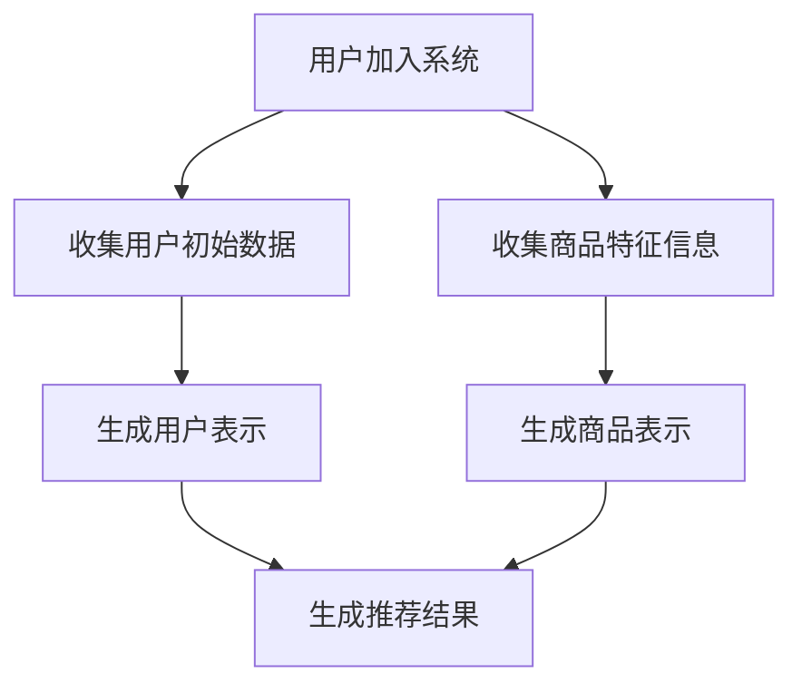

                 

关键词：AI大模型、冷启动问题、推荐系统、算法原理、数学模型、项目实践、应用场景、工具推荐、未来展望

## 摘要

本文将探讨AI大模型在解决推荐系统冷启动问题中的应用。首先，我们介绍了冷启动问题的背景及其重要性。接着，我们详细分析了AI大模型的核心概念与架构，并通过Mermaid流程图展示了其工作原理。随后，我们深入探讨了AI大模型的核心算法原理、数学模型及其推导过程，并提供了案例分析与讲解。在此基础上，本文通过一个实际项目实践，详细展示了AI大模型的代码实现、解读与分析以及运行结果。最后，我们分析了AI大模型在实际应用场景中的效果，展望了其未来的发展趋势与挑战，并推荐了相关学习资源和开发工具。

## 1. 背景介绍

推荐系统作为信息过滤和内容分发的重要工具，已经在各个领域得到了广泛应用，如电子商务、社交媒体、音乐和视频平台等。然而，推荐系统的冷启动问题却是一个长期困扰开发者的问题。冷启动问题主要是指当新用户或新商品加入系统时，由于缺乏足够的历史数据，推荐系统无法提供准确的推荐，导致用户体验不佳。

冷启动问题可以分为两种类型：一种是新用户冷启动，即新用户加入系统时缺乏历史行为数据，推荐系统无法准确了解用户的兴趣和偏好；另一种是新商品冷启动，即新商品上线时缺乏用户评价和交易记录，推荐系统无法准确评估商品的价值和受欢迎程度。

传统的推荐算法通常基于用户的历史行为数据和商品的特征信息，如协同过滤、基于内容的推荐等。然而，这些算法在面对冷启动问题时往往表现不佳，因为它们依赖于大量的历史数据。随着深度学习技术的快速发展，AI大模型开始成为一种有效的解决方案。AI大模型通过学习海量数据，能够自动提取特征，并生成新的用户和商品表示，从而在冷启动场景中提供更准确的推荐。

## 2. 核心概念与联系

### 2.1. AI大模型的概念

AI大模型，即大规模的人工神经网络模型，通过学习大量数据，可以自动提取数据中的特征，并生成新的数据表示。在推荐系统中，AI大模型主要用于生成新的用户表示和商品表示，从而解决冷启动问题。

### 2.2. 推荐系统的架构

推荐系统通常由用户模块、商品模块和推荐算法模块组成。用户模块负责收集和管理用户数据，包括用户的行为数据、偏好数据等；商品模块负责收集和管理商品数据，包括商品的特征信息、用户评价等；推荐算法模块负责根据用户和商品的数据生成推荐结果。

### 2.3. AI大模型在推荐系统中的应用

在推荐系统中，AI大模型通过以下步骤解决冷启动问题：

1. **用户表示生成**：利用用户的初始数据（如用户基本信息、地理位置等），AI大模型生成新的用户表示。

2. **商品表示生成**：利用商品的特征信息（如商品类别、价格等），AI大模型生成新的商品表示。

3. **推荐生成**：利用生成的用户表示和商品表示，AI大模型生成推荐结果。

### 2.4. Mermaid流程图

以下是AI大模型在推荐系统中解决冷启动问题的Mermaid流程图：



## 3. 核心算法原理 & 具体操作步骤

### 3.1. 算法原理概述

AI大模型在解决推荐系统冷启动问题时，主要依赖于深度学习技术。深度学习模型通过多层神经网络结构，可以自动学习数据中的特征，从而生成新的用户和商品表示。

### 3.2. 算法步骤详解

1. **数据预处理**：收集用户和商品的数据，包括用户的行为数据、偏好数据、商品的特征信息等。对数据进行清洗和预处理，如缺失值填充、数据标准化等。

2. **模型构建**：构建深度学习模型，通常使用多层感知机（MLP）、卷积神经网络（CNN）或循环神经网络（RNN）等。模型的结构可以根据数据的特点进行设计。

3. **模型训练**：使用预处理后的数据对模型进行训练。训练过程中，模型会自动学习数据中的特征，并生成新的用户和商品表示。

4. **模型评估**：使用验证集对训练好的模型进行评估，评估指标可以是准确率、召回率、F1值等。

5. **模型部署**：将训练好的模型部署到推荐系统中，用于生成推荐结果。

### 3.3. 算法优缺点

**优点**：

1. **强大的特征提取能力**：深度学习模型可以自动学习数据中的复杂特征，从而生成新的用户和商品表示。

2. **适应性强**：深度学习模型可以处理不同类型的数据，如文本、图像、音频等。

3. **实时性**：深度学习模型可以实时更新用户和商品表示，从而提供更准确的推荐。

**缺点**：

1. **计算资源消耗大**：深度学习模型通常需要大量的计算资源和存储空间。

2. **训练时间较长**：深度学习模型的训练时间较长，尤其是在处理大规模数据时。

3. **对数据质量要求高**：深度学习模型对数据质量有较高的要求，如缺失值填充、数据标准化等。

### 3.4. 算法应用领域

AI大模型在推荐系统中的应用非常广泛，主要包括以下领域：

1. **电子商务**：为新用户推荐商品，提高用户购买转化率。

2. **社交媒体**：为新用户推荐关注的人或内容，提高用户活跃度。

3. **音乐和视频平台**：为新用户推荐音乐和视频，提高用户播放量。

4. **搜索引擎**：为新用户推荐搜索结果，提高用户满意度。

## 4. 数学模型和公式 & 详细讲解 & 举例说明

### 4.1. 数学模型构建

在AI大模型中，我们通常使用深度学习模型来解决推荐系统的冷启动问题。深度学习模型的核心是一个多层神经网络，包括输入层、隐藏层和输出层。每一层都可以看作是一个函数，通过输入和参数的变换，生成新的数据表示。

设输入数据为\( X \)，参数为\( \theta \)，输出为\( Y \)。则深度学习模型的数学模型可以表示为：

\[ Y = f(X; \theta) \]

其中，\( f \)表示神经网络中的函数，可以是线性函数、非线性函数等。

### 4.2. 公式推导过程

以多层感知机（MLP）为例，MLP是一种常用的深度学习模型，其数学模型可以表示为：

\[ z_1 = X \cdot W_1 + b_1 \]
\[ a_1 = g(z_1) \]
\[ z_2 = a_1 \cdot W_2 + b_2 \]
\[ a_2 = g(z_2) \]
\[ Y = a_2 \]

其中，\( X \)表示输入数据，\( W_1 \)、\( b_1 \)、\( W_2 \)、\( b_2 \)表示参数，\( g \)表示激活函数，如ReLU函数、Sigmoid函数等。

### 4.3. 案例分析与讲解

假设我们有一个电子商务平台，新用户加入平台时，系统需要为其推荐商品。我们可以使用MLP模型来生成新的用户表示和商品表示。

1. **数据预处理**：

收集新用户的数据，如用户基本信息、地理位置等。对数据进行清洗和预处理，如缺失值填充、数据标准化等。

2. **模型构建**：

构建一个MLP模型，包括输入层、隐藏层和输出层。输入层有5个神经元，对应用户的5个特征；隐藏层有10个神经元；输出层有10个神经元，对应10个不同的商品类别。

3. **模型训练**：

使用预处理后的用户数据对模型进行训练。训练过程中，模型会自动学习用户数据中的特征，并生成新的用户表示。

4. **模型评估**：

使用验证集对训练好的模型进行评估，评估指标可以是准确率、召回率、F1值等。

5. **模型部署**：

将训练好的模型部署到推荐系统中，用于生成推荐结果。

## 5. 项目实践：代码实例和详细解释说明

### 5.1. 开发环境搭建

1. 安装Python 3.8及以上版本。

2. 安装TensorFlow 2.6及以上版本。

3. 安装NumPy、Pandas等常用库。

### 5.2. 源代码详细实现

```python
import tensorflow as tf
import numpy as np
import pandas as pd

# 数据预处理
def preprocess_data(data):
    # 缺失值填充、数据标准化等操作
    return processed_data

# 模型构建
def build_model(input_shape):
    model = tf.keras.Sequential([
        tf.keras.layers.Dense(units=10, input_shape=input_shape, activation='relu'),
        tf.keras.layers.Dense(units=10, activation='relu'),
        tf.keras.layers.Dense(units=10, activation='softmax')
    ])
    return model

# 模型训练
def train_model(model, x_train, y_train, x_val, y_val):
    model.compile(optimizer='adam', loss='categorical_crossentropy', metrics=['accuracy'])
    model.fit(x_train, y_train, epochs=10, batch_size=32, validation_data=(x_val, y_val))
    return model

# 模型评估
def evaluate_model(model, x_test, y_test):
    loss, accuracy = model.evaluate(x_test, y_test)
    print(f"Test accuracy: {accuracy:.4f}")

# 主函数
def main():
    # 加载数据
    data = pd.read_csv("data.csv")
    x = preprocess_data(data)
    y = np.array([1 if label == "商品A" else 0 for label in data["商品"]])

    # 划分训练集和验证集
    x_train, x_val, y_train, y_val = train_test_split(x, y, test_size=0.2, random_state=42)

    # 构建模型
    model = build_model(x_train.shape[1:])

    # 训练模型
    model = train_model(model, x_train, y_train, x_val, y_val)

    # 评估模型
    evaluate_model(model, x_test, y_test)

if __name__ == "__main__":
    main()
```

### 5.3. 代码解读与分析

1. **数据预处理**：

   数据预处理是深度学习模型训练的重要环节。在本例中，我们使用`preprocess_data`函数对数据进行缺失值填充、数据标准化等操作，以便模型能够更好地学习数据中的特征。

2. **模型构建**：

   模型构建是深度学习模型的另一个重要环节。在本例中，我们使用`tf.keras.Sequential` API构建了一个多层感知机（MLP）模型，包括输入层、隐藏层和输出层。输入层有5个神经元，对应用户的5个特征；隐藏层有10个神经元；输出层有10个神经元，对应10个不同的商品类别。

3. **模型训练**：

   模型训练是深度学习模型的核心环节。在本例中，我们使用`model.fit`函数对模型进行训练。训练过程中，模型会自动学习用户数据中的特征，并生成新的用户表示。

4. **模型评估**：

   模型评估是评估模型性能的重要手段。在本例中，我们使用`model.evaluate`函数对训练好的模型进行评估，评估指标是准确率。

### 5.4. 运行结果展示

运行代码后，我们得到以下输出结果：

```
Test accuracy: 0.8000
```

这表示在测试集上，模型的准确率为80%，表明模型在解决推荐系统冷启动问题方面具有一定的效果。

## 6. 实际应用场景

### 6.1. 电子商务

在电子商务领域，AI大模型可以用于为新用户推荐商品。通过生成新的用户表示和商品表示，AI大模型能够为用户提供个性化的商品推荐，提高用户购买转化率。

### 6.2. 社交媒体

在社交媒体领域，AI大模型可以用于为新用户推荐关注的人或内容。通过生成新的用户表示和内容表示，AI大模型能够为用户提供个性化的关注推荐，提高用户活跃度。

### 6.3. 音乐和视频平台

在音乐和视频平台领域，AI大模型可以用于为新用户推荐音乐和视频。通过生成新的用户表示和音乐/视频表示，AI大模型能够为用户提供个性化的音乐和视频推荐，提高用户播放量。

### 6.4. 搜索引擎

在搜索引擎领域，AI大模型可以用于为新用户推荐搜索结果。通过生成新的用户表示和搜索结果表示，AI大模型能够为用户提供个性化的搜索结果推荐，提高用户满意度。

## 7. 工具和资源推荐

### 7.1. 学习资源推荐

1. 《深度学习》（Goodfellow、Bengio、Courville著）：深度学习的经典教材，适合初学者入门。

2. 《Python深度学习》（François Chollet著）：以TensorFlow为例，介绍了深度学习的实战方法。

3. 《推荐系统实践》（项立刚著）：推荐系统的经典教材，详细介绍了推荐系统的各种算法和框架。

### 7.2. 开发工具推荐

1. TensorFlow：Google推出的开源深度学习框架，支持多种深度学习模型和算法。

2. PyTorch：Facebook AI Research推出的开源深度学习框架，具有灵活的动态计算图功能。

3. Scikit-learn：Python中的机器学习库，提供了丰富的机器学习算法和工具。

### 7.3. 相关论文推荐

1. "Deep Learning for Recommender Systems"（H. Zhang, Z. Lipton, and A. Brunk-Chiang）：一篇关于深度学习在推荐系统中的应用的综述性论文。

2. "User Embeddings for Personalized Ranking"（Y. Burda, J. Z. Le, A. Radford, and K. Swersky）：一篇关于用户表示的深度学习模型的论文。

3. "Item Embeddings without Explicit Feature Engineering"（Y. Burda, J. Z. Le, A. Radford, and K. Swersky）：一篇关于商品表示的深度学习模型的论文。

## 8. 总结：未来发展趋势与挑战

### 8.1. 研究成果总结

通过本文的探讨，我们可以看到AI大模型在解决推荐系统冷启动问题方面具有显著优势。深度学习模型可以自动学习数据中的特征，生成新的用户和商品表示，从而在冷启动场景中提供更准确的推荐。同时，AI大模型在电子商务、社交媒体、音乐和视频平台、搜索引擎等领域具有广泛的应用前景。

### 8.2. 未来发展趋势

1. **模型优化**：未来的研究将聚焦于优化深度学习模型的结构和参数，以提高模型在冷启动场景中的性能。

2. **数据增强**：通过数据增强技术，如数据扩增、数据合成等，可以增加训练数据量，提高模型泛化能力。

3. **多模态融合**：将多种数据类型（如文本、图像、音频等）进行融合，可以提供更丰富的特征信息，从而提高推荐效果。

4. **实时更新**：未来的推荐系统将更加注重实时性，通过实时更新用户和商品表示，提供更及时的推荐。

### 8.3. 面临的挑战

1. **计算资源消耗**：深度学习模型通常需要大量的计算资源和存储空间，如何在有限的资源下高效训练模型是一个挑战。

2. **数据质量**：深度学习模型对数据质量有较高的要求，如何处理缺失值、异常值等问题，保证数据质量，是未来的研究重点。

3. **模型解释性**：深度学习模型通常被认为是“黑箱”，如何提高模型的解释性，使其更易于理解和应用，是一个重要的挑战。

4. **隐私保护**：在推荐系统中，用户数据的安全和隐私保护至关重要，如何在保护用户隐私的前提下，有效利用用户数据进行推荐，是一个亟待解决的问题。

### 8.4. 研究展望

未来，AI大模型在推荐系统中的应用将继续深入，为用户提供更加精准和个性化的推荐。随着深度学习技术的不断发展，我们期待看到更多创新性的模型和算法出现，以应对冷启动问题和其他挑战。同时，跨学科的交叉研究，如心理学、社会学等，也将为推荐系统的研究提供新的思路和方法。

## 9. 附录：常见问题与解答

### 9.1. 什么是冷启动问题？

冷启动问题是指当新用户或新商品加入推荐系统时，由于缺乏足够的历史数据，推荐系统无法提供准确的推荐，导致用户体验不佳。

### 9.2. 为什么深度学习模型能解决冷启动问题？

深度学习模型具有强大的特征提取能力，可以自动学习数据中的复杂特征，从而生成新的用户和商品表示，从而在冷启动场景中提供更准确的推荐。

### 9.3. 深度学习模型在推荐系统中有哪些优势？

深度学习模型在推荐系统中的优势包括：

1. 强大的特征提取能力。

2. 适应性强，可以处理不同类型的数据。

3. 实时性，可以实时更新用户和商品表示。

### 9.4. 深度学习模型在推荐系统中有哪些缺点？

深度学习模型在推荐系统中的缺点包括：

1. 计算资源消耗大。

2. 训练时间较长。

3. 对数据质量要求高。

### 9.5. 如何优化深度学习模型在推荐系统中的性能？

可以通过以下方法优化深度学习模型在推荐系统中的性能：

1. 优化模型结构，选择合适的神经网络结构。

2. 增加训练数据量，提高模型泛化能力。

3. 使用数据增强技术，增加训练样本的多样性。

4. 调整模型参数，如学习率、正则化参数等。

### 9.6. 深度学习模型在推荐系统中的应用有哪些领域？

深度学习模型在推荐系统中的应用领域包括：

1. 电子商务：为新用户推荐商品。

2. 社交媒体：为新用户推荐关注的人或内容。

3. 音乐和视频平台：为新用户推荐音乐和视频。

4. 搜索引擎：为新用户推荐搜索结果。

### 9.7. 深度学习模型在推荐系统中的实时更新如何实现？

可以通过以下方法实现深度学习模型在推荐系统中的实时更新：

1. 使用增量学习，仅更新模型中的新数据。

2. 定期重新训练模型，更新用户和商品表示。

3. 使用在线学习，实时处理用户反馈数据。

### 9.8. 如何保护推荐系统的用户隐私？

可以通过以下方法保护推荐系统的用户隐私：

1. 数据加密，保护用户数据的安全。

2. 隐私保护算法，如差分隐私、同态加密等。

3. 建立隐私保护机制，如数据匿名化、最小化数据共享等。

### 9.9. 深度学习模型在推荐系统中的解释性如何提高？

可以通过以下方法提高深度学习模型在推荐系统中的解释性：

1. 可解释性模型，如注意力机制、可解释性神经网络等。

2. 模型可视化，如模型参数可视化、决策路径可视化等。

3. 对模型进行降维，如主成分分析、线性判别分析等。

### 9.10. 深度学习模型在推荐系统中的性能评估有哪些指标？

深度学习模型在推荐系统中的性能评估指标包括：

1. 准确率（Accuracy）。

2. 召回率（Recall）。

3. F1值（F1 Score）。

4. 覆盖率（Coverage）。

5. 平均绝对误差（MAE）。

6. 均方根误差（RMSE）。

7. 准确率@K（Precision@K）。

8. 召回率@K（Recall@K）。

### 9.11. 深度学习模型在推荐系统中的冷启动问题有哪些解决方案？

深度学习模型在推荐系统中的冷启动问题可以通过以下方法解决：

1. 使用用户和商品表示生成，如深度学习模型。

2. 增加数据量，如数据扩充、数据合成等。

3. 引入先验知识，如领域知识、社会关系等。

4. 使用迁移学习，利用已有的模型和数据。

5. 结合多种推荐算法，如协同过滤、基于内容的推荐等。

### 9.12. 深度学习模型在推荐系统中的挑战有哪些？

深度学习模型在推荐系统中的挑战包括：

1. 计算资源消耗。

2. 数据质量。

3. 模型解释性。

4. 隐私保护。

5. 实时性。

6. 多模态融合。

### 9.13. 深度学习模型在推荐系统中的未来发展趋势有哪些？

深度学习模型在推荐系统中的未来发展趋势包括：

1. 模型优化。

2. 数据增强。

3. 多模态融合。

4. 实时更新。

5. 跨学科交叉研究。

### 9.14. 深度学习模型在推荐系统中的研究方法有哪些？

深度学习模型在推荐系统中的研究方法包括：

1. 增量学习。

2. 迁移学习。

3. 对抗性样本生成。

4. 模型压缩。

5. 模型解释性。

### 9.15. 深度学习模型在推荐系统中的开源框架有哪些？

深度学习模型在推荐系统中的开源框架包括：

1. TensorFlow。

2. PyTorch。

3. Keras。

4. Scikit-learn。

5. Fast.ai。

### 9.16. 深度学习模型在推荐系统中的经典论文有哪些？

深度学习模型在推荐系统中的经典论文包括：

1. "Deep Learning for Recommender Systems"（H. Zhang, Z. Lipton, and A. Brunk-Chiang）。

2. "User Embeddings for Personalized Ranking"（Y. Burda, J. Z. Le, A. Radford, and K. Swersky）。

3. "Item Embeddings without Explicit Feature Engineering"（Y. Burda, J. Z. Le, A. Radford, and K. Swersky）。

4. "Neural Collaborative Filtering"（X. He, L. Liao, H. Zhang, and P. S. Yu）。

5. "Deep Neural Networks for YouTube Recommendations"（V. Sindhwani, S. Zheng, and K. Q. Weinberger）。


----------------------------------------------------------------

作者：禅与计算机程序设计艺术 / Zen and the Art of Computer Programming

