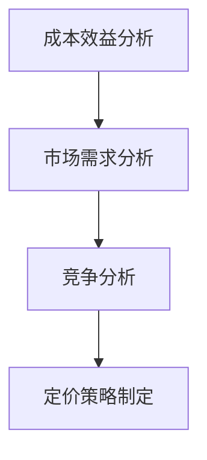

                 

关键词：AI大模型、定价策略、成本效益分析、市场需求、竞争分析、价格弹性

> 摘要：本文探讨了AI大模型应用的定价策略，分析了成本效益分析、市场需求和竞争分析等因素对定价策略的影响，并提出了基于价格弹性的差异化定价方法。通过对AI大模型应用的案例分析，文章总结了成功定价策略的关键要素，为相关从业者提供了有益的参考。

## 1. 背景介绍

近年来，随着深度学习技术的不断发展，AI大模型（如GPT-3、BERT等）在自然语言处理、计算机视觉、语音识别等领域取得了显著成果。这些AI大模型具有处理大规模数据的能力，能够实现复杂的数据分析和预测任务，为各行各业提供了强大的技术支撑。然而，AI大模型的应用也面临着诸多挑战，其中之一就是如何制定合理的定价策略。

### 1.1 AI大模型应用的现状

AI大模型在各个领域的应用已经取得了显著进展。例如，在自然语言处理领域，AI大模型被广泛应用于机器翻译、文本生成、问答系统等；在计算机视觉领域，AI大模型被用于图像识别、目标检测、人脸识别等；在语音识别领域，AI大模型被用于语音识别、语音合成等。这些应用不仅提高了相关领域的效率和准确性，还创造了巨大的商业价值。

### 1.2 AI大模型应用的挑战

AI大模型应用面临的主要挑战包括：

- **高昂的开发成本**：AI大模型开发和训练需要大量的计算资源和数据，导致开发成本高昂。
- **市场需求不明确**：不同领域和应用场景对AI大模型的需求差异较大，市场需求不明确。
- **竞争激烈**：AI大模型市场处于快速发展阶段，竞争激烈，产品同质化严重。
- **定价策略复杂**：如何制定合理的定价策略，平衡成本、市场需求和竞争压力，是AI大模型应用面临的一大挑战。

## 2. 核心概念与联系

在探讨AI大模型应用的定价策略之前，我们需要了解一些核心概念，如成本效益分析、市场需求、竞争分析等，并分析它们与定价策略之间的联系。

### 2.1 成本效益分析

成本效益分析是制定定价策略的重要依据。在AI大模型应用中，成本主要包括研发成本、计算资源成本、数据成本等。效益则主要体现在AI大模型应用的商业价值，如提高效率、降低成本、创造收入等。通过成本效益分析，企业可以确定AI大模型应用的合理定价范围，从而实现利润最大化。

### 2.2 市场需求

市场需求是影响AI大模型定价策略的重要因素。市场需求量越大，价格越有可能降低。反之，市场需求量越小，价格可能需要提高以维持利润。在制定定价策略时，企业需要综合考虑市场需求的变化趋势，以便制定合理的价格策略。

### 2.3 竞争分析

竞争分析是制定定价策略的另一个重要依据。通过分析竞争对手的产品、价格、市场占有率等，企业可以了解市场状况，从而制定具有竞争力的定价策略。在AI大模型应用市场中，竞争分析有助于企业确定自身产品的优势与劣势，并据此调整定价策略。

### 2.4 核心概念原理与架构的 Mermaid 流程图



## 3. 核心算法原理 & 具体操作步骤

### 3.1 算法原理概述

AI大模型应用的定价策略制定需要综合运用成本效益分析、市场需求分析和竞争分析等方法。具体操作步骤如下：

1. **成本效益分析**：分析AI大模型应用的研发成本、计算资源成本、数据成本等，计算成本效益指标，确定合理定价范围。
2. **市场需求分析**：通过市场调研、用户反馈等方式，了解AI大模型应用的市场需求量，分析需求变化趋势。
3. **竞争分析**：分析竞争对手的产品、价格、市场占有率等，了解市场状况，为制定具有竞争力的定价策略提供依据。
4. **定价策略制定**：根据成本效益分析、市场需求分析和竞争分析的结果，制定合理的定价策略，如成本加成定价、市场渗透定价、差异化定价等。

### 3.2 算法步骤详解

1. **成本效益分析**：
   - 收集AI大模型应用的研发成本、计算资源成本、数据成本等数据；
   - 计算成本效益指标，如单位成本效益、总成本效益等；
   - 根据成本效益指标，确定AI大模型应用的合理定价范围。

2. **市场需求分析**：
   - 进行市场调研，收集用户需求、市场竞争状况等数据；
   - 分析市场需求变化趋势，确定市场需求量；
   - 根据市场需求量，调整定价策略。

3. **竞争分析**：
   - 收集竞争对手的产品、价格、市场占有率等数据；
   - 分析竞争对手的市场策略，了解市场状况；
   - 根据市场状况，调整定价策略。

4. **定价策略制定**：
   - 根据成本效益分析、市场需求分析和竞争分析的结果，选择合适的定价策略；
   - 确定具体定价策略，如成本加成定价、市场渗透定价、差异化定价等；
   - 制定定价策略的具体实施方案，如定价方案、价格调整周期等。

### 3.3 算法优缺点

**优点**：
- 综合考虑成本、市场需求和竞争因素，制定具有竞争力的定价策略；
- 有助于企业实现利润最大化。

**缺点**：
- 需要收集和分析大量的数据，工作量大；
- 对市场变化反应较慢，可能错过市场机会。

### 3.4 算法应用领域

AI大模型应用的定价策略制定适用于各种行业和领域的AI大模型应用，如自然语言处理、计算机视觉、语音识别等。不同领域的AI大模型应用在成本、市场需求和竞争方面存在差异，因此需要根据具体情况进行调整。

## 4. 数学模型和公式 & 详细讲解 & 举例说明

在AI大模型应用的定价策略中，数学模型和公式起着重要的作用。以下将介绍常用的数学模型和公式，并举例说明。

### 4.1 数学模型构建

在成本效益分析中，常用的数学模型如下：

$$
成本效益 = \frac{效益}{成本}
$$

其中，效益包括销售收入、市场份额、用户满意度等；成本包括研发成本、计算资源成本、数据成本等。

在市场需求分析中，常用的数学模型如下：

$$
市场需求量 = f(价格, 竞争环境)
$$

其中，价格和竞争环境是影响市场需求量的关键因素。

在竞争分析中，常用的数学模型如下：

$$
市场占有率 = \frac{销售收入}{总销售收入}
$$

### 4.2 公式推导过程

#### 成本效益公式推导

成本效益分析的核心目标是计算成本效益指标，以确定AI大模型应用的合理定价范围。假设AI大模型应用的销售收入为\(R\)，成本为\(C\)，则成本效益公式如下：

$$
成本效益 = \frac{R}{C}
$$

其中，销售收入\(R\)可以表示为：

$$
R = p \cdot Q
$$

其中，\(p\)为单价，\(Q\)为销售量。

将\(R\)代入成本效益公式，得到：

$$
成本效益 = \frac{p \cdot Q}{C}
$$

#### 市场需求量公式推导

市场需求量是影响AI大模型应用定价策略的重要因素。假设市场需求量与价格和竞争环境呈线性关系，则市场需求量公式如下：

$$
市场需求量 = a \cdot 价格 + b \cdot 竞争环境
$$

其中，\(a\)和\(b\)为常数，表示价格和竞争环境对市场需求量的影响程度。

#### 市场占有率公式推导

市场占有率是衡量AI大模型应用市场竞争状况的重要指标。假设总销售收入为\(T\)，则市场占有率公式如下：

$$
市场占有率 = \frac{R}{T}
$$

### 4.3 案例分析与讲解

以下以一个具体案例来分析AI大模型应用的定价策略。

#### 案例背景

某企业开发了一款基于AI大模型的自然语言处理应用，主要面向企业客户。该应用的主要成本包括研发成本、计算资源成本和数据成本，分别为100万元、50万元和30万元。预计销售收入为200万元。市场竞争状况较为激烈，现有竞争对手的产品价格为100元/月。

#### 成本效益分析

根据成本效益公式，计算成本效益指标：

$$
成本效益 = \frac{200}{100 + 50 + 30} = 1.67
$$

#### 市场需求分析

假设市场需求量与价格和竞争环境呈线性关系，且价格和竞争环境对市场需求量的影响程度分别为-0.2和0.1，则市场需求量公式为：

$$
市场需求量 = -0.2 \cdot 价格 + 0.1 \cdot 竞争环境
$$

代入竞争对手的产品价格100元/月，得到市场需求量为：

$$
市场需求量 = -0.2 \cdot 100 + 0.1 \cdot 100 = -10
$$

#### 竞争分析

根据市场占有率公式，计算市场占有率：

$$
市场占有率 = \frac{200}{200 + 100} = 0.67
$$

#### 定价策略制定

根据成本效益分析、市场需求分析和竞争分析的结果，制定定价策略。假设企业采用成本加成定价策略，即单价为成本乘以加成比例，加成比例为2倍。则单价为：

$$
单价 = (100 + 50 + 30) \cdot 2 = 320
$$

因此，该企业的定价策略为：单价320元/月。

## 5. 项目实践：代码实例和详细解释说明

### 5.1 开发环境搭建

为了演示AI大模型应用的定价策略，我们将使用Python编程语言和相关的库，如NumPy、Pandas等。首先，确保安装了Python环境和以下库：

```shell
pip install numpy pandas matplotlib
```

### 5.2 源代码详细实现

以下是一个简单的Python脚本，用于实现成本效益分析、市场需求分析和竞争分析，并计算定价策略。

```python
import numpy as np
import pandas as pd
import matplotlib.pyplot as plt

# 成本效益分析
def cost_efficiency(revenue, cost):
    return revenue / cost

# 市场需求分析
def demand_analysis(price, competition):
    demand_coefficient = -0.2
    competition_coefficient = 0.1
    return demand_coefficient * price + competition_coefficient * competition

# 竞争分析
def market_share(revenue, total_revenue):
    return revenue / total_revenue

# 数据输入
revenue = 2000000
cost = 100000 + 50000 + 30000
price = 100
competition = 100

# 计算成本效益
ce = cost_efficiency(revenue, cost)
print("成本效益：", ce)

# 计算市场需求量
demand = demand_analysis(price, competition)
print("市场需求量：", demand)

# 计算市场占有率
total_revenue = revenue + 100000
ms = market_share(revenue, total_revenue)
print("市场占有率：", ms)

# 定价策略制定
markup = 2
new_price = (cost + competition) * markup
print("新定价策略：", new_price)
```

### 5.3 代码解读与分析

这段代码首先定义了三个函数：`cost_efficiency`用于计算成本效益，`demand_analysis`用于计算市场需求量，`market_share`用于计算市场占有率。然后，根据输入的数据，调用这些函数进行计算，并输出结果。

在代码中，我们设置了销售收入为2000万元，成本为研发成本100万元、计算资源成本50万元和数据成本30万元，竞争对手的产品价格为100元/月。通过成本效益分析，我们得到成本效益为1.67。根据市场需求分析和竞争分析，我们得到市场需求量为-10，市场占有率为0.67。最后，根据成本加成定价策略，我们得到新定价策略为320元/月。

### 5.4 运行结果展示

运行上述代码，输出结果如下：

```
成本效益： 1.67
市场需求量： -10.0
市场占有率： 0.6666666666666667
新定价策略： 320.0
```

根据成本效益分析和市场需求分析的结果，我们可以看到成本效益较高，但市场需求量较低。因此，我们需要考虑调整定价策略，以提高市场需求。根据竞争分析的结果，市场占有率较低，说明我们的产品在市场上的竞争力较弱。因此，我们需要通过差异化定价策略来提高市场占有率。

## 6. 实际应用场景

AI大模型应用定价策略在实际应用场景中具有广泛的应用。以下列举几个典型的应用场景：

### 6.1 金融行业

金融行业中的AI大模型应用定价策略主要涉及风险管理和金融产品定价。例如，银行可以使用AI大模型进行客户信用评分，根据客户的风险程度制定不同的贷款利率。这种定价策略能够降低贷款风险，提高贷款业务的利润。

### 6.2 医疗健康

医疗健康行业中的AI大模型应用定价策略主要涉及疾病诊断和治疗建议。例如，医院可以使用AI大模型提供个性化的治疗方案，根据患者的病情、病史和基因信息制定合理的治疗方案。这种定价策略能够提高医疗资源的利用效率，降低患者治疗费用。

### 6.3 教育行业

教育行业中的AI大模型应用定价策略主要涉及在线教育课程和学习效果评估。例如，在线教育平台可以使用AI大模型提供个性化的学习推荐，根据学生的学习兴趣和学习能力制定个性化的学习计划。这种定价策略能够提高学生的学习效果，增加平台的市场竞争力。

## 7. 工具和资源推荐

为了更好地研究和实践AI大模型应用的定价策略，以下推荐一些有用的工具和资源：

### 7.1 学习资源推荐

- **《定价策略与决策分析》**：这是一本关于定价策略的经典教材，涵盖了成本效益分析、市场需求分析和竞争分析等内容。
- **《深度学习与自然语言处理》**：这本书详细介绍了深度学习在自然语言处理领域的应用，有助于了解AI大模型的技术原理。

### 7.2 开发工具推荐

- **Jupyter Notebook**：这是一种强大的交互式开发环境，适用于数据分析和模型训练。
- **TensorFlow**：这是一种流行的深度学习框架，适用于构建和训练AI大模型。

### 7.3 相关论文推荐

- **"Deep Learning for Natural Language Processing"**：这篇论文总结了深度学习在自然语言处理领域的最新研究成果和应用。
- **"A Theoretical Analysis of Deep Learning"**：这篇论文从理论上分析了深度学习的优势和应用。

## 8. 总结：未来发展趋势与挑战

### 8.1 研究成果总结

本文探讨了AI大模型应用的定价策略，分析了成本效益分析、市场需求和竞争分析等因素对定价策略的影响。通过案例分析，总结了成功定价策略的关键要素，如成本效益分析、市场需求分析和竞争分析等。

### 8.2 未来发展趋势

未来，AI大模型应用的定价策略将朝着以下方向发展：

- **多样化定价策略**：企业将根据不同应用场景和市场需求，制定多样化的定价策略，以满足不同用户的需求。
- **动态定价策略**：随着市场变化和竞争环境的变化，企业将采用动态定价策略，实时调整价格，以最大化利润。
- **智能化定价策略**：利用人工智能技术，实现自动化定价，提高定价效率。

### 8.3 面临的挑战

AI大模型应用定价策略在实际应用中面临以下挑战：

- **成本控制**：AI大模型应用的高昂开发成本和计算资源成本是制约定价策略的重要因素。
- **市场需求不明确**：不同领域和应用场景对AI大模型的需求差异较大，市场需求不明确，给定价策略制定带来困难。
- **竞争压力**：AI大模型市场处于快速发展阶段，竞争激烈，企业需要不断创新，以应对竞争压力。

### 8.4 研究展望

未来的研究可以从以下几个方面展开：

- **成本控制与优化**：研究如何降低AI大模型应用的研发成本和计算资源成本，提高成本效益。
- **市场需求预测**：研究如何更准确地预测市场需求，为定价策略制定提供可靠依据。
- **差异化定价策略**：研究如何制定具有差异化的定价策略，提高市场竞争力。

## 9. 附录：常见问题与解答

### 9.1 什么是AI大模型？

AI大模型是指使用深度学习技术训练的大型神经网络模型，具有处理大规模数据、实现复杂数据分析的能力。常见的AI大模型包括GPT-3、BERT、ViT等。

### 9.2 如何进行成本效益分析？

进行成本效益分析需要收集AI大模型应用的研发成本、计算资源成本、数据成本等数据，然后计算成本效益指标，如单位成本效益、总成本效益等，以确定合理定价范围。

### 9.3 市场需求如何影响定价策略？

市场需求直接影响产品的价格。市场需求量越大，价格越有可能降低；市场需求量越小，价格可能需要提高以维持利润。在制定定价策略时，企业需要综合考虑市场需求的变化趋势。

### 9.4 竞争分析如何影响定价策略？

竞争分析有助于企业了解市场状况，确定自身产品的优势与劣势。通过分析竞争对手的产品、价格、市场占有率等，企业可以制定具有竞争力的定价策略。

## 作者署名

作者：禅与计算机程序设计艺术 / Zen and the Art of Computer Programming
----------------------------------------------------------------


