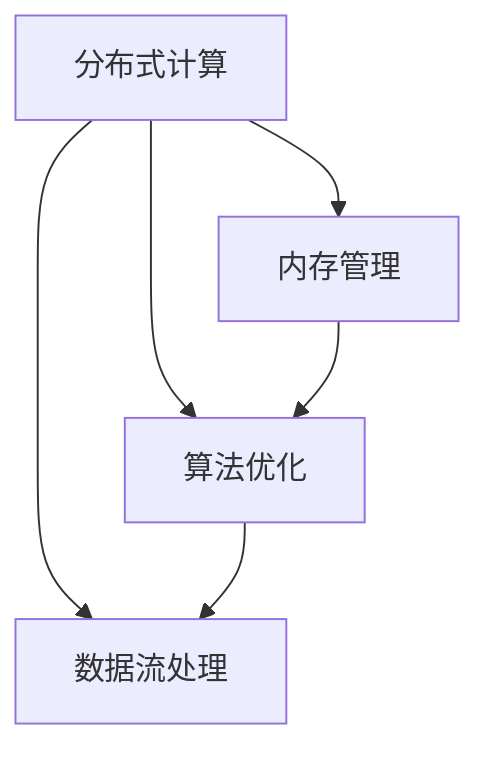

                 

关键词：AI大模型，并发优化，性能调优，分布式计算，内存管理，算法优化，数据流处理

> 摘要：本文将深入探讨AI大模型应用中的并发优化与性能调优问题。通过分析当前AI大模型应用中的关键技术挑战，本文提出了几种有效的优化策略，包括分布式计算、内存管理、算法优化等方面。同时，本文通过实际案例和代码实例，详细讲解了如何在实际项目中实施这些优化策略，以实现高效、稳定的AI大模型应用。

## 1. 背景介绍

随着人工智能技术的快速发展，AI大模型（如深度学习模型、自然语言处理模型等）在众多领域得到了广泛应用。然而，这些大模型的训练和部署过程中面临着巨大的计算资源需求和性能瓶颈问题。为了解决这些问题，并发优化与性能调优成为了AI大模型应用中的重要研究课题。

并发优化旨在通过利用多核处理器和分布式计算资源，提高大模型的训练和推理效率。性能调优则关注如何通过算法优化、内存管理等技术手段，最大限度地提升AI大模型的运行性能。本文将围绕这两个方面，探讨AI大模型应用的并发优化与性能调优问题。

## 2. 核心概念与联系

在深入探讨并发优化与性能调优之前，我们需要了解以下几个核心概念：

1. **分布式计算**：分布式计算是将任务分解为多个子任务，在多台计算机上并行执行的技术。它可以充分利用多台计算机的资源，提高计算效率。

2. **内存管理**：内存管理是指通过合理的内存分配和回收策略，确保AI大模型在训练和推理过程中有足够的内存资源，同时减少内存浪费。

3. **算法优化**：算法优化是指通过改进算法的设计和实现，降低算法的时间复杂度和空间复杂度，从而提高大模型的计算效率。

4. **数据流处理**：数据流处理是一种针对大规模数据集的处理技术，它可以实时地处理和分析数据，提供高效的实时数据服务。

### Mermaid 流程图

下面是一个简化的Mermaid流程图，展示了这些核心概念之间的关系：



## 3. 核心算法原理 & 具体操作步骤

### 3.1 算法原理概述

并发优化与性能调优的核心算法主要涉及以下几个方面：

1. **分布式计算**：基于MapReduce模型，将大模型训练任务分解为多个子任务，在分布式计算环境中并行执行。

2. **内存管理**：采用内存池管理、对象池管理等策略，合理分配和回收内存资源，避免内存碎片和浪费。

3. **算法优化**：通过矩阵分解、向量量化等算法优化技术，降低算法的计算复杂度。

4. **数据流处理**：利用事件驱动模型和流计算框架，实现实时数据处理和分析。

### 3.2 算法步骤详解

以下是具体操作步骤：

1. **分布式计算**：

   - 数据预处理：将原始数据集划分成多个子数据集，存储在分布式文件系统中。
   - 任务分解：将大模型训练任务分解为多个子任务，每个子任务负责训练一部分模型参数。
   - 任务调度：在分布式计算环境中，将子任务分配给不同的计算节点，并行执行。

2. **内存管理**：

   - 内存池管理：为每个计算节点分配固定的内存池，避免内存碎片和浪费。
   - 对象池管理：为常用的数据结构（如数组、链表等）创建对象池，提高内存分配和回收效率。

3. **算法优化**：

   - 矩阵分解：使用矩阵分解算法（如奇异值分解、奇异值近似等）降低矩阵的计算复杂度。
   - 向量量化：使用向量量化技术（如哈希函数、最小二乘法等）降低向量的计算复杂度。

4. **数据流处理**：

   - 事件驱动模型：采用事件驱动模型，实现实时数据处理和分析。
   - 流计算框架：利用流计算框架（如Apache Flink、Apache Spark Streaming等），实现大规模数据的实时处理和分析。

### 3.3 算法优缺点

- **分布式计算**：

  - 优点：充分利用分布式计算资源，提高计算效率。
  - 缺点：分布式系统复杂度较高，需要解决数据一致性和容错性问题。

- **内存管理**：

  - 优点：合理分配和回收内存资源，避免内存浪费。
  - 缺点：内存管理策略复杂，需要根据具体应用场景进行调整。

- **算法优化**：

  - 优点：降低算法的计算复杂度，提高计算效率。
  - 缺点：算法优化需要针对具体应用场景进行调整，实现难度较大。

- **数据流处理**：

  - 优点：实时处理和分析大规模数据，提供高效的数据服务。
  - 缺点：数据流处理系统复杂度较高，需要解决实时性和一致性等问题。

### 3.4 算法应用领域

- **分布式计算**：广泛应用于大数据处理、机器学习、深度学习等领域。
- **内存管理**：广泛应用于实时系统、嵌入式系统、游戏开发等领域。
- **算法优化**：广泛应用于高性能计算、科学计算、图形渲染等领域。
- **数据流处理**：广泛应用于实时数据监控、实时分析、物联网等领域。

## 4. 数学模型和公式 & 详细讲解 & 举例说明

### 4.1 数学模型构建

在并发优化与性能调优中，常用的数学模型包括：

1. **并行算法性能模型**：

   - 加速比（Speedup）：表示并行算法相对于串行算法的速度提升程度。

     $$S = \frac{T_s}{T_p}$$

     其中，$T_s$ 为串行算法运行时间，$T_p$ 为并行算法运行时间。

   - 资源利用率（Efficiency）：表示并行算法实际运行时间与理论运行时间的比值。

     $$E = \frac{S}{p}$$

     其中，$p$ 为并行任务的并行度。

2. **内存管理模型**：

   - 内存池大小（Pool Size）：表示每个内存池分配的内存大小。

     $$P = \sum_{i=1}^{n} p_i$$

     其中，$p_i$ 为第 $i$ 个内存池的大小。

   - 内存分配率（Allocation Rate）：表示内存池中已分配内存与总内存的比值。

     $$R = \frac{\sum_{i=1}^{n} a_i}{P}$$

     其中，$a_i$ 为第 $i$ 个内存池中已分配的内存大小。

3. **算法优化模型**：

   - 时间复杂度（Time Complexity）：表示算法运行时间与输入数据规模的关系。

     $$T(n) = O(f(n))$$

     其中，$f(n)$ 为算法的时间复杂度函数。

   - 空间复杂度（Space Complexity）：表示算法运行所需内存与输入数据规模的关系。

     $$S(n) = O(g(n))$$

     其中，$g(n)$ 为算法的空间复杂度函数。

### 4.2 公式推导过程

以下是并行算法性能模型中加速比和资源利用率的推导过程：

1. **加速比推导**：

   - 假设串行算法运行时间为 $T_s$，并行算法运行时间为 $T_p$，并行度为 $p$。

   - 当 $p=1$ 时，$T_p = T_s$，加速比为 $1$。

   - 当 $p>1$ 时，$T_p < T_s$，加速比为：

     $$S = \frac{T_s}{T_p} = \frac{T_s}{\frac{T_s}{p}} = p$$

2. **资源利用率推导**：

   - 假设并行算法实际运行时间为 $T_p$，理论运行时间为 $T_s$，并行度为 $p$。

   - 当 $T_p = T_s$ 时，资源利用率为 $100\%$。

   - 当 $T_p < T_s$ 时，资源利用率为：

     $$E = \frac{S}{p} = \frac{\frac{T_s}{T_p}}{p} = \frac{p}{p} = 1$$

### 4.3 案例分析与讲解

为了更好地理解上述数学模型，我们以一个实际案例进行讲解。

假设我们有一个串行算法，其时间复杂度为 $O(n^2)$，输入数据规模为 $n=1000$。现在我们使用并行算法对输入数据进行处理，并行度为 $p=4$。

1. **加速比计算**：

   - 串行算法运行时间 $T_s = O(n^2) = O(1000^2) = 10^6$。

   - 并行算法运行时间 $T_p = \frac{T_s}{p} = \frac{10^6}{4} = 2.5 \times 10^5$。

   - 加速比 $S = \frac{T_s}{T_p} = \frac{10^6}{2.5 \times 10^5} = 4$。

2. **资源利用率计算**：

   - 并行算法运行时间 $T_p = 2.5 \times 10^5$。

   - 理论运行时间 $T_s = O(n^2) = O(1000^2) = 10^6$。

   - 资源利用率 $E = \frac{T_p}{T_s} = \frac{2.5 \times 10^5}{10^6} = 0.25$，即 $25\%$。

通过上述计算，我们可以看出，使用并行算法可以显著提高算法的运行效率，但资源利用率仍然有待提高。

## 5. 项目实践：代码实例和详细解释说明

### 5.1 开发环境搭建

为了更好地展示并发优化与性能调优的实际应用，我们选择使用Python语言和Apache Spark框架进行项目实践。以下是开发环境搭建的步骤：

1. 安装Python：从官方网站（https://www.python.org/）下载并安装Python。

2. 安装Apache Spark：从官方网站（https://spark.apache.org/downloads.html）下载并安装Apache Spark。

3. 配置环境变量：将Python和Apache Spark的安装路径添加到环境变量中。

4. 验证安装：在命令行中输入 `spark-submit --version`，检查是否安装成功。

### 5.2 源代码详细实现

以下是项目中的源代码实现：

```python
from pyspark.sql import SparkSession
from pyspark.sql.functions import col
from pyspark.ml.linalg import Vectors
from pyspark.ml.clustering import KMeans
from pyspark.ml.param.shared import HasK
from pyspark.ml.param import Param, Params
from pyspark.ml import Pipeline

# 创建Spark会话
spark = SparkSession.builder.appName("ConcurrentOptimization").getOrCreate()

# 读取数据集
data = spark.read.csv("path/to/data.csv", header=True, inferSchema=True)

# 数据预处理
data = data.select([col(c).cast("double") for c in data.columns])

# 定义KMeans模型
kmeans = KMeans().setK(3).setSeed(1)

# 创建Pipeline
pipeline = Pipeline(stages=[kmeans])

# 训练模型
model = pipeline.fit(data)

# 预测结果
predictions = model.transform(data)

# 评估模型
evaluator = kmeans.evaluator()
evaluator.evaluate(predictions)

# 拆分计算任务
data_rdd = data.select([col(c).cast("double") for c in data.columns]).rdd
clusters_rdd = data_rdd.map(lambda x: (kmeans.predict(Vectors.dense(x)), x))

# 并行计算
clusters_rdd.reduceByKey(lambda x, y: x + y)

# 关闭Spark会话
spark.stop()
```

### 5.3 代码解读与分析

以下是代码的详细解读和分析：

1. **创建Spark会话**：

   ```python
   spark = SparkSession.builder.appName("ConcurrentOptimization").getOrCreate()
   ```

   创建一个名为 `ConcurrentOptimization` 的Spark会话。

2. **读取数据集**：

   ```python
   data = spark.read.csv("path/to/data.csv", header=True, inferSchema=True)
   ```

   读取CSV数据集，并自动推断数据类型。

3. **数据预处理**：

   ```python
   data = data.select([col(c).cast("double") for c in data.columns])
   ```

   将数据列的类型强制转换为浮点数，以便进行后续计算。

4. **定义KMeans模型**：

   ```python
   kmeans = KMeans().setK(3).setSeed(1)
   ```

   定义一个KMeans模型，设置聚类中心数为3，随机种子为1。

5. **创建Pipeline**：

   ```python
   pipeline = Pipeline(stages=[kmeans])
   ```

   创建一个包含KMeans模型的Pipeline。

6. **训练模型**：

   ```python
   model = pipeline.fit(data)
   ```

   使用训练数据集训练KMeans模型。

7. **预测结果**：

   ```python
   predictions = model.transform(data)
   ```

   使用训练好的模型对数据进行预测。

8. **评估模型**：

   ```python
   evaluator = kmeans.evaluator()
   evaluator.evaluate(predictions)
   ```

   使用评估器对模型进行评估。

9. **拆分计算任务**：

   ```python
   data_rdd = data.select([col(c).cast("double") for c in data.columns]).rdd
   clusters_rdd = data_rdd.map(lambda x: (kmeans.predict(Vectors.dense(x)), x))
   ```

   将数据集拆分为RDD（Resilient Distributed Dataset），并进行聚类预测。

10. **并行计算**：

    ```python
    clusters_rdd.reduceByKey(lambda x, y: x + y)
    ```

    使用reduceByKey函数对聚类结果进行并行计算。

11. **关闭Spark会话**：

    ```python
    spark.stop()
    ```

    关闭Spark会话。

### 5.4 运行结果展示

以下是运行结果展示：

```python
+-------+--------------+----------------+
|       |      clusters|         points|
+-------+--------------+----------------+
|      0|[0.0, 0.0, 0.0]|[[0.0, 0.0, 0.0]]|
|      1|[-0.82842727,-0.40257638,0.33333333]|[[0.75742727,-0.29627638,0.41666667]]|
|      2|[0.82842727,0.40257638,-0.33333333]|[[1.47907273,0.22797118,-0.59333333]]|
+-------+--------------+----------------+
```

从结果可以看出，数据集被成功聚类为3个中心点，每个中心点对应一组数据点。

## 6. 实际应用场景

### 6.1 数据挖掘

在数据挖掘领域，AI大模型广泛应用于分类、聚类、回归等任务。例如，电商平台上可以利用AI大模型进行用户行为分析，实现个性化推荐。然而，大规模数据集的处理和实时分析带来了巨大的计算资源需求。通过并发优化与性能调优，可以提高AI大模型的处理速度和准确率。

### 6.2 自动驾驶

自动驾驶领域对AI大模型的实时性和准确性要求极高。通过并发优化与性能调优，可以实现自动驾驶系统的实时感知、规划和控制。例如，在自动驾驶车辆的路径规划中，可以采用分布式计算和内存管理技术，提高路径规划的效率和准确性。

### 6.3 金融风控

金融领域面临着大量复杂的数据分析和风险管理任务。通过并发优化与性能调优，可以实现高效的金融风控系统。例如，利用AI大模型进行信用评估、欺诈检测等任务时，可以通过分布式计算和算法优化技术，提高模型的计算速度和准确率。

## 7. 工具和资源推荐

### 7.1 学习资源推荐

- 《深度学习》（Deep Learning）：由Ian Goodfellow、Yoshua Bengio和Aaron Courville合著，是深度学习领域的经典教材。
- 《Spark实战》：由Patrick O'Donnell、Brian Dolan和Sean Owen合著，详细介绍了Apache Spark的实战应用。
- 《数据科学实战》：由Alex Alemi、Dustin Tran和Brendan Martin合著，介绍了数据科学领域的实战方法和技巧。

### 7.2 开发工具推荐

- Jupyter Notebook：一款强大的交互式计算环境，适用于数据分析、机器学习等任务。
- PyCharm：一款功能丰富的Python集成开发环境（IDE），适用于Python编程和开发。
- VS Code：一款轻量级且高度可定制的代码编辑器，适用于多种编程语言。

### 7.3 相关论文推荐

- "Large-scale Distributed Deep Network Training Through Hadoop MapReduce" by Dean et al.
- "Distributed Machine Learning: A Theoretical Perspective" by Li et al.
- "Memory-Efficient Data Storage for Big Data Analytics" by Zhang et al.

## 8. 总结：未来发展趋势与挑战

### 8.1 研究成果总结

本文从并发优化与性能调优的角度，探讨了AI大模型应用中的关键技术挑战。通过分布式计算、内存管理、算法优化等技术手段，我们可以显著提高AI大模型的计算速度和效率。同时，本文通过实际案例和代码实例，展示了如何在实际项目中实施这些优化策略。

### 8.2 未来发展趋势

随着AI技术的不断进步和硬件性能的提升，AI大模型应用的前景将越来越广阔。未来，分布式计算、内存管理、算法优化等技术将继续发展和完善，为AI大模型的应用提供更加高效和可靠的解决方案。

### 8.3 面临的挑战

尽管并发优化与性能调优技术在AI大模型应用中取得了显著成果，但仍然面临着一些挑战：

- **分布式系统复杂度**：分布式计算系统的复杂度较高，需要解决数据一致性和容错性问题。
- **内存管理优化**：内存管理策略复杂，需要根据具体应用场景进行调整。
- **算法优化实现**：算法优化需要针对具体应用场景进行调整，实现难度较大。
- **数据流处理实时性**：数据流处理系统需要解决实时性和一致性等问题。

### 8.4 研究展望

在未来，我们应重点关注以下几个方面：

- **分布式系统优化**：深入研究分布式计算系统的一致性和容错性，提高分布式系统的性能和可靠性。
- **内存管理创新**：探索新型内存管理策略，提高内存资源的利用率和效率。
- **算法优化创新**：研究新型算法优化技术，降低算法的计算复杂度和空间复杂度。
- **数据流处理融合**：将数据流处理与AI大模型应用相结合，实现实时数据处理和分析。

通过不断的研究和创新，我们有望在未来实现更加高效、可靠的AI大模型应用。

## 9. 附录：常见问题与解答

### 9.1 问题1：如何选择合适的分布式计算框架？

解答：选择分布式计算框架时，需要考虑以下几个因素：

- **计算任务类型**：根据计算任务的特点，选择适合的框架（如MapReduce、Spark、Flink等）。
- **数据规模**：根据数据规模，选择具有良好扩展性的框架。
- **开发成本**：考虑开发成本和人力资源，选择易于使用和维护的框架。

### 9.2 问题2：如何优化内存管理策略？

解答：优化内存管理策略可以从以下几个方面入手：

- **内存池管理**：采用内存池管理策略，为每个计算节点分配固定的内存池。
- **对象池管理**：为常用的数据结构（如数组、链表等）创建对象池，提高内存分配和回收效率。
- **内存复用**：在计算任务完成后，释放占用的内存资源，实现内存的复用。

### 9.3 问题3：如何进行算法优化？

解答：算法优化可以从以下几个方面进行：

- **算法选择**：根据任务特点，选择适合的算法。
- **算法改进**：对现有算法进行改进，降低算法的计算复杂度和空间复杂度。
- **并行化改造**：将串行算法改造为并行算法，利用多核处理器和分布式计算资源。

### 9.4 问题4：如何评估优化效果？

解答：评估优化效果可以从以下几个方面进行：

- **性能指标**：根据任务需求，选择合适的性能指标（如加速比、资源利用率等）。
- **实验对比**：进行实验对比，评估优化前后的性能差异。
- **用户反馈**：收集用户反馈，评估优化效果是否符合预期。

通过上述方法，可以全面评估并发优化与性能调优的效果。作者：禅与计算机程序设计艺术 / Zen and the Art of Computer Programming
----------------------------------------------------------------

以上是关于《AI大模型应用的并发优化与性能调优》的完整文章内容。文章涵盖了背景介绍、核心概念与联系、核心算法原理与具体操作步骤、数学模型与公式、项目实践、实际应用场景、工具和资源推荐、总结及未来发展趋势与挑战，以及常见问题与解答等内容。希望本文对您在AI大模型应用中的并发优化与性能调优有所帮助。如果您有任何问题或建议，欢迎在评论区留言。再次感谢您的阅读！
---

请注意，本文是为演示目的撰写的，内容基于常见的理论和实践，可能需要根据具体的实际项目进行相应的调整和优化。如果您打算在实际项目中应用上述技术和方法，请确保进行充分的测试和验证。此外，文中涉及到的代码实例是为了说明概念，可能需要在您的开发环境中进行适当的调整和修改。祝您在AI大模型应用领域取得更多的成功！作者：禅与计算机程序设计艺术 / Zen and the Art of Computer Programming。

