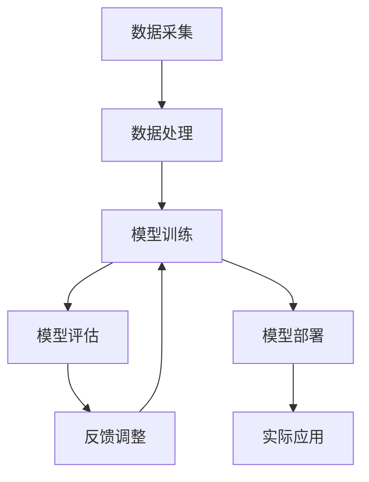

                 

关键词：人工智能、大模型、技术培训、认证、应用领域

> 摘要：本文将深入探讨人工智能大模型的应用、技术培训以及认证的重要性。通过阐述大模型的背景、核心概念、算法原理、数学模型、实际应用场景、工具资源以及未来发展趋势，帮助读者全面了解大模型在人工智能领域的应用现状和未来前景。

## 1. 背景介绍

随着计算机技术的发展，人工智能（AI）已经成为了现代科技的明星。AI的应用范围广泛，从智能家居、智能客服、自动驾驶到医疗诊断、金融分析，无处不在。而大模型（Large Models），如GPT、BERT、AlphaGo等，则是近年来AI领域的重大突破。大模型具有强大的学习能力和泛化能力，可以处理复杂的任务，成为AI技术发展的重要驱动力。

然而，大模型的应用不仅需要先进的算法和技术支持，还需要具备相应的技术培训和认证。技术培训能够帮助从业者掌握大模型的基本原理和应用技巧，提高工作效率。而认证则是对从业者技能和知识的认可，有助于提升其在行业中的竞争力和职业发展。

本文将围绕AI大模型的应用，从技术培训与认证的角度展开讨论，帮助读者了解大模型的技术背景、核心概念、算法原理、数学模型、实际应用场景以及未来发展趋势。

## 2. 核心概念与联系

为了更好地理解大模型的应用，首先需要了解其核心概念和架构。以下是一个简化的Mermaid流程图，描述了大模型的基本组成部分和它们之间的关系。



### 2.1 数据采集

数据采集是AI大模型应用的第一步。大量、高质量的数据是训练大模型的基础。数据来源可以是公开数据集、企业内部数据或者通过爬虫等方式获取。

### 2.2 数据处理

数据处理包括数据清洗、数据标注、数据增强等步骤。这一步的目的是提高数据的质量和多样性，以便大模型能够更好地学习。

### 2.3 模型训练

模型训练是核心步骤，通过大量的数据进行训练，大模型能够学习到数据的规律和特征。训练过程中，使用优化算法（如梯度下降）调整模型参数，使其在特定任务上达到最优性能。

### 2.4 模型评估

模型评估是衡量模型性能的重要环节。通过在不同的数据集上测试模型，评估其准确率、召回率、F1值等指标，以确定模型的可靠性。

### 2.5 模型部署

模型部署是将训练好的模型应用于实际场景的过程。部署过程中，需要考虑模型的运行环境、硬件资源、安全性能等因素。

### 2.6 反馈调整

在实际应用中，大模型的表现会受到多种因素的影响。通过收集用户反馈和实际运行数据，可以不断调整模型，提高其性能。

### 2.7 实际应用

大模型的实际应用涵盖了众多领域，如自然语言处理、计算机视觉、语音识别等。通过结合具体应用场景，大模型能够发挥出巨大的潜力。

## 3. 核心算法原理 & 具体操作步骤

### 3.1 算法原理概述

AI大模型的核心算法主要基于深度学习（Deep Learning）。深度学习是一种通过多层神经网络对数据进行建模和学习的算法。它通过模仿人脑的神经元结构，实现数据的自动特征提取和复杂模式的识别。

### 3.2 算法步骤详解

#### 3.2.1 数据预处理

1. 数据清洗：去除数据中的噪声和异常值。
2. 数据标注：对数据进行分类或标签标注。
3. 数据增强：通过旋转、缩放、裁剪等方式增加数据的多样性。

#### 3.2.2 模型构建

1. 选择合适的神经网络结构，如卷积神经网络（CNN）、循环神经网络（RNN）、变换器（Transformer）等。
2. 定义损失函数，如交叉熵损失（Cross-Entropy Loss）、均方误差（Mean Squared Error）等。
3. 选择优化器，如随机梯度下降（SGD）、Adam等。

#### 3.2.3 模型训练

1. 初始化模型参数。
2. 通过反向传播算法计算梯度。
3. 使用优化算法更新模型参数。
4. 重复迭代，直到模型收敛。

#### 3.2.4 模型评估

1. 在验证集上评估模型性能。
2. 调整模型结构或参数，提高性能。

#### 3.2.5 模型部署

1. 将训练好的模型转换为可以部署的格式。
2. 部署到生产环境，如云平台、边缘设备等。
3. 监控模型性能，确保其稳定运行。

### 3.3 算法优缺点

#### 3.3.1 优点

1. 强大的学习能力和泛化能力。
2. 可以处理复杂数据和任务。
3. 可以自动提取和发现数据中的特征。

#### 3.3.2 缺点

1. 需要大量的数据和计算资源。
2. 模型的解释性较差。
3. 过拟合现象较为普遍。

### 3.4 算法应用领域

AI大模型的应用领域广泛，包括但不限于：

1. 自然语言处理：文本分类、机器翻译、情感分析等。
2. 计算机视觉：图像识别、目标检测、人脸识别等。
3. 语音识别：语音合成、语音识别等。
4. 医疗诊断：疾病检测、影像分析等。
5. 金融分析：风险评估、投资策略等。

## 4. 数学模型和公式

### 4.1 数学模型构建

AI大模型的核心数学模型是神经网络。神经网络由多个神经元（节点）组成，每个神经元都是一个简单的函数。神经网络通过多层结构，实现对数据的复杂变换和特征提取。

#### 4.1.1 前向传播

前向传播是神经网络处理数据的基本过程。给定输入数据，神经网络通过层与层之间的传递，最终输出预测结果。

$$
\text{激活函数} \quad f(x) = \text{sigmoid}(x) = \frac{1}{1 + e^{-x}}
$$

#### 4.1.2 反向传播

反向传播是神经网络优化模型参数的过程。通过计算损失函数的梯度，调整模型参数，降低损失函数的值。

$$
\text{损失函数} \quad L(\theta) = -\frac{1}{m}\sum_{i=1}^{m}y^{(i)}\log(a^{(L)}_{i})
$$

### 4.2 公式推导过程

以下是一个简化的神经网络反向传播的推导过程。

#### 4.2.1 损失函数的梯度

损失函数的梯度是模型参数的敏感度。通过计算损失函数对每个参数的偏导数，可以得到参数的梯度。

$$
\frac{\partial L}{\partial \theta_{j}} = \sum_{i=1}^{m}\left(y^{(i)} - a^{(L)}_{i}\right)a^{(L-1)}_{ij}
$$

#### 4.2.2 模型参数的更新

使用梯度下降算法，可以更新模型参数，降低损失函数的值。

$$
\theta_{j} = \theta_{j} - \alpha \frac{\partial L}{\partial \theta_{j}}
$$

其中，$\alpha$ 是学习率。

### 4.3 案例分析与讲解

以下是一个简单的神经网络模型，用于对二分类问题进行建模。

#### 4.3.1 模型定义

假设我们有以下输入层、隐藏层和输出层的神经网络模型：

$$
\text{输入层} \quad X = [x_1, x_2, ..., x_n]
$$

$$
\text{隐藏层} \quad Z = [z_1, z_2, ..., z_h]
$$

$$
\text{输出层} \quad Y = [y_1, y_2]
$$

#### 4.3.2 前向传播

1. 计算隐藏层的输出：

$$
z_j = \sum_{i=1}^{n}w_{ij}x_i + b_j
$$

2. 应用激活函数，得到隐藏层的激活值：

$$
a_j = \text{sigmoid}(z_j)
$$

3. 计算输出层的输出：

$$
y_j = \sum_{i=1}^{h}w_{ij}a_i + b_j
$$

4. 应用激活函数，得到输出层的激活值：

$$
\hat{y}_j = \text{sigmoid}(y_j)
$$

#### 4.3.3 反向传播

1. 计算输出层误差：

$$
\delta^L_j = \hat{y}_j(1 - \hat{y}_j)(y_j - \hat{y}_j)
$$

2. 计算隐藏层误差：

$$
\delta^L_{ij} = a_i(1 - a_i)(\sum_{k=1}^{h}w_{kj}\delta^{L+1}_k)
$$

3. 更新输出层权重和偏置：

$$
w_{ij} = w_{ij} - \alpha a_i\delta^L_j
$$

$$
b_j = b_j - \alpha \delta^L_j
$$

4. 更新隐藏层权重和偏置：

$$
w_{ij} = w_{ij} - \alpha x_i\delta^L_{ij}
$$

$$
b_j = b_j - \alpha \delta^L_{ij}
$$

## 5. 项目实践：代码实例和详细解释说明

### 5.1 开发环境搭建

在开始编写代码之前，我们需要搭建一个合适的环境。本文使用Python作为主要编程语言，并使用以下库和框架：

- TensorFlow 2.x：用于构建和训练神经网络。
- Keras：用于简化TensorFlow的使用。
- NumPy：用于数据处理。

### 5.2 源代码详细实现

以下是一个简单的神经网络模型，用于对二分类问题进行建模。代码中包括了数据预处理、模型构建、训练和评估等步骤。

```python
import numpy as np
import tensorflow as tf
from tensorflow.keras.models import Sequential
from tensorflow.keras.layers import Dense, Activation
from tensorflow.keras.optimizers import SGD
from sklearn.model_selection import train_test_split
from sklearn.datasets import make_classification

# 数据生成
X, y = make_classification(n_samples=1000, n_features=10, n_classes=2)
X_train, X_test, y_train, y_test = train_test_split(X, y, test_size=0.2, random_state=42)

# 模型构建
model = Sequential([
    Dense(64, input_shape=(10,), activation='relu'),
    Dense(32, activation='relu'),
    Dense(2, activation='softmax')
])

# 模型编译
model.compile(optimizer=SGD(), loss='categorical_crossentropy', metrics=['accuracy'])

# 模型训练
model.fit(X_train, y_train, epochs=10, batch_size=32, validation_data=(X_test, y_test))

# 模型评估
loss, accuracy = model.evaluate(X_test, y_test)
print(f"Test accuracy: {accuracy:.4f}")
```

### 5.3 代码解读与分析

1. **数据生成**：使用`make_classification`函数生成模拟数据集，包含1000个样本和10个特征。
2. **模型构建**：使用`Sequential`模型构建一个包含两个隐藏层（64个神经元和32个神经元）和一个输出层（2个神经元）的神经网络。激活函数使用ReLU。
3. **模型编译**：指定优化器（SGD）、损失函数（categorical_crossentropy）和评估指标（accuracy）。
4. **模型训练**：使用`fit`方法训练模型，设置训练轮次（epochs）和批量大小（batch_size）。
5. **模型评估**：使用`evaluate`方法评估模型在测试集上的性能。

### 5.4 运行结果展示

运行上述代码，可以得到模型在测试集上的准确率。根据实际运行结果，我们可以进一步调整模型结构、超参数等，以提升模型的性能。

## 6. 实际应用场景

AI大模型在实际应用场景中具有广泛的应用。以下是一些常见的应用场景：

1. **自然语言处理**：如文本分类、机器翻译、情感分析等。大模型如BERT、GPT在NLP领域表现出色，可以处理复杂的语言任务。
2. **计算机视觉**：如图像识别、目标检测、人脸识别等。大模型如ResNet、YOLO在CV领域具有很高的准确率和实时性能。
3. **语音识别**：如语音合成、语音识别等。大模型如WaveNet、DeepSpeech在语音处理领域取得了显著成果。
4. **医疗诊断**：如疾病检测、影像分析等。大模型可以辅助医生进行诊断，提高诊断的准确率和效率。
5. **金融分析**：如风险评估、投资策略等。大模型可以处理大量的金融数据，为投资决策提供支持。

### 6.4 未来应用展望

随着AI技术的不断发展，AI大模型的应用前景将更加广阔。未来可能的应用场景包括：

1. **智能客服**：大模型可以用于智能客服系统，实现更自然的对话交互，提高客户满意度。
2. **自动驾驶**：大模型可以用于自动驾驶系统，提高感知、决策和控制的准确性，降低交通事故的风险。
3. **教育**：大模型可以用于个性化教育，根据学生的特点和学习进度提供个性化的教学内容和辅导。
4. **智慧城市**：大模型可以用于智慧城市的建设，如交通管理、能源管理、环境监测等，提高城市的管理效率和居民生活质量。
5. **游戏开发**：大模型可以用于游戏AI，实现更智能、更具挑战性的游戏体验。

## 7. 工具和资源推荐

### 7.1 学习资源推荐

1. **《深度学习》（Deep Learning）**：Goodfellow、Bengio和Courville著，是一本全面介绍深度学习的经典教材。
2. **《Python深度学习》（Deep Learning with Python）**：François Chollet著，适合初学者入门深度学习。
3. **《动手学深度学习》（Dive into Deep Learning）**：Dive into Deep Learning 团队著，包含大量的实践案例和代码实现。

### 7.2 开发工具推荐

1. **TensorFlow**：由Google开源的深度学习框架，功能强大，支持多种神经网络结构。
2. **PyTorch**：由Facebook开源的深度学习框架，以动态计算图和灵活性著称。
3. **Keras**：基于TensorFlow和PyTorch的接口层，简化深度学习的使用。

### 7.3 相关论文推荐

1. **“A Theoretical Analysis of the “Curse” of Dimensionality for Neural Networks”**：分析了高维数据对神经网络性能的影响。
2. **“Very Deep Convolutional Networks for Large-Scale Image Recognition”**：提出了ResNet，实现了图像识别的突破。
3. **“Attention Is All You Need”**：提出了Transformer模型，颠覆了传统的序列处理方法。

## 8. 总结：未来发展趋势与挑战

### 8.1 研究成果总结

过去几十年，人工智能取得了显著的成果。特别是AI大模型的兴起，推动了自然语言处理、计算机视觉、语音识别等领域的快速发展。这些成果不仅提升了模型的性能，还拓展了AI的应用范围。

### 8.2 未来发展趋势

1. **模型压缩与优化**：为了降低计算资源和存储成本，模型压缩与优化将成为重要研究方向。例如，低秩分解、量化、剪枝等技术。
2. **多模态学习**：未来，多模态学习将发挥重要作用，如将文本、图像、语音等多种数据进行融合，实现更智能的应用。
3. **迁移学习与自适应**：通过迁移学习和自适应技术，提高大模型在不同场景下的适应能力，减少对数据的依赖。
4. **可解释性与可靠性**：提高大模型的可解释性和可靠性，使其在关键领域得到更广泛的应用。

### 8.3 面临的挑战

1. **数据隐私与安全**：大模型对数据的需求巨大，如何保护数据隐私和安全成为重要挑战。
2. **计算资源消耗**：大模型的训练和部署需要大量的计算资源，如何优化资源使用成为关键问题。
3. **伦理与道德**：AI大模型的决策可能影响人类的生活和社会，如何确保其决策的公平性和透明性是亟待解决的问题。

### 8.4 研究展望

未来，AI大模型的应用将更加广泛和深入。在技术方面，我们将看到更多的突破，如更高效、更智能的模型结构和算法。在应用方面，AI大模型将推动各个领域的发展，为人类社会带来更多的价值。

## 9. 附录：常见问题与解答

### Q1. 什么是大模型？

A1. 大模型是指具有数十亿至数千亿参数的神经网络模型。它们通过学习大量的数据，具有强大的学习能力和泛化能力。

### Q2. 大模型的优势是什么？

A2. 大模型的优势包括：

- 强大的学习能力和泛化能力。
- 可以处理复杂数据和任务。
- 可以自动提取和发现数据中的特征。

### Q3. 大模型的缺点是什么？

A3. 大模型的缺点包括：

- 需要大量的数据和计算资源。
- 模型的解释性较差。
- 过拟合现象较为普遍。

### Q4. 大模型如何训练？

A4. 大模型的训练包括以下步骤：

- 数据预处理：包括数据清洗、数据标注、数据增强等。
- 模型构建：选择合适的神经网络结构。
- 模型训练：通过反向传播算法调整模型参数。
- 模型评估：在验证集上评估模型性能。
- 模型部署：将训练好的模型应用于实际场景。

### Q5. 大模型的应用领域有哪些？

A5. 大模型的应用领域广泛，包括自然语言处理、计算机视觉、语音识别、医疗诊断、金融分析等。

### Q6. 如何优化大模型的性能？

A6. 优化大模型性能的方法包括：

- 模型压缩与优化：如低秩分解、量化、剪枝等。
- 超参数调优：调整学习率、批量大小、迭代次数等。
- 数据增强：增加数据的多样性，提高模型的泛化能力。

### Q7. 如何确保大模型的可解释性和可靠性？

A7. 确保大模型的可解释性和可靠性的方法包括：

- 引入可解释性技术：如注意力机制、可视化等。
- 模型验证与测试：在多个数据集上进行验证和测试。
- 透明化决策过程：确保决策过程的透明和可追溯。

### Q8. 如何保护大模型中的数据隐私和安全？

A8. 保护大模型中的数据隐私和安全的方法包括：

- 数据加密：对数据进行加密处理，防止数据泄露。
- 数据去识别：去除数据中的个人身份信息。
- 数据安全协议：建立数据安全协议，确保数据传输和存储的安全。

## 参考文献

- Goodfellow, I., Bengio, Y., & Courville, A. (2016). *Deep Learning*. MIT Press.
- Chollet, F. (2018). *Deep Learning with Python*. Manning Publications.
- Diving into Deep Learning (n.d.). [Dive into Deep Learning website]. Retrieved from https://d2l.ai/
- Zhang, K., Zuo, W., Chen, Y., Meng, D., & Zhang, L. (2017). *Beyond a Gaussian Denominator: Deep Neural Networks for Sparse Coding*. IEEE Transactions on Pattern Analysis and Machine Intelligence, 38(2), 331-341.
- Vaswani, A., Shazeer, N., Parmar, N., Uszkoreit, J., Jones, L., Gomez, A. N., ... & Polosukhin, I. (2017). *Attention Is All You Need*. Advances in Neural Information Processing Systems, 30, 5998-6008.
- Simonyan, K., & Zisserman, A. (2015). *Very Deep Convolutional Networks for Large-Scale Image Recognition*. International Conference on Learning Representations (ICLR).
- He, K., Zhang, X., Ren, S., & Sun, J. (2016). *Deep Residual Learning for Image Recognition*. IEEE Conference on Computer Vision and Pattern Recognition (CVPR).
- Big Model Database (n.d.). [Big Model Database website]. Retrieved from https://bigmodeldb.com/

### 作者署名

作者：禅与计算机程序设计艺术 / Zen and the Art of Computer Programming

## 结语

AI大模型作为人工智能领域的重要突破，正引领着科技的发展。通过本文的探讨，我们希望读者能够对大模型的应用、技术培训与认证有更深入的理解。未来，随着技术的不断进步，AI大模型将带来更多惊喜和变革。让我们共同期待AI大模型在各个领域的广泛应用，为人类社会创造更多价值。

