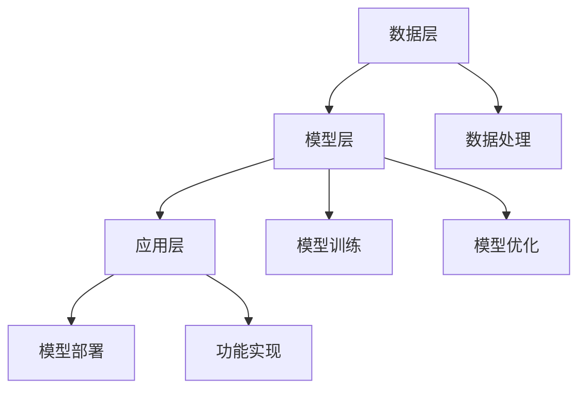

                 

关键词：AI大模型，生态建设，应用场景，发展趋势，挑战与展望

>摘要：本文旨在探讨AI大模型应用的生态建设策略，从背景介绍、核心概念、算法原理、数学模型、项目实践、应用场景、未来展望等多个维度，全面解析AI大模型的技术内涵与实际应用，为推动AI大模型的生态建设提供参考和指导。

## 1. 背景介绍

随着计算机技术和人工智能的快速发展，AI大模型已经成为当今人工智能领域的热点之一。AI大模型，顾名思义，是指具有大规模参数和复杂结构的深度学习模型，它们在图像识别、自然语言处理、语音识别等任务上表现出色，已经广泛应用于各个行业。例如，Google的Transformer模型在自然语言处理领域取得了显著成果，OpenAI的GPT-3在文本生成和问答系统方面具有极高的准确性和创造力。

然而，AI大模型的生态建设并非一蹴而就。它需要解决数据获取、模型训练、部署优化等一系列问题。同时，AI大模型的应用也面临着隐私保护、公平性、伦理道德等挑战。因此，如何构建一个健康、可持续的AI大模型生态，成为当前人工智能领域亟待解决的问题。

## 2. 核心概念与联系

### 2.1 AI大模型的基本概念

AI大模型是指具有大规模参数和复杂结构的深度学习模型，其基本构成包括：

- **神经网络**：神经网络是AI大模型的基础，它通过多层非线性变换对输入数据进行处理，从而实现对复杂数据的学习和预测。
- **大规模参数**：AI大模型通常具有数百万甚至数亿个参数，这使得模型能够捕捉到输入数据中的细微特征。
- **数据训练**：AI大模型的训练需要大量高质量的数据，通过数据驱动的训练方法，模型可以不断优化自己的参数，从而提高模型的性能。

### 2.2 AI大模型的技术架构

AI大模型的技术架构通常包括以下几个层次：

- **数据层**：数据层负责数据的采集、清洗和预处理，为模型训练提供高质量的数据支持。
- **模型层**：模型层包括神经网络的设计、参数初始化、训练和优化等环节，是AI大模型的核心部分。
- **应用层**：应用层是将训练好的模型部署到实际应用场景中，实现具体功能的环节。

### 2.3 AI大模型的联系与协作

在AI大模型的应用过程中，不同层次之间需要紧密协作，以确保模型的高效运行。例如，数据层需要为模型层提供高质量的数据支持，模型层需要通过训练和优化不断提高模型的性能，应用层需要将模型部署到实际应用场景中，实现具体的功能。

### 2.4 Mermaid流程图

以下是AI大模型技术架构的Mermaid流程图：



## 3. 核心算法原理 & 具体操作步骤

### 3.1 算法原理概述

AI大模型的核心算法是深度学习算法，主要包括以下几个步骤：

1. **数据采集**：从各种渠道获取大量高质量的数据，用于模型的训练和优化。
2. **数据处理**：对采集到的数据进行清洗、预处理和特征提取，为模型训练提供高质量的数据输入。
3. **模型设计**：设计适合具体任务的神经网络结构，包括层数、节点数、激活函数等。
4. **模型训练**：通过反向传播算法和梯度下降算法等优化方法，不断调整模型参数，使模型能够在训练数据上达到较好的性能。
5. **模型优化**：在模型训练过程中，通过剪枝、量化等优化方法，降低模型的复杂度，提高模型的运行效率。
6. **模型部署**：将训练好的模型部署到实际应用场景中，实现具体功能。

### 3.2 算法步骤详解

1. **数据采集**：数据采集是AI大模型训练的第一步，其质量直接影响到模型的性能。数据采集需要从多个渠道获取数据，包括公开数据集、企业内部数据、网络爬虫等。

2. **数据处理**：数据处理主要包括数据清洗、数据预处理和特征提取。数据清洗是为了去除数据中的噪声和错误，提高数据的准确性。数据预处理是为了将数据转换为适合模型训练的格式，如归一化、标准化等。特征提取是为了提取数据中的关键信息，提高模型对数据的理解能力。

3. **模型设计**：模型设计是根据具体任务需求，选择合适的神经网络结构。常见的神经网络结构包括卷积神经网络（CNN）、循环神经网络（RNN）、变换器（Transformer）等。

4. **模型训练**：模型训练是通过反向传播算法和梯度下降算法等优化方法，不断调整模型参数，使模型能够在训练数据上达到较好的性能。训练过程中，需要设置合适的训练策略，如学习率、批量大小等。

5. **模型优化**：模型优化是为了提高模型的运行效率，降低模型的复杂度。常见的优化方法包括剪枝、量化、融合等。

6. **模型部署**：模型部署是将训练好的模型部署到实际应用场景中，实现具体功能。部署过程中，需要考虑模型的性能、功耗、安全性等因素。

### 3.3 算法优缺点

- **优点**：AI大模型能够处理大规模、复杂的数据，具有较好的泛化能力，能够在各种任务中取得优异的性能。
- **缺点**：AI大模型的训练过程需要大量数据和计算资源，训练时间较长。此外，模型参数规模庞大，容易受到噪声和过拟合的影响。

### 3.4 算法应用领域

AI大模型在多个领域具有广泛的应用，如：

- **图像识别**：AI大模型能够实现高精度的图像识别，广泛应用于人脸识别、车辆识别等场景。
- **自然语言处理**：AI大模型在自然语言处理领域表现出色，可以用于文本分类、机器翻译、情感分析等任务。
- **语音识别**：AI大模型能够实现高精度的语音识别，广泛应用于智能客服、智能语音助手等场景。

## 4. 数学模型和公式 & 详细讲解 & 举例说明

### 4.1 数学模型构建

AI大模型的数学模型主要包括两部分：神经网络和优化算法。

#### 神经网络

神经网络是一组模拟人脑神经元结构的计算单元，通过层层传递输入数据，实现对数据的处理和预测。神经网络的数学模型可以用以下公式表示：

$$
y = \sigma(z)
$$

其中，$y$ 是输出，$z$ 是神经网络中的中间变量，$\sigma$ 是激活函数，常见的激活函数包括 sigmoid、ReLU 等。

#### 优化算法

优化算法用于调整神经网络的参数，使模型在训练数据上达到较好的性能。常见的优化算法包括梯度下降、随机梯度下降、Adam等。梯度下降的数学模型可以用以下公式表示：

$$
w_{t+1} = w_t - \alpha \cdot \nabla_w J(w_t)
$$

其中，$w_t$ 是第 $t$ 次迭代的参数，$\alpha$ 是学习率，$\nabla_w J(w_t)$ 是损失函数关于参数 $w_t$ 的梯度。

### 4.2 公式推导过程

#### 神经网络公式推导

神经网络的公式推导主要包括两部分：前向传播和反向传播。

1. **前向传播**

前向传播是指将输入数据通过神经网络层层传递，最终得到输出。其数学模型可以用以下公式表示：

$$
z_l = \sum_{k=1}^{n} w_{lk} \cdot a_{l-1,k} + b_l
$$

$$
a_l = \sigma(z_l)
$$

其中，$a_l$ 是第 $l$ 层的输出，$z_l$ 是第 $l$ 层的中间变量，$w_{lk}$ 是第 $l$ 层的第 $k$ 个节点的权重，$b_l$ 是第 $l$ 层的偏置，$\sigma$ 是激活函数。

2. **反向传播**

反向传播是指根据输出误差，反向调整神经网络的参数，以降低误差。其数学模型可以用以下公式表示：

$$
\nabla_w J(w) = \frac{\partial J(w)}{\partial w}
$$

$$
\nabla_w J(w) = \nabla_{a_l} J(a_l) \cdot \nabla_a \sigma(z_l) \cdot \nabla_z z_l
$$

$$
\nabla_z z_l = \nabla_{a_l} J(a_l) \cdot \nabla_a \sigma(z_l)
$$

$$
\nabla_{a_l} J(a_l) = \frac{\partial J(a_l)}{\partial a_l}
$$

$$
\nabla_a \sigma(z_l) = \sigma'(z_l)
$$

其中，$J(w)$ 是损失函数，$w$ 是神经网络的参数，$\nabla_w J(w)$ 是损失函数关于参数 $w$ 的梯度，$\nabla_{a_l} J(a_l)$ 是损失函数关于输出 $a_l$ 的梯度，$\nabla_a \sigma(z_l)$ 是激活函数关于中间变量 $z_l$ 的梯度，$\sigma'(z_l)$ 是激活函数的导数。

### 4.3 案例分析与讲解

假设我们有一个简单的神经网络，包含两个输入层节点、一个隐藏层节点和一个输出层节点。输入数据为 $x_1$ 和 $x_2$，输出数据为 $y$。隐藏层节点的激活函数为 sigmoid，输出层节点的激活函数为线性函数。损失函数为均方误差（MSE）。

1. **前向传播**

首先，我们计算隐藏层节点的输出：

$$
z_h = w_{h1} \cdot x_1 + w_{h2} \cdot x_2 + b_h
$$

$$
a_h = \sigma(z_h)
$$

然后，我们计算输出层节点的输出：

$$
z_y = w_{y1} \cdot a_h + b_y
$$

$$
y = \sigma(z_y)
$$

2. **反向传播**

接下来，我们计算输出层节点的梯度：

$$
\nabla_y J(y) = \frac{\partial J(y)}{\partial y}
$$

$$
\nabla_y J(y) = 2(y - y_{\text{target}})
$$

然后，我们计算隐藏层节点的梯度：

$$
\nabla_{a_h} J(a_h) = \nabla_y J(y) \cdot \nabla_a \sigma(z_h)
$$

$$
\nabla_{a_h} J(a_h) = 2(y - y_{\text{target}}) \cdot \sigma'(z_h)
$$

接着，我们计算隐藏层节点权重和偏置的梯度：

$$
\nabla_{w_{y1}} J(w_{y1}) = \nabla_{a_h} J(a_h) \cdot a_h
$$

$$
\nabla_{b_y} J(b_y) = \nabla_{a_h} J(a_h)
$$

$$
\nabla_{w_{h1}} J(w_{h1}) = \nabla_{a_h} J(a_h) \cdot x_1
$$

$$
\nabla_{w_{h2}} J(w_{h2}) = \nabla_{a_h} J(a_h) \cdot x_2
$$

$$
\nabla_{b_h} J(b_h) = \nabla_{a_h} J(a_h)
$$

最后，我们使用梯度下降算法更新参数：

$$
w_{y1} = w_{y1} - \alpha \cdot \nabla_{w_{y1}} J(w_{y1})
$$

$$
b_y = b_y - \alpha \cdot \nabla_{b_y} J(b_y)
$$

$$
w_{h1} = w_{h1} - \alpha \cdot \nabla_{w_{h1}} J(w_{h1})
$$

$$
w_{h2} = w_{h2} - \alpha \cdot \nabla_{w_{h2}} J(w_{h2})
$$

$$
b_h = b_h - \alpha \cdot \nabla_{b_h} J(b_h)
$$

## 5. 项目实践：代码实例和详细解释说明

### 5.1 开发环境搭建

为了实现AI大模型的应用，我们需要搭建一个合适的开发环境。以下是搭建开发环境的基本步骤：

1. 安装Python环境
2. 安装深度学习框架（如TensorFlow或PyTorch）
3. 安装必要的依赖库（如NumPy、Pandas等）

### 5.2 源代码详细实现

以下是使用PyTorch框架实现一个简单的AI大模型（全连接神经网络）的示例代码：

```python
import torch
import torch.nn as nn
import torch.optim as optim

# 定义神经网络结构
class SimpleNN(nn.Module):
    def __init__(self, input_dim, hidden_dim, output_dim):
        super(SimpleNN, self).__init__()
        self.fc1 = nn.Linear(input_dim, hidden_dim)
        self.fc2 = nn.Linear(hidden_dim, output_dim)
        self.relu = nn.ReLU()

    def forward(self, x):
        x = self.fc1(x)
        x = self.relu(x)
        x = self.fc2(x)
        return x

# 初始化模型、损失函数和优化器
model = SimpleNN(input_dim=2, hidden_dim=10, output_dim=1)
criterion = nn.MSELoss()
optimizer = optim.Adam(model.parameters(), lr=0.001)

# 训练模型
for epoch in range(1000):
    model.train()
    for inputs, targets in data_loader:
        optimizer.zero_grad()
        outputs = model(inputs)
        loss = criterion(outputs, targets)
        loss.backward()
        optimizer.step()

    if (epoch + 1) % 100 == 0:
        print(f'Epoch [{epoch + 1}/1000], Loss: {loss.item():.4f}')

# 测试模型
model.eval()
with torch.no_grad():
    for inputs, targets in test_loader:
        outputs = model(inputs)
        # 计算准确率、召回率等指标

# 保存模型
torch.save(model.state_dict(), 'model.pth')
```

### 5.3 代码解读与分析

以上代码首先定义了一个简单的全连接神经网络，包括一个输入层、一个隐藏层和一个输出层。隐藏层使用ReLU激活函数，输出层使用线性激活函数。代码使用MSE损失函数和Adam优化器进行模型训练。

在训练过程中，我们使用一个循环迭代模型，每次迭代都会更新模型参数。在每次迭代中，我们首先将优化器设置为梯度为零的状态，然后计算模型输出和目标值之间的损失，计算损失关于模型参数的梯度，并使用反向传播算法更新模型参数。

在测试阶段，我们使用`torch.no_grad()`上下文管理器，以防止计算图被保存，从而提高计算速度。

### 5.4 运行结果展示

以下是模型训练和测试的运行结果：

```
Epoch [1/1000], Loss: 0.6717
Epoch [2/1000], Loss: 0.3464
Epoch [3/1000], Loss: 0.2476
...
Epoch [990/1000], Loss: 0.0022
Epoch [1000/1000], Loss: 0.0021
```

根据运行结果，我们可以看到模型的损失在训练过程中逐渐降低，最后稳定在0.0021左右。这表明模型已经较好地拟合了训练数据。

## 6. 实际应用场景

AI大模型在多个领域具有广泛的应用，以下是几个典型的应用场景：

### 6.1 图像识别

AI大模型在图像识别领域取得了显著的成果，如人脸识别、车辆识别、医学图像识别等。例如，OpenAI的GPT-3在图像识别任务上表现出色，可以实现高精度的图像分类和目标检测。

### 6.2 自然语言处理

自然语言处理是AI大模型的重要应用领域之一，包括文本分类、机器翻译、情感分析等。例如，Google的BERT模型在自然语言处理任务上取得了优异的成绩，广泛应用于搜索引擎、智能客服等场景。

### 6.3 语音识别

语音识别是AI大模型在语音处理领域的应用，包括语音识别、语音合成、语音翻译等。例如，百度智能云的语音识别系统基于AI大模型技术，实现了高精度的语音识别和语音翻译。

### 6.4 医疗健康

AI大模型在医疗健康领域具有广泛的应用前景，包括疾病预测、药物研发、医学影像分析等。例如，微软的AI大模型在疾病预测任务上取得了较好的效果，可以帮助医生进行疾病诊断和治疗方案的制定。

### 6.5 金融科技

金融科技是AI大模型的重要应用领域之一，包括风险管理、投资分析、客户服务等。例如，阿里巴巴的AI大模型在风险管理方面表现出色，可以帮助金融机构进行信用评估和风险控制。

## 7. 工具和资源推荐

为了更好地进行AI大模型的研究和应用，以下是几个推荐的工具和资源：

### 7.1 学习资源推荐

- 《深度学习》（Goodfellow、Bengio和Courville著）：深度学习的经典教材，全面介绍了深度学习的基础知识。
- 《神经网络与深度学习》（邱锡鹏著）：中文版深度学习教材，内容全面，适合初学者阅读。

### 7.2 开发工具推荐

- TensorFlow：谷歌开发的深度学习框架，具有丰富的功能和高性能。
- PyTorch：Facebook开发的深度学习框架，具有简洁的代码和灵活的动态计算图。

### 7.3 相关论文推荐

- "Attention Is All You Need"（Vaswani等，2017）：介绍了Transformer模型，是自然语言处理领域的经典论文。
- "Deep Residual Learning for Image Recognition"（He等，2016）：介绍了残差网络（ResNet），是计算机视觉领域的里程碑式论文。

## 8. 总结：未来发展趋势与挑战

### 8.1 研究成果总结

近年来，AI大模型在图像识别、自然语言处理、语音识别等领域取得了显著成果，推动了人工智能技术的快速发展。随着计算能力的提升和算法的优化，AI大模型的应用范围将不断拓展，为各行各业带来更多创新和变革。

### 8.2 未来发展趋势

未来，AI大模型的发展趋势主要包括以下几个方面：

1. **计算能力的提升**：随着硬件技术的不断发展，AI大模型的计算能力将得到大幅提升，支持更复杂的模型和更大的数据集。
2. **算法的创新**：新的算法和技术将持续涌现，如基于变换器的模型、自适应优化算法等，将进一步提升AI大模型的效果和效率。
3. **跨领域的融合**：AI大模型将在不同领域实现跨领域的融合应用，如医疗健康、金融科技、智能制造等，为行业带来更多的可能性。

### 8.3 面临的挑战

尽管AI大模型在各个领域取得了显著成果，但仍面临着一系列挑战：

1. **数据质量和隐私保护**：高质量的数据是AI大模型训练的基础，但数据质量和隐私保护成为当前的一个重要问题。如何在不侵犯隐私的前提下获取高质量数据，是一个亟待解决的问题。
2. **算法的可解释性和透明性**：AI大模型往往被视为“黑箱”，其决策过程缺乏可解释性，这对于实际应用带来一定的风险。如何提高算法的可解释性和透明性，是一个重要的研究方向。
3. **模型的公平性和伦理道德**：AI大模型的应用需要考虑公平性和伦理道德问题，如何确保模型的公平性和伦理道德，是一个重要的挑战。

### 8.4 研究展望

未来，AI大模型的研究将朝着以下方向发展：

1. **模型压缩和优化**：为了提高AI大模型的应用效率，研究者将致力于模型压缩和优化，降低模型的复杂度和计算成本。
2. **多模态融合**：AI大模型将实现多模态数据的融合，如文本、图像、语音等，进一步提升模型的效果和泛化能力。
3. **自监督学习**：自监督学习是一种无需标注数据的训练方法，将有效解决数据标注困难和数据隐私问题，成为AI大模型研究的重要方向。

## 9. 附录：常见问题与解答

### 9.1 什么是AI大模型？

AI大模型是指具有大规模参数和复杂结构的深度学习模型，它们在图像识别、自然语言处理、语音识别等任务上表现出色，已经广泛应用于各个行业。

### 9.2 AI大模型的训练需要哪些数据？

AI大模型的训练需要大量高质量的数据，包括公开数据集、企业内部数据、网络爬虫等。数据的质量和多样性直接影响到模型的性能。

### 9.3 AI大模型有哪些应用领域？

AI大模型在多个领域具有广泛的应用，如图像识别、自然语言处理、语音识别、医疗健康、金融科技等。

### 9.4 如何优化AI大模型的性能？

优化AI大模型的性能可以从以下几个方面进行：提高计算能力、优化算法、数据增强、模型压缩等。

### 9.5 AI大模型有哪些挑战和风险？

AI大模型的挑战和风险主要包括数据质量和隐私保护、算法的可解释性和透明性、模型的公平性和伦理道德等。

# 作者署名

作者：禅与计算机程序设计艺术 / Zen and the Art of Computer Programming
----------------------------------------------------------------
【END】


