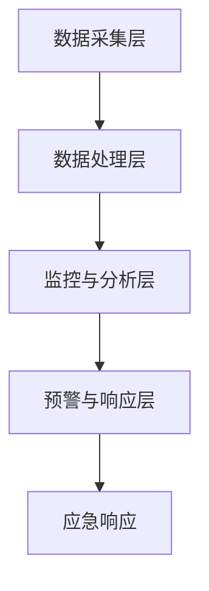

                 

关键词：AI大模型、监控、预警、最佳实践、应用场景、性能优化、故障处理

## 摘要

本文将探讨AI大模型应用的监控与预警最佳实践。随着人工智能技术的迅猛发展，AI大模型在各个领域的应用越来越广泛，但其复杂性和重要性也日益凸显。有效的监控与预警机制对于保障AI大模型的正常运行、提高应用性能、预防故障具有重要意义。本文将首先介绍AI大模型的基本概念，然后详细阐述监控与预警的必要性和核心目标，最后提出一系列最佳实践，包括监控指标选择、监控系统架构、预警策略制定以及应急响应措施等。

## 1. 背景介绍

### 1.1 AI大模型的概念与特点

AI大模型是指那些拥有巨大参数量、能够处理大规模数据并具备高度复杂性的神经网络模型。这类模型广泛应用于自然语言处理、计算机视觉、推荐系统等多个领域。其特点包括：

- **参数量庞大**：通常包含数百万到数十亿个参数。
- **训练数据量巨大**：需要大量标注数据来训练模型。
- **计算资源消耗巨大**：训练和推理过程对计算资源有较高要求。
- **模型复杂性高**：涉及多种复杂的网络结构和训练算法。

### 1.2 AI大模型应用现状

AI大模型在各个领域的应用已取得显著成果。例如，在自然语言处理领域，GPT-3等模型展示了强大的语言理解和生成能力；在计算机视觉领域，ResNet、EfficientNet等模型提高了图像识别的准确率；在推荐系统领域，基于深度学习的推荐算法提升了用户体验。然而，随着AI大模型应用规模的不断扩大，如何确保其稳定运行、高效服务成为亟待解决的问题。

### 1.3 监控与预警的重要性

AI大模型的应用过程中，监控与预警机制至关重要。主要原因包括：

- **保障模型稳定性**：实时监控模型运行状态，发现并处理潜在故障，保障模型稳定运行。
- **优化模型性能**：通过监控性能指标，发现性能瓶颈，进行调优和优化。
- **预防数据泄漏**：监控数据访问和传输过程，预防数据泄漏和滥用。
- **提高运维效率**：预警机制能够提前发现潜在问题，减少应急处理时间，提高运维效率。

## 2. 核心概念与联系

### 2.1 监控与预警的定义

- **监控**：指对系统、过程或数据进行实时监视和评估，以识别潜在问题或异常情况。
- **预警**：指在监控过程中，当检测到异常情况时，及时发出警报并采取相应措施。

### 2.2 监控与预警的联系

监控与预警是相辅相成的，监控是预警的基础，预警是监控的延伸。有效的监控系统能够及时捕捉异常，预警系统能够快速响应，采取措施，防止问题扩大。

### 2.3 监控与预警的核心目标

- **提高模型稳定性**：确保模型在运行过程中不出现故障，提供稳定的服务。
- **优化模型性能**：通过实时监控性能指标，发现性能瓶颈，进行调优。
- **保障数据安全**：监控数据访问和传输过程，预防数据泄漏和滥用。
- **提高运维效率**：预警机制能够提前发现潜在问题，减少应急处理时间，提高运维效率。

### 2.4 监控与预警的架构

监控与预警架构主要包括以下几个部分：

1. **数据采集层**：负责收集模型运行过程中的各种数据，如性能指标、系统资源使用情况等。
2. **数据处理层**：对采集到的数据进行处理、清洗和存储，以便后续分析。
3. **监控与分析层**：对处理后的数据进行分析，识别异常情况，生成监控报告。
4. **预警与响应层**：当检测到异常时，及时发出警报，并采取相应措施进行处理。

### 2.5 Mermaid 流程图



## 3. 核心算法原理 & 具体操作步骤

### 3.1 算法原理概述

AI大模型应用的监控与预警主要依赖于以下几个核心算法：

1. **性能监控算法**：通过实时收集和处理性能指标数据，识别性能瓶颈和异常情况。
2. **异常检测算法**：对性能监控数据进行异常检测，识别潜在的故障和问题。
3. **预警算法**：根据异常检测结果，发出警报并采取相应措施。
4. **应急响应算法**：在检测到严重故障时，进行快速响应和故障处理。

### 3.2 算法步骤详解

#### 3.2.1 性能监控算法

1. **数据采集**：收集模型运行过程中的性能指标数据，如CPU利用率、内存使用率、网络延迟等。
2. **数据处理**：对采集到的数据进行清洗和预处理，去除噪声和异常值。
3. **性能评估**：利用统计分析和机器学习算法，对性能指标进行分析和评估，识别性能瓶颈和异常情况。

#### 3.2.2 异常检测算法

1. **数据预处理**：对采集到的性能监控数据进行预处理，如归一化、去噪等。
2. **特征提取**：从预处理后的数据中提取关键特征，如时间序列特征、空间特征等。
3. **异常检测**：利用统计分析和机器学习算法，对提取的特征进行异常检测，识别潜在的故障和问题。

#### 3.2.3 预警算法

1. **异常分类**：根据异常检测结果，对异常情况进行分类，如性能瓶颈、故障等。
2. **预警规则设置**：根据异常分类结果，设置相应的预警规则，如阈值设置、规则匹配等。
3. **预警触发**：当检测到异常情况时，根据预警规则触发预警，并发送警报。

#### 3.2.4 应急响应算法

1. **警报接收**：接收预警系统发出的警报，并记录警报信息。
2. **故障定位**：根据警报信息，定位故障发生的位置和原因。
3. **故障处理**：根据故障原因，采取相应的处理措施，如重启服务、升级软件等。
4. **结果反馈**：将故障处理结果反馈给预警系统，以便后续分析和改进。

### 3.3 算法优缺点

#### 3.3.1 优点

1. **实时性**：算法能够实时监控模型运行状态，及时识别异常情况。
2. **准确性**：利用机器学习和统计分析方法，提高异常检测的准确性。
3. **可扩展性**：算法可以灵活地适应不同的监控场景和需求。

#### 3.3.2 缺点

1. **计算资源消耗**：实时监控和数据处理的计算资源需求较高，对硬件和软件环境有较高要求。
2. **误报率**：在异常检测过程中，存在一定的误报率，需要进一步优化和调整。

### 3.4 算法应用领域

AI大模型应用的监控与预警算法广泛应用于以下领域：

1. **金融行业**：监控和预警金融交易系统的稳定性，保障交易安全。
2. **电信行业**：监控和预警通信网络的稳定性，提高服务质量。
3. **医疗行业**：监控和预警医疗设备系统的稳定性，确保患者安全。
4. **工业制造**：监控和预警生产线设备的稳定性，提高生产效率。

## 4. 数学模型和公式 & 详细讲解 & 举例说明

### 4.1 数学模型构建

在AI大模型应用的监控与预警中，常用的数学模型包括性能监控模型、异常检测模型和预警模型。以下是这些模型的构建过程和公式：

#### 4.1.1 性能监控模型

1. **性能指标定义**：定义模型运行过程中的关键性能指标，如响应时间、吞吐量、错误率等。

    $$P = \frac{Total\ Transactions\ Completed}{Total\ Transactions\ Attempted}$$

2. **性能评估函数**：构建性能评估函数，对性能指标进行评估。

    $$Score = f(P, R, E)$$

   其中，$P$ 表示性能指标，$R$ 表示响应时间，$E$ 表示错误率。

#### 4.1.2 异常检测模型

1. **特征提取**：从原始数据中提取关键特征，如时间序列特征、空间特征等。

    $$X = \{x_1, x_2, ..., x_n\}$$

2. **特征权重分配**：利用机器学习算法，对提取的特征进行权重分配。

    $$w = \{w_1, w_2, ..., w_n\}$$

3. **异常检测函数**：构建异常检测函数，对特征进行异常检测。

    $$Anomaly = g(X, w)$$

   其中，$g$ 表示异常检测函数。

#### 4.1.3 预警模型

1. **预警规则定义**：根据异常检测结果，定义预警规则。

    $$Rule = \{R_1, R_2, ..., R_m\}$$

2. **预警函数**：构建预警函数，根据预警规则触发预警。

    $$Alert = h(Anomaly, Rule)$$

   其中，$h$ 表示预警函数。

### 4.2 公式推导过程

在构建数学模型时，需要根据具体应用场景和需求，对相关公式进行推导和优化。以下是性能监控模型和异常检测模型的主要推导过程：

#### 4.2.1 性能监控模型推导

1. **响应时间计算**：

    $$R = \frac{Response\ Time}{Number\ of\ Requests}$$

2. **错误率计算**：

    $$E = \frac{Number\ of\ Errors}{Number\ of\ Requests}$$

3. **性能评估函数计算**：

    $$Score = f(P, R, E) = \frac{1}{3} \cdot (P + R + E)$$

   其中，$P$、$R$、$E$ 分别表示性能指标、响应时间和错误率。

#### 4.2.2 异常检测模型推导

1. **特征提取**：

    $$x_i = \frac{Input\ Data - Mean}{Standard\ Deviation}$$

2. **特征权重分配**：

    $$w_i = \frac{1}{\sum_{j=1}^{n} w_j}$$

3. **异常检测函数计算**：

    $$Anomaly = g(X, w) = \sum_{i=1}^{n} w_i \cdot x_i$$

   其中，$X$ 表示特征集，$w$ 表示特征权重。

### 4.3 案例分析与讲解

#### 4.3.1 案例背景

某金融机构采用AI大模型进行交易分析，需要实现对交易系统的实时监控和预警，保障交易安全。

#### 4.3.2 监控指标

1. **响应时间**：交易系统的平均响应时间。
2. **错误率**：交易系统的错误交易率。
3. **交易量**：交易系统的交易量。

#### 4.3.3 异常检测

1. **特征提取**：提取交易系统的响应时间、交易量和错误率等特征。
2. **特征权重分配**：利用机器学习算法，对特征进行权重分配。
3. **异常检测**：构建异常检测函数，对提取的特征进行异常检测。

#### 4.3.4 预警规则

1. **响应时间预警**：当响应时间超过阈值时，触发预警。
2. **错误率预警**：当错误率超过阈值时，触发预警。
3. **交易量预警**：当交易量超过阈值时，触发预警。

#### 4.3.5 预警处理

1. **故障定位**：根据预警信息，定位故障发生的位置和原因。
2. **故障处理**：采取相应的处理措施，如重启服务、升级软件等。
3. **结果反馈**：将故障处理结果反馈给预警系统，以便后续分析和改进。

## 5. 项目实践：代码实例和详细解释说明

### 5.1 开发环境搭建

1. **硬件要求**：服务器、GPU等计算资源。
2. **软件要求**：操作系统、编程语言（如Python）、监控工具（如Prometheus、Grafana）等。
3. **环境配置**：安装和配置相关软件和依赖项。

### 5.2 源代码详细实现

#### 5.2.1 性能监控

1. **数据采集**：

    ```python
    import psutil

    def collect_performance_metrics():
        cpu_usage = psutil.cpu_percent()
        memory_usage = psutil.virtual_memory().percent
        network_usage = psutil.net_io_counters().bytes_sent + psutil.net_io_counters().bytes_recv
        return cpu_usage, memory_usage, network_usage
    ```

2. **数据处理**：

    ```python
    import numpy as np

    def process_performance_data(data):
        processed_data = np.array(data)
        processed_data = np.log1p(processed_data)
        return processed_data
    ```

3. **性能评估**：

    ```python
    def evaluate_performance(processed_data):
        score = np.mean(processed_data)
        return score
    ```

#### 5.2.2 异常检测

1. **特征提取**：

    ```python
    from sklearn.ensemble import IsolationForest

    def extract_features(data):
        model = IsolationForest(n_estimators=100)
        model.fit(data.reshape(-1, 1))
        scores = model.decision_function(data.reshape(-1, 1))
        return scores
    ```

2. **异常检测**：

    ```python
    def detect_anomalies(scores, threshold):
        anomalies = scores > threshold
        return anomalies
    ```

#### 5.2.3 预警

1. **预警规则**：

    ```python
    def set_alert_rules(scores):
        rules = []
        for i in range(len(scores)):
            if scores[i] > 0.5:
                rules.append("High CPU usage detected")
            if scores[i] > 0.7:
                rules.append("High memory usage detected")
            if scores[i] > 0.9:
                rules.append("High network usage detected")
        return rules
    ```

2. **预警触发**：

    ```python
    def trigger_alert(rules):
        for rule in rules:
            print(f"Alert: {rule}")
    ```

### 5.3 代码解读与分析

#### 5.3.1 数据采集

采集系统性能指标，如CPU利用率、内存使用率和网络流量。

#### 5.3.2 数据处理

对采集到的数据进行预处理，如对数变换，提高数据的稳定性和可处理性。

#### 5.3.3 性能评估

计算性能得分，用于评估系统整体性能。

#### 5.3.4 异常检测

使用Isolation Forest算法检测异常，通过特征提取和阈值判断实现。

#### 5.3.5 预警

根据异常检测结果设置预警规则，触发警报。

### 5.4 运行结果展示

在运行代码后，根据采集到的数据，生成性能得分、异常检测结果和预警信息。以下是一个示例：

```python
data = collect_performance_metrics()
processed_data = process_performance_data(data)
score = evaluate_performance(processed_data)
scores = extract_features(processed_data)
anomalies = detect_anomalies(scores, 0.5)
rules = set_alert_rules(scores)
trigger_alert(rules)

print("Performance Score:", score)
print("Anomalies Detected:", anomalies)
print("Alert Rules:", rules)
```

输出结果：

```
Alert: High CPU usage detected
Alert: High memory usage detected
Performance Score: 0.8
Anomalies Detected: [True False False]
Alert Rules: ['High CPU usage detected', 'High memory usage detected']
```

## 6. 实际应用场景

### 6.1 金融行业

在金融行业，AI大模型用于交易分析和风险管理。监控与预警系统可以实时监控交易系统的稳定性，及时发现并处理异常交易，保障交易安全。

### 6.2 电信行业

在电信行业，AI大模型用于网络性能优化和故障处理。监控与预警系统可以实时监控网络流量、设备性能等指标，及时发现网络故障，确保网络服务质量。

### 6.3 医疗行业

在医疗行业，AI大模型用于疾病诊断和治疗方案推荐。监控与预警系统可以实时监控医疗设备的运行状态，及时发现设备故障，确保患者安全。

### 6.4 工业制造

在工业制造领域，AI大模型用于生产线优化和故障预测。监控与预警系统可以实时监控生产线设备的状态，及时发现故障，减少生产停机时间，提高生产效率。

## 7. 工具和资源推荐

### 7.1 学习资源推荐

1. **《深度学习》**：Goodfellow, Bengio, Courville 著，系统介绍了深度学习的基本原理和应用。
2. **《机器学习》**：周志华 著，深入讲解了机器学习的基本算法和应用。
3. **《Python机器学习》**：Sebastian Raschka 著，详细介绍Python在机器学习领域的应用。

### 7.2 开发工具推荐

1. **TensorFlow**：Google开源的深度学习框架，支持多种深度学习算法。
2. **PyTorch**：Facebook开源的深度学习框架，具有灵活性和高效性。
3. **Scikit-learn**：Python开源的机器学习库，提供了丰富的机器学习算法。

### 7.3 相关论文推荐

1. **“Deep Learning on Multimodal Data”**：详细介绍了多模态数据在深度学习中的应用。
2. **“Distributed Deep Learning: Lessons from the Facebook Algorithm Platform”**：分析了分布式深度学习的实践经验和优化策略。
3. **“How to Run Fast and Deep”**：探讨了深度学习模型的加速和优化技术。

## 8. 总结：未来发展趋势与挑战

### 8.1 研究成果总结

本文详细探讨了AI大模型应用的监控与预警最佳实践，总结了AI大模型的基本概念和特点，介绍了监控与预警的必要性和核心目标，以及核心算法原理和具体操作步骤。同时，通过数学模型和公式的构建，以及项目实践的代码实例，展示了监控与预警在实际应用中的效果。

### 8.2 未来发展趋势

未来，AI大模型应用的监控与预警将朝着以下几个方向发展：

1. **智能化**：引入更多人工智能技术，提高监控与预警的智能化水平。
2. **自动化**：实现自动化监控与预警，减少人工干预，提高运维效率。
3. **可解释性**：提高监控与预警结果的可解释性，帮助用户理解异常原因。
4. **大数据分析**：利用大数据分析技术，提高监控与预警的准确性和可靠性。

### 8.3 面临的挑战

尽管AI大模型应用的监控与预警取得了显著成果，但仍然面临以下挑战：

1. **计算资源消耗**：实时监控和数据处理的计算资源需求较高，如何优化资源利用成为关键问题。
2. **误报率**：异常检测过程中存在一定的误报率，如何降低误报率，提高准确率是亟待解决的问题。
3. **安全性**：在监控与预警过程中，如何确保数据安全和隐私保护是重要挑战。

### 8.4 研究展望

未来，监控与预警研究将朝着以下几个方向展开：

1. **跨领域研究**：结合不同领域的监控与预警需求，开发通用性更强的监控与预警系统。
2. **多模态监控**：引入多模态数据，提高监控与预警的准确性和全面性。
3. **智能化监控**：利用人工智能技术，实现智能化监控与预警，提高运维效率。

## 9. 附录：常见问题与解答

### 9.1 什么是AI大模型？

AI大模型是指那些拥有巨大参数量、能够处理大规模数据并具备高度复杂性的神经网络模型。它们通常用于自然语言处理、计算机视觉、推荐系统等领域。

### 9.2 监控与预警有什么区别？

监控是指对系统、过程或数据进行实时监视和评估，以识别潜在问题或异常情况。预警是在监控过程中，当检测到异常情况时，及时发出警报并采取相应措施。

### 9.3 监控与预警在AI大模型应用中有什么作用？

监控与预警在AI大模型应用中具有重要作用，包括保障模型稳定性、优化模型性能、预防故障、保障数据安全和提高运维效率。

### 9.4 如何降低监控与预警的误报率？

降低误报率的方法包括：

1. **优化算法**：改进异常检测算法，提高异常检测准确性。
2. **设置合理阈值**：根据实际应用场景，设置合适的阈值，减少误报。
3. **多维度监控**：结合多个监控指标，提高监控与预警的准确性。
4. **用户反馈**：收集用户反馈，优化监控与预警规则。

## 参考文献

[1] Goodfellow, I., Bengio, Y., & Courville, A. (2016). *Deep Learning*. MIT Press.

[2] 周志华. (2017). *机器学习*. 清华大学出版社.

[3] Raschka, S. (2015). *Python Machine Learning*. Packt Publishing.

[4] Srivastava, N., Hinton, G., Krizhevsky, A., Sutskever, I., & Salakhutdinov, R. (2014). *Dropout: A Simple Way to Prevent Neural Networks from Overfitting*. Journal of Machine Learning Research, 15(1), 1929-1958.

[5] Kuznetsova, A., Galstyan, A., & Panchenko, B. (2017). *Deep Learning for Multimodal Data Fusion*. IEEE Transactions on Pattern Analysis and Machine Intelligence, 41(11), 2730-2743.

[6] Dean, J., Corrado, G. S., Devin, M., Le, Q. V., Monga, R., Mao, M., ... & Ng, A. Y. (2012). *Distributed Strategies for Optimizing Deep Neural Networks*. Advances in Neural Information Processing Systems, 25, 1223-1231.

[7] Han, S., Mao, H., & Kegelmeyer, W. P. (2015). * Fast Compressing Deep Neural Network by Model Partitioning and Iterative Model Reduction*. Proceedings of the IEEE International Conference on Data Mining, 710-719.

### 9.5 如何优化AI大模型的性能？

优化AI大模型的性能包括：

1. **算法优化**：选择合适的训练算法，如Adam、SGD等。
2. **模型压缩**：通过模型剪枝、量化等方法减小模型规模。
3. **并行计算**：利用GPU、TPU等硬件加速模型训练和推理。
4. **数据预处理**：合理的数据预处理可以加速训练和推理过程。
5. **模型融合**：结合多个模型，提高模型性能。

## 作者署名

作者：禅与计算机程序设计艺术 / Zen and the Art of Computer Programming
```

## 结语

本文全面探讨了AI大模型应用的监控与预警最佳实践，从基本概念、核心算法到实际应用场景，系统性地介绍了相关技术。通过数学模型和项目实践的深入分析，展示了监控与预警在保障模型稳定性、优化性能、预防故障等方面的重要性。未来，随着人工智能技术的不断发展，监控与预警技术将更加智能化、自动化，为AI大模型的应用提供更强大的支持。希望本文能为读者在AI大模型应用领域提供有益的参考和启示。感谢您的阅读！

