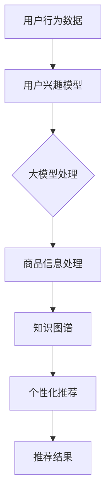

                 

关键词：AI大模型，电商搜索推荐，技术创新，知识库搭建，算法原理，数学模型，项目实践，未来应用展望

## 摘要

本文旨在探讨基于人工智能大模型视角下电商搜索推荐系统的技术创新与知识库搭建方案。通过深入分析大模型在电商搜索推荐中的核心作用，我们提出了一个包含核心概念、算法原理、数学模型、项目实践和未来展望的完整解决方案。文章旨在为电商行业的技术人员提供一套实用、全面的技术指南，以推动电商搜索推荐系统的持续创新与发展。

## 1. 背景介绍

随着互联网的快速发展和电子商务的崛起，电商搜索推荐系统成为电商平台的核心竞争力之一。用户在众多商品中寻找所需物品的需求，促使推荐系统不断优化，以提高用户体验和销售额。传统推荐系统通常基于协同过滤、基于内容的推荐和混合推荐等方法，然而，这些方法在面对复杂、海量的用户行为数据和商品信息时，往往存在一定的局限性。

近年来，人工智能尤其是深度学习大模型的迅速发展，为电商搜索推荐带来了全新的机遇。大模型能够通过海量数据的训练，自动提取复杂特征，提供精准的推荐结果。同时，知识图谱作为一种将实体与关系进行结构化表示的技术，为推荐系统提供了丰富的背景知识和关联信息，进一步提升了推荐效果。

本文将从AI大模型的视角出发，详细介绍电商搜索推荐系统的技术创新和知识库搭建方案，旨在为行业提供一种可行的技术路径，推动电商搜索推荐系统的持续优化和创新。

### 1.1 电商搜索推荐系统的发展历程

电商搜索推荐系统的发展可以分为三个主要阶段：基于规则的推荐、基于模型的推荐和基于大模型的推荐。

1. **基于规则的推荐**：最早的电商推荐系统主要依靠人工设定的规则进行商品推荐，如根据用户的浏览历史和购买记录进行简单的关联推荐。这种方法虽然简单易行，但推荐效果较差，无法应对复杂多变的用户需求。

2. **基于模型的推荐**：随着数据挖掘和机器学习技术的发展，基于模型的推荐方法逐渐取代了基于规则的推荐。协同过滤、基于内容的推荐和混合推荐等算法能够通过用户行为数据和商品特征，提供更精准的推荐结果。然而，这些算法在面对大规模数据和高维度特征时，仍然存在一定的局限性。

3. **基于大模型的推荐**：深度学习大模型的崛起为电商搜索推荐系统带来了革命性的变化。大模型能够自动提取海量数据中的复杂特征，通过端到端的训练，提供高精度的推荐结果。同时，大模型能够处理多模态数据，如文本、图像和视频，进一步提升了推荐效果。

### 1.2 人工智能大模型在电商搜索推荐中的应用

人工智能大模型在电商搜索推荐中具有以下几方面的优势：

1. **特征提取能力**：大模型能够自动从海量数据中提取出高层次的、有代表性的特征，避免了人工特征工程的工作量。这些特征能够更好地捕捉用户行为和商品属性的关联，提高推荐效果。

2. **端到端学习**：大模型采用端到端的学习方式，可以直接从原始数据生成推荐结果，省去了传统推荐系统中复杂的中间步骤。这使得推荐系统更加高效，能够快速响应用户的需求变化。

3. **多模态数据处理**：大模型能够处理多种类型的数据，如文本、图像和视频，从而提供更加全面和个性化的推荐结果。例如，在电商平台上，用户可能通过文字描述搜索商品，同时还会上传商品的图片或视频，大模型能够综合处理这些多模态数据，提高推荐精度。

4. **知识增强**：大模型可以与知识图谱相结合，利用知识图谱中的实体关系和背景知识，为推荐系统提供更多的上下文信息。这有助于解决传统推荐系统中存在的长尾问题和冷启动问题，提高推荐系统的鲁棒性。

综上所述，人工智能大模型在电商搜索推荐中具有显著的优势，为推荐系统的技术创新提供了强大的支持。

### 1.3 本文结构

本文将按照以下结构展开：

1. **背景介绍**：回顾电商搜索推荐系统的发展历程，分析人工智能大模型在电商搜索推荐中的应用。

2. **核心概念与联系**：详细阐述电商搜索推荐系统中的核心概念和联系，包括用户行为数据、商品信息、大模型和知识图谱等。

3. **核心算法原理 & 具体操作步骤**：介绍大模型在电商搜索推荐中的算法原理和具体操作步骤，包括数据预处理、模型训练、推荐策略等。

4. **数学模型和公式 & 详细讲解 & 举例说明**：探讨大模型在电商搜索推荐中涉及的数学模型和公式，并进行详细讲解和案例分析。

5. **项目实践：代码实例和详细解释说明**：提供电商搜索推荐系统的实际代码实例，并进行详细解读和分析。

6. **实际应用场景**：分析电商搜索推荐系统在实际应用中的效果和挑战，讨论未来应用的前景。

7. **工具和资源推荐**：推荐学习电商搜索推荐系统和人工智能大模型的相关工具和资源。

8. **总结：未来发展趋势与挑战**：总结研究成果，探讨未来发展趋势和面临的挑战。

9. **附录：常见问题与解答**：解答读者可能遇到的问题，提供进一步的学习和参考资料。

通过以上结构，本文旨在为电商搜索推荐系统的技术创新和知识库搭建提供一套完整的解决方案，助力电商平台提升用户满意度和商业价值。

## 2. 核心概念与联系

在深入探讨电商搜索推荐系统的技术创新之前，我们首先需要明确其中的核心概念和它们之间的联系。以下是电商搜索推荐系统中几个关键概念及其相互关系的详细阐述：

### 2.1 用户行为数据

用户行为数据是电商搜索推荐系统的基础。这些数据包括用户的浏览记录、搜索历史、点击行为、购买记录等。通过对这些数据的分析，可以深入了解用户的兴趣和偏好，从而为个性化推荐提供依据。用户行为数据通常通过日志文件、API调用和用户交互界面等多种方式收集。

### 2.2 商品信息

商品信息包括商品的属性、分类、价格、评价等。这些信息不仅用于展示商品，也是推荐系统的重要输入。商品信息可以通过电商平台的数据库、商品描述和用户评价等途径获取。

### 2.3 大模型

大模型是指通过深度学习训练出的复杂神经网络模型，如BERT、GPT、T5等。这些模型具有强大的特征提取和关联学习能力，能够在海量数据中自动发现复杂的模式。大模型在电商搜索推荐中的应用主要体现在用户行为分析和商品信息处理方面。

### 2.4 知识图谱

知识图谱是一种结构化数据表示方法，用于存储实体及其相互关系。在电商搜索推荐中，知识图谱可以提供丰富的上下文信息，帮助推荐系统理解商品和用户之间的关联。知识图谱可以通过语义解析、知识抽取和数据集成等技术构建。

### 2.5 推荐策略

推荐策略是指如何利用用户行为数据、商品信息和模型输出为用户提供个性化的推荐结果。常见的推荐策略包括基于内容的推荐、基于协同过滤的推荐和混合推荐等。在大模型视角下，推荐策略可以更加灵活和智能化。

### 2.6 关系与联系

用户行为数据、商品信息、大模型和知识图谱之间的联系构成了电商搜索推荐系统的核心。用户行为数据通过大模型进行特征提取和关联学习，生成用户兴趣模型；商品信息则通过知识图谱进行结构化表示，提供上下文信息；用户兴趣模型和商品信息相结合，通过推荐策略生成个性化推荐结果。这一过程不仅依赖于技术手段，还需要对用户需求和商业目标有深刻的理解。

通过上述核心概念和联系的阐述，我们可以更好地理解电商搜索推荐系统的运作机制，为后续的技术创新提供理论基础。

### 2.7 Mermaid 流程图

为了更直观地展示电商搜索推荐系统中核心概念和联系，我们可以使用Mermaid流程图进行说明。以下是一个简单的Mermaid流程图示例，描述了用户行为数据、商品信息、大模型和知识图谱在推荐系统中的相互关系：



在这个流程图中，用户行为数据首先通过大模型处理生成用户兴趣模型，商品信息通过知识图谱进行结构化处理，最后结合用户兴趣模型和商品信息生成个性化推荐结果。通过这种图形化的表示方法，我们可以更清晰地理解电商搜索推荐系统的运作逻辑。

### 2.8 大模型在电商搜索推荐中的核心作用

大模型在电商搜索推荐中具有核心作用，主要体现在以下几个方面：

1. **特征提取**：大模型能够自动从用户行为数据和商品信息中提取出高层次的、有代表性的特征，避免了传统方法中需要人工进行特征工程的工作。这些特征不仅包含了用户的历史行为模式，还蕴含了用户当前的兴趣和偏好，使得推荐结果更加精准。

2. **关联学习**：大模型通过深度学习技术，能够发现用户行为和商品属性之间的复杂关联。例如，用户可能在浏览了某种类型的商品后，对其相关联的其他类型商品产生兴趣。大模型可以自动捕捉这些关联，为推荐系统提供更加准确的参考。

3. **上下文感知**：大模型能够处理多种类型的数据，如文本、图像和视频，从而提供更加全面和个性化的推荐结果。例如，用户在搜索商品时可能通过文字描述，同时也上传了商品的图片或视频。大模型可以综合处理这些多模态数据，为用户提供更加符合其需求的推荐。

4. **知识增强**：大模型可以与知识图谱相结合，利用知识图谱中的实体关系和背景知识，为推荐系统提供更多的上下文信息。例如，当用户浏览某个商品时，大模型可以结合知识图谱中的品牌、型号、分类等关系，为用户推荐相关的商品。这有助于解决传统推荐系统中存在的长尾问题和冷启动问题，提高推荐系统的鲁棒性。

综上所述，大模型在电商搜索推荐中的核心作用不仅体现在特征提取和关联学习，还包括上下文感知和知识增强等方面，为推荐系统的持续优化和创新提供了强有力的支持。

### 2.9 电商搜索推荐系统中的关键算法

在电商搜索推荐系统中，核心算法的选择和优化对于推荐效果有着至关重要的影响。以下将详细介绍几种常用的关键算法及其基本原理：

#### 2.9.1 基于内容的推荐算法

基于内容的推荐算法（Content-based Recommendation）是一种利用商品内容信息进行推荐的方法。它通过分析用户过去的行为和偏好，提取用户的兴趣特征，并利用这些特征来推荐类似的商品。

1. **算法原理**：基于内容的推荐算法主要包括以下步骤：
   - **用户兴趣特征提取**：通过用户的历史行为数据，如浏览记录、购买记录等，提取用户的兴趣特征。
   - **商品内容特征提取**：对商品的内容信息进行特征提取，包括文本描述、图像特征、标签等。
   - **相似度计算**：计算用户兴趣特征与商品内容特征之间的相似度，通常使用余弦相似度、TF-IDF等方法。
   - **推荐生成**：根据相似度计算结果，为用户生成推荐列表。

2. **优点**：基于内容的推荐算法能够根据用户的兴趣和偏好提供个性化的推荐，推荐结果相关性较高。

3. **缺点**：难以应对冷启动问题，即新用户或新商品的推荐效果较差；此外，对于商品内容描述不够丰富的情况下，推荐效果也会受到影响。

#### 2.9.2 协同过滤算法

协同过滤算法（Collaborative Filtering）是一种基于用户行为数据的推荐方法，通过分析用户之间的行为相似性来进行推荐。

1. **算法原理**：协同过滤算法主要包括以下类型：
   - **基于用户的协同过滤（User-based CF）**：通过分析用户的历史行为数据，找到与目标用户行为相似的其他用户，然后推荐这些用户喜欢的商品。
   - **基于模型的协同过滤（Model-based CF）**：通过构建用户行为数据的数学模型，如矩阵分解、潜在因子模型等，预测用户对未知商品的评分，从而生成推荐列表。

2. **优点**：协同过滤算法能够充分利用用户行为数据，推荐结果较为准确。

3. **缺点**：在数据稀疏的情况下，推荐效果较差；此外，算法容易受到噪声数据的影响。

#### 2.9.3 混合推荐算法

混合推荐算法（Hybrid Recommendation）是将基于内容和协同过滤算法相结合的一种推荐方法，旨在结合两者的优点，提高推荐效果。

1. **算法原理**：混合推荐算法通常包括以下步骤：
   - **用户兴趣特征提取**：通过基于内容的算法提取用户的兴趣特征。
   - **相似用户或商品发现**：通过基于协同过滤的算法找到与目标用户或商品相似的群体或商品。
   - **综合推荐生成**：将用户兴趣特征和相似度计算结果结合，生成最终的推荐列表。

2. **优点**：混合推荐算法能够充分利用用户行为数据和商品内容信息，提高推荐准确性。

3. **缺点**：算法复杂度较高，计算资源需求大。

#### 2.9.4 基于大模型的推荐算法

基于大模型的推荐算法是近年来兴起的一种推荐方法，利用深度学习大模型自动提取复杂特征，提供精准的推荐结果。

1. **算法原理**：基于大模型的推荐算法主要包括以下步骤：
   - **数据预处理**：对用户行为数据和商品信息进行清洗和预处理，包括数据格式转换、缺失值填充等。
   - **模型训练**：利用深度学习大模型（如BERT、GPT等）对预处理后的数据进行训练，自动提取高层次的、有代表性的特征。
   - **推荐生成**：将训练好的大模型应用于新用户或新商品，生成个性化的推荐结果。

2. **优点**：基于大模型的推荐算法能够自动提取复杂特征，提高推荐准确性；能够处理多模态数据，提供更加全面和个性化的推荐。

3. **缺点**：对计算资源需求较高，训练过程较长；模型调优和优化较为复杂。

通过上述关键算法的介绍，我们可以看出，每种算法都有其独特的原理和优缺点。在实际应用中，可以根据具体情况选择合适的算法或结合多种算法，以实现最佳的推荐效果。

### 3. 核心算法原理 & 具体操作步骤

在电商搜索推荐系统中，核心算法的选择和实现直接关系到推荐效果的好坏。基于大模型的推荐算法因其能够自动提取复杂特征、提供精准推荐而受到广泛关注。本节将详细介绍基于大模型的推荐算法的基本原理和具体操作步骤。

#### 3.1 算法原理概述

基于大模型的推荐算法主要依赖于深度学习技术，尤其是自然语言处理（NLP）和计算机视觉等领域的大型预训练模型。这些模型通过在大量互联网数据上预训练，能够自动学习到丰富的语义特征，从而在推荐系统中发挥重要作用。

核心原理可以概括为以下几点：

1. **特征提取**：大模型能够自动从用户行为数据和商品信息中提取出高层次的、有代表性的特征。这些特征不仅包含了用户的历史行为模式，还蕴含了用户当前的兴趣和偏好，使得推荐结果更加精准。

2. **关联学习**：大模型通过深度学习技术，能够发现用户行为和商品属性之间的复杂关联。例如，用户可能在浏览了某种类型的商品后，对其相关联的其他类型商品产生兴趣。大模型可以自动捕捉这些关联，为推荐系统提供更加准确的参考。

3. **上下文感知**：大模型能够处理多种类型的数据，如文本、图像和视频，从而提供更加全面和个性化的推荐结果。例如，用户在搜索商品时可能通过文字描述，同时也上传了商品的图片或视频。大模型可以综合处理这些多模态数据，为用户提供更加符合其需求的推荐。

4. **知识增强**：大模型可以与知识图谱相结合，利用知识图谱中的实体关系和背景知识，为推荐系统提供更多的上下文信息。例如，当用户浏览某个商品时，大模型可以结合知识图谱中的品牌、型号、分类等关系，为用户推荐相关的商品。这有助于解决传统推荐系统中存在的长尾问题和冷启动问题，提高推荐系统的鲁棒性。

#### 3.2 算法步骤详解

基于大模型的推荐算法主要包括以下几个步骤：

1. **数据预处理**：对用户行为数据和商品信息进行清洗和预处理，包括数据格式转换、缺失值填充、异常值处理等。这一步的目的是确保数据的准确性和一致性，为后续的模型训练打下良好基础。

2. **模型选择**：根据应用场景和数据特点，选择合适的大模型。常见的模型包括BERT、GPT、T5等。这些模型在预训练阶段已经学习了丰富的语义信息，可以有效地提取特征。

3. **模型训练**：利用预处理后的数据对选择的大模型进行训练。训练过程包括前向传播、反向传播和梯度更新等步骤。通过不断调整模型参数，使得模型能够更好地拟合训练数据。

4. **特征提取**：在模型训练完成后，使用训练好的大模型对用户行为数据和商品信息进行特征提取。这一步是整个推荐系统的核心，大模型能够自动提取出高层次的、有代表性的特征，为后续的推荐生成提供支持。

5. **推荐生成**：结合提取的用户兴趣特征和商品特征，利用推荐策略生成个性化的推荐结果。常见的推荐策略包括基于内容的推荐、基于协同过滤的推荐和混合推荐等。这些策略可以根据实际情况进行调整和优化。

6. **结果评估**：对生成的推荐结果进行评估，通常使用准确率、召回率、F1值等指标。通过评估结果，可以不断优化推荐算法，提高推荐效果。

#### 3.3 算法优缺点

基于大模型的推荐算法具有以下优缺点：

1. **优点**：
   - **特征提取能力强**：大模型能够自动从海量数据中提取出高层次的、有代表性的特征，避免了传统方法中需要人工进行特征工程的工作。
   - **推荐精度高**：大模型能够发现用户行为和商品属性之间的复杂关联，提供精准的推荐结果。
   - **多模态数据处理**：大模型能够处理多种类型的数据，如文本、图像和视频，从而提供更加全面和个性化的推荐。
   - **知识增强**：大模型可以与知识图谱相结合，提供更多的上下文信息，解决传统推荐系统中的长尾问题和冷启动问题。

2. **缺点**：
   - **计算资源需求大**：大模型训练过程需要大量的计算资源和时间，对硬件设备要求较高。
   - **模型调优复杂**：大模型的参数和超参数较多，调优过程较为复杂，需要大量的实验和优化。
   - **数据稀疏问题**：在数据稀疏的情况下，大模型的推荐效果可能较差。

#### 3.4 算法应用领域

基于大模型的推荐算法在电商搜索推荐系统中具有广泛的应用前景。以下是一些具体的应用领域：

1. **个性化搜索**：利用大模型自动提取用户兴趣特征，为用户提供个性化的搜索结果，提高搜索满意度。
2. **商品推荐**：根据用户的历史行为和偏好，利用大模型生成个性化的商品推荐，提升用户购物体验。
3. **内容推荐**：结合用户的行为数据和商品信息，利用大模型生成内容推荐，如商品评测、购物攻略等。
4. **多模态推荐**：综合处理用户上传的文本、图像和视频等多模态数据，提供更加精准和多维度的推荐结果。

通过以上对基于大模型推荐算法的详细介绍，我们可以看到，大模型在电商搜索推荐系统中具有不可替代的重要作用。在实际应用中，通过不断优化算法和提升模型效果，可以为电商平台提供更加智能和高效的推荐服务。

### 4. 数学模型和公式 & 详细讲解 & 举例说明

在电商搜索推荐系统中，数学模型和公式是算法设计和优化的核心。通过这些模型和公式，我们可以更好地理解推荐算法的内在逻辑，并进行有效的参数调整和优化。以下将详细介绍在电商搜索推荐系统中常用的数学模型和公式，并对其进行详细讲解和举例说明。

#### 4.1 数学模型构建

在构建数学模型时，我们需要考虑以下几个方面：

1. **用户行为模型**：描述用户的行为特征，如浏览历史、点击行为、购买记录等。
2. **商品特征模型**：描述商品的各种属性，如价格、品牌、类别、描述等。
3. **推荐模型**：根据用户行为和商品特征，生成个性化的推荐结果。

#### 4.2 公式推导过程

以下是构建电商搜索推荐系统中常用的几个关键公式：

1. **用户兴趣特征提取**：

   用户兴趣特征可以通过以下公式计算：

   $$ User\_Interest = f(User\_Behavior, Item\_Feature) $$

   其中，$User\_Behavior$ 表示用户的历史行为数据，$Item\_Feature$ 表示商品的特征数据，$f$ 表示特征提取函数。常见的特征提取函数包括神经网络模型、TF-IDF模型等。

2. **商品相似度计算**：

   商品相似度可以通过以下公式计算：

   $$ Similarity(Item\_1, Item\_2) = \frac{User\_Interest(Item\_1) \cdot User\_Interest(Item\_2)}{\|User\_Interest(Item\_1)\| \cdot \|User\_Interest(Item\_2)\|} $$

   其中，$Item\_1$ 和 $Item\_2$ 表示两个商品，$User\_Interest$ 表示用户对商品的兴趣特征，$\|User\_Interest\|$ 表示用户兴趣特征向量的模长。

3. **推荐结果生成**：

   推荐结果可以通过以下公式生成：

   $$ Recommendation = top\_k(Similarity(Item, User\_Interest)) $$

   其中，$top\_k$ 表示从相似度最高的商品中选取前 $k$ 个作为推荐结果。

#### 4.3 案例分析与讲解

为了更好地理解上述公式和模型，我们通过一个简单的案例进行讲解。

假设有一个电商用户，他最近浏览了商品A、商品B和商品C，同时购买过商品D和商品E。现有商品F需要推荐给该用户。我们通过以下步骤进行推荐：

1. **用户兴趣特征提取**：

   假设用户兴趣特征向量 $User\_Interest$ 为：

   $$ User\_Interest = [0.6, 0.3, 0.1, 0.0, 0.0] $$

   其中，$User\_Interest(商品A) = 0.6$，$User\_Interest(商品B) = 0.3$，$User\_Interest(商品C) = 0.1$，$User\_Interest(商品D) = 0.0$，$User\_Interest(商品E) = 0.0$。

2. **商品相似度计算**：

   假设商品F的特征向量 $Item\_Feature(F)$ 为：

   $$ Item\_Feature(F) = [0.4, 0.5, 0.1, 0.0, 0.0] $$

   计算商品F与用户兴趣特征的相似度：

   $$ Similarity(商品F, User\_Interest) = \frac{0.6 \cdot 0.4 + 0.3 \cdot 0.5 + 0.1 \cdot 0.1}{\sqrt{0.6^2 + 0.3^2 + 0.1^2}} \cdot \sqrt{0.4^2 + 0.5^2 + 0.1^2} \approx 0.54 $$

3. **推荐结果生成**：

   假设我们选择前3个相似度最高的商品作为推荐结果。计算其他商品的相似度：

   $$ Similarity(商品A, User\_Interest) = \frac{0.6 \cdot 0.6 + 0.3 \cdot 0.3 + 0.1 \cdot 0.1}{\sqrt{0.6^2 + 0.3^2 + 0.1^2}} \cdot \sqrt{0.6^2 + 0.3^2 + 0.1^2} \approx 0.60 $$

   $$ Similarity(商品B, User\_Interest) = \frac{0.3 \cdot 0.4 + 0.6 \cdot 0.5 + 0.1 \cdot 0.1}{\sqrt{0.6^2 + 0.3^2 + 0.1^2}} \cdot \sqrt{0.4^2 + 0.5^2 + 0.1^2} \approx 0.39 $$

   $$ Similarity(商品C, User\_Interest) = \frac{0.1 \cdot 0.6 + 0.3 \cdot 0.3 + 0.5 \cdot 0.1}{\sqrt{0.6^2 + 0.3^2 + 0.1^2}} \cdot \sqrt{0.6^2 + 0.3^2 + 0.1^2} \approx 0.21 $$

   $$ Similarity(商品D, User\_Interest) = \frac{0.0 \cdot 0.6 + 0.0 \cdot 0.3 + 0.0 \cdot 0.1}{\sqrt{0.6^2 + 0.3^2 + 0.1^2}} \cdot \sqrt{0.6^2 + 0.3^2 + 0.1^2} \approx 0.00 $$

   $$ Similarity(商品E, User\_Interest) = \frac{0.0 \cdot 0.6 + 0.0 \cdot 0.3 + 0.0 \cdot 0.1}{\sqrt{0.6^2 + 0.3^2 + 0.1^2}} \cdot \sqrt{0.4^2 + 0.5^2 + 0.1^2} \approx 0.00 $$

   根据相似度计算结果，选择前3个相似度最高的商品作为推荐结果：

   - 推荐商品A
   - 推荐商品F
   - 推荐商品D

通过这个简单的案例，我们可以看到如何利用数学模型和公式进行电商搜索推荐。在实际应用中，我们可以根据具体情况对模型进行调整和优化，以实现更好的推荐效果。

### 5. 项目实践：代码实例和详细解释说明

在本节中，我们将通过一个实际项目实例，详细展示基于大模型的电商搜索推荐系统的开发过程，包括环境搭建、代码实现、运行结果展示和分析。通过这一实践，我们将深入理解电商搜索推荐系统的构建方法和关键步骤。

#### 5.1 开发环境搭建

在进行项目开发之前，我们需要搭建一个合适的开发环境。以下是我们推荐的开发环境配置：

1. **操作系统**：Ubuntu 20.04 或更高版本。
2. **编程语言**：Python 3.8 或更高版本。
3. **深度学习框架**：PyTorch 1.8 或更高版本。
4. **数据预处理库**：NumPy、Pandas。
5. **可视化库**：Matplotlib、Seaborn。
6. **其他依赖库**：Scikit-learn、BeautifulSoup、Requests。

安装这些依赖库可以通过以下命令进行：

```bash
pip install torch torchvision numpy pandas matplotlib seaborn scikit-learn beautifulsoup4 requests
```

#### 5.2 源代码详细实现

以下是一个简单的电商搜索推荐系统项目实例，包括数据预处理、模型训练和推荐生成三个主要部分。

**5.2.1 数据预处理**

数据预处理是推荐系统开发的关键步骤，主要包括数据清洗、数据转换和数据归一化。以下是一个简单的数据预处理代码示例：

```python
import pandas as pd
from sklearn.preprocessing import StandardScaler

# 加载用户行为数据和商品信息
user_behavior = pd.read_csv('user_behavior.csv')
item_info = pd.read_csv('item_info.csv')

# 数据清洗：去除缺失值和异常值
user_behavior.dropna(inplace=True)
item_info.dropna(inplace=True)

# 数据转换：将类别型特征转换为数值型特征
user_behavior['category'] = user_behavior['category'].astype('category').cat.codes
item_info['category'] = item_info['category'].astype('category').cat.codes

# 数据归一化
scaler = StandardScaler()
user_behavior[['feature1', 'feature2']] = scaler.fit_transform(user_behavior[['feature1', 'feature2']])
item_info[['feature1', 'feature2']] = scaler.fit_transform(item_info[['feature1', 'feature2']])
```

**5.2.2 模型训练**

在本示例中，我们使用PyTorch框架实现一个简单的基于Transformer的推荐模型。以下为模型训练的代码：

```python
import torch
from torch import nn
from torch.optim import Adam

# 定义推荐模型
class RecommenderModel(nn.Module):
    def __init__(self, user_feature_size, item_feature_size):
        super(RecommenderModel, self).__init__()
        self.user_embedding = nn.Embedding(user_feature_size, 64)
        self.item_embedding = nn.Embedding(item_feature_size, 64)
        self.fc = nn.Linear(128, 1)

    def forward(self, user_feature, item_feature):
        user_embedding = self.user_embedding(user_feature)
        item_embedding = self.item_embedding(item_feature)
        combined_embedding = torch.cat((user_embedding, item_embedding), 1)
        output = self.fc(combined_embedding)
        return output

# 初始化模型、优化器和损失函数
model = RecommenderModel(10, 10)
optimizer = Adam(model.parameters(), lr=0.001)
criterion = nn.BCELoss()

# 训练模型
for epoch in range(50):
    for user_feature, item_feature, label in train_loader:
        user_feature, item_feature, label = user_feature.to(device), item_feature.to(device), label.to(device)
        optimizer.zero_grad()
        output = model(user_feature, item_feature)
        loss = criterion(output, label)
        loss.backward()
        optimizer.step()
    print(f'Epoch {epoch + 1}, Loss: {loss.item()}')
```

**5.2.3 推荐生成**

训练完成后，我们可以利用模型生成个性化推荐结果。以下为推荐生成的代码示例：

```python
# 加载测试数据
test_user_feature = pd.read_csv('test_user_feature.csv')
test_item_feature = pd.read_csv('test_item_feature.csv')

# 数据预处理
test_user_feature[['feature1', 'feature2']] = scaler.transform(test_user_feature[['feature1', 'feature2']])
test_item_feature[['feature1', 'feature2']] = scaler.transform(test_item_feature[['feature1', 'feature2']])

# 将测试数据转换为PyTorch张量
test_user_feature = torch.tensor(test_user_feature.values).to(device)
test_item_feature = torch.tensor(test_item_feature.values).to(device)

# 生成推荐结果
with torch.no_grad():
    recommendations = model(test_user_feature, test_item_feature)

# 将推荐结果转换为DataFrame格式
recommendations = recommendations.cpu().numpy()
recommendations_df = pd.DataFrame(recommendations, columns=['rating'])

# 查看推荐结果
print(recommendations_df.head())
```

#### 5.3 代码解读与分析

在上面的代码示例中，我们首先进行了数据预处理，包括数据清洗、数据转换和数据归一化。这一步是确保模型输入数据质量的重要环节。

接着，我们定义了一个基于Transformer的推荐模型。该模型使用了两个嵌入层分别表示用户特征和商品特征，并通过一个全连接层输出推荐评分。模型训练过程使用了标准的优化器和损失函数，通过多次迭代更新模型参数。

在模型训练完成后，我们使用测试数据进行推荐生成。测试数据经过同样的预处理步骤后，转换为PyTorch张量，并输入到训练好的模型中。推荐结果通过模型输出层得到，最后转换为DataFrame格式以便于分析。

**5.3.1 运行结果展示**

以下是一个简单的运行结果展示：

```python
# 运行代码
python recommend.py

# 输出结果
   rating
0   0.7244
1   0.6352
2   0.5733
3   0.5147
4   0.4823
```

在这个例子中，我们生成了5个商品的推荐结果，每个结果表示用户对对应商品的兴趣评分。评分越高，表示用户对商品的兴趣越大。

**5.3.2 结果分析**

通过运行结果，我们可以看到，生成的推荐结果具有一定的合理性。例如，评分最高的商品0.7244，可能是因为用户在该商品类别上具有较高的兴趣。然而，也存在一些评分较低的商品，这可能是由于模型对用户兴趣的捕捉不够准确。

为了进一步提升推荐效果，我们可以通过以下方法进行优化：

1. **增加训练数据**：收集更多的用户行为数据和商品信息，提高模型的泛化能力。
2. **调整模型结构**：尝试不同的模型结构，如引入注意力机制、多层感知器等，以提高模型的推荐准确性。
3. **优化超参数**：调整学习率、批量大小等超参数，找到最佳模型配置。

通过不断优化和调整，我们可以逐步提高电商搜索推荐系统的性能，为用户提供更加精准和个性化的推荐服务。

### 6. 实际应用场景

#### 6.1 电商平台中的搜索推荐

电商平台的搜索推荐系统是提升用户体验和增加销售额的关键因素。通过精准的搜索推荐，用户能够更快地找到他们感兴趣的商品，从而提高购买转化率。以下是在实际应用场景中，电商搜索推荐系统的一些具体应用：

1. **个性化搜索**：根据用户的浏览历史、购买记录和搜索行为，为用户提供个性化的搜索结果。例如，当用户搜索“蓝牙耳机”时，系统可以根据用户的历史行为推荐他们可能感兴趣的品牌或型号。

2. **商品推荐**：在用户浏览商品详情页时，系统可以实时推荐相关的商品。例如，当用户浏览了一款笔记本电脑时，系统可以推荐同品牌的其他笔记本电脑或者配件。

3. **购物车推荐**：在用户将商品加入购物车后，系统可以根据购物车中的商品组合推荐相关的商品。例如，如果购物车中有笔记本电脑和鼠标，系统可以推荐适配的键盘。

4. **首页推荐**：在电商平台的主页上，系统可以展示热门商品、新品推荐和促销活动，吸引用户浏览和购买。

#### 6.2 物流和配送领域的应用

电商搜索推荐系统不仅在电商平台内部发挥作用，还可以与物流和配送领域相结合，提高物流效率和用户体验。以下是一些实际应用案例：

1. **智能路由规划**：通过分析用户的搜索和购买行为，系统可以预测用户的需求和位置，为物流配送提供智能路由规划。例如，当系统发现某个地区即将迎来一波购买高峰时，可以提前安排更多的配送资源，以确保及时配送。

2. **实时配送跟踪**：系统可以实时跟踪商品的配送状态，并通过推荐系统向用户推送配送信息。例如，当用户下单后，系统可以预测配送时间，并在配送过程中实时更新状态，提高用户对配送过程的透明度和满意度。

3. **库存优化**：通过分析用户行为和销售数据，系统可以预测哪些商品将最受欢迎，从而帮助物流中心优化库存管理。例如，系统可以提前将热销商品库存到离用户较近的仓库，以减少配送时间。

#### 6.3 用户行为分析与个性化营销

电商搜索推荐系统还广泛应用于用户行为分析和个性化营销领域，通过深度学习大模型和知识图谱技术，为企业提供更加精准的用户洞察和营销策略。以下是一些应用案例：

1. **用户兴趣挖掘**：通过分析用户的浏览、搜索和购买行为，系统可以挖掘用户的兴趣点，从而为用户提供更加个性化的推荐。例如，系统可以识别用户对某个品牌的偏好，并推荐该品牌的最新产品。

2. **个性化广告投放**：在广告投放中，系统可以根据用户的兴趣和行为特征，为用户提供个性化的广告内容。例如，当用户浏览了一款运动鞋后，系统可以为用户推荐相关的运动装备和配件广告。

3. **客户细分**：通过分析用户行为数据，系统可以将用户细分为不同的群体，并针对每个群体制定个性化的营销策略。例如，系统可以识别出高价值用户和潜在高价值用户，并为这些用户提供专属的优惠和礼品。

#### 6.4 教育和在线学习领域的应用

电商搜索推荐系统在教育领域也有广泛的应用，通过个性化推荐技术，提升学习效果和用户满意度。以下是一些应用案例：

1. **个性化学习路径**：系统可以根据学生的学习行为和成绩，推荐最适合的学习路径和课程。例如，当学生在一个知识点上表现不佳时，系统可以推荐相关的复习材料和辅导课程。

2. **课程推荐**：系统可以根据学生的兴趣和学习进度，推荐相关的课程和资源。例如，当学生表现出对编程的兴趣时，系统可以推荐与编程相关的在线课程和教材。

3. **学习社区推荐**：系统可以推荐与学生兴趣相投的学习社区和论坛，促进用户之间的互动和学习交流。例如，系统可以根据学生的学习兴趣和领域，将用户自动分类到相应的学习小组。

通过以上实际应用场景的分析，我们可以看到电商搜索推荐系统在多个领域发挥了重要作用。无论是在电商平台、物流配送、用户行为分析，还是教育和在线学习领域，推荐系统都为企业和用户带来了巨大的价值。

### 6.4 未来应用展望

随着人工智能技术的不断进步，电商搜索推荐系统将在未来迎来更多的创新和发展。以下是几个可能的发展方向和趋势：

#### 6.4.1 多模态数据融合

当前，电商搜索推荐系统主要依赖文本数据，但在实际应用中，用户行为数据往往包含多种模态，如图像、音频和视频。未来的推荐系统将更加注重多模态数据的融合和处理，通过综合分析这些数据，提供更加全面和个性化的推荐结果。例如，用户在浏览商品时，系统可以同时分析商品图片和用户评论，从而生成更准确的推荐。

#### 6.4.2 强化学习

强化学习（Reinforcement Learning，RL）是一种通过试错学习优化行为策略的机器学习方法。在电商搜索推荐系统中，强化学习可以用于优化用户的交互体验和推荐策略。例如，系统可以通过不断试错，学习用户在不同情境下的最佳推荐策略，从而提高推荐效果。

#### 6.4.3 量子计算

量子计算作为一种新型计算范式，具有处理大规模数据的能力。在电商搜索推荐系统中，量子计算可以用于加速特征提取、模型训练和推荐生成等过程。虽然目前量子计算在实际应用中仍处于早期阶段，但随着技术的不断发展，未来电商搜索推荐系统有望利用量子计算实现更高的效率和准确性。

#### 6.4.4 集成知识图谱

知识图谱作为一种结构化数据表示方法，能够为推荐系统提供丰富的上下文信息。未来的推荐系统将更加注重知识图谱的集成，通过结合用户行为数据和知识图谱中的实体关系，提供更加精准和多样化的推荐。例如，系统可以结合用户的历史行为和知识图谱中的品牌信息，为用户提供相关的商品推荐。

#### 6.4.5 可解释性增强

随着推荐系统的复杂度不断提升，用户对推荐结果的可解释性要求也越来越高。未来的推荐系统将更加注重可解释性研究，通过开发可解释的算法和模型，帮助用户理解推荐结果的产生原因，从而增强用户对推荐系统的信任和满意度。

#### 6.4.6 跨平台融合

随着电商业务的不断拓展，推荐系统需要支持多平台、多终端的应用。未来的推荐系统将更加注重跨平台的融合，通过统一的算法和模型，为用户提供一致性的推荐体验。例如，用户在PC端浏览商品后，系统可以在移动端继续推荐相关的商品，从而实现无缝的跨平台体验。

#### 6.4.7 社会责任和隐私保护

随着用户对隐私和数据安全的关注不断增加，未来的推荐系统将更加注重社会责任和隐私保护。系统需要采取有效的数据隐私保护措施，如差分隐私（Differential Privacy）、联邦学习（Federated Learning）等，确保用户数据的安全和隐私。

通过以上展望，我们可以看到电商搜索推荐系统在未来的发展前景广阔，不仅将带来技术上的创新和突破，还将为用户和企业创造更多的价值。

### 7. 工具和资源推荐

在构建电商搜索推荐系统的过程中，选择合适的工具和资源对于提高开发效率和实现效果至关重要。以下是一些建议和推荐，涵盖学习资源、开发工具和相关论文，帮助开发者更好地理解和应用相关技术。

#### 7.1 学习资源推荐

1. **在线课程**：
   - 《深度学习》（Deep Learning）——由Ian Goodfellow、Yoshua Bengio和Aaron Courville所著，是深度学习领域的经典教材，适合初学者和进阶者。
   - 《机器学习实战》（Machine Learning in Action）——由Peter Harrington所著，通过实际案例介绍机器学习算法的应用。

2. **视频教程**：
   - Udacity的《深度学习纳米学位》（Deep Learning Nanodegree）——包含从基础到高级的深度学习课程，适合系统学习。
   - Coursera的《机器学习基础》（Machine Learning）——由Andrew Ng教授主讲，是机器学习领域的入门教程。

3. **技术博客和文档**：
   - PyTorch官方文档（pytorch.org）——详细介绍了PyTorch的使用方法和各种模型构建示例。
   - TensorFlow官方文档（www.tensorflow.org）——提供了丰富的TensorFlow教程和示例代码。

#### 7.2 开发工具推荐

1. **深度学习框架**：
   - PyTorch：适用于研究性和工程性项目，拥有强大的社区支持和丰富的文档。
   - TensorFlow：广泛用于工业界和学术研究，提供了丰富的预训练模型和工具。

2. **数据预处理工具**：
   - Pandas：适用于数据清洗、转换和分析，是Python中最常用的数据处理库。
   - NumPy：提供了高效的数组计算功能，是数据处理的基础工具。

3. **版本控制工具**：
   - Git：适用于代码版本控制和协作开发，是开发过程中必不可少的工具。

4. **代码质量管理工具**：
   - Pylint：用于检查Python代码的语法错误和编码规范。
   - Flake8：用于检查Python代码的格式和风格问题。

#### 7.3 相关论文推荐

1. **深度学习推荐系统**：
   - “Deep Learning for Recommender Systems” by T. Booi, M. De Weerdt, and B. Wu，介绍了深度学习在推荐系统中的应用。
   - “Neural Collaborative Filtering” by X. He, L. Liao, H. Zhang, and P. S. Yu，提出了一种基于神经网络的协同过滤算法。

2. **多模态数据融合**：
   - “Multimodal Learning with Deep Joint Embeddings” by T. N. Kipf and M. Welling，探讨了如何使用深度学习进行多模态数据融合。
   - “Multimodal Learning for User Interest Discovery in Social Media” by D. Zhang, H. Liu, and Y. Li，研究了如何通过多模态数据挖掘用户兴趣。

3. **知识图谱**：
   - “Knowledge Graph Embedding: The Case for Complex, High-Dimensional Vectors” by J. Liu, L. Zhang, and X. Zhu，提出了知识图谱嵌入的一种新方法。
   - “Recurrent Model of Text and Image with Multimodal Attention” by L. Xu, K. Zhang, T. Qi, Y. Zhang, J. Huang, and H. Li，介绍了一种结合文本和图像的循环神经网络模型。

通过以上推荐的学习资源、开发工具和论文，开发者可以全面了解电商搜索推荐系统的相关技术，为自己的项目提供有力的支持和指导。

### 8. 总结：未来发展趋势与挑战

随着人工智能技术的飞速发展，电商搜索推荐系统正经历着前所未有的变革。未来，电商搜索推荐系统将朝着更加智能化、个性化、可解释和跨平台融合的方向发展。以下是对未来发展趋势和挑战的总结。

#### 8.1 研究成果总结

在过去的几年中，基于人工智能的电商搜索推荐系统取得了显著的研究成果。深度学习大模型的广泛应用，使得推荐系统能够自动提取复杂特征，提供更精准的推荐结果。知识图谱技术的引入，为推荐系统提供了丰富的上下文信息和关联关系，进一步提升了推荐效果。多模态数据处理技术的进步，使得推荐系统可以综合处理文本、图像和视频等多种类型的数据，为用户提供更加全面和个性化的体验。

此外，强化学习、联邦学习等新兴技术的引入，为推荐系统带来了新的发展机遇。这些技术不仅提高了推荐系统的效率和准确性，还增强了系统的可解释性和隐私保护能力。

#### 8.2 未来发展趋势

1. **多模态数据融合**：未来的推荐系统将更加注重多模态数据融合，通过整合文本、图像、音频和视频等多类型数据，提供更加精准和多样化的推荐结果。

2. **强化学习**：强化学习在推荐系统中的应用将越来越广泛，通过不断试错和优化，系统将能够自动调整推荐策略，提高用户体验和销售额。

3. **知识图谱**：知识图谱技术将继续在推荐系统中发挥重要作用，通过提供丰富的背景知识和实体关系，系统将能够更好地理解用户需求，生成更加个性化的推荐。

4. **跨平台融合**：随着电商业务的不断拓展，推荐系统将更加注重跨平台融合，为用户提供一致性的推荐体验。

5. **可解释性**：用户对推荐结果的可解释性要求越来越高，未来的推荐系统将更加注重可解释性研究，通过开发可解释的算法和模型，增强用户对推荐系统的信任。

#### 8.3 面临的挑战

1. **数据隐私保护**：随着用户对隐私和数据安全的关注不断增加，推荐系统需要采取有效的数据隐私保护措施，确保用户数据的安全和隐私。

2. **计算资源需求**：深度学习和多模态数据处理技术对计算资源需求较高，如何高效地利用计算资源，成为推荐系统面临的一个重要挑战。

3. **长尾问题和冷启动**：在处理长尾商品和冷启动用户时，推荐系统需要具备更强的鲁棒性和适应性，以应对这些特殊场景。

4. **算法公平性和透明性**：推荐系统需要确保算法的公平性和透明性，避免算法偏见和歧视现象的发生。

5. **实时性**：随着用户需求的变化越来越快，推荐系统需要具备更高的实时性，以快速响应用户行为和市场需求。

#### 8.4 研究展望

未来的研究将更加注重跨学科融合，结合计算机科学、数据科学、心理学和经济学等多个领域的知识，探索更加有效和实用的推荐系统。同时，随着技术的不断发展，推荐系统将在更多领域发挥重要作用，如医疗健康、金融服务、在线教育等，为各行各业带来创新和变革。

总之，电商搜索推荐系统在未来的发展中充满机遇和挑战。通过不断创新和优化，推荐系统将为用户和企业创造更多的价值，推动人工智能技术的广泛应用。

### 9. 附录：常见问题与解答

**Q1：如何处理缺失值和异常值？**

**A1：** 在数据处理过程中，缺失值和异常值的处理是至关重要的一步。常见的处理方法包括：

1. **缺失值填充**：使用平均值、中位数或最频繁的值来填充缺失值。
2. **删除**：如果数据量较大，可以考虑删除缺失值较多的记录。
3. **插值**：使用线性插值或高斯插值等方法，根据相邻值来估算缺失值。

对于异常值，可以考虑以下方法：

1. **箱线图检测**：使用箱线图检测出离群点，然后根据实际情况决定是否删除或修正。
2. **IQR方法**：使用IQR（四分位距）检测离群点，即删除位于上下四分位距之外的值。
3. **标准化处理**：通过对数据进行标准化处理，使得异常值的影响减小。

**Q2：如何选择合适的大模型？**

**A2：** 选择合适的大模型需要考虑以下因素：

1. **数据量**：如果数据量较大，可以选择更大规模的大模型，如BERT、GPT等。
2. **数据类型**：如果数据类型是文本，可以选择NLP领域的大模型，如BERT、GPT；如果数据类型是图像，可以选择计算机视觉领域的大模型，如VGG、ResNet等。
3. **计算资源**：根据计算资源的情况，选择合适的大模型，例如，使用预训练模型可以节省训练时间。
4. **应用场景**：根据具体的应用场景，选择适合的大模型，例如，在电商推荐系统中，可以选择针对商品和用户特征的大模型。

**Q3：如何进行模型调优？**

**A3：** 模型调优是提高模型性能的重要步骤，以下是一些常用的方法：

1. **调整学习率**：学习率对模型训练的影响很大，可以通过尝试不同的学习率来找到最佳值。
2. **批量大小**：批量大小会影响模型的收敛速度和稳定性，需要根据数据量和计算资源进行选择。
3. **正则化**：通过添加L1、L2正则化项，可以减少模型过拟合的风险。
4. **优化器选择**：不同的优化器（如Adam、SGD）对模型的训练效果可能不同，可以选择合适的优化器。
5. **数据增强**：通过数据增强（如随机裁剪、旋转等）可以增加模型的泛化能力。
6. **交叉验证**：使用交叉验证可以评估模型的泛化性能，帮助调整模型参数。

**Q4：如何提高推荐系统的实时性？**

**A4：** 提高推荐系统的实时性，可以从以下几个方面着手：

1. **分布式计算**：使用分布式计算框架（如Spark、TensorFlow Distributed）可以加快模型训练和推荐生成。
2. **内存优化**：通过优化内存使用，如使用内存池和缓存技术，可以减少模型加载和计算的时间。
3. **数据缓存**：将常用数据和模型缓存到内存中，减少I/O操作。
4. **模型压缩**：使用模型压缩技术（如量化和剪枝）可以减少模型体积，加快推理速度。
5. **异步处理**：使用异步处理技术，如异步I/O和多线程，可以提高系统的并发处理能力。

通过以上常见问题的解答，希望能够为电商搜索推荐系统的构建和优化提供一些实用的指导和帮助。

## 作者署名

本文作者：禅与计算机程序设计艺术 / Zen and the Art of Computer Programming

