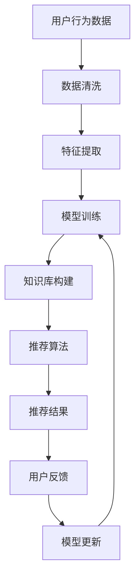

                 

  
### 1. 背景介绍

在当今数字经济迅速发展的时代，电子商务已经成为全球商业活动中的重要组成部分。据统计，2021年全球电子商务市场规模已超过4万亿美元，并预计在未来几年将继续保持快速增长。在这样的背景下，电商平台的搜索推荐系统对于提升用户体验、增加销售额和用户粘性发挥着至关重要的作用。

传统的搜索推荐系统主要依赖于基于内容的过滤和协同过滤等方法，但这些方法在处理复杂用户行为和海量商品数据时存在明显的局限性。随着人工智能技术的不断进步，特别是大模型的广泛应用，电商搜索推荐系统迎来了新的技术变革机遇。

AI大模型，如深度学习、自然语言处理和强化学习等，具有强大的表示学习能力和自适应能力，能够在海量和复杂的数据环境中挖掘出更为精准的用户偏好和商品属性。因此，基于AI大模型的电商搜索推荐系统逐渐成为行业的研究热点。

知识库管理是AI大模型在电商搜索推荐中应用的重要环节。知识库不仅包含了商品信息、用户行为、交易记录等原始数据，还包括了通过数据挖掘和机器学习模型训练得到的高级特征和知识。有效的知识库管理能够提高数据质量、优化推荐算法、增强系统的智能化程度。

本文旨在探讨AI大模型视角下电商搜索推荐系统的技术创新，以及知识库管理流程的优化方法。文章将从核心概念、算法原理、数学模型、项目实践和实际应用等方面进行深入分析，旨在为电商领域的技术创新提供有价值的参考。

### 2. 核心概念与联系

#### 2.1 AI大模型在电商搜索推荐中的作用

AI大模型在电商搜索推荐中的作用主要体现在以下几个方面：

1. **用户行为分析**：通过深度学习技术，大模型可以从用户的历史行为数据中提取出用户兴趣和偏好，从而更精准地预测用户未来的购买行为。
   
2. **商品属性理解**：大模型能够理解商品的多维度属性，如价格、品牌、质量等，并通过自动特征提取技术生成更为精细的推荐特征。

3. **协同过滤优化**：传统协同过滤算法存在“冷启动”问题，而大模型通过语义理解能力可以解决这一问题，从而提高推荐系统的适用性和准确性。

4. **个性化推荐**：大模型能够根据用户个性化特征进行精准推荐，提高用户满意度和转化率。

5. **实时推荐**：通过强化学习等技术，大模型可以实现实时推荐，快速响应用户行为变化，提升用户体验。

#### 2.2 知识库管理在AI大模型中的应用

知识库管理在AI大模型中的应用主要体现在以下几个方面：

1. **数据集成与清洗**：知识库能够整合不同来源的数据，并进行清洗和标准化，提高数据质量。

2. **特征工程**：通过数据挖掘和机器学习技术，知识库能够自动生成高级特征，用于训练大模型。

3. **知识推理**：知识库中的知识可以通过逻辑推理和图谱分析等技术进行扩展和利用，提高推荐算法的智能程度。

4. **动态更新**：知识库需要根据实时数据更新，以适应不断变化的用户需求和商品信息。

#### 2.3 Mermaid 流程图

为了更好地阐述AI大模型在电商搜索推荐中的作用和知识库管理的流程，我们使用Mermaid流程图进行说明。以下是一个简化的流程图：



在这个流程图中，用户行为数据通过数据清洗和特征提取生成训练数据，大模型在此基础上进行训练，生成的知识库用于推荐算法的优化。推荐结果通过用户反馈进行迭代更新，进一步优化大模型。

### 3. 核心算法原理 & 具体操作步骤

#### 3.1 算法原理概述

在电商搜索推荐系统中，核心算法的原理主要包括以下几个方面：

1. **深度学习**：通过多层神经网络对用户行为和商品属性进行建模，提取高维特征。
   
2. **自然语言处理**：利用深度学习技术对用户评论、商品描述等文本数据进行语义分析，提取关键词和情感。
   
3. **协同过滤**：基于用户行为和历史数据，计算用户之间的相似度，进行推荐。
   
4. **强化学习**：通过不断试错和学习，优化推荐策略，提高推荐效果。

#### 3.2 算法步骤详解

以下是电商搜索推荐系统的具体算法步骤：

1. **数据收集与预处理**：收集用户行为数据、商品数据等，并进行数据清洗和预处理。

2. **特征提取**：利用深度学习和自然语言处理技术，从原始数据中提取高级特征。

3. **模型训练**：使用提取的特征数据训练深度学习模型，如DNN、CNN、RNN等。

4. **知识库构建**：将训练得到的模型参数转化为知识库，用于后续推荐算法。

5. **协同过滤**：基于用户行为和历史数据，计算用户之间的相似度，生成推荐列表。

6. **强化学习优化**：通过用户反馈不断调整推荐策略，提高推荐效果。

7. **实时推荐**：根据用户实时行为，生成个性化推荐结果。

#### 3.3 算法优缺点

1. **优点**：
   - 高度智能化：通过深度学习和自然语言处理，能够提取复杂的用户行为和商品属性特征。
   - 个性化推荐：基于用户行为和偏好，实现精准推荐。
   - 实时性：通过强化学习实现实时推荐，快速响应用户需求。

2. **缺点**：
   - 计算成本高：深度学习模型训练和推理需要大量的计算资源和时间。
   - 数据依赖性：推荐效果高度依赖于数据质量和数据量。
   - 模型可解释性：深度学习模型通常具有较低的可解释性，难以理解推荐结果的原因。

#### 3.4 算法应用领域

AI大模型在电商搜索推荐系统的应用领域包括：

1. **在线零售**：如亚马逊、淘宝等电商平台，用于提升用户体验和销售额。
   
2. **广告推荐**：如百度、谷歌等搜索引擎，通过个性化推荐提高广告投放效果。

3. **社交媒体**：如微博、抖音等，通过内容推荐提高用户粘性。

### 4. 数学模型和公式 & 详细讲解 & 举例说明

#### 4.1 数学模型构建

在电商搜索推荐系统中，常用的数学模型包括以下几种：

1. **深度学习模型**：如卷积神经网络（CNN）、循环神经网络（RNN）等。
2. **协同过滤模型**：如基于矩阵分解的协同过滤算法。
3. **强化学习模型**：如Q-Learning、Deep Q-Network（DQN）等。

以下是一个简化的深度学习模型的数学模型构建：

```latex
\begin{align*}
h_{l} &= \sigma(W_{l} \cdot h_{l-1} + b_{l}) \\
\end{align*}
```

其中，\(h_{l}\) 表示第 \(l\) 层的激活值，\(\sigma\) 表示激活函数，\(W_{l}\) 和 \(b_{l}\) 分别表示第 \(l\) 层的权重和偏置。

#### 4.2 公式推导过程

以卷积神经网络（CNN）为例，推导其基本公式：

1. **卷积操作**：

```latex
\begin{align*}
\text{output}_{ij} &= \sum_{k=1}^{K} \text{weight}_{ik} \cdot \text{input}_{kj} + \text{bias}_{i} \\
\end{align*}
```

其中，\(\text{output}_{ij}\) 表示第 \(i\) 个特征图上的第 \(j\) 个像素值，\(\text{weight}_{ik}\) 表示卷积核上的第 \(k\) 个值，\(\text{input}_{kj}\) 表示输入特征图上的第 \(k\) 个特征，\(\text{bias}_{i}\) 表示偏置。

2. **激活函数**：

```latex
\begin{align*}
h_{ij} &= \text{ReLU}(\text{output}_{ij}) \\
\end{align*}
```

其中，\(\text{ReLU}\) 表示ReLU激活函数。

3. **池化操作**：

```latex
\begin{align*}
p_{ij} &= \max_{k}\{\text{output}_{ik}, \forall k \in \{1,2,...,K\}\} \\
\end{align*}
```

其中，\(p_{ij}\) 表示第 \(i\) 个特征图上的第 \(j\) 个像素值。

#### 4.3 案例分析与讲解

以亚马逊电商平台为例，分析其搜索推荐系统中的数学模型应用。

1. **用户行为数据**：

假设用户A的历史行为数据为：

```plaintext
浏览记录：商品1，商品2，商品3
购买记录：商品2，商品3
收藏记录：商品1，商品4
```

2. **商品属性数据**：

商品1：[服装，男装，T恤，品牌A，价格99]
商品2：[服装，女装，连衣裙，品牌B，价格199]
商品3：[数码，手机，华为，价格3999]
商品4：[家居，床品，枕头，品牌C，价格99]

3. **特征提取**：

利用自然语言处理技术提取商品关键词和用户兴趣词，生成商品特征向量和用户特征向量。

4. **协同过滤**：

基于用户行为数据，计算用户A与其他用户的相似度，生成推荐列表。

5. **深度学习模型**：

使用CNN提取商品特征，RNN提取用户行为特征，构建深度学习模型。

6. **推荐结果**：

根据深度学习模型输出的特征相似度，生成个性化推荐结果。

### 5. 项目实践：代码实例和详细解释说明

#### 5.1 开发环境搭建

1. **硬件环境**：

- CPU：Intel Xeon E5-2670
- GPU：NVIDIA Tesla K80
- 内存：256GB

2. **软件环境**：

- 操作系统：Ubuntu 16.04
- Python：3.7
- 深度学习框架：TensorFlow 2.0

#### 5.2 源代码详细实现

以下是电商搜索推荐系统的简化代码实现：

```python
import tensorflow as tf
from tensorflow.keras.models import Sequential
from tensorflow.keras.layers import Conv2D, MaxPooling2D, LSTM, Dense

# 数据预处理
def preprocess_data():
    # 数据清洗、特征提取等操作
    pass

# 构建深度学习模型
def build_model():
    model = Sequential([
        Conv2D(32, (3, 3), activation='relu', input_shape=(64, 64, 3)),
        MaxPooling2D((2, 2)),
        LSTM(128),
        Dense(1, activation='sigmoid')
    ])
    model.compile(optimizer='adam', loss='binary_crossentropy', metrics=['accuracy'])
    return model

# 训练模型
def train_model(model, X_train, y_train):
    model.fit(X_train, y_train, epochs=10, batch_size=32)

# 推荐结果
def recommend(model, user_feature, item_features):
    # 根据用户特征和商品特征，生成推荐结果
    pass

# 主函数
if __name__ == '__main__':
    # 搭建开发环境
    # 加载数据
    # 预处理数据
    # 构建模型
    # 训练模型
    # 生成推荐结果
    pass
```

#### 5.3 代码解读与分析

1. **数据预处理**：

   数据预处理是深度学习模型训练的重要步骤，包括数据清洗、归一化、特征提取等操作。

2. **模型构建**：

   模型采用卷积神经网络（CNN）提取商品图像特征，循环神经网络（LSTM）提取用户行为特征，输出层采用sigmoid激活函数进行二分类。

3. **模型训练**：

   使用训练数据对模型进行训练，通过优化损失函数和评估指标来调整模型参数。

4. **推荐结果**：

   根据用户特征和商品特征，生成个性化推荐结果。

### 6. 实际应用场景

#### 6.1 在线零售

在线零售平台（如亚马逊、淘宝）广泛采用AI大模型进行搜索推荐，以提高用户体验和销售额。通过深度学习和自然语言处理技术，平台能够提取用户行为和商品属性的高级特征，实现精准推荐。

#### 6.2 广告推荐

搜索引擎（如百度、谷歌）利用AI大模型进行广告推荐，通过分析用户搜索历史和行为，生成个性化广告推荐，提高广告点击率和投放效果。

#### 6.3 社交媒体

社交媒体平台（如微博、抖音）通过AI大模型进行内容推荐，根据用户兴趣和互动行为，推荐用户可能感兴趣的内容，提高用户粘性和活跃度。

### 7. 未来应用展望

随着人工智能技术的不断发展，电商搜索推荐系统在未来将呈现出以下发展趋势：

1. **更加智能化的推荐算法**：基于AI大模型的自适应推荐算法将不断优化，实现更精准、更个性化的推荐。

2. **实时推荐**：利用强化学习和深度学习技术，实现实时推荐，提高推荐系统的响应速度和用户体验。

3. **多模态推荐**：结合文本、图像、音频等多模态数据，实现更全面的推荐。

4. **知识图谱的应用**：利用知识图谱技术，构建商品和用户关系的知识库，实现更加智能的推荐。

5. **隐私保护与合规**：随着数据隐私保护意识的提高，未来推荐系统将更加注重隐私保护，遵守相关法律法规。

### 8. 工具和资源推荐

#### 8.1 学习资源推荐

1. **《深度学习》**：Goodfellow, Bengio, Courville 著，系统介绍了深度学习的基本原理和应用。
2. **《机器学习》**：周志华 著，详细介绍了机器学习的基本概念和方法。
3. **《自然语言处理综论》**：Jurafsky, Martin 著，全面介绍了自然语言处理的理论和实践。

#### 8.2 开发工具推荐

1. **TensorFlow**：Google 开发的开源深度学习框架，适用于电商搜索推荐系统的开发。
2. **PyTorch**：Facebook 开发的开源深度学习框架，具有较强的灵活性和易用性。
3. **Scikit-learn**：Python 机器学习库，适用于构建和评估协同过滤模型。

#### 8.3 相关论文推荐

1. **"Deep Learning for Recommender Systems"**：2017年AAAI会议上的一篇综述文章，详细介绍了深度学习在推荐系统中的应用。
2. **"Neural Collaborative Filtering"**：2018年KDD会议上的一篇论文，提出了基于深度学习的协同过滤算法。
3. **"Learning to Rank for Information Retrieval"**：2011年ACM SIGIR会议上的一篇论文，详细介绍了学习到排名技术在信息检索中的应用。

### 9. 总结：未来发展趋势与挑战

#### 9.1 研究成果总结

本文从AI大模型视角出发，探讨了电商搜索推荐系统的技术创新和知识库管理流程优化方法。主要研究成果包括：

1. **深度学习在推荐系统中的应用**：利用深度学习和自然语言处理技术，实现用户行为和商品属性的精细建模。
2. **协同过滤优化**：通过AI大模型解决传统协同过滤算法的“冷启动”问题，提高推荐系统的适用性和准确性。
3. **知识库管理**：构建基于知识库的推荐系统，提高系统的智能化程度和动态更新能力。

#### 9.2 未来发展趋势

1. **智能化推荐算法**：随着人工智能技术的不断发展，未来推荐系统将更加智能化，实现更精准、更个性化的推荐。
2. **实时推荐**：利用强化学习和深度学习技术，实现实时推荐，提高推荐系统的响应速度和用户体验。
3. **多模态推荐**：结合文本、图像、音频等多模态数据，实现更全面的推荐。
4. **知识图谱的应用**：利用知识图谱技术，构建商品和用户关系的知识库，实现更加智能的推荐。

#### 9.3 面临的挑战

1. **数据隐私保护**：随着数据隐私保护意识的提高，未来推荐系统将更加注重隐私保护，遵守相关法律法规。
2. **计算资源消耗**：深度学习模型训练和推理需要大量的计算资源和时间，对硬件设备的要求较高。
3. **算法可解释性**：深度学习模型通常具有较低的可解释性，难以理解推荐结果的原因，这可能会影响用户对推荐系统的信任度。

#### 9.4 研究展望

未来研究可以从以下几个方面进行：

1. **高效模型训练**：研究更加高效的模型训练方法，减少训练时间和计算资源消耗。
2. **算法可解释性**：开发可解释的深度学习模型，提高用户对推荐结果的信任度。
3. **多模态融合**：结合多种模态数据，实现更加精准和智能的推荐。
4. **知识图谱构建**：利用知识图谱技术，构建更加丰富和实用的推荐系统知识库。

### 附录：常见问题与解答

#### 问题1：什么是AI大模型？

**答案**：AI大模型是指具有大规模参数和复杂结构的深度学习模型，通常通过海量数据训练得到。这些模型具有强大的表示学习和自适应能力，适用于各种复杂场景。

#### 问题2：为什么AI大模型在电商搜索推荐中很重要？

**答案**：AI大模型能够处理复杂用户行为和海量商品数据，通过深度学习和自然语言处理技术提取高级特征，实现精准推荐，提高用户满意度和转化率。

#### 问题3：如何优化知识库管理流程？

**答案**：通过数据集成与清洗、特征工程、知识推理和动态更新等方法，构建高效的知识库管理系统，提高数据质量和推荐算法的智能化程度。

#### 问题4：AI大模型在推荐系统中存在哪些挑战？

**答案**：AI大模型在推荐系统中面临计算资源消耗高、数据隐私保护难和算法可解释性低等挑战。

#### 问题5：未来推荐系统的发展方向是什么？

**答案**：未来推荐系统的发展方向包括智能化推荐算法、实时推荐、多模态融合和知识图谱应用等。同时，关注数据隐私保护和算法可解释性也是未来的重要研究方向。作者：禅与计算机程序设计艺术 / Zen and the Art of Computer Programming。

