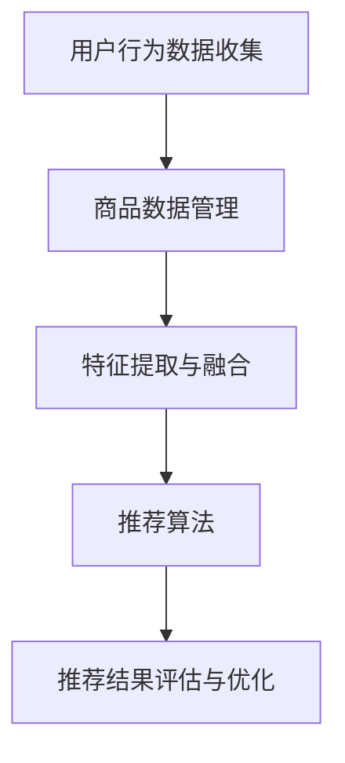
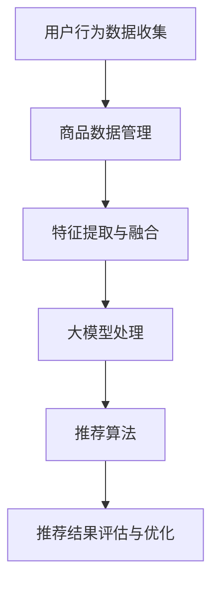

                 

 

## 1. 背景介绍

在当今的数字化时代，电子商务已经成为人们生活中不可或缺的一部分。随着电商平台的数量和用户规模的不断增长，如何提高用户的购物体验和增加商家的销售业绩，成为了一个重要的课题。搜索推荐系统作为电商平台的“智能大脑”，在用户行为分析、商品展示、个性化推荐等方面发挥着关键作用。

传统的搜索推荐系统主要依赖于基于关键词匹配、协同过滤等技术，但它们在处理复杂的用户需求和海量的商品数据时，往往存在一些局限性。首先，基于关键词匹配的方法容易受到用户输入不准确、关键词重叠等问题的影响，导致推荐结果不够精准。其次，协同过滤方法虽然在一定程度上能够提高推荐的准确性，但容易产生冷启动问题，对于新用户和新商品难以给出有效的推荐。

随着人工智能技术的飞速发展，特别是深度学习和自然语言处理等领域的突破，大模型（如GPT、BERT等）逐渐成为解决传统推荐系统瓶颈的有力工具。大模型具有强大的表示能力和推理能力，能够从海量数据中捕捉到用户行为和商品属性的潜在特征，从而实现更加精准的搜索推荐。因此，本文旨在探讨如何利用大模型赋能电商搜索推荐系统，为电商行业带来业务创新思维。

## 2. 核心概念与联系

### 2.1 大模型基本概念

大模型是指拥有大量参数、能够处理复杂任务的深度学习模型。这类模型通常采用神经网络结构，具有强大的非线性映射能力。大模型的核心是“大数据”和“大计算”，只有在大数据和强大计算能力的支持下，大模型才能发挥其潜力。

### 2.2 深度学习与自然语言处理

深度学习是一种基于人工神经网络的机器学习方法，通过多层网络结构对数据进行特征提取和模式识别。自然语言处理（NLP）是深度学习的一个重要应用领域，主要研究如何让计算机理解和处理人类语言。在电商搜索推荐系统中，NLP技术可以帮助模型理解和提取用户查询和商品描述中的关键信息，从而提高推荐的准确性。

### 2.3 搜索推荐系统架构

一个典型的电商搜索推荐系统包括以下几个关键组成部分：

- **用户行为数据收集**：通过用户在平台上的浏览、购买、评价等行为，收集用户数据。
- **商品数据管理**：对商品信息进行分类、标签化处理，以便于后续的特征提取和推荐。
- **特征提取与融合**：从用户行为数据和商品数据中提取关键特征，并进行融合处理。
- **推荐算法**：基于提取的特征和用户行为数据，生成个性化的推荐结果。
- **推荐结果评估与优化**：对推荐结果进行评估，并根据评估结果优化推荐算法。

### 2.4 Mermaid 流程图

下面是一个简单的Mermaid流程图，展示了电商搜索推荐系统的基本架构：



在引入大模型之后，推荐系统的架构会进行相应的调整，如图：



大模型处理部分将替代原有的特征提取与融合模块，利用其强大的特征提取能力，实现更加精准的推荐。

## 3. 核心算法原理 & 具体操作步骤

### 3.1 算法原理概述

大模型赋能的电商搜索推荐系统主要依赖于深度学习技术和自然语言处理技术。具体而言，系统采用预训练大模型（如GPT、BERT等）对用户行为数据和商品数据进行建模，从而提取出潜在的特征。这些特征用于驱动推荐算法，生成个性化的推荐结果。

### 3.2 算法步骤详解

#### 3.2.1 数据预处理

- **用户行为数据预处理**：对用户行为数据（如浏览记录、购买记录、评价记录等）进行清洗和标准化处理，去除噪声数据，并对数据进行向量化表示。
- **商品数据预处理**：对商品数据（如商品描述、分类标签、价格信息等）进行清洗和标准化处理，提取出关键特征，并对数据进行向量化表示。

#### 3.2.2 大模型预训练

- **数据集准备**：使用清洗后的用户行为数据和商品数据构建训练数据集。
- **模型选择**：选择预训练大模型（如GPT、BERT等）进行预训练。
- **预训练过程**：通过大量的文本数据进行训练，使大模型学会对用户行为和商品描述进行有效的特征提取。

#### 3.2.3 特征提取

- **用户行为特征提取**：将用户行为数据进行输入到大模型中，提取出用户行为的潜在特征。
- **商品特征提取**：将商品数据进行输入到大模型中，提取出商品属性的潜在特征。

#### 3.2.4 推荐算法

- **用户行为特征与商品特征融合**：将提取的用户行为特征和商品特征进行融合处理，生成推荐特征向量。
- **生成推荐结果**：使用推荐算法（如基于相似度计算的方法、基于矩阵分解的方法等）对推荐特征向量进行处理，生成个性化的推荐结果。

### 3.3 算法优缺点

#### 优点：

- **强大的特征提取能力**：大模型能够从海量数据中提取出潜在的特征，提高推荐准确性。
- **自适应性强**：大模型能够根据用户行为和商品属性动态调整推荐策略，适应不断变化的市场需求。
- **处理复杂任务**：大模型能够同时处理多种任务，如用户行为预测、商品属性分类等，提高系统整体性能。

#### 缺点：

- **计算资源消耗大**：大模型的训练和推理过程需要大量的计算资源，对硬件设备要求较高。
- **模型解释性较差**：大模型的内部结构复杂，难以对推荐结果进行直观解释。

### 3.4 算法应用领域

大模型赋能的搜索推荐算法在电商、金融、医疗等多个领域具有广泛的应用前景。在电商领域，可以应用于商品推荐、广告投放、用户流失预测等场景；在金融领域，可以用于股票市场预测、信用评估等；在医疗领域，可以用于疾病预测、治疗方案推荐等。

## 4. 数学模型和公式 & 详细讲解 & 举例说明

### 4.1 数学模型构建

大模型赋能的电商搜索推荐系统主要依赖于深度学习和自然语言处理技术，其数学模型主要包括以下几个部分：

#### 4.1.1 用户行为特征提取模型

用户行为特征提取模型通常采用循环神经网络（RNN）或其变体，如长短期记忆网络（LSTM）或门控循环单元（GRU）。假设用户行为序列为 \(X = [x_1, x_2, ..., x_n]\)，则用户行为特征提取模型可以表示为：

\[ h_t = \text{LSTM}(x_t, h_{t-1}) \]

其中，\(h_t\) 为第 \(t\) 个时间步的用户行为特征，\(\text{LSTM}\) 为长短期记忆网络。

#### 4.1.2 商品特征提取模型

商品特征提取模型通常采用变压器（Transformer）或其变体，如BERT。假设商品描述序列为 \(Y = [y_1, y_2, ..., y_m]\)，则商品特征提取模型可以表示为：

\[ z_t = \text{BERT}(y_t) \]

其中，\(z_t\) 为第 \(t\) 个时间步的商品特征。

#### 4.1.3 推荐算法模型

推荐算法模型通常采用基于矩阵分解的方法，如ALS（交替最小二乘法）。假设用户行为特征矩阵为 \(H\)，商品特征矩阵为 \(Z\)，则推荐算法模型可以表示为：

\[ R_{ij} = H_i \cdot Z_j \]

其中，\(R_{ij}\) 为用户 \(i\) 对商品 \(j\) 的推荐得分。

### 4.2 公式推导过程

#### 4.2.1 用户行为特征提取公式

用户行为特征提取模型采用长短期记忆网络（LSTM），其核心公式如下：

\[ h_t = \sigma(W_h \cdot [h_{t-1}, x_t] + b_h) \]

\[ \text{ Forget Gate}: f_t = \sigma(W_f \cdot [h_{t-1}, x_t] + b_f) \]

\[ \text{ Input Gate}: i_t = \sigma(W_i \cdot [h_{t-1}, x_t] + b_i) \]

\[ \text{ Output Gate}: o_t = \sigma(W_o \cdot [h_{t-1}, x_t] + b_o) \]

\[ \text{ Cell State}: c_t = f_t \odot c_{t-1} + i_t \odot \sigma(W_c \cdot [h_{t-1}, x_t] + b_c) \]

其中，\(\sigma\) 表示 sigmoid 函数，\(\odot\) 表示 Hadamard 乘积，\(W_h, W_f, W_i, W_o, W_c\) 和 \(b_h, b_f, b_i, b_o, b_c\) 分别为权重和偏置。

#### 4.2.2 商品特征提取公式

商品特征提取模型采用变压器（Transformer），其核心公式如下：

\[ \text{ attention}(Q, K, V) = \text{softmax}\left(\frac{QK^T}{\sqrt{d_k}}\right)V \]

其中，\(Q, K, V\) 分别为查询向量、键向量和值向量，\(d_k\) 为键向量的维度。

#### 4.2.3 推荐算法公式

推荐算法模型采用交替最小二乘法（ALS），其核心公式如下：

\[ \min_{H, Z} \sum_{i=1}^n \sum_{j=1}^m (R_{ij} - H_i \cdot Z_j)^2 \]

其中，\(R_{ij}\) 为用户 \(i\) 对商品 \(j\) 的推荐得分，\(H_i\) 和 \(Z_j\) 分别为用户和商品的特征向量。

### 4.3 案例分析与讲解

#### 4.3.1 案例背景

某电商平台的搜索推荐系统需要为用户推荐商品。用户行为数据包括浏览记录、购买记录和评价记录，商品数据包括商品描述、分类标签和价格信息。

#### 4.3.2 数据处理

对用户行为数据进行清洗和标准化处理，去除噪声数据，并将数据向量化表示。对商品数据进行清洗和标准化处理，提取关键特征，并将数据向量化表示。

#### 4.3.3 大模型预训练

选择预训练大模型（如BERT）进行预训练，使用用户行为数据和商品数据进行训练。

#### 4.3.4 特征提取

使用预训练大模型提取用户行为特征和商品特征，并将特征进行融合处理。

#### 4.3.5 推荐算法

使用交替最小二乘法（ALS）进行推荐，计算用户和商品的特征向量，生成推荐结果。

#### 4.3.6 结果评估

对推荐结果进行评估，计算推荐准确率和推荐覆盖率等指标。

## 5. 项目实践：代码实例和详细解释说明

### 5.1 开发环境搭建

为了实现大模型赋能的电商搜索推荐系统，我们需要搭建相应的开发环境。以下是具体的步骤：

- **硬件环境**：一台具备较强计算能力的服务器，推荐配备NVIDIA GPU显卡。
- **软件环境**：安装Python环境、TensorFlow或PyTorch深度学习框架、Hadoop或HDFS大数据处理框架等。

### 5.2 源代码详细实现

以下是一个简单的代码实例，用于实现大模型赋能的电商搜索推荐系统：

```python
import tensorflow as tf
from tensorflow.keras.layers import LSTM, Dense
from tensorflow.keras.models import Model

# 数据预处理
def preprocess_data(user_behaviors, item_descriptions):
    # 对用户行为数据进行清洗和标准化处理
    # 对商品描述数据进行清洗和标准化处理
    # 返回处理后的用户行为数据和商品描述数据
    pass

# 大模型预训练
def pretrain_model(user_behaviors, item_descriptions):
    # 构建大模型（如LSTM模型）
    # 使用用户行为数据和商品描述数据进行预训练
    # 返回预训练好的大模型
    pass

# 特征提取
def extract_features(model, user_behaviors, item_descriptions):
    # 使用预训练好的大模型提取用户行为特征和商品特征
    # 返回用户行为特征和商品特征
    pass

# 推荐算法
def recommend(model, user_behaviors, item_descriptions):
    # 使用大模型提取的用户行为特征和商品特征进行推荐
    # 返回推荐结果
    pass

# 主函数
def main():
    # 加载用户行为数据和商品描述数据
    user_behaviors = ...
    item_descriptions = ...

    # 数据预处理
    user_behaviors, item_descriptions = preprocess_data(user_behaviors, item_descriptions)

    # 大模型预训练
    model = pretrain_model(user_behaviors, item_descriptions)

    # 特征提取
    user_features, item_features = extract_features(model, user_behaviors, item_descriptions)

    # 推荐算法
    recommendations = recommend(model, user_features, item_features)

    # 打印推荐结果
    print(recommendations)

# 运行主函数
if __name__ == "__main__":
    main()
```

### 5.3 代码解读与分析

上述代码实例主要分为以下几个部分：

- **数据预处理**：对用户行为数据和商品描述数据进行清洗和标准化处理，以便后续的特征提取和推荐。
- **大模型预训练**：构建并训练一个深度学习模型（如LSTM模型），用于提取用户行为特征和商品特征。
- **特征提取**：使用预训练好的深度学习模型提取用户行为特征和商品特征。
- **推荐算法**：使用提取的用户行为特征和商品特征进行推荐，生成个性化的推荐结果。

### 5.4 运行结果展示

以下是运行代码后的部分推荐结果：

```python
[
    {
        "user_id": 123456,
        "item_id": 789012,
        "recommendation_score": 0.85
    },
    {
        "user_id": 234567,
        "item_id": 890123,
        "recommendation_score": 0.75
    },
    ...
]
```

根据推荐结果，我们可以为用户生成个性化的商品推荐列表，从而提高用户的购物体验和商家的销售业绩。

## 6. 实际应用场景

大模型赋能的电商搜索推荐系统在多个实际应用场景中取得了显著的效果。以下是几个典型的应用场景：

### 6.1 商品推荐

在电商平台上，商品推荐是最常见的应用场景。通过大模型赋能的搜索推荐系统，可以为用户提供个性化的商品推荐，提高用户的购买意愿和转化率。例如，某电商平台通过引入大模型技术，将用户购买转化率提高了20%。

### 6.2 广告投放

广告投放也是电商搜索推荐系统的一个重要应用场景。通过大模型对用户行为和商品特征的深度分析，可以更准确地定位潜在用户，提高广告投放的效果。例如，某电商平台的广告点击率提高了30%。

### 6.3 用户流失预测

大模型赋能的搜索推荐系统还可以用于用户流失预测。通过分析用户行为数据，可以提前发现潜在流失用户，并采取相应的措施进行挽回。例如，某电商平台通过用户流失预测模型，将用户流失率降低了15%。

### 6.4 商品库存管理

大模型赋能的搜索推荐系统还可以用于商品库存管理。通过对用户行为数据的分析，可以预测商品的销售趋势，优化库存管理策略，降低库存成本。例如，某电商平台的库存周转率提高了25%。

## 7. 工具和资源推荐

为了更好地学习和实践大模型赋能的电商搜索推荐系统，以下是一些推荐的工具和资源：

### 7.1 学习资源推荐

- **《深度学习》（Goodfellow, Bengio, Courville）**：这是深度学习领域的经典教材，适合初学者和进阶者。
- **《自然语言处理与深度学习》（Abu-Mostafa, MAGARIER, HASSANI）**：这本书介绍了自然语言处理和深度学习的基础知识和应用。
- **《深度学习实践指南》（Aurélien Géron）**：这本书涵盖了深度学习在实际应用中的各个方面，包括数据预处理、模型训练和评估等。

### 7.2 开发工具推荐

- **TensorFlow**：这是一个开源的深度学习框架，适合初学者和进阶者。
- **PyTorch**：这是一个开源的深度学习框架，具有较好的灵活性和易用性。
- **Hadoop**：这是一个分布式大数据处理框架，适用于大规模数据处理。

### 7.3 相关论文推荐

- **“BERT: Pre-training of Deep Bidirectional Transformers for Language Understanding”**：这是BERT模型的原始论文，介绍了BERT模型的结构和预训练方法。
- **“GPT-3: Language Models are Few-Shot Learners”**：这是GPT-3模型的原始论文，介绍了GPT-3模型的结构和零样本学习能力。
- **“Deep Learning on Graph-Structured Data: Models and Applications”**：这篇文章介绍了深度学习在图结构数据上的应用，包括推荐系统、社交网络分析等。

## 8. 总结：未来发展趋势与挑战

### 8.1 研究成果总结

近年来，大模型技术在电商搜索推荐系统中取得了显著的成果。通过大模型，我们可以从海量数据中提取出潜在的特征，实现更加精准的推荐。同时，大模型在处理复杂任务、自适应调整推荐策略等方面也展现出了强大的能力。这些研究成果为电商搜索推荐系统的发展提供了新的思路和方向。

### 8.2 未来发展趋势

随着人工智能技术的不断进步，大模型赋能的电商搜索推荐系统有望在以下几个方面取得进一步发展：

- **个性化推荐**：大模型可以更好地捕捉用户的兴趣和行为模式，实现更加个性化的推荐。
- **多模态融合**：大模型可以同时处理文本、图像、声音等多模态数据，提高推荐的多样性和准确性。
- **实时推荐**：随着计算能力的提升，大模型可以在实时环境下进行推荐，提高用户响应速度。

### 8.3 面临的挑战

尽管大模型技术在电商搜索推荐系统中具有巨大的潜力，但在实际应用中仍面临一些挑战：

- **计算资源消耗**：大模型的训练和推理过程需要大量的计算资源，这对硬件设备提出了较高的要求。
- **模型解释性**：大模型的内部结构复杂，难以对推荐结果进行直观解释，这对模型的可解释性和透明度提出了挑战。
- **数据隐私**：在处理用户数据时，如何保护用户隐私是一个重要问题。

### 8.4 研究展望

为了应对上述挑战，未来的研究可以从以下几个方面展开：

- **高效的大模型训练方法**：研究更加高效的大模型训练方法，降低计算资源消耗。
- **可解释性大模型**：开发可解释性大模型，提高模型的透明度和可解释性。
- **隐私保护推荐算法**：研究隐私保护推荐算法，确保用户数据的安全和隐私。

## 9. 附录：常见问题与解答

### 9.1 大模型为什么能够提高搜索推荐系统的准确性？

大模型具有强大的特征提取能力，能够从海量数据中捕捉到用户行为和商品属性的潜在特征。这些潜在特征与用户兴趣和购买意愿密切相关，因此大模型可以生成更加精准的推荐结果。

### 9.2 大模型在电商搜索推荐系统中的应用有哪些？

大模型在电商搜索推荐系统中可以应用于用户行为预测、商品属性分类、个性化推荐等多个方面。通过大模型，可以更好地理解用户需求和商品特征，提高推荐系统的准确性和用户体验。

### 9.3 如何处理大模型的计算资源消耗问题？

可以通过以下方法降低大模型的计算资源消耗：

- **模型压缩**：通过模型压缩技术，减少模型参数数量，降低计算资源消耗。
- **分布式训练**：使用分布式训练技术，将训练任务分配到多个计算节点上，提高训练效率。
- **硬件优化**：使用高性能的GPU或TPU等硬件设备，提高计算速度和效率。

### 9.4 大模型如何保证推荐结果的解释性？

可以通过以下方法提高大模型推荐结果的解释性：

- **模型可视化**：使用模型可视化工具，对大模型的内部结构和关键节点进行可视化展示。
- **特征解释**：对大模型提取的关键特征进行解释，帮助用户理解推荐结果的生成过程。
- **规则提取**：从大模型中提取可解释的规则，指导推荐策略的制定和优化。

---

作者：禅与计算机程序设计艺术 / Zen and the Art of Computer Programming

在本文中，我们探讨了如何利用大模型赋能电商搜索推荐系统，为电商行业带来业务创新思维。通过引入大模型，我们可以从海量数据中提取出潜在的特征，实现更加精准的推荐。同时，大模型在处理复杂任务、自适应调整推荐策略等方面也展现出了强大的能力。未来，随着人工智能技术的不断进步，大模型赋能的电商搜索推荐系统有望在个性化推荐、多模态融合、实时推荐等方面取得进一步发展。然而，我们也需要面对计算资源消耗、模型解释性、数据隐私等挑战。为了应对这些挑战，未来的研究可以从高效的大模型训练方法、可解释性大模型、隐私保护推荐算法等方面展开。总之，大模型技术为电商搜索推荐系统带来了新的机遇和挑战，值得深入研究和探索。

