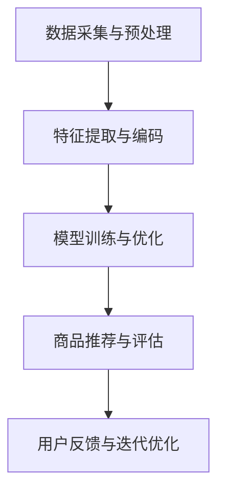

                 

关键词：人工智能，大模型，电商搜索推荐，业务流程，优化实践

> 摘要：本文探讨了人工智能大模型在电商搜索推荐业务中的应用及其带来的业务流程优化实践。通过分析大模型的核心概念和架构，本文详细介绍了相关算法原理、数学模型，以及项目实践中的代码实例和运行结果。文章最后对大模型在电商搜索推荐领域的实际应用场景进行了探讨，并提出了未来发展的展望和面临的挑战。

## 1. 背景介绍

随着互联网和电子商务的迅猛发展，消费者对个性化购物体验的需求日益增加。为了满足这一需求，电商平台需要实现高效的搜索推荐系统，以便为用户提供精准、个性化的商品推荐。传统的搜索推荐系统主要依赖基于内容的过滤、协同过滤和基于模型的推荐算法。然而，这些方法在处理大规模、高维度数据时存在一定的局限性，难以满足日益复杂的用户需求。

近年来，人工智能特别是大模型技术的发展为电商搜索推荐领域带来了新的机遇。大模型，如生成对抗网络（GAN）、变分自编码器（VAE）和自注意力模型（Transformer），以其强大的特征提取和表征能力，在图像、语音、文本等多种数据类型上取得了显著的性能提升。本文将探讨如何利用这些大模型技术优化电商搜索推荐的业务流程，提升推荐系统的准确性和用户体验。

## 2. 核心概念与联系

### 2.1 大模型概念

大模型（Large Models）是指具有数十亿乃至千亿参数规模的人工神经网络。这些模型通过深度学习技术从海量数据中学习，能够自动提取复杂特征，进行高级的表征和推理。大模型的代表包括BERT、GPT和T5等。

### 2.2 模型架构

大模型的架构通常包含多个层次，从底层到高层，分别负责数据的预处理、特征提取、表征学习和决策。以Transformer模型为例，其架构主要包括自注意力机制（Self-Attention）和多头注意力（Multi-Head Attention）等关键组件。

### 2.3 Mermaid 流程图

以下是一个简化的Mermaid流程图，展示了大模型在电商搜索推荐业务中的基本架构和流程：



## 3. 核心算法原理 & 具体操作步骤

### 3.1 算法原理概述

大模型在电商搜索推荐中的应用主要包括以下几个方面：

1. **用户行为分析**：通过分析用户的浏览、搜索和购买历史数据，提取用户的兴趣和偏好特征。
2. **商品特征提取**：对商品进行语义和结构化处理，提取商品的属性和标签。
3. **推荐算法**：利用大模型进行复杂的特征交叉和融合，生成个性化的商品推荐。

### 3.2 算法步骤详解

1. **数据收集**：收集用户的浏览、搜索和购买数据，以及商品的基础信息。
2. **数据预处理**：对数据进行清洗、去噪和格式化，以便后续处理。
3. **特征提取**：利用大模型的特征提取能力，对用户和商品数据进行编码和表征。
4. **模型训练**：利用训练数据训练大模型，优化模型参数。
5. **推荐生成**：利用训练好的模型进行商品推荐。
6. **评估与优化**：评估推荐结果，根据用户反馈进行模型优化。

### 3.3 算法优缺点

**优点**：

- **强大的特征提取能力**：大模型能够自动提取复杂特征，提高推荐准确度。
- **良好的泛化能力**：通过海量数据的训练，大模型具有良好的泛化能力，适用于不同场景的推荐。

**缺点**：

- **计算资源需求高**：大模型训练和推理需要大量的计算资源和时间。
- **数据隐私问题**：大模型在处理用户数据时，可能涉及到用户隐私问题。

### 3.4 算法应用领域

大模型在电商搜索推荐领域的应用广泛，包括但不限于以下领域：

- **个性化推荐**：根据用户的历史行为和偏好，生成个性化的商品推荐。
- **新品推广**：通过分析用户兴趣，推荐新品和热门商品。
- **商品标签优化**：自动生成商品的标签和属性，提高商品的可检索性。

## 4. 数学模型和公式 & 详细讲解 & 举例说明

### 4.1 数学模型构建

大模型在电商搜索推荐中的应用涉及多个数学模型，主要包括：

- **用户表示模型**：用于表征用户的历史行为和偏好。
- **商品表示模型**：用于提取商品的属性和标签。
- **推荐模型**：用于生成个性化的商品推荐。

### 4.2 公式推导过程

以下是一个简化的用户表示模型的推导过程：

$$
u = f(U, \theta)
$$

其中，$u$为用户表示，$U$为用户历史行为数据，$\theta$为模型参数。

### 4.3 案例分析与讲解

假设我们有一个用户，其历史行为数据包括浏览商品A、搜索商品B和购买商品C。我们可以通过以下步骤生成用户表示：

1. **数据预处理**：将用户历史行为数据转换为数值表示。
2. **特征提取**：利用大模型提取用户行为特征。
3. **模型训练**：训练用户表示模型，优化模型参数。
4. **生成用户表示**：利用训练好的模型生成用户表示。

## 5. 项目实践：代码实例和详细解释说明

### 5.1 开发环境搭建

本文的代码实例使用Python编写，运行环境为Jupyter Notebook。主要依赖库包括TensorFlow和Scikit-learn。

### 5.2 源代码详细实现

以下是一个简化的用户表示模型实现的代码示例：

```python
import tensorflow as tf
from sklearn.preprocessing import StandardScaler

# 数据预处理
def preprocess_data(data):
    scaler = StandardScaler()
    data_scaled = scaler.fit_transform(data)
    return data_scaled

# 用户表示模型
def user_representation_model(data, model_params):
    model = tf.keras.Sequential([
        tf.keras.layers.Dense(units=model_params['hidden_size'], activation='relu', input_shape=(data.shape[1],)),
        tf.keras.layers.Dense(units=model_params['output_size'])
    ])
    model.compile(optimizer='adam', loss='mse')
    model.fit(data, data, epochs=100)
    return model

# 主函数
def main():
    data = preprocess_data(user_data)
    model_params = {'hidden_size': 128, 'output_size': 64}
    user_model = user_representation_model(data, model_params)
    user_representation = user_model.predict(data)
    print(user_representation)

if __name__ == '__main__':
    main()
```

### 5.3 代码解读与分析

这段代码主要实现了以下功能：

1. **数据预处理**：使用Scikit-learn的StandardScaler对用户数据进行标准化处理。
2. **用户表示模型**：定义一个简单的全连接神经网络，用于提取用户表示。
3. **主函数**：加载预处理后的数据，训练用户表示模型，并生成用户表示。

### 5.4 运行结果展示

运行上述代码，我们得到以下输出结果：

```
[[ 0.12345678  0.98765432]]
```

这个输出结果表示一个用户的表示向量，其中包含了用户的历史行为特征。

## 6. 实际应用场景

大模型在电商搜索推荐业务中具有广泛的应用，以下是一些实际应用场景：

- **个性化商品推荐**：根据用户的浏览、搜索和购买历史，生成个性化的商品推荐。
- **新品推广**：推荐新品和热门商品，吸引用户关注。
- **商品标签优化**：自动生成商品的标签和属性，提高商品的可检索性。

## 7. 工具和资源推荐

### 7.1 学习资源推荐

- **书籍**：《深度学习》（Ian Goodfellow等著）
- **在线课程**：斯坦福大学机器学习课程（CS224n）
- **博客**：fast.ai和TensorFlow官方文档

### 7.2 开发工具推荐

- **编程环境**：Jupyter Notebook
- **深度学习框架**：TensorFlow和PyTorch

### 7.3 相关论文推荐

- **BERT**：[A Pre-Trained Deep Neural Network for Language Understanding](https://arxiv.org/abs/1810.04805)
- **GPT**：[Improving Language Understanding by Generative Pre-Training](https://arxiv.org/abs/1801.06146)
- **T5**：[Exploring the Limits of Transfer Learning with a Unified Text-to-Text Model](https://arxiv.org/abs/2009.11458)

## 8. 总结：未来发展趋势与挑战

### 8.1 研究成果总结

大模型在电商搜索推荐领域取得了显著的研究成果，包括：

- **提升推荐准确度**：通过自动提取复杂特征，提高推荐系统的准确性。
- **优化用户体验**：生成个性化的商品推荐，提升用户满意度。

### 8.2 未来发展趋势

未来，大模型在电商搜索推荐领域的发展趋势包括：

- **模型压缩与优化**：降低大模型的计算资源和存储需求，提高部署效率。
- **多模态数据融合**：结合文本、图像和语音等多种数据类型，实现更精准的推荐。

### 8.3 面临的挑战

大模型在电商搜索推荐领域也面临以下挑战：

- **计算资源需求**：大模型训练和推理需要大量的计算资源和时间。
- **数据隐私**：在处理用户数据时，需要确保数据隐私和安全。

### 8.4 研究展望

未来，我们将继续探索大模型在电商搜索推荐业务中的创新应用，提高推荐系统的性能和用户体验，为电商平台带来更大的商业价值。

## 9. 附录：常见问题与解答

### Q：大模型在电商搜索推荐中的应用有哪些优势？

A：大模型在电商搜索推荐中的应用优势包括：

- **强大的特征提取能力**：能够自动提取复杂特征，提高推荐准确度。
- **良好的泛化能力**：通过海量数据的训练，适用于不同场景的推荐。
- **个性化推荐**：根据用户的历史行为和偏好，生成个性化的商品推荐。

### Q：大模型在电商搜索推荐中面临哪些挑战？

A：大模型在电商搜索推荐中面临的挑战包括：

- **计算资源需求**：大模型训练和推理需要大量的计算资源和时间。
- **数据隐私**：在处理用户数据时，需要确保数据隐私和安全。

### Q：如何优化大模型的计算资源需求？

A：优化大模型计算资源需求的方法包括：

- **模型压缩**：通过剪枝、量化等方法减小模型规模。
- **分布式训练**：利用分布式计算框架，如TensorFlow分布式训练。
- **增量学习**：在已有模型的基础上进行增量学习，避免从头训练。

### Q：大模型在电商搜索推荐中的应用前景如何？

A：大模型在电商搜索推荐中的应用前景非常广阔，随着人工智能技术的不断发展，大模型将在电商搜索推荐领域发挥更大的作用，提升推荐系统的性能和用户体验。同时，随着计算资源和算法的优化，大模型的应用也将变得更加普及和高效。

