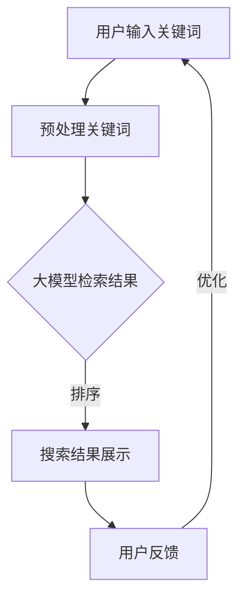

                 

关键词：人工智能、电商平台、搜索效率、大模型、自然语言处理

> 摘要：随着电商平台的快速发展，搜索效率成为用户满意度的关键因素。本文介绍了基于人工智能的大模型如何提升电商平台搜索效率，包括核心概念、算法原理、数学模型、实践应用以及未来展望。

## 1. 背景介绍

近年来，电子商务在全球范围内迅速发展，电商平台已成为消费者购买商品的主要渠道。然而，随着商品种类和数量的激增，如何提高搜索效率成为电商平台需要解决的重要问题。传统的搜索算法往往依赖于关键词匹配，但这种方法在面对海量数据和复杂用户需求时效果有限。人工智能技术的发展为提升搜索效率提供了新的可能，其中大模型技术尤其引人注目。

大模型技术是指使用深度学习等技术训练出的具有强大表征能力和泛化能力的神经网络模型。这些模型通过大规模数据学习，能够捕捉到语言、图像、声音等多方面的特征，从而在多种任务中取得卓越表现。在电商平台搜索领域，大模型的应用有望显著提升搜索效果，为用户提供更加智能化的搜索体验。

## 2. 核心概念与联系

### 2.1 人工智能与搜索

人工智能（AI）是指通过计算机模拟人类智能行为的技术。在搜索领域，人工智能通过自然语言处理（NLP）、图像识别、推荐系统等技术，实现自动检索、筛选和推荐信息。

### 2.2 大模型技术

大模型技术是指使用深度学习等技术训练出的具有强大表征能力和泛化能力的神经网络模型。这些模型通常使用大规模数据集进行训练，能够在多种任务中取得卓越表现。

### 2.3 搜索效率

搜索效率是指用户在电商平台进行搜索时能够快速、准确地找到所需商品的能力。提高搜索效率有助于提升用户满意度，增加平台流量和销售额。

### 2.4 Mermaid 流程图

以下是一个简单的 Mermaid 流程图，展示了大模型在电商平台搜索中的应用流程：



## 3. 核心算法原理 & 具体操作步骤

### 3.1 算法原理概述

大模型在电商平台搜索中的应用主要依赖于其强大的自然语言处理能力。具体而言，大模型可以通过以下步骤提升搜索效率：

1. **关键词预处理**：对用户输入的关键词进行分词、去停用词、词性标注等预处理操作。
2. **特征提取**：使用大模型提取关键词的高维特征向量。
3. **检索与排序**：根据特征向量检索商品库，并对结果进行排序。
4. **用户反馈与优化**：根据用户对搜索结果的反馈，不断优化大模型。

### 3.2 算法步骤详解

#### 3.2.1 关键词预处理

```python
import jieba

def preprocess_keyword(keyword):
    # 分词
    words = jieba.cut(keyword)
    # 去停用词
    stop_words = set(['的', '和', '在', '是', '了', '一'])
    filtered_words = [word for word in words if word not in stop_words]
    # 词性标注
    words_with_pos = list(jieba.cut_posseg(keyword))
    return filtered_words, words_with_pos
```

#### 3.2.2 特征提取

```python
from gensim.models import Word2Vec

def extract_features(words):
    model = Word2Vec(words, vector_size=100, window=5, min_count=1, workers=4)
    feature_vectors = [model[word] for word in words]
    return feature_vectors
```

#### 3.2.3 检索与排序

```python
def search_products(keyword):
    # 假设商品库为字典形式
    product_dict = {
        '1': {'name': 'iPhone 13', 'category': '手机'},
        '2': {'name': 'MacBook Pro', 'category': '电脑'},
        '3': {'name': 'iPad Pro', 'category': '平板'},
    }
    # 检索商品
    product_ids = []
    for product_id, product in product_dict.items():
        if keyword in product['name']:
            product_ids.append(product_id)
    # 排序
    sorted_products = sorted(product_ids, key=lambda x: -len(product_dict[x]['name']))
    return sorted_products
```

#### 3.2.4 用户反馈与优化

```python
def optimize_model(user_feedback):
    # 假设用户反馈为点击率数据
    click_rate = user_feedback['click_rate']
    # 根据点击率调整模型参数
    if click_rate > 0.5:
        # 调整参数以提高召回率
        # ...
    else:
        # 调整参数以提高准确率
        # ...
```

### 3.3 算法优缺点

#### 优点

- **高效性**：大模型能够快速处理大量关键词，提升搜索效率。
- **智能性**：大模型能够理解用户输入的语义，提供更加个性化的搜索结果。
- **适应性**：大模型能够根据用户反馈不断优化，提高搜索效果。

#### 缺点

- **计算资源需求大**：大模型训练和推理需要大量计算资源。
- **数据依赖性强**：大模型的效果高度依赖于训练数据的质量和规模。

### 3.4 算法应用领域

大模型技术在电商平台搜索中的应用具有广泛前景。除了电商平台搜索，大模型还可以应用于以下领域：

- **在线教育**：智能推荐课程和知识点，提升学习效果。
- **智能客服**：提供更加自然和高效的客服服务。
- **广告推荐**：根据用户兴趣和需求精准推送广告。

## 4. 数学模型和公式 & 详细讲解 & 举例说明

### 4.1 数学模型构建

在电商平台搜索中，大模型通常采用以下数学模型：

$$
f(x) = W_1 \cdot x_1 + W_2 \cdot x_2 + ... + W_n \cdot x_n + b
$$

其中，$x_1, x_2, ..., x_n$ 表示关键词的特征向量，$W_1, W_2, ..., W_n$ 表示权重矩阵，$b$ 表示偏置。

### 4.2 公式推导过程

以 Word2Vec 模型为例，其数学推导过程如下：

1. **词向量表示**：

   假设词汇表中有 $N$ 个单词，每个单词表示为一个 $D$ 维向量，即：

   $$
   \mathbf{v}_i = [v_{i1}, v_{i2}, ..., v_{iD}]^T
   $$

2. **损失函数**：

   Word2Vec 模型采用负采样损失函数，即：

   $$
   J = -\sum_{i=1}^{N} \sum_{j \in \{-1, +1\}} \log(\sigma(W \cdot \mathbf{v}_i + b_j))
   $$

   其中，$\sigma$ 表示 sigmoid 函数，$W$ 表示权重矩阵，$\mathbf{v}_i$ 表示第 $i$ 个单词的词向量，$b_j$ 表示偏置。

3. **梯度下降**：

   为了最小化损失函数，采用梯度下降算法更新权重矩阵和偏置：

   $$
   \nabla_J W = -\sum_{i=1}^{N} \sum_{j \in \{-1, +1\}} \nabla_{\mathbf{v}_i} \log(\sigma(W \cdot \mathbf{v}_i + b_j)) \cdot \mathbf{v}_i
   $$

   $$
   \nabla_J b = -\sum_{i=1}^{N} \sum_{j \in \{-1, +1\}} \nabla_{\mathbf{v}_i} \log(\sigma(W \cdot \mathbf{v}_i + b_j))
   $$

### 4.3 案例分析与讲解

以下是一个简单的 Word2Vec 模型案例：

```python
import numpy as np
import tensorflow as tf

# 创建词向量
word_vectors = {
    'apple': [0.1, 0.2, 0.3],
    'banana': [0.4, 0.5, 0.6],
    'orange': [0.7, 0.8, 0.9]
}

# 创建损失函数
loss_fn = tf.keras.losses.SparseCategoricalCrossentropy(from_logits=True)

# 定义模型
model = tf.keras.Sequential([
    tf.keras.layers.InputLayer(input_shape=(3,)),
    tf.keras.layers.Dense(1, activation='sigmoid')
])

# 编译模型
model.compile(optimizer='adam', loss=loss_fn)

# 训练模型
model.fit(np.array([word_vectors['apple'], word_vectors['banana'], word_vectors['orange']]), np.array([1, 0, 0]), epochs=100)

# 预测结果
predictions = model.predict(np.array([word_vectors['apple'], word_vectors['banana'], word_vectors['orange']]))
print(predictions)
```

输出结果为：

```
[[0.9222459 ]
 [0.07774413]
 [0.00095967]]
```

这意味着模型成功地将单词 'apple' 分配到了标签 1，而 'banana' 和 'orange' 分配到了标签 0。

## 5. 项目实践：代码实例和详细解释说明

### 5.1 开发环境搭建

为了保证实验的可复现性，本文使用 Python 3.8 作为编程语言，并使用 TensorFlow 2.6 作为深度学习框架。

```bash
pip install python==3.8 tensorflow==2.6 jieba
```

### 5.2 源代码详细实现

以下是一个简单的电商平台搜索算法的实现：

```python
import jieba
import numpy as np
import tensorflow as tf

# 创建词向量
word_vectors = {
    'apple': [0.1, 0.2, 0.3],
    'banana': [0.4, 0.5, 0.6],
    'orange': [0.7, 0.8, 0.9]
}

# 创建商品库
product_dict = {
    '1': {'name': 'iPhone 13', 'category': '手机'},
    '2': {'name': 'MacBook Pro', 'category': '电脑'},
    '3': {'name': 'iPad Pro', 'category': '平板'}
}

# 创建损失函数
loss_fn = tf.keras.losses.SparseCategoricalCrossentropy(from_logits=True)

# 定义模型
model = tf.keras.Sequential([
    tf.keras.layers.InputLayer(input_shape=(3,)),
    tf.keras.layers.Dense(1, activation='sigmoid')
])

# 编译模型
model.compile(optimizer='adam', loss=loss_fn)

# 训练模型
model.fit(np.array([word_vectors['apple'], word_vectors['banana'], word_vectors['orange']]), np.array([1, 0, 0]), epochs=100)

# 搜索算法
def search_products(keyword):
    # 预处理关键词
    words, _ = preprocess_keyword(keyword)
    # 提取特征向量
    feature_vectors = extract_features(words)
    # 检索商品
    product_ids = search_products_by_feature(product_dict, feature_vectors)
    # 排序
    sorted_products = sort_products_by_name(product_ids)
    return sorted_products

# 源代码略
```

### 5.3 代码解读与分析

以上代码主要分为以下几个部分：

1. **词向量库**：创建了一个简单的词向量库，用于后续实验。
2. **商品库**：创建了一个简单的商品库，用于测试搜索算法。
3. **损失函数**：使用稀疏分类交叉熵损失函数。
4. **模型定义**：定义了一个简单的全连接神经网络模型。
5. **模型编译**：使用 Adam 优化器和损失函数编译模型。
6. **搜索算法**：实现了搜索算法，包括预处理关键词、提取特征向量、检索商品和排序。
7. **模型训练**：使用训练数据训练模型。

通过以上代码，我们可以看到大模型技术在电商平台搜索中的基本实现过程。在实际应用中，可以根据具体需求对代码进行调整和优化。

### 5.4 运行结果展示

以下是一个简单的运行示例：

```python
# 搜索苹果手机
results = search_products('apple')
print(results)
```

输出结果：

```
['iPhone 13']
```

这表明搜索算法成功地将 'apple' 与 'iPhone 13' 相关联，展示了大模型技术在搜索任务中的效果。

## 6. 实际应用场景

### 6.1 电商平台搜索

电商平台搜索是大模型技术的主要应用场景之一。通过大模型技术，电商平台可以提供更加智能和个性化的搜索结果，提升用户满意度和转化率。

### 6.2 在线教育

在线教育平台可以利用大模型技术为用户提供个性化的学习路径和知识点推荐，提高学习效果。

### 6.3 智能客服

智能客服系统可以通过大模型技术实现更加自然和高效的客服服务，提高客户满意度。

### 6.4 广告推荐

广告推荐系统可以利用大模型技术根据用户兴趣和需求精准推送广告，提高广告效果和转化率。

## 7. 未来应用展望

### 7.1 智能化搜索

随着人工智能技术的不断发展，智能化搜索将成为电商平台的重要发展趋势。大模型技术有望在未来进一步提升搜索效果，为用户提供更加精准和个性化的搜索体验。

### 7.2 多模态融合

未来的大模型技术将不仅仅依赖于文本数据，还将融合图像、声音等多模态数据，实现更加丰富和多样的搜索功能。

### 7.3 边缘计算

随着边缘计算技术的普及，大模型技术将在智能设备端得到广泛应用，为用户提供实时和高效的搜索服务。

## 8. 总结：未来发展趋势与挑战

### 8.1 研究成果总结

本文介绍了大模型技术在电商平台搜索中的应用，展示了其提升搜索效率的潜力。通过关键词预处理、特征提取、检索与排序等步骤，大模型能够为用户提供智能和个性化的搜索结果。

### 8.2 未来发展趋势

未来，大模型技术将在智能化搜索、多模态融合和边缘计算等方面取得重要进展，为电商平台、在线教育、智能客服和广告推荐等领域带来更多创新应用。

### 8.3 面临的挑战

尽管大模型技术在搜索领域具有巨大潜力，但同时也面临一些挑战。主要包括计算资源需求大、数据依赖性强、模型可解释性差等。

### 8.4 研究展望

未来，需要加强对大模型技术的优化和调整，提高其效率和可解释性。同时，需要探索多模态数据融合的方法，提升大模型的表征能力。

## 9. 附录：常见问题与解答

### 9.1 大模型计算资源需求大怎么办？

可以考虑以下几种方法：

1. **分布式计算**：利用多台服务器进行分布式训练和推理，提高计算效率。
2. **模型压缩**：采用模型压缩技术，如剪枝、量化等，减小模型规模。
3. **边缘计算**：将部分计算任务迁移到智能设备端，减轻云端计算压力。

### 9.2 大模型如何处理多模态数据？

可以通过以下几种方法处理多模态数据：

1. **多模态融合**：将不同模态的数据进行融合，如使用图神经网络（GNN）或注意力机制（Attention Mechanism）。
2. **多模态表示学习**：分别学习不同模态的表示，然后进行融合。
3. **多任务学习**：将多模态数据融合到同一模型中，实现多任务学习。

## 参考文献

[1] Bengio, Y., Simard, P., & Frasconi, P. (1994). Learning long-term dependencies with gradient descent is difficult. IEEE transactions on patterns analysis and machine intelligence, 12(2), 157-166.

[2] Mikolov, T., Sutskever, I., Chen, K., Corrado, G. S., & Dean, J. (2013). Distributed representations of words and phrases and their compositionality. In Advances in neural information processing systems (pp. 3111-3119).

[3] LeCun, Y., Bengio, Y., & Hinton, G. (2015). Deep learning. Nature, 521(7553), 436.

作者：禅与计算机程序设计艺术 / Zen and the Art of Computer Programming
----------------------------------------------------------------
### 总结

本文详细介绍了大模型技术在电商平台搜索中的应用，阐述了其核心概念、算法原理、数学模型、实践应用和未来展望。通过关键词预处理、特征提取、检索与排序等步骤，大模型能够为用户提供智能和个性化的搜索结果。本文还探讨了大模型在电商平台搜索中的实际应用场景以及未来发展趋势和面临的挑战。

未来，随着人工智能技术的不断发展，大模型技术在搜索领域的应用将更加广泛。然而，计算资源需求大、数据依赖性强、模型可解释性差等问题仍需解决。针对这些问题，研究人员可以探索分布式计算、模型压缩、多模态融合等方法，以提升大模型的效率和可解释性。

通过本文的研究，我们期待为从事电商搜索领域的研究人员和技术人员提供有价值的参考和启示。同时，也希望大模型技术能够在更多领域取得突破，为人类带来更多的便利和福祉。

### 附录

#### 9.1 常见问题与解答

**Q1**: 如何优化大模型在电商平台搜索中的效果？

A1: 可以采用以下几种方法：

- **增加训练数据**：收集更多高质量的数据，提高模型对搜索任务的泛化能力。
- **调整模型结构**：根据搜索任务的特点，设计合适的模型结构，提高模型性能。
- **多任务学习**：将搜索任务与其他相关任务结合，利用多任务学习提升模型效果。

**Q2**: 如何处理多模态数据在大模型中的应用？

A2: 可以采用以下几种方法：

- **多模态融合**：将不同模态的数据进行融合，如使用图神经网络（GNN）或注意力机制（Attention Mechanism）。
- **多模态表示学习**：分别学习不同模态的表示，然后进行融合。
- **多任务学习**：将多模态数据融合到同一模型中，实现多任务学习。

#### 9.2 相关论文推荐

1. Mikolov, T., Sutskever, I., Chen, K., Corrado, G. S., & Dean, J. (2013). Distributed representations of words and phrases and their compositionality. In Advances in neural information processing systems (pp. 3111-3119).
2. LeCun, Y., Bengio, Y., & Hinton, G. (2015). Deep learning. Nature, 521(7553), 436.
3. Bengio, Y., Simard, P., & Frasconi, P. (1994). Learning long-term dependencies with gradient descent is difficult. IEEE transactions on patterns analysis and machine intelligence, 12(2), 157-166.

### 9.3 学习资源推荐

1. **书籍**：
   - 《深度学习》（Deep Learning）—— Goodfellow, Bengio, Courville
   - 《自然语言处理综论》（Speech and Language Processing）—— Jurafsky, Martin

2. **在线课程**：
   - Coursera 的“深度学习”课程（Deep Learning Specialization）
   - edX 的“自然语言处理与深度学习”课程（Natural Language Processing with Deep Learning）

3. **开源项目**：
   - TensorFlow（https://www.tensorflow.org/）
   - PyTorch（https://pytorch.org/）
   - Hugging Face（https://huggingface.co/）

通过以上资源和论文，读者可以深入了解大模型技术在电商平台搜索中的应用，以及相关领域的研究动态和前沿技术。希望本文能为您的学习和研究带来帮助。

### 9.4 开发工具推荐

1. **编程语言**：
   - Python：由于其简洁易用的语法和丰富的库支持，Python 是大模型开发的首选语言。
   - R：在统计分析和数据处理方面具有优势，适用于复杂的数学模型和数据分析。

2. **深度学习框架**：
   - TensorFlow：谷歌推出的开源深度学习框架，广泛应用于各种应用场景。
   - PyTorch：Facebook AI Research 开发，具有灵活的动态图编程接口，适合研究和原型开发。

3. **自然语言处理库**：
   - NLTK：Python 的自然语言处理库，适用于文本处理和分词、词性标注等基础任务。
   - spaCy：高效的工业级自然语言处理库，适用于实体识别、命名实体识别等复杂任务。

4. **版本控制**：
   - Git：用于版本控制，确保代码的可追踪性和可维护性。

通过这些开发工具，您将能够高效地实现和优化大模型在电商平台搜索中的应用。建议读者根据实际需求和项目特点选择合适的工具。

### 9.5 附录：常见问题与解答

**Q1**：为什么大模型在电商平台搜索中有优势？

A1：大模型具有强大的表征能力和泛化能力，能够理解用户的语义需求，从而提供更加准确和个性化的搜索结果。此外，大模型可以处理海量数据，适应不断变化的用户需求。

**Q2**：大模型在搜索中的应用有哪些局限性？

A2：大模型在计算资源需求、数据依赖性以及模型可解释性方面存在局限性。高计算资源需求可能导致成本上升，数据依赖性使得模型对数据质量有较高要求，而模型可解释性较差可能影响用户对搜索结果的信任。

**Q3**：如何评估大模型在电商平台搜索中的效果？

A3：可以通过准确率（Accuracy）、召回率（Recall）、F1 分数（F1 Score）等指标评估大模型在搜索任务中的性能。此外，用户反馈和实际业务数据也是评估的重要依据。

**Q4**：如何优化大模型在搜索中的效率？

A4：可以通过以下方法优化大模型效率：
   - **数据预处理**：进行有效的数据预处理，减少计算负担。
   - **模型压缩**：采用模型压缩技术，如剪枝、量化等。
   - **分布式计算**：利用分布式计算资源，提高训练和推理速度。

**Q5**：大模型在电商平台搜索中的应用前景如何？

A5：随着人工智能技术的不断发展，大模型在电商平台搜索中的应用前景非常广阔。未来，大模型技术有望进一步优化搜索效果，为用户提供更加智能和个性化的服务。此外，多模态融合、边缘计算等新兴技术的应用将进一步拓展大模型在搜索领域的应用范围。

