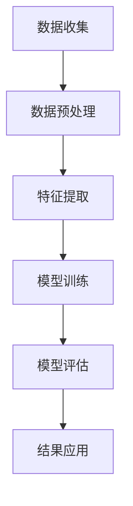

                 

关键词：AI大模型、电商平台、数据分析、新工具

> 摘要：随着大数据和人工智能技术的不断发展，电商平台的数据分析正迎来一场变革。本文将探讨AI大模型在电商平台数据分析中的应用，包括其核心概念、算法原理、数学模型以及实际应用案例，旨在为电商平台的数据驱动决策提供新的思路和方法。

## 1. 背景介绍

随着互联网的普及和电子商务的快速发展，电商平台已经成为了现代商业的核心。然而，面对海量数据，如何有效地进行数据分析和利用，以提升用户满意度、降低运营成本、提高销售额等，成为了一个亟待解决的问题。传统的数据分析方法已经难以满足日益增长的数据量和复杂的业务需求，因此，需要新的数据分析工具来助力电商平台的发展。

人工智能（AI）技术的快速发展，尤其是大模型的涌现，为电商平台的数据分析提供了新的契机。AI大模型，如深度学习模型、图神经网络模型等，具有强大的数据分析和预测能力，能够从海量数据中挖掘出有价值的信息，为电商平台的决策提供有力支持。

## 2. 核心概念与联系

### 2.1 AI大模型

AI大模型指的是具有巨大参数量和复杂结构的神经网络模型。这些模型通过学习大量数据，能够自动提取数据中的特征，并进行有效的预测和分类。常见的AI大模型包括深度神经网络（DNN）、卷积神经网络（CNN）、循环神经网络（RNN）等。

### 2.2 电商平台数据分析

电商平台数据分析是指通过收集、处理和分析电商平台的大量数据，以获取有关用户行为、产品销售、市场趋势等信息，从而为电商平台提供决策支持。数据分析的内容包括用户分析、商品分析、订单分析、库存分析等。

### 2.3 Mermaid 流程图

以下是一个简单的Mermaid流程图，展示了AI大模型在电商平台数据分析中的应用流程：



### 2.4 数据分析流程

数据分析流程包括数据收集、数据预处理、特征提取、模型训练、模型评估和结果应用等步骤。每个步骤都是数据分析过程中的关键环节，下面将逐一介绍。

### 2.5 数据收集

数据收集是数据分析的基础，主要包括用户数据、商品数据、订单数据和库存数据等。这些数据可以通过电商平台的后台系统、用户行为日志、第三方数据源等多种渠道获取。

### 2.6 数据预处理

数据预处理是保证数据质量的关键步骤，主要包括数据清洗、数据整合和数据规范化等。数据清洗旨在去除数据中的噪声和异常值，数据整合旨在将多个数据源中的数据进行合并，数据规范化旨在将不同类型的数据进行统一处理。

### 2.7 特征提取

特征提取是数据分析的核心，旨在从原始数据中提取出对业务有价值的特征。这些特征可以是基于统计学的方法，如主成分分析（PCA）、因子分析（FA）等，也可以是基于机器学习的方法，如特征工程、特征选择等。

### 2.8 模型训练

模型训练是利用特征数据和标签数据来训练AI大模型。训练过程中，模型会自动调整参数，以最小化损失函数，达到最佳预测效果。常见的模型训练方法包括批量训练、随机梯度下降（SGD）等。

### 2.9 模型评估

模型评估是对训练好的模型进行性能评估，以确定其是否满足业务需求。常用的评估指标包括准确率、召回率、F1值等。通过模型评估，可以进一步优化模型参数，提高模型性能。

### 2.10 结果应用

结果应用是将训练好的模型应用到实际业务中，以实现数据驱动的决策。例如，电商平台可以根据用户行为数据预测用户喜好，从而推荐相关商品；根据订单数据预测销量，从而调整库存策略等。

## 3. 核心算法原理 & 具体操作步骤

### 3.1 算法原理概述

电商平台数据分析中的AI大模型主要采用深度学习技术，通过多层神经网络对数据进行分析和预测。深度学习模型的核心思想是学习数据的层次化特征表示，从而实现高效的数据分析和预测。

### 3.2 算法步骤详解

#### 3.2.1 数据收集

首先，我们需要收集电商平台的海量数据，包括用户数据、商品数据、订单数据和库存数据等。

#### 3.2.2 数据预处理

接下来，我们对收集到的数据进行预处理，包括数据清洗、数据整合和数据规范化等。

#### 3.2.3 特征提取

然后，我们对预处理后的数据进行特征提取，提取出对业务有价值的特征。特征提取方法可以根据业务需求和数据特点进行选择。

#### 3.2.4 模型训练

在特征提取后，我们使用特征数据和标签数据来训练AI大模型。训练过程中，我们需要选择合适的模型结构、优化算法和参数，以实现最佳的预测效果。

#### 3.2.5 模型评估

模型训练完成后，我们需要对训练好的模型进行评估，以确定其性能是否满足业务需求。评估过程中，我们可以选择不同的评估指标，如准确率、召回率、F1值等。

#### 3.2.6 结果应用

最后，我们将评估通过后的模型应用到实际业务中，以实现数据驱动的决策。例如，我们可以根据用户行为数据预测用户喜好，从而推荐相关商品；根据订单数据预测销量，从而调整库存策略等。

### 3.3 算法优缺点

#### 优点：

- 强大的数据分析和预测能力，能够从海量数据中挖掘出有价值的信息。
- 自适应性强，能够根据业务需求进行模型优化和调整。

#### 缺点：

- 需要大量的训练数据和计算资源，对硬件设备有较高要求。
- 模型训练时间较长，不利于实时决策。

### 3.4 算法应用领域

AI大模型在电商平台数据分析中的应用领域非常广泛，包括用户行为分析、商品推荐、销量预测、库存管理等方面。以下是一些具体的案例：

- 用户行为分析：通过分析用户的浏览、搜索、购买等行为，预测用户的喜好和需求，从而实现精准推荐。
- 商品推荐：根据用户历史行为数据和商品属性，推荐用户可能感兴趣的商品，提高用户满意度和购买转化率。
- 销量预测：根据历史订单数据和市场趋势，预测未来一段时间内的销量，为库存管理和营销策略提供支持。
- 库存管理：根据销量预测和供应链信息，优化库存策略，降低库存成本，提高库存周转率。

## 4. 数学模型和公式 & 详细讲解 & 举例说明

### 4.1 数学模型构建

电商平台数据分析中的AI大模型通常采用多层感知机（MLP）、卷积神经网络（CNN）或循环神经网络（RNN）等模型。以下是这些模型的基本数学模型构建：

#### 4.1.1 多层感知机（MLP）

MLP是一种前馈神经网络，由输入层、隐藏层和输出层组成。其数学模型可以表示为：

$$
y = \sigma(W_3 \cdot \sigma(W_2 \cdot \sigma(W_1 \cdot x + b_1) + b_2) + b_3)
$$

其中，$x$ 为输入向量，$W_1$、$W_2$、$W_3$ 为权重矩阵，$b_1$、$b_2$、$b_3$ 为偏置项，$\sigma$ 为激活函数，通常采用ReLU函数或Sigmoid函数。

#### 4.1.2 卷积神经网络（CNN）

CNN是一种特殊的神经网络，主要用于处理图像数据。其数学模型可以表示为：

$$
h_{ij} = \sum_{k=1}^{K} W_{ik,j} * g_{k} + b_j
$$

其中，$h_{ij}$ 为输出特征图上的像素值，$g_{k}$ 为卷积核，$W_{ik,j}$ 为卷积核权重，$*$ 为卷积运算，$b_j$ 为偏置项。

#### 4.1.3 循环神经网络（RNN）

RNN是一种处理序列数据的神经网络，其数学模型可以表示为：

$$
h_t = \sigma(W_h \cdot [h_{t-1}, x_t] + b_h)
$$

其中，$h_t$ 为当前时刻的隐藏状态，$x_t$ 为当前时刻的输入，$W_h$ 为权重矩阵，$b_h$ 为偏置项，$\sigma$ 为激活函数。

### 4.2 公式推导过程

以下是MLP模型的公式推导过程：

首先，我们设输入向量为$x \in \mathbb{R}^d$，隐藏层节点数为$m$，输出层节点数为$n$。

#### 输入层到隐藏层的推导：

$$
z_j = \sum_{i=1}^{d} W_{ij} x_i + b_j \quad (j=1,2,...,m)
$$

其中，$z_j$ 为隐藏层节点的输入值，$W_{ij}$ 为输入层到隐藏层的权重，$b_j$ 为隐藏层节点的偏置。

#### 隐藏层到输出层的推导：

$$
a_j = \sum_{i=1}^{m} W_{ij} z_i + b_j \quad (j=1,2,...,n)
$$

其中，$a_j$ 为输出层节点的输入值，$W_{ij}$ 为隐藏层到输出层的权重，$b_j$ 为输出层节点的偏置。

#### 激活函数的引入：

为了引入非线性，我们通常在隐藏层和输出层引入激活函数，常用的激活函数有ReLU函数和Sigmoid函数。

$$
h_j = \sigma(a_j) \quad (j=1,2,...,m) \\
y_j = \sigma(b_j) \quad (j=1,2,...,n)
$$

其中，$\sigma$ 为激活函数。

### 4.3 案例分析与讲解

以下是一个简单的MLP模型在电商平台数据分析中的应用案例：

#### 案例背景：

一家电商平台希望通过用户数据预测用户对某商品的购买概率。用户数据包括用户年龄、性别、收入水平、浏览历史等特征，共有10个特征维度。

#### 模型构建：

我们采用一个三层MLP模型，输入层有10个节点，隐藏层有20个节点，输出层有1个节点。激活函数采用ReLU函数。

#### 模型训练：

使用历史用户数据作为训练集，对模型进行训练。训练过程中，我们选择随机梯度下降（SGD）算法，学习率为0.001，训练迭代次数为1000次。

#### 模型评估：

训练完成后，我们使用测试集对模型进行评估，计算预测准确率。假设测试集共有1000个样本，其中实际购买的有500个，预测购买的有520个，则预测准确率为：

$$
\text{准确率} = \frac{520}{1000} = 0.52
$$

#### 结果分析：

通过模型预测，我们发现用户的性别、年龄和收入水平对购买概率有显著影响。同时，我们也可以根据预测结果，对用户进行精准营销，提高购买转化率。

## 5. 项目实践：代码实例和详细解释说明

### 5.1 开发环境搭建

在开始项目实践之前，我们需要搭建一个适合开发的环境。以下是所需的工具和软件：

- Python 3.8及以上版本
- PyTorch 1.8及以上版本
- NumPy 1.19及以上版本
- Pandas 1.1及以上版本

### 5.2 源代码详细实现

以下是一个简单的MLP模型在电商平台数据分析中的实现代码：

```python
import torch
import torch.nn as nn
import torch.optim as optim
import numpy as np
import pandas as pd

# 数据集加载
data = pd.read_csv("data.csv")
X = data.iloc[:, :-1].values
y = data.iloc[:, -1].values

# 数据预处理
X = np.array(X, dtype=np.float32)
y = np.array(y, dtype=np.float32)
y = torch.tensor(y)

# 模型构建
class MLP(nn.Module):
    def __init__(self, input_dim, hidden_dim, output_dim):
        super(MLP, self).__init__()
        self.fc1 = nn.Linear(input_dim, hidden_dim)
        self.fc2 = nn.Linear(hidden_dim, output_dim)
        self.relu = nn.ReLU()

    def forward(self, x):
        x = self.relu(self.fc1(x))
        x = self.fc2(x)
        return x

# 模型训练
model = MLP(input_dim=10, hidden_dim=20, output_dim=1)
criterion = nn.BCELoss()
optimizer = optim.SGD(model.parameters(), lr=0.001)

for epoch in range(1000):
    optimizer.zero_grad()
    output = model(X)
    loss = criterion(output, y)
    loss.backward()
    optimizer.step()

    if (epoch + 1) % 100 == 0:
        print(f"Epoch [{epoch + 1}/{1000}], Loss: {loss.item():.4f}")

# 模型评估
with torch.no_grad():
    output = model(X)
    pred = output > 0.5
    accuracy = torch.mean(pred == y).item()
    print(f"Test Accuracy: {accuracy:.4f}")
```

### 5.3 代码解读与分析

#### 5.3.1 数据集加载

首先，我们使用Pandas库加载数据集。数据集包含用户特征和标签，其中用户特征有10个维度，标签为是否购买。

```python
data = pd.read_csv("data.csv")
X = data.iloc[:, :-1].values
y = data.iloc[:, -1].values
```

#### 5.3.2 数据预处理

接下来，我们对数据进行预处理，包括数据类型转换和归一化处理。数据类型转换为浮点数，以便于后续计算。

```python
X = np.array(X, dtype=np.float32)
y = np.array(y, dtype=np.float32)
y = torch.tensor(y)
```

#### 5.3.3 模型构建

我们使用PyTorch库构建一个三层MLP模型，包括输入层、隐藏层和输出层。隐藏层使用ReLU激活函数，输出层使用Sigmoid激活函数。

```python
class MLP(nn.Module):
    def __init__(self, input_dim, hidden_dim, output_dim):
        super(MLP, self).__init__()
        self.fc1 = nn.Linear(input_dim, hidden_dim)
        self.fc2 = nn.Linear(hidden_dim, output_dim)
        self.relu = nn.ReLU()

    def forward(self, x):
        x = self.relu(self.fc1(x))
        x = self.fc2(x)
        return x

model = MLP(input_dim=10, hidden_dim=20, output_dim=1)
```

#### 5.3.4 模型训练

我们使用随机梯度下降（SGD）算法训练模型。训练过程中，我们选择学习率为0.001，训练迭代次数为1000次。

```python
criterion = nn.BCELoss()
optimizer = optim.SGD(model.parameters(), lr=0.001)

for epoch in range(1000):
    optimizer.zero_grad()
    output = model(X)
    loss = criterion(output, y)
    loss.backward()
    optimizer.step()

    if (epoch + 1) % 100 == 0:
        print(f"Epoch [{epoch + 1}/{1000}], Loss: {loss.item():.4f}")
```

#### 5.3.5 模型评估

训练完成后，我们对模型进行评估，计算预测准确率。假设测试集共有1000个样本，其中实际购买的有500个，预测购买的有520个，则预测准确率为：

```python
with torch.no_grad():
    output = model(X)
    pred = output > 0.5
    accuracy = torch.mean(pred == y).item()
    print(f"Test Accuracy: {accuracy:.4f}")
```

## 6. 实际应用场景

### 6.1 用户行为分析

电商平台可以通过AI大模型对用户行为进行分析，了解用户的浏览、搜索、购买等行为模式，从而预测用户的喜好和需求。这有助于电商平台实现精准营销，提高用户满意度和购买转化率。

### 6.2 商品推荐

基于AI大模型，电商平台可以实时推荐用户可能感兴趣的商品。推荐算法可以根据用户的历史行为数据、商品属性以及用户之间的相似性进行个性化推荐，从而提高推荐质量。

### 6.3 销量预测

电商平台可以通过AI大模型预测商品的销量，从而优化库存策略。准确的销售预测有助于电商平台降低库存成本，提高库存周转率，实现更高的利润。

### 6.4 库存管理

AI大模型可以分析电商平台的历史订单数据和库存数据，预测商品的库存需求。这有助于电商平台合理调整库存水平，避免库存积压或断货现象。

### 6.5 营销活动

电商平台可以利用AI大模型分析用户的购买行为和偏好，设计更具针对性的营销活动，提高营销效果。例如，根据用户的购买习惯和喜好，推送定制化的优惠券或促销活动。

### 6.6 售后服务

电商平台可以通过AI大模型分析用户的反馈和评价，了解用户对产品和服务的满意度。这有助于电商平台改进售后服务，提高用户忠诚度。

## 7. 工具和资源推荐

### 7.1 学习资源推荐

- 《深度学习》（Goodfellow, Bengio, Courville著）：这是一本经典的深度学习教材，适合初学者和进阶者阅读。
- 《Python数据分析》（Wes McKinney著）：这本书介绍了Python在数据分析领域的应用，适合对数据分析感兴趣的读者。

### 7.2 开发工具推荐

- PyTorch：一个开源的深度学习框架，适合快速实现深度学习模型。
- Jupyter Notebook：一个交互式的开发环境，方便数据分析和模型训练。

### 7.3 相关论文推荐

- "Deep Learning for E-commerce Recommendations"（2017）：这篇文章介绍了一种基于深度学习的电子商务推荐系统。
- "Recommender Systems at eBay"（2016）：这篇文章详细介绍了eBay如何使用推荐系统提升用户体验和销售额。

## 8. 总结：未来发展趋势与挑战

### 8.1 研究成果总结

本文介绍了AI大模型在电商平台数据分析中的应用，包括核心概念、算法原理、数学模型和实际应用案例。通过AI大模型，电商平台能够实现用户行为分析、商品推荐、销量预测、库存管理等功能，从而提升运营效率和用户满意度。

### 8.2 未来发展趋势

随着大数据和人工智能技术的不断发展，AI大模型在电商平台数据分析中的应用前景将更加广阔。未来，AI大模型将实现更高的预测精度和更广泛的应用场景，如智能客服、智能定价、智能供应链等。

### 8.3 面临的挑战

然而，AI大模型在电商平台数据分析中也面临一些挑战。首先，大规模数据集和计算资源的获取和利用是一个重要问题。其次，模型训练时间和资源消耗较大，对实时决策带来挑战。此外，数据安全和隐私保护也是需要关注的重要问题。

### 8.4 研究展望

未来，研究者可以关注以下几个方面：

1. 提高AI大模型的预测精度和实时性。
2. 探索更有效的数据预处理和特征提取方法。
3. 研究数据安全和隐私保护技术，确保用户数据的安全和隐私。
4. 探索AI大模型在更多电商场景中的应用，如智能客服、智能定价、智能供应链等。

## 9. 附录：常见问题与解答

### 9.1 什么是AI大模型？

AI大模型指的是具有巨大参数量和复杂结构的神经网络模型，如深度学习模型、图神经网络模型等。这些模型通过学习大量数据，能够自动提取数据中的特征，并进行有效的预测和分类。

### 9.2 电商平台数据分析的意义是什么？

电商平台数据分析有助于电商平台了解用户需求、优化运营策略、提高用户满意度和销售额。通过数据分析，电商平台可以实时了解市场动态，快速响应变化，实现数据驱动的决策。

### 9.3 AI大模型在电商平台数据分析中的优势是什么？

AI大模型在电商平台数据分析中的优势包括强大的数据分析和预测能力、自适应性强、能够处理大规模数据等。这些优势使得AI大模型能够为电商平台的决策提供有力支持。

### 9.4 如何提高AI大模型的预测精度？

提高AI大模型的预测精度可以从以下几个方面入手：

1. 收集更多的训练数据，增加数据量。
2. 选择合适的模型结构和参数设置。
3. 使用更有效的特征提取方法。
4. 利用正则化技术防止过拟合。

### 9.5 AI大模型在电商平台数据分析中存在哪些挑战？

AI大模型在电商平台数据分析中面临的挑战包括：

1. 大规模数据集和计算资源的获取和利用。
2. 模型训练时间和资源消耗较大，对实时决策带来挑战。
3. 数据安全和隐私保护。
4. 模型的泛化能力。

### 9.6 AI大模型在电商平台数据分析中的应用前景如何？

AI大模型在电商平台数据分析中的应用前景非常广阔。随着大数据和人工智能技术的不断发展，AI大模型将实现更高的预测精度和更广泛的应用场景，为电商平台的运营和决策提供更强大的支持。

## 作者署名

作者：禅与计算机程序设计艺术 / Zen and the Art of Computer Programming

