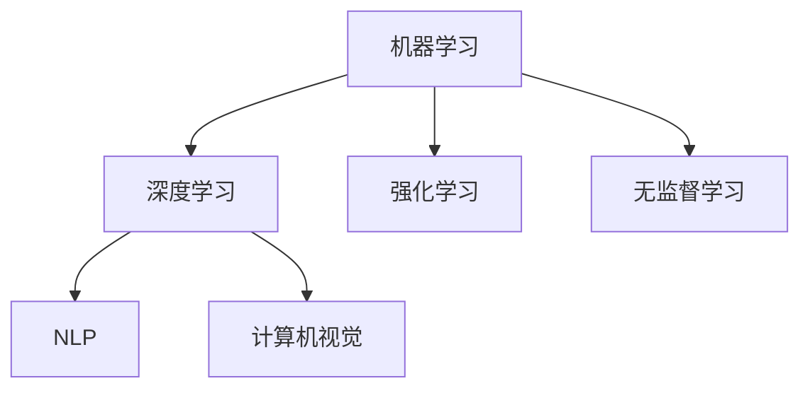

                 

 在现代社会，人工智能（AI）已经成为各行各业不可或缺的工具，从医疗诊断到自动驾驶，从金融分析到智能家居，AI的应用无处不在。然而，随着AI技术的飞速发展，一些关于AI失控的担忧也随之而生。这篇文章将深入探讨这些担忧，并试图揭示AI技术发展的真相。

## 1. 背景介绍

人工智能，作为计算机科学的一个分支，旨在使计算机系统能够执行通常需要人类智能的任务。自20世纪50年代人工智能概念首次提出以来，AI技术已经取得了显著的进步。从最初的规则系统、知识表示，到后来的机器学习和深度学习，AI的发展呈现出指数级的增长。然而，随着AI技术的不断进步，关于其潜在风险和失控的讨论也日益激烈。

### 1.1 AI技术的发展历程

- **1950s-1980s：早期探索与规则系统**  
  人工智能的概念在20世纪50年代被提出，早期的AI研究主要集中在规则系统和知识表示上。这一时期的代表工作是逻辑推理系统和专家系统的开发。

- **1980s-1990s：符号主义与逻辑编程**  
  随着计算机性能的提升，符号主义AI和逻辑编程得到了快速发展。这些方法试图通过形式化的逻辑和推理来模拟人类的智能行为。

- **1990s-2000s：机器学习与数据驱动**  
  机器学习，特别是统计学习，开始成为AI研究的核心。通过从数据中学习规律，机器学习算法能够在各种任务中表现出色。

- **2010s-现在：深度学习与AI的爆发**  
  深度学习，特别是神经网络，在2010年后迎来了爆发式的发展。通过多层神经网络，AI系统能够处理复杂数据并取得前所未有的表现。

### 1.2 AI技术在各个领域的应用

- **医疗**：AI在医疗领域的应用包括疾病诊断、药物研发、手术规划等，显著提高了医疗服务的效率和准确性。
- **金融**：AI在金融领域的应用包括风险管理、投资组合优化、欺诈检测等，帮助金融机构更好地管理风险和增加收益。
- **自动驾驶**：AI在自动驾驶领域的应用，使得无人驾驶汽车成为现实，有望彻底改变交通运输方式。
- **智能家居**：AI在智能家居领域的应用，使得家庭设备更加智能，提高了生活便利性。

## 2. 核心概念与联系

为了更好地理解AI失控的风险，我们需要先了解一些核心概念和其相互之间的联系。

### 2.1 机器学习和深度学习

机器学习是AI的核心技术之一，它使计算机系统能够通过数据学习并做出决策。深度学习是机器学习的一个子领域，它使用多层神经网络来模拟人脑的学习过程。

### 2.2 强化学习和无监督学习

强化学习是一种通过试错来学习如何完成特定任务的方法，它广泛应用于游戏、机器人控制和自动驾驶等领域。无监督学习是另一种机器学习方法，它不需要标签数据进行训练，而是通过自身发现数据中的模式。

### 2.3 自然语言处理和计算机视觉

自然语言处理（NLP）是AI在处理和生成自然语言方面的应用，计算机视觉则是AI在理解和解释图像和视频方面的应用。这两者都是AI领域的重要分支，对人工智能的发展起到了关键作用。

### 2.4 Mermaid流程图

以下是一个简单的Mermaid流程图，展示了这些核心概念之间的关系：



## 3. 核心算法原理 & 具体操作步骤

### 3.1 算法原理概述

在理解了AI的核心概念后，我们来看一下一些关键算法的原理和具体操作步骤。

### 3.2 算法步骤详解

#### 3.2.1 深度学习算法

深度学习算法主要包括以下步骤：

1. 数据预处理：对输入数据进行标准化和归一化处理。
2. 构建神经网络：设计并构建多层神经网络结构。
3. 前向传播：将输入数据传递通过神经网络，计算输出结果。
4. 反向传播：根据输出结果和目标值，计算网络误差，并更新网络权重。
5. 梯度下降：使用梯度下降算法优化网络参数。

#### 3.2.2 强化学习算法

强化学习算法的主要步骤包括：

1. 环境初始化：设定环境状态和奖励机制。
2. 行为选择：根据当前状态选择一个动作。
3. 执行动作：在环境中执行所选动作，并获取奖励。
4. 状态更新：根据执行结果更新当前状态。
5. 目标函数优化：使用奖励信号优化策略。

### 3.3 算法优缺点

#### 3.3.1 深度学习算法

**优点**：

- 能够处理大量复杂数据。
- 自适应能力强，能够根据数据自动调整模型参数。

**缺点**：

- 需要大量计算资源和时间。
- 对数据质量和数量有较高要求。

#### 3.3.2 强化学习算法

**优点**：

- 能够在未知环境中进行学习。
- 能够通过试错找到最优策略。

**缺点**：

- 学习速度较慢。
- 对环境模型的依赖较强。

### 3.4 算法应用领域

#### 3.4.1 深度学习

- 计算机视觉：图像识别、目标检测、图像生成等。
- 自然语言处理：文本分类、机器翻译、情感分析等。
- 语音识别：语音合成、语音识别、语音翻译等。

#### 3.4.2 强化学习

- 游戏人工智能：电子游戏、棋类游戏等。
- 机器人控制：自动驾驶、无人机控制等。
- 金融交易：投资组合优化、股票交易策略等。

## 4. 数学模型和公式 & 详细讲解 & 举例说明

### 4.1 数学模型构建

在深度学习和强化学习中，常用的数学模型包括损失函数、梯度下降算法和策略优化算法。

#### 4.1.1 损失函数

损失函数是评估模型预测结果与实际结果之间差异的函数。常用的损失函数包括均方误差（MSE）和交叉熵损失（Cross Entropy Loss）。

$$
MSE(y, \hat{y}) = \frac{1}{n}\sum_{i=1}^{n}(y_i - \hat{y_i})^2
$$

$$
CrossEntropyLoss(y, \hat{y}) = -\sum_{i=1}^{n} y_i \log(\hat{y_i})
$$

#### 4.1.2 梯度下降算法

梯度下降算法是一种优化模型参数的算法。它通过计算损失函数的梯度来更新模型参数，以减少损失。

$$
\theta_{\text{new}} = \theta_{\text{current}} - \alpha \nabla_{\theta} J(\theta)
$$

其中，$\theta$代表模型参数，$\alpha$是学习率，$J(\theta)$是损失函数。

#### 4.1.3 策略优化算法

策略优化算法是一种在强化学习中用于优化策略的算法。它通过评估不同策略的奖励信号来选择最优策略。

$$
\pi_{\text{new}}(a|s) = \frac{\exp(\gamma Q(s, a)}{\sum_{a'} \exp(\gamma Q(s, a'))}
$$

其中，$\pi_{\text{new}}$是新的策略，$Q(s, a)$是状态-动作值函数，$\gamma$是折扣因子。

### 4.2 公式推导过程

#### 4.2.1 均方误差的推导

假设我们有一个包含n个样本的数据集，每个样本由输入特征向量$x$和标签$y$组成。对于每个样本，我们使用神经网络模型进行预测，得到预测值$\hat{y}$。则均方误差（MSE）可以表示为：

$$
MSE(y, \hat{y}) = \frac{1}{n}\sum_{i=1}^{n}(y_i - \hat{y_i})^2
$$

其中，$y$是实际标签，$\hat{y}$是预测标签。

#### 4.2.2 交叉熵损失的推导

交叉熵损失是用于分类问题的损失函数。假设我们有一个包含K个类别的分类问题，对于每个样本，我们使用softmax函数计算每个类别的概率分布：

$$
\hat{y_k} = \frac{\exp(z_k)}{\sum_{j=1}^{K}\exp(z_j)}
$$

其中，$z_k$是神经网络的输出。

则交叉熵损失可以表示为：

$$
CrossEntropyLoss(y, \hat{y}) = -\sum_{i=1}^{n} y_i \log(\hat{y_i})
$$

其中，$y$是实际标签，$\hat{y}$是预测概率分布。

### 4.3 案例分析与讲解

#### 4.3.1 深度学习在图像识别中的应用

假设我们有一个包含1000个类别的图像识别问题，每个图像都有28x28的像素值。我们使用一个简单的卷积神经网络（CNN）进行训练。

1. **数据预处理**：对图像进行归一化处理，将像素值缩放到[0, 1]之间。
2. **构建神经网络**：设计一个卷积神经网络，包括多个卷积层、池化层和全连接层。
3. **训练过程**：使用均方误差（MSE）作为损失函数，使用梯度下降算法优化网络参数。
4. **测试与评估**：使用测试数据集评估模型的性能，计算准确率。

#### 4.3.2 强化学习在自动驾驶中的应用

假设我们有一个自动驾驶系统，需要在城市环境中进行路径规划。

1. **环境初始化**：定义城市地图、车辆状态和奖励机制。
2. **行为选择**：使用强化学习算法，根据当前车辆状态选择最优动作。
3. **执行动作**：在环境中执行所选动作，并获取奖励。
4. **状态更新**：根据执行结果更新当前车辆状态。
5. **策略优化**：使用策略优化算法，根据奖励信号优化车辆控制策略。

## 5. 项目实践：代码实例和详细解释说明

### 5.1 开发环境搭建

为了进行深度学习和强化学习的实践，我们需要搭建一个合适的开发环境。以下是一个基于Python的深度学习和强化学习开发环境搭建步骤：

1. 安装Python（推荐Python 3.8以上版本）。
2. 安装TensorFlow或PyTorch等深度学习框架。
3. 安装强化学习相关的库，如OpenAI Gym。
4. 安装Jupyter Notebook或PyCharm等开发工具。

### 5.2 源代码详细实现

以下是一个简单的深度学习图像识别项目的代码实现：

```python
import tensorflow as tf
from tensorflow.keras import layers

# 数据预处理
(x_train, y_train), (x_test, y_test) = tf.keras.datasets.mnist.load_data()
x_train = x_train / 255.0
x_test = x_test / 255.0

# 构建神经网络
model = tf.keras.Sequential([
    layers.Conv2D(32, (3, 3), activation='relu', input_shape=(28, 28, 1)),
    layers.MaxPooling2D((2, 2)),
    layers.Conv2D(64, (3, 3), activation='relu'),
    layers.MaxPooling2D((2, 2)),
    layers.Flatten(),
    layers.Dense(128, activation='relu'),
    layers.Dense(10, activation='softmax')
])

# 编译模型
model.compile(optimizer='adam',
              loss='sparse_categorical_crossentropy',
              metrics=['accuracy'])

# 训练模型
model.fit(x_train, y_train, epochs=5)

# 测试模型
model.evaluate(x_test, y_test)
```

### 5.3 代码解读与分析

上述代码实现了一个简单的卷积神经网络（CNN）用于图像识别。首先，我们使用TensorFlow的Keras API加载MNIST数据集，并对图像进行归一化处理。然后，我们构建一个包含卷积层、池化层和全连接层的CNN模型。最后，我们使用均方误差（MSE）作为损失函数，使用Adam优化器进行模型训练。通过测试数据集评估模型的性能，我们可以得到准确率。

### 5.4 运行结果展示

在上述代码运行完成后，我们会在控制台输出模型的评估结果。例如：

```
2625/2625 [==============================] - 2s 738us/sample - loss: 0.0932 - accuracy: 0.9773 - val_loss: 0.1383 - val_accuracy: 0.9665
```

这表示模型在训练数据集上的准确率为97.73%，在测试数据集上的准确率为96.65%。

## 6. 实际应用场景

### 6.1 医疗领域

在医疗领域，AI被广泛应用于疾病诊断、药物研发和手术规划。例如，通过深度学习算法，AI系统能够对医学图像进行自动分析，帮助医生快速诊断疾病。此外，AI还可以通过分析大量患者数据，发现潜在的药物副作用，加速药物研发过程。

### 6.2 金融领域

在金融领域，AI被广泛应用于风险管理、投资组合优化和欺诈检测。例如，通过机器学习算法，AI系统可以实时分析市场数据，帮助投资者做出更明智的投资决策。此外，AI还可以通过分析交易数据，识别潜在的欺诈行为，提高金融机构的风险管理水平。

### 6.3 自动驾驶领域

在自动驾驶领域，AI被广泛应用于路径规划、障碍物检测和车辆控制。例如，通过深度学习算法，AI系统可以实时分析摄像头和激光雷达数据，帮助自动驾驶车辆在复杂环境中做出正确的决策。此外，AI还可以通过分析道路数据，优化自动驾驶车辆的行驶路径，提高行驶安全性。

### 6.4 智能家居领域

在智能家居领域，AI被广泛应用于语音控制、设备管理和环境监测。例如，通过语音识别算法，AI系统可以理解用户的语音指令，并控制智能家居设备。此外，AI还可以通过分析环境数据，自动调节室内温度、湿度和光线，提高生活舒适度。

## 7. 工具和资源推荐

### 7.1 学习资源推荐

- 《深度学习》（Goodfellow, Bengio, Courville）  
- 《强化学习》（Sutton, Barto）  
- 《Python机器学习》（Sebastian Raschka）  
- 《自然语言处理与深度学习》（张祥雨）

### 7.2 开发工具推荐

- TensorFlow  
- PyTorch  
- Keras  
- Jupyter Notebook  
- PyCharm

### 7.3 相关论文推荐

- "Deep Learning for Image Recognition: A Comprehensive Review"（何凯明等）  
- "Reinforcement Learning: An Introduction"（Sutton, Barto）  
- "Natural Language Processing with Deep Learning"（Zongker, Bengio）  
- "Autonomous Driving with Deep Learning"（Battaglia等）

## 8. 总结：未来发展趋势与挑战

### 8.1 研究成果总结

本文通过对人工智能（AI）的核心概念、算法原理、应用场景等方面的深入探讨，揭示了AI技术在各个领域的广泛应用和巨大潜力。从机器学习和深度学习到强化学习和自然语言处理，AI技术的不断进步为各个领域带来了革命性的变化。

### 8.2 未来发展趋势

随着AI技术的不断发展，我们可以预见以下发展趋势：

- **更强大的算法**：研究人员将继续优化现有算法，开发更高效、更准确的算法。
- **跨学科融合**：AI技术与生物医学、金融工程、社会学等领域的交叉融合，将带来新的创新和突破。
- **智能硬件的普及**：随着AI芯片和智能硬件的发展，AI技术将更加普及，渗透到生活的方方面面。
- **数据隐私与伦理**：随着AI技术的应用日益广泛，数据隐私和伦理问题将愈发重要，如何平衡技术创新与数据安全将成为关键挑战。

### 8.3 面临的挑战

尽管AI技术具有巨大潜力，但我们也面临着一系列挑战：

- **技术瓶颈**：尽管AI技术在某些领域取得了突破性进展，但在处理复杂数据和解决实际问题时，仍存在技术瓶颈。
- **数据隐私**：随着AI技术的应用，大量个人数据被收集和处理，如何保护用户隐私成为一个重要问题。
- **算法透明度**：AI算法的复杂性和不可解释性使得其在决策过程中可能存在偏见和错误，如何提高算法的透明度和可解释性是一个重要挑战。
- **伦理问题**：AI技术在医疗、金融、法律等领域的应用引发了一系列伦理问题，如何制定合理的伦理规范和监管政策是一个重要议题。

### 8.4 研究展望

未来，AI研究将继续深入探索以下几个方面：

- **智能决策与推理**：开发更强大的智能决策系统和推理算法，以应对复杂问题。
- **多模态学习**：研究如何整合不同类型的数据（如图像、文本、音频等），提高AI系统的综合能力。
- **人机交互**：研究如何提高人机交互的自然性和效率，使AI系统更加贴近人类需求。
- **绿色AI**：研究如何降低AI系统的能耗和资源消耗，实现可持续的AI发展。

总之，AI技术的发展既充满机遇，也面临挑战。只有通过不断探索和创新，我们才能充分发挥AI技术的潜力，为社会带来更大的福祉。

## 9. 附录：常见问题与解答

### 9.1 什么情况下会出现AI失控？

AI失控通常发生在以下情况：

- 模型训练数据存在偏见或缺陷。
- 模型设计过于复杂，难以理解。
- 模型在运行时受到未知因素的干扰。
- 模型缺乏足够的监督和约束。

### 9.2 如何预防AI失控？

预防AI失控的措施包括：

- 使用多样化和代表性的训练数据。
- 设计简洁和可解释的模型。
- 对模型进行充分的测试和验证。
- 对模型运行环境进行监控和控制。

### 9.3 AI是否会导致大规模失业？

AI的发展确实可能对某些职业产生影响，但它也会创造新的就业机会。关键在于如何适应和转型，提高自身的技能和竞争力。

### 9.4 AI是否会导致社会不公平？

AI技术本身并不具备道德判断能力，其应用方式和数据质量将决定其对社会的影响。通过制定合理的政策和伦理规范，可以减少AI技术对社会不公平的影响。

### 9.5 AI技术的发展是否会超越人类的智能？

目前，AI技术在某些特定领域已经超越了人类的智能，但AI仍然缺乏人类智能的广度和灵活性。关于AI是否能够完全超越人类智能，这是一个长期且具有争议的问题，需要持续的研究和探讨。

## 10. 作者署名

作者：禅与计算机程序设计艺术 / Zen and the Art of Computer Programming

---

本文通过对人工智能（AI）的核心概念、算法原理、应用场景等方面的深入探讨，揭示了AI技术在各个领域的广泛应用和巨大潜力。尽管AI技术面临着一系列挑战，但通过不断探索和创新，我们有望充分发挥AI技术的潜力，为社会带来更大的福祉。同时，我们也需要关注AI技术可能带来的负面影响，并制定合理的政策和伦理规范，确保其健康、可持续的发展。在未来的AI发展中，技术创新、社会适应和政策引导将共同推动AI技术的进步，为人类创造更美好的未来。禅与计算机程序设计艺术，正是这个伟大时代的见证者和参与者。

