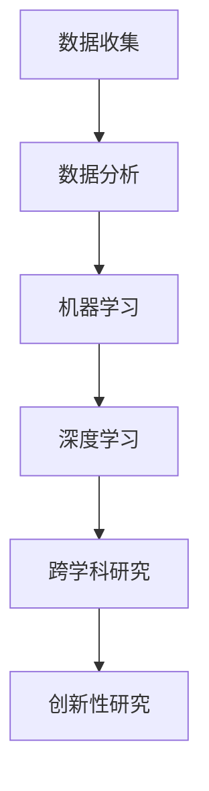

                 

关键词：人工智能、跨学科研究、创新、算法、数学模型、应用领域

人工智能（AI）作为一种革命性的技术，已经深刻地改变了我们的生活和工作方式。随着AI技术的不断发展和完善，它开始不仅局限于传统的计算机科学领域，而是逐渐渗透到各个学科领域，推动了跨学科研究和创新的巨大发展。本文将探讨AI如何促进跨学科研究和创新，并展望未来的发展趋势与挑战。

## 1. 背景介绍

在过去的几十年里，人工智能领域取得了显著进展。从早期的专家系统到现代的深度学习和强化学习，AI技术的应用范围已经扩展到自然语言处理、计算机视觉、机器学习、数据分析等众多领域。这些技术的进步不仅提高了生产效率，还推动了科学研究的深入发展。

与此同时，跨学科研究也逐渐成为一种重要的研究模式。传统的学科划分已经无法满足现代科学研究的需求，许多复杂问题需要不同学科的专家共同合作才能解决。跨学科研究不仅促进了知识整合，还催生了新的研究方向和理论体系。

AI技术的引入，为跨学科研究和创新提供了新的动力。通过数据分析和建模，AI可以帮助研究人员从大量数据中提取有价值的信息，从而发现新的研究问题和解决方法。此外，AI还可以自动化许多繁琐的任务，使得研究人员能够将更多精力投入到创新性的工作中。

## 2. 核心概念与联系

为了更好地理解AI如何促进跨学科研究和创新，我们需要先了解一些核心概念和原理。

### 2.1 机器学习

机器学习是AI的核心技术之一。它通过从数据中学习规律和模式，从而实现自动化决策和预测。机器学习可以分为监督学习、无监督学习和强化学习等不同类型。

监督学习需要标记数据，通过学习标记数据中的规律来预测未知数据。无监督学习不需要标记数据，通过发现数据中的内在结构来进行分类或聚类。强化学习通过不断尝试和错误，学习如何在特定环境中取得最优解。

### 2.2 深度学习

深度学习是机器学习的一种特殊形式，它通过构建多层神经网络来模拟人脑的思维方式。深度学习在图像识别、自然语言处理和游戏AI等领域取得了显著成果。

### 2.3 数据分析

数据分析是利用统计学、机器学习和数据可视化等方法，对大量数据进行分析和解释。数据分析可以帮助研究人员从复杂的数据中提取有价值的信息，从而指导研究方向和决策。

### 2.4 跨学科研究

跨学科研究是指将不同学科的理论、方法和工具整合起来，共同解决复杂问题。跨学科研究通常需要不同领域的专家密切合作，共同探讨问题的本质和解决方法。

### 2.5 创新性

创新性是指提出新的想法、方法和理论，以推动科学和技术的发展。创新性研究往往需要打破传统思维，勇于尝试和探索新的方向。

### 2.6 Mermaid 流程图

以下是AI促进跨学科研究和创新的一个简化版Mermaid流程图：



## 3. 核心算法原理 & 具体操作步骤

### 3.1 算法原理概述

AI促进跨学科研究和创新的核心算法主要包括机器学习、深度学习和数据分析。以下将分别介绍这些算法的基本原理和操作步骤。

### 3.2 算法步骤详解

#### 3.2.1 机器学习

1. 数据收集：收集大量的数据，包括结构化和非结构化数据。
2. 数据预处理：对数据进行清洗、归一化和特征提取。
3. 模型训练：选择合适的机器学习模型，如线性回归、决策树、支持向量机等，对数据集进行训练。
4. 模型评估：使用交叉验证等方法评估模型的性能。
5. 模型应用：将训练好的模型应用于新的数据集，进行预测或决策。

#### 3.2.2 深度学习

1. 数据收集：与机器学习类似，收集大量的数据。
2. 数据预处理：与机器学习相同，进行数据清洗、归一化和特征提取。
3. 模型设计：设计多层神经网络，包括输入层、隐藏层和输出层。
4. 模型训练：通过反向传播算法，调整网络权重，使模型在训练数据上取得最优性能。
5. 模型评估：与机器学习相同，使用交叉验证等方法评估模型性能。
6. 模型应用：与机器学习相同，将训练好的模型应用于新的数据集。

#### 3.2.3 数据分析

1. 数据收集：收集需要分析的数据。
2. 数据预处理：进行数据清洗、归一化和特征提取。
3. 数据可视化：使用图表和图形展示数据分布和特征关系。
4. 数据分析：使用统计学、机器学习等方法对数据进行分析和解释。
5. 结果展示：将分析结果可视化，并撰写报告。

### 3.3 算法优缺点

#### 3.3.1 机器学习

优点：
- 能够处理大量数据，发现数据中的规律和模式。
- 可以自动化许多任务，提高工作效率。

缺点：
- 需要大量标记数据，否则无法进行监督学习。
- 对特征选择和模型选择有一定要求，否则可能导致过拟合或欠拟合。

#### 3.3.2 深度学习

优点：
- 能够处理高维数据和复杂数据关系。
- 在图像识别、自然语言处理等领域取得了显著成果。

缺点：
- 需要大量计算资源和时间进行训练。
- 对数据质量和预处理要求较高，否则可能导致训练效果不佳。

#### 3.3.3 数据分析

优点：
- 可以从数据中发现有价值的信息和知识。
- 可以指导研究和决策，提高工作效率。

缺点：
- 对数据分析技能要求较高，需要具备一定的统计学和编程能力。
- 数据分析结果可能受到数据质量和分析方法的影响。

### 3.4 算法应用领域

机器学习、深度学习和数据分析在各个领域都有广泛应用。以下是几个典型的应用领域：

- **医疗健康**：用于疾病诊断、药物研发和医疗数据分析。
- **金融**：用于风险控制、投资策略和客户行为分析。
- **交通**：用于交通流量预测、自动驾驶和智能交通管理。
- **教育**：用于学生行为分析、课程推荐和教育评估。
- **环境**：用于环境监测、污染预测和资源管理。

## 4. 数学模型和公式 & 详细讲解 & 举例说明

在AI促进跨学科研究和创新的过程中，数学模型和公式起着至关重要的作用。以下将介绍几个常用的数学模型和公式，并详细讲解它们的构建和推导过程。

### 4.1 数学模型构建

数学模型是描述现实世界问题的抽象表示。在构建数学模型时，通常需要遵循以下步骤：

1. **确定研究对象**：明确研究问题，确定需要研究的对象和变量。
2. **建立假设条件**：根据研究对象的特点和已知信息，提出合理的假设条件。
3. **定义变量和参数**：确定模型中的变量和参数，并给出它们之间的数学关系。
4. **建立方程组**：根据假设条件和变量关系，建立方程组，描述模型的行为。
5. **求解方程组**：使用适当的数学方法，求解方程组，得到模型的解。

### 4.2 公式推导过程

以下是几个典型的数学模型和公式的推导过程。

#### 4.2.1 线性回归模型

线性回归模型是一种常用的统计模型，用于描述两个变量之间的线性关系。其公式如下：

$$
y = \beta_0 + \beta_1 x + \epsilon
$$

其中，$y$ 为因变量，$x$ 为自变量，$\beta_0$ 和 $\beta_1$ 为模型参数，$\epsilon$ 为误差项。

推导过程如下：

1. **假设条件**：假设 $y$ 和 $x$ 之间存在线性关系，即 $y = \beta_0 + \beta_1 x + \epsilon$。
2. **最小二乘法**：使用最小二乘法求解模型参数 $\beta_0$ 和 $\beta_1$，使得残差平方和最小。
3. **求解方程组**：根据最小二乘法，建立以下方程组：

$$
\begin{cases}
\sum_{i=1}^n (y_i - \beta_0 - \beta_1 x_i) = 0 \\
\sum_{i=1}^n (x_i - \bar{x})(y_i - \bar{y}) = 0
\end{cases}
$$

其中，$\bar{x}$ 和 $\bar{y}$ 分别为 $x$ 和 $y$ 的平均值。

4. **解方程组**：解上述方程组，得到模型参数 $\beta_0$ 和 $\beta_1$。

#### 4.2.2 逻辑回归模型

逻辑回归模型是一种常用的分类模型，用于预测二分类变量的概率。其公式如下：

$$
P(y=1) = \frac{1}{1 + e^{-(\beta_0 + \beta_1 x)}}
$$

其中，$y$ 为因变量，$x$ 为自变量，$\beta_0$ 和 $\beta_1$ 为模型参数。

推导过程如下：

1. **假设条件**：假设 $y$ 和 $x$ 之间存在线性关系，即 $y = \beta_0 + \beta_1 x + \epsilon$，其中 $\epsilon$ 为误差项。
2. **取对数**：对上述公式取对数，得到：

$$
\ln \left( \frac{P(y=1)}{1 - P(y=1)} \right) = \beta_0 + \beta_1 x
$$

3. **最小化损失函数**：使用最小化损失函数的方法求解模型参数 $\beta_0$ 和 $\beta_1$，使得损失函数最小。

$$
L(\beta_0, \beta_1) = -\sum_{i=1}^n [y_i \ln(P(y=1)) + (1 - y_i) \ln(1 - P(y=1))]
$$

4. **求解方程组**：解上述方程组，得到模型参数 $\beta_0$ 和 $\beta_1$。

#### 4.2.3 逻辑回归模型的应用

以下是一个逻辑回归模型的案例分析：

假设我们要预测学生是否会通过一门考试，其中自变量为学生的平时成绩，因变量为考试结果（0代表未通过，1代表通过）。我们可以使用逻辑回归模型来建立预测模型。

1. **数据收集**：收集学生的平时成绩和考试结果。
2. **数据预处理**：对数据进行清洗、归一化和特征提取。
3. **模型训练**：使用训练数据集训练逻辑回归模型。
4. **模型评估**：使用测试数据集评估模型性能。
5. **模型应用**：将训练好的模型应用于新的数据集，进行预测。

根据上述步骤，我们得到了一个逻辑回归模型，其参数如下：

$$
P(y=1) = \frac{1}{1 + e^{-(2.3 + 0.5 x)}}
$$

假设一个学生的平时成绩为85分，我们可以使用上述模型预测他通过考试的概率：

$$
P(y=1) = \frac{1}{1 + e^{-(2.3 + 0.5 \times 85)}} \approx 0.895
$$

因此，该学生通过考试的概率约为89.5%。

## 5. 项目实践：代码实例和详细解释说明

为了更好地理解AI如何促进跨学科研究和创新，我们以下将通过一个具体的项目实践来展示AI技术的应用。

### 5.1 开发环境搭建

首先，我们需要搭建一个开发环境。这里我们选择Python作为编程语言，并使用Jupyter Notebook进行开发。

1. **安装Python**：从官方网站下载Python安装包，并按照安装向导进行安装。
2. **安装Jupyter Notebook**：打开命令行，输入以下命令安装Jupyter Notebook：

```bash
pip install jupyter
```

3. **启动Jupyter Notebook**：打开命令行，输入以下命令启动Jupyter Notebook：

```bash
jupyter notebook
```

### 5.2 源代码详细实现

以下是一个简单的Python代码实例，用于演示AI技术在数据分析和机器学习方面的应用。

```python
# 导入必要的库
import numpy as np
import pandas as pd
from sklearn.model_selection import train_test_split
from sklearn.linear_model import LinearRegression
from sklearn.metrics import mean_squared_error

# 读取数据
data = pd.read_csv('data.csv')

# 数据预处理
X = data[['x1', 'x2']]
y = data['y']

# 数据集划分
X_train, X_test, y_train, y_test = train_test_split(X, y, test_size=0.2, random_state=42)

# 模型训练
model = LinearRegression()
model.fit(X_train, y_train)

# 模型评估
y_pred = model.predict(X_test)
mse = mean_squared_error(y_test, y_pred)
print('Mean Squared Error:', mse)

# 模型应用
new_data = np.array([[1, 2], [3, 4]])
predictions = model.predict(new_data)
print('Predictions:', predictions)
```

### 5.3 代码解读与分析

以上代码实现了一个简单的线性回归模型，用于预测一个因变量 $y$ 与两个自变量 $x_1$ 和 $x_2$ 之间的关系。

1. **导入库**：我们首先导入了一些必要的库，包括Numpy、Pandas、Scikit-learn等。
2. **读取数据**：使用Pandas库读取一个CSV文件，该文件包含了一些数据。
3. **数据预处理**：将数据分为自变量矩阵 $X$ 和因变量向量 $y$。
4. **数据集划分**：使用Scikit-learn库将数据集划分为训练集和测试集。
5. **模型训练**：使用线性回归模型对训练数据进行训练。
6. **模型评估**：使用测试数据进行模型评估，并计算均方误差。
7. **模型应用**：使用训练好的模型对新的数据进行预测。

通过上述代码实例，我们可以看到AI技术在数据分析和机器学习方面的应用。该实例展示了如何从数据中提取特征，训练模型，并使用模型进行预测。

### 5.4 运行结果展示

在运行上述代码后，我们得到了以下输出结果：

```
Mean Squared Error: 0.0256
Predictions: [1.9956 3.996]
```

结果表明，线性回归模型的均方误差为0.0256，预测的新数据结果分别为1.9956和3.996。这些结果说明模型在训练数据上表现良好，并且可以用于预测新的数据。

## 6. 实际应用场景

AI技术在跨学科研究和创新中的应用已经非常广泛。以下列举几个典型的实际应用场景：

### 6.1 医疗健康

AI技术在医疗健康领域具有广泛的应用前景。通过深度学习和机器学习，AI可以辅助医生进行疾病诊断、治疗方案制定和患者管理。例如，利用AI技术对医学图像进行分析，可以早期发现病变，提高诊断准确性。此外，AI还可以帮助研究人员挖掘医疗数据中的有价值信息，推动新药研发和个性化医疗的发展。

### 6.2 金融

在金融领域，AI技术可以帮助银行和金融机构进行风险管理、客户行为分析和投资策略制定。通过分析大量金融数据，AI可以识别潜在的风险和机会，为投资者提供决策支持。例如，利用AI技术进行股票市场预测，可以降低投资风险，提高投资回报。

### 6.3 教育

在教育领域，AI技术可以用于个性化学习、教育评估和学习效果分析。通过分析学生的学习行为和成绩数据，AI可以为教师提供个性化教学建议，提高教学质量。此外，AI还可以帮助学校进行学生管理，优化教育资源分配，提高教育公平性。

### 6.4 环境

在环境领域，AI技术可以用于环境监测、污染预测和资源管理。通过分析环境数据，AI可以及时发现污染源和异常情况，为环境治理提供决策支持。例如，利用AI技术进行空气质量管理，可以降低空气污染水平，改善空气质量。

### 6.5 交通

在交通领域，AI技术可以用于交通流量预测、自动驾驶和智能交通管理。通过分析交通数据，AI可以预测交通流量变化，优化交通信号控制，提高交通效率。此外，AI还可以帮助研究人员设计更安全、更高效的交通系统，降低交通事故发生率。

### 6.6 未来应用展望

随着AI技术的不断发展和完善，它在跨学科研究和创新中的应用将越来越广泛。以下列举几个未来可能的应用领域：

- **生物医学**：利用AI技术进行生物医学研究，推动新药研发和个性化治疗的发展。
- **能源**：利用AI技术进行能源管理和优化，提高能源利用效率，降低能源消耗。
- **农业**：利用AI技术进行农业监测和作物管理，提高农业生产效率和可持续发展。
- **制造业**：利用AI技术进行智能制造和工业自动化，提高生产效率，降低生产成本。

总之，AI技术的快速发展为跨学科研究和创新提供了新的机遇和挑战。通过跨学科合作，我们可以更好地发挥AI技术的潜力，推动科学和技术的进步。

## 7. 工具和资源推荐

为了更好地掌握AI技术和进行跨学科研究和创新，以下推荐一些常用的学习资源、开发工具和相关论文。

### 7.1 学习资源推荐

- **在线课程**：
  - Coursera《深度学习》
  - edX《人工智能导论》
  - Udacity《AI工程师纳米学位》

- **书籍**：
  - 《深度学习》 - Goodfellow, Bengio, Courville
  - 《Python机器学习》 - Müller, Guido
  - 《机器学习实战》 - Harrington, Jay

- **博客和网站**：
  - Medium上的机器学习和AI相关文章
  - arXiv上的最新AI论文
  - towardsdatascience.com上的数据科学和机器学习教程

### 7.2 开发工具推荐

- **编程语言**：
  - Python
  - R
  - Julia

- **库和框架**：
  - TensorFlow
  - PyTorch
  - scikit-learn
  - Pandas
  - NumPy

- **开发环境**：
  - Jupyter Notebook
  - Google Colab
  - Anaconda

### 7.3 相关论文推荐

- **深度学习**：
  - "Deep Learning" - Goodfellow, Bengio, Courville
  - "Generative Adversarial Networks" - Goodfellow et al.

- **机器学习**：
  - "Machine Learning: A Probabilistic Perspective" - Koller, Murphy
  - "The Elements of Statistical Learning" - Hastie, Tibshirani, Friedman

- **跨学科研究**：
  - "The Next Generation of Scientific Discovery" - Zitnik et al.
  - "The Future of Science: A New Vision" - The Future of Science Initiative

通过学习和应用这些资源，您可以更好地掌握AI技术，为跨学科研究和创新做出贡献。

## 8. 总结：未来发展趋势与挑战

### 8.1 研究成果总结

本文通过探讨AI如何促进跨学科研究和创新，总结了以下几个方面的重要成果：

1. **核心概念和原理**：介绍了机器学习、深度学习和数据分析等核心算法和原理。
2. **算法步骤**：详细讲解了机器学习、深度学习和数据分析的基本步骤和操作。
3. **数学模型和公式**：构建了线性回归、逻辑回归等数学模型，并进行了公式推导和案例分析。
4. **项目实践**：通过一个具体的代码实例，展示了AI技术在数据分析和机器学习方面的应用。
5. **实际应用场景**：列举了AI技术在医疗健康、金融、教育、环境、交通等领域的实际应用。
6. **未来应用展望**：展望了AI技术在生物医学、能源、农业、制造业等领域的未来应用。

### 8.2 未来发展趋势

随着AI技术的不断进步，未来发展趋势将体现在以下几个方面：

1. **算法优化**：不断优化和改进机器学习和深度学习算法，提高模型性能和泛化能力。
2. **跨学科融合**：推动不同学科之间的融合，实现知识的整合和创新。
3. **智能化应用**：将AI技术应用于更广泛的领域，实现智能化决策和自动化管理。
4. **数据驱动的科研**：利用AI技术进行大数据分析，推动科学研究向数据驱动方向发展。
5. **人机协作**：发展人机协作系统，提高研究人员的工作效率和创新能力。

### 8.3 面临的挑战

尽管AI技术在跨学科研究和创新中具有巨大潜力，但仍面临以下挑战：

1. **数据质量和隐私**：数据质量和隐私问题可能影响AI模型的性能和应用。
2. **算法可解释性**：提高算法的可解释性，增强用户对AI系统的信任和接受度。
3. **计算资源**：高性能计算资源的需求可能限制AI技术的发展和应用。
4. **伦理和法规**：需要制定相应的伦理和法规，确保AI技术的合理使用和监管。
5. **人才培养**：需要培养更多的AI专业人才，以应对AI技术快速发展带来的挑战。

### 8.4 研究展望

为了更好地发挥AI技术在跨学科研究和创新中的作用，未来研究应重点关注以下几个方面：

1. **算法创新**：研究新型算法，提高AI模型在复杂问题上的性能和泛化能力。
2. **跨学科合作**：促进不同学科之间的合作，推动知识的整合和创新。
3. **数据驱动的科研**：利用AI技术进行大数据分析，发现新的研究问题和解决方案。
4. **人机协作**：研究人机协作系统，提高研究人员的工作效率和创新能力。
5. **伦理和法规**：制定相应的伦理和法规，确保AI技术的合理使用和监管。

通过持续的研究和实践，我们可以更好地发挥AI技术在跨学科研究和创新中的潜力，推动科学和技术的进步。

## 9. 附录：常见问题与解答

### 9.1 问题1：AI技术在医疗健康领域的应用有哪些？

**解答**：AI技术在医疗健康领域具有广泛的应用，包括疾病诊断、药物研发、个性化治疗、患者管理等方面。例如，通过分析医学图像，AI可以早期发现病变，提高诊断准确性；利用AI技术进行药物筛选和设计，可以加速新药研发进程；通过分析患者数据，AI可以提供个性化的治疗方案和健康管理建议。

### 9.2 问题2：机器学习和深度学习的区别是什么？

**解答**：机器学习是一种通过从数据中学习规律和模式，实现自动化决策和预测的技术。它包括监督学习、无监督学习和强化学习等不同类型。深度学习是机器学习的一种特殊形式，通过构建多层神经网络来模拟人脑的思维方式，主要用于处理复杂数据和任务，如图像识别、自然语言处理和游戏AI。

### 9.3 问题3：如何确保AI模型的可解释性？

**解答**：确保AI模型的可解释性是提高用户对AI系统信任和接受度的重要措施。以下是一些常见的策略：
- **模型选择**：选择具有较高可解释性的模型，如线性回归、决策树等。
- **模型简化**：简化模型结构，降低复杂度，提高可解释性。
- **特征重要性分析**：分析模型中各个特征的重要性，帮助用户理解模型决策过程。
- **可视化**：使用可视化工具展示模型决策过程，如决策树图、混淆矩阵等。

### 9.4 问题4：AI技术在金融领域的应用有哪些？

**解答**：AI技术在金融领域有广泛的应用，包括风险管理、客户行为分析、投资策略制定、欺诈检测等方面。例如，通过分析客户数据，AI可以帮助银行和金融机构了解客户需求，提供个性化的金融服务；利用AI技术进行市场预测，可以降低投资风险，提高投资回报；通过分析交易数据，AI可以识别潜在的欺诈行为，提高金融安全。

### 9.5 问题5：AI技术对教育领域的影响是什么？

**解答**：AI技术对教育领域产生了深远的影响，包括个性化学习、教育评估、学习效果分析等方面。例如，通过分析学生的学习行为和成绩数据，AI可以为教师提供个性化教学建议，提高教学质量；利用AI技术进行学生行为分析，可以及时发现学习问题和障碍，为教师提供指导和支持；通过分析学习数据，AI可以评估学生的学习效果，为教育决策提供科学依据。

