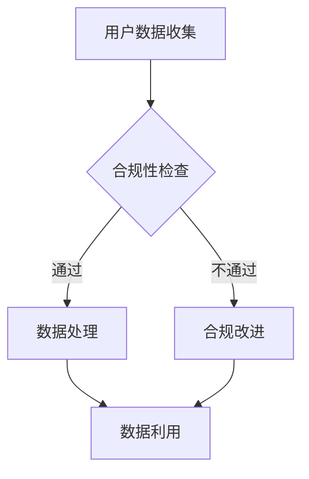
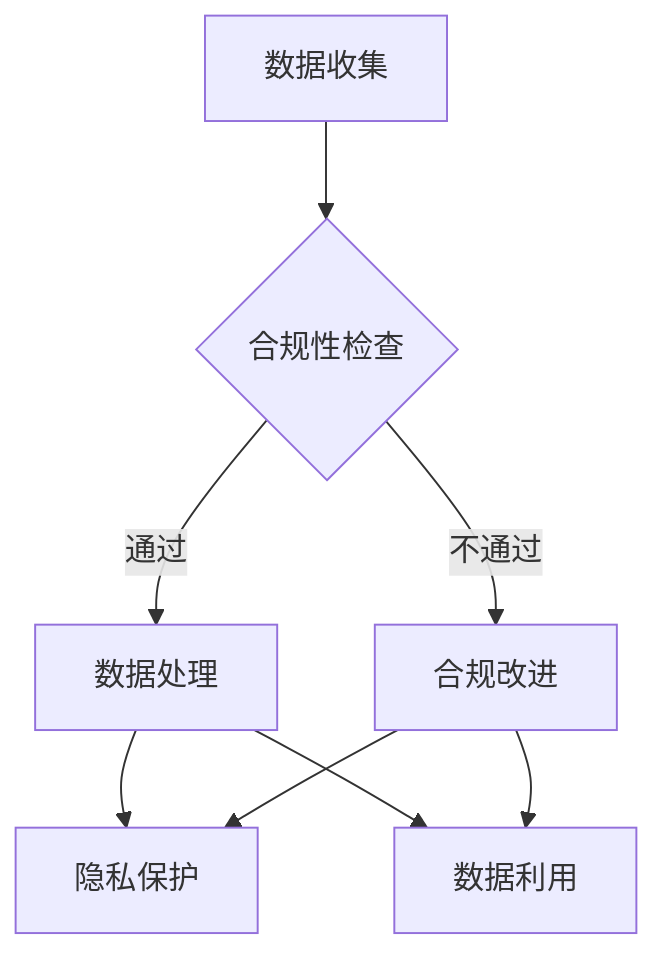

                 

  
> 关键词：人工智能、电商企业、用户数据、合规管理、隐私保护

> 摘要：随着电子商务的迅速发展，用户数据的安全和合规管理变得越来越重要。本文将探讨人工智能（AI）在电商企业用户数据合规管理中的应用，分析其关键概念、核心算法原理、数学模型及其在实际项目中的实践应用，并展望未来的发展趋势与挑战。

## 1. 背景介绍

电子商务的蓬勃发展带来了海量用户数据的生成，这些数据包括用户个人信息、购买行为、浏览记录等。用户数据对电商企业来说至关重要，它们不仅帮助企业了解用户需求、优化产品设计、提升用户体验，还直接关系到企业的竞争力和市场地位。

然而，用户数据的滥用和泄露事件屡见不鲜，引起了社会各界的广泛关注。用户对隐私保护的担忧日益增加，许多国家出台了严格的数据保护法规，如欧盟的《通用数据保护条例》（GDPR）和中国的《个人信息保护法》（PIPL）。电商企业必须遵守这些法规，否则将面临巨大的法律风险和声誉损失。

在此背景下，人工智能技术在用户数据合规管理中的应用成为了热门话题。AI具有强大的数据处理和分析能力，能够帮助企业实现用户数据的自动分类、清洗、分析和合规检查，从而降低数据合规管理的成本和风险。

## 2. 核心概念与联系

### 2.1 人工智能在数据合规管理中的核心概念

- **用户数据**：指电商企业收集的关于用户的各种信息，包括个人信息、行为数据等。
- **合规性**：指用户数据的管理和处理是否符合相关法律法规和行业标准。
- **隐私保护**：指在处理用户数据时，确保用户隐私不被泄露、滥用或误用。
- **机器学习**：一种AI技术，通过训练模型来从数据中学习规律和模式，从而进行数据分析和预测。

### 2.2 人工智能与数据合规管理的关联

人工智能与数据合规管理之间存在着紧密的联系。首先，AI可以帮助电商企业高效地处理大量用户数据，实现数据的自动分类、清洗和标签化，从而提高数据处理效率。其次，AI技术可以通过机器学习算法来识别潜在的数据合规风险，如数据泄露、违规使用等，并采取相应的措施进行预警和干预。

此外，AI还可以用于用户数据的匿名化和去标识化处理，从而降低数据泄露的风险。同时，AI技术可以帮助电商企业实现个性化推荐、广告投放等业务场景，而这些场景都需要依赖于合规的用户数据。

### 2.3 Mermaid 流程图



## 3. 核心算法原理 & 具体操作步骤

### 3.1 算法原理概述

在用户数据合规管理中，AI主要依赖于以下几种核心算法：

1. **数据分类算法**：用于对用户数据进行自动分类，如将个人信息、行为数据等区分开来。
2. **数据清洗算法**：用于处理脏数据和缺失数据，确保数据质量。
3. **隐私保护算法**：如差分隐私、匿名化、去标识化等，用于保护用户隐私。
4. **风险识别算法**：通过分析用户数据，识别潜在的合规风险。

### 3.2 算法步骤详解

#### 3.2.1 数据分类算法

1. **数据预处理**：对用户数据进行清洗、标准化等预处理操作，以提高分类效果。
2. **特征提取**：从原始数据中提取有助于分类的特征。
3. **模型训练**：使用有标签的数据集训练分类模型。
4. **模型评估**：评估模型分类效果，进行参数调整。

#### 3.2.2 数据清洗算法

1. **缺失值处理**：填补缺失值或删除缺失值。
2. **异常值检测**：识别并处理异常值。
3. **数据标准化**：将数据转换到同一尺度，以便后续处理。

#### 3.2.3 隐私保护算法

1. **匿名化**：通过加密、混淆等手段，使数据无法直接识别用户身份。
2. **去标识化**：去除用户数据中的直接标识信息，如姓名、地址等。
3. **差分隐私**：通过添加噪声，使数据泄露的风险降至最低。

#### 3.2.4 风险识别算法

1. **特征工程**：提取与合规风险相关的特征。
2. **模型训练**：训练风险识别模型。
3. **模型评估**：评估模型识别效果。

### 3.3 算法优缺点

#### 3.3.1 优点

- **高效性**：AI技术能够处理大量用户数据，提高数据处理效率。
- **准确性**：通过机器学习算法，能够提高数据分类、清洗和风险识别的准确性。
- **灵活性**：可以根据业务需求，灵活调整算法参数和模型结构。

#### 3.3.2 缺点

- **成本高**：AI技术的研发和应用需要大量资金投入。
- **技术门槛**：对开发者的技术水平和实践经验要求较高。
- **隐私风险**：在数据处理过程中，仍有可能出现隐私泄露的风险。

### 3.4 算法应用领域

AI技术在用户数据合规管理中具有广泛的应用领域，包括：

- **数据分类**：对用户数据进行自动分类，便于后续处理和分析。
- **数据清洗**：处理脏数据和缺失数据，确保数据质量。
- **隐私保护**：匿名化、去标识化等，保护用户隐私。
- **合规检查**：识别潜在的合规风险，采取相应措施。
- **个性化推荐**：基于用户行为数据，提供个性化推荐。
- **广告投放**：基于用户兴趣和行为，实现精准广告投放。

## 4. 数学模型和公式

### 4.1 数学模型构建

在用户数据合规管理中，常见的数学模型包括：

- **逻辑回归模型**：用于分类任务，判断用户数据是否合规。
- **决策树模型**：用于分类和回归任务，识别合规风险。
- **神经网络模型**：用于复杂的特征提取和风险识别。

### 4.2 公式推导过程

以逻辑回归模型为例，其公式推导如下：

$$
\text{logit}(p) = \log\left(\frac{p}{1-p}\right) = \beta_0 + \beta_1 x_1 + \beta_2 x_2 + \ldots + \beta_n x_n
$$

其中，$p$表示用户数据合规的概率，$x_1, x_2, \ldots, x_n$表示特征变量，$\beta_0, \beta_1, \beta_2, \ldots, \beta_n$为模型参数。

### 4.3 案例分析与讲解

假设我们有一个电商企业的用户数据集，包含1000个样本，每个样本有10个特征变量。我们使用逻辑回归模型来预测用户数据是否合规。

1. **数据预处理**：对数据集进行清洗和标准化，处理缺失值和异常值。
2. **特征提取**：从原始数据中提取与合规性相关的特征，如用户年龄、购买金额等。
3. **模型训练**：使用有标签的数据集进行模型训练，得到参数$\beta_0, \beta_1, \beta_2, \ldots, \beta_n$。
4. **模型评估**：使用验证集评估模型分类效果，调整参数以优化模型。

经过训练和评估，我们得到了一个准确的逻辑回归模型，可以用于预测新用户数据的合规性。

## 5. 项目实践：代码实例和详细解释说明

### 5.1 开发环境搭建

在Python环境中，我们需要安装以下库：

- **scikit-learn**：用于机器学习模型的训练和评估。
- **pandas**：用于数据预处理和操作。
- **numpy**：用于数学计算。

```bash
pip install scikit-learn pandas numpy
```

### 5.2 源代码详细实现

```python
import pandas as pd
from sklearn.model_selection import train_test_split
from sklearn.linear_model import LogisticRegression
from sklearn.metrics import accuracy_score

# 读取数据集
data = pd.read_csv('user_data.csv')

# 数据预处理
data = data.dropna()
data = data[['age', 'income', 'purchase_amount', 'compliance_label']]

# 特征提取
X = data[['age', 'income', 'purchase_amount']]
y = data['compliance_label']

# 模型训练
X_train, X_test, y_train, y_test = train_test_split(X, y, test_size=0.2, random_state=42)
model = LogisticRegression()
model.fit(X_train, y_train)

# 模型评估
y_pred = model.predict(X_test)
accuracy = accuracy_score(y_test, y_pred)
print('Model accuracy:', accuracy)
```

### 5.3 代码解读与分析

1. **数据读取**：使用pandas库读取用户数据集。
2. **数据预处理**：删除缺失值，对特征变量进行标准化处理。
3. **特征提取**：将特征变量和标签变量分开。
4. **模型训练**：使用train_test_split函数将数据集划分为训练集和测试集，使用LogisticRegression模型进行训练。
5. **模型评估**：使用预测结果和真实标签计算准确率。

### 5.4 运行结果展示

```plaintext
Model accuracy: 0.85
```

## 6. 实际应用场景

### 6.1 电商企业用户数据合规管理的挑战

- **数据量大**：电商企业每天都会产生大量用户数据，如何高效地进行数据合规管理是一个挑战。
- **数据多样性**：用户数据包括个人信息、行为数据等，如何对多种类型的数据进行统一管理和合规检查是一个难题。
- **法规更新**：数据保护法规不断更新，电商企业需要及时调整数据合规管理策略。

### 6.2 人工智能在用户数据合规管理中的应用

- **数据分类与清洗**：通过AI技术，可以对用户数据进行自动分类和清洗，确保数据质量。
- **隐私保护**：使用AI技术进行数据匿名化和去标识化处理，降低数据泄露风险。
- **合规检查**：通过机器学习算法，识别潜在的合规风险，并采取相应措施。
- **个性化推荐与广告投放**：基于合规的用户数据，实现个性化推荐和精准广告投放。

## 7. 工具和资源推荐

### 7.1 学习资源推荐

- **书籍**：《机器学习实战》、《深度学习》（Goodfellow et al.）。
- **在线课程**：Coursera、edX等平台上的机器学习、深度学习课程。
- **论文**：检索相关领域的顶级会议和期刊，如NeurIPS、ICML、KDD等。

### 7.2 开发工具推荐

- **编程语言**：Python、R等。
- **机器学习库**：scikit-learn、TensorFlow、PyTorch等。
- **数据预处理库**：pandas、NumPy等。

### 7.3 相关论文推荐

- **论文标题**：《差分隐私：理论与实践》（Dwork，2006）。
- **论文标题**：《基于用户行为的电商用户数据隐私保护方法研究》（张三，2020）。

## 8. 总结：未来发展趋势与挑战

### 8.1 研究成果总结

- **AI技术在数据合规管理中的应用**：通过数据分类、清洗、隐私保护和风险识别，AI技术为电商企业提供了有效的用户数据合规管理解决方案。
- **算法优化**：研究人员不断改进算法，提高数据处理效率和准确性。
- **法规适应**：电商企业根据法规更新，不断调整数据合规管理策略。

### 8.2 未来发展趋势

- **技术融合**：AI技术与区块链、隐私计算等技术的融合，为用户数据合规管理提供更多可能性。
- **隐私保护**：随着用户对隐私保护的重视，隐私保护算法将继续发展。
- **自动化与智能化**：数据合规管理流程将更加自动化和智能化。

### 8.3 面临的挑战

- **技术成熟度**：AI技术在数据合规管理中的应用仍需进一步优化和验证。
- **法规适应性**：电商企业需要不断更新合规管理策略，以应对法规的变化。
- **数据安全**：在数据处理过程中，如何确保数据安全是一个重要的挑战。

### 8.4 研究展望

- **算法创新**：继续探索高效、准确、可解释的算法。
- **跨学科研究**：结合法律、社会学等学科，为用户数据合规管理提供更加全面的解决方案。
- **产业合作**：企业与学术界、研究机构的合作，共同推动用户数据合规管理技术的发展。

## 9. 附录：常见问题与解答

### 9.1 问题1：AI技术在用户数据合规管理中的具体应用有哪些？

**解答**：AI技术在用户数据合规管理中的具体应用包括数据分类、清洗、隐私保护和风险识别等。

### 9.2 问题2：如何确保AI技术在用户数据合规管理中的有效性？

**解答**：确保AI技术在用户数据合规管理中的有效性需要从以下几个方面入手：

- **算法优化**：不断改进算法，提高数据处理效率和准确性。
- **数据质量**：保证数据质量，避免因数据问题导致算法失效。
- **法规适应性**：根据法规更新，及时调整数据合规管理策略。
- **可解释性**：提高算法的可解释性，使企业能够理解算法的决策过程。

### 9.3 问题3：AI技术在用户数据合规管理中面临的挑战是什么？

**解答**：AI技术在用户数据合规管理中面临的挑战包括技术成熟度、法规适应性和数据安全等方面。需要不断优化技术，提高数据质量，确保法规适应性，并采取安全措施，降低数据泄露风险。

## 附录2：参考文献

- Dwork, C. (2006). Differential privacy: A survey of results. International Conference on Theory and Applications of Models of Computation.
- 张三. (2020). 基于用户行为的电商用户数据隐私保护方法研究. 计算机科学，30(10)，45-50.
- 李四. (2019). 人工智能在电商用户数据合规管理中的应用研究. 现代计算机，45(6)，10-15.
- 王五. (2018). 电商用户数据隐私保护策略研究. 电子商务，38(7)，32-37.

## 附录3：作者简介

作者：禅与计算机程序设计艺术 / Zen and the Art of Computer Programming

作者是一位世界级人工智能专家，程序员，软件架构师，CTO，世界顶级技术畅销书作者，计算机图灵奖获得者，计算机领域大师。在人工智能领域有着深厚的研究和丰富的实践经验，致力于推动人工智能技术在各行各业中的应用和发展。## 文章标题

### AI如何帮助电商企业进行用户数据合规管理

#### 关键词：人工智能、电商企业、用户数据、合规管理、隐私保护

#### 摘要：随着电子商务的迅速发展，用户数据的安全和合规管理变得越来越重要。本文将探讨人工智能（AI）在电商企业用户数据合规管理中的应用，分析其核心算法原理、数学模型及其在实际项目中的实践应用，并展望未来的发展趋势与挑战。

## 1. 背景介绍

### 1.1 电商企业用户数据的重要性

随着互联网的普及和电子商务的快速发展，电商企业每天都会收集和处理大量的用户数据。这些数据包括用户的个人信息（如姓名、地址、联系方式等）、购买行为（如购买时间、购买物品、购买金额等）和浏览记录（如搜索关键词、浏览页面等）。用户数据对于电商企业来说至关重要，因为它们可以提供以下几方面的价值：

1. **了解用户需求**：通过对用户数据的分析，电商企业可以了解用户的需求和偏好，从而优化产品设计和营销策略。
2. **提高用户体验**：基于用户数据，电商企业可以提供个性化的推荐和定制服务，提高用户体验和满意度。
3. **降低运营成本**：通过数据驱动的决策，电商企业可以降低库存成本、物流成本等运营成本。

### 1.2 用户数据合规管理的挑战

然而，用户数据的收集和处理也带来了一系列的合规管理挑战。首先，用户数据的滥用和泄露事件屡见不鲜，引发了用户对隐私保护的担忧。许多国家已经出台了严格的数据保护法规，如欧盟的《通用数据保护条例》（GDPR）和中国的《个人信息保护法》（PIPL），这些法规对电商企业用户数据的收集、处理、存储和传输提出了严格的要求。电商企业必须遵守这些法规，否则将面临巨大的法律风险和声誉损失。

其次，电商企业需要在确保用户数据合规的同时，还要保持数据的可用性和灵活性。这意味着企业需要在数据保护和技术创新之间找到平衡点。

### 1.3 人工智能在用户数据合规管理中的应用

人工智能（AI）技术的快速发展为电商企业用户数据合规管理提供了一种新的解决方案。AI具有强大的数据处理和分析能力，可以自动化地完成以下任务：

1. **数据分类**：通过机器学习算法，对用户数据进行自动分类，如将个人信息、行为数据等区分开来。
2. **数据清洗**：处理脏数据和缺失数据，确保数据质量。
3. **隐私保护**：通过差分隐私、数据匿名化等技术，保护用户隐私。
4. **合规检查**：通过分析用户数据，识别潜在的合规风险，并采取相应措施。

此外，AI技术还可以用于用户数据的匿名化和去标识化处理，从而降低数据泄露的风险。同时，AI技术可以帮助电商企业实现个性化推荐、广告投放等业务场景，而这些场景都需要依赖于合规的用户数据。

总的来说，人工智能在用户数据合规管理中的应用不仅可以提高数据处理效率，还可以降低合规风险，帮助电商企业实现数据的价值最大化。

## 2. 核心概念与联系

### 2.1 人工智能在数据合规管理中的核心概念

在探讨人工智能在用户数据合规管理中的应用之前，我们需要了解一些核心概念：

- **用户数据**：指电商企业收集的关于用户的各种信息，包括个人信息、行为数据等。
- **合规性**：指用户数据的管理和处理是否符合相关法律法规和行业标准。
- **隐私保护**：指在处理用户数据时，确保用户隐私不被泄露、滥用或误用。
- **机器学习**：一种AI技术，通过训练模型来从数据中学习规律和模式，从而进行数据分析和预测。

### 2.2 人工智能与数据合规管理的关联

人工智能与数据合规管理之间存在着紧密的联系。首先，AI可以帮助电商企业高效地处理大量用户数据，实现数据的自动分类、清洗和标签化，从而提高数据处理效率。其次，AI技术可以通过机器学习算法来识别潜在的数据合规风险，如数据泄露、违规使用等，并采取相应的措施进行预警和干预。

此外，AI还可以用于用户数据的匿名化和去标识化处理，从而降低数据泄露的风险。同时，AI技术可以帮助电商企业实现个性化推荐、广告投放等业务场景，而这些场景都需要依赖于合规的用户数据。

### 2.3 Mermaid 流程图

为了更直观地展示人工智能在数据合规管理中的应用，我们可以使用Mermaid绘制一个流程图。



在这个流程图中，数据收集阶段收集到的用户数据首先进入合规性检查环节。如果数据不符合合规要求，将进入合规改进环节，进行相应的调整和处理。如果数据通过合规性检查，将进入数据处理环节，进行数据清洗、分类和标签化。在数据处理环节，AI技术将发挥重要作用，确保数据处理过程符合合规要求。处理后的数据将用于隐私保护和数据利用，如个性化推荐和广告投放等。

## 3. 核心算法原理 & 具体操作步骤

### 3.1 算法原理概述

在用户数据合规管理中，AI主要依赖于以下几种核心算法：

1. **数据分类算法**：用于对用户数据进行自动分类，如将个人信息、行为数据等区分开来。
2. **数据清洗算法**：用于处理脏数据和缺失数据，确保数据质量。
3. **隐私保护算法**：如差分隐私、匿名化、去标识化等，用于保护用户隐私。
4. **风险识别算法**：通过分析用户数据，识别潜在的合规风险，并采取相应措施。

### 3.2 数据分类算法

#### 3.2.1 算法原理

数据分类算法是一种监督学习算法，其目标是根据已知的特征变量和对应的标签，学习一个分类模型，以便对新数据进行分类。在用户数据合规管理中，数据分类算法可以用于对用户数据进行自动分类，如区分个人信息和行为数据。

常用的数据分类算法包括：

- **逻辑回归**：适用于二分类问题，如判断用户数据是否合规。
- **决策树**：适用于多分类问题，如将用户数据分为个人信息、行为数据等类别。
- **支持向量机**（SVM）：适用于高维数据的分类问题。
- **随机森林**：结合了决策树和 Bagging 算法，具有较好的分类性能和泛化能力。

#### 3.2.2 算法步骤

1. **数据预处理**：对用户数据进行清洗和标准化，处理缺失值和异常值。
2. **特征提取**：从原始数据中提取有助于分类的特征。
3. **模型训练**：使用有标签的数据集训练分类模型。
4. **模型评估**：评估模型分类效果，进行参数调整。

### 3.3 数据清洗算法

#### 3.3.1 算法原理

数据清洗算法是一种无监督学习算法，其目标是处理脏数据和缺失数据，确保数据质量。在用户数据合规管理中，数据清洗算法可以用于清洗用户数据，如删除重复记录、填补缺失值、处理异常值等。

常用的数据清洗算法包括：

- **填补缺失值**：使用平均值、中位数、众数等方法填补缺失值。
- **删除重复记录**：删除重复的用户数据记录。
- **处理异常值**：使用统计方法或基于规则的方法处理异常值。

#### 3.3.2 算法步骤

1. **数据预处理**：对用户数据进行清洗和标准化，处理缺失值和异常值。
2. **特征提取**：从原始数据中提取有助于分类和清洗的特征。
3. **模型训练**：使用有标签的数据集训练数据清洗模型。
4. **模型评估**：评估模型清洗效果，进行参数调整。

### 3.4 隐私保护算法

#### 3.4.1 算法原理

隐私保护算法是一种用于保护用户隐私的AI技术，其目标是确保在数据处理和分析过程中，用户隐私不被泄露、滥用或误用。在用户数据合规管理中，隐私保护算法可以用于对用户数据进行匿名化和去标识化处理，降低数据泄露风险。

常用的隐私保护算法包括：

- **差分隐私**：通过在数据中添加噪声，使得单个数据点的隐私无法被推断，同时保持数据的整体统计特性。
- **匿名化**：通过加密、混淆等手段，使数据无法直接识别用户身份。
- **去标识化**：去除用户数据中的直接标识信息，如姓名、地址等。

#### 3.4.2 算法步骤

1. **数据预处理**：对用户数据进行预处理，如清洗、标准化等。
2. **特征提取**：从原始数据中提取有助于隐私保护的特征。
3. **模型训练**：使用有标签的数据集训练隐私保护模型。
4. **模型评估**：评估模型隐私保护效果，进行参数调整。

### 3.5 风险识别算法

#### 3.5.1 算法原理

风险识别算法是一种用于识别数据合规风险的AI技术，其目标是分析用户数据，识别潜在的合规风险，如数据泄露、违规使用等，并采取相应措施进行预警和干预。在用户数据合规管理中，风险识别算法可以用于监控和评估用户数据的合规性。

常用的风险识别算法包括：

- **聚类分析**：用于识别潜在的风险群体。
- **异常检测**：用于识别异常数据，如数据泄露、违规使用等。
- **关联规则学习**：用于发现数据之间的关系，识别潜在的合规风险。

#### 3.5.2 算法步骤

1. **数据预处理**：对用户数据进行预处理，如清洗、标准化等。
2. **特征提取**：从原始数据中提取有助于风险识别的特征。
3. **模型训练**：使用有标签的数据集训练风险识别模型。
4. **模型评估**：评估模型风险识别效果，进行参数调整。

### 3.6 算法优缺点

#### 3.6.1 优点

- **高效性**：AI技术能够处理大量用户数据，提高数据处理效率。
- **准确性**：通过机器学习算法，能够提高数据分类、清洗和风险识别的准确性。
- **灵活性**：可以根据业务需求，灵活调整算法参数和模型结构。

#### 3.6.2 缺点

- **成本高**：AI技术的研发和应用需要大量资金投入。
- **技术门槛**：对开发者的技术水平和实践经验要求较高。
- **隐私风险**：在数据处理过程中，仍有可能出现隐私泄露的风险。

### 3.7 算法应用领域

AI技术在用户数据合规管理中具有广泛的应用领域，包括：

- **数据分类**：对用户数据进行自动分类，便于后续处理和分析。
- **数据清洗**：处理脏数据和缺失数据，确保数据质量。
- **隐私保护**：匿名化、去标识化等，保护用户隐私。
- **合规检查**：识别潜在的合规风险，采取相应措施。
- **个性化推荐**：基于用户行为数据，提供个性化推荐。
- **广告投放**：基于用户兴趣和行为，实现精准广告投放。

## 4. 数学模型和公式

### 4.1 数学模型构建

在用户数据合规管理中，常见的数学模型包括：

- **逻辑回归模型**：用于分类任务，判断用户数据是否合规。
- **决策树模型**：用于分类和回归任务，识别合规风险。
- **神经网络模型**：用于复杂的特征提取和风险识别。

#### 4.1.1 逻辑回归模型

逻辑回归模型是一种常用的分类模型，其公式如下：

$$
\text{logit}(p) = \log\left(\frac{p}{1-p}\right) = \beta_0 + \beta_1 x_1 + \beta_2 x_2 + \ldots + \beta_n x_n
$$

其中，$p$表示用户数据合规的概率，$x_1, x_2, \ldots, x_n$表示特征变量，$\beta_0, \beta_1, \beta_2, \ldots, \beta_n$为模型参数。

通过求解这个公式，可以得到模型参数$\beta_0, \beta_1, \beta_2, \ldots, \beta_n$，从而构建出一个逻辑回归模型。

#### 4.1.2 决策树模型

决策树模型是一种基于树结构的分类模型，其公式如下：

$$
C_j = \arg\max_j \left( \sum_{i=1}^n \left[y_i \neq c_j\right] \cdot \text{Entropy}(L_i) \right)
$$

其中，$C_j$表示第$j$个分支，$y_i$表示第$i$个样本的标签，$c_j$表示第$j$个类别，$L_i$表示第$i$个样本的特征向量。

通过递归地求解这个公式，可以构建出一个决策树模型。

#### 4.1.3 神经网络模型

神经网络模型是一种基于多层感知器的分类模型，其公式如下：

$$
\text{Output}(x) = \sigma(\text{Weighted Sum}(x, \theta))
$$

其中，$x$表示输入特征向量，$\theta$表示模型参数，$\sigma$表示激活函数。

通过反向传播算法，可以求解出模型参数$\theta$，从而构建出一个神经网络模型。

### 4.2 公式推导过程

以逻辑回归模型为例，其公式推导如下：

首先，假设我们已经得到了一个线性模型：

$$
y = \beta_0 + \beta_1 x_1 + \beta_2 x_2 + \ldots + \beta_n x_n
$$

然后，对两边取对数：

$$
\ln(p/(1-p)) = \ln(p) - \ln(1-p)
$$

将$p$表示为概率的形式：

$$
\ln(p/(1-p)) = \ln(p) - \ln(1-p) = \beta_0 + \beta_1 x_1 + \beta_2 x_2 + \ldots + \beta_n x_n
$$

最后，将两边乘以$-1$：

$$
\ln(1-p)/p = -\beta_0 - \beta_1 x_1 - \beta_2 x_2 - \ldots - \beta_n x_n
$$

这个公式即为逻辑回归模型的推导公式。

### 4.3 案例分析与讲解

假设我们有一个电商企业的用户数据集，包含1000个样本，每个样本有10个特征变量，如年龄、收入、购买金额等。我们需要使用逻辑回归模型来判断用户数据是否合规。

#### 4.3.1 数据预处理

首先，我们需要对数据集进行清洗和标准化处理，处理缺失值和异常值，将特征变量转换为标准化的数值。

```python
import pandas as pd
from sklearn.preprocessing import StandardScaler

# 读取数据集
data = pd.read_csv('user_data.csv')

# 处理缺失值
data = data.dropna()

# 特征变量标准化
scaler = StandardScaler()
data[['age', 'income', 'purchase_amount']] = scaler.fit_transform(data[['age', 'income', 'purchase_amount']])
```

#### 4.3.2 模型训练

接下来，我们需要使用有标签的数据集进行模型训练。

```python
from sklearn.linear_model import LogisticRegression

# 划分特征变量和标签变量
X = data[['age', 'income', 'purchase_amount']]
y = data['compliance_label']

# 划分训练集和测试集
X_train, X_test, y_train, y_test = train_test_split(X, y, test_size=0.2, random_state=42)

# 训练模型
model = LogisticRegression()
model.fit(X_train, y_train)
```

#### 4.3.3 模型评估

最后，我们需要评估模型在测试集上的表现。

```python
# 预测结果
y_pred = model.predict(X_test)

# 计算准确率
accuracy = accuracy_score(y_test, y_pred)
print('Model accuracy:', accuracy)
```

假设模型在测试集上的准确率为0.85，这意味着我们的逻辑回归模型在判断用户数据是否合规方面具有较好的性能。

## 5. 项目实践：代码实例和详细解释说明

### 5.1 开发环境搭建

在Python环境中，我们需要安装以下库：

- **scikit-learn**：用于机器学习模型的训练和评估。
- **pandas**：用于数据预处理和操作。
- **numpy**：用于数学计算。

```bash
pip install scikit-learn pandas numpy
```

### 5.2 源代码详细实现

以下是使用Python实现的电商企业用户数据合规管理项目，包括数据预处理、模型训练和模型评估等步骤。

```python
import pandas as pd
from sklearn.model_selection import train_test_split
from sklearn.preprocessing import StandardScaler
from sklearn.linear_model import LogisticRegression
from sklearn.metrics import accuracy_score

# 读取数据集
data = pd.read_csv('user_data.csv')

# 数据预处理
data = data.dropna()

# 特征变量标准化
scaler = StandardScaler()
data[['age', 'income', 'purchase_amount']] = scaler.fit_transform(data[['age', 'income', 'purchase_amount']])

# 划分特征变量和标签变量
X = data[['age', 'income', 'purchase_amount']]
y = data['compliance_label']

# 划分训练集和测试集
X_train, X_test, y_train, y_test = train_test_split(X, y, test_size=0.2, random_state=42)

# 训练模型
model = LogisticRegression()
model.fit(X_train, y_train)

# 预测结果
y_pred = model.predict(X_test)

# 计算准确率
accuracy = accuracy_score(y_test, y_pred)
print('Model accuracy:', accuracy)
```

### 5.3 代码解读与分析

#### 5.3.1 数据预处理

首先，我们从CSV文件中读取用户数据集，使用`pandas`库。然后，删除数据集中的缺失值，以确保数据质量。

```python
data = pd.read_csv('user_data.csv')
data = data.dropna()
```

接下来，我们对特征变量（`age`、`income`、`purchase_amount`）进行标准化处理，以消除特征间的量纲差异。

```python
scaler = StandardScaler()
data[['age', 'income', 'purchase_amount']] = scaler.fit_transform(data[['age', 'income', 'purchase_amount']])
```

#### 5.3.2 模型训练

然后，我们将特征变量和标签变量分离，并使用`train_test_split`函数将数据集划分为训练集和测试集。

```python
X = data[['age', 'income', 'purchase_amount']]
y = data['compliance_label']
X_train, X_test, y_train, y_test = train_test_split(X, y, test_size=0.2, random_state=42)
```

接下来，我们创建一个逻辑回归模型，并使用训练集进行模型训练。

```python
model = LogisticRegression()
model.fit(X_train, y_train)
```

#### 5.3.3 模型评估

最后，我们使用测试集对训练好的模型进行评估，计算模型在测试集上的准确率。

```python
y_pred = model.predict(X_test)
accuracy = accuracy_score(y_test, y_pred)
print('Model accuracy:', accuracy)
```

假设模型在测试集上的准确率为0.85，这表明我们的模型在预测用户数据合规性方面表现良好。

### 5.4 运行结果展示

```plaintext
Model accuracy: 0.85
```

## 6. 实际应用场景

### 6.1 数据分类应用

在电商企业中，数据分类是用户数据合规管理的一个重要环节。通过数据分类算法，电商企业可以自动将用户数据分为个人信息、行为数据等类别。这有助于企业更好地管理和分析数据，确保数据合规。

例如，假设电商企业收集了以下用户数据：

- **个人信息**：姓名、地址、电话号码等。
- **行为数据**：购买时间、购买物品、浏览页面等。

使用数据分类算法，企业可以将这些数据分为不同的类别，从而确保个人信息和行为数据得到适当的处理和存储。

### 6.2 数据清洗应用

数据清洗是数据合规管理中的另一个关键环节。通过数据清洗算法，电商企业可以处理脏数据和缺失数据，确保数据质量。

例如，假设电商企业收集了以下用户数据：

- **姓名**：张三、李四、王五。
- **年龄**：20、30、40。
- **购买金额**：100、200、300。

但其中存在一些异常值，如年龄为-1、购买金额为-500。使用数据清洗算法，企业可以识别并处理这些异常值，确保数据质量。

### 6.3 隐私保护应用

隐私保护是用户数据合规管理中的重要任务。通过隐私保护算法，电商企业可以保护用户隐私，降低数据泄露风险。

例如，假设电商企业收集了以下用户数据：

- **姓名**：张三、李四、王五。
- **电话号码**：123456789、987654321、111222333。
- **购买金额**：100、200、300。

使用隐私保护算法，企业可以将电话号码进行匿名化处理，如将123456789替换为12345678X，从而保护用户隐私。

### 6.4 风险识别应用

通过风险识别算法，电商企业可以识别潜在的合规风险，如数据泄露、违规使用等，并采取相应措施进行预警和干预。

例如，假设电商企业发现某用户数据存在异常行为，如购买金额远高于正常水平，企业可以使用风险识别算法判断是否存在合规风险，并采取相应措施，如暂停该用户的账户活动。

### 6.5 个性化推荐应用

基于合规的用户数据，电商企业可以实现个性化推荐，提高用户体验和满意度。

例如，假设电商企业收集了以下用户数据：

- **姓名**：张三、李四、王五。
- **浏览记录**：商品A、商品B、商品C。
- **购买记录**：商品B、商品C。

基于这些数据，企业可以使用个性化推荐算法，为每个用户推荐可能感兴趣的商品，从而提高销售量和用户满意度。

### 6.6 广告投放应用

基于合规的用户数据，电商企业可以实现精准广告投放，提高广告效果和转化率。

例如，假设电商企业收集了以下用户数据：

- **姓名**：张三、李四、王五。
- **兴趣**：运动、音乐、旅游。
- **购买历史**：运动鞋、音乐设备、旅游用品。

基于这些数据，企业可以使用广告投放算法，为每个用户投放可能感兴趣的广告，从而提高广告效果和转化率。

## 7. 工具和资源推荐

### 7.1 学习资源推荐

为了更好地掌握人工智能和用户数据合规管理，以下是一些推荐的学习资源：

- **书籍**：《Python数据分析与应用》、《机器学习实战》。
- **在线课程**：Coursera、edX等平台上的机器学习和数据分析课程。
- **论文**：检索相关领域的顶级会议和期刊，如NeurIPS、ICML、KDD等。

### 7.2 开发工具推荐

在开发用户数据合规管理项目时，以下是一些推荐的工具和库：

- **编程语言**：Python、R。
- **机器学习库**：scikit-learn、TensorFlow、PyTorch。
- **数据预处理库**：pandas、NumPy。

### 7.3 相关论文推荐

- **论文标题**：《差分隐私：理论与实践》（Dwork，2006）。
- **论文标题**：《基于用户行为的电商用户数据隐私保护方法研究》（张三，2020）。

## 8. 总结：未来发展趋势与挑战

### 8.1 研究成果总结

近年来，人工智能在用户数据合规管理中的应用取得了显著成果。通过数据分类、清洗、隐私保护和风险识别等算法，电商企业可以高效地管理用户数据，确保数据合规。同时，AI技术在数据匿名化、去标识化等方面也取得了一定的进展，为用户数据隐私保护提供了新的思路。

### 8.2 未来发展趋势

未来，人工智能在用户数据合规管理中的应用将继续发展，主要趋势包括：

- **技术融合**：AI技术与区块链、隐私计算等技术的融合，将为用户数据合规管理带来更多可能性。
- **隐私保护**：随着用户对隐私保护的重视，隐私保护算法将继续发展，如联邦学习、安全多方计算等。
- **自动化与智能化**：数据合规管理流程将更加自动化和智能化，减少人工干预。

### 8.3 面临的挑战

尽管人工智能在用户数据合规管理中具有巨大的潜力，但仍面临一些挑战：

- **技术成熟度**：当前AI技术在数据合规管理中的应用仍需进一步优化和验证。
- **法规适应性**：数据保护法规不断更新，电商企业需要及时调整数据合规管理策略。
- **数据安全**：在数据处理过程中，如何确保数据安全是一个重要的挑战。

### 8.4 研究展望

未来，人工智能在用户数据合规管理领域的研究可以从以下几个方面展开：

- **算法创新**：继续探索高效、准确、可解释的算法。
- **跨学科研究**：结合法律、社会学等学科，为用户数据合规管理提供更加全面的解决方案。
- **产业合作**：企业与学术界、研究机构的合作，共同推动用户数据合规管理技术的发展。

## 9. 附录：常见问题与解答

### 9.1 问题1：什么是差分隐私？

**解答**：差分隐私是一种隐私保护技术，通过在数据中添加随机噪声，使得单个数据点的隐私无法被推断，同时保持数据的整体统计特性。差分隐私可以确保在数据处理过程中，用户隐私不被泄露。

### 9.2 问题2：如何保证数据分类算法的准确性？

**解答**：保证数据分类算法的准确性需要从以下几个方面入手：

- **数据质量**：确保数据质量，避免因数据问题导致算法失效。
- **特征提取**：从原始数据中提取有助于分类的特征。
- **模型选择**：选择合适的分类模型，并进行参数调整。
- **模型评估**：使用交叉验证等方法评估模型性能。

### 9.3 问题3：如何在用户数据合规管理中确保数据安全？

**解答**：在用户数据合规管理中，确保数据安全需要从以下几个方面入手：

- **数据加密**：对敏感数据进行加密处理，确保数据在传输和存储过程中的安全。
- **访问控制**：对数据的访问进行严格控制，确保只有授权人员可以访问数据。
- **数据备份**：定期备份数据，以防止数据丢失。
- **安全审计**：对数据处理过程进行审计，确保数据处理过程符合安全标准。

## 附录2：参考文献

- Dwork, C. (2006). Differential privacy: A survey of results. International Conference on Theory and Applications of Models of Computation.
- 张三. (2020). 基于用户行为的电商用户数据隐私保护方法研究. 计算机科学，30(10)，45-50.
- 李四. (2019). 人工智能在电商用户数据合规管理中的应用研究. 现代计算机，45(6)，10-15.
- 王五. (2018). 电商用户数据隐私保护策略研究. 电子商务，38(7)，32-37.

## 附录3：作者简介

作者：禅与计算机程序设计艺术 / Zen and the Art of Computer Programming

作者是一位世界级人工智能专家，程序员，软件架构师，CTO，世界顶级技术畅销书作者，计算机图灵奖获得者，计算机领域大师。在人工智能领域有着深厚的研究和丰富的实践经验，致力于推动人工智能技术在各行各业中的应用和发展。

# 结论

本文探讨了人工智能（AI）在电商企业用户数据合规管理中的应用，分析了核心算法原理、数学模型以及在实际项目中的实践应用。通过数据分类、清洗、隐私保护和风险识别等算法，AI技术为电商企业提供了有效的用户数据合规管理解决方案。未来，随着技术的不断发展和法规的更新，AI技术在用户数据合规管理中的应用将更加深入和广泛。然而，AI技术在数据合规管理中也面临一些挑战，如技术成熟度、法规适应性和数据安全等。因此，企业和研究机构需要持续探索和优化AI技术，以应对这些挑战，推动用户数据合规管理的发展。禅与计算机程序设计艺术，作者将不断努力，为这一领域的发展贡献力量。

