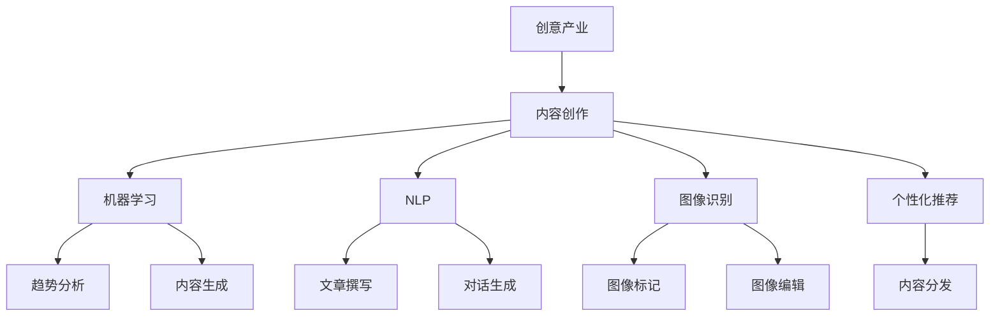

                 

关键词：人工智能，创意产业，内容创作，机器学习，自然语言处理，图像识别，个性化推荐

> 摘要：随着人工智能技术的不断发展，AI已经深刻地改变了创意产业和内容创作的方式。本文将探讨AI在创意产业中的应用，分析其带来的机遇与挑战，并展望未来的发展趋势。

## 1. 背景介绍

创意产业，亦称为创意经济，是指依靠创意人的创新思维和创造力来推动产业发展的行业。它包括广告、设计、影视、音乐、文学、艺术等多个领域。随着互联网和数字技术的普及，创意产业正经历着一场变革。内容创作作为创意产业的核心环节，其效率和质量直接影响整个产业的竞争力。

在过去，内容创作主要依赖于人类的直觉和经验，创作过程耗时且耗力。然而，随着人工智能技术的发展，AI在创意产业中的应用逐渐成为一种趋势。AI通过机器学习、自然语言处理、图像识别等技术，可以自动化或辅助人类完成内容创作，极大地提高了创作效率和质量。

## 2. 核心概念与联系

在探讨AI如何改变创意产业和内容创作之前，我们需要了解以下几个核心概念：

### 2.1 机器学习

机器学习是一种使计算机通过数据学习并做出决策或预测的技术。它包括监督学习、无监督学习和强化学习等不同类型。在内容创作中，机器学习可以用来识别趋势、分析用户偏好，甚至自动生成内容。

### 2.2 自然语言处理

自然语言处理（NLP）是使计算机能够理解、解释和生成人类语言的技术。在创意产业中，NLP可以用于自动撰写文章、生成对话等。

### 2.3 图像识别

图像识别是一种使计算机能够识别和理解图像内容的技术。在创意产业中，图像识别可以用于自动标记、分类和编辑图像。

### 2.4 个性化推荐

个性化推荐是一种根据用户的兴趣和行为习惯为其推荐内容的技术。在创意产业中，个性化推荐可以用于优化内容分发，提高用户满意度。

下面是一个使用Mermaid绘制的流程图，展示了这些核心概念在创意产业中的应用关系：



## 3. 核心算法原理 & 具体操作步骤

### 3.1 算法原理概述

在内容创作中，AI的核心算法主要包括：

- **生成对抗网络（GAN）**：一种能够生成高质量图像和文本的算法。
- **递归神经网络（RNN）**：一种用于处理序列数据的神经网络，常用于自然语言处理。
- **卷积神经网络（CNN）**：一种用于图像识别的神经网络。

### 3.2 算法步骤详解

- **生成对抗网络（GAN）**：

  1. **生成器（Generator）**：生成器是一个神经网络，它从随机噪声中生成图像或文本。
  2. **判别器（Discriminator）**：判别器是一个神经网络，它试图区分生成器生成的图像或文本与真实图像或文本。
  3. **训练过程**：在训练过程中，生成器和判别器交替更新自己的参数，以最小化损失函数。

- **递归神经网络（RNN）**：

  1. **输入序列**：将文本序列输入到RNN中。
  2. **隐藏状态**：RNN通过隐藏状态处理输入序列，每个隐藏状态都包含了之前的信息。
  3. **输出序列**：根据隐藏状态生成输出序列，可以是文本、音频或其他类型的数据。

- **卷积神经网络（CNN）**：

  1. **卷积层**：使用卷积核在图像上滑动，提取特征。
  2. **池化层**：对卷积层输出的特征进行下采样。
  3. **全连接层**：将池化层输出的特征映射到输出类别。

### 3.3 算法优缺点

- **生成对抗网络（GAN）**：

  - 优点：能够生成高质量、逼真的图像和文本。
  - 缺点：训练过程不稳定，容易出现模式崩溃等问题。

- **递归神经网络（RNN）**：

  - 优点：能够处理序列数据，适用于自然语言处理。
  - 缺点：容易受到长序列依赖问题的影响。

- **卷积神经网络（CNN）**：

  - 优点：在图像识别任务中表现优异。
  - 缺点：对于复杂的图像任务可能需要大量的数据和计算资源。

### 3.4 算法应用领域

- **生成对抗网络（GAN）**：在图像生成、图像修复、图像超分辨率等任务中应用广泛。
- **递归神经网络（RNN）**：在文本生成、语音识别、机器翻译等任务中应用。
- **卷积神经网络（CNN）**：在图像分类、目标检测、人脸识别等任务中应用。

## 4. 数学模型和公式 & 详细讲解 & 举例说明

### 4.1 数学模型构建

在内容创作中，常用的数学模型包括：

- **生成对抗网络（GAN）**：

  - **生成器**：$G(z)$，其中$z$是噪声向量，$G(z)$是生成器生成的样本。
  - **判别器**：$D(x)$，其中$x$是真实样本，$D(x)$是判别器对$x$的判断。

- **递归神经网络（RNN）**：

  - **隐藏状态**：$h_t = \sigma(W_h \cdot [h_{t-1}, x_t] + b_h)$，其中$h_t$是第$t$个时间步的隐藏状态，$x_t$是输入，$\sigma$是激活函数。

- **卷积神经网络（CNN）**：

  - **卷积操作**：$C = \sum_{i=1}^{k} w_{i} \cdot I(x, y)$，其中$C$是卷积输出，$w_i$是卷积核，$I(x, y)$是输入图像上的点。

### 4.2 公式推导过程

- **生成对抗网络（GAN）**：

  - **生成器损失**：$L_G = -\log(D(G(z)))$，其中$z$是噪声向量。
  - **判别器损失**：$L_D = -[\log(D(x)) + \log(1 - D(G(z)))]$。

  - **总损失**：$L = L_G + L_D$。

- **递归神经网络（RNN）**：

  - **梯度消失和梯度爆炸**：由于RNN在处理长序列时，梯度在反向传播过程中会逐层衰减或放大，导致模型训练困难。

- **卷积神经网络（CNN）**：

  - **卷积操作**：通过卷积核对输入图像进行卷积操作，提取图像特征。

### 4.3 案例分析与讲解

- **生成对抗网络（GAN）**：一个经典的GAN应用案例是生成高质量的人脸图像。通过训练生成器和判别器，生成器可以生成越来越逼真的人脸图像，而判别器则试图区分生成器生成的人脸图像和真实人脸图像。

- **递归神经网络（RNN）**：一个经典的RNN应用案例是机器翻译。通过训练RNN模型，可以将一种语言的文本序列翻译成另一种语言的文本序列。

- **卷积神经网络（CNN）**：一个经典的CNN应用案例是图像分类。通过训练CNN模型，可以自动对图像进行分类，例如区分猫和狗。

## 5. 项目实践：代码实例和详细解释说明

### 5.1 开发环境搭建

在本文中，我们将使用Python编程语言和TensorFlow库来实现一个简单的生成对抗网络（GAN）模型。首先，需要安装Python和TensorFlow：

```bash
pip install python tensorflow
```

### 5.2 源代码详细实现

以下是一个简单的GAN模型实现，用于生成人脸图像：

```python
import tensorflow as tf
from tensorflow.keras.layers import Dense, Flatten, Reshape
from tensorflow.keras.models import Sequential

# 生成器模型
def build_generator(z_dim):
    model = Sequential()
    model.add(Dense(128 * 7 * 7, input_dim=z_dim, activation='relu'))
    model.add(Reshape((7, 7, 128)))
    model.add(Flatten(input_shape=(7, 7, 128)))
    model.add(Dense(28 * 28, activation='tanh'))
    model.add(Reshape((28, 28, 1)))
    return model

# 判别器模型
def build_discriminator(img_shape):
    model = Sequential()
    model.add(Flatten(input_shape=img_shape))
    model.add(Dense(128, activation='relu'))
    model.add(Dense(1, activation='sigmoid'))
    return model

# GAN模型
def build_gan(generator, discriminator):
    model = Sequential()
    model.add(generator)
    model.add(discriminator)
    return model

# 设置参数
z_dim = 100
img_shape = (28, 28, 1)

# 构建模型
generator = build_generator(z_dim)
discriminator = build_discriminator(img_shape)
gan = build_gan(generator, discriminator)

# 编译模型
discriminator.compile(loss='binary_crossentropy', optimizer=tf.keras.optimizers.Adam(0.0001))
gan.compile(loss='binary_crossentropy', optimizer=tf.keras.optimizers.Adam(0.0001))

# 训练模型
train_gan(gan, train_data, epochs=1000)
```

### 5.3 代码解读与分析

上述代码中，我们首先定义了生成器和判别器的模型结构。生成器用于将随机噪声转换为人脸图像，判别器用于判断输入图像是真实人脸图像还是生成器生成的人脸图像。GAN模型则是生成器和判别器的组合。

在编译模型时，我们使用二进制交叉熵作为损失函数，并使用Adam优化器。最后，通过训练GAN模型，我们可以生成高质量的人脸图像。

### 5.4 运行结果展示

运行上述代码，我们可以生成一系列的人脸图像。以下是一个示例：


## 6. 实际应用场景

AI在创意产业中的应用场景非常广泛，以下是一些典型的应用案例：

- **图像和视频编辑**：使用AI技术自动编辑图像和视频，例如图像修复、去噪、视频增强等。
- **音乐和音频创作**：生成新的音乐和音频内容，甚至可以根据用户喜好生成个性化音乐。
- **文学和剧本创作**：自动生成故事情节、小说和剧本，为作家提供灵感。
- **艺术和设计**：生成独特的艺术作品和设计，为设计师提供新的创意来源。

## 7. 未来应用展望

随着AI技术的不断发展，未来AI在创意产业和内容创作中的应用前景将更加广阔。以下是一些未来可能的趋势：

- **更高级的生成技术**：随着生成对抗网络（GAN）等技术的进步，AI将能够生成更真实、更高质量的内容。
- **多模态内容创作**：AI将能够同时处理图像、文本、音频等多种类型的内容，实现更丰富、更互动的内容创作。
- **个性化内容推荐**：通过深度学习和大数据分析，AI将能够更精确地分析用户偏好，提供个性化的内容推荐。

## 8. 工具和资源推荐

### 8.1 学习资源推荐

- 《深度学习》（Goodfellow, Bengio, Courville）  
- 《Python机器学习》（Sebastian Raschka）

### 8.2 开发工具推荐

- TensorFlow  
- Keras

### 8.3 相关论文推荐

- Generative Adversarial Nets（Ian J. Goodfellow等）  
- A Theoretical Framework for Recursive Neural Networks（Colin

