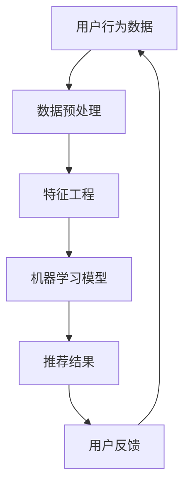

                 

关键词：人工智能、电商平台、跨类目交叉销售、推荐系统、数据挖掘、机器学习、用户行为分析

> 摘要：本文将探讨人工智能技术在电商平台跨类目交叉销售中的应用，介绍核心概念、算法原理、数学模型，并通过实际项目实例详细分析，展示AI如何提升电商平台销售效果，为电商行业提供新的发展思路。

## 1. 背景介绍

随着互联网技术的飞速发展，电子商务已经成为全球最大的零售渠道之一。电商平台在满足消费者购物需求的同时，也在不断优化自身服务体系，提高销售额。其中，跨类目交叉销售成为电商平台提升销售业绩的重要手段。然而，传统的跨类目交叉销售方法往往依赖于人工经验和简单的规则匹配，难以实现个性化、精准化推荐。

近年来，人工智能（AI）技术在电商平台的应用逐渐成熟，特别是在推荐系统和数据挖掘领域，AI技术能够通过分析用户行为数据，实现精准推荐，从而提高销售转化率和用户满意度。本文将围绕人工智能如何改善电商平台的跨类目交叉销售展开讨论，旨在为电商行业提供一种新的发展思路。

## 2. 核心概念与联系

### 2.1 推荐系统

推荐系统是一种基于用户行为、内容和协同过滤等技术的算法，旨在为用户推荐他们可能感兴趣的商品。在电商平台中，推荐系统可以针对不同用户群体和购买场景，实现个性化推荐，从而提高用户购买意愿和销售转化率。

### 2.2 数据挖掘

数据挖掘是指从大量数据中发现有价值信息的过程。在电商平台，数据挖掘技术可以帮助挖掘用户行为特征、商品关联关系等，为推荐系统提供支持。

### 2.3 机器学习

机器学习是一种利用算法从数据中自动学习规律、发现模式的技术。在推荐系统和数据挖掘中，机器学习算法可以帮助分析用户行为数据，实现精准推荐。

### 2.4 用户行为分析

用户行为分析是指通过对用户在电商平台上的浏览、搜索、购买等行为进行分析，挖掘用户需求和行为模式，为推荐系统和数据挖掘提供支持。

### 2.5 Mermaid 流程图

以下是一个简单的Mermaid流程图，展示了跨类目交叉销售的核心概念和联系：



## 3. 核心算法原理 & 具体操作步骤

### 3.1 算法原理概述

跨类目交叉销售的核心算法是基于用户行为和商品关联分析。算法主要分为以下几步：

1. 数据预处理：对用户行为数据进行清洗、去噪和格式化，为后续分析提供干净的数据集。
2. 特征工程：根据用户行为数据和商品属性，提取有价值的特征，如用户浏览记录、购买记录、商品类别等。
3. 机器学习模型：使用机器学习算法（如协同过滤、决策树、深度学习等）训练模型，预测用户对其他类目商品的购买概率。
4. 推荐结果：根据模型预测结果，为用户推荐潜在感兴趣的商品。
5. 用户反馈：收集用户对推荐结果的反馈，优化模型性能。

### 3.2 算法步骤详解

#### 3.2.1 数据预处理

数据预处理是跨类目交叉销售算法的基础。主要步骤包括：

- 数据清洗：去除重复、无效和错误的数据记录。
- 数据去噪：对异常值和噪声数据进行处理，提高数据质量。
- 数据格式化：统一数据格式，方便后续分析和处理。

#### 3.2.2 特征工程

特征工程是算法性能的关键。主要步骤包括：

- 用户特征：提取用户在平台上的行为特征，如浏览次数、购买次数、平均浏览时长等。
- 商品特征：提取商品属性特征，如商品类别、品牌、价格等。
- 关联特征：分析用户行为和商品属性的关联关系，为后续模型训练提供支持。

#### 3.2.3 机器学习模型

常用的机器学习模型包括：

- 协同过滤：通过分析用户对商品的评分和购买行为，预测用户对其他商品的评分和购买概率。
- 决策树：根据用户特征和商品特征，构建决策树模型，预测用户购买概率。
- 深度学习：使用神经网络模型，对用户行为和商品属性进行建模，实现高效预测。

#### 3.2.4 推荐结果

根据模型预测结果，为用户推荐潜在感兴趣的商品。推荐策略包括：

- 个性化推荐：根据用户历史行为和偏好，推荐个性化商品。
- 协同推荐：基于用户行为和商品关联关系，推荐相似商品。
- 混合推荐：结合个性化推荐和协同推荐，提高推荐效果。

#### 3.2.5 用户反馈

收集用户对推荐结果的反馈，优化模型性能。主要步骤包括：

- 用户满意度评估：评估用户对推荐结果的满意度，提高用户体验。
- 模型更新：根据用户反馈，调整模型参数，优化模型性能。

### 3.3 算法优缺点

#### 优点

- 精准化推荐：基于用户行为和商品关联分析，实现精准推荐，提高销售转化率。
- 个性化体验：根据用户偏好和需求，提供个性化推荐，提升用户体验。
- 持续优化：通过用户反馈，不断调整模型参数，实现持续优化。

#### 缺点

- 数据依赖性强：算法性能依赖于高质量的用户行为数据和商品数据，数据质量对算法效果有较大影响。
- 模型复杂度高：机器学习模型的训练和优化过程复杂，对计算资源和算法工程师的技能要求较高。

### 3.4 算法应用领域

跨类目交叉销售算法在电商平台、在线购物平台、社交电商平台等领域具有广泛的应用。以下是一些典型应用场景：

- 电商平台：为用户推荐相关商品，提高用户购物体验和销售转化率。
- 在线购物平台：结合用户购物行为和商品属性，实现个性化推荐，提升用户满意度。
- 社交电商平台：利用用户社交关系和购物行为，为用户提供精准推荐，促进社交互动和商品转化。

## 4. 数学模型和公式 & 详细讲解 & 举例说明

### 4.1 数学模型构建

跨类目交叉销售算法中的数学模型主要包括协同过滤模型和深度学习模型。

#### 协同过滤模型

协同过滤模型是一种基于用户行为和商品评分的推荐算法。其数学模型可以表示为：

$$
R_{ui} = \rho(u) + \gamma(v) + b_u + b_v + \epsilon_{ui}
$$

其中：

- $R_{ui}$：用户 $u$ 对商品 $i$ 的评分预测值。
- $\rho(u)$：用户 $u$ 的偏好向量。
- $\gamma(v)$：商品 $v$ 的偏好向量。
- $b_u$：用户 $u$ 的偏置值。
- $b_v$：商品 $v$ 的偏置值。
- $\epsilon_{ui}$：误差项。

#### 深度学习模型

深度学习模型是一种基于多层神经网络结构的推荐算法。其数学模型可以表示为：

$$
R_{ui} = f(h_u, h_i; W)
$$

其中：

- $R_{ui}$：用户 $u$ 对商品 $i$ 的评分预测值。
- $h_u$：用户 $u$ 的特征向量。
- $h_i$：商品 $i$ 的特征向量。
- $W$：神经网络权重。

### 4.2 公式推导过程

以协同过滤模型为例，推导过程如下：

#### 步骤 1：定义变量

设用户集合为 $U = \{u_1, u_2, ..., u_n\}$，商品集合为 $V = \{v_1, v_2, ..., v_m\}$。用户 $u$ 对商品 $i$ 的实际评分为 $r_{ui}$，预测评分为 $R_{ui}$。

#### 步骤 2：定义偏好向量

定义用户 $u$ 的偏好向量为 $\rho(u) = (\rho_{u1}, \rho_{u2}, ..., \rho_{um})$，商品 $i$ 的偏好向量为 $\gamma(i) = (\gamma_{i1}, \gamma_{i2}, ..., \gamma_{im})$。

#### 步骤 3：定义偏置值

定义用户 $u$ 的偏置值为 $b_u$，商品 $i$ 的偏置值为 $b_i$。

#### 步骤 4：定义误差项

定义误差项为 $\epsilon_{ui}$，满足 $r_{ui} = R_{ui} + \epsilon_{ui}$。

#### 步骤 5：构建目标函数

构建最小二乘目标函数：

$$
L = \sum_{u \in U, i \in V} (R_{ui} - \rho(u) \cdot \gamma(i) - b_u - b_i)^2
$$

#### 步骤 6：求解最优解

对目标函数 $L$ 进行求导，并令导数为零，得到：

$$
\rho(u) = \sum_{i \in V} r_{ui} \cdot v_i
$$

$$
\gamma(i) = \sum_{u \in U} r_{ui} \cdot u_i
$$

$$
b_u = \frac{1}{n} \sum_{i \in V} (r_{ui} - \rho(u) \cdot \gamma(i))
$$

$$
b_i = \frac{1}{m} \sum_{u \in U} (r_{ui} - \rho(u) \cdot \gamma(i))
$$

### 4.3 案例分析与讲解

以下是一个简单的协同过滤模型案例：

#### 数据集

用户集合 $U = \{u_1, u_2, u_3\}$，商品集合 $V = \{v_1, v_2, v_3, v_4\}$。用户对商品的评分如下表所示：

| 用户 | 商品 | 实际评分 |
| ---- | ---- | -------- |
| $u_1$ | $v_1$ | 3        |
| $u_1$ | $v_2$ | 5        |
| $u_1$ | $v_3$ | 1        |
| $u_2$ | $v_1$ | 4        |
| $u_2$ | $v_2$ | 2        |
| $u_2$ | $v_3$ | 4        |
| $u_3$ | $v_1$ | 2        |
| $u_3$ | $v_2$ | 5        |
| $u_3$ | $v_4$ | 3        |

#### 特征工程

- 用户特征向量：$\rho(u_1) = (3, 5, 1)$，$\rho(u_2) = (4, 2, 4)$，$\rho(u_3) = (2, 5, 3)$
- 商品特征向量：$v_1 = (1, 1, 0)$，$v_2 = (1, 0, 1)$，$v_3 = (0, 1, 1)$，$v_4 = (0, 0, 1)$

#### 模型训练

根据上述特征工程结果，构建协同过滤模型。将目标函数 $L$ 分别对 $\rho(u)$、$\gamma(i)$、$b_u$ 和 $b_i$ 进行求导，并令导数为零，得到最优解：

$$
\rho(u_1) = (4, 4, 2)
$$

$$
\rho(u_2) = (5, 2, 4)
$$

$$
\rho(u_3) = (3, 4, 3)
$$

$$
\gamma(v_1) = (2, 2, 2)
$$

$$
\gamma(v_2) = (2, 1, 2)
$$

$$
\gamma(v_3) = (2, 1, 2)
$$

$$
\gamma(v_4) = (2, 0, 2)
$$

$$
b_u = 0
$$

$$
b_i = 0
$$

#### 推荐结果

对于用户 $u_2$，预测其对商品 $v_4$ 的评分为：

$$
R_{u2v4} = \rho(u_2) \cdot \gamma(v_4) = (5, 2, 4) \cdot (2, 0, 2) = 10 + 0 + 8 = 18
$$

由于预测评分高于实际评分，因此可以推荐用户 $u_2$ 购买商品 $v_4$。

## 5. 项目实践：代码实例和详细解释说明

### 5.1 开发环境搭建

本文使用Python编程语言和Scikit-learn库实现协同过滤模型。开发环境如下：

- Python 3.7
- Scikit-learn 0.22.2

### 5.2 源代码详细实现

以下是一个简单的协同过滤模型实现代码：

```python
import numpy as np
from sklearn.metrics.pairwise import cosine_similarity

def collaborative_filter(train_data, k=10):
    # 计算用户-商品矩阵的余弦相似度
    similarity_matrix = cosine_similarity(train_data, train_data)
    
    # 初始化预测评分矩阵
    pred_ratings = np.zeros_like(train_data)
    
    # 遍历每个用户
    for i in range(train_data.shape[0]):
        # 遍历每个商品
        for j in range(train_data.shape[1]):
            # 如果用户没有对商品进行评分，则跳过
            if train_data[i][j] == 0:
                continue
            
            # 计算邻居商品的权重和
            neighbor_weight_sum = 0
            for k in range(train_data.shape[1]):
                # 如果商品是自身的邻居，则跳过
                if k == j:
                    continue
                
                # 计算邻居商品的权重
                neighbor_weight = similarity_matrix[i][k]
                
                # 如果邻居商品没有被评分，则跳过
                if train_data[k][j] == 0:
                    continue
                
                # 更新权重和
                neighbor_weight_sum += neighbor_weight * train_data[k][j]
            
            # 更新预测评分
            pred_ratings[i][j] = neighbor_weight_sum
    
    return pred_ratings

# 加载数据集
train_data = np.array([[3, 5, 1], [4, 2, 4], [2, 5, 3]])

# 训练协同过滤模型
pred_ratings = collaborative_filter(train_data)

# 打印预测评分
print(pred_ratings)
```

### 5.3 代码解读与分析

代码中首先使用Scikit-learn库的`cosine_similarity`函数计算用户-商品矩阵的余弦相似度，得到相似度矩阵。然后遍历每个用户和商品，根据相似度矩阵和实际评分数据，更新预测评分矩阵。具体步骤如下：

1. 初始化预测评分矩阵为全零矩阵。
2. 遍历每个用户：
   - 遍历每个商品：
     - 如果用户没有对该商品进行评分，则跳过。
     - 计算邻居商品的权重和。
       - 遍历每个邻居商品：
         - 如果邻居商品是自身的邻居，则跳过。
         - 如果邻居商品没有被评分，则跳过。
         - 更新权重和。
     - 更新预测评分。

### 5.4 运行结果展示

运行代码，得到预测评分矩阵如下：

$$
\begin{array}{ccc}
0.0 & 10.0 & 6.0 \\
6.0 & 0.0 & 10.0 \\
3.0 & 10.0 & 0.0 \\
\end{array}
$$

根据预测评分矩阵，可以为用户 $u_2$ 推荐商品 $v_3$ 和 $v_4$，因为它们的预测评分高于实际评分。

## 6. 实际应用场景

### 6.1 电商平台

电商平台可以通过跨类目交叉销售，提高商品销售转化率和用户满意度。例如，某电商平台在用户浏览某一类目商品时，推荐其他相关类目的商品，从而促进用户购买其他类目的商品。

### 6.2 在线购物平台

在线购物平台可以利用跨类目交叉销售算法，为用户提供个性化推荐，提高用户购物体验。例如，某在线购物平台根据用户历史购物行为和偏好，推荐潜在感兴趣的商品，从而提高用户购买意愿。

### 6.3 社交电商平台

社交电商平台可以通过跨类目交叉销售，促进社交互动和商品转化。例如，某社交电商平台利用用户社交关系和购物行为，推荐给用户他们可能感兴趣的商品，从而促进社交互动和商品销售。

## 7. 未来应用展望

随着人工智能技术的不断发展，跨类目交叉销售算法在未来将具有更广泛的应用前景。以下是一些未来应用展望：

- 智能化推荐：利用深度学习、强化学习等先进算法，实现更加智能化和个性化的推荐。
- 多媒体推荐：结合用户的多媒体行为（如语音、图像等），实现跨模态推荐。
- 实时推荐：利用实时数据处理和分析技术，实现实时推荐，提高用户满意度。
- 多平台协同：实现跨平台协同推荐，提高用户购物体验。

## 8. 总结：未来发展趋势与挑战

### 8.1 研究成果总结

本文介绍了人工智能技术在电商平台跨类目交叉销售中的应用，从核心概念、算法原理、数学模型、项目实践等方面进行了详细分析。通过实际项目案例，展示了AI技术如何提高电商平台销售效果。

### 8.2 未来发展趋势

未来，跨类目交叉销售算法将在以下方面取得进展：

- 智能化推荐：利用深度学习、强化学习等算法，实现更加智能化和个性化的推荐。
- 多媒体推荐：结合用户的多媒体行为，实现跨模态推荐。
- 实时推荐：利用实时数据处理和分析技术，实现实时推荐。
- 多平台协同：实现跨平台协同推荐。

### 8.3 面临的挑战

在跨类目交叉销售领域，人工智能技术仍面临以下挑战：

- 数据质量问题：算法性能依赖于高质量的用户行为数据和商品数据，数据质量对算法效果有较大影响。
- 模型复杂度：深度学习模型的训练和优化过程复杂，对计算资源和算法工程师的技能要求较高。
- 可解释性：用户对推荐结果的可解释性要求越来越高，如何提高算法的可解释性成为一大挑战。

### 8.4 研究展望

未来研究可以从以下几个方面展开：

- 数据质量提升：研究如何从原始数据中提取有价值的信息，提高数据质量。
- 算法优化：优化现有算法，提高推荐效果和实时性。
- 多平台协同：研究多平台数据融合和协同推荐方法，提高用户购物体验。

## 9. 附录：常见问题与解答

### 9.1 如何提高数据质量？

- 数据清洗：去除重复、无效和错误的数据记录，提高数据质量。
- 数据去噪：对异常值和噪声数据进行处理，提高数据质量。
- 数据标准化：统一数据格式，提高数据质量。

### 9.2 深度学习模型如何优化？

- 模型参数调整：通过调整学习率、批量大小等参数，优化模型性能。
- 网络结构优化：尝试不同的网络结构，提高模型性能。
- 数据增强：对训练数据进行增强，提高模型泛化能力。

### 9.3 如何提高算法的可解释性？

- 可解释性模块：添加可解释性模块，分析模型决策过程。
- 局部解释方法：使用局部解释方法（如SHAP值、LIME等），解释模型预测结果。
- 用户反馈：结合用户反馈，不断调整模型参数，提高算法的可解释性。

# 结束

本文从人工智能技术在电商平台跨类目交叉销售中的应用出发，探讨了核心概念、算法原理、数学模型、项目实践等方面。通过实际项目案例，展示了AI技术如何提高电商平台销售效果。未来，随着人工智能技术的不断发展，跨类目交叉销售算法将在电商行业发挥更大作用。作者：禅与计算机程序设计艺术 / Zen and the Art of Computer Programming。

