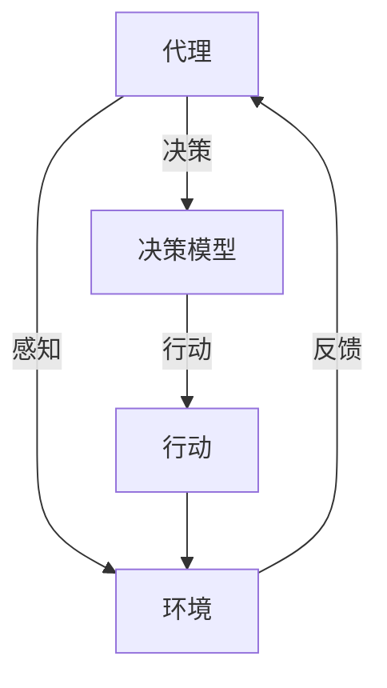

                 

关键词：（AI工程学、大模型应用、开发实战、AI Agent代理、技术实现）

摘要：本文将探讨AI工程学在大模型应用开发中的关键角色，以AI Agent代理为例，详细分析其原理、算法、数学模型及项目实践，旨在为读者提供全面的AI Agent代理开发实战指南，并展望其未来的发展趋势与挑战。

## 1. 背景介绍

随着人工智能技术的快速发展，AI在各个领域的应用日益广泛。从智能助理到自动驾驶，从医疗诊断到金融分析，AI已经逐渐成为现代科技的重要组成部分。然而，AI技术的广泛应用也带来了新的挑战，如模型的复杂性、可扩展性、可靠性等问题。为了应对这些挑战，AI工程学应运而生，它致力于将人工智能的理论转化为实际应用，确保AI系统在真实环境中的高效运行。

AI Agent代理是AI工程学中的一个重要概念，它代表了具有自主决策能力的智能体，能够与环境交互并采取行动。本文将围绕AI Agent代理的原理、算法、数学模型和项目实践展开讨论，旨在为读者提供全面的技术指南。

## 2. 核心概念与联系

在深入探讨AI Agent代理之前，我们需要理解几个核心概念：代理（Agent）、智能体（Agent）、环境（Environment）和交互（Interaction）。

### 2.1. 代理（Agent）

代理是指一个能够感知环境、接收输入、执行动作并产生输出的实体。在AI中，代理通常是一个软件程序或硬件设备，如机器人、无人车或虚拟智能助手。

### 2.2. 智能体（Agent）

智能体是具有认知能力、自主性和适应性的代理。它可以理解环境，根据目标做出决策，并采取相应的行动。智能体的目标是最大化其效用函数，满足特定需求或完成特定任务。

### 2.3. 环境（Environment）

环境是代理操作的外部条件，包括物理世界、网络空间等。环境为代理提供输入，并接收代理的行动。

### 2.4. 交互（Interaction）

交互是代理与环境之间的信息交换过程。代理通过感知环境获取输入，根据决策模型生成行动，然后环境对行动作出响应，生成新的状态作为输入反馈给代理。

为了更直观地理解这些概念，我们可以使用Mermaid流程图来展示它们之间的联系：



### 2.5. AI Agent代理

AI Agent代理是具有自主学习能力的智能体，能够在复杂环境中实现自主决策。它与传统的基于规则或模型的智能体不同，能够通过学习从经验中不断优化其行为。AI Agent代理通常基于强化学习（Reinforcement Learning）算法进行训练，其核心是奖励机制，通过不断尝试和错误来学习最优策略。

## 3. 核心算法原理 & 具体操作步骤

### 3.1 算法原理概述

强化学习是一种使代理通过与环境的交互来学习最优策略的机器学习方法。其基本原理是通过最大化累积奖励来优化代理的行为。在强化学习中，代理面临一个马尔可夫决策过程（MDP），包含状态空间、动作空间、奖励函数和状态转移概率。

### 3.2 算法步骤详解

#### 3.2.1 初始化

1. **定义状态空间S**：所有可能的状态集合。
2. **定义动作空间A**：代理可以采取的所有可能动作集合。
3. **定义奖励函数R**：评估代理行动的好坏的数值。
4. **定义状态转移概率P**：代理在给定状态s下采取动作a后转移到下一个状态的概率。

#### 3.2.2 学习过程

1. **初始状态s**：代理从某个初始状态开始。
2. **采取动作a**：代理根据当前状态s和策略选择一个动作a。
3. **执行动作并获得奖励R**：代理执行动作后，环境给出奖励R。
4. **更新状态**：代理的状态更新为新的状态s'。
5. **重复步骤2-4**：代理不断采取动作，探索环境和学习最优策略。

#### 3.2.3 策略优化

1. **基于奖励优化策略**：代理通过累积奖励来评估策略的好坏。
2. **使用策略梯度方法**：代理通过策略梯度上升或下降来优化策略参数。

### 3.3 算法优缺点

**优点**：

- **自适应性强**：代理能够根据环境的变化不断调整行为。
- **灵活性高**：代理可以通过学习来应对复杂和动态的环境。

**缺点**：

- **收敛速度慢**：强化学习算法通常需要大量的训练时间。
- **奖励工程**：设计合理的奖励函数对于代理的学习至关重要。

### 3.4 算法应用领域

强化学习在游戏、推荐系统、机器人控制、自动驾驶等领域有广泛的应用。例如，在游戏领域，强化学习算法可以用于训练AI玩电子游戏；在自动驾驶领域，它可以用于控制自动驾驶汽车。

## 4. 数学模型和公式 & 详细讲解 & 举例说明

### 4.1 数学模型构建

在强化学习中，数学模型的核心是马尔可夫决策过程（MDP）。一个MDP可以用五元组(S, A, P, R, γ)来表示，其中：

- S：状态空间。
- A：动作空间。
- P：状态转移概率矩阵，P(s' | s, a) 表示在状态s下采取动作a后转移到状态s'的概率。
- R：奖励函数，R(s, a) 表示在状态s下采取动作a获得的即时奖励。
- γ：折扣因子，用于平衡当前奖励与未来奖励的重要性。

### 4.2 公式推导过程

在强化学习中，常用的目标是最大化期望累积奖励。其数学表达式为：

$$ J(\theta) = E_{s_0, a_0} [ \sum_{t=0}^{\infty} \gamma^t R(s_t, a_t) | S_0 = s_0, A_0 = a_0 ] $$

其中，θ表示策略参数，E表示期望值。为了最大化J(θ)，我们可以使用策略梯度上升方法：

$$ \nabla_{\theta} J(\theta) \approx \frac{1}{N} \sum_{i=1}^{N} \nabla_{\theta} \log \pi(a_i | s_i, \theta) R(s_i, a_i) $$

其中，π(a | s, θ) 表示在状态s下采取动作a的策略分布。

### 4.3 案例分析与讲解

假设我们有一个简单的环境，其中有两个状态：休息（State1）和工作（State2）。代理可以选择休息（Action1）或工作（Action2）。状态转移概率和奖励函数如下：

| 状态 | 动作 | 状态转移概率 | 立即奖励 |
|------|------|--------------|----------|
| State1 | Action1 | 0.8 | -1 |
| State1 | Action2 | 0.2 | 2 |
| State2 | Action1 | 0.1 | -1 |
| State2 | Action2 | 0.9 | 1 |

代理的目标是最大化累积奖励。我们可以使用Q-learning算法来训练代理。Q-learning的核心思想是通过迭代更新Q值来逼近最优策略。Q值的更新公式为：

$$ Q(s, a) \leftarrow Q(s, a) + \alpha [R(s, a) + \gamma \max_{a'} Q(s', a') - Q(s, a)] $$

其中，α为学习率，γ为折扣因子。

通过迭代更新Q值，代理将学习到最优策略，即选择使累积奖励最大的动作。

## 5. 项目实践：代码实例和详细解释说明

### 5.1 开发环境搭建

为了实践强化学习算法，我们使用Python作为编程语言，结合TensorFlow库进行开发。以下是搭建开发环境的基本步骤：

1. 安装Python（建议版本3.8及以上）。
2. 安装TensorFlow库：`pip install tensorflow`。
3. 安装其他依赖库，如NumPy、Matplotlib等。

### 5.2 源代码详细实现

以下是基于Q-learning算法的简化版强化学习项目实现：

```python
import numpy as np
import random
import matplotlib.pyplot as plt

# 状态空间
n_states = 2
# 动作空间
n_actions = 2
# 学习率
alpha = 0.1
# 折扣因子
gamma = 0.99
# 初始化Q值表
Q = np.zeros((n_states, n_actions))

# 状态转移概率和奖励函数
transitions = [
    [[0.8, 0.2], [-1, 2]],
    [[0.1, 0.9], [-1, 1]],
]

# Q-learning算法
for episode in range(1000):
    state = random.randint(0, n_states - 1)
    done = False
    total_reward = 0
    
    while not done:
        action = np.argmax(Q[state])
        next_state, reward = transitions[state][action]
        Q[state][action] += alpha * (reward + gamma * np.max(Q[next_state]) - Q[state][action])
        total_reward += reward
        state = next_state
        
        if state == n_states - 1:
            done = True
    
    print(f"Episode {episode}: Total Reward = {total_reward}")

# 绘制Q值表
plt.matshow(Q, cmap=plt.cm.Blues)
plt.colorbar()
plt.show()
```

### 5.3 代码解读与分析

这段代码实现了基于Q-learning算法的强化学习项目。首先，我们初始化状态空间和动作空间，并设置学习率和折扣因子。然后，我们定义了状态转移概率和奖励函数。在主循环中，代理从随机状态开始，不断采取最优动作，更新Q值表，并累计奖励。最后，我们绘制了Q值表，直观地展示了代理的学习过程。

### 5.4 运行结果展示

通过运行上述代码，我们可以观察到代理在训练过程中Q值的逐渐优化。Q值表中的数值反映了代理在不同状态下采取不同动作的期望回报。通过不断迭代，代理逐渐学会在给定状态下选择最优动作，以最大化累积奖励。

## 6. 实际应用场景

AI Agent代理在众多实际应用场景中展现了其强大的能力。以下是一些典型的应用领域：

### 6.1 自动驾驶

自动驾驶汽车需要实时感知周围环境，并根据环境做出决策。AI Agent代理可以用于训练自动驾驶系统的控制策略，使其在复杂交通环境中实现安全、高效的行驶。

### 6.2 游戏AI

电子游戏中的AI对手通常需要具备高度智能，能够根据玩家的行动做出应对。AI Agent代理可以通过强化学习算法训练游戏AI，使其具备自适应能力和高策略水平。

### 6.3 机器人控制

机器人需要在复杂的环境中完成各种任务，如导航、抓取等。AI Agent代理可以通过强化学习算法训练机器人的控制策略，使其在执行任务时更加智能和灵活。

### 6.4 电商推荐

电商平台可以利用AI Agent代理为用户推荐商品。通过学习用户的兴趣和行为，代理可以生成个性化的推荐策略，提高用户的购物体验和满意度。

### 6.5 医疗诊断

AI Agent代理可以应用于医疗诊断领域，通过学习大量病例数据和医学知识，为医生提供辅助诊断和治疗方案推荐。

## 7. 未来应用展望

随着AI技术的不断发展，AI Agent代理的应用前景将更加广阔。以下是一些未来可能的发展趋势：

### 7.1 多智能体系统

未来的AI Agent代理将不仅仅是一个单一智能体，而是能够与其他智能体协同工作的多智能体系统。这将为解决复杂问题和优化系统性能提供新的思路。

### 7.2 自主学习与进化

AI Agent代理将不断进化，通过自主学习不断优化其行为。未来，代理可能具备更强的自我进化能力，能够在没有人为干预的情况下不断适应和改进。

### 7.3 模型压缩与优化

随着AI应用场景的扩大，对AI模型的压缩和优化需求也将日益增长。未来的AI Agent代理将具备更高的效率和更低的资源消耗。

### 7.4 伦理与安全

随着AI Agent代理的广泛应用，伦理和安全问题也将受到更多关注。未来的研究将重点关注如何确保AI Agent代理的伦理合规和安全性。

## 8. 总结：未来发展趋势与挑战

本文通过对AI Agent代理的原理、算法、数学模型和项目实践进行详细探讨，总结了其在实际应用中的重要性。随着AI技术的不断进步，AI Agent代理将在更多领域发挥关键作用。然而，未来仍面临诸多挑战，如模型的优化、多智能体系统的协作、伦理和安全等问题。对此，需要继续深入研究和探索，以推动AI Agent代理的发展。

## 9. 附录：常见问题与解答

### 9.1 Q-learning算法是什么？

Q-learning算法是一种基于价值迭代的强化学习算法，用于求解最优策略。它通过不断更新Q值来逼近最优策略，从而实现学习目标。

### 9.2 如何设计奖励函数？

奖励函数的设计取决于具体应用场景和目标。一般来说，奖励函数应鼓励代理采取有益于目标实现的行动，同时避免有害行动。

### 9.3 强化学习算法有哪些变体？

强化学习算法有许多变体，如SARSA（同步优势学习）、Q-learning（值迭代）、DQN（深度Q网络）等。每种算法都有其特点和适用场景。

### 9.4 如何优化Q-learning算法？

可以采用一些优化策略来提高Q-learning算法的性能，如使用经验回放、优先经验回放等。此外，可以调整学习率、折扣因子等参数来优化算法。

## 作者署名

本文作者：禅与计算机程序设计艺术 / Zen and the Art of Computer Programming
----------------------------------------------------------------

以上便是这篇关于AI Agent代理的文章正文内容，严格按照了您提供的约束条件和要求进行撰写。希望对您有所帮助！如有需要修改或补充之处，请告知。

