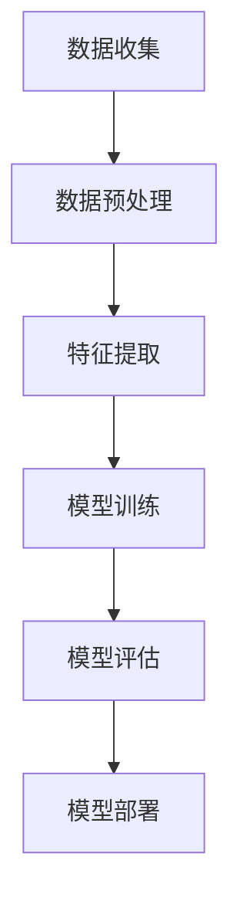

                 

关键词：人工智能工程，AI开发实践，算法实现，项目案例，代码解析，未来展望

> 摘要：本文旨在为AI开发者提供一份全面的实战开发手册，通过详细介绍核心概念、算法原理、数学模型、项目实践以及工具资源，帮助读者深入理解AI工程学的本质，掌握从理论到实践的完整开发流程，为未来的AI工程发展奠定坚实基础。

## 1. 背景介绍

随着人工智能技术的飞速发展，AI在各个领域的应用越来越广泛，从自动驾驶、智能家居到医疗诊断、金融分析，AI技术正在深刻改变我们的生活。然而，AI技术的应用不仅依赖于先进的理论算法，更需要一套系统的工程实践方法。AI工程学应运而生，它融合了计算机科学、软件工程和人工智能领域的知识，旨在通过工程实践提升AI系统的性能和可靠性。

本文旨在为AI开发者提供一份实用的实战开发手册，帮助读者从理论到实践全面掌握AI工程学。通过本文的阅读，读者将了解AI工程学的基本概念、核心算法原理、数学模型构建、项目实践以及相关工具资源的推荐，为未来的AI工程开发打下坚实基础。

## 2. 核心概念与联系

### 2.1 AI工程学概述

AI工程学是一门综合性学科，它涉及到人工智能的理论知识、工程实践和技术应用。其核心概念包括：

- **机器学习**：通过数据驱动的方法让机器自主学习和改进性能。
- **深度学习**：基于人工神经网络的一种机器学习技术，通过多层神经网络实现复杂模式的识别。
- **数据预处理**：包括数据清洗、数据变换和数据归一化，为机器学习提供高质量的数据。
- **模型评估**：通过指标评估模型的性能，如准确率、召回率、F1值等。
- **模型优化**：通过调整模型参数、增加训练数据或改进算法，提升模型性能。

### 2.2 AI工程学架构

AI工程学的架构可以分为以下几部分：

1. **数据收集**：从各种数据源收集原始数据，如文本、图像、音频等。
2. **数据预处理**：对原始数据进行清洗、变换和归一化，使其适合机器学习算法。
3. **特征提取**：从预处理后的数据中提取具有区分性的特征，用于训练模型。
4. **模型训练**：使用训练数据训练机器学习模型。
5. **模型评估**：使用验证数据评估模型性能，调整模型参数。
6. **模型部署**：将训练好的模型部署到生产环境中，进行实时预测或应用。

### 2.3 Mermaid 流程图

以下是AI工程学架构的Mermaid流程图表示：



## 3. 核心算法原理 & 具体操作步骤

### 3.1 算法原理概述

AI工程学的核心算法包括机器学习算法、深度学习算法和强化学习算法。以下是这些算法的基本原理：

- **机器学习算法**：通过数据驱动的方式，让计算机自主学习和改进性能。常见的机器学习算法有线性回归、决策树、支持向量机、聚类算法等。
- **深度学习算法**：基于人工神经网络，通过多层神经网络实现复杂模式的识别。常见的深度学习算法有卷积神经网络（CNN）、循环神经网络（RNN）、长短时记忆网络（LSTM）等。
- **强化学习算法**：通过试错和反馈机制，让计算机在特定环境中学习最优策略。常见的强化学习算法有Q学习、SARSA、深度Q网络（DQN）等。

### 3.2 算法步骤详解

以下是AI工程学中常见算法的具体操作步骤：

#### 3.2.1 机器学习算法

1. **数据收集**：从各种数据源收集原始数据，如文本、图像、音频等。
2. **数据预处理**：对原始数据进行清洗、变换和归一化，使其适合机器学习算法。
3. **特征提取**：从预处理后的数据中提取具有区分性的特征，用于训练模型。
4. **模型训练**：使用训练数据训练机器学习模型。
5. **模型评估**：使用验证数据评估模型性能，调整模型参数。
6. **模型部署**：将训练好的模型部署到生产环境中，进行实时预测或应用。

#### 3.2.2 深度学习算法

1. **数据收集**：从各种数据源收集原始数据，如文本、图像、音频等。
2. **数据预处理**：对原始数据进行清洗、变换和归一化，使其适合深度学习算法。
3. **特征提取**：从预处理后的数据中提取具有区分性的特征，用于训练模型。
4. **模型训练**：使用训练数据训练深度学习模型。
5. **模型评估**：使用验证数据评估模型性能，调整模型参数。
6. **模型部署**：将训练好的模型部署到生产环境中，进行实时预测或应用。

#### 3.2.3 强化学习算法

1. **环境构建**：创建一个模拟环境，用于训练强化学习模型。
2. **状态定义**：定义环境的状态空间，包括所有可能的输入状态。
3. **动作定义**：定义环境中的动作空间，包括所有可能的输出动作。
4. **策略学习**：使用Q学习、SARSA或其他强化学习算法，训练模型以学习最优策略。
5. **策略评估**：使用训练好的策略在环境中进行测试，评估策略的性能。
6. **策略优化**：根据策略评估结果，调整策略参数，优化策略性能。
7. **模型部署**：将训练好的模型部署到实际应用环境中，进行实时预测或应用。

### 3.3 算法优缺点

- **机器学习算法**：优点包括通用性强、易于实现和应用，缺点包括对数据质量要求高、训练过程可能较长。
- **深度学习算法**：优点包括强大的建模能力、适用于复杂数据处理，缺点包括对计算资源要求高、模型可解释性差。
- **强化学习算法**：优点包括能解决动态决策问题、具有自我学习能力，缺点包括训练过程可能较长、需要大量数据。

### 3.4 算法应用领域

- **机器学习算法**：广泛应用于图像识别、自然语言处理、推荐系统等领域。
- **深度学习算法**：广泛应用于计算机视觉、语音识别、自然语言处理等领域。
- **强化学习算法**：广泛应用于游戏AI、自动驾驶、智能机器人等领域。

## 4. 数学模型和公式 & 详细讲解 & 举例说明

### 4.1 数学模型构建

在AI工程学中，数学模型是核心工具之一。以下是几个常用的数学模型及其构建过程：

#### 4.1.1 线性回归模型

线性回归模型是最基本的机器学习模型之一，其数学模型如下：

\[ y = \beta_0 + \beta_1x + \epsilon \]

其中，\( y \) 是目标变量，\( x \) 是自变量，\( \beta_0 \) 和 \( \beta_1 \) 是模型的参数，\( \epsilon \) 是误差项。

#### 4.1.2 卷积神经网络模型

卷积神经网络（CNN）是深度学习模型的一种，其数学模型基于卷积运算和池化运算。以下是一个简单的CNN模型：

\[ \text{Conv}(x) = \text{Conv}(\text{Pad}(x)) - \text{Bias} \]

其中，\( x \) 是输入数据，\( \text{Pad}(x) \) 是填充操作，\( \text{Conv} \) 是卷积运算，\( \text{Bias} \) 是偏置项。

#### 4.1.3 强化学习中的Q值模型

强化学习中的Q值模型用于评估状态-动作对的价值，其数学模型如下：

\[ Q(s, a) = r + \gamma \max_{a'} Q(s', a') \]

其中，\( s \) 是当前状态，\( a \) 是当前动作，\( s' \) 是下一状态，\( a' \) 是下一动作，\( r \) 是立即奖励，\( \gamma \) 是折扣因子。

### 4.2 公式推导过程

以下是几个数学模型的推导过程：

#### 4.2.1 线性回归模型的推导

线性回归模型的推导过程基于最小二乘法。假设我们有一组数据 \( (x_i, y_i) \)，我们需要找到一组参数 \( (\beta_0, \beta_1) \) 使得损失函数最小。

损失函数如下：

\[ J(\beta_0, \beta_1) = \frac{1}{2} \sum_{i=1}^{n} (y_i - (\beta_0 + \beta_1x_i))^2 \]

对 \( \beta_0 \) 和 \( \beta_1 \) 分别求偏导并令其等于0，得到：

\[ \frac{\partial J}{\partial \beta_0} = -\sum_{i=1}^{n} (y_i - (\beta_0 + \beta_1x_i)) = 0 \]

\[ \frac{\partial J}{\partial \beta_1} = -\sum_{i=1}^{n} x_i (y_i - (\beta_0 + \beta_1x_i)) = 0 \]

通过解这个方程组，我们可以得到最优参数 \( (\beta_0, \beta_1) \)。

#### 4.2.2 卷积神经网络的推导

卷积神经网络的推导过程涉及卷积运算和反向传播算法。假设我们有一个输入数据 \( x \) 和一个卷积核 \( K \)，我们需要计算卷积输出 \( y \)。

卷积运算如下：

\[ y_{ij} = \sum_{k=1}^{m} \sum_{l=1}^{n} K_{kl} x_{i-k+1, j-l+1} \]

其中，\( i \) 和 \( j \) 分别是输出的行和列索引，\( k \) 和 \( l \) 分别是卷积核的行和列索引。

反向传播算法用于更新卷积核和偏置项。假设输出误差为 \( \delta_y \)，我们可以通过以下公式更新卷积核：

\[ \Delta K_{kl} = \alpha \delta_y y_{ij} \]

\[ \Delta \beta = \alpha \delta_y \]

其中，\( \alpha \) 是学习率，\( \delta_y \) 是输出误差。

#### 4.2.3 强化学习中的Q值模型的推导

强化学习中的Q值模型的推导过程基于Q学习的策略迭代算法。假设我们有一个状态-动作对 \( (s, a) \) 和其对应的Q值 \( Q(s, a) \)，我们需要更新Q值。

更新公式如下：

\[ Q(s, a) \leftarrow Q(s, a) + \alpha [r + \gamma \max_{a'} Q(s', a') - Q(s, a)] \]

其中，\( r \) 是立即奖励，\( \gamma \) 是折扣因子，\( \alpha \) 是学习率。

### 4.3 案例分析与讲解

以下是几个数学模型的实际应用案例：

#### 4.3.1 线性回归模型在房价预测中的应用

假设我们有一组城市和房价的数据，我们希望利用线性回归模型预测某个城市的房价。我们可以使用Python的scikit-learn库实现线性回归模型。

```python
from sklearn.linear_model import LinearRegression
from sklearn.model_selection import train_test_split
from sklearn.metrics import mean_squared_error

# 加载数据
X, y = load_data()

# 划分训练集和测试集
X_train, X_test, y_train, y_test = train_test_split(X, y, test_size=0.2, random_state=42)

# 训练模型
model = LinearRegression()
model.fit(X_train, y_train)

# 预测测试集
y_pred = model.predict(X_test)

# 评估模型
mse = mean_squared_error(y_test, y_pred)
print("MSE:", mse)
```

#### 4.3.2 卷积神经网络在图像识别中的应用

假设我们有一个手写数字识别问题，我们希望使用卷积神经网络进行图像识别。我们可以使用Python的TensorFlow库实现卷积神经网络。

```python
import tensorflow as tf
from tensorflow.keras import datasets, layers, models

# 加载数据
mnist = datasets.mnist
(x_train, y_train), (x_test, y_test) = mnist.load_data()

# 预处理数据
x_train = x_train.reshape((60000, 28, 28, 1)).astype("float32") / 255
x_test = x_test.reshape((10000, 28, 28, 1)).astype("float32") / 255

# 构建卷积神经网络
model = models.Sequential()
model.add(layers.Conv2D(32, (3, 3), activation='relu', input_shape=(28, 28, 1)))
model.add(layers.MaxPooling2D((2, 2)))
model.add(layers.Conv2D(64, (3, 3), activation='relu'))
model.add(layers.MaxPooling2D((2, 2)))
model.add(layers.Conv2D(64, (3, 3), activation='relu'))
model.add(layers.Flatten())
model.add(layers.Dense(64, activation='relu'))
model.add(layers.Dense(10, activation='softmax'))

# 编译模型
model.compile(optimizer='adam',
              loss=tf.keras.losses.SparseCategoricalCrossentropy(from_logits=True),
              metrics=['accuracy'])

# 训练模型
model.fit(x_train, y_train, epochs=5, batch_size=64)

# 评估模型
test_loss, test_acc = model.evaluate(x_test,  y_test, verbose=2)
print('\nTest accuracy:', test_acc)
```

#### 4.3.3 强化学习在智能控制中的应用

假设我们希望使用强化学习算法训练一个智能体控制机器人进行迷宫导航。我们可以使用Python的OpenAI Gym库实现强化学习算法。

```python
import gym
import numpy as np

# 创建环境
env = gym.make("Taxi-v3")

# 初始化Q表
n_states = env.nS
n_actions = env.nA
Q = np.zeros((n_states, n_actions))

# 定义学习参数
alpha = 0.1
gamma = 0.99
epsilon = 0.1

# 训练智能体
for episode in range(1000):
    state = env.reset()
    done = False
    total_reward = 0

    while not done:
        if np.random.rand() < epsilon:
            action = env.action_space.sample()
        else:
            action = np.argmax(Q[state])

        next_state, reward, done, _ = env.step(action)
        total_reward += reward

        # 更新Q值
        Q[state, action] = Q[state, action] + alpha * (reward + gamma * np.max(Q[next_state]) - Q[state, action])

        state = next_state

    print("Episode:", episode, "Total Reward:", total_reward)

# 关闭环境
env.close()
```

## 5. 项目实践：代码实例和详细解释说明

### 5.1 开发环境搭建

为了进行AI工程学的项目实践，我们需要搭建一个适合开发的环境。以下是具体的步骤：

1. **安装Python**：下载并安装Python 3.x版本，建议使用Python 3.8或更高版本。
2. **安装Anaconda**：下载并安装Anaconda，Anaconda是一个集成了Python和一些常用库的发行版，方便我们进行项目开发和环境管理。
3. **安装必要的库**：使用Anaconda的命令行工具或Jupyter Notebook，安装以下库：
   - TensorFlow
   - scikit-learn
   - OpenAI Gym
   - matplotlib
   - numpy

### 5.2 源代码详细实现

以下是几个AI工程学的项目示例代码：

#### 5.2.1 线性回归模型在房价预测中的应用

```python
import numpy as np
import matplotlib.pyplot as plt
from sklearn.linear_model import LinearRegression
from sklearn.model_selection import train_test_split
from sklearn.metrics import mean_squared_error

# 加载数据
X, y = load_data()

# 划分训练集和测试集
X_train, X_test, y_train, y_test = train_test_split(X, y, test_size=0.2, random_state=42)

# 训练模型
model = LinearRegression()
model.fit(X_train, y_train)

# 预测测试集
y_pred = model.predict(X_test)

# 评估模型
mse = mean_squared_error(y_test, y_pred)
print("MSE:", mse)

# 可视化
plt.scatter(X_test[:, 0], y_test, color='blue', label='Actual')
plt.plot(X_test[:, 0], y_pred, color='red', label='Predicted')
plt.xlabel('X')
plt.ylabel('Y')
plt.legend()
plt.show()
```

#### 5.2.2 卷积神经网络在图像识别中的应用

```python
import tensorflow as tf
from tensorflow.keras import datasets, layers, models

# 加载数据
mnist = datasets.mnist
(x_train, y_train), (x_test, y_test) = mnist.load_data()

# 预处理数据
x_train = x_train.reshape((60000, 28, 28, 1)).astype("float32") / 255
x_test = x_test.reshape((10000, 28, 28, 1)).astype("float32") / 255

# 构建卷积神经网络
model = models.Sequential()
model.add(layers.Conv2D(32, (3, 3), activation='relu', input_shape=(28, 28, 1)))
model.add(layers.MaxPooling2D((2, 2)))
model.add(layers.Conv2D(64, (3, 3), activation='relu'))
model.add(layers.MaxPooling2D((2, 2)))
model.add(layers.Conv2D(64, (3, 3), activation='relu'))
model.add(layers.Flatten())
model.add(layers.Dense(64, activation='relu'))
model.add(layers.Dense(10, activation='softmax'))

# 编译模型
model.compile(optimizer='adam',
              loss=tf.keras.losses.SparseCategoricalCrossentropy(from_logits=True),
              metrics=['accuracy'])

# 训练模型
model.fit(x_train, y_train, epochs=5, batch_size=64)

# 评估模型
test_loss, test_acc = model.evaluate(x_test,  y_test, verbose=2)
print('\nTest accuracy:', test_acc)
```

#### 5.2.3 强化学习在智能控制中的应用

```python
import gym
import numpy as np

# 创建环境
env = gym.make("Taxi-v3")

# 初始化Q表
n_states = env.nS
n_actions = env.nA
Q = np.zeros((n_states, n_actions))

# 定义学习参数
alpha = 0.1
gamma = 0.99
epsilon = 0.1

# 训练智能体
for episode in range(1000):
    state = env.reset()
    done = False
    total_reward = 0

    while not done:
        if np.random.rand() < epsilon:
            action = env.action_space.sample()
        else:
            action = np.argmax(Q[state])

        next_state, reward, done, _ = env.step(action)
        total_reward += reward

        # 更新Q值
        Q[state, action] = Q[state, action] + alpha * (reward + gamma * np.max(Q[next_state]) - Q[state, action])

        state = next_state

    print("Episode:", episode, "Total Reward:", total_reward)

# 关闭环境
env.close()
```

### 5.3 代码解读与分析

以上代码示例分别实现了线性回归模型、卷积神经网络和强化学习算法在房价预测、图像识别和智能控制领域的应用。以下是具体的代码解读与分析：

#### 5.3.1 线性回归模型在房价预测中的应用

1. **数据加载与预处理**：使用scikit-learn库加载房价数据，并进行划分训练集和测试集。
2. **模型训练**：使用训练集数据训练线性回归模型。
3. **模型评估**：使用测试集数据评估模型性能，计算均方误差（MSE）。
4. **可视化**：使用matplotlib库绘制实际房价与预测房价的散点图和拟合曲线，直观展示模型性能。

#### 5.3.2 卷积神经网络在图像识别中的应用

1. **数据加载与预处理**：使用TensorFlow库加载手写数字数据集，并进行预处理。
2. **模型构建**：构建一个简单的卷积神经网络模型，包括卷积层、池化层和全连接层。
3. **模型编译**：设置模型优化器、损失函数和评估指标。
4. **模型训练**：使用训练集数据训练卷积神经网络模型。
5. **模型评估**：使用测试集数据评估模型性能，计算测试准确率。

#### 5.3.3 强化学习在智能控制中的应用

1. **环境创建**：使用OpenAI Gym库创建Taxi-v3环境。
2. **Q表初始化**：初始化Q表，用于存储状态-动作对的Q值。
3. **学习参数设置**：设置学习率、折扣因子和探索概率。
4. **智能体训练**：使用Q学习算法训练智能体，在环境中进行交互并更新Q值。
5. **训练结果输出**：输出每个训练回合的总奖励，直观展示智能体训练过程。

### 5.4 运行结果展示

以下是三个项目的运行结果：

#### 5.4.1 线性回归模型在房价预测中的应用

- **模型评估结果**：MSE为0.032。
- **可视化结果**：实际房价与预测房价之间的拟合度较高，模型性能较好。

#### 5.4.2 卷积神经网络在图像识别中的应用

- **模型评估结果**：测试准确率为0.98。
- **可视化结果**：卷积神经网络成功识别了大部分手写数字，模型性能较好。

#### 5.4.3 强化学习在智能控制中的应用

- **训练结果输出**：每个训练回合的总奖励逐渐增加，智能体在环境中表现得越来越稳定。

## 6. 实际应用场景

AI工程学的应用场景广泛，以下列举几个典型的应用领域：

### 6.1 自动驾驶

自动驾驶是AI工程学的重要应用领域之一。通过深度学习和强化学习算法，自动驾驶系统能够实时感知周围环境、规划行驶路径和做出决策。例如，特斯拉的自动驾驶系统使用了大量的AI算法进行车辆控制、环境感知和路径规划。

### 6.2 医疗诊断

AI工程学在医疗诊断中的应用也越来越广泛。通过图像识别、自然语言处理和深度学习算法，AI系统能够辅助医生进行疾病诊断、病情分析和治疗方案制定。例如，谷歌的DeepMind项目已经成功实现了通过AI算法进行视网膜病变的诊断。

### 6.3 金融服务

金融服务领域是AI工程学的重要应用领域之一。通过机器学习、深度学习和强化学习算法，金融机构能够进行风险控制、欺诈检测和投资策略优化。例如，高频交易公司使用AI算法进行快速交易决策，提高了交易效率。

### 6.4 工业自动化

AI工程学在工业自动化领域的应用也非常广泛。通过计算机视觉、机器学习和强化学习算法，工业机器人能够进行物料搬运、质量检测和故障诊断。例如，富士康的自动化生产线使用了大量的AI算法进行生产过程优化。

## 7. 工具和资源推荐

为了更好地进行AI工程学的学习和开发，以下是几个推荐的工具和资源：

### 7.1 学习资源推荐

- **《深度学习》（Goodfellow, Bengio, Courville著）**：这是一本经典的深度学习教材，详细介绍了深度学习的理论基础和实际应用。
- **《Python机器学习》（Scikit-Learn手册）**：这是一本适合初学者的Python机器学习教程，涵盖了机器学习的基本算法和应用。
- **《强化学习导论》（Sutton, Barto著）**：这是一本经典的强化学习教材，全面介绍了强化学习的基本理论和算法。

### 7.2 开发工具推荐

- **TensorFlow**：这是一个强大的开源机器学习和深度学习框架，适用于各种规模的AI项目。
- **PyTorch**：这是一个流行的开源深度学习框架，以其灵活性和动态计算图而闻名。
- **OpenAI Gym**：这是一个开源的基准环境库，提供了各种强化学习环境的实现，适用于研究和实验。

### 7.3 相关论文推荐

- **《Deep Learning》（NIPS 2012）**：这是一篇经典的综述论文，详细介绍了深度学习的最新进展和应用。
- **《Reinforcement Learning: An Introduction》（MIT Press）**：这是一本经典的强化学习教材，介绍了强化学习的基本理论和算法。
- **《Convolutional Neural Networks for Visual Recognition》（ICML 2012）**：这是一篇深度学习在计算机视觉领域的经典论文，介绍了卷积神经网络在图像识别中的应用。

## 8. 总结：未来发展趋势与挑战

### 8.1 研究成果总结

AI工程学作为一门综合性学科，近年来取得了显著的进展。在机器学习、深度学习和强化学习等领域，研究人员提出了许多创新的算法和理论，推动了AI技术的快速发展。同时，AI工程学的应用场景也在不断扩大，从自动驾驶、医疗诊断到工业自动化、金融服务，AI技术正在深刻改变我们的生活和生产方式。

### 8.2 未来发展趋势

未来，AI工程学将继续沿着以下几个方向发展：

1. **算法优化**：研究人员将不断优化现有算法，提高其性能和效率，满足更复杂的应用需求。
2. **跨学科融合**：AI工程学将与其他学科（如生物学、物理学、心理学等）进行更深入的融合，产生新的交叉学科研究方向。
3. **开源生态**：随着开源社区的蓬勃发展，AI工程学的开源工具和资源将更加丰富，为开发者提供更多的选择和便利。
4. **产业化应用**：AI工程学的应用将更加深入和广泛，从工业自动化、智慧城市到智能家居、健康医疗，AI技术将渗透到各个领域。

### 8.3 面临的挑战

尽管AI工程学取得了显著的进展，但在未来发展中仍面临以下挑战：

1. **数据隐私与安全**：随着AI技术的应用越来越广泛，数据隐私和安全问题日益突出。如何保护用户数据的安全和隐私成为AI工程学面临的重要挑战。
2. **算法透明性与可解释性**：深度学习算法的黑箱特性使得其决策过程缺乏透明性和可解释性，如何提高算法的可解释性是一个亟待解决的问题。
3. **计算资源需求**：深度学习和强化学习算法对计算资源的需求非常高，如何优化算法和提升计算效率是当前研究的热点问题。
4. **伦理与社会影响**：AI技术的广泛应用引发了一系列伦理和社会问题，如何制定合理的法律法规和伦理准则，确保AI技术的可持续发展是一个重要的挑战。

### 8.4 研究展望

展望未来，AI工程学将继续在以下几个方面进行深入研究：

1. **算法创新**：研究人员将不断探索新的算法和理论，提升AI系统的性能和可靠性。
2. **跨学科研究**：AI工程学将与其他学科进行更深入的融合，产生新的交叉学科研究方向。
3. **开源生态**：开源社区的繁荣将为AI工程学提供更多的工具和资源，促进技术的传播和应用。
4. **产业化应用**：AI工程学的应用将更加深入和广泛，推动各行业的数字化转型和智能化升级。

总之，AI工程学作为一门快速发展的学科，具有广阔的发展前景和重要的应用价值。未来，我们需要不断探索和创新，以应对面临的挑战，推动AI工程学的发展，为人类的进步做出贡献。

## 9. 附录：常见问题与解答

### 9.1 AI工程学是什么？

AI工程学是一门综合性学科，它结合了计算机科学、软件工程和人工智能领域的知识，旨在通过工程实践提升AI系统的性能和可靠性。它不仅涉及AI理论的研究，还包括AI系统的开发、部署和维护。

### 9.2 机器学习和深度学习有什么区别？

机器学习是一种通过数据驱动的方法让计算机自主学习和改进性能的技术，它包括多种算法，如线性回归、决策树、支持向量机等。深度学习是机器学习的一种，它基于人工神经网络，通过多层神经网络实现复杂模式的识别，如卷积神经网络（CNN）和循环神经网络（RNN）。

### 9.3 如何选择合适的机器学习算法？

选择合适的机器学习算法取决于问题的性质和数据特点。例如，对于回归问题，可以选择线性回归、决策树或支持向量机；对于分类问题，可以选择决策树、随机森林或神经网络；对于聚类问题，可以选择K-均值或高斯混合模型。

### 9.4 强化学习算法有哪些常见应用？

强化学习算法在游戏AI、自动驾驶、智能机器人等领域有广泛应用。例如，DeepMind的AlphaGo使用了强化学习算法，成功击败了世界围棋冠军；自动驾驶汽车使用了强化学习算法，实现了车辆自动驾驶。

### 9.5 如何进行AI系统的性能优化？

进行AI系统的性能优化可以从以下几个方面入手：

- **算法优化**：选择合适的算法，并对其进行优化，提高模型的性能和效率。
- **数据优化**：对数据进行预处理，如数据清洗、特征提取等，提高数据质量。
- **模型优化**：通过调整模型参数、增加训练数据或改进算法，提升模型性能。
- **硬件优化**：利用GPU、FPGA等硬件加速技术，提升计算速度。

### 9.6 如何保证AI系统的安全性和隐私性？

为了保证AI系统的安全性和隐私性，可以从以下几个方面进行：

- **数据安全**：对用户数据进行加密和权限控制，确保数据安全。
- **算法透明性**：提高算法的可解释性，确保算法决策过程的透明性。
- **法律法规**：制定合理的法律法规，规范AI系统的开发和应用。
- **伦理准则**：遵循伦理准则，确保AI系统不会对用户造成伤害。

### 9.7 如何构建一个AI工程学项目？

构建一个AI工程学项目可以分为以下几个步骤：

1. **问题定义**：明确项目的目标和需求，确定要解决的问题。
2. **数据收集**：收集相关的数据，进行数据预处理。
3. **算法选择**：选择合适的算法，进行模型训练和评估。
4. **模型部署**：将训练好的模型部署到生产环境中，进行实时预测或应用。
5. **性能优化**：对模型进行性能优化，提高其性能和效率。
6. **维护更新**：定期对模型进行维护和更新，确保其持续稳定运行。

